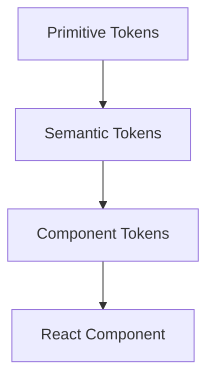

# Content authoring guide — Design Systems Interview Handbook

This file is the contract every chapter MDX file must follow. Read it fully
before writing a chapter. It exists so that 15 chapters written by different
passes (or different agents) come out looking and reading like **one
coherent book**, not 15 disconnected documents.

## 1. Where chapters live

Every chapter is one file at:

```
src/content/chapters/<slug>.mdx
```

The exact slug, order, title, part and description for every chapter is
already fixed in `src/lib/chapters.ts` (`CHAPTERS` array) — **do not invent
new slugs or reorder chapters**. Look up your chapter's `slug`, `title`,
`part`, `description` and `topics` in that file before you start; the topics
array is the required coverage list for that chapter.

## 2. File header

Every MDX file starts with a metadata export (this is the `@next/mdx` way
of doing frontmatter — do NOT use `---` YAML frontmatter, it is not parsed):

```mdx
export const metadata = {
  title: "2. Design Tokens",
  description: "Primitive, semantic, component and alias tokens; token hierarchy; Style Dictionary; cross-platform theming.",
};

# 2. Design Tokens
```

The `#` H1 immediately after should restate the chapter's `title` from
`chapters.ts` verbatim. Do not add any other content before the H1 —
except the `## Quick Glance` section described in §4, which comes
immediately after the H1.

## 3. Components available in every MDX file (no import needed)

These are globally registered in `src/mdx-components.tsx` — just use the
JSX tag directly in the `.mdx` file:

### `<Mermaid>` — architecture / relationship diagrams

Write a normal fenced code block with the `mermaid` language tag — the
build pipeline automatically converts it into a rendered diagram:

````mdx

````

Use Mermaid for every architecture, data-flow, token-hierarchy, or
decision-tree diagram called for by the spec. Prefer `graph TD`/`graph LR`,
`sequenceDiagram`, `classDiagram`, or `flowchart` as appropriate. Keep
diagrams readable — 5 to 12 nodes is the sweet spot; split into two diagrams
rather than cramming 20 nodes into one.

### `<Callout type="..." title="...">` — asides

```mdx
<Callout type="warning" title="A common trap">
  Combining old and new feature sets often performs **worse** than either
  alone — the old features add noise the model has to learn to ignore.
</Callout>
```

`type` is one of `info` (default), `tip`, `warning`, `danger`. Use `danger`
specifically for "Common Mistakes" call-outs, `warning` for tradeoff
gotchas, `tip` for best practices, `info` for general asides. Don't overuse
callouts — reserve them for things that deserve visual separation, not
every paragraph.

### `<InterviewQuestion q="...">` and `<ManagerQuestion q="...">`

Used for the **Interview Questions** and **Manager-Level Questions**
sections. Every question card's children MUST include all five of these
labeled paragraphs, in this order, using `**Label:**` bold-prefix markdown
(not headings):

```mdx
<InterviewQuestion q="Why would a design system team choose a headless component library over a fully-styled one?">
  **What the interviewer is testing:** Whether you understand the
  separation of behavior from presentation and can articulate it as an
  architectural tradeoff, not just a stylistic preference.

  **Poor answer:** "Headless is more modern and flexible."

  **Good answer:** Explains that headless components own state/behavior/
  a11y while consumers own markup and styling, citing Radix or React Aria.

  **Excellent senior answer:** All of the above, plus: names the actual
  cost (consumers must do their own styling work, higher initial adoption
  friction), states when you'd choose a styled system instead (small team,
  single brand, speed over flexibility), and ties it back to the org's
  actual constraint (multi-brand, multi-framework consumers).

  **Common mistakes:** Treating "headless" as a buzzword without being able
  to explain what state/behavior it actually externalizes; not knowing a
  real example (Radix UI, React Aria, Headless UI, Downshift).
</InterviewQuestion>
```

Regular markdown tables, code fences (any language other than `mermaid`),
bold/italic, ordered/unordered lists, and blockquotes all work normally and
are already styled — just write standard MDX/GFM markdown for those.

## 4. Required chapter structure

Every chapter MUST use these H2 sections, in this order (H2 = `##`). Use
H3 (`###`) for sub-topics within a section — e.g. one H3 per topic in the
chapter's `topics` list where it makes sense to break things out.

0. `## Quick Glance` — comes right after the H1, before `## Definition`.
   This is the pre-interview skim section: a bulleted cheat-sheet, NOT
   prose. 6–10 short bullets, each one fact or one line, covering: what
   this chapter is about in one line, the 3–5 things most likely to come
   up in an interview, and any "if they ask X, say Y" one-liners. Someone
   re-reading the chapter 10 minutes before an interview should be able to
   read only this section and still sound prepared. No paragraphs, no
   sub-bullets more than one level deep, plain words only (see §7).
1. `## Definition`
2. `## Problem Statement`
3. `## Why Does This Exist?`
4. `## Historical Context`
5. `## How It Works Internally`
6. `## Architecture` — must contain at least one `<Mermaid>` diagram
7. `## Real-World Example`
8. `## Implementation Example` — production-grade React + TypeScript code,
   not toy examples (see §5)
9. `## Advantages`
10. `## Disadvantages`
11. `## Alternatives` — comparison table required if 2+ alternatives exist
    (see §6 for the comparison table contract)
12. `## Tradeoffs`
13. `## Performance Considerations`
14. `## Scalability Considerations`
15. `## Common Mistakes` — use `<Callout type="danger">` for each mistake
16. `## Best Practices`
17. `## Interview Questions` — 4 to 6 `<InterviewQuestion>` cards
18. `## Manager-Level Questions` — 2 to 4 `<ManagerQuestion>` cards
19. `## Summary` — dense recap, 150–300 words, plus a **"Key takeaways"**
    bullet list of 4–6 items

If a chapter's topic list logically spans multiple of these sections at
once (e.g. Chapter 9's Monorepo comparisons), fold the specific tool-by-tool
breakdown into `## Alternatives` and `## Tradeoffs` rather than skipping
the template.

## 5. Code examples

- Default to **TypeScript + React** (functional components, hooks).
- Use realistic, production-shaped code: real prop names, real edge cases
  (loading/error/empty states), real accessibility attributes — not
  `<Foo />`/`<Bar />` placeholders.
- Every non-trivial code block gets a one-line comment above it in prose
  explaining *why* this shape, not just *what* it does.
- Prefer complete, runnable-looking snippets (imports included) over
  fragments when demonstrating an API design.

## 6. Comparison tables (`## Alternatives`)

Whenever the chapter compares 2+ tools/approaches (e.g. Styled Components
vs Vanilla Extract vs Panda vs Tailwind), build a markdown table with (at
minimum) these rows down the side or columns across — pick whichever
orientation reads better for that comparison, but cover every one of these
dimensions:

- What problem it solves
- Why it was created
- Performance
- Developer experience
- Learning curve
- Community / ecosystem support
- Maintenance burden
- Enterprise suitability
- When to choose it
- When NOT to choose it

Follow the table with 2-4 prose paragraphs on **why large companies
(FAANG/product companies) choose one over another** — this is required by
the brief, don't skip it.

## 7. Voice and depth

- Write as a senior/staff engineer explaining to another senior engineer
  who is smart but has never worked on a design system specifically.
  Never explain basic React/TS syntax; do explain design-systems-specific
  concepts from first principles.
- **Every concept starts with the problem it solves**, then the concept,
  then how it works, then tradeoffs. Never define a term without first
  saying why anyone needed it.
- Always state the alternatives and why one is usually chosen over another
  in practice at scale (cite real companies/products by name where the
  chapter's topic list mentions them, e.g. Material, Polaris, Carbon,
  Spectrum, Radix).
- Avoid filler and hedging ("it depends", "there are many ways") without
  immediately following with the concrete answer for the common case.
- Target length: **6,000–12,000 words** for the whole chapter file
  (including code blocks). This is a long-form reference chapter, not a
  blog post — go deep. Err toward the higher end for chapters with many
  `topics` entries (e.g. Chapter 3, 6, 9).

### Plain English (required)

This is a study guide someone reads under time pressure, often the night
before an interview — depth is required, but density for its own sake is
not. Apply all of these:

- Short sentences. One idea per sentence. If a sentence needs a comma to
  hold two ideas, it's almost always two sentences.
- Plain, common words over fancy ones: use "use" not "utilize", "help"
  not "facilitate", "show" not "demonstrate", "start" not "commence".
  There's no bonus for a bigger word that means the same thing.
- The first time a jargon term or acronym appears in a chapter, define it
  in the same sentence or the next one, in plain words — don't assume the
  reader already knows it even if it was defined in an earlier chapter.
- Prefer concrete examples over abstract description. "A Button used in
  4,000 places" beats "components used at scale."
- Break up any paragraph longer than ~4 sentences. If a paragraph is
  really a list of things, make it a bulleted list instead of a paragraph.
- Still keep everything technically precise — "plain English" means
  simpler sentences and words, not vaguer or less accurate content. Never
  cut a real technical detail just to shorten a sentence.

## 8. Cross-references

Link to other chapters with a normal relative markdown link:
`[design tokens](/chapters/design-tokens)`. Use the exact `slug` values
from `chapters.ts`. Cross-reference liberally where a concept from another
chapter is mentioned in passing (e.g. Chapter 3 mentioning tokens should
link to Chapter 2) — this is what makes it feel like one handbook.

## 9. What NOT to do

- Don't use `---` frontmatter (unsupported, will break the build).
- Don't `import` the Mermaid/Callout/InterviewQuestion/ManagerQuestion
  components — they're global, an explicit import will actually break
  the build (duplicate identifier).
- Don't wrap the whole chapter in a single giant component — write plain
  MDX (markdown + the components above).
- Don't skip any of the 19 required `##` sections.
- Don't use `<h2>`/`<h3>` HTML tags — use markdown `##`/`###` so
  rehype-slug can generate anchor ids for the table of contents.
- Don't invent a different chapter title than the one in `chapters.ts`.

## 10. Before you finish

Re-read your `topics` list from `chapters.ts` and confirm every single
topic is covered somewhere in the chapter body. Re-read §4 and confirm all
20 sections are present with the exact `##` headings listed (verbatim
text, since some tooling may key off them later), including `## Quick
Glance` right after the H1. Confirm at least one `<Mermaid>` diagram
exists in `## Architecture`. Confirm interview/manager question counts
meet the minimums in §4. Read your own prose back and confirm it follows
§7's Plain English rules — no sentence should make a reader stop and
re-read it.
