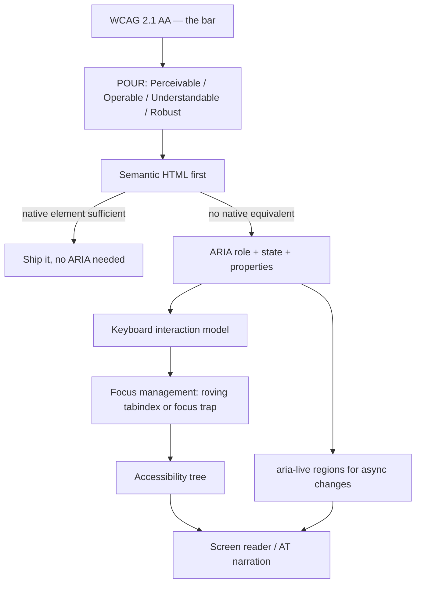

export const metadata = {
  title: "5. Accessibility",
  description:
    "WCAG and ARIA from first principles, keyboard navigation, focus management and focus traps, color contrast, reduced motion, and building accessible dialogs, menus, tabs and tree views.",
};

# 5. Accessibility

## Quick Glance

- Accessibility means components that work correctly with a keyboard, a screen reader, or an OS setting like reduced motion — not just how the component looks.
- The core leverage argument: fix focus-trapping once inside `Dialog`, and every consumer inherits the fix forever. This is why accessibility belongs in the design system, not per-feature teams.
- ARIA's first rule: if a native HTML element already has the behavior you need, use it. ARIA adds semantics (what a screen reader announces), it does not add behavior (focusability, keyboard activation) — that still has to be built by hand.
- `role="button"` on a `div` is a code smell: it doesn't grant Tab focusability, Enter/Space activation, or correct Tab order. A real `<button>` restyled with CSS is almost always cheaper and more correct.
- Roving tabindex is the standard pattern for composite widgets (Menu, Tabs, Tree View): exactly one item has `tabIndex={0}`, the rest have `tabIndex={-1}`, and arrow keys move which one is active. Tab moves focus out of the widget; arrow keys move within it.
- A correct Dialog needs all four: focus moves inside on open, Tab is trapped inside it, Escape closes it, and focus is restored to the trigger element on close. Missing focus restoration is the most common gap.
- WCAG AA contrast: 4.5:1 for normal text, 3:1 for large text (18pt+/24px+, or bold 14pt+/18.66px+) and for meaningful UI elements like icons and borders. This is computed from relative luminance, not eyeballed.
- Automated tools (axe-core, Storybook's a11y addon) only catch roughly 30-40% of real WCAG failures — treat a clean scan as a floor, never proof of accessibility. Manual keyboard and screen reader testing (VoiceOver, NVDA, JAWS) is still required.
- Most new design systems build interactive widgets on Radix UI or React Aria rather than hand-rolling focus traps and roving tabindex — reserve building from scratch for genuinely novel interactions.

## Definition

Accessibility, in a design system, means building components whose
*behavior* — not just their look — works correctly for people who use a
keyboard instead of a mouse, a screen reader instead of a screen, or an
operating-system setting like reduced motion or high contrast instead of
the default rendering. It's measured against WCAG (Web Content
Accessibility Guidelines) and built using semantic HTML and ARIA
(Accessible Rich Internet Applications — a spec for describing custom
widgets to assistive technology).

Critically for this chapter, accessibility is an *architectural* property
of a component, not a checklist you run after it ships. A `Dialog` that
traps focus, restores it on close, and is announced correctly by a screen
reader isn't a "more accessible version" of a dialog. A dialog that skips
those things is simply broken for a real, sizeable group of users — the
same way a dialog that throws a JavaScript error for some users would be
considered broken.

## Problem Statement

Accessibility bugs are really two problems that make each other worse.
First, they're invisible to most engineers testing a feature the normal
way: click through it with a mouse, look at it, ship it. A missing
`aria-label`, a focus trap that doesn't restore focus on close, a custom
dropdown that can't be driven with arrow keys — none of these show up in a
visual QA pass. Second, when these bugs do get caught, it's almost always
per feature, per team, after the component has already shipped. That means
the same class of bug (an unlabeled icon button, a modal that doesn't trap
focus) gets independently rebuilt, and independently broken, by every team
that builds their own version of the same pattern.

<Callout type="tip" title="The core leverage argument">
  This is the strongest argument for putting accessibility work inside a
  design system rather than treating it as each feature team's own job:
  **fix focus-trapping once, correctly, inside `Dialog`, and every consumer
  of `Dialog` — today and in every future feature built on it — gets the
  fix for free.** The alternative is teaching every feature team the
  WAI-ARIA Authoring Practices for dialogs, trusting every team to get it
  right, and re-auditing every team's implementation forever. A design
  system turns an open-ended, org-wide liability into one auditable,
  one-time investment. This is why accessibility work is consistently one
  of the highest-return investments a design system team can make, and why
  it should be treated as core architecture — not a "nice to have" backlog
  item.
</Callout>

The problem this chapter solves is narrower than "how do I make a webpage
accessible." It's: "what exactly does a design system need to get right,
once, at the primitive layer, so every consuming team's product is
accessible by default, instead of relying on each team's diligence?"

## Why Does This Exist?

Accessibility exists as a discipline because the web's native elements
(`<button>`, `<select>`, `<a>`) come with keyboard operability, focus
management, and screen reader semantics built in — free, from the browser.
The moment a team reaches for a custom-styled `<div>` with an `onClick`
handler instead, all of that free behavior disappears, and someone has to
rebuild it by hand. This happens constantly in design systems specifically
because visual requirements — a dropdown that looks nothing like a native
`<select>`, a toggle that looks nothing like a checkbox — push teams away
from native elements toward custom markup. And custom markup is exactly
where all that free browser behavior gets lost or has to be reimplemented.
Design systems exist partly to fix this: give teams a `<Select>` that
*looks* like the Figma spec but *behaves* like the native element
underneath, so nobody downstream has to trade visual fidelity for
accessibility.

Legal and regulatory pressure is the second real driver. The ADA (in the
US), the European Accessibility Act, and similar laws have produced real
litigation risk for inaccessible commercial products. This isn't a
hypothetical for large consumer or enterprise-software companies, and it's
a big reason accessibility budget gets approved at the executive level in a
way other quality investments sometimes don't.

## Historical Context

Section 508 (US federal accessibility law, 1998, updated significantly in
2017) and WCAG 1.0 (1999) predate modern component-driven frontend
development entirely — they were written for static HTML documents. WCAG
2.0 (2008) and 2.1 (2018) extended the guidelines to cover dynamic,
scripted interfaces. That's when ARIA (first published as a W3C spec in
2008, stabilized through the 2010s) became necessary: ARIA exists
specifically to describe the semantics of custom, JavaScript-driven widgets
that plain HTML has no vocabulary for — a combobox, a tree, a tab panel.
The WAI-ARIA Authoring Practices Guide (APG) — the standard reference for
"how do I build an accessible Dialog/Menu/Tabs/etc." — has been refined
ever since, and it's the primary source every serious design system checks
its accessible-pattern implementations against.

The design-systems-specific history matters too. Early large design systems
(Bootstrap's original dropdown/modal JavaScript, jQuery UI) had
accessibility bolted on unevenly, patched over years as bugs were reported.
The generation of design systems and headless libraries built from roughly
2018 onward — Reach UI (Ryan Florence, since folded into Radix), Radix UI,
React Aria (Adobe), Headless UI, Ariakit — were built accessibility-first
from day one, using the APG patterns as the actual specification for each
component's behavior, not a retrofit. This is why the default
recommendation for a new design system's interactive primitives today is
almost always "build on one of these, don't hand-roll focus trapping and
roving tabindex from scratch" — see the [Alternatives](#alternatives)
section below.

## How It Works Internally

Four mechanisms do almost all of the work covered in this chapter: the
accessibility tree, ARIA's role/state/property model, focus management, and
how assistive technology consumes live regions.

**The accessibility tree.** The browser builds a parallel tree alongside
the DOM — the accessibility tree — by computing, for every element: an
accessible **role** (what kind of thing is it — button, checkbox, dialog),
an accessible **name** (what should it be announced as — from text
content, `aria-label`, `aria-labelledby`, or an associated `<label>`), and
an accessible **state** (checked, expanded, disabled, selected). Screen
readers query *this* tree, not the visual DOM. Every ARIA attribute you add
either sets a slot in this tree directly (`role`, `aria-label`) or changes
how the browser computes one (`aria-hidden` removes a whole subtree from
the tree). This is why two visually identical elements — a real `<button>`
and a `<div onClick>` — produce a completely different accessibility tree
node, unless you manually give the `div` `role="button"`, `tabIndex={0}`,
and keyboard handlers to match.

**ARIA's first rule.** The WAI-ARIA spec says this explicitly: *if a native
HTML element or attribute already has the semantics and behavior you need,
use it instead of repurposing an element and adding ARIA.* ARIA can
describe a role, but it cannot grant behavior. Adding `role="button"` to a
`div` tells assistive technology "announce this as a button," but the
browser doesn't thereby make it focusable, or make Enter/Space activate it,
or put it in Tab order. All of that still has to be added back by hand.
This is why `role="button"` on a `div` is a code smell in any component
review — it's almost always cheaper and more correct to render an actual
`<button>` and override its default styles than to reconstruct a button's
behavior from ARIA plus manual event handlers.

**Focus management.** The browser tracks exactly one focused element at a
time (`document.activeElement`), and only focusable elements (native
interactive elements, or anything with an explicit `tabindex`) can receive
it. Two focus mechanisms matter for composite widgets: **Tab order** moves
focus between *independent* interactive elements (moving from a dialog to
the field after it), and **roving tabindex** (or `aria-activedescendant`)
moves focus *within* a single composite widget (moving between items in a
menu) using arrow keys instead of Tab — because Tab is reserved for leaving
the widget entirely. Getting this distinction right is the difference
between a menu that behaves like every other menu a screen reader user has
ever used, and one that traps them or skips content.

**Live regions and AT consumption.** Screen readers narrate the
accessibility tree on demand — as focus moves, as the user navigates — but
they don't automatically announce content that changes *without* a focus
change: a toast notification appearing, a form validation error showing up
after submit, a loading spinner resolving. `aria-live` regions solve this.
Marking a container `aria-live="polite"` (or `"assertive"` for urgent
content) tells the browser to notify assistive technology whenever that
container's content changes, even with no focus move, and the AT queues an
announcement for it. This is the mechanism behind every "accessible toast"
or "accessible form error" implementation.

## Architecture



Read this as the decision path every interactive design-system component
should be checked against, top to bottom: start from the WCAG bar, prefer a
native element that already clears it, and only build the ARIA + keyboard
+ focus-management stack by hand when no native element covers the needed
interaction. At that point, every layer (role/state, keyboard model, focus
management) has to be deliberately built to feed a correct accessibility
tree.

## Real-World Example

Radix UI's `Dialog` primitive is the most-cited reference implementation in
the industry for this chapter's Dialog pattern. It handles focus-trapping
internally, restores focus to the triggering element on close, sets
`aria-modal="true"`, and wires up `aria-labelledby`/`aria-describedby`
automatically from its `Dialog.Title`/`Dialog.Description` sub-components,
and closes on Escape — all without the consumer writing any of that logic
themselves, only supplying markup and styles. GitHub's Primer design system
and Shopify's Polaris both publish explicit accessibility documentation per
component (keyboard interaction tables, ARIA usage notes) as a first-class
part of their docs, not an afterthought — Polaris in particular documents
exact keyboard shortcuts per composite widget in the same reference table
as its props. Adobe's Spectrum (via React Aria, referenced further in
[Chapter 3](/chapters/component-architecture) and
[Chapter 14](/chapters/case-studies)) is built by an accessibility-focused
team from the ground up, and it's frequently the reference other design
systems' engineers consult when implementing a pattern the APG covers only
loosely, like a combobox with options that load asynchronously.

## Implementation Example

### Roving tabindex — full working Menu

Roving tabindex means exactly one item in the composite widget has
`tabIndex={0}` (the "current" item, reachable by Tab) and every other item
has `tabIndex={-1}` (in the DOM, focusable programmatically, but skipped by
Tab). Arrow keys move which item holds `tabIndex={0}` and call `.focus()`
on it directly.

```tsx
// menu.tsx
// Roving tabindex is required here (rather than letting every item be
// independently Tab-focusable) so Tab moves focus OUT of the menu in one
// press, matching how every native menu behaves — arrow keys own
// intra-widget navigation, Tab owns leaving the widget.
import {
  createContext,
  useContext,
  useId,
  useRef,
  useState,
  type KeyboardEvent,
  type ReactNode,
} from "react";

type MenuContextValue = {
  activeIndex: number;
  setActiveIndex: (index: number) => void;
  itemRefs: React.MutableRefObject<(HTMLButtonElement | null)[]>;
  registerItem: (index: number) => void;
  itemCount: React.MutableRefObject<number>;
};

const MenuContext = createContext<MenuContextValue | null>(null);

function useMenuContext(component: string) {
  const ctx = useContext(MenuContext);
  if (!ctx) throw new Error(`<Menu.${component}> must be used inside <Menu.Root>`);
  return ctx;
}

export function Root({ label, children }: { label: string; children: ReactNode }) {
  const [activeIndex, setActiveIndex] = useState(0);
  const itemRefs = useRef<(HTMLButtonElement | null)[]>([]);
  const itemCount = useRef(0);
  const menuId = useId();

  return (
    <MenuContext.Provider
      value={{
        activeIndex,
        setActiveIndex,
        itemRefs,
        registerItem: (index) => {
          itemCount.current = Math.max(itemCount.current, index + 1);
        },
        itemCount,
      }}
    >
      <div role="menu" aria-label={label} id={menuId} className="menu">
        {children}
      </div>
    </MenuContext.Provider>
  );
}

export function Item({
  index,
  onSelect,
  children,
}: {
  index: number;
  onSelect: () => void;
  children: ReactNode;
}) {
  const { activeIndex, setActiveIndex, itemRefs, registerItem, itemCount } =
    useMenuContext("Item");
  registerItem(index);

  const handleKeyDown = (event: KeyboardEvent<HTMLButtonElement>) => {
    const count = itemCount.current;
    if (event.key === "ArrowDown") {
      event.preventDefault();
      const next = (activeIndex + 1) % count;
      setActiveIndex(next);
      itemRefs.current[next]?.focus();
    } else if (event.key === "ArrowUp") {
      event.preventDefault();
      const next = (activeIndex - 1 + count) % count;
      setActiveIndex(next);
      itemRefs.current[next]?.focus();
    } else if (event.key === "Home") {
      event.preventDefault();
      setActiveIndex(0);
      itemRefs.current[0]?.focus();
    } else if (event.key === "End") {
      event.preventDefault();
      setActiveIndex(count - 1);
      itemRefs.current[count - 1]?.focus();
    } else if (event.key === "Enter" || event.key === " ") {
      event.preventDefault();
      onSelect();
    }
  };

  return (
    <button
      ref={(node) => {
        itemRefs.current[index] = node;
      }}
      role="menuitem"
      tabIndex={index === activeIndex ? 0 : -1}
      onKeyDown={handleKeyDown}
      onClick={onSelect}
      onFocus={() => setActiveIndex(index)}
      className="menu__item"
    >
      {children}
    </button>
  );
}
```

### Focus trap and restoration — full working Dialog

```tsx
// dialog.tsx
// A dialog must (1) move focus inside itself on open, (2) trap Tab/Shift+Tab
// within its own focusable elements so focus can't silently leave to
// content behind the modal overlay, (3) close on Escape, and (4) restore
// focus to whatever triggered it on close — losing any one of these four
// is a WCAG 2.4.3 (focus order) and 2.1.2 (no keyboard trap escape) failure.
import { useEffect, useRef, type ReactNode } from "react";

const FOCUSABLE_SELECTOR =
  'button:not([disabled]), [href], input:not([disabled]), select:not([disabled]), textarea:not([disabled]), [tabindex]:not([tabindex="-1"])';

export function Dialog({
  isOpen,
  onClose,
  titleId,
  descriptionId,
  children,
}: {
  isOpen: boolean;
  onClose: () => void;
  titleId: string;
  descriptionId?: string;
  children: ReactNode;
}) {
  const containerRef = useRef<HTMLDivElement>(null);
  const previouslyFocusedRef = useRef<HTMLElement | null>(null);

  useEffect(() => {
    if (!isOpen) return;

    // Step 1: remember what had focus so we can restore it on close.
    previouslyFocusedRef.current = document.activeElement as HTMLElement;

    // Step 2: move focus inside the dialog immediately.
    const container = containerRef.current;
    const focusables = container?.querySelectorAll<HTMLElement>(FOCUSABLE_SELECTOR);
    (focusables?.[0] ?? container)?.focus();

    // Step 3 + 4: trap Tab within the dialog, close on Escape.
    function handleKeyDown(event: KeyboardEvent) {
      if (event.key === "Escape") {
        event.preventDefault();
        onClose();
        return;
      }
      if (event.key !== "Tab" || !container) return;

      const nodes = Array.from(container.querySelectorAll<HTMLElement>(FOCUSABLE_SELECTOR));
      if (nodes.length === 0) return;
      const first = nodes[0];
      const last = nodes[nodes.length - 1];

      if (event.shiftKey && document.activeElement === first) {
        event.preventDefault();
        last.focus();
      } else if (!event.shiftKey && document.activeElement === last) {
        event.preventDefault();
        first.focus();
      }
    }

    document.addEventListener("keydown", handleKeyDown);
    return () => {
      document.removeEventListener("keydown", handleKeyDown);
      // Step 5: restore focus to the trigger on unmount/close.
      previouslyFocusedRef.current?.focus();
    };
  }, [isOpen, onClose]);

  if (!isOpen) return null;

  return (
    <div className="dialog-overlay" onClick={onClose} aria-hidden="false">
      <div
        ref={containerRef}
        role="dialog"
        aria-modal="true"
        aria-labelledby={titleId}
        aria-describedby={descriptionId}
        tabIndex={-1}
        className="dialog"
        onClick={(event) => event.stopPropagation()}
      >
        {children}
      </div>
    </div>
  );
}
```

<Callout type="tip" title="Don't hand-roll this in application code">
  The Dialog above is shown in full on purpose — understanding the
  mechanics matters for interviews and debugging. But in a real design
  system, build this on a maintained primitive (Radix UI's `Dialog`, React
  Aria's `useDialog` + `usePreventScroll` + `FocusScope`, or the
  `focus-trap` / `focus-trap-react` library for the trapping piece alone).
  Focus trapping has enough edge cases — dynamically added/removed
  focusable children, iframes, `contenteditable` regions — that a
  battle-tested library will catch cases a first-pass implementation
  misses.
</Callout>

### Accessible form field with live-region error announcement

```tsx
// text-field.tsx
// role="alert" on the error message gives it an implicit aria-live="assertive"
// — the moment validation adds this element to the DOM, AT announces it
// without requiring focus to move there, which matters because the user's
// focus is usually still in the input, not on the error text.
import { useId } from "react";

export function TextField({
  label,
  value,
  onChange,
  error,
  required,
}: {
  label: string;
  value: string;
  onChange: (value: string) => void;
  error?: string;
  required?: boolean;
}) {
  const inputId = useId();
  const errorId = `${inputId}-error`;

  return (
    <div className="text-field">
      <label htmlFor={inputId}>
        {label}
        {required && <span aria-hidden="true"> *</span>}
      </label>
      <input
        id={inputId}
        value={value}
        onChange={(event) => onChange(event.target.value)}
        required={required}
        aria-required={required || undefined}
        aria-invalid={Boolean(error)}
        aria-describedby={error ? errorId : undefined}
        className={error ? "text-field__input text-field__input--error" : "text-field__input"}
      />
      {error && (
        <p id={errorId} role="alert" className="text-field__error">
          {error}
        </p>
      )}
    </div>
  );
}
```

### `prefers-reduced-motion`-gated animation tokens

```tsx
// motion-tokens.css
:root {
  --motion-duration-fast: 120ms;
  --motion-duration-base: 200ms;
  --motion-easing-standard: cubic-bezier(0.2, 0, 0, 1);
}

/* Every component that animates reads these tokens, never a literal
   duration — so gating them here gates every animation in the system in
   one place, instead of requiring every component author to remember to
   add their own media query. */
@media (prefers-reduced-motion: reduce) {
  :root {
    --motion-duration-fast: 0ms;
    --motion-duration-base: 0ms;
  }
}
```

```tsx
// use-reduced-motion.ts
// For animations driven by JS (e.g. a spring library) rather than pure
// CSS transitions, components need the boolean directly, not just the
// token — this hook is the shared source of truth so every component
// checks the same media query the same way.
import { useEffect, useState } from "react";

export function usePrefersReducedMotion(): boolean {
  const [prefersReduced, setPrefersReduced] = useState(false);

  useEffect(() => {
    const mediaQuery = window.matchMedia("(prefers-reduced-motion: reduce)");
    setPrefersReduced(mediaQuery.matches);
    const listener = (event: MediaQueryListEvent) => setPrefersReduced(event.matches);
    mediaQuery.addEventListener("change", listener);
    return () => mediaQuery.removeEventListener("change", listener);
  }, []);

  return prefersReduced;
}
```

This ties directly into the token architecture in
[Chapter 2](/chapters/design-tokens): motion, like color and spacing,
should be its own token category — not a hardcoded value scattered across
component files — specifically so it can be gated globally like this.

### Color contrast — the actual math

WCAG 2.1's contrast requirement is a ratio between the relative luminance
(perceived brightness, computed mathematically) of the foreground and
background colors. It's computed from each color's sRGB channels using a
gamma-correction formula, then expressed as `(L1 + 0.05) / (L2 + 0.05)`,
where `L1` is the lighter color's luminance and `L2` the darker. The
practical thresholds:

- **4.5:1** — normal text (below 18pt, or below 14pt bold) against its
  background, at WCAG AA.
- **3:1** — large text (18pt+/24px+, or 14pt+/18.66px+ bold), and for
  non-text UI elements like icons, focus indicators, and input borders
  that convey meaning, at WCAG AA.
- **7:1 / 4.5:1** — the AAA equivalents of the above, rarely required for
  enterprise products but sometimes required for government/public-sector
  contracts.

```ts
// contrast.ts
// A minimal, correct implementation of the WCAG relative-luminance and
// contrast-ratio formulas — useful both as documentation of the actual
// math and as a lint-time check a token pipeline can run against every
// foreground/background token pair before publishing a release.
function channelToLinear(channel: number): number {
  const c = channel / 255;
  return c <= 0.03928 ? c / 12.92 : Math.pow((c + 0.055) / 1.055, 2.4);
}

function relativeLuminance([r, g, b]: [number, number, number]): number {
  const [rl, gl, bl] = [r, g, b].map(channelToLinear);
  return 0.2126 * rl + 0.7152 * gl + 0.0722 * bl;
}

export function contrastRatio(
  rgbA: [number, number, number],
  rgbB: [number, number, number],
): number {
  const lA = relativeLuminance(rgbA);
  const lB = relativeLuminance(rgbB);
  const [lighter, darker] = lA > lB ? [lA, lB] : [lB, lA];
  return (lighter + 0.05) / (darker + 0.05);
}

export function meetsWcagAA(ratio: number, isLargeText: boolean): boolean {
  return isLargeText ? ratio >= 3 : ratio >= 4.5;
}
```

This math is exactly why a token system's color ramp (see
[Chapter 2](/chapters/design-tokens)) can't be designed on visual taste
alone. Every semantic pairing a design system ships as a default
(`text-primary` on `surface-default`, `text-on-brand` on `brand-500`) has
to be checked against this formula and locked in as a *contract*, not a
suggestion — because a designer nudging a brand color's lightness by a few
percentage points in Figma can silently drop a previously-compliant pairing
below 4.5:1.

## Advantages

Centralizing accessibility in the design system turns an unbounded,
recurring liability — every team re-implementing and re-breaking the same
patterns — into a bounded, one-time investment with returns that keep
paying off. Every new consumer of `Dialog`, `Menu`, or `Tabs` inherits a
correct implementation without needing an accessibility specialist on their
own team. It also produces consistent behavior across the whole product
surface, which matters specifically for assistive-technology (AT) users: a
screen reader user who learns how one product's dialogs behave can trust
that behavior everywhere the same design system is used — the same way
sighted users rely on visual consistency. Centralizing also makes
accessibility auditable: one axe-core/manual-testing pass against the
design system's Storybook covers the primitive behavior for every
consumer, instead of requiring a full audit of every individual product
surface.

## Disadvantages

Correct accessibility implementations are genuinely more code and more
edge cases than the visual-only version. Focus trapping, roving tabindex,
and live-region wiring all have real complexity, and getting them wrong in
a subtle way — a focus trap that doesn't restore focus to a *dynamically
removed* trigger element, a roving tabindex that breaks when items are
added or removed at runtime — can be worse than not attempting the pattern
at all, because it creates a false sense of coverage. Centralizing also
means a bug here has an outsized blast radius, in the opposite direction
from the leverage argument above: an accessibility regression in `Dialog`
breaks every consumer's modals at once. That's exactly the reasoning that
justifies the investment, but it also raises the bar for how carefully
changes to these primitives need to be tested and reviewed. And
design-system-level accessibility work can't fully cover feature-level
responsibility: a correctly built `Dialog` primitive doesn't guarantee a
feature team writes a meaningful `aria-label`, structures heading levels
correctly, or writes accessible copy — the primitive removes one whole
class of bug, not all of them.

## Alternatives

The practical decision most design system teams face isn't "should we do
accessibility" — it's "do we build these interaction patterns ourselves, or
build on a headless accessibility-focused library and add only styling?"

| Dimension | Build from scratch | Radix UI (headless primitives) | React Aria / React Aria Components (Adobe) | Native HTML only, no custom widgets |
| --- | --- | --- | --- | --- |
| What problem it solves | Full control over every interaction detail | Unstyled, accessible interaction primitives you skin yourself | Accessible interaction *and* internationalization/AT-tested behavior, hook-first or component-first | Maximizes free browser behavior, zero custom a11y code |
| Why it was created | N/A — the default when no library is adopted | Team wanted Radix Themes-style flexibility without owning ARIA edge cases | Adobe needed AT-tested primitives across Spectrum's own huge product surface, then open-sourced it | N/A — the baseline every custom widget deviates from |
| Performance | Depends entirely on implementation quality | Small runtime, tree-shakeable per-primitive packages | Slightly heavier (broader feature set: internationalization, virtualization hooks) but tree-shakeable | Best possible — browser-native |
| Developer experience | High control, high responsibility; steep to get right | Good docs, composable API, widely used so lots of community answers | Very thorough docs, hook-based API is more work to wire up than a ready styled component | Simplest, but blocked the moment design requires custom visuals |
| Learning curve | High — WAI-ARIA APG has to be internalized per pattern | Medium — API is intuitive, but still requires understanding compound components | Medium–high — hooks require understanding what each hook is responsible for | Low |
| Community / ecosystem | N/A | Very large, default choice for many new design systems (shadcn/ui built on it) | Large, backed by Adobe, used in production by Spectrum | N/A |
| Maintenance burden | High — every browser/AT quirk is now your bug | Low — Radix absorbs upstream ARIA spec and AT-quirk fixes | Low — same, plus i18n edge cases absorbed | Lowest |
| Enterprise suitability | Only justified with a dedicated a11y engineering investment | High — proven at scale (Vercel, shadcn/ui-based products) | Very high — proven at Adobe's own scale across many products | High for simple products; insufficient once custom widgets are required |
| When to choose it | Genuinely novel interaction with no existing pattern to build on | Default choice for most new React design systems needing custom-styled widgets | When internationalization, virtualized lists, or drag-and-drop within accessible widgets are required alongside a11y | Marketing sites, content-heavy pages, anywhere native elements suffice |
| When NOT to choose it | Almost never justified for standard patterns (Dialog, Menu, Tabs, Combobox) | When you need hooks-only (no bundled markup) for a fully custom render structure | When bundle size is extremely constrained and you don't need i18n/virtualization | The moment a design spec requires a visual that native elements can't produce |

Building from scratch is rarely justified today for standard patterns.
Dialog, Menu, Tabs, Tooltip, and Combobox are all well covered by the
WAI-ARIA APG and by mature libraries, and the edge cases — focus
restoration to a removed trigger, `aria-activedescendant` versus roving
tabindex tradeoffs, right-to-left keyboard direction — have already been
debugged by teams with far more AT-testing resources than most product
companies can justify standing up internally. This is why the current
generation of design systems — shadcn/ui, Vercel's own component patterns,
most new internal enterprise systems built since roughly 2021 — build
their styled components on top of Radix UI or React Aria rather than
reimplementing ARIA patterns from scratch. Even design systems with a long
pre-existing custom implementation (older versions of Material-UI, Ant
Design) have gradually migrated toward these unstyled primitives or React
Aria's hooks under the hood over time. The build-vs-adopt calculus only
flips toward "build" when a company the size of Adobe, Google, or Microsoft
can justify a dedicated internal accessibility engineering team whose
full-time job is exactly this. Most companies are better served putting
that same engineering time into design-system-specific integration and
token-driven contrast enforcement, instead of re-deriving what Radix or
React Aria already ship.

## Tradeoffs

The core tradeoff in this chapter is upfront implementation cost versus
downstream liability. A correct `Dialog` — with full focus trapping, live
regions wired everywhere they're needed, and roving tabindex on every
composite widget — takes measurably longer to build than a visually
equivalent version without any of that. But the alternative isn't "ship
faster." It's "ship a liability every consuming team quietly inherits,
until an audit, a lawsuit, or a real user's bug report surfaces it." The
second tradeoff is `role="button"`-on-a-div convenience versus semantic
correctness: reaching for ARIA to make a non-semantic element "look right"
to a screen reader is almost always more code and more edge cases than
using the native element and overriding its visual style. CSS can restyle
a `<button>` into almost anything; ARIA cannot retrofit real keyboard
behavior onto a `<div>`. And automated testing versus manual testing is a
real engineering-time tradeoff: automated tools are fast and catch a
meaningful floor of issues, but as covered below, they structurally cannot
catch everything, and skipping manual keyboard/screen-reader testing to
save time produces false confidence — arguably worse than no testing at
all, because it hides the gap instead of flagging it.

## Performance Considerations

Accessibility and performance intersect in a few concrete ways relevant to
a design system specifically. Live regions (`aria-live`) should be placed
sparingly and deliberately — a page with many overlapping live regions, or
a live region whose content updates at high frequency (a progress
percentage updating every 100ms), creates a genuinely overwhelming
experience for AT users. It's a real regression, distinct from any visual
performance metric but just as real. Focus-trap implementations that
re-query the DOM for focusable elements on every keystroke (instead of
caching the list and invalidating it only on relevant DOM changes) can
introduce measurable input lag in a dialog with many form fields — this is
a real profiling target, not a hypothetical. And screen readers re-parse
the accessibility tree on every DOM change, so components that re-render
large subtrees unnecessarily (see [Chapter 4](/chapters/react-architecture)
on context-driven re-render fan-out) impose a real, if less commonly
measured, cost on AT users' navigation smoothness — on top of the visual
jank sighted users experience from the same root cause.

## Scalability Considerations

At small scale, one team can hold the entire set of accessibility patterns
in their head and manually check each feature. That stops working the
moment a design system has enough consumers that most product engineers
building on it have never read the WAI-ARIA APG — and shouldn't need to.
That's the normal state for any design system past its first year. Scaling
accessibility means investing in things that catch regressions *without*
requiring every consuming engineer to become an accessibility expert:
CI-enforced `jest-axe` checks on every component (see Testing below),
Storybook's a11y addon surfaced directly in the same PR review flow
engineers already use, and documented keyboard-interaction tables per
component so a consuming engineer can self-serve "does this widget support
arrow-key navigation" instead of filing a question. It also means treating
accessibility regressions with the same severity as functional bugs or
visual regressions in the design system's own release process (see
[Chapter 11](/chapters/governance)) — an accessibility regression that
ships in a minor version and silently breaks focus management for every
`Dialog` consumer is not a lower-severity bug than a visual one, even
though it's often treated that way in practice.

## Common Mistakes

<Callout type="danger" title="Using role='button' on a div instead of a real button">
  ARIA adds semantics, not behavior. `role="button"` tells a screen reader
  to announce the element as a button, but the browser doesn't thereby add
  keyboard focusability, Enter/Space activation, or correct Tab order —
  all of that has to be manually rebuilt, and it's almost always cheaper
  and more correct to use a real `<button>` and restyle it with CSS.
</Callout>

<Callout type="danger" title="Focus trap that doesn't restore focus on close">
  Trapping focus inside a dialog while it's open is only half the pattern.
  If focus isn't returned to the element that triggered the dialog when it
  closes, a keyboard user's focus silently lands on `<body>` (or wherever
  the browser defaults to), and they have to re-navigate the entire page
  from scratch to find where they were.
</Callout>

<Callout type="danger" title="Decorative icons without aria-hidden, or informative icons without a label">
  An icon-only button (a close "X", a settings gear) with no `aria-label`
  is announced as "button" with no other information, which is useless to
  a screen reader user. Conversely, decorative icons that sit next to
  already-visible text (an icon before a label) should be `aria-hidden="true"`
  so they aren't redundantly announced.
</Callout>

<Callout type="danger" title="Treating a passing axe-core scan as 'accessible'">
  Automated tools check for programmatically detectable violations — missing
  alt text, insufficient contrast, invalid ARIA attribute values — which
  covers roughly 30-40% of real-world WCAG failures. They cannot tell you
  whether a custom widget's keyboard interaction model actually matches
  user expectations, whether focus order is logical, or whether a screen
  reader announcement is genuinely comprehensible. A 100% axe-core pass
  with zero manual keyboard testing is not an accessible component.
</Callout>

<Callout type="danger" title="Building animations without a prefers-reduced-motion gate">
  Vestibular disorders can make parallax, large-scale motion, and
  auto-playing transitions genuinely painful or disorienting, not just
  unpleasant. Gating motion tokens globally (as shown above) is a single
  fix; retrofitting every individual animation later is not.
</Callout>

## Best Practices

- Default to the native element every time one exists (`<button>`,
  `<select>`, `<a>`, `<input type="checkbox">`) and only reach for custom
  ARIA-driven markup when the design genuinely requires an interaction
  native HTML cannot express.
- Build custom composite widgets (Menu, Tabs, Tree View, Combobox) on a
  maintained headless library (Radix UI, React Aria) rather than hand-rolling
  roving tabindex and focus trapping from scratch, unless your org has a
  dedicated accessibility engineering function that can own the ongoing
  maintenance burden.
- Wire `aria-live` regions deliberately and sparingly — one region per
  logical notification channel (toasts, form errors), not one per
  component instance.
- Treat color-token pairings as a contract checked by the formula in this
  chapter, enforced in the token pipeline (see
  [Chapter 2](/chapters/design-tokens)), not a manual visual check per
  release.
- Gate every animation and transition token behind `prefers-reduced-motion`
  at the token layer, so new components inherit the gate automatically
  rather than requiring every component author to remember it.
- Run `jest-axe` (or equivalent) in CI on every component, and require the
  Storybook a11y addon to be clean before merge — but treat both as a
  floor, not a substitute for periodic manual keyboard and screen-reader
  testing (VoiceOver, NVDA, JAWS) on the actual composite widgets.
- Document the keyboard interaction model (which keys do what) per
  composite component, next to its props documentation — this is public
  API surface, not an implementation detail.

## Interview Questions

<InterviewQuestion q="Why should accessibility work live in the design system rather than be handled per-feature by each product team?">
  **What the interviewer is testing:** Whether the candidate understands
  the leverage argument for centralization, not just "accessibility is
  important" platitudes.

  **Poor answer:** "It's important for compliance, so it should be
  centralized."

  **Good answer:** Says fixing a pattern once in a shared `Button`/`Dialog`
  benefits every consumer automatically.

  **Excellent senior answer:** Frames it explicitly as leverage: an
  accessibility bug fixed once in a primitive is fixed for every current
  and future consumer, whereas per-feature ownership means the same class
  of bug (missing focus trap, unlabeled icon button) gets independently
  rebuilt and independently broken by every team, forever, with no way to
  audit it centrally. Adds that this doesn't remove all feature-level
  responsibility — copy, heading structure, and content-level a11y still
  belong to feature teams.

  **Common mistakes:** Treating it as purely a compliance/legal argument
  without articulating the engineering-leverage argument, which is the
  stronger and more durable case.
</InterviewQuestion>

<InterviewQuestion q="What's the first rule of ARIA, and why does role='button' on a div usually indicate a design system code smell?">
  **What the interviewer is testing:** First-principles understanding that
  ARIA describes semantics, not behavior.

  **Poor answer:** "ARIA makes things accessible, so more ARIA is better."

  **Good answer:** States the first rule — don't use ARIA if a native
  element already provides the needed semantics and behavior.

  **Excellent senior answer:** Explains precisely what's missing when you
  add `role="button"` to a div — no automatic focusability, no Enter/Space
  activation, no default Tab order — and that all of it has to be
  hand-rebuilt, which is strictly more code than using a real `<button>`
  and restyling it with CSS, for equivalent or better correctness.

  **Common mistakes:** Believing ARIA attributes grant behavior in
  addition to semantics; not knowing the specific list of things missing
  from a bare `role="button"` div.
</InterviewQuestion>

<InterviewQuestion q="Walk through everything a correct Dialog implementation needs to do, beyond just rendering a modal-looking box.">
  **What the interviewer is testing:** Depth on one of the highest-stakes
  composite patterns — this is asked because Dialog is where the most
  accessibility bugs concentrate in real products.

  **Poor answer:** "role='dialog' and a close button."

  **Good answer:** Lists `aria-modal="true"`, `aria-labelledby`, focus
  moving inside on open, and Escape to close.

  **Excellent senior answer:** Adds focus trapping (Tab/Shift+Tab cycling
  within the dialog's focusable elements, not escaping to background
  content) and, critically, restoring focus to the triggering element on
  close — and notes that background content should be inert
  (`aria-hidden="true"` or the `inert` attribute) to prevent a screen
  reader from navigating into it while the dialog is open.

  **Common mistakes:** Forgetting focus restoration on close (the single
  most commonly missed piece); not mentioning making background content
  inert.
</InterviewQuestion>

<InterviewQuestion q="Explain the WCAG contrast ratio requirement and how it constrains a design token color ramp.">
  **What the interviewer is testing:** Whether the candidate can connect
  an abstract compliance number to a concrete engineering constraint on
  the token system.

  **Poor answer:** "Text needs to be readable, use dark text on light
  backgrounds."

  **Good answer:** States the 4.5:1 (normal text) / 3:1 (large text, UI
  components) thresholds correctly.

  **Excellent senior answer:** Explains the ratio is computed from relative
  luminance (not perceived brightness or hex distance), and connects it to
  the token system directly: every semantic color pairing the system ships
  (text-on-surface, text-on-brand) has to be checked against this formula
  and locked as a contract, because a designer tweaking a brand color's
  lightness in Figma can silently break a previously-compliant pairing —
  which argues for automated contrast checks in the token build pipeline,
  not manual spot checks.

  **Common mistakes:** Confusing contrast ratio with simple hex-color
  distance or "looks readable to me"; not knowing the large-text threshold
  is different (3:1) from normal text (4.5:1).
</InterviewQuestion>

<InterviewQuestion q="Automated accessibility tools report zero violations on your component library. Is it accessible? How do you know?">
  **What the interviewer is testing:** Whether the candidate understands
  the real coverage limits of automated tooling, which is a common
  overclaiming trap.

  **Poor answer:** "Yes, if the scanner passes, it's accessible."

  **Good answer:** States that automated tools only catch a subset of
  issues (commonly cited around 30-40%) and manual testing is still
  required.

  **Excellent senior answer:** Explains specifically *what* automated tools
  can and can't catch — they can verify programmatically-checkable rules
  (contrast ratios, missing alt text, invalid ARIA attribute values) but
  cannot evaluate whether a keyboard interaction model matches user
  expectations, whether focus order is logical, or whether a screen reader
  announcement is actually comprehensible — and describes a concrete manual
  testing practice (keyboard-only pass, a real screen reader session with
  VoiceOver or NVDA) as a non-negotiable complement, not an optional
  extra.

  **Common mistakes:** Citing an automated tool's clean report as proof of
  accessibility without qualification; not being able to name a category
  of bug automated tools structurally cannot catch.
</InterviewQuestion>

<InterviewQuestion q="Should a design system build its own accessible Menu/Combobox from scratch, or build on a library like Radix UI or React Aria? How would you decide?">
  **What the interviewer is testing:** Build-vs-buy judgment specific to
  accessibility, and awareness of the current industry default.

  **Poor answer:** "Building from scratch gives more control, so we should
  build it ourselves."

  **Good answer:** Recommends building on a maintained library for
  standard patterns, citing lower maintenance burden.

  **Excellent senior answer:** States that for standard, well-documented
  interaction patterns (Dialog, Menu, Tabs, Combobox), the WAI-ARIA APG
  edge cases have already been solved and AT-tested by libraries like
  Radix UI and React Aria, and reimplementing them is rarely justified
  unless the org has a dedicated accessibility engineering function to
  absorb the ongoing maintenance cost — reserving "build from scratch" for
  genuinely novel interactions with no existing library coverage.

  **Common mistakes:** Treating "we want full control over styling" as a
  reason to avoid headless libraries, without realizing headless libraries
  are specifically designed to let you own all styling while they own only
  behavior/a11y.
</InterviewQuestion>

## Manager-Level Questions

<ManagerQuestion q="Leadership wants to cut the accessibility budget this quarter to ship features faster. How do you make the case to keep it?">
  **What the interviewer is testing:** Ability to translate accessibility
  investment into business terms leadership responds to, without relying
  purely on "it's the right thing to do."

  **Poor answer:** "Accessibility is a legal requirement, we have to do
  it."

  **Good answer:** Cites both legal exposure (ADA/EAA litigation risk) and
  the addressable market accessibility affects.

  **Excellent senior answer:** Makes the leverage argument concretely: work
  done in the design system this quarter compounds across every future
  feature built on it, whereas deferring it means the debt gets larger and
  more expensive to retrofit the more the product surface grows — cites a
  specific example (a `Dialog` focus-trap fix now vs. auditing every
  feature's own modal implementation later) and proposes a metric to track
  (percentage of components passing both automated and manual review) to
  make the tradeoff visible to leadership over time rather than an
  all-or-nothing budget argument.

  **Common mistakes:** Relying solely on a compliance/legal argument
  without a cost-of-delay argument; not proposing any way to make progress
  measurable to non-engineering stakeholders.
</ManagerQuestion>

<ManagerQuestion q="A screen reader user files a complaint that a core workflow is completely unusable, three years after the design system's Dialog component shipped. How do you respond, and how do you prevent this from happening again?">
  **What the interviewer is testing:** Incident response plus systemic
  process improvement, not just a one-time fix.

  **Poor answer:** "Fix the bug and apologize."

  **Good answer:** Fixes the immediate bug, then audits other components
  for the same class of issue.

  **Excellent senior answer:** Treats this as a process failure, not just a
  code failure — asks how a P1-severity accessibility bug went undetected
  for three years, checks whether CI a11y checks exist and whether they'd
  have caught this specific class of bug (many wouldn't, per the earlier
  point about automated tooling's coverage limits), and proposes adding
  periodic manual screen-reader testing as a recurring practice (not just a
  one-time launch gate), while also directly following up with the
  reporting user to close the loop — treating their report as a valuable,
  rare signal rather than a one-off complaint to dismiss after the fix
  ships.

  **Common mistakes:** Treating this as purely a code bug rather than
  asking what process gap allowed it to persist for three years; not
  proposing recurring manual testing, only automated coverage.
</ManagerQuestion>

<ManagerQuestion q="Two teams disagree: one wants to ship a highly custom, animation-heavy interaction that's hard to make keyboard-accessible; the other insists on a simpler, fully-accessible pattern. How do you mediate?">
  **What the interviewer is testing:** Cross-functional influence and
  whether the candidate treats accessibility as a negotiable "nice to have"
  or a hard constraint with room for creative problem-solving within it.

  **Poor answer:** "Accessibility always wins, tell the design team no."

  **Good answer:** Explains that the interaction needs to work for keyboard
  and screen reader users as a non-negotiable baseline, and works with
  design to find a version that achieves the same goal within that
  constraint.

  **Excellent senior answer:** Reframes the conflict from "accessible vs.
  polished" to "we haven't yet found the accessible version of this
  polish" — brings concrete prior art (how Radix/React Aria or a peer
  company's design system solved a similar animation-heavy pattern
  accessibly), proposes a working session with design rather than a
  top-down rejection, and sets the actual non-negotiable floor explicitly
  (keyboard operability, reduced-motion support, screen reader
  comprehensibility) while leaving genuine room for visual creativity
  within it.

  **Common mistakes:** Presenting this as a binary compliance-vs-design
  standoff rather than a collaborative constraint-solving problem; not
  bringing concrete alternatives or prior art to the conversation.
</ManagerQuestion>

## Summary

Accessibility in a design system isn't a per-component checklist run at the
end — it's an architectural property that has to be designed in from the
start. The leverage argument cuts both ways: a correct `Dialog`
implementation benefits every consumer forever, and a broken one breaks
every consumer's modals at once. The practical foundation is WCAG's POUR
principles enforced at AA, native HTML preferred wherever it's enough, and
ARIA reserved for genuinely novel widgets — with the discipline to remember
that ARIA only adds semantics, never behavior, so keyboard interaction and
focus management always have to be built by hand alongside it. Composite
widgets need roving tabindex or `aria-activedescendant` for intra-widget
navigation. Dialogs need full focus trapping and restoration. Async updates
need deliberately-placed live regions. Color pairings need to be checked
against the actual luminance-based contrast formula rather than eyeballed.
Motion needs to be gated behind `prefers-reduced-motion` at the token
layer. Automated tooling (axe-core, the Storybook a11y addon) should be a
mandatory CI floor, never mistaken for complete coverage — manual keyboard
and real screen reader testing remain non-negotiable, because roughly
60-70% of real-world accessibility failures are structurally invisible to
automated scanners. Most new design systems today correctly build these
patterns on top of Radix UI or React Aria rather than reimplementing the
WAI-ARIA Authoring Practices from scratch, reserving custom implementation
for genuinely novel interactions.

**Key takeaways**

- Centralizing accessibility in the design system is the strongest
  leverage argument in the whole discipline: fix it once in a shared
  primitive, every consumer inherits the fix — the alternative is an
  unbounded, per-team liability.
- ARIA's first rule: don't use it if a native element already does the
  job. ARIA describes semantics, it does not grant keyboard behavior or
  focusability — those still have to be built by hand on custom elements.
- Roving tabindex (arrow keys move within a widget, Tab leaves it) is the
  standard pattern for composite widgets like Menu, Tabs, and Tree View.
- A correct Dialog needs four things together: focus moves in on open,
  Tab is trapped within it, Escape closes it, and focus is restored to the
  trigger on close — missing focus restoration is the most common gap.
- Contrast compliance (4.5:1 normal text, 3:1 large text/UI components) is
  computed from relative luminance, not eyeballed — token color pairings
  should be checked against the formula in an automated pipeline.
- Automated tools (axe-core, Storybook a11y addon) are a mandatory floor,
  not a ceiling — they catch roughly 30-40% of real issues; manual
  keyboard and screen reader testing is still required.
