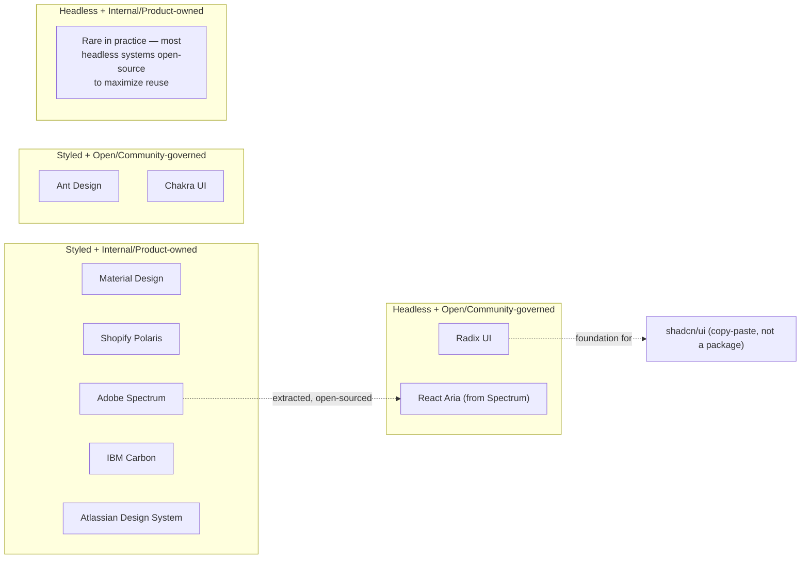

export const metadata = {
  title: "14. Real Design System Case Studies",
  description:
    "A comparative tour of Material Design, Atlassian Design System, Shopify Polaris, Adobe Spectrum, IBM Carbon, Ant Design, Chakra UI and Radix UI — what each optimizes for and why.",
};

# 14. Real Design System Case Studies

## Quick Glance

- For interviews, a case study is not "what the system has" — it's "what constraint forced this architecture." Always lead with the constraint.
- Material Design: one token spec drives four platforms (Android, iOS, Web, Flutter); Material You resolves color tokens at runtime from the user's wallpaper.
- Atlassian: semantic tokens let different products (Jira, Confluence, Trello) share one design language without forcing them into identical components.
- Shopify Polaris: App Bridge lets third-party apps embedded in the Shopify admin render Polaris-consistent UI via cross-frame messaging, without loading Polaris's own React code.
- Adobe Spectrum splits into React Aria (headless accessible behavior), React Stately (framework-agnostic state), and React Spectrum (Adobe's visual skin) — decoupling behavior from skin is the single most influential pattern in this chapter.
- IBM Carbon migrated its styling from Sass variables to CSS-variable tokens in production — a real, costly, in-place migration, not a rewrite — to support runtime theming and Figma Variable sync.
- Ant Design is deliberately comprehensive and opinionated (60+ components) because Alibaba's internal teams needed to ship complex admin UI fast, not differentiate visually.
- Chakra UI made accessibility a default part of its component APIs, not a checklist bolted on after — this raised what developers expect from open-source UI libraries generally.
- Radix UI is fully headless (zero built-in styling, state exposed via data attributes) and is the foundation shadcn/ui (2023) copies component code from — shadcn/ui is a CLI that copies Radix+Tailwind source into your repo, not an npm package you install.
- If asked "which would you build on today," the safe, current answer for a small team is: a thin visual layer on top of Radix (or shadcn/ui) plus a semantic token layer borrowed from Atlassian's pattern.

## Definition

A design system **case study**, for interview purposes, is not a list of
what a system contains. It's an explanation of what **constraint** shaped
that system's architecture — and why a different constraint would have
produced a different system.

Material Design, Polaris, Carbon, and Radix all solve the same broad
problem: consistent, accessible UI at scale. But each was built against a
different forcing pressure — supporting many operating systems, letting
outside developers build inside your product, meeting enterprise
governance rules, being reusable by other companies. That forcing
pressure, more than any style preference, explains the decisions each one
made.

## Problem Statement

A candidate who's only read component documentation can list what a
system has — "Polaris has an `<IndexTable>`," "Carbon migrated from Sass
to tokens." But that same candidate often can't answer the question a
senior interview actually asks: *why does Polaris care so much about App
Bridge and accessibility, in a way a purely internal system wouldn't need
to?*

Reciting features is memorization. Explaining constraints is judgment —
and judgment is what a Staff-level design systems interview is testing.
This chapter is built to answer "X chose Y because of constraint Z" for
each system, not "X has feature Y."

## Why Does This Exist?

This handbook covers architectural decisions like token layering
([Design Tokens](/chapters/design-tokens)), styling approach
([Styling Architecture](/chapters/styling-architecture)), and component
API shape ([Component Architecture](/chapters/component-architecture)).
Every one of those decisions was made by a real team, facing a real
constraint. The fastest way to really understand *why* a given tradeoff
usually wins in practice is to see the same kind of decision made
differently by systems under different constraints, and to understand
what forced the difference.

## Historical Context

The systems in this chapter span roughly a decade of design system
history, across three distinct eras.

**The multi-platform-consistency era (2014–2017).** Google's Material
Design (2014) was one of the first design systems to treat "one visual
and interaction language across every Google product and platform" as an
explicit, published specification — not just an unwritten convention.
IBM's Carbon and Adobe's Spectrum came out of the same pressure inside
their own multi-product portfolios shortly after.

**The product-scale-and-accessibility era (2017–2020).** As React became
the dominant UI framework, product companies running large B2B/B2C
products — Shopify (Polaris), Atlassian (Atlassian Design System) — built
systems where the driving constraint was less "match our brand
everywhere" and more "our product is complex enough, and our users
professional enough, that inconsistency directly costs revenue and
support tickets."

**The headless/open-source era (2020–present).** Radix UI (2020) and
Chakra UI (2019) represent a real break from what came before. Instead of
one company publishing its own internal system, these are open-source
projects built to be a *foundation* other companies build their own
design systems on top of. This era also produced shadcn/ui (2023), which
isn't a traditional design system at all — it's a code-generation pattern
built directly on Radix. It's arguably the most significant development
in component-library distribution in recent years, and it's worth
understanding closely, because it breaks the "install a package" mental
model every earlier system in this chapter assumes.

## How It Works Internally

These are eight different systems, so there's no single shared mechanism
to explain. Instead, this section walks through the specific mechanism
behind each system's defining constraint — the thing you'd name if an
interviewer asked "how, specifically, does that actually work?"

### Material Design — tokens as the cross-platform contract

Google ships Material across Android (Kotlin/Jetpack Compose), iOS
(Swift), Web (Material Web Components / MUI for React), and Flutter —
four completely different rendering engines with no shared runtime. What
makes "one design language" possible across that split is that Material's
source of truth isn't code written in any one of those languages. It's a
token specification (the [Design Tokens](/chapters/design-tokens) concept,
applied at Google's scale) that each platform's implementation reads
independently.

**Material You** (introduced with Android 12) pushed this further:
dynamic color extraction from a user's wallpaper generates a full color
palette *at runtime, on the device itself*. Token values aren't even
fixed at build time on Android anymore. The whole system had to be built
from the start so tokens are something you look up when needed, not a
value baked in ahead of time.

### Atlassian Design System — tokens for multi-product B2B consistency

Atlassian's constraint is different: not multiple operating systems, but
multiple *products* — Jira, Confluence, Trello, Bitbucket — that need to
feel like one company's software, while each has enough of its own
complexity (Jira's issue workflows, Confluence's document editing) that
forcing them into one rigid, identical component set would fight what
each product actually needs.

Atlassian's answer is an explicit semantic layer in its tokens. A token
like `color.background.brand.bold` resolves to a different actual value
per product or theme, but the *name* a component author reaches for is
the same everywhere. That's what lets a Jira engineer and a Confluence
engineer both build on the same design system without agreeing on raw
color values first.

### Shopify Polaris — the App Bridge constraint

Polaris has a constraint almost none of the other systems in this chapter
share: its component library is used not just by Shopify's own
engineers, but by **thousands of independent third-party companies**
building apps that live *inside* the Shopify admin, embedded through an
iframe. Shopify doesn't control these developers' code quality, release
schedule, or attention to accessibility — but a merchant using a
third-party app inside their Shopify admin experiences it as part of
Shopify's own product.

This is why Polaris invests unusually heavily in two things. First,
strict, enforced accessibility standards — an inaccessible custom widget
in a third-party app reflects on Shopify, not just on the app's
developer. Second, **App Bridge**, a JavaScript library that lets
embedded third-party apps render Polaris-consistent UI (title bars,
navigation, modals) *without that app needing to load Polaris's own React
components at all*. Here's how it works: the embedded app sends
structured messages (using the browser's `postMessage` API) to the parent
Shopify admin frame, and the parent frame renders the actual Polaris UI
itself, natively, on the app's behalf. No other system in this chapter
has to solve "make the UI feel consistent when you don't control the code
rendering it."

### Adobe Spectrum and React Aria — decoupling behavior from skin

Adobe's constraint is internal multi-product consistency at a scale
similar to Atlassian's — Photoshop, XD, Creative Cloud web, Adobe
Express. But the mechanism Adobe chose to solve it is the most
influential idea in this chapter for the wider React ecosystem.

Adobe split its system into three layers: **React Spectrum** (the
visually styled, Adobe-branded component layer), built on top of **React
Aria** (unstyled, fully accessible behavior hooks — keyboard handling,
focus management, ARIA attribute wiring — with no visual opinion at all),
and **React Stately** (state management for those same interaction
patterns, independent of any UI framework). Adobe open-sourced React Aria
and React Stately *separately* from React Spectrum.

Why did this matter beyond Adobe? Getting accessible interaction behavior
right for something like a combobox or a date picker is extraordinarily
hard (see [Accessibility](/chapters/accessibility)), and that behavior is
almost entirely reusable no matter what a component looks like visually.
By separating the hardest, least brand-specific part of the problem from
Adobe's own visual style, React Aria became genuinely useful to companies
with completely different visual languages — which is exactly why it's
now used far outside Adobe.

### IBM Carbon — Sass to tokens as a real migration story

Carbon stands out because it's a system that *changed its own styling
architecture in production* — something almost no marketing-page case
study talks about. Carbon originally built its theming on Sass variables
and maps. That worked fine for a single theme fixed at build time, but it
was brittle for runtime theming (switching between IBM's light, dark, and
multiple brand themes without a full rebuild), and it had no connection
to Figma, where designers were working in Figma Variables, not Sass.

Carbon moved to a token-driven architecture backed by CSS custom
properties — the same general Sass-vs-CSS-Variables tradeoff covered in
[Styling Architecture](/chapters/styling-architecture). This let theme
switching happen at runtime, by swapping a `data-theme` attribute,
instead of building a separate bundle per theme. It also gave Carbon a
direct sync path to Figma Variables
([Collaboration with Designers](/chapters/collaboration-with-designers)).
This is a real example of a system paying down old architectural debt at
scale, not a clean-slate decision — worth citing specifically when an
interviewer asks about migrating an existing system's styling approach.

### Ant Design — comprehensive over primitive, for a specific market reason

Ant Design's defining trait, compared to most systems in this chapter, is
that it's **maximally opinionated and comprehensive** — a huge component
set (60+ components, including complex ones like `Transfer`, `Cascader`,
and full-featured data-entry forms) with strong default styling. That's
the opposite of the "small set of unstyled primitives" approach Radix and
React Aria take.

This isn't an arbitrary choice. Ant Design grew out of Alibaba's internal
enterprise software, where the main need was for many internal teams to
ship complex admin and back-office tools *fast*, with consistent behavior
out of the box, and relatively little need for deep, brand-specific
visual customization per team. A comprehensive, strongly opinionated
system is the right tool for that constraint — the same way a
primitives-only system is the right tool for a company that needs many
different visual brands built on one shared behavioral foundation.

### Chakra UI — accessibility as the default, not an add-on

Here's the specific thing worth naming about Chakra: unlike systems that
bolt accessibility onto components after they're already designed,
Chakra built accessible props into its component APIs from the start —
things like a built-in `isInvalid` prop, `aria-*` prop pass-through, and
description/error-message wiring baked into form components by default,
not as something you opt into. Chakra's influence on the wider React
community wasn't really about any one technical trick. It was about
*normalizing the expectation* that a community, open-source component
library should be accessible by default — raising the bar for what
developers expect from every library that came after, including
commercial ones.

### Radix UI and shadcn/ui — headless taken to its logical extreme, and what came after

Radix is the purest expression of the headless approach in this chapter:
components ship with **zero visual styling** — no CSS at all — and expose
only behavior, state, and correct ARIA wiring. Styling is entirely the
consumer's job, done through data attributes (like
`[data-state="open"]`) that Radix components expose for consumers to
target with their own CSS. This is a deliberate bet: instead of trying to
be a standalone visual design system every company adopts as-is, Radix
bet on being the *foundation underneath* other companies' visual design
systems. You build your own visual layer on top of Radix's behavior
layer — the same split React Spectrum makes on top of React Aria.

That bet paid off in a very current way. **shadcn/ui** (2023) is not a
component library you `npm install` at all. It's a CLI tool that *copies*
pre-built, Radix-based component source code directly into your own
repository, styled with Tailwind. You then own that code and can change
it freely, instead of being limited by whatever a published package
exposes. shadcn/ui works *because* Radix had already solved the hard,
reusable part of the problem — accessible behavior. shadcn/ui only had to
add the visual styling layer and a new way to distribute code (copy the
files in, rather than install a package). That would have been an
enormous undertaking if it also had to build accessible
listbox/combobox/dialog behavior from scratch.

This is the same Adobe Spectrum / React Aria pattern playing out a second
time in the ecosystem. It's also why "Radix vs. a standalone system" is a
slightly outdated way to frame the choice now — Radix increasingly *is*
the behavior layer other systems, including ones you build yourself, sit
on top of.

## Architecture

The diagram below places all eight systems on two axes that explain most
of the differences covered above: how much of the system is **headless
vs. fully styled**, and whether it's **owned internally vs. governed
openly**. Where a system sits is a direct result of its driving
constraint, not a style preference.



Reading the quadrants: most product-company systems (Material, Polaris,
Spectrum, Carbon, Atlassian) sit in the styled-and-internally-governed
quadrant, because their job is enforcing *one company's* brand —
governance stays centralized even when the code is open-sourced for
transparency. Ant Design and Chakra sit in styled-and-open, because
they're community-facing products in their own right, meant for many
unrelated companies to adopt as-is. Radix (and React Aria, which Adobe
deliberately pulled out of Spectrum into its own quadrant) sit in
headless-and-open, because their whole value is being a shared
foundation, not a finished brand. The fourth quadrant is nearly empty in
practice, because a headless system with no external reuse gives up the
main reason to go headless in the first place.

## Real-World Example

Consider a scenario an interviewer might pose: *"You're starting a design
system for a new B2B SaaS product used by five different internal teams,
each wanting some visual flexibility for their own sub-product, and you
have three engineers and six months."* Walking through why each case
study is or isn't the right reference point shows the kind of comparative
judgment this chapter is trying to build:

- **Not Ant Design's approach.** Its comprehensive, strongly opinionated
  component set is built for internal teams that *don't* need much visual
  difference between them — which conflicts with the stated need for
  per-team flexibility.
- **Not a from-scratch Spectrum- or Carbon-style build.** Those systems
  represent years of dedicated design-system investment at large
  companies. Three engineers in six months can't replicate that maturity,
  and shouldn't try.
- **Closer to building on top of Radix.** Build a thin internal visual
  layer on top of Radix's already-solved accessible behavior (or start
  from shadcn/ui's copy-in components). This gets correct accessibility
  and interaction behavior essentially for free, so the three engineers
  can spend their limited time on the one thing that actually needs to be
  custom: a shared visual token layer and a handful of composite
  components specific to the product.
- **Borrow Atlassian's semantic token pattern, not its component count.**
  The idea of a semantic token layer — letting five sub-products share
  underlying values while resolving differently per team — transfers
  directly at any scale. Atlassian's much larger component library
  doesn't.

This is the kind of synthesis that separates a memorized feature list
from real judgment in an interview: not "which system is best," but
"which system's *constraint* matches mine closely enough that its
solution actually transfers."

## Implementation Example

This chapter is about comparing systems, not building components from
scratch. Still, the architectural patterns covered above are concrete
enough to show in code. Two examples: Adobe's behavior/style split (the
React Aria pattern), and Radix's data-attribute styling hook — the exact
mechanism that makes a "headless" component actually stylable.

```tsx
// The Adobe/React Aria pattern: a hook owns state + behavior + a11y
// wiring; the component owns only markup and visual styling. This is
// the literal mechanism behind "React Aria works outside Adobe" —
// nothing in useToggleButtonState or useToggleButton is Spectrum-specific.
import { useToggleState } from "react-stately";
import { useToggleButton } from "react-aria";
import { useRef } from "react";

function ToggleButton(props: { children: React.ReactNode }) {
  // react-stately: framework-agnostic state machine for "pressed/not"
  const state = useToggleState(props);
  const ref = useRef<HTMLButtonElement>(null);

  // react-aria: wires keyboard handling, aria-pressed, focus visibility —
  // all the accessibility behavior a toggle button needs, with zero
  // opinion about how it looks.
  const { buttonProps } = useToggleButton(props, state, ref);

  return (
    // Every visual decision — the class name, the color, the border —
    // is entirely up to the consumer. This same hook pair could back a
    // Spectrum-styled button, an Ant-styled button, or your own.
    <button
      {...buttonProps}
      ref={ref}
      className={state.isSelected ? "toggle toggle--pressed" : "toggle"}
    >
      {props.children}
    </button>
  );
}
```

```tsx
// The Radix pattern: headless primitives expose STATE via data
// attributes on the rendered DOM node, which is the actual mechanism
// that lets a fully unstyled component still be stylable with plain
// CSS — no className logic, no runtime style computation needed.
import * as Dialog from "@radix-ui/react-dialog";

function ConfirmDialog({ open, onOpenChange, children }: {
  open: boolean;
  onOpenChange: (open: boolean) => void;
  children: React.ReactNode;
}) {
  return (
    <Dialog.Root open={open} onOpenChange={onOpenChange}>
      <Dialog.Portal>
        {/* Radix sets data-state="open" | "closed" on this element
            itself — CSS below targets it directly, no JS-computed
            className string needed. */}
        <Dialog.Overlay className="dialog-overlay" />
        <Dialog.Content className="dialog-content">
          {children}
          <Dialog.Close aria-label="Close">×</Dialog.Close>
        </Dialog.Content>
      </Dialog.Portal>
    </Dialog.Root>
  );
}
```

```css
/* This is the whole styling contract Radix exposes: state as a data
   attribute, animation driven by CSS alone. A shadcn/ui-generated
   component is, structurally, exactly this pattern with Tailwind
   utility classes instead of hand-written CSS. */
.dialog-content[data-state="open"] {
  animation: contentShow 150ms ease-out;
}
.dialog-content[data-state="closed"] {
  animation: contentHide 100ms ease-in;
}
```

## Advantages

There's no single shared "advantages" list here — each system's advantage
is the direct payoff of the constraint it was solving. Worth being able
to state each one plainly in an interview:

- **Material Design**: one specification governs four platforms, so
  brand and interaction consistency doesn't break down as Google adds new
  device types.
- **Atlassian Design System**: semantic tokens let genuinely different
  products (Jira vs. Confluence) share one design language, without a
  rigid shared component set forcing either product to compromise.
- **Shopify Polaris**: App Bridge extends brand and accessibility
  consistency into surfaces Shopify doesn't even run the code for — a
  reach no purely internal system needs or has.
- **Adobe Spectrum / React Aria**: separating behavior from skin turned
  an Adobe-internal investment into a genuinely reusable industry asset —
  a rare outcome for design system work.
- **IBM Carbon**: proved a large system can migrate its core styling
  architecture (Sass to tokens) in place, without a full rewrite.
- **Ant Design**: a comprehensive, opinionated set gets many internal
  teams to a consistent, complex admin UI fast, with little per-team
  decision-making overhead.
- **Chakra UI**: accessible-by-default APIs raised the baseline
  expectation across the whole open-source React ecosystem.
- **Radix UI**: became reusable *underneath* nearly any visual system,
  including ones (like shadcn/ui) built years after Radix itself shipped.

## Disadvantages

- **Material Design**: strict cross-platform token rules can feel
  constraining to teams that want a platform-native feel (an iOS team
  wanting to feel more like iOS than like Android).
- **Atlassian Design System**: semantic tokens can still let visible
  inconsistency slip through if product teams interpret shared tokens
  loosely — governance work grows with the number of products.
- **Shopify Polaris**: App Bridge and strict accessibility rules create
  real friction for third-party developers who'd rather have more visual
  freedom in their embedded apps.
- **Adobe Spectrum / React Aria**: the behavior/style split means
  adopting React Aria alone still requires real work to build the visual
  layer yourself — it removes the hardest problem, not all of the work.
- **IBM Carbon**: large-scale migrations like Sass to tokens are
  genuinely expensive and slow, even when the end result is clearly
  better.
- **Ant Design**: its opinionated defaults are exactly what makes deep
  visual customization for a distinct brand harder than with a
  primitives-first system.
- **Chakra UI**: its historical use of runtime CSS-in-JS carries the
  performance tradeoffs covered in [Performance](/chapters/performance)
  and [Styling Architecture](/chapters/styling-architecture).
- **Radix UI**: zero built-in styling means a consumer gets nothing
  visually usable out of the box — all of the visual design work is still
  the adopting team's job.

## Alternatives

The table below compares all eight systems across the dimensions that
decide which one is the right reference point — or foundation to build
on — for a given constraint.

| Dimension | Material Design | Atlassian DS | Shopify Polaris | Adobe Spectrum | IBM Carbon | Ant Design | Chakra UI | Radix UI |
| --- | --- | --- | --- | --- | --- | --- | --- | --- |
| What problem it solves | One visual/interaction language across Android/iOS/Web/Flutter | Shared design language across many distinct internal products (Jira, Confluence, Trello) | Consistent, accessible merchant UI incl. third-party embedded apps | Consistent UI across Adobe's product suite at extreme scale | Enterprise-grade, governable component set for IBM Cloud + partners | Fast, consistent internal admin/enterprise tooling at scale | Accessible-by-default component set for the open React community | A reusable, accessible behavior foundation for building custom visual systems |
| Why it was created | Google needed one brand across a rapidly multiplying device/platform portfolio | Atlassian's product suite grew faster than ad hoc per-product UI could stay consistent | Shopify needed merchant-facing consistency extending into apps it doesn't build | Adobe needed cross-app consistency without forcing one visual language on every future context | IBM needed a governable system spanning internal + external, open-source consumers | Alibaba's internal teams needed to ship complex admin UI fast without reinventing patterns | Maintainers wanted accessibility to be the default, not bolted on after | Adobe/independent maintainers wanted a foundation other systems could build on, not another finished skin |
| Performance | High; runtime dynamic theming (Material You) engineered to avoid perceptible lag on theme change | High; semantic token resolution kept lightweight for multi-product reuse | High; treated as tied directly to merchant productivity and accessibility outcomes | High; layered architecture keeps Aria's behavioral cost separate from Spectrum's visual cost | High; token/CSS-variable migration was partly performance-motivated (avoid per-theme rebuilds) | Good, though historically heavier due to comprehensive component scope | Good; some historical runtime CSS-in-JS cost, improving with newer versions | Excellent; minimal own rendering cost since it ships no visual styling |
| Developer experience | Strong platform-specific docs and tooling, but requires understanding the cross-platform token contract | Strong internal DX; semantic tokens reduce raw-value decisions for product engineers | Strong; heavy investment in guidelines given third-party developer audience | Strong for Adobe engineers; React Aria's headless API requires more DIY styling work | Strong; token/Figma-Variable sync in later versions materially improved DX | Very strong out-of-the-box DX; less configuration decision fatigue | Very strong; commonly cited as one of the easier React UI libraries to start with | Requires building your own visual layer; DX is excellent once that layer exists |
| Learning curve | Moderate-high; cross-platform token model takes time to internalize | Moderate; semantic token layer requires learning the naming model | Moderate; App Bridge adds a distinct concept beyond typical component usage | Moderate-high; understanding the Aria/Stately/Spectrum split takes onboarding | Moderate; token model plus enterprise governance conventions | Low; comprehensive defaults minimize decisions needed to get started | Low; consistently cited as approachable for newcomers | Moderate; headless model requires understanding state/behavior before styling |
| Community / ecosystem support | Very large (Google-backed, MUI and other implementations) | Large within Atlassian ecosystem; moderate external | Large within Shopify app-developer ecosystem | Large for React Aria specifically; Spectrum itself mostly Adobe-internal usage | Large open-source contributor base | Very large, especially in Chinese enterprise-software ecosystem | Large, active open-source community | Very large and rapidly growing; foundation for shadcn/ui and others |
| Maintenance burden | High for Google given 4-platform scope; low for consumers | Moderate; Atlassian absorbs most maintenance centrally | Moderate-high given third-party App Bridge compatibility surface | High for Adobe given multi-product, multi-layer scope | Moderate; open governance shares some burden with contributors | Moderate; large surface area to maintain consistently | Low-moderate; community-shared maintenance | Low for consumers; Radix absorbs behavior/a11y maintenance centrally |
| Token architecture maturity | Very high — must resolve across 4 platforms incl. runtime dynamic theming | High — semantic layer for multi-product | High — token-driven, accessibility-linked | Very high — feeds both Aria and Spectrum layers | High — migrated Sass to token/CSS-variable architecture | Moderate — theming via config, less token-formalized historically | Moderate — theme object, less cross-platform emphasis | N/A — no visual tokens, behavior only |
| Governance model | Centralized (Google) | Centralized (Atlassian) | Centralized (Shopify) | Centralized (Adobe) | Centralized, open-source contributions accepted | Centralized (Alibaba-originated), open-source | Community/open-source | Community/open-source (WorkOS-backed) |
| Open-source vs. internal | Spec + some code open, governance internal | Open-source, internal governance | Open-source, internal governance | React Aria/Stately fully open; Spectrum visuals Adobe-specific | Fully open-source | Fully open-source | Fully open-source | Fully open-source |
| Headless vs. styled | Fully styled | Fully styled | Fully styled | Layered: React Aria headless, React Spectrum styled | Fully styled | Fully styled, heavily opinionated | Styled, but flexible/themeable | Fully headless, zero styling |
| Primary constraint that shaped it | Consistency across Android/iOS/Web/Flutter | Consistency across many distinct internal products | Third-party embedded apps + merchant-facing accessibility | Multi-product consistency (Photoshop/XD/CC) at extreme scale | Enterprise governance + long-lived legacy migration | Fast, consistent internal enterprise tooling at Alibaba scale | Raising the community accessibility baseline | Being a reusable foundation, not a finished product |
| Enterprise suitability | Very high | Very high | High, especially for platforms with third-party ecosystems | Very high | Very high; built for enterprise governance specifically | High, especially for enterprise/internal admin tooling | Moderate-high; less enterprise-governance tooling than Carbon/Atlassian | High as a foundation; requires building the enterprise-brand layer yourself |
| When to choose it (as a reference/foundation) | Multi-OS native + web products | Multi-product B2B SaaS wanting shared semantics, distinct products | Product with a third-party app ecosystem | Wanting a proven behavior/style split to emulate | Enterprise system planning a styling-architecture migration | Fast internal admin tooling, less brand differentiation needed | Community npm package wanting accessible defaults fast | Building your own styled system on solid, tested a11y behavior |
| When NOT to choose it | Small team, single platform, no cross-platform need | Single-product companies (overkill governance) | No third-party/embedded-app story | Team needing a finished visual system today, not a foundation | Green-field system with no legacy to migrate from | Strong distinct brand identity requirements | Needing extreme bundle-size minimalism | Needing a usable visual system out of the box immediately |

Large product companies pick their reference point based on which
constraint matches their own — not which system is "best" in the
abstract. A company entering **multiple platforms** (native mobile plus
web) studies Material's token-as-contract approach, because that's the
exact problem Material had to solve, one that most single-platform
systems never face. A company running a **platform with third-party
developers building into it** — the way Shopify does, and increasingly
companies like Notion or Figma with their own plugin ecosystems — is the
real audience for Polaris's App Bridge pattern specifically, because
"staying consistent in code you don't control" is a rare, specific
problem. A company planning to **modernize an aging styling architecture
without a rewrite** studies Carbon's Sass-to-tokens migration, because
it's one of the few publicly documented examples of that exact change
happening at scale and succeeding.

The **Radix / React Aria pattern** — headless behavior with the visual
layer built separately — has become the default starting point for new
systems built in the last few years. That's because it hands off the
hardest, easiest-to-get-wrong part of the problem (accessible interaction
behavior) to a proven foundation, and lets a small team spend its limited
time on the one thing that actually has to be custom to their brand: the
visual layer. This is also exactly why shadcn/ui's copy-paste-instead-of-
install model caught on so widely — it packages that same
build-on-Radix decision as a starting point you fully own, instead of a
dependency you're limited by.

## Tradeoffs

- **Cross-platform consistency (Material) vs. platform-native feel.**
  Enforcing one visual language everywhere means giving up each
  platform's ability to feel truly native to its own users.
- **Comprehensive and opinionated (Ant Design) vs. primitives-only
  (Radix).** A comprehensive system gets teams moving fast with fewer
  decisions to make, but makes deep customization harder. A
  primitives-only system maximizes customization, but every adopting
  team has to build (or separately adopt) a visual layer before it's
  usable.
- **Open governance vs. centralized control.** Community-governed systems
  (Chakra, Ant Design, Radix) benefit from wide outside contribution and
  scrutiny, but move on a consensus-driven timeline. Centrally-governed
  internal systems (Spectrum, Polaris) move at the pace one team decides,
  at the cost of outside input.
- **Extending reach into third-party code (Polaris) vs. staying simple.**
  App Bridge's reach into embedded third-party apps is a real capability
  almost no other system needs to build or maintain. It's added,
  permanent complexity that only pays off if you actually have a
  third-party app ecosystem.
- **Migrating in place (Carbon) vs. rewriting.** An in-place styling
  migration keeps the component API stable for consumers, but is slower
  and riskier than a clean rewrite. A rewrite is faster to execute, but
  breaks every existing consumer at once.

## Performance Considerations

Performance priorities differ by constraint too. Material's runtime
dynamic theming (Material You) has to work out color palettes on the
device itself, without noticeable lag on every theme change. Polaris —
serving merchant-facing admin screens used all day by professional
retailers — treats how responsive the UI feels (covered generally in
[Performance](/chapters/performance)) as directly tied to accessibility
outcomes: a sluggish, inaccessible admin tool costs merchants real
support time. Radix and React Aria, being headless, have relatively
little *visual* rendering cost of their own to worry about — their
performance is almost entirely about handling events efficiently and
avoiding unnecessary re-renders in their state hooks, since the actual
paint cost belongs to whatever visual layer sits on top.

## Scalability Considerations

Scale means something different for each system's constraint. For
Material, scale means *platform count* — the architecture has to keep
working as Google adds new device categories (foldables, wearables)
without redoing the token contract each time. For Atlassian and Adobe,
scale means *product count* — the semantic token layer and the Aria/
Spectrum split both exist specifically so adding a new product doesn't
mean inventing a new design system from scratch. For Polaris, scale
means *third-party developer count* — thousands of independent app
developers, each shipping on their own schedule, is a governance and
consistency challenge no single-team system faces. For Radix, scale means
*reuse across unrelated companies* — its API stability matters more than
usual, because a breaking change ripples into every downstream system
(including shadcn/ui-generated code already sitting in thousands of
repositories), not just Radix's own product.

## Common Mistakes

<Callout type="danger" title="Treating 'headless' and 'primitives-only' as automatically better">
  Radix's headless approach is the right answer to *Radix's* constraint —
  being a reusable foundation for many unrelated visual systems. It is
  not automatically the right choice for a three-person internal team
  that needs a usable, consistent UI shipped next quarter, with no
  separate visual-layer investment. Recommending "go headless" without
  checking whether the team has the capacity to build the visual layer is
  a common interview misstep.
</Callout>

<Callout type="danger" title="Describing Polaris's App Bridge as 'just their component library'">
  App Bridge works completely differently from Polaris's React
  components — it's a cross-frame messaging protocol for embedded
  third-party apps that never load Polaris's React code at all. Mixing
  the two up misses the entire reason Polaris needed App Bridge.
</Callout>

<Callout type="danger" title="Assuming Ant Design's opinionated scope is a legacy/outdated approach">
  A comprehensive, opinionated component set isn't an earlier stage that
  primitives-only systems have replaced. It's a still-current, deliberate
  choice, and the right one for the specific constraint Ant Design was
  built for: many internal teams, fast shipping, low need for per-team
  visual differences.
</Callout>

<Callout type="danger" title="Not knowing the shadcn/ui-Radix relationship">
  In current interviews, not being able to explain that shadcn/ui is
  Radix-based components distributed by copy-paste instead of npm
  install — and why that distribution model exists (full ownership, no
  version-lock constraint) — reads as out-of-date knowledge of the
  current React component ecosystem.
</Callout>

## Best Practices

- When referencing a case study in an interview, always name the
  *constraint* first, then the mechanism that solved it — not the feature
  list.
- Use Material for cross-platform token questions, Polaris for
  third-party-extensibility questions, Adobe/React Aria for
  behavior-vs-style-decoupling questions, and Carbon for
  styling-architecture-migration questions — match the case study to the
  specific axis the question is probing.
- Cite the Radix-to-shadcn/ui relationship specifically when discussing
  current (not historical) component distribution trends — it's the most
  interview-relevant recent development in this space.
- When comparing systems, always state at least one concrete "when NOT to
  choose it" — a case study answer that only lists advantages reads as
  memorized marketing copy, not engineering judgment.
- Tie each system back to a concept from earlier chapters where relevant —
  Carbon to [Styling Architecture](/chapters/styling-architecture), Radix
  and Adobe to [Component Architecture](/chapters/component-architecture)
  — to demonstrate the case study isn't isolated trivia but an application
  of the same principles.

## Interview Questions

<InterviewQuestion q="Why did Adobe split React Spectrum into React Spectrum, React Aria, and React Stately instead of shipping one library?">
  **What the interviewer is testing:** Whether you understand the
  behavior/state/style split, and why it was valuable beyond Adobe's own
  needs.

  **Poor answer:** "To make the code more organized."

  **Good answer:** Explains React Aria owns accessible behavior, React
  Stately owns state that works outside any UI framework, and React
  Spectrum owns Adobe's visual styling on top of both.

  **Excellent senior answer:** Adds the strategic reasoning: accessible
  interaction behavior is the hardest and most reusable part of the
  problem. Separating it from Adobe's specific visual brand is exactly
  what let React Aria become useful, and widely adopted, far outside
  Adobe's own products — unlike React Spectrum itself.

  **Common mistakes:** Only naming the three packages without explaining
  why the split itself was the valuable decision.
</InterviewQuestion>

<InterviewQuestion q="What problem does Shopify's App Bridge solve that a typical internal design system never has to?">
  **What the interviewer is testing:** Whether you understand Polaris's
  unique third-party constraint, not just its component list.

  **Poor answer:** "It's Polaris's JavaScript library."

  **Good answer:** Explains that App Bridge lets third-party apps
  embedded in the Shopify admin render Polaris-consistent UI without
  shipping Polaris's own React components.

  **Excellent senior answer:** Names the actual mechanism — structured
  cross-frame messaging, so the host frame renders native Polaris UI on
  the embedded app's behalf — and why it's necessary: Shopify doesn't
  control third-party developers' code quality or attention to
  accessibility, but a merchant experiences the embedded app as part of
  Shopify's product. So consistency has to be enforced structurally, not
  just by asking nicely.

  **Common mistakes:** Confusing App Bridge with Polaris's regular React
  component library.
</InterviewQuestion>

<InterviewQuestion q="Compare Ant Design's approach to Radix UI's approach and explain when you'd choose each as a foundation.">
  **What the interviewer is testing:** Comparative judgment across the
  headless-vs-styled and opinionated-vs-primitive axes.

  **Poor answer:** "Radix is more modern."

  **Good answer:** Explains Ant Design is a comprehensive, opinionated,
  fully-styled set good for fast, consistent internal tooling; Radix is
  headless, unstyled, behavior-only, good as a foundation under a custom
  visual system.

  **Excellent senior answer:** Ties each to its originating constraint —
  Ant Design to Alibaba's need for many internal teams shipping complex
  admin UI fast with little need for visual difference between teams;
  Radix to the goal of being reusable under many *different* companies'
  visual systems. States a concrete deciding factor: need for a
  distinct brand identity versus need for shipping speed with low
  customization.

  **Common mistakes:** Treating one as strictly better instead of a fit
  for different constraints.
</InterviewQuestion>

<InterviewQuestion q="IBM Carbon migrated from Sass to a token/CSS-variable architecture. Why would a mature system take on that migration rather than living with Sass?">
  **What the interviewer is testing:** Whether you understand the real,
  practical limits of theming that's fixed at build time, at scale.

  **Poor answer:** "CSS variables are newer than Sass."

  **Good answer:** Explains Sass variables are resolved at build time,
  which means switching themes at runtime (light/dark/multi-brand)
  requires a separate build for each. CSS custom properties, by contrast,
  can be swapped at runtime just by changing an attribute.

  **Excellent senior answer:** Adds the design-tooling angle: Sass
  variables have no direct way to sync with Figma Variables, while a
  token-driven CSS-variable architecture does — which matters for
  keeping design and code in sync at Carbon's scale. Frames this as a
  real, costly, in-place migration, not a rewrite, which is a harder and
  more realistic engineering problem than designing a token architecture
  from a blank slate.

  **Common mistakes:** Not knowing the build-time vs. runtime difference
  between Sass variables and CSS custom properties.
</InterviewQuestion>

<InterviewQuestion q="What is shadcn/ui, and how does its relationship to Radix UI differ from a typical component library dependency?">
  **What the interviewer is testing:** Current knowledge of how component
  libraries get distributed today, not just textbook knowledge.

  **Poor answer:** "It's a UI library like Ant Design."

  **Good answer:** Explains shadcn/ui is a CLI that copies Radix-based,
  Tailwind-styled component source code directly into your repo, instead
  of installing an npm package.

  **Excellent senior answer:** Explains why that distribution model
  exists — full ownership of the code, with no version-lock or override
  limits a package dependency would create — and why it only worked
  *because* Radix had already solved accessible behavior. shadcn/ui only
  had to add the visual layer, which would have been a much bigger
  undertaking without Radix as a foundation.

  **Common mistakes:** Describing shadcn/ui as "just another component
  library" without understanding the copy-paste distribution model or its
  dependence on Radix specifically.
</InterviewQuestion>

## Manager-Level Questions

<ManagerQuestion q="If you were starting a new internal design system today, which of these case studies would you borrow most heavily from, and why?">
  **What the interviewer is testing:** Applied synthesis — can you map
  your own org's actual constraint onto the right reference point,
  instead of just reciting case studies.

  **Poor answer:** "I'd copy Material Design, it's the most famous."

  **Good answer:** Picks a system whose constraint plausibly matches the
  org's own (Radix as a foundation for a small team, Atlassian's semantic
  tokens for a multi-product org) and explains the match.

  **Excellent senior answer:** Clearly separates what to borrow (the
  pattern that fits the constraint) from what not to (scope that doesn't
  fit the team's scale — not attempting Spectrum-level multi-product
  maturity with a three-person team). Names a concrete first deliverable
  that reflects the borrowed pattern, rather than staying abstract.

  **Common mistakes:** Picking the most famous or most-liked system
  without justifying why the constraint actually fits.
</ManagerQuestion>

<ManagerQuestion q="Shopify has to enforce accessibility standards on UI it doesn't fully control (third-party embedded apps). How would you approach a similar problem if your design system had external consumers you don't manage?">
  **What the interviewer is testing:** Governance and influence thinking
  applied to a genuinely hard consistency problem.

  **Poor answer:** "I'd just require them to follow our guidelines."

  **Good answer:** Describes a mix of structural enforcement (something
  like App Bridge, where the host renders the consistent parts natively
  instead of trusting the third party to rebuild them correctly) plus
  documentation and review for the parts that can't be enforced
  structurally.

  **Excellent senior answer:** Tells apart what can be enforced
  *structurally* (the host renders it, so there's nothing to get wrong)
  from what can only be enforced through *incentives and review* (an
  external team's own custom UI). Prioritizes moving as much as possible
  into the structural category, since relying on guideline compliance
  from parties you don't manage is unreliable at scale.

  **Common mistakes:** Relying entirely on documentation and guidelines
  with no structural enforcement.
</ManagerQuestion>

<ManagerQuestion q="A team on your project pushes to rebuild your component library from scratch rather than adopting Radix as a foundation, arguing 'we need full control.' How do you handle that disagreement?">
  **What the interviewer is testing:** Whether you can work through a
  build-vs-adopt disagreement using data and clear tradeoffs, instead of
  just authority.

  **Poor answer:** "I'd just tell them Radix is better."

  **Good answer:** Asks what "full control" actually means in concrete
  terms — visual control (which Radix already gives you, since it's
  unstyled) or behavioral control (which would mean re-solving accessible
  interaction behavior from scratch)?

  **Excellent senior answer:** Separates the team's real underlying
  concern from what they're actually saying — often "full control"
  really means fear of being blocked by an external dependency's release
  schedule or breaking changes. That's addressable (pinning a specific
  version, wrapping Radix behind an internal API) without throwing away
  its real value: years of tested accessible behavior. Frames the
  decision around what a from-scratch rebuild would cost in engineering
  time, against what risk it's actually solving.

  **Common mistakes:** Treating this as a pure technical debate instead of
  surfacing the real concern — often about risk or control — behind the
  "full control" framing.
</ManagerQuestion>

## Summary

The eight systems in this chapter ended up with very different
architectures, not because of taste, but because each was solving a
different constraint. Material Design's constraint is platform count
(Android, iOS, Web, Flutter), solved with a token specification treated
as the cross-platform contract, later extended by Material You into
tokens resolved at runtime. Atlassian's and Adobe's constraint is product
count within one company, solved with semantic tokens (Atlassian) and a
behavior/style split across React Aria, React Stately, and React Spectrum
(Adobe) — a split that mattered beyond Adobe, because it made the
hardest, most reusable part of the problem (accessible behavior)
valuable on its own. Shopify Polaris's constraint is unique in this set —
third-party developers building into code Shopify doesn't control —
solved structurally with App Bridge instead of relying on guidelines
alone. IBM Carbon is the chapter's best real-world example of a styling
migration happening in production: moving from Sass to a token/CSS-
variable model for runtime theming and Figma sync. Ant Design's
comprehensive, opinionated component set and Radix's headless, unstyled
primitives sit at opposite ends of the same axis, each right for a
different team size and customization need. Chakra UI's lasting
contribution was making accessible defaults the norm across the
open-source React ecosystem. And Radix's relationship to shadcn/ui — a
foundation other systems, including copy-paste-distributed ones, now
build on top of — is the most current, interview-relevant development in
this space, worth being able to explain clearly.

**Key takeaways**

- Always lead a case-study answer with the *constraint*, not the feature
  list — "X chose Y because of Z constraint" is the shape a strong answer
  takes.
- Material Design solves cross-platform consistency; Atlassian and Adobe
  solve multi-product consistency within one company; Polaris solves
  consistency in a runtime it doesn't control; Carbon demonstrates a real
  in-place styling-architecture migration.
- Adobe's React Aria / React Stately / React Spectrum split — decoupling
  accessible behavior from visual skin — is the single most influential
  architectural pattern in this chapter, and it repeats in Radix.
- Ant Design (comprehensive, opinionated) and Radix (headless, unstyled)
  sit at opposite ends of the same axis; neither is universally better,
  each fits a different team-size and customization profile.
- shadcn/ui is Radix-based components distributed by copy-paste rather
  than npm install — full ownership over version-lock — and it only works
  because Radix already solved accessible behavior.
- When asked to design a new system, match the reference point to the
  actual constraint you have, not the most famous or most-liked system.
