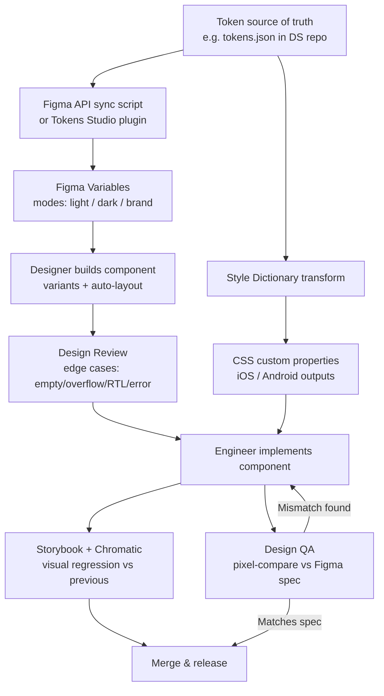

export const metadata = {
  title: "12. Collaboration with Designers",
  description:
    "Working with Figma, design handoff, design QA, Figma Variables and token synchronization, and how to resolve disagreements between design and engineering.",
};

# 12. Collaboration with Designers

## Definition

**Collaboration with designers**, in a design system context, is the set
of working practices, shared tools, and communication conventions that
let design and engineering build the *same* component from two different
disciplines without the two versions drifting apart — the Figma component
and the code component need to represent one underlying design decision,
not two independent interpretations of it that happen to look similar at
first glance. This is a distinct discipline from general product
design-engineering collaboration because a design system component isn't
built once for one screen — it's built once and instantiated everywhere,
which means any drift between the Figma source and the code source
doesn't just cause one page to look slightly off, it compounds across
every product surface that uses the component.

## Problem Statement

The default failure mode, without deliberate practice, is that Figma and
code become two separate, slowly diverging sources of truth. A designer
adjusts a component's padding in Figma; the engineering team doesn't know
until a PM notices the shipped product doesn't match the latest mock. An
engineer, under deadline pressure, eyeballs a spacing value from a static
export instead of asking what the actual token value is, and ships 14px
where the spec meant `--spacing-md` (which happens to render as 12px) —
close enough to pass casual review, wrong enough to fail a pixel-level
brand audit six months later when someone finally compares them side by
side. Neither of these is a competence failure on either side; they're
what happens by default when the design file and the codebase have no
structural connection between them and depend entirely on humans
noticing drift.

The problem compounds because design and engineering also don't share a
vocabulary by default. A designer's mental model of "variant" in Figma
(a specific configuration in a component set, defined by property
combinations) and an engineer's mental model of "variant" in code (often
a single prop like `variant="primary"` that may or may not map 1:1 to a
Figma variant) are related but not identical concepts, and a conversation
where both people say "variant" and mean slightly different things
produces exactly the kind of miscommunication that looks, from the
outside, like someone wasn't listening. Collaboration practice exists to
close both gaps: the structural gap (no shared source of truth) and the
vocabulary gap (no shared definitions), because either one alone is
enough to produce a design system where the file and the product quietly
stop matching.

## Why Does This Exist?

This discipline exists because a design system, uniquely among software
artifacts, has two authors working from two different tools whose native
data models don't line up perfectly. A product feature is typically
designed once, in one file, and built once, in one PR — any
miscommunication is local and gets caught fast because the same two
people are looking at the same output almost immediately. A design
system component is designed once but referenced by every future
designer mocking up a new screen with it, and built once but imported by
every future engineer building that screen — the gap between design
intent and code reality, once introduced, gets baked into every future
usage rather than surfaced and corrected quickly. That asymmetry is why
mature design system orgs invest specifically in structural
synchronization (token pipelines connecting Figma and code, not just
"designers and engineers talk more") rather than treating this as a
communication problem solvable purely with better meetings.

## Historical Context

Figma's component model itself — variants (introduced 2020, unifying what
used to require separate top-level components for each state/size
combination into a single component set) and auto-layout (also 2020,
Figma's answer to CSS flexbox-like behavior inside the design tool) — are
directly responsible for a large part of how modern design-engineering
collaboration works, because they gave designers a way to build Figma
components whose internal structure actually mirrors how a well-built
code component behaves: one definition, multiple prop-driven states,
content that reflows rather than needing manual resizing per instance.
Before auto-layout, a Figma "component" was frequently a rigid, fixed-size
frame that couldn't gracefully handle long text or a missing icon — which
meant the code component's real-world flexibility (handling arbitrary
content) had no design-file equivalent to review against, and edge cases
were discovered in code review or, worse, in production, not in design
review.

Figma Variables, released in 2023, is the more recent and more directly
relevant shift for design systems specifically: before Variables,
Figma's "tokens" were simulated through styles (color styles, text
styles) or through third-party plugins like Tokens Studio, which worked
but sat outside Figma's native data model and required exporting/syncing
through a plugin-specific JSON format. Variables gave Figma a native,
first-class concept of a token with real modes (light/dark, brand A/brand
B) that a design file can reference directly — the same fundamental
concept as a CSS custom property or a Style Dictionary token, finally
represented natively on the design side instead of simulated. This is
the single biggest recent unlock for closing the structural gap described
above, because it means the same *token identity* — not just the same
visual value — can be referenced from both Figma and code, and a token
value change in one authoritative source (however a team chooses to
define that source) can propagate to both.

Design QA and formal design review as codified practices trace to design
systems maturing past their initial build-out phase — early-stage design
systems typically don't have the component volume or consumer count to
justify a formal pixel-review step; it becomes standard practice once a
system has enough components, and enough teams building on top of them,
that undetected drift starts accumulating faster than ad hoc noticing can
catch it. Visual regression tooling (Chromatic, covered in
[Chapter 7](/chapters/storybook)) automated the *pixel-diff-against-
previous-version* half of this problem starting in the mid-2010s, but
deliberately does not automate the *pixel-diff-against-design-intent*
half — which is exactly the gap formal Design QA fills, and why the two
practices coexist rather than one making the other obsolete.

## How It Works Internally

The structural fix to the drift problem is making Figma and code
*reference the same token identity*, not just visually resemble each
other. Mechanically, this typically works through Figma's REST API or
its plugin API: a Figma plugin (or a scheduled job hitting the REST API)
reads the current values and modes of a file's Variables collection,
transforms that into the JSON shape a token pipeline like Style
Dictionary consumes (see [Chapter 2](/chapters/design-tokens) for the
Style Dictionary transform pipeline in depth), and that same generated
JSON is what both the Figma file (via the Variables it was read from) and
the codebase (via Style Dictionary's platform outputs — CSS custom
properties, iOS, Android) ultimately derive from. Whether Figma or a
separate token source-of-truth repository is the *authoritative* origin
of a token value is a real architectural decision teams make
differently — some treat Figma Variables as the source of truth and
generate code tokens from an export; others treat a token JSON file in
the codebase as authoritative and push values *into* Figma Variables via
the API so designers see the same values engineering ships. Either
direction works; what actually matters, and what breaks teams that skip
this step, is that there is exactly *one* authoritative source and an
automated, not manual, sync in one direction from it — a manual "someone
copies values over" step is where drift creeps back in, since it depends
on a human remembering to do it every time either side changes.

Design review and Design QA are, mechanically, two different checks
happening at two different points in the pipeline, and conflating them is
a common mistake. Design review happens *before* implementation, on the
Figma file itself, and its job is catching problems the design doesn't
yet have an answer for — an empty state nobody designed, an overflow
behavior nobody specified for long text, no RTL mirroring consideration,
no error state. Design QA happens *after* implementation, comparing the
shipped (or about-to-ship, in a preview environment) component against
the Figma spec, and its job is catching *implementation* drift — spacing
that's off by a few pixels, a color token that resolved to the wrong
value, an animation easing curve that doesn't match. Automated visual
regression (Chromatic) catches a third, related but distinct thing:
whether *this* version differs from the *previous* version, which says
nothing about whether either version actually matches design intent — a
component can be pixel-identical to its own last release and still be
wrong relative to the Figma spec, if it was wrong in both releases. All
three checks are necessary and none subsumes the others.

## Architecture

The full pipeline connecting a token change at its source, through
Figma, through code, to a Design-QA-verified shipped component:



The two review arrows into implementation (`G` feeding `H`, and `J`
looping back to `H`) represent the two points where design and
engineering explicitly synchronize, rather than each discipline working
from a stale snapshot of the other's intent.

## Real-World Example

Adobe Spectrum is a useful case study specifically because Adobe
publishes tooling (the Spectrum design tokens repository, and Spectrum's
own Figma libraries) that makes the token-sync architecture above
concrete and inspectable rather than theoretical: Spectrum's design
tokens are published as a versioned package that both the Figma libraries
and the code implementations (React Spectrum, Spectrum CSS) consume,
which is precisely the "one authoritative source, automated propagation
to both" pattern this chapter describes, done at the scale of a company
shipping products across Photoshop, Illustrator, XD-successor tooling,
and various web products that all need to look coherently "Adobe" despite
being built by largely separate teams.

Shopify's Polaris is a useful contrasting example for the vocabulary and
process side of this chapter: Polaris publishes not just components but
explicit content and UX writing guidelines alongside them, and Shopify's
public design system documentation is unusually explicit about *why* a
component looks the way it does (their documentation includes
usage guidance — when to use a `Banner` vs a `Toast`, for instance — not
just visual specs), which is a direct answer to the shared-vocabulary
problem: rather than assuming design and engineering converge on the
same understanding of when a component applies, Polaris writes it down
so both disciplines, and anyone new joining either team, can look it up
rather than re-deriving a shared understanding from scratch each time.

## Implementation Example

A Figma-to-code token sync script — this is the concrete mechanism behind
the `D → E` and `A → D` arrows in the architecture diagram, reading a
Figma file's Variables via the REST API and reconciling them against the
codebase's token source of truth:

```ts
// scripts/sync-figma-variables.ts
// Run in CI on a schedule, or manually before a design review, to keep
// Figma Variables and the code token source from drifting. Direction
// here is code -> Figma (code tokens are authoritative); some teams run
// this the other way, but the key property either direction needs is
// that it's automated, not a human copy-pasting hex values.
import { readFileSync } from "node:fs";

const FIGMA_FILE_KEY = process.env.FIGMA_FILE_KEY!;
const FIGMA_TOKEN = process.env.FIGMA_API_TOKEN!;

type CodeToken = {
  name: string; // e.g. "color.background.brand.default"
  value: string; // resolved hex/rgba, per mode
  mode: "light" | "dark";
};

async function getFigmaVariableCollections() {
  const res = await fetch(
    `https://api.figma.com/v1/files/${FIGMA_FILE_KEY}/variables/local`,
    { headers: { "X-Figma-Token": FIGMA_TOKEN } },
  );
  if (!res.ok) {
    throw new Error(`Figma API error: ${res.status} ${await res.text()}`);
  }
  return res.json();
}

async function pushTokenUpdates(codeTokens: CodeToken[]) {
  const { meta } = await getFigmaVariableCollections();
  const variablesByName = new Map(
    Object.values(meta.variables as Record<string, { name: string; id: string }>).map(
      (v) => [v.name, v.id],
    ),
  );

  // Figma's variable-update endpoint takes a batch of changes rather
  // than one call per variable — batching matters here because a full
  // token set can be hundreds of variables, and per-call updates would
  // both be slow and risk a partially-applied sync if it fails midway.
  const variableModeValues = codeTokens
    .filter((t) => variablesByName.has(t.name))
    .map((t) => ({
      variableId: variablesByName.get(t.name),
      modeId: t.mode === "dark" ? meta.darkModeId : meta.lightModeId,
      value: hexToFigmaRgba(t.value),
    }));

  const missing = codeTokens.filter((t) => !variablesByName.has(t.name));
  if (missing.length > 0) {
    // Fail loudly rather than silently skipping — a token that exists in
    // code but not in Figma means a designer is looking at a stale
    // Variables panel, which is exactly the drift this script exists to
    // prevent.
    throw new Error(
      `Tokens missing from Figma, needs manual creation first: ${missing
        .map((t) => t.name)
        .join(", ")}`,
    );
  }

  const res = await fetch(
    `https://api.figma.com/v1/files/${FIGMA_FILE_KEY}/variables`,
    {
      method: "POST",
      headers: {
        "X-Figma-Token": FIGMA_TOKEN,
        "Content-Type": "application/json",
      },
      body: JSON.stringify({ variableModeValues }),
    },
  );
  if (!res.ok) {
    throw new Error(`Failed to push variables: ${res.status}`);
  }
}

function hexToFigmaRgba(hex: string) {
  const n = parseInt(hex.replace("#", ""), 16);
  return {
    r: ((n >> 16) & 255) / 255,
    g: ((n >> 8) & 255) / 255,
    b: (n & 255) / 255,
    a: 1,
  };
}

async function main() {
  const tokens: CodeToken[] = JSON.parse(
    readFileSync("./tokens/color.tokens.json", "utf-8"),
  );
  await pushTokenUpdates(tokens);
  console.log(`Synced ${tokens.length} tokens to Figma.`);
}

main().catch((err) => {
  console.error(err);
  process.exit(1);
});
```

A component API design that deliberately mirrors a Figma component's
variant structure — this is the concrete practice referenced in
"understanding Figma's component model helps you build a matching code
API": Figma variant properties become TypeScript prop unions 1:1, so a
designer switching a Figma instance's variant property and an engineer
setting the equivalent prop are describing the exact same underlying
decision:

```tsx
// The prop shape below deliberately mirrors the Figma component set's
// variant properties (Size: sm/md/lg, Emphasis: primary/secondary/
// tertiary, State: default/hover/disabled — State is handled by actual
// interaction/CSS in code rather than a prop, since code doesn't need a
// separate "hover" variant the way a static design tool does). Keeping
// this mapping explicit and 1:1 is what lets a designer and engineer
// discuss "the lg/secondary button" and mean the literal same
// configuration in both tools.
interface ButtonProps {
  size?: "sm" | "md" | "lg";
  emphasis?: "primary" | "secondary" | "tertiary";
  isDisabled?: boolean;
  isLoading?: boolean;
  children: React.ReactNode;
  onPress?: () => void;
}

export function Button({
  size = "md",
  emphasis = "primary",
  isDisabled = false,
  isLoading = false,
  children,
  onPress,
}: ButtonProps) {
  return (
    <button
      className={`btn btn-${size} btn-${emphasis}`}
      disabled={isDisabled || isLoading}
      aria-busy={isLoading}
      onClick={onPress}
    >
      {isLoading ? <Spinner size={size} aria-hidden /> : null}
      {children}
    </button>
  );
}
```

## Advantages

A structurally synced token pipeline eliminates the specific, recurring
bug class of engineers eyeballing spacing/color values from a static
image — the most common source of small, cumulative visual drift in
design systems without one. A shared vocabulary (an explicit glossary
mapping design terms to code terms, and a component API that mirrors the
Figma variant structure) reduces the number of clarifying-question round
trips a component build requires, which compounds meaningfully across
dozens of components and a design system team's whole roadmap. Formal
design review catches edge cases — empty states, overflow, RTL, error
states — while they're still cheap to fix, in a design file, rather than
after implementation when fixing them means a code change and a second
round of review. Design QA catches a category of bug automated visual
regression structurally cannot: a component that renders consistently
release-over-release (passing Chromatic) but was wrong relative to
design intent from the start, and stays wrong until a human actually
compares it against the spec. And a productive disagreement-resolution
framework (data/cost framing instead of "no") preserves the working
relationship between design and engineering, which matters because these
two disciplines have to collaborate continuously, not just on one
project.

## Disadvantages

None of this is free, and the costs are worth being honest about. A
Figma-to-code sync pipeline is itself a piece of infrastructure that can
break, drift, or silently fail — an API sync script that's stopped
running (an expired token, a changed file key) produces exactly the
false confidence of "we have a sync, so we don't need to check for
drift" while actually not syncing anything. Formal design review and
Design QA both cost real calendar time — a design review step that adds
a mandatory two-day turnaround before implementation can start is real
latency, and Design QA as a manual pixel-comparison step doesn't scale
linearly with component count without dedicated headcount for it.
Mirroring Figma's variant structure precisely in a component's prop API
sometimes forces an API shape that isn't the most idiomatic code
design — Figma's variant model and a well-designed TypeScript discriminated
union don't always want to be the same shape, and prioritizing the
Figma-mirroring instinct too rigidly can produce a slightly awkward code
API in exchange for design/engineering vocabulary alignment. And building
a shared glossary and communication practice is genuinely soft,
ongoing work that doesn't show up as a shippable artifact — it's easy
to deprioritize relative to component work with a visible, demoable
output.

## Alternatives

Rather than tools competing head to head, the real "alternatives" in this
space are workflow strategies for the token-sync problem specifically —
worth comparing because teams genuinely choose differently here based on
org size and tooling maturity.

| Dimension | Manual handoff (static export + spec doc) | Figma Variables + automated code sync | Third-party plugin (Tokens Studio) as intermediary |
| --- | --- | --- | --- |
| What problem it solves | Baseline: designer exports assets/specs, engineer implements from them | Native Figma token model, single source of truth, automated propagation | Bridges pre-Variables Figma or multi-file complex token setups via a dedicated token-management layer |
| Why it was created | The default before any tooling investment — always available, zero setup | Figma's 2023 native answer to the token-sync problem | Filled the gap before Figma had native Variables; still used for advanced multi-brand/multi-mode setups Variables alone doesn't fully cover |
| Performance (drift risk) | High drift risk — depends entirely on humans re-checking values | Low — automated sync, single source of truth | Low, comparable to native Variables, with more configuration overhead |
| Developer experience | Low — engineers guess/measure from static images | High — tokens resolve identically in Figma and code | Moderate — extra plugin layer to learn and maintain |
| Learning curve | Low to start, but produces recurring rework | Moderate — team needs to learn Variables + a sync script | Higher — plugin-specific config format, GitHub sync setup |
| Community / ecosystem support | Universal, no tooling dependency | Strong and growing, native Figma feature | Strong, mature plugin ecosystem, but a third-party dependency |
| Maintenance burden | Low tooling burden, high recurring human-review burden | Moderate — sync script/CI job to maintain | Moderate to high — plugin version compatibility, GitHub Actions config |
| Enterprise suitability | Low at scale — doesn't hold up past a handful of components | High — used at Adobe (Spectrum), and increasingly the default | High — still common for organizations with complex multi-brand/multi-theme setups |
| When to choose it | Very early-stage design system, one or two components, proving concept | Default choice for any design system past the prototype stage | Multi-brand/multi-mode complexity that exceeds what native Variables modes handle cleanly, or a pre-existing Tokens Studio investment |
| When NOT to choose it | Any design system expecting more than a handful of components or consumers | Rarely a wrong choice today, given Variables' maturity | Adds a dependency and config surface not worth it if native Variables alone covers your mode/brand complexity |

Large, mature design system organizations converge on **Figma Variables
with an automated code sync** as the default today, specifically because
it eliminates the single largest source of manual, error-prone
re-entry of the same values in two places — Adobe's Spectrum, as
discussed above, is a public example of a company operating at this
level of integration. Manual handoff persists at early-stage systems and
smaller teams purely because it requires zero upfront tooling
investment, but it is a strategy that predictably breaks down as
component count and consumer count grow — it isn't that manual handoff
is a bad choice at small scale, it's that teams frequently fail to
recognize the point at which they've outgrown it, and keep accepting
drift as normal until a brand audit or new hire notices how far apart
the file and the product have drifted. Third-party plugins like Tokens
Studio remain the right choice specifically for organizations with token
complexity that exceeds what Figma's native Variables modes handle
cleanly — very large multi-brand portfolios with many simultaneous theme
combinations — but for the common case of light/dark plus one or two
brands, native Variables alone is now sufficient and removes a
third-party dependency from the pipeline.

## Tradeoffs

Every investment in this chapter trades upfront tooling/process cost
against downstream drift risk, and the right amount of investment scales
with design system maturity, not with team size alone. A token sync
pipeline costs real engineering time to build and maintain, but the
alternative cost — a brand audit six months later discovering a dozen
subtly wrong color values shipped because someone eyeballed a static
Figma export — is diffuse, delayed, and easy to underestimate until it's
discovered. Formal design review adds calendar time before implementation
starts, in exchange for catching edge cases (empty/overflow/RTL/error
states) while they're still a design-file conversation rather than a
code change plus a second review cycle — the tradeoff generally favors
review specifically because the components under review get *reused*
across the whole org, multiplying the cost of an uncaught edge case far
beyond what it would be for a one-off feature. Mirroring Figma's variant
structure in a component's prop API trades some code-API idiomaticity for
design/engineering vocabulary alignment — usually worth it, but a
senior engineer should recognize the specific cases (a Figma variant
combination that doesn't actually correspond to a meaningfully distinct
code behavior) where forcing the mirror produces an awkward, over-specific
API and push back on those specific cases rather than treating the
mirroring instinct as absolute.

## Performance Considerations

"Performance" in this chapter's context isn't runtime performance — it's
process throughput: how much design-to-shipped-component latency the
collaboration model introduces, and how much of that latency is
irreducible communication cost versus avoidable process friction. A
design system team should track review cycle time the same way they'd
track a build pipeline's duration — a design review step that reliably
adds two weeks of back-and-forth per component is a signal the review
process itself needs tightening (a clearer checklist of what's being
reviewed for, rather than open-ended feedback rounds), not necessarily
that the practice itself is wrong. Automated token sync removes what
was previously a fully manual, per-release re-entry step (an engineer
comparing hex values by eye), which is the single highest-leverage
process-performance improvement available in this space — it converts an
O(number of tokens × number of releases) manual task into a scheduled
job that runs the same in constant human time regardless of token count.

## Scalability Considerations

Manual handoff, and even ad hoc design review without a checklist, both
work fine at a handful of components with one designer and one engineer
in the same room. Neither survives, unchanged, past the point where a
design system has multiple designers contributing to the same Figma
library and multiple engineers implementing from it — at that scale, an
unwritten shared understanding of vocabulary and process fragments into
as many slightly-different interpretations as there are people, which is
exactly the vocabulary-drift problem this chapter opened with, now
compounding on the process side rather than just the visual side. The
concrete mitigations that scale: a written, versioned glossary
(not a one-time onboarding doc but something actively maintained as
terms get added or redefined), a Design QA checklist that's the same
regardless of which designer/engineer pair is running it, and — as
component and consumer count both grow — moving from "informal Slack
thread review" to a structured design review meeting or async review tool
with a defined SLA, mirroring the same RFC-process scaling logic covered
in [Chapter 11](/chapters/governance).

## Common Mistakes

<Callout type="danger" title="Engineers eyeballing values from a static Figma export instead of reading the actual token">
  Given a PNG export or a screenshot in a design ticket, an engineer
  under time pressure measures pixel distances in a screenshot tool and
  hardcodes `padding: 14px` — close to, but not exactly, the intended
  `--spacing-md` token, which might resolve to 12px. This passes casual
  code review (it *looks* right) and often passes even a first design
  review pass (small enough to not be visually obvious), and only
  surfaces as an accumulated inconsistency across many components much
  later. The fix is structural, not behavioral: give engineers direct
  access to the actual token values (via Figma Variables inspection, or
  a published token reference), not just static exports, so there's
  never a reason to eyeball a measurement in the first place.
</Callout>

<Callout type="danger" title="Treating automated visual regression as a substitute for Design QA">
  A team ships a component, Chromatic reports zero visual diffs against
  the previous release, and the team concludes it's correct — but
  Chromatic only proves the component didn't change relative to its
  *own* last version, which says nothing about whether that version ever
  matched the Figma spec in the first place. A component can be
  pixel-stable release over release while being subtly wrong relative to
  design intent from day one, and Chromatic will never flag it, because
  it has no concept of what the Figma file says — only of what the
  component looked like last time. Design QA (a human comparing shipped
  output against the actual Figma spec) is the only check that catches
  this category, and it needs to happen at least once per component,
  not be assumed subsumed by visual regression tooling.
</Callout>

<Callout type="danger" title="Letting the code API and Figma variant structure diverge silently over time">
  A Figma component set gains a new variant property (say, a `Density:
  compact/comfortable` axis) that never gets a corresponding code prop,
  because the designer who added it didn't know to loop in engineering,
  or assumed it was purely visual. Designers start using the new Figma
  variant in mocks, engineers implement screens by eye since there's no
  prop for it, and the "variant" now means genuinely different things
  in the two tools — exactly the vocabulary drift this chapter is about,
  reintroduced silently through an unreviewed Figma-side change. The fix
  is process, not tooling: any new Figma variant property addition
  should trigger the same design-review conversation as a new prop
  addition would in code, because it effectively *is* one.
</Callout>

<Callout type="danger" title="Resolving design/engineering disagreements with authority instead of data">
  An engineer facing a design request they believe is technically
  expensive or inconsistent responds with a flat "that's not possible"
  or, worse, silently implements an approximation without saying
  anything — both respond to the disagreement without giving the
  designer the information needed to make an informed tradeoff. A flat
  "no" without cost framing reads as obstruction and damages the working
  relationship even when the underlying technical concern is completely
  valid; a silent approximation produces exactly the design-vs-code drift
  this chapter is about, just introduced by engineering instead of a
  missed handoff. The productive version states the actual cost (in
  concrete terms — bundle size, render performance, accessibility
  violation, maintenance burden across every future consumer) and
  proposes an alternative that meets the same underlying design intent
  more cheaply, rather than simply declining.
</Callout>

## Best Practices

- Treat Figma Variables (or an equivalent) as the design side of a
  single-source-of-truth token pipeline, not a separate value set that
  happens to look similar to code tokens — see
  [Design Tokens](/chapters/design-tokens) for the full pipeline.
- Design component prop APIs to mirror Figma variant properties 1:1
  wherever the mapping is natural, and explicitly discuss the cases
  where it isn't, rather than silently diverging.
- Run design review before implementation starts, with an explicit
  checklist covering empty states, overflow/long text, RTL, and error
  states — don't rely on ad hoc "does this look right" feedback.
- Run Design QA as a distinct, mandatory step from automated visual
  regression — the two catch different failure classes and neither
  substitutes for the other.
- Maintain a living, versioned glossary of shared vocabulary
  ("variant," "instance," "token," "component" itself) reviewed whenever
  a new team member from either discipline flags a misunderstanding.
- When pushing back on a design as technically expensive, always pair
  the pushback with a concrete cost (performance, accessibility,
  maintenance) and a proposed alternative, never a bare "no."
- Automate the Figma-to-code token sync; never rely on a human manually
  re-entering the same value in two places on a recurring basis.
- Escalate genuinely unresolved design/engineering disagreements through
  a defined path (a design system steering group, a shared manager)
  rather than letting them stall silently or get resolved by whoever has
  more organizational leverage in the moment.

## Interview Questions

<InterviewQuestion q="How does understanding Figma's component model — variants and auto-layout specifically — actually help you design a better code component API?">
  **What the interviewer is testing:** Whether the candidate has real,
  hands-on Figma fluency as an engineer, not just theoretical awareness
  that Figma exists.

  **Poor answer:** "It helps you know what the design should look like."

  **Good answer:** Figma variant properties map naturally to prop
  unions, and auto-layout's flex-like reflow behavior mirrors how a
  well-built code component should handle variable content — understanding
  both lets you anticipate edge cases (long text, missing icon) the
  design file already had to solve for.

  **Excellent senior answer:** Gives a concrete example of the mapping
  (a Size variant becoming a `size` prop union) and explains the
  deliberate exception — Figma "State" variants like hover/disabled
  usually should NOT become a code prop, since code handles those via
  actual interaction/CSS pseudo-states, not a discrete variant selection
  — showing the mirroring isn't blind 1:1 translation but requires
  judgment about which Figma-side concepts are genuinely code-API-shaped.

  **Common mistakes:** Describing Figma fluency only in terms of visual
  fidelity, without connecting it to concrete API design decisions.
</InterviewQuestion>

<InterviewQuestion q="What's the actual failure mode of a bad design handoff, and how does a token-based system fix it at the root rather than just mitigating symptoms?">
  **What the interviewer is testing:** Root-cause thinking about a
  process problem, not just "communicate more."

  **Poor answer:** "Bad handoff means the engineer builds it wrong."

  **Good answer:** Engineers eyeball spacing/color from a static image
  since there's no other source, producing small, hard-to-catch
  inaccuracies; a shared token source (Figma Variables synced with code
  tokens) removes the need to eyeball anything, since the actual value is
  available directly.

  **Excellent senior answer:** Frames it as a root-cause fix specifically
  because it removes the *opportunity* for the error (there's no
  eyeballing to do if the token value is directly inspectable/exported)
  rather than a mitigation that catches the error after the fact (like a
  design review step) — and can name the newer mechanism (Figma
  Variables, 2023) that made this a first-class, native capability rather
  than something that required a third-party plugin.

  **Common mistakes:** Proposing only process fixes (more review, better
  documentation) without identifying the structural fix that removes the
  error's opportunity to occur in the first place.
</InterviewQuestion>

<InterviewQuestion q="What does Design QA catch that automated visual regression testing (e.g. Chromatic) does not?">
  **What the interviewer is testing:** Precise understanding of what
  each tool actually verifies, not just familiarity with both terms.

  **Poor answer:** "Design QA is a manual double-check, visual regression
  is automated."

  **Good answer:** Visual regression compares a component against its
  own previous version; Design QA compares it against the actual Figma
  spec — a component can be stable release-over-release while still
  being wrong relative to design intent, and only Design QA catches that.

  **Excellent senior answer:** Gives a concrete example — a component
  shipped with a slightly wrong spacing value from day one passes every
  future Chromatic check because nothing changes relative to its own
  baseline, and stays wrong indefinitely until a human runs it against
  the Figma spec directly — and notes both checks are necessary, neither
  subsumes the other.

  **Common mistakes:** Treating the two as redundant or assuming one
  makes the other unnecessary.
</InterviewQuestion>

<InterviewQuestion q="A designer wants a component behavior that's technically expensive — say, a real-time collision-avoiding tooltip positioning system for every tooltip in the app. How do you handle this conversation?">
  **What the interviewer is testing:** The candidate's actual negotiation
  approach in a design-engineering disagreement, not just "I'd explain
  it's hard."

  **Poor answer:** "I'd tell them it's not feasible."

  **Good answer:** States the concrete cost (bundle size for a
  positioning library, render performance implications, maintenance
  burden) rather than a bare no, and proposes an alternative that meets
  the actual design intent more cheaply — e.g. a well-tested library like
  Floating UI handling the 90% case instead of a custom system.

  **Excellent senior answer:** Frames the negotiation around the actual
  design *intent* (why do they want collision avoidance — probably so
  tooltips never render off-screen) rather than the literal request, and
  proposes the cheaper alternative that satisfies that intent, while
  being explicit about what's genuinely lost by not building the fully
  custom version, so the designer can make an informed tradeoff rather
  than just being redirected.

  **Common mistakes:** Either capitulating and building the expensive
  version without pushback, or refusing without offering any alternative
  that addresses the underlying need.
</InterviewQuestion>

<InterviewQuestion q="Why is 'variant' a recurring source of miscommunication between designers and engineers specifically, and how would you fix it at the team level, not just for one conversation?">
  **What the interviewer is testing:** Awareness of the vocabulary-drift
  problem as a real, recurring, named pattern rather than a one-off
  misunderstanding.

  **Poor answer:** "We'd just clarify what we mean each time."

  **Good answer:** A Figma "variant" refers to a specific property
  combination within a component set; a code "variant" often refers to a
  single prop value — related but not identical concepts, and using the
  same word for both causes real confusion in design reviews and PRs.

  **Excellent senior answer:** Proposes the systemic fix — a living,
  reviewed glossary shared between the disciplines, not a one-time
  clarification — and connects it to the broader pattern that any term
  used differently across disciplines (also true of "component,"
  "instance," "token") deserves the same treatment, since ad hoc
  clarification doesn't scale as team size grows and new people join
  without the shared context.

  **Common mistakes:** Treating it as a one-off communication issue
  rather than a recurring, nameable pattern worth a structural fix.
</InterviewQuestion>

<InterviewQuestion q="Walk me through how you'd set up a token sync between Figma Variables and your codebase's design tokens. What breaks if you get the direction of authority wrong?">
  **What the interviewer is testing:** Practical, implementation-level
  understanding of the sync architecture, not just that "Figma and code
  should be synced."

  **Poor answer:** "You'd use a plugin to export Figma tokens to code."

  **Good answer:** Describes a script (via Figma's REST/plugin API)
  reading or writing Variables, reconciled against a code-side token
  source, run automatically (CI schedule or triggered) rather than
  manually — and identifies that exactly one side needs to be
  authoritative.

  **Excellent senior answer:** Explains what breaks with no single
  authority — both Figma and code can be edited independently, so without
  a defined direction of truth and automated one-way propagation, the
  two sources can each drift and there's no way to know which one is
  "right" when they disagree, which reintroduces the exact drift problem
  the sync was built to solve, just now with an extra layer of false
  confidence that "we have a sync" when the sync itself doesn't enforce
  a single source.

  **Common mistakes:** Describing a sync mechanism without addressing
  the authority-direction question, or assuming bidirectional sync is
  strictly better without recognizing the conflict-resolution problem it
  introduces.
</InterviewQuestion>

## Manager-Level Questions

<ManagerQuestion q="Design and engineering on your design system team are in a recurring conflict — design feels engineering says no to everything, engineering feels design doesn't understand technical constraints. How do you fix the working relationship, not just the current disagreement?">
  **What the interviewer is testing:** Whether the candidate can diagnose
  and fix a systemic team-dynamics problem, not just mediate one
  incident.

  **Poor answer:** "I'd have both sides explain their perspective in a
  meeting."

  **Good answer:** Introduces a structured cost/alternative-framing
  practice for pushback (never a bare no) and a design review process
  that brings engineering in earlier, before a design is fully locked, so
  technical constraints surface as input to the design rather than
  after-the-fact rejection.

  **Excellent senior answer:** Diagnoses the root pattern — engineering
  is likely being looped in too late, after a design is already
  considered final, which structurally forces every technical concern to
  look like rejection rather than collaborative input — and fixes the
  process (earlier engineering involvement in design review) rather than
  just coaching better communication on top of an unchanged process that
  will keep producing the same dynamic.

  **Common mistakes:** Treating this as purely an interpersonal/
  communication issue rather than recognizing it as a symptom of a
  process that structurally creates the conflict.
</ManagerQuestion>

<ManagerQuestion q="How would you measure whether your design-engineering collaboration process is actually working, beyond just asking people if they're happy with it?">
  **What the interviewer is testing:** Ability to operationalize a soft
  process into measurable signals, senior-level process ownership.

  **Poor answer:** "I'd survey the team periodically."

  **Good answer:** Tracks concrete signals — design review cycle time,
  number of Design QA findings per component release (a proxy for
  handoff quality), frequency of post-ship visual/behavioral corrections
  attributable to spec drift.

  **Excellent senior answer:** Distinguishes leading indicators (review
  cycle time, sync-pipeline failures/staleness) from lagging ones
  (Design QA findings, post-ship corrections), and explains why both
  matter — leading indicators let you intervene before drift
  accumulates, lagging indicators confirm whether the interventions
  actually reduced real-world drift, and a mature process tracks both
  rather than relying on either alone.

  **Common mistakes:** Proposing only a subjective survey without any
  measurable, process-level signal.
</ManagerQuestion>

<ManagerQuestion q="A senior designer wants full authority to approve component API changes without engineering sign-off, arguing design owns the product experience. How do you respond?">
  **What the interviewer is testing:** Governance/ownership judgment at
  the design-engineering boundary, connecting to the broader ownership
  models covered in Chapter 11.

  **Poor answer:** "Engineering should always have final say since we
  build it."

  **Good answer:** Distinguishes visual/UX intent (design's clear domain)
  from API/implementation shape (which has real engineering
  consequences — breaking changes, migration cost, accessibility
  implementation) and proposes joint sign-off specifically for changes
  that cross both, rather than granting unilateral authority to either
  side.

  **Excellent senior answer:** Frames this explicitly as a governance
  question, not a turf question — references the RFC-style review
  process (Chapter 11) as the existing mechanism that should already
  require both design and engineering sign-off for API-level changes —
  and reframes the underlying concern productively: if design feels
  unable to move fast enough on legitimate UX improvements, that's a
  process-latency problem to fix (faster review SLAs), not a reason to
  remove engineering's input on changes that carry real technical and
  migration cost.

  **Common mistakes:** Resolving this as a pure authority/turf question
  rather than connecting it to the actual underlying process problem
  (likely review latency) driving the request.
</ManagerQuestion>

## Summary

Collaboration with designers is a distinct discipline from general
product design-engineering work because a design system component is
authored once but referenced everywhere, which means any drift between
the Figma file and the shipped code compounds across every future usage
rather than staying local to one screen. The default failure mode without
deliberate practice is two independent, slowly diverging sources of
truth — engineers eyeballing values from static exports, Figma variant
properties added without a corresponding code prop — plus a genuine
vocabulary gap where the same word ("variant") means structurally
different things in each discipline's native tool. The structural fix is
a single authoritative token source with automated, not manual,
propagation to both Figma (via Variables, Figma's native token model
since 2023) and code (via Style Dictionary or equivalent) — manual
handoff and re-entry is where drift reliably creeps back in. Design
review, happening before implementation, catches edge cases the design
hasn't yet answered — empty states, overflow, RTL, error states. Design
QA, happening after implementation, catches a category of bug automated
visual regression structurally cannot: a component that's stable
relative to its own previous version while still being wrong relative to
the actual Figma spec. Resolving genuine design/engineering
disagreements productively means leading with concrete cost (bundle
size, performance, accessibility, maintenance burden) and a cheaper
alternative that satisfies the actual design intent, rather than a bare
refusal or silent non-compliant implementation — and unresolved
disagreements need a defined escalation path rather than being left to
whoever has more organizational leverage in the moment.

**Key takeaways**

- A design system component's drift risk is structurally higher than a
  one-off feature's, because both the Figma file and the code are
  referenced repeatedly by future work, not just built and checked once.
- Figma Variables (2023) gave design a native token model that can share
  actual token identity with code, not just visual resemblance — the
  concrete mechanism for closing the handoff gap at the root.
- Design review (before implementation, catches missing edge cases) and
  Design QA (after implementation, catches spec drift) are distinct
  checks; automated visual regression subsumes neither.
- Mirror Figma variant properties in the component's prop API wherever
  the mapping is natural, but exercise judgment — not every Figma-side
  concept (like interaction states) should become a discrete code prop.
- Productive pushback on infeasible or inconsistent designs means
  concrete cost framing plus a cheaper alternative meeting the same
  intent — never a bare no, and never silent non-compliance.
- Vocabulary drift ("variant" meaning different things) is a recurring,
  nameable pattern that needs a maintained shared glossary, not ad hoc
  per-conversation clarification.

The token pipeline underlying the Figma-Variables-to-code sync described
here is covered in full mechanical depth in
[Design Tokens](/chapters/design-tokens), including the Style Dictionary
transform layer this chapter's sync script ultimately feeds into.
