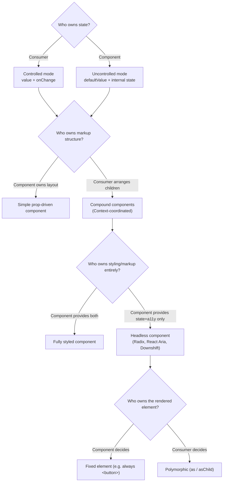

export const metadata = {
  title: "3. Component Architecture",
  description:
    "Controlled vs uncontrolled, compound components, headless components, slots, render props, polymorphic components, forwardRef, composition vs inheritance, and accessibility-first API design.",
};

# 3. Component Architecture

## Quick Glance

- Component architecture decides how state, behavior, markup, and styling split between a component and whoever uses it — and how much control each side keeps.
- The core problem it solves: "boolean prop explosion" — a component that grows one new flag prop per feature request until its API is unmanageable.
- The fix is composition over configuration: give the consumer real structural control (children, Context, Slot) instead of anticipating every case as a prop.
- Controlled vs. uncontrolled: controlled means the consumer owns the state and passes `value`+`onChange`; uncontrolled means the component owns its own state via `defaultValue`. Support both — this is close to a hard requirement.
- Compound components use React Context so a family of subcomponents (like `Tabs.Root`, `Tabs.List`, `Tabs.Trigger`) can coordinate state while the consumer arranges the markup freely.
- Headless components (Radix UI, React Aria, Downshift, Headless UI) externalize state, keyboard behavior, and ARIA wiring, but own zero markup or styling — the consumer supplies all the visuals.
- Polymorphic components (`as`/`asChild`) let one component render as different HTML elements or custom components (e.g. Button as `<a>` or as Next.js `<Link>`), typed so invalid prop combos are compile errors.
- `forwardRef` exposes a DOM node to a ref from outside; `useImperativeHandle` narrows that to a curated set of methods (like `.focus()`) instead of raw DOM access — use the narrower one whenever raw access risks state desync.
- The single most consequential performance issue here is the Context re-render problem: fix it by splitting Context by how often each piece of state changes (actions vs. rare state vs. frequent state).
- Real-world example to cite: Radix UI's Dialog combines nearly every pattern in this chapter — compound, headless, `asChild`, and controlled/uncontrolled — in one component.

## Definition

Component architecture, in a design-system context, is the set of
patterns that decide how a component's **state, behavior, markup, and
styling are divided between the component and whoever uses it** — and
how much control each side keeps over the other. It's not a single
pattern but a toolbox: controlled/uncontrolled state, compound
components, headless composition, slots, render props, and polymorphism
(one component that can render as different elements) each answer a
different version of the same underlying question — *who owns what, and
how does the API expose that ownership without leaking implementation
detail or over-constraining the consumer*? Getting this right is the
difference between a component library that scales to hundreds of
consumers with different needs, and one that collects a growing pile of
one-off boolean props until it collapses under its own weight.

## Problem Statement

A component built for a design system faces a constraint a one-off
product component never deals with: it will be used by consumers the
author has never met, in contexts the author can't fully predict, for
years after the author has moved to a different team. A `<Tabs>`
component built inside a single feature can reasonably hardcode "the
active tab is stored in local `useState`" and be done. A `<Tabs>`
component shipped as part of a design system has to also support: the
product team that needs the active tab synced to a URL query parameter
(so the tab survives a page refresh and can be linked to directly), the
team that needs it fully uncontrolled for a quick internal tool, and the
team that needs custom markup between the tab list and the panels for a
sticky-header layout. All of that, without three different components,
and without the API turning into an unmanageable pile of
`activeTabSource`, `onTabChangeMode`, `customLayoutEnabled` booleans
bolted on one at a time as each new request arrives.

This is the real engineering problem component architecture patterns
solve: **how do you build one component whose state ownership, markup
structure, and styling are all independently flexible, without the API
surface growing in a straight line (or worse) with the number of ways it
can be used?** The patterns in this chapter — compound components,
headless composition, polymorphism, controlled/uncontrolled duality — are
each a different answer to a different slice of that question. A senior
design-system engineer needs to know which slice each pattern actually
addresses, because reaching for the wrong one produces a component
that's flexible in the wrong dimension and still rigid in the one a
consumer actually needed.

## Why Does This Exist?

These patterns exist because of a structural fact about React (and UI
libraries generally): **composition, not configuration, is the
sustainable way to add flexibility to a component API.** A component
with one boolean prop for one variant is fine. A component that's grown
`showIcon`, `iconPosition`, `iconOnClickOnly`, `disableIconOnMobile` over
eighteen months of incremental feature requests is not fine. Each new
prop multiplies the number of prop *combinations* the component has to
handle correctly — many of them nonsensical, like `iconOnClickOnly` with
no `showIcon` — and the component's internal logic turns into a thicket
of conditionals nobody can safely touch. This failure mode has a name —
**boolean prop explosion** — and it's one of the most common ways design
system components rot over time.

Composition-based patterns avoid this by pushing the *decision* about
markup structure or behavior variation out to the consumer, while the
component keeps ownership of only what genuinely needs to be
centralized (state logic, accessibility wiring, keyboard behavior). A
compound `<Tabs>` doesn't need a `tabPosition` prop if the consumer can
just compose `<Tabs.List>` wherever they want in the markup. A headless
`useSelect()` hook doesn't need an `optionRenderer` prop if the consumer
just writes the JSX for each option directly. The flexibility comes from
giving the consumer real compositional control, not from guessing every
configuration in advance and exposing it as a flag.

<Callout type="info" title="The mental model interviewers want">
  Every pattern in this chapter is answering: *what does the component
  own, and what does it hand back to the consumer?* State ownership,
  markup ownership, and styling ownership are three separate axes. A
  pattern that solves one — for example, polymorphism solving "which
  HTML tag renders" — says nothing about the others. Keep the three axes
  distinct in your answers.
</Callout>

## Historical Context

Early React component libraries (pre-2016, and a lot of Bootstrap-era
component wrapping) leaned heavily on **configuration props** — a
`<Modal>` with `showCloseButton`, `closeButtonPosition`, `footerContent`,
`headerContent` props. This happened because JSX-as-children composition
wasn't yet a deeply ingrained habit, and class components made flexible
children patterns more awkward to build well. This is the era boolean
prop explosion comes from, and its scars are still visible in a lot of
legacy enterprise component libraries.

The shift toward **compound components** changed that. React Context
(a way to share data with any descendant component, without passing it
down through every layer of props) let a parent implicitly coordinate
children rendered anywhere within it. This was popularized heavily by
early Kent C. Dodds writing and by Reach UI/Downshift, in the
mid-to-late 2010s. It let markup structure become genuinely
composable — `<Tabs>` no longer needed to know its own internal layout,
because the consumer arranged `<Tabs.List>` and `<Tabs.Panels>`
themselves, with Context quietly wiring the active-tab state between
them.

The **headless component** movement (Downshift, around 2017, followed by
Reach UI, then more prominently Radix UI and React Aria from roughly
2020 onward) took this a step further. It separated *state and
accessibility behavior* from *any* rendered markup or styling at all.
The insight: the hardest, most valuable part of building an accessible
`<Combobox>` is the keyboard handling and ARIA wiring (attributes that
describe the UI to screen readers) — not the visual styling, which every
consuming team wants to control themselves anyway. This architecture
made it possible for a single accessible-behavior implementation to get
reused across dozens of visually distinct design systems (Radix's
primitives underpin shadcn/ui and many custom-built systems at the same
time).

**Polymorphic components** (the `as`/`asChild` prop) came from a
narrower but very concrete problem: a design system's `<Button>` needing
to render as an `<a>` when used for navigation, without either
duplicating the button's styling logic in a separate `<LinkButton>`
component, or losing type safety on which props are valid for which
rendered element. Radix's `asChild` (built on Radix's `Slot` primitive)
and Stitches's (and other libraries') `as` prop both converged on this
solution around 2020-2021. It's now a standard expectation for any
serious design system's interactive components.

## How It Works Internally

### Presentational vs. Container components

This is the oldest distinction in this chapter's topic list, and it's
worth stating precisely because the term still gets used loosely. A
**presentational component** renders UI from the props it's given, and
owns no business logic or data-fetching — it's a pure function that
turns props into markup. A **container component** owns state,
data-fetching, or business logic, and hands off the actual rendering to
presentational components.

In a design system specifically, almost every shipped component should
be presentational — a `<Card>` should never fetch data itself.
Containers belong in product code, which combines design-system
presentational components with its own data and business logic.

Keeping this boundary sharp pays off in testability and reuse. A
presentational `<PriceTag>` component can be dropped into any product
context, because it has no opinion about where its data comes from. A
container that fetches pricing data, on the other hand, is inherently
tied to one product's API shape.

### Controlled vs. uncontrolled components

This is the single most important state-ownership decision a design
system component makes. It's usually the first architectural decision
teams get wrong, because it's easy to build only the controlled version
and call the job done.

A **controlled** component has no internal state for the value in
question. The consumer owns the state (via `useState` or otherwise) and
passes it in as a prop, along with a change handler — the component just
reflects that external state. An **uncontrolled** component owns its own
internal state and only *notifies* the consumer of changes, optionally
accepting a `defaultValue` for the starting state. Native HTML form
elements are uncontrolled by default — `<input>` manages its own value
unless you wire up `value`+`onChange` yourself — which is part of why
this distinction is so central to any component that wraps form-like
behavior.

```tsx
// packages/ui/src/components/text-field/text-field.tsx
//
// A design-system TextField needs to support BOTH modes: consumers doing
// controlled form validation with react-hook-form or Formik need full
// control over the value; consumers building a quick uncontrolled search
// box shouldn't be forced to wire up state for a value they don't care
// to observe on every keystroke. This is the standard dual-mode pattern:
// accept `value`+`onChange` OR `defaultValue`, fall back to internal
// state only when uncontrolled, and never let the mode change mid-life
// (React itself warns about that, and it's a real correctness bug).
import { useState, useCallback, useRef, forwardRef, type ChangeEvent } from "react";

interface TextFieldProps {
  /** Controlled value — if provided, this component renders it verbatim. */
  value?: string;
  /** Initial value for uncontrolled usage. Ignored if `value` is provided. */
  defaultValue?: string;
  onChange?: (value: string) => void;
  label: string;
  id: string;
  errorMessage?: string;
}

export const TextField = forwardRef<HTMLInputElement, TextFieldProps>(function TextField(
  { value, defaultValue, onChange, label, id, errorMessage },
  ref
) {
  const isControlled = value !== undefined;
  const [internalValue, setInternalValue] = useState(defaultValue ?? "");
  // Warn once, in development, if a consumer flips between controlled and
  // uncontrolled across renders — a common and hard-to-debug mistake.
  const wasControlled = useRef(isControlled);
  if (process.env.NODE_ENV !== "production" && wasControlled.current !== isControlled) {
    console.error(
      `TextField (${id}): switched from ${wasControlled.current ? "controlled" : "uncontrolled"} to ${
        isControlled ? "controlled" : "uncontrolled"
      }. Decide one mode and keep it for the component's lifetime.`
    );
  }

  const resolvedValue = isControlled ? value : internalValue;

  const handleChange = useCallback(
    (event: ChangeEvent<HTMLInputElement>) => {
      const next = event.target.value;
      if (!isControlled) setInternalValue(next);
      onChange?.(next);
    },
    [isControlled, onChange]
  );

  const errorId = errorMessage ? `${id}-error` : undefined;

  return (
    <div className="text-field">
      <label htmlFor={id}>{label}</label>
      <input
        ref={ref}
        id={id}
        value={resolvedValue}
        onChange={handleChange}
        aria-invalid={Boolean(errorMessage)}
        aria-describedby={errorId}
      />
      {errorMessage && (
        <span id={errorId} role="alert" className="text-field__error">
          {errorMessage}
        </span>
      )}
    </div>
  );
});
```

Design system components almost always need to support both modes, for
the reason the code comment above states: form libraries (react-hook-form,
Formik) and complex validation flows need controlled access, while
simple usage — a search box, a filter input with no external validation
need — is needlessly verbose if forced into controlled mode. The
`isControlled` check, based on `value !== undefined` and computed fresh
on every render rather than cached, is the standard way to do this. It's
also what lets the dev-mode warning above catch a consumer accidentally
flipping modes — for example, passing `value={apiResponse?.name}` where
`apiResponse` starts out `undefined` and later resolves, silently
flipping the component from uncontrolled to controlled mid-life.

### Compound Components

The compound component pattern solves the **markup-structure ownership**
problem. Instead of a single component accepting a large configuration
object or many props to describe internal layout, a family of
components share implicit state via React Context, and the consumer
arranges them freely in JSX.

```tsx
// packages/ui/src/components/tabs/tabs.tsx
//
// Full worked compound-component example. The consumer controls exactly
// where <Tabs.List> and <Tabs.Panels> render — including wrapping them
// in their own layout markup — because none of that structure is
// hardcoded inside a single monolithic <Tabs> component. Context is the
// mechanism that lets <Tabs.Trigger> (deeply nested, arbitrary distance
// from <Tabs.Root>) still coordinate the active-tab state.
import {
  createContext,
  useContext,
  useState,
  useId,
  type ReactNode,
  type KeyboardEvent,
} from "react";

interface TabsContextValue {
  activeTab: string;
  setActiveTab: (id: string) => void;
  idPrefix: string;
}

const TabsContext = createContext<TabsContextValue | null>(null);

function useTabsContext(component: string): TabsContextValue {
  const ctx = useContext(TabsContext);
  if (!ctx) {
    // Fail loudly at the call site, not with a cryptic "cannot read
    // property of null" three renders later — this is the standard
    // guard every compound-component subcomponent needs.
    throw new Error(`<Tabs.${component}> must be rendered inside <Tabs.Root>.`);
  }
  return ctx;
}

interface TabsRootProps {
  defaultTab: string;
  value?: string;
  onChange?: (id: string) => void;
  children: ReactNode;
}

function Root({ defaultTab, value, onChange, children }: TabsRootProps) {
  const [internalTab, setInternalTab] = useState(defaultTab);
  const idPrefix = useId();
  const isControlled = value !== undefined;
  const activeTab = isControlled ? value : internalTab;

  const setActiveTab = (id: string) => {
    if (!isControlled) setInternalTab(id);
    onChange?.(id);
  };

  return (
    <TabsContext.Provider value={{ activeTab, setActiveTab, idPrefix }}>
      {children}
    </TabsContext.Provider>
  );
}

function List({ children }: { children: ReactNode }) {
  return (
    <div role="tablist" className="tabs__list">
      {children}
    </div>
  );
}

function Trigger({ tabId, children }: { tabId: string; children: ReactNode }) {
  const { activeTab, setActiveTab, idPrefix } = useTabsContext("Trigger");
  const isActive = activeTab === tabId;

  // Roving tabindex + arrow-key navigation is the WAI-ARIA-required
  // keyboard model for tabs; see the accessibility chapter for the
  // general pattern this instantiates.
  const handleKeyDown = (event: KeyboardEvent<HTMLButtonElement>) => {
    if (event.key === "ArrowRight" || event.key === "ArrowLeft") {
      event.preventDefault();
      const siblings = Array.from(
        (event.currentTarget.parentElement?.children ?? []) as HTMLButtonElement[]
      );
      const currentIndex = siblings.indexOf(event.currentTarget);
      const nextIndex =
        event.key === "ArrowRight"
          ? (currentIndex + 1) % siblings.length
          : (currentIndex - 1 + siblings.length) % siblings.length;
      siblings[nextIndex]?.focus();
      siblings[nextIndex]?.click();
    }
  };

  return (
    <button
      role="tab"
      id={`${idPrefix}-tab-${tabId}`}
      aria-selected={isActive}
      aria-controls={`${idPrefix}-panel-${tabId}`}
      tabIndex={isActive ? 0 : -1}
      className={isActive ? "tabs__trigger tabs__trigger--active" : "tabs__trigger"}
      onClick={() => setActiveTab(tabId)}
      onKeyDown={handleKeyDown}
    >
      {children}
    </button>
  );
}

function Panel({ tabId, children }: { tabId: string; children: ReactNode }) {
  const { activeTab, idPrefix } = useTabsContext("Panel");
  if (activeTab !== tabId) return null;
  return (
    <div
      role="tabpanel"
      id={`${idPrefix}-panel-${tabId}`}
      aria-labelledby={`${idPrefix}-tab-${tabId}`}
      tabIndex={0}
    >
      {children}
    </div>
  );
}

export const Tabs = { Root, List, Trigger, Panel };
```

```tsx
// Consumer usage — the consumer decides layout freely: a sidebar layout
// with <Tabs.List> in a different DOM position than <Tabs.Panel> is
// trivially expressible, because nothing about the structure is
// hardcoded inside Tabs itself.
<Tabs.Root defaultTab="billing">
  <Tabs.List>
    <Tabs.Trigger tabId="profile">Profile</Tabs.Trigger>
    <Tabs.Trigger tabId="billing">Billing</Tabs.Trigger>
  </Tabs.List>
  <Tabs.Panel tabId="profile">Profile settings…</Tabs.Panel>
  <Tabs.Panel tabId="billing">Billing settings…</Tabs.Panel>
</Tabs.Root>
```

Notice that `Tabs.Root` itself supports the controlled/uncontrolled
duality from the previous section. The two patterns work together, and
a production-grade compound component almost always needs both.

### Headless Components

Headless components take the compound-component idea one step further.
They externalize **state, behavior, and accessibility wiring** — but
they externalize *all* markup and styling too. The hook or component
gives you props to spread onto whatever elements you render, and
renders nothing itself.

The value proposition is precise and worth stating exactly, because
"headless" often gets used vaguely in interviews. A headless
`useCombobox()` hook (the shape Downshift popularized) owns *which item
is highlighted*, *keyboard navigation logic* (arrow keys, Home/End,
type-to-search), and *ARIA attribute wiring* (`role="combobox"`,
`aria-activedescendant`, `aria-expanded`) — genuinely hard,
easy-to-get-wrong logic that shouldn't be rebuilt by every consuming
team. It does *not* own any DOM structure or CSS class. The consumer
renders whatever markup fits their design, spreading the returned
prop-getters onto their own elements.

```tsx
// A sketch of consuming a headless primitive (Radix UI's Popover +
// Downshift-style combobox logic) — the important detail is that NONE
// of the rendered markup or class names are owned by the library; only
// state, keyboard behavior, and ARIA attributes are.
import { useCombobox } from "downshift";

function CitySelect({ cities }: { cities: string[] }) {
  const {
    isOpen,
    getLabelProps,
    getMenuProps,
    getInputProps,
    getItemProps,
    highlightedIndex,
  } = useCombobox({ items: cities });

  return (
    <div className="my-own-combobox-styles">
      <label {...getLabelProps()}>City</label>
      <input {...getInputProps()} className="my-brand-input" />
      <ul {...getMenuProps()} className="my-brand-menu">
        {isOpen &&
          cities.map((city, index) => (
            <li
              key={city}
              {...getItemProps({ item: city, index })}
              className={index === highlightedIndex ? "my-brand-item--active" : "my-brand-item"}
            >
              {city}
            </li>
          ))}
      </ul>
    </div>
  );
}
```

**Radix UI**, **React Aria** (Adobe's headless primitive library, which
powers Spectrum itself), **Downshift**, and **Headless UI** (Tailwind
Labs) are the real, citable examples of this pattern in production.
Their existence is exactly why a growing number of design systems — most
visibly shadcn/ui, but also many custom-built enterprise systems — are
built as *styling* on top of an existing headless behavior layer, rather
than rebuilding accessible keyboard and ARIA logic from scratch. The
hard 15% of building an accessible combobox (see
[accessibility](/chapters/accessibility)) gets done once, correctly, by
specialists — and every consumer only has to do the styling work they
wanted to do anyway.

### Slot pattern vs. Render Props

Both patterns solve a version of "let the consumer inject custom
rendering into a part of a component I own." But they solve it
differently, and have different costs.

**Render props** pass a function as a prop (or as `children`). The
component calls that function with whatever data or state the consumer
needs, and lets the consumer decide what to render with it:

```tsx
// Render-props form: the consumer's render function receives internal
// state (isOpen, close) and decides what markup to render with it.
<Disclosure>
  {({ isOpen, toggle }) => (
    <>
      <button onClick={toggle}>{isOpen ? "Hide" : "Show"} details</button>
      {isOpen && <p>Extra detail content…</p>}
    </>
  )}
</Disclosure>
```

**The Slot pattern** (as implemented by Radix's `Slot` primitive, and
conceptually similar to named slots in Vue/Web Components) instead lets
the consumer pass a *single child element*. The component merges its own
props and behavior onto that child, instead of rendering its own wrapper
element at all:

```tsx
// packages/ui/src/lib/slot.tsx
//
// A minimal Slot implementation: instead of the component rendering its
// own wrapper (e.g. always a <button>), Slot clones the single child the
// consumer passed and merges props onto it — this is the mechanism
// asChild/polymorphism (next section) is built on.
import { cloneElement, isValidElement, type ReactElement, type ReactNode } from "react";

interface SlotProps {
  children: ReactNode;
  [key: string]: unknown;
}

export function Slot({ children, ...slotProps }: SlotProps) {
  if (!isValidElement(children)) return null;
  const child = children as ReactElement<Record<string, unknown>>;
  return cloneElement(child, {
    ...slotProps,
    ...child.props,
    // Merge event handlers and className rather than letting one side
    // silently clobber the other — a common Slot implementation bug.
    className: [slotProps.className, child.props.className].filter(Boolean).join(" ") || undefined,
    style: { ...(slotProps.style as object), ...(child.props.style as object) },
  });
}
```

The practical difference: render props are explicit and flexible (the
consumer gets arbitrary data and returns arbitrary JSX), but they add a
level of function-as-child nesting that some teams find harder to read.
They also can't merge behavior onto an element the consumer already
owns — they can only pass data *to* a render function. Slot merges the
component's behavior (event handlers, ARIA attributes) *onto* an element
the consumer fully controls the tag and props of, which is exactly what
polymorphism needs. In practice, hooks (see below) have replaced render
props for most *data-exposure* use cases since around 2019, while Slot
has become the standard mechanism specifically for the *"render as this
other element"* use case.

### Polymorphic Components (`as` / `asChild`)

This is one of the most commonly asked senior-level coding questions in
design-system interviews, so it's worth a complete, correct
implementation rather than a sketch. The problem: a `<Button>` needs to
sometimes render as a real `<a>` (for navigation, so it gets real link
behavior — middle-click-to-open-in-new-tab, correct crawler behavior)
while keeping all of Button's visual styling. TypeScript should still
correctly check that `href` is only a valid prop when rendering as
`<a>`, not when rendering as the default `<button>`.

```tsx
// packages/ui/src/components/button/button.tsx
//
// Full polymorphic component implementation using generics. The `as`
// prop lets the consumer choose the rendered element (or a custom
// component); the prop types are computed FROM that element type, so
// `href` is a type error unless `as="a"`, and ref forwarding is typed
// correctly for whichever element was chosen.
import type { ComponentPropsWithoutRef, ElementType, ReactNode, Ref } from "react";
import { forwardRef } from "react";

// Extracts the intrinsic/component prop type for whatever `as` resolves
// to, so `href`, `download`, etc. are only valid when `as="a"`.
type PolymorphicProps<E extends ElementType, Props> = Props &
  Omit<ComponentPropsWithoutRef<E>, keyof Props | "as"> & {
    as?: E;
  };

type PolymorphicRef<E extends ElementType> = ComponentPropsWithoutRef<E> extends { ref?: infer R }
  ? R
  : Ref<Element>;

interface ButtonOwnProps {
  variant?: "primary" | "secondary" | "danger";
  size?: "sm" | "md" | "lg";
  children: ReactNode;
}

type ButtonProps<E extends ElementType = "button"> = PolymorphicProps<E, ButtonOwnProps>;

// A generic forwardRef wrapper is required because plain forwardRef
// can't express a generic type parameter on its own — this cast is the
// standard, well-known workaround (React's own types don't support
// generic forwardRef components directly).
type ButtonComponent = <E extends ElementType = "button">(
  props: ButtonProps<E> & { ref?: PolymorphicRef<E> }
) => ReactNode;

export const Button: ButtonComponent = forwardRef(function Button<E extends ElementType = "button">(
  { as, variant = "primary", size = "md", className, children, ...rest }: ButtonProps<E>,
  ref: PolymorphicRef<E>
) {
  const Component = as ?? "button";
  return (
    <Component
      ref={ref}
      className={["btn", `btn--${variant}`, `btn--${size}`, className].filter(Boolean).join(" ")}
      {...rest}
    >
      {children}
    </Component>
  );
}) as ButtonComponent;
```

```tsx
// Consumer usage — both compile, and TypeScript enforces correctness:
<Button variant="primary">Save</Button>                          // renders <button>
<Button as="a" href="/pricing" variant="secondary">Pricing</Button> // renders <a>, href is valid because as="a"

// This is a compile error: `href` isn't a valid prop when `as` is
// omitted (defaults to "button", which has no `href`):
// <Button href="/pricing">Save</Button>  // ❌ type error
```

Radix UI popularized a closely related but distinct variant of this
pattern: **`asChild`**, which uses the `Slot` primitive shown earlier
instead of an `as` prop. Where `as="a"` tells the component *which tag*
to render, `asChild` tells the component *"merge my behavior onto
whatever single child you were given."* This is strictly more flexible,
because the child can be any custom component (like Next.js's `<Link>`),
not just an HTML tag name string:

```tsx
// asChild form: Button merges its className/behavior onto the Next.js
// <Link> the consumer already wanted to use, rather than requiring
// Button to know how to render "as a Next.js Link" via a string prop.
<Button asChild variant="primary">
  <Link href="/pricing">Pricing</Link>
</Button>
```

`as` is simpler to type and reason about for plain HTML elements.
`asChild` is more powerful, because it works with *any* component the
consumer already has (a framework router's Link component is the most
common real case), without the polymorphic component needing to know
that component exists.

### forwardRef and useImperativeHandle

Design system components often need to expose a DOM node or an
imperative method to their consumer — most commonly so a form library or
a parent component can call `.focus()` in code (after a validation
error, for instance) without that logic living inside the design system
component itself. `forwardRef` is what makes a function component's
underlying DOM node reachable via `ref` from the outside at all
(function components don't automatically get a `ref` prop the way class
components used to). `useImperativeHandle` goes further, letting a
component expose a *custom* handle — a curated set of methods — instead
of the raw DOM node. That's the right choice whenever the raw node would
let a consumer do too much, like directly changing DOM attributes the
component's internal state assumes it fully controls.

```tsx
// packages/ui/src/components/input/input.tsx
//
// Input exposes a custom imperative handle (.focus(), .scrollIntoView())
// rather than the raw <input> DOM node, so a consumer can imperatively
// focus/scroll to it after a validation error — a very common real
// design-system requirement — without also being able to directly
// mutate DOM attributes (e.g. `.value =`) that would desync from
// React's controlled state and cause a hard-to-debug inconsistency.
import { forwardRef, useImperativeHandle, useRef } from "react";

export interface InputHandle {
  focus: () => void;
  scrollIntoView: () => void;
}

interface InputProps {
  label: string;
  value: string;
  onChange: (value: string) => void;
  errorMessage?: string;
}

export const Input = forwardRef<InputHandle, InputProps>(function Input(
  { label, value, onChange, errorMessage },
  ref
) {
  const inputRef = useRef<HTMLInputElement>(null);

  useImperativeHandle(ref, () => ({
    focus: () => inputRef.current?.focus(),
    scrollIntoView: () => inputRef.current?.scrollIntoView({ behavior: "smooth", block: "center" }),
  }));

  return (
    <div className="input">
      <label>{label}</label>
      <input ref={inputRef} value={value} onChange={(e) => onChange(e.target.value)} aria-invalid={Boolean(errorMessage)} />
      {errorMessage && <span role="alert">{errorMessage}</span>}
    </div>
  );
});
```

```tsx
// Consumer: a form-level validation summary imperatively focuses the
// first invalid field when the user submits — a real, common pattern
// (WCAG 3.3.1 error identification benefits directly from this).
function CheckoutForm() {
  const emailRef = useRef<InputHandle>(null);

  const handleSubmit = () => {
    if (!isValidEmail(email)) {
      emailRef.current?.focus();
      emailRef.current?.scrollIntoView();
    }
  };

  return <Input ref={emailRef} label="Email" value={email} onChange={setEmail} />;
}
```

## Architecture

The patterns above fit together into a layered decision model, not a
flat list. The questions "who owns state," "who owns markup structure,"
and "who owns the rendered element" are independent axes, and a mature
design system component typically answers all three at once.



Reading this tree left to right for a real component: `<Button>` is
usually controlled-by-nature (it has no internal state to control),
markup-simple (no compound structure needed), fully styled (a design
system's Button ships real visual styles — it isn't headless), and
polymorphic (`as`/`asChild` for the `<a>` case). `<Select>`, by
contrast, typically needs controlled/uncontrolled duality, benefits from
compound structure for complex option layouts, and is a strong
candidate for a headless implementation underneath (Radix `Select` or
React Aria's `useSelect`) — precisely because select/combobox keyboard
behavior is exactly the "hard, easy-to-get-wrong" logic headless
libraries exist to centralize.

## Real-World Example

**Radix UI's `Dialog` primitive** is a clean illustration of nearly
every pattern in this chapter at once. It's a compound component
(`Dialog.Root`, `Dialog.Trigger`, `Dialog.Portal`, `Dialog.Overlay`,
`Dialog.Content`, `Dialog.Close`, coordinated via Context so a consumer
can arrange them freely — including wrapping `Dialog.Content` in
arbitrary layout markup). It's headless in the sense that it ships zero
default visual styling — every design system that adopts Radix supplies
its own CSS entirely. Every interactive piece supports `asChild`, so a
consumer can render `Dialog.Trigger` as their own already-styled
`<Button>` component, instead of Radix rendering an unstyled default
button. And the state is dual-mode controlled/uncontrolled
(`Dialog.Root` accepts `open`+`onOpenChange` or an uncontrolled
`defaultOpen`). This is exactly why shadcn/ui, and a large number of
custom-built enterprise systems, are built as a styling layer on top of
Radix instead of rebuilding dialog focus-trapping and ARIA wiring from
scratch. The accessibility-critical behavior — focus trap, `Escape` to
close, focus restoration on close, `aria-modal` — is centralized once in
Radix, and every consuming system inherits it correctly.

**Adobe's React Aria** takes the headless idea to its most rigorous
form, specifically because it underpins Spectrum, a design system that
has to work correctly across a huge range of Adobe products. React
Aria's hooks (`useButton`, `useDialog`, `useListBox`) are deliberately
kept separate even from React Aria's own styled component layer
(`react-aria-components` / Spectrum itself). That way, a team that needs
Spectrum's accessibility behavior but a completely different visual
design can use the hooks directly, without the Spectrum styling at all.

## Implementation Example

The examples woven through this chapter (the Tabs compound component,
the polymorphic Button, Input with an imperative handle) are themselves
the production-grade implementation examples this section calls for.
Rather than repeat them, here's a compact composite showing how a real
`<Select>` component in a design system typically layers **all** of the
architectural decisions from this chapter at once: controlled/
uncontrolled duality, compound structure, and context-splitting to avoid
the re-render problem covered in the next section.

```tsx
// packages/ui/src/components/select/select.tsx
//
// Context splitting: state that changes on every keystroke/hover
// (highlightedIndex) is isolated in its own context from state that
// changes rarely (isOpen, selectedValue). Without this split, a
// component like Tabs.Trigger's Select equivalent would re-render on
// every mouse-hover-driven highlight change even though its own
// rendered output (whether it's selected) didn't change — the classic
// Context re-render performance trap, covered in depth in the React
// Architecture chapter.
import { createContext, useContext, useMemo, useState, type ReactNode } from "react";

interface SelectStateContextValue {
  selectedValue: string | undefined;
  isOpen: boolean;
}
interface SelectHighlightContextValue {
  highlightedIndex: number;
  setHighlightedIndex: (index: number) => void;
}
interface SelectActionsContextValue {
  select: (value: string) => void;
  toggle: () => void;
}

const SelectStateContext = createContext<SelectStateContextValue | null>(null);
const SelectHighlightContext = createContext<SelectHighlightContextValue | null>(null);
const SelectActionsContext = createContext<SelectActionsContextValue | null>(null);

interface SelectRootProps {
  value?: string;
  defaultValue?: string;
  onChange?: (value: string) => void;
  children: ReactNode;
}

function Root({ value, defaultValue, onChange, children }: SelectRootProps) {
  const [internalValue, setInternalValue] = useState(defaultValue);
  const [isOpen, setIsOpen] = useState(false);
  const [highlightedIndex, setHighlightedIndex] = useState(0);
  const isControlled = value !== undefined;
  const selectedValue = isControlled ? value : internalValue;

  // Actions never change identity across renders, so components that
  // only need `select`/`toggle` (not the current state) never re-render
  // when selectedValue or highlightedIndex changes — this is the actual
  // payoff of splitting actions into their own, stable context.
  const actions = useMemo<SelectActionsContextValue>(
    () => ({
      select: (next: string) => {
        if (!isControlled) setInternalValue(next);
        onChange?.(next);
        setIsOpen(false);
      },
      toggle: () => setIsOpen((open) => !open),
    }),
    [isControlled, onChange]
  );

  const stateValue = useMemo(() => ({ selectedValue, isOpen }), [selectedValue, isOpen]);
  const highlightValue = useMemo(
    () => ({ highlightedIndex, setHighlightedIndex }),
    [highlightedIndex]
  );

  return (
    <SelectActionsContext.Provider value={actions}>
      <SelectStateContext.Provider value={stateValue}>
        <SelectHighlightContext.Provider value={highlightValue}>
          {children}
        </SelectHighlightContext.Provider>
      </SelectStateContext.Provider>
    </SelectActionsContext.Provider>
  );
}

export function useSelectState() {
  const ctx = useContext(SelectStateContext);
  if (!ctx) throw new Error("useSelectState must be used within Select.Root");
  return ctx;
}
export function useSelectActions() {
  const ctx = useContext(SelectActionsContext);
  if (!ctx) throw new Error("useSelectActions must be used within Select.Root");
  return ctx;
}
export function useSelectHighlight() {
  const ctx = useContext(SelectHighlightContext);
  if (!ctx) throw new Error("useSelectHighlight must be used within Select.Root");
  return ctx;
}

export const Select = { Root };
```

## Advantages

- **Composition-based patterns scale API surface more slowly** than the
  number of use cases supported, because flexibility comes from
  consumer-controlled structure, not an ever-growing prop list.
- **Headless separation lets accessibility investment be centralized**
  once and inherited by every visual variant, instead of every team
  rebuilding (and likely under-building) keyboard and ARIA behavior on
  its own.
- **Controlled/uncontrolled duality serves both simple and complex
  consumers** from a single component, instead of forcing a choice
  between a "simple" and "advanced" component pair to maintain.
- **Polymorphism removes duplicate, near-identical components**
  (`Button`/`LinkButton`) while keeping type safety on which props are
  valid for the rendered element.
- **forwardRef/useImperativeHandle enable real integration with form
  libraries and native accessibility patterns** (focus-on-error), without
  those consumers reaching into implementation detail.

## Disadvantages

- **Compound components and headless patterns have a steeper learning
  curve to author** than a single prop-driven component — Context
  wiring, guard clauses, and prop-getter merging are more code to get
  right than a flat props interface.
- **Polymorphic component types are genuinely complex TypeScript**, and
  the generic `forwardRef` cast pattern isn't obvious. New contributors
  to a design system often need direct mentoring on this specific
  pattern the first time they touch it.
- **Composition-heavy APIs are harder to check automatically** for
  correct usage than a flat prop interface. A missing `Tabs.List` inside
  `Tabs.Root` is a runtime error, caught only if the guard clauses are
  written carefully — not always something the compiler catches.
- **Headless components require the consuming team to do real styling
  work.** This is a deliberate tradeoff (see Chapter 1's callout on this
  exact question), but it's a genuine cost for small teams that just
  want something that looks reasonable out of the box.

## Alternatives

Here are the realistic architectural choices for a new design system
component, compared directly:

| Dimension | Flat prop-driven component | Compound components (Context) | Headless (Radix / React Aria / Downshift) | Fully styled, non-headless (MUI, Ant Design style) |
| --- | --- | --- | --- | --- |
| What problem it solves | Simple, fixed-structure UI with a small number of variants | Consumer-controlled markup structure without prop explosion | Reusable accessible behavior with zero styling opinion | Fast, complete out-of-the-box UI with minimal integration work |
| Why it was created | Simplest possible API for simple components | JSX composition idiom matured; avoids config-object/boolean-prop sprawl | Recognized that accessible keyboard/ARIA logic is the hard, reusable 15%, styling is not | Product teams wanted a complete design system without building one |
| Performance | Simple, minimal re-render surface if props are stable | Requires context-splitting discipline to avoid broad re-renders (see below) | Same re-render considerations as compound; behavior-only so less render surface overall | Varies; often heavier due to built-in theming engines and broad style APIs |
| Developer experience | Easiest to learn and use for simple cases | Requires understanding the Context contract (must render inside Root) | Requires writing all markup/styling yourself — powerful but more upfront work | Fastest initial velocity; hardest to deeply customize past what the theme API exposes |
| Learning curve | Very low | Moderate | Moderate-to-high (prop getters, hook composition) | Low to adopt, high to override deeply |
| Community / ecosystem | Universal pattern, no special tooling | Common in modern React libraries (Reach UI style) | Very strong and growing (Radix, React Aria, Headless UI, Downshift all active, widely adopted) | Very large (MUI, Ant Design) but increasingly seen as harder to fully re-skin |
| Maintenance burden | Low for the component itself; high prop-list growth risk over time | Moderate — Context contracts need guard clauses and clear docs | Low for behavior (owned upstream); styling maintenance shifts to the consuming team | Low for consumers; high lock-in to the library's own visual system |
| Enterprise suitability | Fine for small, stable component sets | High — this is the standard pattern for design-system primitives at scale | High — this is what most new large-scale multi-brand systems build on top of today | High for teams that don't need brand-distinct visual identity |
| When to choose it | Small, low-variation components (Badge, Avatar) | Any component with real structural flexibility needs (Tabs, Accordion, Select) | Building a *new* design system that needs full visual control but not to reinvent a11y | Prototyping, internal tools, or teams with no dedicated design language to express |
| When NOT to choose it | Any component under real structural-flexibility pressure — you'll relearn this chapter's lesson via prop explosion | Very simple components — the Context overhead isn't justified | Teams needing something visually complete immediately with no design bandwidth | Any team needing a distinct, non-generic brand identity — deep re-skinning fights the library |

Large product companies building their own design system (Atlassian,
Shopify, Adobe) overwhelmingly converge on the **headless-underneath,
compound-on-top** combination for complex interactive components —
either by building their own headless layer (React Aria, which Adobe
built for exactly this reason) or by adopting an existing one (Radix,
increasingly common even inside large companies instead of rebuilding
it) — while keeping flat prop-driven components for genuinely simple,
low-variation pieces like Badge or Avatar, where compound structure
would be pure overhead. Fully-styled, non-headless libraries like MUI
remain the right choice specifically when a team has no distinct brand
identity to express and values shipping speed over long-term visual
differentiation. Notably, this is rarely the choice of a company big
enough to be *building* a named design system, precisely because such
companies exist to express a distinct brand — something non-headless
libraries actively resist.

## Tradeoffs

The tradeoff that repeats across every pattern in this chapter is
**flexibility versus upfront complexity, paid by different parties**. A
flat prop-driven component is cheap to build and cheap to use, until it
isn't — the cost shows up later, and grows fast, as prop explosion. A
compound/headless component is more expensive to build and to *learn* to
use correctly, but that cost gets paid once (by the design-system team
building it, and by each consuming engineer's first encounter with the
pattern), and it scales far better as real-world usage diversity grows.

This is why the practical guidance depends on usage pattern, not a fixed
rule: components with genuinely low variation (a `Badge` that's always
just colored text in a pill) should stay simple. Components that
routinely get structural or behavioral edge-case requests (`Select`,
`Dialog`, `Tabs`, `Accordion`) justify the compound/headless investment
almost every time, because the alternative — prop explosion — is a
worse long-term cost.

A second tradeoff specific to polymorphism: `asChild`/Slot is more
powerful than `as`, but it's also harder to discover and slightly more
"magic." A consumer reading `<Button asChild><Link/></Button>` has to
understand the Slot-merging mechanism to predict exactly which props end
up where, while `as="a"` reads more directly. Systems that expect a wide
range of consumer skill levels (a public open-source component library,
for instance) often ship `as` as the primary, easier-to-read API, and
`asChild` as a documented escape hatch specifically for the
router-integration case — rather than leading with `asChild` everywhere.

## Performance Considerations

The single most consequential performance issue in compound/context-
based component architecture is **the Context re-render problem**.
Every component that calls `useContext(SomeContext)` re-renders whenever
the value passed to that Context's Provider changes — even if the
specific field that component actually reads didn't change. A naive
`<Tabs>` implementation that puts `{ activeTab, setActiveTab,
highlightedIndex, setHighlightedIndex }` all in one Context value will
re-render *every* `Tabs.Trigger` on every hover-driven highlight change,
even though most triggers' rendered output (whether they're the active
tab) didn't change at all.

The fix, shown in the `<Select>` implementation above, is **context
splitting**: separate frequently-changing state (`highlightedIndex`),
rarely-changing state (`selectedValue`/`isOpen`), and
never-changing-identity actions (`select`, `toggle`, wrapped in
`useMemo`/`useCallback`) into distinct Context providers. That way a
component only re-renders when the specific slice of state it actually
subscribes to changes. This is covered in architectural depth, including
memoization strategy and Server Components implications, in
[React Architecture for Design Systems](/chapters/react-architecture) —
but the pattern *starts* here, at the component-architecture level,
because it's compound components specifically that create the
many-context-consumers shape that makes this optimization necessary in
the first place.

A second, more minor point: `cloneElement`-based Slot implementations
(shown above) do add a small per-render cost from merging props, and
deeply nested Slot usage (Slot inside Slot, which does happen with
layered composition) can add up. In practice this cost is negligible
next to actual DOM work, but it's worth knowing it exists rather than
assuming Slot is entirely free.

## Scalability Considerations

As a design system's component count and consumer count both grow, two
scalability pressures show up specifically in component architecture.
First, **API consistency across components** gets harder to maintain by
convention alone. If `Tabs` uses `defaultTab`/`value`/`onChange` for its
controlled/uncontrolled contract but `Accordion` uses
`defaultExpanded`/`expanded`/`onExpandedChange`, every consumer has to
re-learn the pattern for each component instead of transferring
intuition from one to the next. Mature systems solve this by treating
controlled/uncontrolled naming (`value`/`defaultValue`/`onChange`
everywhere, mirroring native HTML input conventions) as a hard API
convention enforced in component review, not a per-component judgment
call.

Second, **headless/compound components generalize better to new,
unanticipated composition needs** than flat prop-driven ones do, as the
consumer count grows — this is precisely the scaling property that
justifies their higher upfront cost. A flat `<Select>` that grows a
`renderOption` prop to handle one team's custom option layout need will
need a second escape-hatch prop for the next team's different need, and
a third, growing in step (or worse) with consumer diversity. A compound
`<Select>`, where the consumer composes `Select.Option` however they
like, absorbs new layout requirements without any API change to the
component at all. This is the concrete mechanism behind the "composition
scales, configuration doesn't" claim made earlier in the chapter.

## Common Mistakes

<Callout type="danger" title="Building only the controlled version">
  Shipping a component that only accepts `value`+`onChange` forces every
  consumer — even ones with no need to observe or control the value
  externally — to write boilerplate `useState` wiring. Support both
  modes from the start. Adding uncontrolled support later is a breaking
  API change for any consumer relying on the always-controlled
  assumption.
</Callout>

<Callout type="danger" title="One giant Context value in a compound component">
  Putting every piece of state — including frequently-changing state
  like hover/highlight index — into a single Context causes every
  consuming subcomponent to re-render on every state change, whether or
  not it reads the changed field. Split contexts by how often the state
  changes, as shown in the `<Select>` implementation above.
</Callout>

<Callout type="danger" title="Boolean prop explosion instead of composition">
  Adding `showIcon`, `iconPosition`, `iconOnlyOnMobile` one at a time in
  response to individual feature requests, instead of stepping back and
  offering a composition-based escape hatch (children, Slot, a render
  prop), creates a testing and maintenance burden that gets worse with
  every new prop.
</Callout>

<Callout type="danger" title="Exposing the raw DOM node via ref when a curated handle would do">
  A raw `ref` to the underlying `<input>` lets a consumer directly set
  `.value` or change attributes the component's internal state assumes
  it owns exclusively, causing silent desync bugs. Use
  `useImperativeHandle` to expose only the specific methods
  (`.focus()`, `.scrollIntoView()`) a consumer actually needs.
</Callout>

## Best Practices

- Support both controlled and uncontrolled modes for any component
  wrapping form-like state, following the native-HTML-input naming
  convention (`value`/`defaultValue`/`onChange`) for consistency across
  the whole component library.
- Reach for compound components once a component's structural
  requirements start varying across consumers — don't wait until the
  prop list has already ballooned to add it.
- Build genuinely hard, accessibility-critical interactive components
  (Combobox, Dialog, Menu) on a headless primitive — build your own via
  React Aria's hooks, or adopt Radix — instead of rebuilding keyboard and
  ARIA logic from scratch for each component.
- Split Context by how often state changes in every compound component
  with more than a couple of pieces of shared state. Treat this as a
  default, not an optimization you only add after a profiler flags it.
- Offer `asChild`/Slot as a documented escape hatch for router-Link-style
  composition, but keep a simpler `as`-style or default API as the
  primary path for the common case.
- Expose imperative handles narrowly (`useImperativeHandle` with a
  curated method set), never the raw DOM ref, whenever a component's
  internal state could be corrupted by uncontrolled external DOM
  changes.
- Treat prop naming consistency as a reviewed API contract across the
  whole component library, not a per-component decision — this is what
  lets consumer intuition transfer from one component to the next.

## Interview Questions

<InterviewQuestion q="Why does a design system component almost always need to support both controlled and uncontrolled modes?">
  **What the interviewer is testing:** Whether you understand this isn't
  a nice-to-have, but a structural requirement driven by how different
  design-system consumers are, and whether you know the standard way to
  implement it.

  **Poor answer:** "So it's more flexible."

  **Good answer:** Some consumers need external control (form libraries,
  validation flows syncing to URL state); others just want simple local
  behavior without writing `useState` boilerplate. Supporting both from
  one component avoids needing two near-duplicate components.

  **Excellent senior answer:** Describes the actual implementation
  pattern (`value !== undefined`, computed fresh on every render,
  decides the mode; `defaultValue` seeds internal state only when
  uncontrolled) and names the real bug this pattern has to guard
  against: a consumer accidentally flipping between controlled and
  uncontrolled mid-lifetime — for example, passing a value that starts
  `undefined` and later resolves — and how to catch it in development.

  **Common mistakes:** Describing only one mode, or not knowing that
  React itself warns about switching modes mid-life.
</InterviewQuestion>

<InterviewQuestion q="What does 'headless' actually mean in a component library — what specifically does it externalize?">
  **What the interviewer is testing:** Whether you understand the
  precise state/behavior/a11y vs. markup/styling split, not just that
  "headless" means "unstyled."

  **Poor answer:** "It means the component has no CSS."

  **Good answer:** A headless component owns state management, keyboard
  interaction logic, and ARIA attribute wiring. It externalizes all
  markup and visual styling to the consumer via prop-getters or a Slot
  mechanism.

  **Excellent senior answer:** Names real examples (Radix UI, React
  Aria, Downshift, Headless UI) and explains the actual value
  proposition precisely: the hard, easy-to-get-wrong 15% (focus
  trapping, roving tabindex, `aria-activedescendant` wiring) is
  centralized once and correctly, while the styling work every team
  wants to control themselves anyway is left alone. Can state the real
  cost (consumers do real styling work, higher initial integration
  effort) as the tradeoff for that flexibility.

  **Common mistakes:** Treating "headless" as synonymous with
  "unstyled" without describing what state/behavior is centralized.
</InterviewQuestion>

<InterviewQuestion q="Implement a polymorphic Button component with an `as` prop, correctly typed so that `href` is only valid when `as='a'`.">
  **What the interviewer is testing:** Hands-on TypeScript generics
  skill with a pattern that's genuinely non-obvious — this is one of the
  most common senior-level live-coding questions in this domain.

  **Poor answer:** Uses `as any` or a loosely-typed `[key: string]: any`
  props object to sidestep the type problem entirely.

  **Good answer:** Defines a generic `PolymorphicProps<E, Props>` type
  that merges own props with `ComponentPropsWithoutRef<E>` (excluding
  `as` and own-prop keys), and uses `as ?? "button"` at render time to
  pick the actual rendered element.

  **Excellent senior answer:** Also handles ref forwarding correctly
  with a generic `PolymorphicRef<E>` type and the well-known
  `forwardRef` generic-casting workaround (since `forwardRef` doesn't
  natively support a generic type parameter), and can explain the
  `asChild`/Slot alternative and when it's preferable (any consumer
  component, like a router's `Link`, not just built-in HTML tags).

  **Common mistakes:** Producing a version that compiles but loses type
  safety on element-specific props (for example, `href` is accepted
  regardless of `as` value), which defeats the entire purpose of the
  exercise.
</InterviewQuestion>

<InterviewQuestion q="Why do React design systems favor composition over inheritance — what's the actual mechanical reason, not just 'the docs say so'?">
  **What the interviewer is testing:** First-principles understanding
  rather than a memorized rule — can you explain the structural reason
  composition wins, specific to how React and JSX work?

  **Poor answer:** "React docs recommend composition, so that's what you
  do."

  **Good answer:** Inheritance ties a subclass to its parent's internal
  implementation details (the "fragile base class" problem). React's
  rendering model — components as functions that turn props into
  element trees — has no clean way for a "subclass" to override just one
  piece of a parent's render output, the way JSX children/props
  naturally do.

  **Excellent senior answer:** Adds the specific mechanical point: JSX
  children are just data (a `ReactNode` prop) that a parent component
  can arrange however it wants at render time. That gives you dynamic,
  runtime-composable structure that class inheritance's compile-time,
  single-parent-chain model can't express. A component can combine
  *multiple* independent behaviors at once (a headless hook plus a
  compound Context plus a Slot), while inheritance forces a straight-line
  hierarchy that has to anticipate combinations in advance.

  **Common mistakes:** Giving the generic OOP "favor composition" answer
  without connecting it to anything specific about React/JSX's actual
  rendering model.
</InterviewQuestion>

<InterviewQuestion q="Design a compound Tabs component API. How do you prevent a consumer from rendering `Tabs.Trigger` outside of `Tabs.Root` and getting a confusing error?">
  **What the interviewer is testing:** Whether you'd actually build the
  Context guard-clause discipline that makes compound components
  debuggable, not just the happy-path implementation.

  **Poor answer:** "It would just throw a normal 'cannot read property
  of undefined' error, that's fine."

  **Good answer:** Wrap `useContext` access in a custom hook
  (`useTabsContext`) that checks for `null` and throws a clear,
  actionable error naming the exact required parent
  (`<Tabs.Trigger> must be rendered inside <Tabs.Root>`).

  **Excellent senior answer:** Also discusses how this scales to API
  documentation and developer experience — the error message is
  effectively inline documentation, shown exactly when a consumer needs
  it — and notes the pattern generalizes to every subcomponent in every
  compound component the system ships. Worth extracting into a small
  shared `createRequiredContext` utility, rather than hand-writing the
  same guard clause in every compound component file.

  **Common mistakes:** Not thinking about the developer experience of
  the failure mode at all, treating a cryptic runtime error as
  acceptable.
</InterviewQuestion>

<InterviewQuestion q="A component needs to expose a `.focus()` method to consumers. Would you forward the ref directly, or use useImperativeHandle — and why?">
  **What the interviewer is testing:** Whether you understand the
  difference between exposing raw DOM access versus a curated API, and
  can name the concrete risk of the former.

  **Poor answer:** "Either works, it doesn't really matter."

  **Good answer:** Use `useImperativeHandle` to expose a curated handle
  (`{ focus, scrollIntoView }`) rather than forwarding the raw DOM node,
  because a raw ref lets the consumer change attributes the component's
  internal state assumes it exclusively controls.

  **Excellent senior answer:** Gives a concrete failure scenario — a
  consumer directly setting `.value` on a raw forwarded `<input>` ref
  desyncs it from the component's controlled React state, producing a
  bug where the DOM shows one value and React believes another — and
  states the design tradeoff explicitly: `useImperativeHandle` is more
  restrictive by design, and that restriction is the point, not a
  limitation to work around.

  **Common mistakes:** Not naming a concrete failure mode, treating the
  choice as stylistic rather than a real correctness/safety decision.
</InterviewQuestion>

## Manager-Level Questions

<ManagerQuestion q="A product team keeps requesting new boolean props on a core component instead of adopting a compound/composition-based redesign. How do you handle that?">
  **What the interviewer is testing:** Whether you can balance technical
  correctness (composition is the right long-term answer) against
  immediate team velocity needs and communicate the tradeoff, instead of
  just unilaterally imposing the "right" architecture.

  **Poor answer:** "I'd tell them no and make them use the composition
  API."

  **Good answer:** Ship the immediate boolean prop if it's genuinely
  low-cost and low-risk of a combinatorial explosion, but flag
  explicitly (in the PR, in a tracked doc) that repeated requests of
  this shape are a signal the component needs a composition-based
  redesign — and scope that redesign as its own piece of work, rather
  than continuing to patch.

  **Excellent senior answer:** Adds a concrete threshold or signal for
  when to stop patching and start the redesign (for example, three
  unrelated boolean props added within a quarter, or any prop
  combination that's nonsensical together), and describes how to
  sequence the migration without breaking existing consumers — ship the
  new composition API alongside the old props, deprecate the old props
  with a codemod (see [governance](/chapters/governance)), rather than a
  breaking rewrite.

  **Common mistakes:** Either rigidly refusing all incremental requests
  on principle, or endlessly patching without ever naming the point at
  which redesign is warranted.
</ManagerQuestion>

<ManagerQuestion q="How would you decide whether to adopt an existing headless library (Radix, React Aria) versus building your own internal headless layer?">
  **What the interviewer is testing:** Build-vs-buy judgment specific to
  a domain (accessible interaction behavior) where correctness is
  high-stakes and expensive to get right on your own.

  **Poor answer:** "We should always build our own so we have full
  control."

  **Good answer:** Weigh the real cost of correctly building
  keyboard/ARIA behavior for complex components (Combobox, Dialog, Menu)
  from scratch against adopting a well-maintained, widely-used existing
  library. For most teams, adopting is the right default, given how hard
  it actually is to get focus management and screen-reader behavior
  right on your own.

  **Excellent senior answer:** Names the concrete conditions that would
  tip toward building in-house instead — genuinely new interaction
  patterns not covered by existing libraries, a hard dependency
  constraint (bundle size, licensing, or framework mismatch), or scale
  large enough (Adobe-with-Spectrum scale) that owning the primitive
  layer is itself a strategic asset. Notes that "build your own" at that
  point usually still means building thin behavior hooks in the React
  Aria style, not rebuilding from zero.

  **Common mistakes:** Treating build-vs-buy as a binary ideological
  stance rather than a concrete cost/risk comparison against named
  alternatives.
</ManagerQuestion>

<ManagerQuestion q="Your team wants to add a component-level performance optimization (context splitting) that will take a sprint, with no visible user-facing change. How do you justify it to your manager?">
  **What the interviewer is testing:** Whether you can translate an
  internal architectural investment into terms a non-implementation-
  focused manager will accept, and whether you'd actually have the data
  to back the request rather than asking on instinct.

  **Poor answer:** "It's just better practice, trust me."

  **Good answer:** Show concrete evidence first — a profiler flame graph
  or a React DevTools render count showing the actual re-render cost the
  unsplit Context is causing on a real, high-traffic surface — and frame
  the fix as preventing a specific, named risk (jank on a
  data-table-heavy page as the org's data density grows), rather than an
  abstract code-quality improvement.

  **Excellent senior answer:** Adds that this kind of investment is
  easier to land as part of a scheduled maintenance/tech-debt cadence
  than as a one-off ask, and proposes shipping it in stages — split the
  highest-traffic component's context first, measure the impact, and use
  that as the evidence to justify doing the rest — rather than
  requesting a full sprint upfront on a projected but unmeasured
  benefit.

  **Common mistakes:** Requesting the investment purely on architectural
  principle with no measured evidence of actual user or business impact.
</ManagerQuestion>

## Summary

Component architecture in a design system is fundamentally about
deciding, along three separate axes — state, markup structure, and
rendered element — who owns what: the component, or the consumer.
Controlled/uncontrolled duality answers the state-ownership question.
Compound components (Context-coordinated subcomponents) answer the
markup-structure question. Headless components go further and
externalize markup and styling entirely, while keeping state, keyboard
behavior, and ARIA wiring. Polymorphism (`as`/`asChild`, built on the
Slot pattern) answers which HTML element or component ultimately
renders.

Composition, not configuration, is the mechanism that lets a design
system's API surface grow more slowly than the diversity of real-world
usage — a lesson learned the hard way by every system that shipped a
flat, prop-driven component and watched it pile up booleans until it
became unmaintainable. `forwardRef` and `useImperativeHandle` extend
this same idea into the imperative world, letting consumers call
`.focus()` or similar methods without reaching into implementation
detail.

Context splitting by change-frequency is the critical performance
discipline that makes compound components work at scale — without it,
every subcomponent re-renders on every shared-state change, whether or
not it's relevant. Real production systems (Radix's Dialog, React Aria
across Adobe Spectrum) show essentially every pattern in this chapter
combined together — that's the realistic shape a senior design-system
engineer should expect to build toward, not any single pattern on its
own.

**Key takeaways**

- State ownership, markup-structure ownership, and rendered-element
  ownership are three independent axes — name which one each pattern
  actually solves.
- Support both controlled and uncontrolled modes for any component
  wrapping form-like state; this is close to a hard requirement, not an
  optional nicety.
- Compound components solve markup-structure flexibility via Context;
  headless components go further and externalize styling too, citing
  Radix, React Aria, Downshift, and Headless UI as the real production
  examples.
- Polymorphic components (`as`/`asChild`) require real generic
  TypeScript to stay type-safe — know the full implementation, not just
  the concept.
- Composition beats configuration because it grows more slowly than
  usage diversity; boolean prop explosion is the concrete failure mode
  of choosing configuration by default.
- Context splitting by state change-frequency is the standard fix for
  the re-render problem compound components create — expand on this in
  [React Architecture for Design Systems](/chapters/react-architecture).

Continue to [Accessibility](/chapters/accessibility) for the keyboard,
focus-management, and ARIA depth that headless and compound components in
this chapter depend on, and to
[React Architecture for Design Systems](/chapters/react-architecture)
for the full treatment of Context performance, Server Components, and
concurrent rendering implications for these same patterns.
