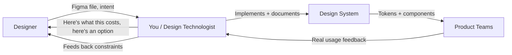

export const metadata = {
  title: "16. The Design Round: Interviewing With Designers & Design Technologists",
  description:
    "What a design-system round with designers and design technologists actually tests, how it differs from an EM/IC round, Figma vocabulary you need, and worked example answers.",
};

# 16. The Design Round: Interviewing With Designers & Design Technologists

## Quick Glance

- **Confirmed format for this kind of round:** a round-table conversation with designers, taking turns asking questions — not a live coding or design-review exercise. You'll also get time to ask them questions.
- Expect a mix of questions across three buckets: **UI/UX principles**, **design/dev collaboration**, and **systems thinking**. See the dedicated sections below for each.
- The goal from their side is simple: are you comfortable talking about design, and will you be pleasant and effective to work with. It's a fit/communication check, not a test with a pass/fail rubric on a specific answer.
- The panel is designers (possibly including a **Design Technologist** — a hybrid design/code role, see Definition below).
- The #1 thing they're listening for: do you talk about **tradeoffs and reasons**, or do you just say "yes" or "no" to what design asks for?
- Never say a design is "impossible." Say what it costs and offer an alternative that keeps the design's intent.
- Bring one real story of disagreeing with a designer and how it ended well. Structure it: situation → what you pushed back on → why → what you proposed instead → outcome.
- Know these Figma words cold: **variant**, **auto-layout**, **component / instance**, **Figma Variables**. You don't need to be a Figma expert — you need to not freeze when they come up.
- Brush up on core UI/UX vocabulary (visual hierarchy, affordance, feedback, consistency) — see the "UI/UX principles" section below. They may ask you to define or apply these directly.
- Bring 2–3 good questions to ask them (see the end of this chapter) — this round is also you evaluating them.
- Cross-reference: this chapter builds on [Chapter 12: Collaboration with Designers](/chapters/collaboration-with-designers) and [Chapter 3: Component Architecture](/chapters/component-architecture) — skim those too if you have time.

## Definition

A **design round** (sometimes called a "cross-functional round" or "design partnership round") is an interview where the people judging you are not other engineers — they're **designers** or **Design Technologists**. They're checking one thing above all else: can they hand you a half-finished idea and trust you to turn it into something good, without either blindly doing whatever they sketched or bulldozing it with "that's not how React works"?

A **Design Technologist** is a real, specific job title, not a fuzzy buzzword. It's a hybrid role — part designer, part front-end engineer — that owns the bridge between a Figma file and working code. Atlassian describes theirs as people who "turn creativity into code": they prototype ideas too rough for a full engineering ticket, keep the design system's code and its Figma library in sync, and speak both languages fluently enough to catch problems before they become bugs or design debt.

## Problem Statement

Here's the failure mode this round exists to catch: a candidate who is a strong engineer, aces the coding round, and then turns out to be miserable to work with on a design system team — because a design system engineer's real job is 40% code and 60% negotiation, translation, and judgment calls about "close enough."

Two specific failure patterns show up a lot:

1. **The order-taker.** Given a Figma file, they build exactly what's drawn, pixel for pixel — including the parts that don't work on a small screen, don't have a keyboard-accessible focus state, or quietly break for RTL languages. They never say anything. The design ships broken and everyone finds out in QA or, worse, in production.
2. **The wall.** Given a design that's genuinely hard to build, they say "that's not possible" or quietly reduce scope without telling anyone, and the designer finds out when they see the shipped result and it doesn't match what they asked for.

Both are trust-destroying. A design round exists to find people who do neither — people who can say "here's what that costs, here's what I'd suggest instead, does that still solve your problem?" and mean it.

<Callout type="info" title="The one-line version">
  If an interviewer asks why this round exists, the answer is: because "can code" and "can build the right thing with design" are different skills, and only one of them shows up in a coding test.
</Callout>

## Why Does This Exist?

Three concrete reasons companies add this round for design-system roles specifically (not for a typical product-feature engineering role):

**A design system is a shared product between two disciplines.** Unlike a feature team, where engineering mostly executes a spec, a design system team co-creates the spec. The component's visual design and its code API get designed together, iteratively. If you can't collaborate in that loop, you slow down every designer who depends on the system — not just yourself.

**Bad collaboration is expensive and hard to see coming.** A design system component gets used hundreds or thousands of times. A wrong assumption baked in during a rushed handoff — no dark mode plan, no way to make the button smaller, hard-coded English-only text — doesn't show up as a bug report next week. It shows up eight months later as a painful, breaking migration. Companies would rather catch "will this person make that mistake" in an interview than in production.

**Design Technologists specifically need to be evaluated by designers.** If a Design Technologist's real day job includes pairing with designers on prototypes and keeping Figma and code in sync, an engineering-only panel literally cannot tell whether you're good at that job. They have to be in the room.

## Historical Context

Understanding where this round came from helps you understand what it's testing.

**Before design systems were common (pre-2015ish):** designers threw a static mockup over the wall, engineers built it, and "handoff" meant a Photoshop file with layers. There was no shared vocabulary and not much collaboration to evaluate — the round didn't exist because the job didn't require it.

**As design systems matured (2016–2020):** companies like Shopify, Atlassian, and Airbnb built dedicated design system teams. Tools like Sketch and then Figma introduced reusable components on the design side, which meant design and code both had a concept of "component" for the first time — and the two needed to match. This is roughly when the **Design Technologist** title starts appearing as a distinct job, not just "a front-end engineer who's good with designers."

**Today (2021–now):** Figma Variables (2023) let a token change flow from the design file into code-shaped data automatically. That closed the loop even tighter — design and code tokens can now literally be the same source of truth (see [Chapter 2: Design Tokens](/chapters/design-tokens) and [Chapter 12](/chapters/collaboration-with-designers)). Interviewing for this tighter, more technical collaboration is exactly why the modern design round exists: it's checking for a skill that didn't used to be necessary.

## How It Works Internally

What does a Design Technologist actually do, day to day? Knowing this tells you what the interviewers value, because they're often picturing you doing this job:

- **Prototyping ideas that are too rough for a ticket.** A designer has a half-formed idea for a new interaction. Instead of a static mockup, the Design Technologist builds a quick, real, clickable prototype in code — because some ideas (animation timing, drag behavior, how a component feels at the edges) can't be judged from a static image.
- **Keeping the design system's code and its Figma library in sync.** When a token or component changes in code, the Figma file needs to match, and vice versa — otherwise designers start designing with a component that no longer looks like what ships.
- **Being the translator in both directions.** Explaining to a designer why a request is expensive (not just "hard," but *why*: "that needs a whole new focus-management pattern"), and explaining to engineers why a design detail matters (not just "the designer wants it," but *why*: "without that spacing, the row height breaks our data-density guarantee for the table product").
- **Championing adoption.** Helping other product teams actually use the system correctly instead of copy-pasting and diverging from it.

<Callout type="tip" title="Why this matters for you">
  If you don't have a Design Technologist background, that's fine — most candidates for this round don't. But if you can describe your past work using this same shape (prototyped something rough, kept two sources of truth in sync, translated a technical constraint into a design-friendly explanation), you'll sound like you already know the job.
</Callout>

### UI/UX principles worth having sharp

This is one of the three named topic buckets, so expect a direct question like "what makes a good user interface?" or "how do you think about visual hierarchy?" You don't need a design degree — you need to be able to name and explain these in plain words, with an example:

- **Visual hierarchy.** The eye should land on the most important thing first. Size, weight, color, and spacing are the tools — not just color alone. Example: a primary button is bigger/bolder/higher-contrast than a secondary one so users don't have to read to know which action matters more.
- **Consistency.** The same action should look and behave the same way everywhere. This is *why design systems exist at all* — see [Chapter 1](/chapters/what-is-a-design-system). If you only remember one principle to tie back to your engineering background, make it this one.
- **Feedback.** The interface should always tell the user what just happened — a click, a save, an error. A button with no loading state leaves the user wondering if their click even registered, and they click again, and now you have a double-submit bug that started as a UX gap.
- **Affordance.** Something that looks clickable should be clickable, and vice versa. A button that looks like plain text, or plain text styled like a button, both break this — and it's a very common real bug, not just a design nitpick.
- **Progressive disclosure.** Don't show everything at once — reveal complexity as the user needs it (advanced settings behind a toggle, not all on the main screen). This is a direct design/engineering shared concern: it affects component API design too (optional props for advanced cases, sensible defaults for the common case).
- **Error prevention over error messages.** A well-designed form prevents a mistake (disabling a submit button until required fields are filled) rather than just showing a red message after the fact. Good engineers build this in by default, not just when asked.
- **Accessibility as a UX principle, not just a compliance checkbox.** Contrast, focus order, and screen-reader labels aren't "extra" — they're the same principles above (feedback, affordance) applied to users who can't see or use a mouse. Tying accessibility back to these principles, instead of treating it as a separate checklist, is a strong senior signal — see [Chapter 5](/chapters/accessibility).

<Callout type="tip" title="If they ask 'what's the difference between UI and UX?'">
  Short, confident answer: **UX is whether the thing works for the user — UI is what it looks like while doing it.** A screen can have beautiful UI and still have bad UX (three extra clicks to do something simple). Give one real example from your own work if you can.
</Callout>

### What "systems thinking" means here

This is the second named bucket, and it's really asking: **do you think about the ripple effect of a single decision, not just the decision itself?** A feature engineer can reasonably ask "does this solve the ticket in front of me?" A design-system engineer has to also ask "what does this do to every other screen that already uses this component, and every screen that will in the future?"

Concretely, systems thinking shows up as:

- **Reuse over one-offs.** Before building something new, asking "does this already exist, or is this a variant of something that does?" — and if it really is new, asking whether it should become part of the system rather than living in one feature.
- **Consequences beyond the current screen.** A spacing change requested for one page might look fine there and break density in a data-heavy page elsewhere. A systems thinker checks both, not just the one in front of them.
- **Designing for the next five use cases, not just this one** — without over-building for cases that may never come. This is a real balance, not "always build it generic": see [Chapter 3](/chapters/component-architecture) on API design and [Chapter 11](/chapters/governance) on when a change is worth making system-wide versus a local exception.
- **Naming and structure as a system-level concern.** A component or token named for its current use ("SidebarButton") instead of its actual role ("SecondaryButton") quietly breaks the system the first time someone reuses it somewhere the old name doesn't make sense.

## Architecture

Here's the collaboration loop this round is checking that you can operate inside — and where things typically break down if you can't:

Every arrow in that diagram is a place a bad collaborator goes silent — builds without pushing back, ships without documenting, ignores feedback from product teams. Every arrow is also a place an interviewer can ask "tell me about a time this happened to you," so it's worth having a real story for at least two or three of these arrows.

## Real-World Example

Atlassian's own description of the Design Technologist role is worth reading before this interview, because it's a real company defining exactly the role you may be evaluated by or against. Their framing: Design Technologists exist because "the space between design and engineering" was where good ideas were dying — either too vague for engineering to estimate, or already locked into a rigid spec before anyone tested whether the interaction actually felt good. Their Design Technologists sit inside design critiques *and* engineering planning, and their output is as often a working prototype as it is a Jira ticket.

That's the bar: not "I can code what design gives me," but "I can be in the room early enough to shape what design gives me."

## Implementation Example

Since this round is about live conversation, not code, here's what a strong answer sounds like when they run the classic exercise: **"Here's a rough design [a screenshot, a Figma link, or a verbal description]. Walk me through how you'd build it."**

Narrate in this order — out loud, even before they ask:

1. **Restate the intent, not just the pixels.** *"So the goal here is a filterable list where the user can multi-select — the exact chip styling is secondary to that working well."* This shows you're reading intent, not just copying a picture.
2. **Sketch the component API first.** *"I'd want the list to be a controlled component — `value`, `onChange`, `options` — so the parent owns selection state, because different pages will want different default behavior."* (See [Chapter 3](/chapters/component-architecture) for the controlled-vs-uncontrolled tradeoff.)
3. **Name the states before you name the styling.** *"Before I touch CSS, I want to know: what does this look like empty, with 1 result, with 200 results, and while loading? Those probably weren't all in the Figma file, and that's normal — I'd flag it, not guess."*
4. **Say the accessibility plan, unprompted.** *"This needs arrow-key navigation between chips and a way to remove one with the keyboard, not just a mouse click on a tiny X."*
5. **Only now talk about visuals/tokens.** *"For spacing and color I'd pull from our existing token set rather than eyeballing the mockup — if a value doesn't match a token, that's usually a sign either the design needs adjusting or we're missing a token, and I'd ask which before hardcoding a one-off value."*

That order — intent, API, states, accessibility, then visuals — is the actual signal they're listening for. Most weaker candidates start at step 5.

## Advantages

Why companies find this round worth the extra scheduling cost (getting a designer's calendar time is expensive):

- It catches the order-taker/wall failure modes described above, which a pure coding round cannot catch at all.
- It's a two-way preview: the designer also gets to decide if they want to work with you, which improves retention if you're hired.
- It surfaces communication style under real conditions (ambiguous ask, mild disagreement) instead of a hypothetical behavioral question.

## Disadvantages

Be aware of these, because they explain why an answer can go well and still feel unfair:

- It's more subjective than a coding test — "good collaborator energy" is a real bias risk, and confident talkers can score better than careful ones even when the careful one would do better work.
- A single rough interaction (nerves, a designer having an off day) carries more weight than it should, because there's usually only one such round in the whole loop.
- Candidates from engineering-only backgrounds are sometimes unfairly read as "less collaborative" just because they're less fluent in design vocabulary, not because they'd actually be worse partners.

Knowing these biases exist doesn't fix them, but it does tell you to over-communicate — narrate your reasoning more than feels natural, because the interviewer is explicitly listening for it.

## Alternatives

Different companies run this round very differently. Knowing the shape in advance helps you prepare the right thing:

| Format | What it looks like | What it's really testing | How to prepare |
| --- | --- | --- | --- |
| Round-table conversation | Designers take turns asking questions across UI/UX, collaboration, and systems-thinking topics; no exercise, no whiteboard | Are you comfortable talking about design and easy to work with — a fit/communication check, not a graded test | Prepare talking points per topic bucket (this chapter), not a rehearsed script — it should feel like a real conversation |
| Portfolio / past-work walkthrough | You present 1–2 past projects, they ask questions | Can you honestly explain decisions and tradeoffs, not just show a pretty result | Pick a project with a real disagreement or constraint in the story, not just a shiny outcome |
| Live "build this" exercise | Given a rough design, you narrate (and sometimes sketch code for) an implementation | Do you think in API/states/a11y before visuals; how you handle ambiguity live | Practice the 5-step narration order from the Implementation Example above |
| Scenario / behavioral questions | "Tell me about a time you disagreed with a designer" | Whether you can push back productively, not just agreeably or combatively | Prepare 2–3 STAR stories in advance (see Interview Questions below) |
| Pair-design session | You and a designer sketch a component together in real time | Real-time collaboration style, not a rehearsed answer | Ask clarifying questions early and often; think out loud constantly |
| Async take-home + review | You build something from a brief, then discuss it live | Depth of thinking when you had time to reflect, then how you defend it | Document your reasoning in the README/PR description, not just the code |

Companies almost always tell you the format if you ask — and it's worth asking the recruiter beforehand: *"Can you tell me the format of the design round?"* If they describe a round-table conversation across topics like UI/UX principles, collaboration, and systems thinking, that's the first row above: relax, prepare talking points rather than a script, and treat it like a genuine conversation, not a test with one right answer.

## Tradeoffs

The core tradeoff inside every answer you give in this round is **speed vs. thoroughness**. A live panel has maybe 5–8 minutes per question. Say too little and you look shallow; ramble and you look unable to prioritize — which is itself the same skill this round tests (can you tell a designer the important 80% quickly instead of every detail).

The fix: lead with your conclusion, then back it up if they want more. *"I'd push back on the fixed pixel width — here's why — and here's what I'd propose instead."* Not: a long story that arrives at the conclusion at the end. Senior candidates front-load the answer; junior candidates build up to it.

## Performance Considerations

"Performance" here means your performance under time pressure, not the code's:

- **Keep answers under 90 seconds** for scenario questions unless they ask a follow-up. If you're still talking after that, you're probably in the weeds.
- **Use their vocabulary back at them.** If they say "variant," don't say "version." If they say "handoff," don't say "the ticket." Small, but it signals fluency fast.
- **Don't perform certainty you don't have.** If you don't know a specific Figma feature, "I haven't used Figma Variables directly but I understand the concept from [token pipelines / Style Dictionary] — is that the same idea here?" reads far better than guessing.

## Scalability Considerations

"Scalability" here means: does your answer hold up if they push further? Interviewers often ask a harder follow-up specifically to see if your first answer was memorized or actually reasoned through.

- If you propose an alternative to a design, be ready for "what if that alternative doesn't work for them either?" — have a second fallback, or be honest that you'd need to loop in more people.
- If you describe a past disagreement story, be ready for "what would you have done if they'd said no?" — this checks whether your story is really about you being right, or about you handling *not* getting your way.
- If you narrate a component build, be ready for "now this needs to support a totally different brand/theme" — this is really a [design tokens](/chapters/design-tokens) question in disguise.

## Common Mistakes

<Callout type="danger" title="Treating the designer like a client instead of a collaborator">
  Nodding along and saying "sure, I can build that" to everything reads as agreeable, not collaborative. It signals you'll build the wrong thing quietly rather than raise it early.
</Callout>

<Callout type="danger" title="Saying 'that's not possible' with no alternative">
  Almost nothing is truly impossible in front-end work — it has a cost. Naming the cost and offering an option is the senior move; a flat "no" is not.
</Callout>

<Callout type="danger" title="Name-dropping tools without explaining the problem they solve">
  Saying "we used Figma Variables" without being able to explain *what problem that solved* (keeping design and code tokens in sync) sounds like a buzzword, not experience. See [Chapter 12](/chapters/collaboration-with-designers) for the actual mechanism.
</Callout>

<Callout type="danger" title="Skipping accessibility until asked">
  If you only mention keyboard navigation or contrast because they specifically asked, that's a signal it's not actually part of how you build by default. Bring it up unprompted — see [Chapter 5](/chapters/accessibility).
</Callout>

## Best Practices

- Prepare 2–3 real stories in advance, each with a clear situation → pushback → reasoning → outcome shape. Don't improvise these live; you will ramble.
- Learn just enough Figma vocabulary to not freeze: **variant** (a predefined state/style of a component, like a code prop), **auto-layout** (Figma's version of flexbox — spacing and sizing that responds to content), **component/instance** (a master component and its copies, like a React component and its usages), **Figma Variables** (Figma's token system — light/dark, brand modes).
- Practice narrating a build out loud once before the interview, using the 5-step order from the Implementation Example. Out loud, not just in your head — it's a different skill.
- When you disagree with something in the interview itself, actually disagree (respectfully). Interviewers can tell when a candidate is being agreeable instead of honest, and it undermines the exact trust this round is trying to establish.
- Ask real questions back (see below) — treat it as a two-way evaluation, because it genuinely is one.

## Interview Questions

<InterviewQuestion q="What makes a good user interface, in your own words?">
  **What the interviewer is testing:** Whether you have real UI/UX vocabulary and instinct, not just engineering vocabulary — this is often the opening question in a round-table format.

  **Poor answer:** "Something that looks clean and modern."

  **Good answer:** Names 2–3 real principles — consistency, clear visual hierarchy, fast feedback on actions — with a one-line reason for each.

  **Excellent senior answer:** Same principles, but grounded in a real example from your own work ("we added a loading state to a button because users were double-clicking submit"), and explicitly connects it to why design systems exist — consistency at scale, not just a single screen looking nice.

  **Common mistakes:** Staying purely visual ("clean," "modern," "minimal") with no mention of how the interface behaves or how it helps the user actually accomplish something.
</InterviewQuestion>

<InterviewQuestion q="How do you think about accessibility — is it a design concern, an engineering concern, or both?">
  **What the interviewer is testing:** Whether you see accessibility as core UX (their world), not just a technical checklist bolted on afterward (a common engineer blind spot).

  **Poor answer:** "Engineering handles that — we add ARIA labels and make sure contrast passes."

  **Good answer:** Frames it as both: design decides the intent (contrast, focus order, clear affordances), engineering implements it correctly.

  **Excellent senior answer:** Explicitly ties accessibility back to core UX principles — feedback, affordance, clear hierarchy — as the same ideas applied to users with different needs, not a separate rulebook. Mentions catching accessibility issues early in design review is far cheaper than catching them after ship. See [Chapter 5](/chapters/accessibility).

  **Common mistakes:** Treating it as purely an engineering checklist question, which signals you see it as compliance rather than UX.
</InterviewQuestion>

<InterviewQuestion q="Walk me through how you'd turn this rough design into a component API.">
  **What the interviewer is testing:** Whether you think API-first (props, states) before visuals, and whether you surface missing information instead of guessing.

  **Poor answer:** Jumps straight into describing CSS/styling.

  **Good answer:** Proposes a prop shape, mentions a couple of states (loading/empty), asks one clarifying question.

  **Excellent senior answer:** Uses the intent → API → states → accessibility → visuals order; explicitly calls out what's missing from the design (e.g. no error state shown) instead of silently inventing one; ties the API decision to a real constraint ("controlled, because another page will need to pre-select a value").

  **Common mistakes:** Designing the visuals before the API; not asking any clarifying questions at all (reads as not engaged); asking so many questions you never actually answer.
</InterviewQuestion>

<InterviewQuestion q="How would you keep a component's Figma file and its code in sync as both evolve?">
  **What the interviewer is testing:** Whether you understand token/variable syncing as a real, ongoing process — not a one-time export.

  **Poor answer:** "I'd just ask the designer to update the Figma file when the code changes."

  **Good answer:** Describes a token pipeline (Figma Variables or design tokens feeding a build step like Style Dictionary) as the actual mechanism, not a manual process.

  **Excellent senior answer:** All of the above, plus: names the failure mode of manual syncing (drift, someone forgets, no one notices until a bug report), and describes a lightweight process check (a shared changelog, a Slack bot, a CI check) that catches drift automatically rather than relying on memory.

  **Common mistakes:** Treating this as a one-time export instead of an ongoing sync problem; not knowing what Figma Variables are at all (fine to admit, but pair it with the token-pipeline concept you do know).
</InterviewQuestion>

<InterviewQuestion q="A designer wants pixel-perfect spacing that doesn't match any of our tokens. What do you do?">
  **What the interviewer is testing:** Whether you can hold a system's integrity under social pressure, without being difficult about it.

  **Poor answer:** "I'd just hardcode the value they want."

  **Good answer:** Explains you'd flag the mismatch and ask whether it's a one-off exception or a sign the token scale is missing a value.

  **Excellent senior answer:** Frames it as information, not conflict: "This is either a new token we're missing, or a one-off that will make this component harder to theme later — which is it?" Then commits to whichever answer keeps the system coherent, and explains the tradeoff to the designer in terms they care about (consistency across their own future designs), not in engineering terms.

  **Common mistakes:** Framing it as "no" instead of a question; not considering that the token system might genuinely be missing something.
</InterviewQuestion>

<InterviewQuestion q="How do you make sure a component still works when the content is very different from the mockup — much longer text, a different language, no image?">
  **What the interviewer is testing:** Whether you design/build for real-world data, not just the example in the file.

  **Poor answer:** "I'd test it with the example data from the design."

  **Good answer:** Mentions testing with long text, empty states, and truncation/wrapping behavior.

  **Excellent senior answer:** All of the above, plus RTL languages and translated text length (German/Finnish text often runs 30-40% longer than English) as concrete, specific cases — and explains this is exactly the kind of gap a static Figma mockup can't show you, which is why it's the engineer's job to catch it, not design's.

  **Common mistakes:** Only thinking about English, left-to-right, short text — i.e., only the exact case shown in the mockup.
</InterviewQuestion>

<InterviewQuestion q="Tell me about a prototype or quick proof-of-concept you built to answer a design question that a static mockup couldn't answer.">
  **What the interviewer is testing:** Direct alignment with the Design Technologist function — using code as a design exploration tool, not just a production tool.

  **Poor answer:** Has no example, or describes only building final, polished features.

  **Good answer:** Describes a rough, throwaway prototype built to test one specific question (e.g. "does this drag interaction feel right").

  **Excellent senior answer:** Names the specific question the prototype answered that a static image couldn't (timing, feel, an edge case), how quickly they threw it together (speed matters more than polish here), and what changed in the final design because of what the prototype revealed.

  **Common mistakes:** Describing a fully-built feature instead of a quick exploratory prototype — misses the point of what's being asked.
</InterviewQuestion>

## Manager-Level Questions

<ManagerQuestion q="Tell me about a time you disagreed with a designer. What happened?">
  **What the interviewer is testing:** Whether you can disagree productively — not whether you were right.

  **Poor answer:** A story where the designer was simply wrong and you were simply right, with no nuance.

  **Good answer:** A real disagreement, explained calmly, with the designer's perspective represented fairly.

  **Excellent senior answer:** Uses a clear situation → what you pushed back on → *why*, with a concrete cost or constraint, not just an opinion → what you proposed instead → the actual outcome, including if it wasn't fully your way. Ends with what you'd do the same or differently next time — shows reflection, not just a win story.

  **Common mistakes:** Telling a story where you "win" outright with no compromise (reads as not actually collaborative); being unable to state the designer's reasoning fairly, which suggests you didn't really listen at the time.
</ManagerQuestion>

<ManagerQuestion q="How do you build trust with a design team when you're new and don't know their history or context yet?">
  **What the interviewer is testing:** Onboarding instinct and humility — whether you lead with questions or with opinions.

  **Poor answer:** "I'd just start suggesting improvements based on best practices."

  **Good answer:** Describes listening first, asking about past decisions before proposing changes.

  **Excellent senior answer:** Specifically calls out that a decision that looks wrong from the outside often has real history behind it (a past incident, a stakeholder constraint) — and describes asking "what led to this?" before "should we change this?" as the concrete first move, plus a small, low-risk way to demonstrate competence early (fixing a known small pain point) before proposing anything larger.

  **Common mistakes:** Coming across as arriving with a fixed opinion about how things should be done, before understanding why they're currently done differently.
</ManagerQuestion>

<ManagerQuestion q="A product team is under deadline pressure and wants to skip your design system's review process. How do you handle it?">
  **What the interviewer is testing:** Whether you can hold a standard under pressure without becoming an obstacle — the classic "governance vs. speed" tension from [Chapter 11](/chapters/governance).

  **Poor answer:** Either "I'd let it through, deadlines matter" or "I'd block it, process is process," with no middle ground.

  **Good answer:** Proposes a faster, lighter-weight review path for time-sensitive cases rather than a binary allow/block.

  **Excellent senior answer:** Distinguishes between what's actually risky to skip (accessibility, a breaking API change) versus what's safe to fast-track (a low-risk visual tweak), and proposes the tradeoff explicitly to the team rather than deciding unilaterally — treats it as a negotiation with named costs, the same pattern as the design-pushback question above.

  **Common mistakes:** Treating "process" as inherently good regardless of the actual risk being skipped; caving without naming what the shortcut actually costs.
</ManagerQuestion>

<ManagerQuestion q="How would you know if the design system was actually succeeding, beyond 'people are using it'?">
  **What the interviewer is testing:** Whether you think about design-system success the way a design partner does — quality and consistency, not just adoption numbers.

  **Poor answer:** "Adoption percentage" as the only answer.

  **Good answer:** Adds a second signal, like fewer design-vs-shipped mismatches, or fewer accessibility bugs.

  **Excellent senior answer:** Names multiple signals across both disciplines — adoption %, drift between Figma and shipped code, accessibility bug rate, time-to-ship for a new feature screen, and *designer satisfaction* specifically (a survey or informal check-in) — and explains that adoption alone can be misleading (people might be forced to use it while hating it, which erodes trust over time even as the number looks good).

  **Common mistakes:** Only citing engineering-side metrics (bundle size, test coverage) with nothing that reflects the design side's experience at all.
</ManagerQuestion>

## Summary

A design round with designers and Design Technologists is checking a different skill than a coding round: not "can you build it," but "can we hand you something unfinished and trust the result." The Design Technologist role — a real, named hybrid job most visibly documented at companies like Atlassian — is a useful mental model for what "good" looks like here, because it's literally the job of prototyping fast, keeping design and code in sync, and translating between the two disciplines honestly in both directions.

Prepare by having real stories ready (not improvised), learning a small amount of Figma vocabulary so you don't freeze, and practicing the intent → API → states → accessibility → visuals narration order for any live "build this" exercise. Above all, never say something is simply impossible, and never simply agree with everything — both read as untrustworthy in exactly the way this round is built to catch.

**Key takeaways**

- This round tests collaboration and judgment, not code — narrate your reasoning constantly.
- Know what a Design Technologist actually does: prototyping, Figma/code sync, two-way translation.
- Never say "impossible" — say the cost, then offer an alternative that keeps the design's intent.
- For any "build this" exercise: intent → API/props → states → accessibility → visuals, in that order.
- Bring 2–3 real disagreement stories with an honest outcome, not a clean "I was right" story.
- Ask them real questions back — this round evaluates them too.
