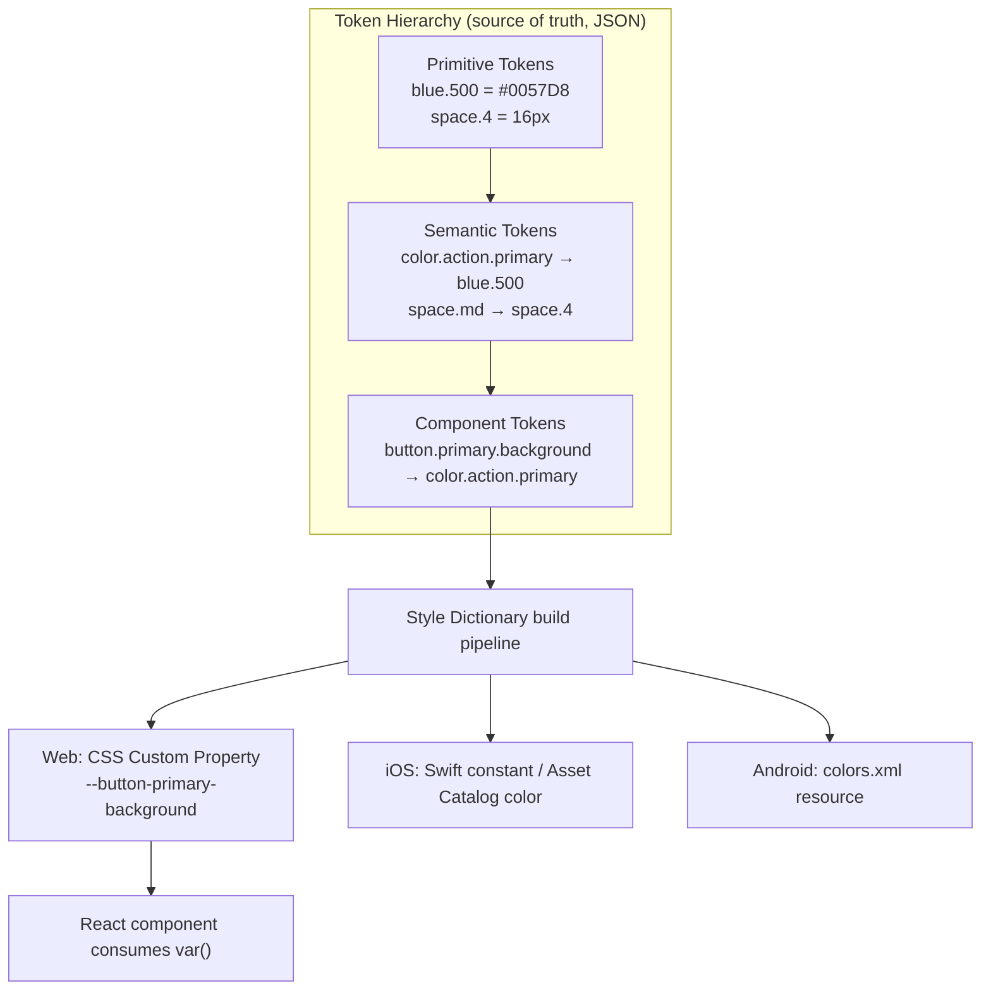

export const metadata = {
  title: "2. Design Tokens",
  description:
    "Primitive, semantic, component and alias tokens; token hierarchy; Style Dictionary; cross-platform generation for web, iOS and Android; dark mode and multi-brand theming.",
};

# 2. Design Tokens

## Definition

A **design token** is a named, platform-agnostic piece of design data —
a color, a spacing value, a font size, a border radius, a motion duration
— stored once as a single source of truth and compiled into whatever
format each consuming platform actually needs: a CSS custom property on
web, a `UIColor`/Swift constant on iOS, an XML color resource on Android.
Tokens replace hardcoded design values (`#0057D8`, `16px`) scattered
across component code with a semantic reference (`color.brand.primary`,
`space.md`) that can be redefined in one place and have that redefinition
propagate everywhere it's used, without touching a single component.

## Problem Statement

Imagine a design system with 400 components, and a hardcoded hex value
`#0057D8` (the brand blue) baked directly into the CSS or style objects of
120 of them. Two things eventually happen, and both are expensive.

First, **rebranding becomes a search-and-replace project across the
entire codebase** instead of a one-line change. When the brand team
updates the primary blue by a few percentage points of saturation — which
happens more often than engineers expect, for accessibility contrast
fixes alone — someone has to find every one of those 120 hardcoded
occurrences, verify each one is actually the brand color and not a
coincidentally similar value used for something else, and change it
without missing any. This is exactly the kind of task automation should
own, and hardcoded values make it impossible to automate safely.

Second, and this is the harder problem, **the same value has different
meanings in different places**, and a single hardcoded value can't
capture that. `#0057D8` might mean "primary brand color" in a logo
context, "primary action color" in a button, and "focus ring color" in a
form field — three different *semantic roles* that happen to share one
*value* today. If the design team later decides focus rings should be a
distinct, more accessible color from the primary action color, a system
built on raw hex values has no way to make that distinction — the two
usages are indistinguishable in the code. This is the actual problem
design tokens solve: they let you separate **what a value means** from
**what a value currently is**, and they let one raw value be reused for
many semantic purposes today while remaining independently
re-pointable in the future.

## Why Does This Exist?

Design tokens exist to solve three concrete engineering problems that
plain CSS constants or a JS config object don't solve well at scale:

**Theming and rebranding without touching component code.** If every
component references `color.background.brand` instead of `#0057D8`, a
full rebrand — or a second brand under the same company — is a matter of
providing a new token *value* set. No component is touched, no diff
review of component logic is required, and the risk of the rebrand
introducing a functional regression drops to near zero because the change
is data, not code.

**Dark mode as a value swap, not a duplicated implementation.** Without
tokens, dark mode is often implemented as parallel `.dark` CSS classes
sprinkled through component stylesheets, duplicating and drifting from
the light-mode styles over time. With semantic tokens, dark mode is a
second value table for the same semantic names — `color.background.
primary` still means the same thing in both themes, it just resolves to
a different primitive.

**Cross-platform consistency without cross-platform code sharing.** A
company like Adobe ships Spectrum-based products on web, Windows, macOS,
iOS, and Android — five platforms with five different native styling
mechanisms that share zero code. Tokens are the one artifact that *can*
be shared: the token JSON is platform-agnostic, and a build pipeline
(Style Dictionary, covered below) compiles it into whatever each platform
natively consumes. This is why tokens, not shared component code, are the
actual cross-platform consistency mechanism for most large multi-platform
design systems.

<Callout type="info" title="The interview framing to remember">
  If asked "why not just use CSS variables directly instead of a token
  system," the answer is: CSS variables *are* the web implementation
  mechanism for tokens (see below) — the token *system* is the
  platform-agnostic source of truth that generates CSS variables (and
  Swift, and XML) from one place. The question conflates the
  implementation with the system that produces it.
</Callout>

## Historical Context

Early component libraries (2014-era Bootstrap, early Material
implementations) used **Sass variables** as their theming mechanism —
`$brand-primary: #0057D8;` — which was a real improvement over hardcoded
hex values scattered through stylesheets, but had a hard limitation: Sass
variables are compiled away at build time. A consumer of a compiled
Bootstrap CSS file cannot change `$brand-primary` at runtime; they have
to recompile the entire Sass source with a different variable value. This
made runtime theming (a user toggling dark mode, a multi-tenant SaaS
product applying a customer's brand color) essentially impossible without
shipping multiple pre-compiled stylesheet bundles.

The arrival of native **CSS Custom Properties** (CSS variables) around
2017 changed this fundamentally: `--color-brand-primary: #0057D8;` is a
real runtime value, resolvable and overridable in the browser without a
rebuild, inheritable through the cascade, and changeable via JavaScript
or a class toggle. This is the single biggest unlock that made scalable
dark mode and multi-brand theming *practical* on the web, and it's why
essentially every modern design system (Polaris, Carbon, Spectrum,
Material 3) is built on CSS custom properties as its runtime layer today.

In parallel, as design systems went multi-platform, the design-token
*concept* was formalized independently of any one implementation.
Salesforce's Theo (one of the earliest dedicated token-transformation
tools) and later, more prominently, **Amazon's Style Dictionary**
(open-sourced ~2018) established the pattern of "one JSON source of
truth, N platform-specific build outputs" as the standard architecture.
More recently, the **W3C Design Tokens Community Group (DTCG)** has been
working to standardize the JSON *format* itself (a `$value`/`$type`
structure, covered below) specifically so that design tools (Figma
Variables) and code tooling (Style Dictionary and others) can
interoperate without every company inventing its own incompatible schema
— this standardization effort is still evolving but is increasingly the
format new systems target.

## How It Works Internally

The core mechanic that makes design tokens powerful rather than just "a
big list of named constants" is **the token hierarchy** — tokens
reference other tokens, and the reference chain, not the individual
token, is what carries meaning.

### Primitive tokens

Primitive tokens (sometimes called "global" or "reference" tokens) are
the raw palette — every color, spacing, and type value the design
language could possibly use, named descriptively by *what they are*, not
*what they mean*: `blue.500`, `space.4`, `gray.900`. A primitive token has
no opinion about where it's used. `blue.500` doesn't know it will become
the brand's primary button color — it's just a specific shade of blue in
a scale.

### Semantic tokens

Semantic tokens reference primitive tokens and add **meaning and
intent**: `color.action.primary` might point at `blue.500`.
This is the layer that makes theming and dark mode possible: the
semantic name `color.action.primary` stays constant across themes and
brands, while the primitive it points to changes. In dark mode,
`color.background.primary` might point to `gray.900` instead of the light
mode's `gray.50` — same semantic meaning ("the primary page background"),
different resolved value.

### Component tokens

Component tokens are the most specific layer — they belong to a single
component and typically reference semantic tokens: `button.primary.
background` might reference `color.action.primary`. This layer exists
because a single semantic token is sometimes too coarse: a design team
might want the ability to change a Button's background independently of
every other place `color.action.primary` is used, without that change
leaking elsewhere. Not every design system needs this third layer — small
systems often stop at semantic tokens — but any system with enough
components eventually needs the ability to override one component's
appearance without redefining a semantic meaning used in 50 other places.

### Alias tokens

"Alias token" is the general term for *any* token that references another
token rather than holding a raw value directly — semantic tokens are
aliases of primitives, and component tokens are aliases of semantics (or
sometimes directly of primitives, though that's usually discouraged
because it skips the meaningful layer). The alias mechanism is what makes
the entire hierarchy re-pointable: change what a primitive resolves to,
and every alias — semantic and component — updates automatically, without
anyone touching the aliases themselves.

<Callout type="warning" title="A common trap: skipping the semantic layer">
  Referencing primitive tokens directly from components
  (`background: var(--blue-500)`) instead of through a semantic layer
  (`background: var(--color-action-primary)`) defeats the entire purpose
  of tokens. It reintroduces the original problem — "why is this button
  blue-500, is that a coincidence or intentional?" — just with a token
  reference instead of a hex code. Components should almost never
  reference primitive tokens directly.
</Callout>

## Architecture

The hierarchy above, plus the build-time transformation into
platform-specific outputs, is the complete architecture of a token
system. It's worth diagramming both the reference chain and the
compilation fan-out together, since interview questions often probe both
halves.



The important detail this diagram is meant to convey: **the build
pipeline sits between the hierarchy and every platform** — none of the
platform-specific formats are hand-maintained. Web, iOS, and Android
outputs are all *generated artifacts* from the same JSON source, which is
the entire point — a rebrand or dark-mode value change happens once, at
the top of this diagram, and flows to all three outputs on the next
build.

## Real-World Example

**Salesforce Lightning Design System** and **IBM Carbon** are two of the
clearest public examples of the token hierarchy in production. Carbon's
token set, for instance, defines primitives like a full gray and blue
scale (`gray-10` through `gray-100`, `blue-10` through `blue-100`), then
layers semantic tokens on top (`background`, `layer-01`, `text-primary`,
`link-primary`) that reference specific steps of those scales, and Carbon
explicitly documents that component code and product teams should
*only* ever consume the semantic layer, never the primitive scale
directly — exactly the discipline this chapter's "common trap" callout
warns about. When Carbon shipped its dark theme (`g100`), it was
implemented as an entirely new semantic-token value table pointing at
different primitive steps — no component code changed.

**Salesforce's multi-brand challenge** is the other canonical example:
Salesforce ships the same underlying product (and largely the same
component code) under different brand skins for different clouds/
products. This is only tractable because the token layer, not the
component layer, carries the brand-specific values — swapping a brand is
a token-value-table swap, not a fork of the component library.

## Implementation Example

Below is a realistic token source file in the W3C Design Tokens Community
Group format (`$value`/`$type`, token references via `{curly.dot.path}`
syntax), followed by a Style Dictionary config that transforms it into
Web CSS, iOS Swift, and Android XML outputs, followed by the resulting
React component consuming the CSS variables.

```json
// tokens/primitive.json
// Primitive tokens: the raw palette. Named by what they are, never by
// where they're used — this file should be almost never edited by
// product engineers; it's owned by the design-token maintainers.
{
  "blue": {
    "500": { "$type": "color", "$value": "#0057D8" },
    "600": { "$type": "color", "$value": "#0046AD" }
  },
  "gray": {
    "50": { "$type": "color", "$value": "#F7F8FA" },
    "900": { "$type": "color", "$value": "#12141A" }
  },
  "space": {
    "2": { "$type": "dimension", "$value": "8px" },
    "4": { "$type": "dimension", "$value": "16px" }
  }
}
```

```json
// tokens/semantic.light.json
// Semantic tokens (light theme): meaning, not raw value. Components
// should only ever reference this layer (or the component layer below
// it), never tokens/primitive.json directly.
{
  "color": {
    "action": {
      "primary": { "$type": "color", "$value": "{blue.500}" }
    },
    "background": {
      "primary": { "$type": "color", "$value": "{gray.50}" }
    },
    "text": {
      "primary": { "$type": "color", "$value": "{gray.900}" }
    }
  },
  "space": {
    "md": { "$type": "dimension", "$value": "{space.4}" }
  }
}
```

```json
// tokens/semantic.dark.json
// Semantic tokens (dark theme). Same semantic names as the light file —
// "color.background.primary" still means "the primary page background"
// — only the resolved primitive changes. This is the entire dark-mode
// implementation at the token layer; no component code differs.
{
  "color": {
    "action": {
      "primary": { "$type": "color", "$value": "{blue.500}" }
    },
    "background": {
      "primary": { "$type": "color", "$value": "{gray.900}" }
    },
    "text": {
      "primary": { "$type": "color", "$value": "{gray.50}" }
    }
  }
}
```

```json
// tokens/component.json
// Component tokens: the most specific layer, referencing semantics.
// This exists so "button primary background" can be repointed
// independently of every other use of color.action.primary, without
// redefining that semantic meaning globally.
{
  "button": {
    "primary": {
      "background": { "$type": "color", "$value": "{color.action.primary}" }
    }
  }
}
```

```js
// style-dictionary.config.js
// Style Dictionary reads the JSON layers above and fans them out into
// three platform-specific outputs from one source of truth. Web gets
// CSS custom properties (a runtime-swappable format, which is what
// makes theming possible without a rebuild); iOS and Android get
// build-time constants, since neither platform has a native runtime
// CSS-variable equivalent.
import StyleDictionary from "style-dictionary";

const sd = new StyleDictionary({
  source: ["tokens/primitive.json", "tokens/semantic.light.json", "tokens/component.json"],
  platforms: {
    web: {
      transformGroup: "css",
      buildPath: "build/web/",
      files: [{ destination: "tokens.css", format: "css/variables", options: { selector: ":root" } }],
    },
    webDark: {
      source: ["tokens/primitive.json", "tokens/semantic.dark.json", "tokens/component.json"],
      transformGroup: "css",
      buildPath: "build/web/",
      files: [{ destination: "tokens.dark.css", format: "css/variables", options: { selector: '[data-theme="dark"]' } }],
    },
    ios: {
      transformGroup: "ios-swift",
      buildPath: "build/ios/",
      files: [{ destination: "Tokens.swift", format: "ios-swift/class.swift", className: "DesignTokens" }],
    },
    android: {
      transformGroup: "android",
      buildPath: "build/android/",
      files: [{ destination: "colors.xml", format: "android/resources", resourceType: "color" }],
    },
  },
});

await sd.buildAllPlatforms();
```

```tsx
// packages/ui/src/components/button/button.tsx
// The React component references only the CSS variable — it has zero
// knowledge of the underlying hex value or which theme is active. Theme
// switching is entirely a `data-theme` attribute swap on a parent
// element; this component doesn't re-render or change logic at all.
import type { ButtonHTMLAttributes } from "react";
import styles from "./button.module.css";

interface ButtonProps extends ButtonHTMLAttributes<HTMLButtonElement> {
  variant?: "primary" | "secondary";
}

export function Button({ variant = "primary", className, ...props }: ButtonProps) {
  return <button className={`${styles.button} ${styles[variant]} ${className ?? ""}`} {...props} />;
}
```

```css
/* packages/ui/src/components/button/button.module.css */
.button.primary {
  background: var(--button-primary-background);
  color: var(--color-text-on-primary);
  padding: var(--space-md);
}
```

The resulting compiled outputs — this is the part interview questions on
cross-platform tokens are actually probing for, so it's worth seeing all
three side by side for the *same* semantic token:

```css
/* build/web/tokens.css — generated, do not hand-edit */
:root {
  --blue-500: #0057D8;
  --color-action-primary: var(--blue-500);
  --button-primary-background: var(--color-action-primary);
}
[data-theme="dark"] {
  --color-background-primary: #12141A;
}
```

```swift
// build/ios/Tokens.swift — generated, do not hand-edit
import UIKit

public class DesignTokens {
  public static let colorActionPrimary = UIColor(red: 0.0, green: 0.341, blue: 0.847, alpha: 1.0) // #0057D8
  public static let buttonPrimaryBackground = colorActionPrimary
}
```

```xml
<!-- build/android/colors.xml — generated, do not hand-edit -->
<?xml version="1.0" encoding="utf-8"?>
<resources>
  <color name="color_action_primary">#FF0057D8</color>
  <color name="button_primary_background">#FF0057D8</color>
</resources>
```

Notice the same semantic path (`color.action.primary`) produced a CSS
custom property with a variable reference chain on web, a static `UIColor`
constant on iOS, and a static XML color resource on Android — because
only CSS has a native runtime-variable primitive; iOS and Android
resolve token references at *build time* into flat values, which is why
theme switching on native platforms typically means loading a different
compiled asset/resource set (or, in SwiftUI/Jetpack Compose, using a
platform-native dynamic color/appearance API) rather than the CSS
approach of swapping a single runtime attribute.

## Advantages

- **Rebranding and theming become a data change, not a code change** —
  the single biggest practical win, and the reason multi-brand companies
  (Salesforce, Adobe) invest in tokens specifically.
- **Dark mode is a value-table swap**, not a parallel, drift-prone
  implementation maintained alongside the light-mode styles.
- **Cross-platform consistency without cross-platform code** — the token
  JSON is the one truly shared artifact between web, iOS, and Android
  implementations that otherwise share no code.
- **A single point of accessibility control.** Contrast fixes, for
  instance, can be validated and applied once at the semantic-token level
  and propagate to every component using that token, rather than
  requiring an audit of every hardcoded value in the codebase.
- **Design-tool and code stay synchronized** via Figma Variables mapped
  to the same token names (see below), closing the drift gap between what
  designers see and what ships.

## Disadvantages

- **Real upfront tooling investment.** Setting up a build pipeline
  (Style Dictionary or equivalent), CI integration, and a token-naming
  governance process is nontrivial work that has to be justified before
  a system has enough scale to need it.
- **Indirection cost for newcomers.** A new engineer tracing
  `button.primary.background` through `color.action.primary` through
  `blue.500` to find the actual hex value has to follow three hops
  instead of reading one line — this is a real, if usually worthwhile,
  cognitive cost.
- **Governance overhead on naming.** Poor naming decisions (see the
  naming-conventions section below) made early are expensive to unwind
  once hundreds of components depend on a token name.
- **Risk of over-engineering small systems.** A three-person team on a
  single-brand product with no dark-mode requirement may not need a
  three-tier token hierarchy at all — a flat set of CSS variables can be
  entirely sufficient, and building Style Dictionary infrastructure for
  it is premature.

## Alternatives

The practical question most teams actually face isn't "should we use
tokens" (yes, almost always, once past a certain scale) — it's **how**
to implement and transform them. Here's the comparison across the
realistic options.

| Dimension | Plain CSS Variables (hand-written) | Sass/Less Variables | Style Dictionary (JSON → multi-platform build) | Figma Variables only (no code pipeline) |
| --- | --- | --- | --- | --- |
| What problem it solves | Runtime-swappable values on web only | Compile-time constants, web only | Single JSON source of truth compiled to N platform-specific formats | Keeps design tool values synced to a name, but doesn't reach code automatically |
| Why it was created | Native browser primitive for theming (2017+) | Predates CSS variables; DRY styling before native support existed | Cross-platform design systems needed one source, many outputs (Amazon, ~2018) | Figma needed a first-class way to represent token-like values in the design tool itself |
| Performance | Native, zero build cost, runtime-resolved | Compiled away, zero runtime cost, but no runtime theming | Build-time only; runtime cost is whatever platform format it emits (CSS vars = native) | N/A — no code output on its own |
| Developer experience | Simple for small sets; unmanageable naming drift at scale by hand | Familiar to CSS-adjacent engineers; no cross-platform story | High — one JSON edit updates every platform on next build; steeper initial setup | Good for designers; leaves engineers to manually re-implement values in code |
| Learning curve | Very low | Low | Moderate (config, transforms, custom formats) | Low for designers, but requires a bridge (plugin/API) for engineering to consume |
| Community / ecosystem | Native web standard, universal support | Mature but declining as CSS vars cover most use cases | Strong — the de facto standard for multi-platform token pipelines; DTCG format alignment growing | Native to Figma; growing plugin ecosystem (Tokens Studio etc.) to bridge to code |
| Maintenance burden | Manual naming discipline required; no enforcement | Low, but no dark-mode/runtime theming without extra work | Low once configured — mostly config maintenance, not per-token effort | Requires a sync process (plugin, API script) to avoid drifting from code |
| Enterprise suitability | Fine for single-platform, single-brand products | Adequate for legacy or single-platform systems | High — this is what Carbon, Spectrum, and most enterprise systems actually run | Needs pairing with a code pipeline for enterprise use; not sufficient alone |
| When to choose it | Small, single-brand, web-only product | Legacy codebase already invested in Sass, no near-term multi-platform need | 2+ platforms, multi-brand, or dark mode plus a real component library to serve | Early-stage design exploration, or as the design-side half of a Figma-Variables-to-Style-Dictionary pipeline |
| When NOT to choose it | Multi-platform or multi-brand requirements | Any new project — CSS variables cover the runtime-theming case natively now | Tiny single-brand, single-platform projects — the setup cost isn't justified | As the sole token system of record — designers and engineers will drift without a code bridge |

Large companies overwhelmingly land on **Style Dictionary (or an
equivalent JSON-to-multi-platform pipeline)** once they have more than
one platform or more than one brand, because it's the only option in
this table that actually solves the cross-platform problem rather than
just the web-runtime-theming problem. Amazon built and open-sourced
Style Dictionary specifically because Amazon's own design systems needed
to output to native Android and iOS apps, not just web — plain CSS
variables and Sass can't reach those platforms at all. Companies that are
web-only and single-brand (a lot of early-stage startups) are entirely
rational to stay on hand-written CSS variables until a second platform or
a second brand actually materializes — building the Style Dictionary
pipeline before that point is exactly the "over-engineering small
systems" disadvantage above.

## Tradeoffs

The central tradeoff in token architecture is **hierarchy depth versus
indirection cost**. Two tiers (primitive → semantic) is usually the right
default: it captures the meaning-vs-value distinction that solves
theming and dark mode, without the extra hop of a component-token layer
that most teams don't need until they hit a real case where a single
component needs independent control over a value used elsewhere as a
semantic token. Adding the component-token layer preemptively, "because
Carbon has one," is a common mistake — it's justified once you have a
concrete conflict (Button needs a background independent of
`color.action.primary` used elsewhere), not before.

A second real tradeoff: **strict semantic-only consumption versus
pragmatic primitive access.** Disallowing any component from ever
touching a primitive token directly is the "correct" rule, but it can
create friction for genuinely one-off decorative uses (a marketing page
needs an exact brand gradient not represented in any semantic token).
Mature systems usually allow primitive access in an explicitly
"escape-hatch" documented path (e.g., a `tokens/primitives` import
that's discouraged and lint-flagged outside marketing/brand surfaces)
rather than either fully forbidding it or leaving it fully unrestricted.

## Performance Considerations

CSS custom properties have a real, measurable (if usually small)
performance cost: because they're resolved at paint time and inherited
through the cascade, deeply nested variable references or variables set
on high-frequency-changing elements can trigger more style recalculation
than a static value would. In practice, for a design token system where
values change rarely (theme toggle, not per-frame), this cost is
negligible — but it's worth knowing for the rare interview question about
CSS variables and animation performance: **animating a CSS custom
property itself** (rather than the property that consumes it) doesn't
benefit from the same compositor-thread optimizations as animating a
native property directly, so token-driven design systems generally
recommend against putting custom properties directly in the animated
property path of a performance-critical animation (see
[performance](/chapters/performance) for the full treatment).

Build-time performance also matters at scale: a token JSON source with
thousands of tokens and three platform outputs can make Style Dictionary
builds slow if not incrementalized properly; most large systems wire
token builds into the same incremental/cached build graph as the rest of
the monorepo (see [monorepo architecture](/chapters/monorepo-architecture))
rather than rebuilding the full token set on every change.

## Scalability Considerations

Token systems scale along two axes that map directly to two of this
chapter's required topics: **platforms** and **brands**. Adding a new
platform (say, a future watchOS surface) to a mature token pipeline is
ideally a matter of adding one new Style Dictionary platform config
block with the right transform group — zero changes to the token source
itself, because the source was already platform-agnostic by design.
Adding a new brand (a company acquisition folding a second product into
the same component library) is ideally a matter of adding one new
semantic-value table (mirroring the dark-theme pattern shown above) that
maps the same semantic names to a different primitive palette — again,
zero component code changes if the semantic layer was properly used
throughout.

The place token systems actually strain at scale is **naming governance
across many contributors**: with hundreds of tokens and many teams
proposing new ones, naming collisions and near-duplicate tokens
(`color.brand.primary` and `color.action.primary` accidentally
diverging when they should be the same reference) become a real
maintenance burden. This is why mature systems pair the technical
pipeline with an explicit review/RFC gate on new token proposals — see
[governance](/chapters/governance) — rather than allowing any team to
add tokens freely.

## Common Mistakes

<Callout type="danger" title="Referencing primitive tokens directly in component code">
  This defeats the entire purpose of the semantic layer and reintroduces
  the "is this blue intentional or coincidental" ambiguity tokens exist
  to eliminate. Lint for it: a design system should have an ESLint or
  stylelint rule that flags any component file importing from the
  primitive token namespace.
</Callout>

<Callout type="danger" title="Naming tokens by value instead of by role">
  A token named `blue500` used as a semantic action color is really just
  a renamed hex code — it tells you nothing about *why* it's used there,
  and it breaks the moment the design team wants the action color to be a
  different hue entirely (now the name is actively misleading).
</Callout>

<Callout type="danger" title="No single source of truth between Figma and code">
  When Figma variables and the Style Dictionary JSON are maintained
  independently by two different teams with no sync mechanism, they
  drift within a quarter — a hex value gets tweaked in one and not the
  other, and design QA starts catching "bugs" that are actually just
  stale tokens.
</Callout>

<Callout type="danger" title="Treating token versioning like an afterthought">
  Publishing a breaking token rename (`color.brand.primary` →
  `color.action.brand`) without a deprecation alias or codemod breaks
  every consumer simultaneously, at every layer that referenced the old
  name — this is a wider blast radius than a typical component API
  breaking change, because tokens are consumed so much more broadly.
</Callout>

## Best Practices

- Default to a two-tier hierarchy (primitive → semantic); add a
  component-token tier only when a concrete conflict justifies it.
- Enforce semantic-only consumption from component code via lint rules,
  not just documentation.
- Adopt the W3C DTCG `$value`/`$type` JSON format (or stay close to it)
  so Figma Variables, Style Dictionary, and any future tooling stay
  interoperable rather than requiring a bespoke adapter.
- Treat token naming as a governed, reviewed decision (see
  [governance](/chapters/governance)) — naming mistakes are expensive
  to unwind once hundreds of components depend on the name.
- Wire the token build into CI so a token change automatically produces
  updated web/iOS/Android artifacts and a visual diff for review, rather
  than relying on manual regeneration.
- Version tokens semantically and provide deprecation aliases for
  renamed/removed tokens, exactly as you would for a component API — see
  [component architecture](/chapters/component-architecture) for the
  parallel discipline at the component layer.

## Interview Questions

<InterviewQuestion q="What's the difference between a primitive token and a semantic token, and why does the distinction matter?">
  **What the interviewer is testing:** Whether you understand the
  meaning-vs-value separation that's the entire reason token hierarchies
  exist, not just that you can recite the two terms.

  **Poor answer:** "Primitive tokens are the small ones and semantic
  tokens are bigger ones."

  **Good answer:** Primitive tokens are raw values named by what they
  are (`blue.500`); semantic tokens reference primitives and are named by
  what they mean (`color.action.primary`), which is what makes theming
  and dark mode possible without touching component code.

  **Excellent senior answer:** Gives the concrete failure mode of
  skipping the semantic layer — components referencing primitives
  directly can't be re-themed, and there's no way to tell whether two
  components using the same primitive intend the same meaning or are
  coincidentally identical — and ties it to a real example (dark mode as
  a semantic value-table swap, zero primitive or component changes).

  **Common mistakes:** Describing the two tiers without explaining *why*
  the separation exists — the "so what" is the actual answer being
  tested.
</InterviewQuestion>

<InterviewQuestion q="Walk me through what happens, end to end, when a designer changes the brand primary color in Figma.">
  **What the interviewer is testing:** Whether you understand the full
  pipeline from design tool to shipped product across platforms, not just
  the code half of it.

  **Poor answer:** "The developer updates the CSS variable."

  **Good answer:** The Figma Variable updates, that change syncs (via
  plugin/API or manual export) into the token JSON source of truth, a
  Style Dictionary build runs and regenerates the CSS/Swift/XML outputs,
  and those get published as a new design system package version that
  consuming apps update to.

  **Excellent senior answer:** Adds the governance detail — a token value
  change of this magnitude (brand primary) typically goes through
  contrast/accessibility validation and a review gate before merging, and
  the version bump is treated as at least a minor (possibly major, if it
  changes visual expectations broadly) semantic version per the system's
  versioning policy, with the change communicated to consuming teams
  rather than silently auto-updating.

  **Common mistakes:** Skipping the design-tool-to-JSON sync step
  entirely, as if the token source of truth updates itself.
</InterviewQuestion>

<InterviewQuestion q="How would you implement dark mode in a token-based system, and why is that different from writing a `.dark` CSS class per component?">
  **What the interviewer is testing:** Understanding that dark mode is a
  *value* problem, not a *component logic* problem, when tokens are used
  correctly.

  **Poor answer:** "You'd add `prefers-color-scheme` media queries to
  each component's CSS."

  **Good answer:** Define a second semantic-token value table (dark
  theme) with the same semantic names pointing at different primitives,
  and switch between them via a `data-theme` attribute or class on a
  root element — no component code changes.

  **Excellent senior answer:** Explicitly contrasts this with the
  per-component `.dark` class approach: that approach duplicates styling
  logic in every component file, which drifts over time as components
  are added without their dark variant being written, whereas the
  token-value-table approach makes "does this component support dark
  mode" not even a question a component author has to think about, since
  it's inherited automatically from whatever semantic tokens it already
  references.

  **Common mistakes:** Describing a `prefers-color-scheme` media query as
  the *implementation* of dark mode, rather than as one possible trigger
  for the token-value swap.
</InterviewQuestion>

<InterviewQuestion q="Why would a company use Style Dictionary instead of just hand-writing CSS variables?">
  **What the interviewer is testing:** Whether you understand what
  problem Style Dictionary specifically solves (cross-platform, single
  source of truth, transform pipeline) versus when it's genuinely
  unnecessary overhead.

  **Poor answer:** "Style Dictionary is just the industry standard so you
  should always use it."

  **Good answer:** Style Dictionary is needed once you have more than one
  platform (web + iOS + Android) or need automated, validated transforms
  from one source — hand-written CSS variables can't reach native mobile
  platforms at all.

  **Excellent senior answer:** Adds the honest counterpoint: for a
  single-brand, web-only product, hand-written CSS variables are
  genuinely sufficient and Style Dictionary's config/build overhead isn't
  justified — the decision point is the moment a second platform or
  brand actually appears, not a default best practice applied
  everywhere regardless of scale.

  **Common mistakes:** Treating Style Dictionary as strictly superior in
  all cases rather than naming the specific problem (multi-platform
  output) it solves that CSS variables alone cannot.
</InterviewQuestion>

<InterviewQuestion q="Show how the same semantic color token would be represented on Web, iOS, and Android after a Style Dictionary build, and explain why the outputs look structurally different.">
  **What the interviewer is testing:** Concrete, hands-on familiarity
  with cross-platform token output — this is one of the most commonly
  asked design-token questions at the senior level, specifically because
  it's easy to fake generic knowledge of but hard to fake specifics.

  **Poor answer:** "It becomes a CSS variable, a Swift variable, and an
  XML variable."

  **Good answer:** Web gets a CSS custom property (runtime-resolvable);
  iOS gets a static Swift constant (e.g., inside a generated
  `DesignTokens` class); Android gets a `<color>` entry in a generated
  `colors.xml` resource file.

  **Excellent senior answer:** Explains *why* the shapes differ — only
  CSS has a native runtime custom-property primitive, so iOS and Android
  outputs are resolved to flat, static values at build time, meaning
  theme switching on native platforms requires either loading a
  differently-built resource set or using a platform-native dynamic
  color API (SwiftUI's `Color` with light/dark asset variants, Jetpack
  Compose's `MaterialTheme`), rather than the single-attribute-swap
  approach that works on web.

  **Common mistakes:** Describing only the web output and treating the
  question as if it were purely about CSS variables.
</InterviewQuestion>

<InterviewQuestion q="What naming convention would you choose for tokens, and what are the tradeoffs against the alternatives?">
  **What the interviewer is testing:** Whether you've thought concretely
  about naming schemes and their downstream costs, not just picked one
  by preference.

  **Poor answer:** "I'd just use whatever's easiest to type, like
  camelCase."

  **Good answer:** A dot-path hierarchical scheme (`color.action.
  primary`) mirrors the actual token hierarchy and reads unambiguously as
  category → role → variant; it maps cleanly to both JSON nesting and CSS
  custom property names (`--color-action-primary`) via a simple
  transform.

  **Excellent senior answer:** Compares concretely against
  `colorActionPrimary` (camelCase — fine for JS-only consumption but
  doesn't map cleanly to CSS custom property syntax without a
  transform, and doesn't visually communicate hierarchy depth as clearly)
  and a BEM-style scheme (`color--action--primary` — explicit but
  verbose, and BEM's original purpose was CSS selector specificity
  management, not token hierarchy, so it imports conventions that don't
  actually apply here) — and lands on dot-path-as-source-format with
  automatic per-platform casing transforms handled by the build pipeline
  as the practical answer, since the pipeline (not the human) should own
  reconciling naming conventions across platforms.

  **Common mistakes:** Treating naming convention as a pure style
  preference with no technical consequence, when it actually affects how
  cleanly names map across JSON, CSS, Swift, and XML.
</InterviewQuestion>

## Manager-Level Questions

<ManagerQuestion q="A rebrand initiative wants to change 40% of the brand palette across five product lines. How would you scope and de-risk that project?">
  **What the interviewer is testing:** Whether you can translate a
  design-driven initiative into a scoped engineering project with
  realistic risk management, using the token architecture as leverage
  rather than treating it as a from-scratch rewrite.

  **Poor answer:** "We'd go through the codebase and update every color
  reference."

  **Good answer:** Because the system is token-based, this is primarily a
  semantic-value-table change, not a component rewrite — scope the
  project around updating primitive/semantic token values, validating
  contrast ratios automatically, and running visual regression across
  all five product lines before publishing a new token package version.

  **Excellent senior answer:** Adds a staged rollout plan — ship the new
  token values behind a flag or a parallel theme first, dogfood
  internally, roll out product-line by product-line rather than a
  single atomic cutover across all five simultaneously — and names the
  actual risk being managed (a bad contrast ratio or broken visual
  hierarchy shipping simultaneously to every product line with no
  rollback path).

  **Common mistakes:** Underestimating the project because "it's just
  colors," missing that a rebrand of this scope still needs accessibility
  re-validation and staged rollout discipline.
</ManagerQuestion>

<ManagerQuestion q="Design and engineering disagree about who owns the token naming decisions. How would you resolve that ownership question?">
  **What the interviewer is testing:** Governance and cross-functional
  judgment specific to the design/engineering boundary that tokens sit
  directly on top of.

  **Poor answer:** "Engineering should own it since it's technically
  implemented in code."

  **Good answer:** Token naming is a shared decision — design owns the
  semantic meaning and hierarchy structure (what roles exist, what they
  should be called from a design-intent perspective), engineering owns
  the technical constraints (valid identifiers across CSS/Swift/Android,
  build pipeline compatibility) — so the right model is joint review, not
  单-owner control.

  **Excellent senior answer:** Proposes a concrete mechanism — a shared
  token-naming RFC template both disciplines sign off on before a new
  token ships, with a named DRI (design-system lead, not purely design or
  purely engineering) who breaks ties — and notes this mirrors the
  broader design-system governance model (see
  [governance](/chapters/governance) and
  [collaboration with designers](/chapters/collaboration-with-designers))
  rather than being a token-specific special case.

  **Common mistakes:** Resolving it by default to whichever discipline
  currently has more organizational power, rather than a repeatable,
  documented process.
</ManagerQuestion>

<ManagerQuestion q="How would you justify investing in a full Style Dictionary cross-platform pipeline to a leadership team that currently only ships a web product?">
  **What the interviewer is testing:** Business judgment about
  *when* to invest in infrastructure ahead of need versus reactively,
  and whether you'd overclaim the case for a web-only company.

  **Poor answer:** "It's best practice, every major design system uses
  it."

  **Good answer:** If there's no near-term native mobile or multi-brand
  roadmap, hand-written CSS variables are sufficient today, and the
  honest recommendation is to defer the Style Dictionary investment until
  a second platform or brand is actually planned, structuring the
  existing token JSON in a Style-Dictionary-compatible shape now so the
  migration is cheap later.

  **Excellent senior answer:** Adds the concrete trigger condition
  leadership should watch for (a confirmed native app on the roadmap, or
  an acquisition/second brand) and frames the recommendation as
  "low-cost insurance now (keep tokens in a portable JSON shape). Real
  investment (Style Dictionary pipeline, CI wiring) deferred until the
  trigger condition is real" — which is a materially more credible pitch
  to a cost-conscious leadership team than advocating for the full
  pipeline pre-emptively.

  **Common mistakes:** Advocating for the full multi-platform pipeline
  regardless of actual near-term platform plans, which reads as
  over-engineering to a leadership audience focused on near-term ROI.
</ManagerQuestion>

## Summary

Design tokens exist to separate *meaning* from *value* — the actual
problem being solved is that the same raw value (a hex code, a pixel
measurement) can carry different semantic roles across a UI, and a system
built on hardcoded values has no way to distinguish or independently
evolve those roles. The standard hierarchy — primitive tokens (raw
palette) referenced by semantic tokens (meaning and intent) optionally
referenced by component tokens (component-specific overrides) — is what
makes rebranding, dark mode, and multi-brand theming into data changes
instead of component rewrites. CSS Custom Properties are the mechanism
that made this practical on the web specifically because they're
runtime-resolvable, unlike compiled-away Sass variables; native platforms
lack that runtime primitive, so iOS and Android token outputs are
build-time-resolved constants instead. Style Dictionary (or an equivalent
JSON-to-multi-platform pipeline) is the tool of choice once a system
needs to output to more than one platform from one source of truth — it
is not a universal default, and small, single-brand, web-only systems are
rational to skip it in favor of hand-written CSS variables. The W3C
Design Tokens Community Group format is increasingly the interoperability
layer between design tooling (Figma Variables) and code tooling, closing
the drift gap between what designers author and what ships. Naming
conventions and versioning policy are not cosmetic details — they
determine how expensive a rename or a rebrand is years into a system's
life, which is why mature systems govern token naming with the same
rigor as a public component API.

**Key takeaways**

- Tokens separate meaning from value; the semantic layer, not the
  primitive layer, is what components should consume.
- Dark mode and multi-brand theming are semantic-value-table swaps in a
  properly layered token system — zero component code changes.
- CSS Custom Properties are the web *implementation* of tokens, not the
  token system itself; native platforms resolve tokens at build time
  into static constants instead.
- Style Dictionary is the standard multi-platform build pipeline, but
  it's justified by real multi-platform/multi-brand need, not adopted by
  default regardless of scale.
- Token naming should mirror the hierarchy (dot-path, category → role →
  variant) and be governed with the same rigor as a public API, since
  renames have a wide blast radius across every consuming layer.
- Figma Variables plus a code-side token pipeline is what keeps design
  tooling and shipped code from drifting apart over time.

Continue to [component architecture](/chapters/component-architecture)
to see how components consume this token layer, and to
[styling architecture](/chapters/styling-architecture) for the deeper
comparison of CSS-in-JS, zero-runtime CSS, and Tailwind approaches to
wiring tokens into actual component styles.
