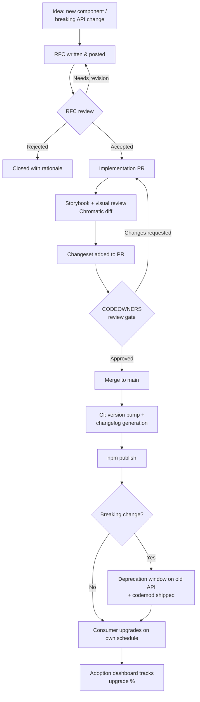

export const metadata = {
  title: "11. Governance",
  description:
    "Contribution models, the RFC process, semantic versioning, deprecation and migration strategy, breaking changes, ownership models and the release process.",
};

# 11. Governance

## Definition

**Governance**, in a design system context, is the set of processes that
decide who can change the system, how a change gets proposed and
reviewed before it ships, how consumers find out about it, and how
compatibility is protected across a version boundary. It is not
bureaucracy layered on top of engineering work — it is the mechanism that
lets a component API function as a genuine *public API*, used
concurrently by dozens or hundreds of consuming teams who did not
participate in the decision to change it, without every change becoming
a coordination crisis. A design system with excellent components and no
governance degrades into exactly the inconsistency it was built to
prevent, just one layer up the stack — instead of every product team
inventing its own button, every contributor to the design system invents
its own conventions for what's allowed to change and how.

## Problem Statement

A design system's component API is imported, directly or transitively,
by every team in the org building product UI. That's precisely what
makes it valuable — and precisely what makes changing it expensive in a
way that changing normal application code isn't. If an app team changes
an internal function's signature, they update every call site in their
own repo, run their own tests, and ship. If a design system team changes
`<Button>`'s prop signature, every one of those consuming repos —
repos the design system team doesn't own, can't see the diff for, and
often can't even fully enumerate — needs to update, in its own release
cycle, on its own timeline, possibly discovering the break only when
their own CI fails after an upgrade.

This asymmetry is the entire reason governance exists. Without a formal
process, a design system accrues one of two failure modes at scale.
Either it becomes *too permissive*: any contributor can merge any change,
so the component API drifts inconsistently, one PR at a time, until
nobody — including the DS team — can say with confidence what's stable
and what might change under them next release. Or it becomes *too
centralized and slow*: only a small core team can touch anything, every
product team's real, valid need for a new component or variant queues
behind that team's bandwidth, and product teams start building their own
one-off components outside the system just to ship on time — which is
the exact fragmentation the design system was supposed to prevent in the
first place. Governance is the discipline of finding, and continuously
re-tuning, the point between those two failure modes for your org's
specific size and risk tolerance.

## Why Does This Exist?

Design systems didn't always need formal governance, because early
component libraries were often small enough, and consumed by few enough
teams, that informal "ask in Slack" coordination worked fine. Governance
processes emerged specifically as design systems crossed a scale
threshold — dozens of consuming teams, hundreds of component usages
across the codebase, multiple contributors with legitimate but
conflicting opinions about API shape — at which point the cost of an
uncoordinated breaking change (multiplied across every consumer) started
to exceed the cost of a formal review step. This is the same underlying
economics that governs any widely-depended-upon public API: TC39's
stage process for JavaScript language changes, Kubernetes' KEP (Kubernetes
Enhancement Proposal) process, and React's own RFC process before major
API additions all exist for the identical reason — the audience for the
change is too large and too decoupled from the change's authors for
informal coordination to scale.

## Historical Context

Semantic Versioning itself (semver.org, formalized by Tom
Preston-Werner in 2010) predates most modern design system governance
practices and is the foundation everything else in this chapter builds
on — it gave the ecosystem a shared vocabulary (major.minor.patch) for
communicating compatibility, which RFC processes and deprecation
strategies both depend on to be meaningful.

The RFC-as-a-formal-process pattern was popularized by Rust (RFCs
starting 2014) and adopted widely by React (the `reactjs/rfcs` repo,
started 2017, used for Hooks, Concurrent Mode, and Server Components) —
both chosen specifically because they were languages/frameworks whose
API surface was consumed by enormous, decoupled audiences who couldn't
be coordinated through informal discussion alone. Design systems adopted
the same pattern once they hit comparable scale: Shopify's Polaris,
Atlassian's Design System, and IBM's Carbon all run public or
internal RFC processes today, and it's a directly borrowed pattern, not
an independently reinvented one.

Codemods as a migration tool trace to Facebook's internal tooling for
migrating enormous first-party React codebases — jscodeshift, the
still-dominant codemod toolkit, was built and open-sourced by Facebook
specifically because manually migrating tens of thousands of call sites
across their monorepo when a core API changed was not a task humans
could do reliably by hand. React itself has shipped official codemods
for major API transitions (the `react-codemod` repo covers things like
the `createClass`-to-ES6-class migration and legacy context API removal),
and design systems adopted the same practice once their own consumer
count made manual migration guides insufficient on their own.

Changesets, the tool most commonly used today to formalize the
version-bump-and-changelog step of a release (covered in depth in
[Chapter 9](/chapters/monorepo-architecture)), emerged from the broader
JS monorepo tooling wave of the late 2010s and is now close to a default
for open-source and internal design systems alike, because it ties
semver discipline directly into the PR review process rather than
leaving it to a release manager's memory.

## How It Works Internally

Mechanically, governance is a pipeline with explicit gates, not a single
decision point. A proposed change — a new component, a new variant, a
breaking API change — enters at the RFC stage, is reviewed and either
accepted, rejected, or sent back for revision, then implemented, then
passes through visual and API review (Storybook/Chromatic, covered in
[Chapter 7](/chapters/storybook)), then is versioned and released
through an automated pipeline, and only then reaches consumers, who
upgrade on their own schedule and may need a migration codemod to do so
safely. Each gate exists to catch a specific class of problem before it
reaches the next, more expensive stage — an API design flaw caught at
RFC stage costs a conversation; the same flaw caught after a major
version ships to 40 consuming teams costs a second breaking release.

The semver mechanics that make consumers trust the process at all are
worth being precise about, because "is this a breaking change?" is
genuinely harder to answer for a UI component than for a typical
function signature, and getting it wrong (shipping a break as a minor)
is how consumer trust in the version number erodes. A component's public
API isn't just its TypeScript prop types — it's everything a reasonable
consumer could depend on: prop names and types, yes, but also default
values, the presence/absence of a class name a consumer might target,
the DOM structure a consumer might have written a CSS selector against
or a Playwright test against, and even certain visual behaviors if
they're documented as guaranteed (e.g. "this tooltip always renders in a
portal"). Design system teams that treat semver purely as "did a
TypeScript type change" under-count breaking changes and burn consumer
trust; teams that treat every visual pixel shift as breaking over-count
and can never ship a minor release, which pushes real improvements into
an ever-delayed major.

A workable rule set, used in some form by most mature design system
teams:

- **Removing or renaming a prop, changing a prop's type in a
  non-widening way, or changing a prop's default value** — major.
  Defaults especially are easy to miss: changing `<Button size="md">`'s
  default from `md` to `lg` changes every consumer who never explicitly
  set `size`, silently, with no type error to catch it.
- **Adding a new required prop** — major. Adding an *optional* prop with
  a sensible default is not breaking.
- **A visual redesign that changes size, spacing, or default color in a
  way not covered by a design token change consumers already opted into**
  — this is the genuinely contentious one. Most mature teams treat it as
  **minor at most**, gated by a rule: if the change is purely visual and
  does not change the API surface or documented behavior, it ships as a
  minor with prominent changelog and visual-diff documentation, *not* a
  major — because gating every visual refinement behind a major version
  would make continuous design improvement practically impossible at any
  reasonable velocity. The counter-case that does warrant a major: a
  redesign large enough to break a consumer's own custom overrides (e.g.
  they wrote CSS assuming a specific padding value that changed) —
  which is why the DOM-structure rule below matters more than the purely
  visual one.
- **A DOM structure change that alters what a consumer's own CSS selector
  or test targeting internal markup would match** — treated as major by
  most disciplined teams, *even though the public props API didn't
  change at all*, because the DOM output is itself part of the
  effectively-public contract the moment consumers can reach into it.
  The correct long-term fix, and the reason most modern design systems
  push consumers toward it, is to never let internal DOM structure be a
  supported extension point in the first place — force styling through
  documented `className`/`style` props or CSS custom properties (see
  [Chapter 6](/chapters/styling-architecture)) rather than letting
  "just add a CSS selector for `.my-button > span`" become a de facto
  contract nobody agreed to.
- **Accessibility fixes that change ARIA attributes, focus order, or
  keyboard behavior** — usually shipped as a patch or minor even when
  technically "behavior changed," because the old behavior was a bug,
  not a supported contract, and blocking accessibility fixes behind a
  major version actively harms the org's compliance posture. This is a
  deliberate, documented exception to "any observable behavior change is
  breaking," and it's worth being able to justify explicitly in an
  interview — treating an a11y bugfix as major just because "behavior
  changed" optimizes for the wrong thing.

<Callout type="warning" title="The hardest semver call: internal DOM structure">
  Whether a DOM-structure change is breaking is the single most
  interview-worthy semver nuance in this space, because the honest
  answer is "it depends on what you told consumers was supported" — and
  that's exactly why disciplined design systems draw a hard, explicit
  line in their documentation: only props, documented CSS custom
  properties, and documented data attributes are part of the contract.
  Internal markup is explicitly *not* covered by semver guarantees, and
  that has to be stated in the docs, not just assumed, or you'll still
  get bug reports treating an internal refactor as a broken promise.
</Callout>

## Architecture

The realistic end-to-end pipeline, from a team wanting a new component
or a breaking change, to that change safely reaching every consumer's
production app:



Every arrow that loops back (RFC revision, changes-requested) is a
deliberate, cheap-to-take exit ramp — the entire design of this pipeline
is to make disagreement expensive to *ignore* but cheap to *resolve*
early, because the alternative is disagreement surfacing after publish,
which is expensive for everyone.

## Real-World Example

Shopify's Polaris runs a public RFC process (documented in their
open-source repo) specifically because Polaris is consumed both
internally by Shopify's own admin surfaces and externally by third-party
app developers building for the Shopify App Store — two audiences with
very different upgrade cadences and very different tolerance for
breaking changes. A change that's trivial for Shopify's own internal
teams to absorb (they can coordinate an internal migration sprint) can
be a real burden for an independent third-party developer maintaining
one app on the side, which is exactly the kind of asymmetry an RFC
process with public comment surfaces before a change ships, not after.

React's own `reactjs/rfcs` process is worth studying even though React
isn't a "design system" in the product sense, because the scale problem
is structurally identical: an API change affecting millions of
downstream repos cannot be coordinated through direct communication, so
the RFC repo, with structured proposal/discussion/decision stages, is
the substitute for that communication. Concurrent Mode and Server
Components both went through multi-month RFC and experimental-release
periods specifically to surface consumer-side problems (library
compatibility, SSR edge cases) before the API was locked into a stable
release — the same "expensive to reverse, so front-load the disagreement"
logic that motivates a design system's RFC gate on component APIs.

## Implementation Example

An RFC template, adapted for a component-API-specific proposal (not
prose-only — teams should actually check this into `.github/RFC_TEMPLATE.md`
or equivalent and require it for any new component or breaking change):

```markdown
# RFC: <title>

**Status:** Draft | In Review | Accepted | Rejected | Superseded
**Author(s):**
**Created:**
**Target release:** (e.g. v5.0.0 — only if this is a breaking change)

## Problem

What consumer-facing problem does this solve? Cite at least one real
consuming team's actual need, not a hypothetical — an RFC motivated by
"this seems more consistent" without a named consumer pain point is a
strong signal the change isn't ready to propose yet.

## Proposed API

The exact prop signature / component API, as TypeScript, not prose:

\`\`\`tsx
interface ComboboxProps {
  value: string | string[];
  onValueChange: (value: string | string[]) => void;
  multiple?: boolean;
  // ...
}
\`\`\`

Include a realistic usage example, not just the type signature.

## Alternatives considered

At minimum two other API shapes considered and why they were rejected —
an RFC with only one option presented hasn't actually explored the
design space, and reviewers should push back on it.

## Is this a breaking change?

State explicitly, using the semver rules in
[Chapter 11](/chapters/governance): does this remove/rename a prop,
change a default, alter DOM structure a consumer might target, or is it
purely additive?

## Migration cost (if breaking)

- Estimated number of consuming call sites affected (grep the monorepo /
  known consumer repos where possible).
- Can this be codemodded automatically? If yes, link the codemod PR or
  describe its scope. If no, explain why (e.g. requires a human judgment
  call the codemod can't make, like choosing between two now-distinct
  variants).
- Proposed deprecation window length.

## Open questions

Anything genuinely unresolved — an RFC that claims to have no open
questions is usually under-scoped.
```

A `@deprecated` JSDoc annotation plus a runtime console warning — the two
mechanisms consumers actually see day to day, working together so both
IDE-time and runtime signals fire:

```tsx
// The JSDoc @deprecated tag surfaces as a strikethrough in every
// consumer's IDE autocomplete and a TS/ESLint warning at the call site —
// this is often the FIRST signal a consumer sees, well before they read
// a changelog.
interface ButtonProps {
  /**
   * @deprecated Use `variant="secondary"` instead. `outline` will be
   * removed in v6.0.0 (see RFC-042). Codemod available:
   * `npx @acme/ds-codemod v5-outline-to-secondary`.
   */
  outline?: boolean;
  variant?: "primary" | "secondary" | "tertiary";
}

export function Button({ outline, variant, ...props }: ButtonProps) {
  // The runtime warning catches consumers on plain JS, or anyone whose
  // editor doesn't surface JSDoc deprecation — and, critically, logs a
  // component name + stack-adjacent context so a consuming team can
  // actually find the call site the warning refers to, not just know
  // "something, somewhere" used the deprecated prop.
  if (process.env.NODE_ENV !== "production" && outline !== undefined) {
    console.warn(
      "[@acme/ds] Button: `outline` is deprecated and will be removed " +
        "in v6.0.0. Use `variant=\"secondary\"` instead. " +
        "See https://ds.acme.com/rfcs/042 for details.",
    );
  }

  const resolvedVariant = outline ? "secondary" : variant;
  return <button data-variant={resolvedVariant} {...props} />;
}
```

A minimal jscodeshift codemod for the same migration — the kind of tool
that turns a "manually update 340 call sites across 12 repos" migration
guide into a single command a consuming team runs against their own repo:

```ts
// codemods/v5-outline-to-secondary.ts
// Run with: jscodeshift -t this-file.ts --extensions=tsx,ts src/
import type { API, FileInfo, Options } from "jscodeshift";

export default function transform(
  file: FileInfo,
  api: API,
  _options: Options,
) {
  const j = api.jscodeshift;
  const root = j(file.source);

  // Find every <Button outline /> or <Button outline={true} /> JSX
  // element and rewrite it to variant="secondary" — this is the exact
  // shape of change a human doing find-and-replace across dozens of
  // repos gets wrong on edge cases (outline={someVar}, outline={false}),
  // which is precisely why an AST-based transform, not a regex, is
  // worth investing in for a migration this widely spread.
  root
    .find(j.JSXOpeningElement, { name: { name: "Button" } })
    .forEach((path) => {
      const attrs = path.node.attributes ?? [];
      const outlineAttrIndex = attrs.findIndex(
        (attr) =>
          attr.type === "JSXAttribute" && attr.name.name === "outline",
      );
      if (outlineAttrIndex === -1) return;

      const outlineAttr = attrs[outlineAttrIndex];
      const isStaticTrue =
        outlineAttr.type === "JSXAttribute" &&
        (outlineAttr.value === null ||
          (outlineAttr.value?.type === "JSXExpressionContainer" &&
            outlineAttr.value.expression.type === "BooleanLiteral" &&
            outlineAttr.value.expression.value === true));

      if (!isStaticTrue) {
        // Dynamic outline={someVariable} — can't safely auto-migrate,
        // flag it for manual review instead of silently guessing.
        console.warn(
          `Skipped dynamic \`outline\` prop in ${file.path} — needs manual migration.`,
        );
        return;
      }

      attrs.splice(
        outlineAttrIndex,
        1,
        j.jsxAttribute(j.jsxIdentifier("variant"), j.stringLiteral("secondary")),
      );
    });

  return root.toSource();
}
```

## Advantages

Formal governance turns "did this break me" from a question consumers
answer by upgrading and finding out, into a question they can answer
from the changelog before upgrading — that predictability is what lets
large orgs upgrade a widely-depended-upon dependency with confidence
instead of dread. An RFC process front-loads disagreement to the cheapest
possible point (a document, before code exists) rather than the most
expensive (a shipped breaking change discovered by 40 teams
simultaneously). Codemods convert what would be a multi-week,
error-prone, manually-tracked migration effort spread across every
consuming team into a single command each team runs on their own
schedule — this is a genuine order-of-magnitude difference in migration
cost at the scale of hundreds of call sites across dozens of repos.
Clear ownership (CODEOWNERS-style gates) means every change has an
accountable reviewer who understands the API's history, which catches
inconsistency a rotating or ownerless review process misses. And a
codified release process (RFC → Storybook review → Changesets →
automated changelog → publish) removes the release manager as a
single point of failure and a bottleneck — releases can happen whenever
a PR merges, not whenever one person has bandwidth to hand-assemble a
changelog.

## Disadvantages

Every gate in this pipeline is also friction, and it's real friction, not
imaginary: an RFC process that takes two weeks to get review comments
back is two weeks a product team is blocked on a component they need
this sprint, and if that happens often enough, teams start building
around the design system instead of through it — the exact failure mode
governance is supposed to prevent, caused by governance itself if it's
miscalibrated. A strict semver discipline that treats DOM structure
changes as major means genuinely small internal refactors get gated
behind a major-version release cadence, which can slow down legitimate
code health work. Codemods are themselves an engineering investment —
writing, testing, and maintaining a jscodeshift transform for a specific
migration is real work that has to be weighed against just writing a
good migration guide and letting consumers migrate manually, which is
sometimes genuinely cheaper for a migration affecting only a handful of
call sites. And ownership gates (a single team or small group required
to approve every change) can become the exact bottleneck a federated
contribution model was meant to avoid if that team's bandwidth doesn't
scale with the org's growth.

## Alternatives

The first governance decision a design system team makes is the
contribution model — who is allowed to propose and implement changes to
the system itself.

| Dimension | Centralized | Federated / Open-Contribution | Hybrid |
| --- | --- | --- | --- |
| What problem it solves | Guarantees a single, consistent quality bar and API design coherence | Scales component coverage beyond one team's bandwidth by letting product teams contribute directly | Balances coherence on core primitives with coverage on product-specific patterns |
| Why it was created | Small design systems teams protecting a young, still-forming API surface | Large orgs where the DS team's bandwidth became the org-wide bottleneck | Learned from both failure modes — pure centralized bottlenecks, pure federated fragments |
| Performance (org velocity) | Slower — every component change queues behind one team | Faster on raw throughput, but with quality variance | Fast for composite/product patterns, deliberate for primitives |
| Developer experience (for contributors) | Lower — product engineers can't self-serve a new component | Higher — product teams can build what they need without waiting | Mixed — depends whether your need is a primitive or a composite pattern |
| Learning curve (to contribute) | Low — few people need to learn the DS codebase deeply | Higher — many contributors need DS-specific conventions, a11y standards, token discipline | Moderate — RFC process gates the harder cases |
| Community / ecosystem support | Concentrated expertise, but a single point of failure if key people leave | Distributed expertise, more resilient to individual turnover | Distributed for composites, concentrated for primitives |
| Maintenance burden | Lower per-component (fewer authors, more consistent patterns) | Higher — inconsistent original authorship makes long-term maintenance harder | Moderate — primitives stay clean, composites need more review discipline |
| Enterprise suitability | High for small-to-mid orgs or early-stage systems | High for very large orgs (100+ product teams) needing coverage fast | High — the choice most large, mature orgs converge on |
| When to choose it | Small design systems team, early-stage API still finding its shape | Very large org, DS team bandwidth is the clear bottleneck, strong internal review culture | Org has both a stable primitive layer and constantly evolving product-specific needs |
| When NOT to choose it | Org has grown past what one team can review in reasonable time | API is still young/unstable — too many cooks before the shape is settled | Adds process overhead not worth it for a very small design system |

In practice, **hybrid** is where most large design system organizations
land once they scale past roughly a dozen consuming teams — this is the
model used, in some form, by Atlassian, Shopify, and most other
companies with public governance documentation: the core design system
team retains direct ownership of primitives (Button, Input, Dialog —
components where API consistency and accessibility correctness matter
most and where the cost of getting it wrong is highest, since every
composite pattern in the org will be built on top of them), while
product teams can propose composite patterns (a specific data-table
configuration, a checkout-flow stepper) through an RFC that a smaller
number of DS reviewers approve rather than fully re-implement themselves.
Pure centralized models are common at earlier stages, when the API
surface is genuinely still being discovered and having many
simultaneous contributors would fragment a design language that hasn't
converged yet — but they don't scale past the point where the DS team's
bandwidth becomes the org's bottleneck, which shows up concretely as
product teams routing around the design system with their own one-off
components, exactly the fragmentation the system exists to prevent. Pure
federated/open-contribution models work at companies with an unusually
strong internal engineering review culture and lower tolerance for
process (some open-source-native companies run something close to this),
but without a strong review gate they tend to accumulate exactly the
inconsistency — five slightly different button implementations, none of
them quite matching the others' edge-case handling — that the design
system was funded to eliminate in the first place.

## Tradeoffs

Every governance decision trades velocity against coherence, and the
right point on that tradeoff genuinely shifts with org size — a rule set
copied wholesale from a 500-engineer org onto a 20-engineer one will feel
like bureaucratic overkill, and the reverse will feel like chaos. An RFC
process for *every* change, including trivial ones, wastes reviewer time
on genuinely low-risk changes — most mature governance processes scope
the RFC requirement to new components and breaking/API changes
specifically, with a lighter-weight fast-track (a single reviewer
approval) for bugfixes, additive optional props, and purely visual
non-breaking tweaks. Treating semver strictly (DOM structure changes are
major) protects consumers who've built brittle CSS-selector-based
overrides at the cost of blocking healthy internal refactors — the
better long-term fix is documentation and lint rules that discourage
consumers from relying on internal DOM in the first place, so the strict
semver rule becomes progressively less necessary to invoke. Codemods
cost real engineering time to write and test, which only pays off past a
certain number of affected call sites — a rough rule of thumb some teams
use is that a migration affecting fewer than roughly 20-30 call sites
across the org is often cheaper to document as a manual migration guide
than to automate, while anything larger clearly justifies the codemod
investment.

## Performance Considerations

Governance overhead is measurable in the same way engineering
performance is: time-to-merge for a proposed change, time-to-adoption
after a release, and the ratio of "changes shipped" to "changes
proposed but abandoned due to process friction." A design system team
should track RFC cycle time as a first-class metric the same way they'd
track build time — an RFC that regularly takes a month to get initial
review feedback is a leading indicator that the process itself is the
bottleneck, not the changes being proposed. Release cadence matters too:
teams running Changesets-driven automated releases (see
[Chapter 9](/chapters/monorepo-architecture)) typically ship far more
frequently — sometimes daily for patch/minor — than teams doing manual,
human-coordinated releases, because the release step itself stops being
the rate limiter.

## Scalability Considerations

The contribution and ownership model that worked at 5 consuming teams
does not survive unchanged at 50. The concrete signal it's time to move
from centralized to hybrid is a growing backlog of legitimate composite-
component requests the DS team can't get to — measure it directly rather
than waiting for it to become an obvious crisis. CODEOWNERS-style review
gates need to scale their reviewer pool as the contribution surface
grows, or the same bottleneck reappears one layer down (now it's "the
three people who can approve PRs" instead of "the one team that builds
everything"). Adoption tracking (percentage of consumers on the latest
major, percentage still calling deprecated APIs) becomes essential, not
optional, past a certain consumer count — below a handful of consumers
you can just ask each team directly whether they've migrated; past a few
dozen, you need a lint rule or a dashboard querying actual import usage
across the org's repos, because manual tracking silently falls out of
date.

## Common Mistakes

<Callout type="danger" title="Shipping a breaking DOM structure change as a patch release">
  A team refactors a `Dropdown` component's internal markup — say,
  removing a wrapper `<div>` that seemed purely cosmetic — and ships it
  as a patch, since no prop types changed. Some fraction of consumers
  had CSS targeting `.dropdown > div > ul` (often written years earlier
  by someone who's since left the team) or a Playwright test asserting
  on that structure, and the patch release breaks their production
  styling or CI, with a changelog entry that gave them zero warning
  because "patch" implied "safe to auto-upgrade." The fix isn't just
  "never change DOM structure" — it's documenting, explicitly, which
  parts of the DOM are and aren't covered by the semver contract, and
  treating structural changes to the documented-as-stable parts as
  major even when no prop type changed.
</Callout>

<Callout type="danger" title="No deprecation window — removing an API in the same release that deprecates it">
  A team adds a `@deprecated` tag and removes the prop in the very next
  major version, with no runtime warning window in between where
  consumers on the *previous* major could see the deprecation notice
  before being forced to migrate. Consumers who don't read every
  changelog line by line (most don't) upgrade straight into a breaking
  removal with no prior warning they'd ever seen in their own build
  output. A deprecation needs to ship, generate a visible warning, exist
  for a real window (commonly one full major version cycle, sometimes
  longer for widely-used APIs), and only then be removed — the warning
  period is the actual mechanism that lets consumers migrate on their
  own schedule instead of being forced to migrate and read a changelog
  in the same afternoon.
</Callout>

<Callout type="danger" title="RFC process applied uniformly to every change, including trivial ones">
  Requiring a full RFC — problem statement, alternatives considered,
  migration cost — for a one-line bugfix or an additive optional prop
  buries genuinely urgent, low-risk changes under the same process
  weight as a new primitive component. Contributors learn to route
  around the process (merge without an RFC "just this once") rather than
  respect it, which erodes the process's authority for the cases that
  actually need it. The fix is scoping RFC requirements explicitly —
  new components and breaking changes require one; bugfixes, additive
  optional props, and non-breaking visual polish get a lighter single-
  reviewer fast track.
</Callout>

<Callout type="danger" title="No adoption telemetry — assuming a deprecation window is 'enough' without measuring">
  A team sets a deprecation window (say, six months) purely by calendar,
  ships the removal on schedule, and only discovers after the fact that
  a third of consumers were still on the deprecated API because nobody
  was actually tracking adoption during the window. A fixed calendar
  date with no adoption data behind it is a guess, not a plan — mature
  teams gate the actual removal on measured adoption percentage crossing
  a threshold, not purely on elapsed time, and use that data to
  proactively reach out to the specific teams still lagging rather than
  discovering the gap only when the breaking release lands.
</Callout>

## Best Practices

- Scope the RFC requirement to new components and breaking/API changes;
  give bugfixes and additive changes a lighter single-reviewer fast
  track.
- Write the semver rules down explicitly, including the DOM-structure
  and default-value edge cases — don't leave "is this breaking" to
  case-by-case judgment calls that different reviewers will answer
  differently.
- Always pair a deprecation with a runtime warning, an IDE-visible
  `@deprecated` JSDoc tag, and — for anything above roughly 20-30 known
  call sites — a codemod, not just a migration guide.
- Track adoption telemetry (lint rule or usage-analysis dashboard) and
  gate breaking removals on measured adoption, not just elapsed
  calendar time.
- Use CODEOWNERS or an equivalent review gate on the primitive layer
  specifically, even under a hybrid/federated model for composites.
- Automate the release step (Changesets or equivalent) so cadence isn't
  bottlenecked on a human release manager's availability.
- Revisit the contribution model deliberately as the org grows — moving
  from centralized to hybrid is a normal, expected scaling step, not a
  failure of the original model.
- Publish the RFC template and past RFC decisions somewhere consumers
  and contributors can browse — a searchable decision history is itself
  a governance asset, it prevents re-litigating settled questions.

## Interview Questions

<InterviewQuestion q="Is a visual redesign of a component a breaking change? Walk me through how you'd decide.">
  **What the interviewer is testing:** Nuanced understanding of semver
  applied to UI, not a memorized rule.

  **Poor answer:** "Yes, any visual change is breaking." Or: "No, visual
  changes are never breaking since types don't change."

  **Good answer:** Distinguishes purely visual, non-API changes (usually
  minor) from changes that alter dimensions/DOM structure a consumer
  might have built brittle CSS overrides or tests against (which can
  functionally break consumers even without a type change).

  **Excellent senior answer:** Gives the concrete rule most mature teams
  use — purely visual token-driven refinements ship as minor with
  changelog+visual-diff documentation, while changes large enough to
  break plausible consumer overrides (spacing/structure a selector might
  target) are treated as major — and explains *why* gating every visual
  polish behind a major would make continuous design improvement
  impractical, which is the actual reason for the distinction, not just
  "because that's the convention."

  **Common mistakes:** Treating this as a binary yes/no without
  articulating the actual line being drawn, or not connecting it to why
  the DOM-structure case specifically is the harder, more contentious
  one.
</InterviewQuestion>

<InterviewQuestion q="Why would a design system invest in a jscodeshift codemod instead of just writing a good migration guide?">
  **What the interviewer is testing:** Cost-benefit reasoning about
  migration tooling investment, and real familiarity with codemods as a
  practice, not just the name.

  **Poor answer:** "Codemods are more modern and automated."

  **Good answer:** At scale — hundreds of call sites across many
  consuming repos — manual migration doesn't scale reliably; a codemod
  does the mechanical rewriting automatically and consistently.

  **Excellent senior answer:** Gives the actual crossover point (a rough
  heuristic — tens of call sites, manual guide is fine; hundreds across
  many repos, codemod investment clearly pays off), acknowledges codemods
  themselves cost engineering time and can't handle every case (dynamic
  values that need human judgment, as in the `outline={someVar}` case),
  and notes a well-scoped codemod that flags what it can't safely
  migrate is more valuable than one that silently guesses wrong.

  **Common mistakes:** Presenting codemods as strictly superior to
  migration guides in all cases, without acknowledging the investment
  cost or the cases codemods genuinely can't automate.
</InterviewQuestion>

<InterviewQuestion q="How do you decide between a centralized and a federated contribution model for a design system?">
  **What the interviewer is testing:** Organizational judgment connecting
  team structure to system design, not just naming both models.

  **Poor answer:** "Federated is better because it scales."

  **Good answer:** Centralized protects quality/consistency but
  bottlenecks on the DS team's bandwidth; federated scales coverage but
  risks inconsistent quality without strong review discipline.

  **Excellent senior answer:** Names the hybrid model most large orgs
  converge on — DS team owns primitives directly, product teams propose
  composites via RFC — and gives the concrete signal that it's time to
  move off pure centralized (a growing backlog of legitimate requests
  the DS team can't service, or product teams building one-off
  components outside the system to avoid the wait).

  **Common mistakes:** Presenting this as a permanent, one-time choice
  rather than something that should evolve with org size; not being
  able to name the specific failure mode of each pure model.
</InterviewQuestion>

<InterviewQuestion q="A consuming team says a design system upgrade broke their app, and the changelog said it was a minor release. How do you investigate and what would make you conclude the versioning was wrong?">
  **What the interviewer is testing:** Practical debugging of a
  governance-process failure, and understanding of what counts as
  breaking beyond typed prop signatures.

  **Poor answer:** "I'd check if it was actually their bug, not ours."

  **Good answer:** Checks whether the change altered a default value,
  DOM structure, or any other implicit contract the consumer might
  reasonably have depended on, even if no TypeScript type changed.

  **Excellent senior answer:** Walks through the specific classes of
  "invisible breaking change" — default value changes (silently affect
  anyone who didn't pass the prop explicitly) and DOM structure changes
  (break CSS selectors/tests targeting internal markup) — and, if either
  is the root cause, concludes the versioning genuinely was wrong and
  should be corrected going forward (patch a fix release, update the
  semver policy documentation, possibly issue a follow-up major if the
  break is significant enough), rather than just apologizing without
  addressing the process gap.

  **Common mistakes:** Only checking the typed prop API and stopping
  there, missing the default-value and DOM-structure classes of breaking
  change that don't show up in a type diff.
</InterviewQuestion>

<InterviewQuestion q="What belongs in an RFC for a new design system component, and why does 'alternatives considered' matter as much as the proposed API?">
  **What the interviewer is testing:** Whether the candidate has actually
  written or reviewed real RFCs, versus knowing the term abstractly.

  **Poor answer:** "A description of the component and its props."

  **Good answer:** Problem statement, proposed API, alternatives
  considered, and migration cost if it's a breaking change — alternatives
  matter because an RFC that only presents one option hasn't actually
  explored the design space and can't demonstrate the chosen shape is
  the right one.

  **Excellent senior answer:** Adds that the problem statement should
  cite a real, named consuming team's actual need — not a hypothetical —
  as the strongest signal an RFC is ready for review, and that migration
  cost should include a concrete estimate of affected call sites and
  whether a codemod is feasible, not just a vague "consumers will need
  to update."

  **Common mistakes:** Treating the RFC as pure API documentation without
  the problem-justification and alternatives sections that make it a
  genuine decision record, not just a spec.
</InterviewQuestion>

<InterviewQuestion q="How do accessibility fixes interact with your semver policy — should a change to focus order or ARIA attributes be a major release?">
  **What the interviewer is testing:** Whether the candidate can identify
  a deliberate, justified exception to strict semver rules, rather than
  applying "any behavior change is breaking" mechanically.

  **Poor answer:** "Yes, any behavior change should be major to be
  safe."

  **Good answer:** Most teams ship a11y fixes as patch or minor even
  though behavior technically changed, because the old behavior was a
  bug, not a supported contract.

  **Excellent senior answer:** Explains the actual cost of the strict
  alternative — gating accessibility fixes behind a major release
  materially slows down compliance work and actively harms the
  organization's accessibility posture — and frames this as a
  deliberate, documented exception a team should be able to justify
  explicitly, not an oversight in the semver policy.

  **Common mistakes:** Not recognizing this as a genuine, defensible
  exception and instead insisting on mechanical consistency that would
  be actively harmful in practice.
</InterviewQuestion>

## Manager-Level Questions

<ManagerQuestion q="Your design system's RFC process is taking a month on average to get review feedback, and product teams are starting to build components outside the system to avoid the wait. How do you fix this?">
  **What the interviewer is testing:** Process-health diagnosis and
  willingness to change your own team's process when it's the
  bottleneck, not just defend it.

  **Poor answer:** "I'd remind teams the RFC process is required."

  **Good answer:** Diagnoses whether RFC review is being applied too
  broadly (trivial changes going through the same heavyweight process as
  major ones) and scopes a lighter fast-track for lower-risk changes.

  **Excellent senior answer:** Treats "teams building outside the
  system" as the actual leading business risk — it's the fragmentation
  the design system exists to prevent — and proposes both the process
  fix (scoped RFC requirements, defined SLA for review turnaround) and
  a structural fix if bandwidth is the root cause (moving toward a
  hybrid contribution model so the DS team isn't the sole reviewer for
  every category of change).

  **Common mistakes:** Treating the symptom (slow RFCs) and the root
  business risk (teams routing around the system) as separate problems
  instead of connecting them, or defaulting to "add more process" instead
  of diagnosing whether existing process is miscalibrated.
</ManagerQuestion>

<ManagerQuestion q="How do you decide when it's worth shipping a breaking change versus finding a non-breaking alternative that achieves 80% of the same goal?">
  **What the interviewer is testing:** Cost-aware decision-making about
  breaking changes as an organizational, not just technical, cost.

  **Poor answer:** "Breaking changes are fine as long as we bump the
  major version."

  **Good answer:** Weighs the migration cost (estimated affected call
  sites, codemod feasibility) against the value of the change, and
  actively looks for an additive alternative — a new prop alongside the
  old one, deprecated later — before committing to a hard break.

  **Excellent senior answer:** Frames the real cost of a breaking change
  as distributed engineering time across every consuming team, not
  concentrated in the DS team, and uses that framing to justify
  preferring dual-export or feature-flagged transition periods over an
  immediate hard break whenever the value delta doesn't clearly justify
  the distributed cost — with a concrete example of choosing the
  non-breaking 80% solution because the full breaking change wasn't
  worth the org-wide migration cost.

  **Common mistakes:** Evaluating the tradeoff purely from the design
  system team's own engineering cost, ignoring that the larger cost is
  borne by every consuming team.
</ManagerQuestion>

<ManagerQuestion q="A senior engineer on a product team pushes back hard on your governance process, calling it bureaucratic overhead that slows them down. How do you respond?">
  **What the interviewer is testing:** Ability to defend a process on its
  actual merits and data, and genuine openness to the criticism being
  partially right, rather than defensive dismissal.

  **Poor answer:** "The process exists for a reason, they need to follow
  it."

  **Good answer:** Listens for the specific friction point (which gate,
  which kind of change), checks whether it's a case the process is
  actually miscalibrated for (e.g. a trivial change forced through a
  heavyweight RFC), and either fixes the process or explains the concrete
  cost the process prevents with a real past incident.

  **Excellent senior answer:** Treats the pushback as a genuine signal to
  investigate rather than defend against by default — proposes measuring
  RFC cycle time and adoption metrics to see if the complaint reflects a
  real process problem — and separately, for cases where the process is
  correctly calibrated, reframes the conversation from "bureaucracy" to
  the concrete organizational cost being avoided (a specific past
  breaking-change incident that hurt multiple teams), making the
  tradeoff visible rather than asserting authority.

  **Common mistakes:** Either capitulating entirely without evaluating
  whether the process is actually working, or dismissing the feedback
  without investigating whether it has merit.
</ManagerQuestion>

## Summary

Governance exists because a design system's component API functions as a
genuine public API consumed by many decoupled teams, and the cost
asymmetry of changing it — cheap for the DS team to propose, expensive
for every consuming team to absorb — means informal coordination stops
scaling past a modest number of consumers. Most large organizations
converge on a hybrid contribution model: the design system team retains
direct ownership of primitives, where consistency and accessibility
correctness matter most, while product teams propose composite patterns
through an RFC review gate rather than full re-implementation by the
core team. The RFC process front-loads disagreement to the cheapest
point — a document, before code — and should be scoped to new components
and breaking changes specifically, not applied uniformly to every
low-risk change, or contributors will route around it. Semantic
versioning applied to a component library is genuinely subtler than to a
typical function API: default-value changes and DOM-structure changes
can break consumers silently even when no TypeScript type changes,
which is why disciplined teams write the semver rules down explicitly
rather than leaving "is this breaking" to inconsistent case-by-case
judgment. Deprecations need a real warning window with both an IDE-
visible `@deprecated` tag and a runtime console warning, paired with a
jscodeshift codemod once the affected call-site count justifies the
investment — a rough tens-of-call-sites threshold separates "write a
migration guide" from "invest in a codemod." Adoption should be measured,
not assumed, and breaking removals gated on real adoption telemetry
rather than a fixed calendar date. None of this is free — every gate is
also friction — which is why the process itself needs periodic
recalibration as the org and the design system both grow.

**Key takeaways**

- Governance exists because a design system API is consumed by
  decoupled teams who can't be coordinated informally past a certain
  scale — it's the substitute for direct communication at scale.
- Hybrid contribution (DS team owns primitives, product teams propose
  composites via RFC) is where most large orgs land after outgrowing
  pure centralized or pure federated models.
- Semver for components is harder than for typical APIs: default-value
  changes and DOM-structure changes can silently break consumers even
  when the typed prop signature didn't change.
- Accessibility fixes are a deliberate, justified exception to strict
  semver — shipped as patch/minor even when behavior changes, because
  the old behavior was a bug, not a contract.
- Deprecations need both a visible warning window (JSDoc + runtime
  console warning) and, past a rough tens-of-call-sites threshold, a
  codemod — manual migration guides don't scale past that point.
- Adoption should be measured via telemetry/lint rules and used to gate
  breaking removals, not assumed from elapsed calendar time alone.

The release process this chapter describes — Changesets, automated
changelogs, and CI/CD publishing — is covered in mechanical detail in
[Monorepo Architecture](/chapters/monorepo-architecture), and the build
artifacts that process actually publishes are covered in
[Packaging](/chapters/packaging).
