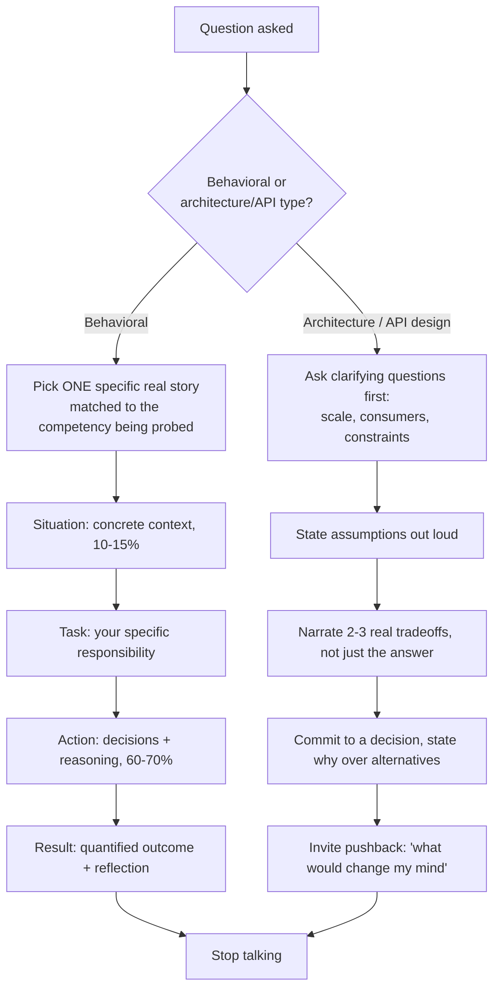

export const metadata = {
  title: "15. Manager Interview Preparation",
  description:
    "Behavioral questions, architecture whiteboard sessions, API design exercises, ownership and leadership questions, mentoring, and cross-functional collaboration scenarios.",
};

# 15. Manager Interview Preparation

## Quick Glance

- A manager round tests how you decide, influence, and operate under ambiguity — not whether you can build the thing. It assumes "can you build it" is already a yes.
- Use the STAR structure for every behavioral answer: Situation (10–15% of your time), Task (5–10%), Action (60–70% — decisions and reasoning, not a list of activities), Result (15–20%, ideally a number, plus a genuine reflection).
- The most common failure: answering "how did you influence people" with "here's what I built." Narrate the persuasion, not the code.
- Say "I," not "we" — the round is isolating your individual contribution, and an answer with no "I decided" gives the interviewer nothing to credit you for.
- Worked example 1 (driving adoption against resistance): find a shared incentive (their bug backlog, not your adoption metric), make the first step near-zero cost for them, earn credibility, then let them set the pace of the rest.
- Worked example 2 (a breaking change gone wrong): triage each affected team first, don't defend the decision; offer a temporary compatibility shim; fix the root cause with a process change (a breaking-change checklist tied to semver and codemods), and admit the reflex you had to correct.
- Worked example 3 (negotiating an infeasible design ask): lead with the concrete problem (performance, accessibility), bring a working alternative prototype instead of just an objection, ask what the designer actually cares about, and land on something that keeps their real intent.
- In an architecture or API-design exercise: ask clarifying questions first, narrate tradeoffs out loud continuously, avoid a boolean prop that silently changes another prop's type, and explicitly say what you chose not to build.
- Never badmouth a past teammate, manager, or designer in a conflict story — frame it as differing legitimate constraints, since how you tell old conflicts previews how you'll talk about this team later.

## Definition

A **manager round** — sometimes called an EM round, hiring-manager round,
or "leadership" round — for a Design Systems role tests something
different from every other interview in the loop. It's not *can you
build it*. It's *how do you decide what to build, how do you get others
to adopt it without formal authority over them, and how do you operate
when requirements are unclear and stakeholders disagree*.

Every earlier chapter in this handbook prepares you for the "can you
build it" question. This chapter, the last one, prepares you for the
round that assumes the answer to that question is already yes — and
tests everything else that decides whether you'll actually succeed in
the role.

## Problem Statement

The most common failure in a Design Systems manager round isn't a lack
of knowledge. It's candidates who are technically excellent giving a
technically excellent answer to a question that wasn't really about
technique. Asked "tell me about a time you drove adoption of something
across teams that resisted it," an unprepared but technically strong
candidate describes the elegant compound-component API they built.

That answer isn't wrong — it's just answering the wrong question. It
answers "what did you build," when the real question was "how did you
get other people, who didn't have to listen to you, to change their
behavior?" Manager-level interviews for design systems exist because a
design system's success depends on adoption, not code quality —
[Governance](/chapters/governance) covers why influence, not authority,
is the operating model here. A candidate who can't show they've navigated
that problem, no matter how good their code is, is a real hiring risk for
this specific role.

## Why Does This Exist?

Hiring committees run separate technical and manager rounds because the
two measure different things that don't correlate much. Technical rounds
predict whether you can produce a correct, well-built solution. Manager
rounds predict whether you can operate at the *scope* the role actually
needs: driving a quarter-long initiative through uncertainty, resolving
conflicting demands from different stakeholders, growing the people
around you. None of that reliably shows up in a coding exercise or a
system-design whiteboard.

This split matters even more for design systems specifically, because
the job runs on influence without authority. A design system team has no
line-management power over the forty product engineers it needs to adopt
its components, no ability to block a designer's mockup, and often no
formal veto over a breaking API change a consuming team insists it needs.
A candidate who's a brilliant individual contributor but has never had to
*persuade* anyone of anything is missing the skill this role uses every
day — and the manager round is where that gets tested directly.

## Historical Context

Structured behavioral interviewing — specifically the STAR format
(Situation, Task, Action, Result) — has roots in industrial-organizational
psychology from the 1970s and 80s. The idea behind it: past behavior
predicts future behavior better than a hypothetical question does. Large
tech companies turned this into formal, competency-based hiring loops
through the 2000s and 2010s. Amazon's Leadership Principles interviews
and Google's "Googleyness and Leadership" round are the best-known
examples — each built around a fixed set of named competencies
interviewers are trained to look for and score consistently, specifically
to reduce how much the result depends on which interviewer you get.

Design systems as a distinct, staffed discipline is younger than general
software engineering. Most companies didn't have a dedicated design
systems team until roughly the mid-to-late 2010s, as component libraries
like Material (2014), Polaris (2016), and Carbon (2016) grew into
full-time organizational investments (see [Case Studies](/chapters/case-studies)
for those systems). As design systems teams grew from a handful of
engineers into larger, senior-title-holding organizations, hiring for
them adopted the same manager-round rigor general engineering leadership
hiring already used — but reshaped around what a design systems role
specifically demands: influence without authority, driving adoption, and
negotiating between design and engineering, rather than the more generic
"cross-team collaboration" framing a general EM round might use.

## How It Works Internally

### What a rubric-scored manager round actually measures

A well-run manager round isn't a free-form conversation the interviewer
makes up as they go. It's usually scored against a fixed set of named
competencies, judged by specific evidence in your answers, not a general
impression. For a Design Systems role, that set commonly includes:

- **Ownership** — did you drive something end-to-end under uncertainty,
  or only carry out a ticket someone else fully specified?
- **Influence without authority** — did you get people who didn't report
  to you, and had no obligation to listen to you, to actually change what
  they did?
- **Technical judgment under tradeoffs** — can you reason through
  competing constraints out loud, not just state a correct final answer?
- **Communication and narrative clarity** — can someone outside your
  specialty follow your reasoning, or does your answer only make sense to
  someone who already knows the answer?
- **Mentorship and growth of others** — do you make the people around you
  better, not just yourself?

Interviewers usually take word-for-word notes while you answer and map
specific phrases back to these categories afterward, in a debrief with
the rest of the interview panel. This is why structure actually matters,
not just as a style preference: a rambling, unstructured answer gives the
interviewer nothing to quote under "ownership," even if the underlying
story genuinely shows it.

### Round format

A typical Design Systems manager round runs 45–60 minutes and usually
mixes two kinds of questions rather than being purely behavioral: two to
three STAR-format behavioral questions, plus one architecture/tradeoff
walkthrough or live API design exercise. The behavioral part gets scored
against the competencies above. The architecture/API part tests the same
"how do you decide and communicate" skill, but through a
technical-adjacent lens — less "write the code," much more "walk me
through how you'd reason about this and why," including how you'd handle
a stakeholder who wants something different.

### STAR structure, precisely

**Situation** (10–15% of your answer time): concrete context — team size,
product, what constraint you were under. Be specific, not generic. "We
had a design system with three consuming teams and a mandate to add a
fourth without breaking the first three" beats "we had a project."

**Task** (5–10%): what you specifically were responsible for — not what
the whole team was responsible for.

**Action** (60–70%, the bulk of the answer): what *you* did, told as a
sequence of decisions with your reasoning behind each one — not just a
list of activities. This is where most weak answers fall apart: they
turn into a list of things that happened, instead of choices the
candidate made and why.

**Result** (15–20%): a concrete outcome, ideally with a number attached.
For a senior or staff-level answer specifically, add a reflection on what
you'd do differently — that's what signals self-awareness, which the raw
outcome alone doesn't.

## Architecture

The flow below is the decision process a candidate should run, in real
time, when a manager-round question lands — before opening their mouth.



The single most common structural mistake this diagram is meant to
prevent: talking past the Result/decision step and slipping back into
more Action detail because the story feels unfinished. A strong answer
ends on purpose — state the outcome, state the reflection, stop.

## Real-World Example

Consider a realistic, composite manager round for a Staff Design Systems
Engineer role. The interviewer opens with: *"Tell me about a time you had
to drive adoption of something across teams that didn't want it."* A
well-prepared candidate doesn't reach for their most impressive
*technical* achievement. They reach for the story that best shows
*influence*, even if the technical work behind it was fairly modest.

They spend fifteen seconds on Situation: "our design system had a new
accessible `Combobox` that was strictly better than the ad hoc autocomplete
three teams had each built on their own, but none of them had budget set
aside to migrate." They state a specific Task: "I owned getting at least
one team to adopt it as a proof point within the quarter." Then they
spend most of their answer on the *sequence of persuasion decisions* —
not "I made a nice migration guide," but something like: "I found which
team's ad hoc autocomplete was actively causing support tickets, because
that gave me a shared incentive instead of just asking for a favor. I did
the first migration pull request myself, so their cost was reviewing it,
not building it. I measured and reported the bundle-size and bug-count
change afterward, which is what got the other two teams to ask *me* to
migrate theirs the next quarter."

The Result has a number attached (three teams migrated within two
quarters, a measurable drop in autocomplete-related support tickets), and
it closes with a genuine reflection: "if I did it again, I'd have gotten
a support-ticket baseline *before* the pitch, not after — I got lucky
the data existed retroactively." That reflection is the specific thing
that separates a good answer from an excellent one. It shows judgment
that kept developing after the fact, not just a successful outcome.

## Implementation Example

This chapter's "implementation" is the worked exercises themselves — the
actual answers a strong candidate would give, not code. Four fully worked
examples follow: three STAR behavioral answers and one live API design
exercise, plus two shorter architecture/tradeoff prompt outlines.

### Worked STAR example 1 — driving adoption against resistance

**Situation:** "At my last role, our design system shipped a token-driven
theming layer. It replaced about sixty hardcoded hex color values
scattered across one product's codebase. The team that owned that
product had shipped their current UI eighteen months earlier. They had
no roadmap space set aside for a 'just for consistency' migration."

**Task:** "I needed to get that specific team to adopt the new tokens
without an executive mandate. There was no top-down push for this — it
was something our design system team started on our own."

**Action:** "I started by not asking for a migration at all. I looked at
their open bug backlog and found four tickets that were, underneath
different titles, all the same root cause: a hardcoded color that didn't
respect the user's OS-level dark mode setting, because it wasn't a token.
I filed a proposal framed entirely around *their* bug count, not around
design-system adoption — 'here's a token swap that closes four of your
open tickets in one pull request.' I wrote that PR myself, keeping their
existing test suite passing unchanged, so their only cost was reviewing
it, not building it. Once that shipped and their bug count visibly
dropped, I asked their tech lead directly if they'd be open to a broader
audit. By then I had some credibility to draw on instead of making a cold
ask. We agreed on a scoped follow-up: I'd flag every remaining hardcoded
value with a lint rule, scoped only to their repo and non-blocking, so
they could migrate the rest at their own pace instead of a big rewrite I'd
have had to force on them."

**Result:** "All sixty values were tokenized within the quarter, entirely
through their own pull requests, at their own pace. Two other teams asked
me for the same lint-rule-plus-targeted-fix approach after seeing it,
which became our design system's standard adoption playbook going
forward. If I did it again, I'd write that playbook down as a documented
pattern from day one, instead of after the third team asked — I ended up
solving the same problem from scratch each time, longer than I needed
to."

<Callout type="tip" title="Why this example works as a template">
  Notice the shape: find a shared incentive (their bugs, not your
  adoption metric), reduce their cost to near zero for the first step,
  earn credibility before asking for more, and let them own the pace of
  the rest. That sequence — shared incentive, low-cost first step, earned
  trust, self-paced follow-through — generalizes to almost any
  adoption-resistance story and is worth having as a mental checklist
  when building your own version of this answer.
</Callout>

### Worked STAR example 2 — a breaking change that went wrong

**Situation:** "We shipped a v3 of our `Modal` component that changed the
focus-trap implementation to fix a real accessibility bug. The old
version leaked focus to background content in certain nested cases. The
fix was correct, but the new version also changed the imperative `ref`
API consumers used to close the modal programmatically. We didn't flag
that clearly enough in the changelog."

**Task:** "I was the engineer who shipped it, and I had to handle the
fallout when it broke three consuming teams' code in production that
same afternoon."

**Action:** "My first move was triage, not defense. I didn't spend time
explaining why the change was correct. Instead, I confirmed with each
affected team exactly what broke, and whether reverting was faster than
fixing forward for them. Two teams could patch their call site in under
ten minutes once I gave them the exact diff. The third team had built
something more elaborate on top of the old ref API, so I gave them a
temporary compatibility shim — a thin wrapper that reproduced the old
signature — so they weren't blocked while they did a proper migration on
their own timeline. Afterward, the real root-cause fix wasn't technical,
it was process: we had no required 'breaking change' section in our pull
request template that forced explicit sign-off, and our changelog treated
a behavior-changing API change the same as a plain bug fix. I proposed,
and got buy-in for, a breaking-change checklist enforced by our version
numbers — see [Governance](/chapters/governance) for the versioning model
this fed into — requiring an explicit deprecation window and a codemod
for any change to a prop or ref signature, not just a line in the
changelog."

**Result:** "Zero comparable incidents in the following year, across four
more major version releases, each shipping a working codemod. Here's my
honest reflection: my first instinct in the moment was to explain why the
fix was necessary, before I'd even confirmed what broke for each team —
a defensive reflex I've had to actively train myself out of. Leading with
triage, not justification, is something I now do on purpose, not
naturally."

<Callout type="tip" title="Why admitting the mistake matters here">
  A "breaking change went wrong" question is testing whether you can own
  a failure without shifting blame onto the affected teams ("they should
  have read the changelog") or onto the situation ("it was an edge
  case"). The strongest version of this answer names your own reflex or
  blind spot honestly, not just the process fix. Interviewers listen
  specifically for that self-awareness, and its absence is a common
  reason an otherwise well-structured answer scores poorly.
</Callout>

### Worked STAR example 3 — negotiating with a designer over an infeasible ask

**Situation:** "A designer proposed a new card component with a hover
interaction: hovering would smoothly resize the card's height to reveal
more content, staggered across a grid of dozens of cards, with a custom
easing curve for each card based on its position. It looked visually
striking in the Figma prototype, but it was written as per-card,
JavaScript-driven animation timing."

**Task:** "As the engineer reviewing the spec before we started building
it, I needed to either build it exactly as specified, or negotiate a
version that actually worked, without just saying no."

**Action:** "I didn't open with 'this isn't feasible.' I opened with what
I actually knew would break. On a grid of forty-plus cards,
JavaScript-driven, staggered resize animations, run per element, would
cause visible stutter on anything but the newest hardware. Separately, an
uncontrolled height-resize animation on hover is a real problem for
people using `prefers-reduced-motion` and for keyboard users, who can't
'hover' at all — something [Accessibility](/chapters/accessibility)
treats as a hard requirement, not a nice-to-have. I brought a working
prototype, not just an objection: a CSS-only version using `transition`
on a fixed max-height, with one shared easing curve instead of a
staggered one. It captured maybe 80% of the visual delight at a fraction
of the performance cost, and worked correctly with reduced motion and
keyboard focus. I walked the designer through it live and asked which
part of the staggering felt essential to them, versus which part was just
'what the prototyping tool made easy to do.' It turned out the staggering
itself wasn't the point — the sense of liveliness was. We landed on a
small, fixed stagger per row instead of per card, which was much simpler
to build and kept what they actually cared about."

**Result:** "The component shipped on the original timeline instead of
slipping, performed well at scale, and passed accessibility review
without rework. After that, the designer and I built a standing habit of
reviewing motion-heavy specs together before they were considered final —
which caught two similar issues earlier in later projects. My honest
reflection: I nearly led with the accessibility objection alone the first
time, which would have read as 'engineering says no' instead of
collaborative problem-solving. Bringing a working alternative, not just a
constraint, is what turned it into a negotiation instead of a veto."

### Architecture and tradeoff whiteboard prompts

Two realistic prompts, each with the shape a strong answer should take —
not a final answer to recite, but the *reasoning process* to narrate out
loud.

**Prompt: "Design the component API for a `DataTable` that needs to
support five different product teams' needs."** A strong candidate
doesn't start by describing props. They start by naming the actual
tension: with five teams, the API has to be flexible enough not to force
a sixth migration in a year, but concrete enough not to become an
"anything goes" escape hatch that defeats the point of a shared component
(see [Component Architecture](/chapters/component-architecture) on
composition vs. configuration).

They'd narrate their clarifying questions out loud: do the five teams
need different row-selection models, different sort and filter logic, or
mostly the same behavior with different visual density? The answer
changes the design. If behavior genuinely differs between teams, a
**compound-component** shape (`<DataTable.Root>`, `<DataTable.Row>`,
`<DataTable.Cell>`) lets each team compose their own row and cell
rendering while sharing virtualization, keyboard navigation, and
accessibility work — that's the right call. If the difference is mostly
visual, a single component with a well-scoped `variant`/`density` prop
set is simpler and should be preferred, following the
composition-vs-configuration guidance in
[Component Architecture](/chapters/component-architecture). They'd
explicitly reject "one giant configurable `DataTable` with forty props"
and say why: it becomes untestable, hard to document, and every new
team's edge case turns into a new prop instead of a new composition —
exactly the failure mode a compound-component shape avoids.

**Prompt: "How would you version and roll out a breaking token rename
across a multi-brand token set used by all five teams?"** A strong
candidate narrates a staged plan out loud. First, add the new token name
as an alias that resolves to the same value as the old one, so both work
at the same time (see [Design Tokens](/chapters/design-tokens) on alias
tokens). Ship a codemod and a lint warning — not an error — on the old
name. Set a defined deprecation window tied to the system's published
version policy (see [Governance](/chapters/governance)). Only remove the
old name in the next major version once usage data shows real adoption
of the new name has crossed a real threshold — not just once the
calendar window has passed, because a deprecation window with no usage
check is a guess, not a decision.

### Worked API design exercise — designing a `<Combobox>` component's props

This is the kind of live exercise a manager or staff-level interviewer
runs to watch you *reason out loud*, not just to see a finished
interface. How you narrate matters as much as the final result.

"First, I'd clarify what 'combobox' needs to support here — is this a
single-select filterable dropdown, or does it also need multi-select and
options loaded asynchronously? I'll assume single-select with optional
async loading, since that covers the common case. I'd note that
multi-select would likely deserve a *separate* component built on shared
primitives, rather than one component with a `multiple` flag that changes
what type its value is. A boolean prop that silently changes whether
`value` is a string or an array looks convenient in a demo, but causes
real type-safety pain for every consumer — covered generally in
[Component Architecture](/chapters/component-architecture)."

"Next, controlled vs. uncontrolled state — I'd support both, the way most
mature primitives do. A form library wants controlled `value`/`onChange`,
but a simple standalone use case shouldn't be forced to manage state it
doesn't care about."

```tsx
// The reasoning I'd narrate for each field:
// - value/defaultValue/onValueChange: standard controlled/uncontrolled
//   pair, not a single boolean flag, so TypeScript can't represent an
//   invalid combination (controlled without onValueChange, etc).
// - inputValue is SEPARATE from value: the text the user is typing is
//   not the same thing as the committed selection, and conflating them
//   is a common bug source in combobox implementations specifically.
// - items accepts a plain array OR an async loader, because a design
//   system combobox realistically needs to support both a static list
//   and a server-filtered one without being two different components.
// - filter is overridable because "filter by substring" is a default,
//   not a law — some consumers need fuzzy matching or server-side
//   filtering where the component shouldn't filter client-side at all.
interface ComboboxProps<T> {
  items: T[] | ((query: string) => Promise<T[]>);
  itemToString: (item: T) => string;

  value?: T | null;
  defaultValue?: T | null;
  onValueChange?: (item: T | null) => void;

  inputValue?: string;
  onInputValueChange?: (query: string) => void;

  filter?: (item: T, query: string) => boolean;

  loading?: boolean;
  loadingText?: string;
  emptyText?: string;

  disabled?: boolean;
  invalid?: boolean;
  "aria-label"?: string;
  "aria-labelledby"?: string;

  // Slot-style render prop for full control over item markup while the
  // component still owns keyboard nav, ARIA, and open/close state —
  // the headless-behavior/styled-consumer split covered in
  // Case Studies' React Aria discussion, applied at component-API scale.
  renderItem?: (item: T, state: { active: boolean; selected: boolean }) => React.ReactNode;
}
```

"A few things I'd say out loud instead of leaving implicit: `items`
accepting either an array or an async function means the component
internally needs a debounce and a loading state no matter which shape is
passed. I'd call that tradeoff out rather than let it stay a hidden
implementation detail, because it changes what `loading`/`loadingText`
mean to a consumer. I'd also say explicitly that I want to require either
`aria-label` or `aria-labelledby` at the type level if I can, because an
unlabeled combobox is a real, common accessibility failure. I'd rather
the type system catch that than rely on every consumer remembering to add
it. That's a design-system-specific instinct a generic component library
might not bother enforcing at the type level, but a system whose whole
job is consistent accessibility should."

"Finally, I'd state what I deliberately left out: no built-in `multiple`
prop, and no built-in async-loading state machine beyond a simple
`loading` boolean. Those are real needs worth addressing, but I'd rather
ship a correct single-select primitive first, and add multi-select as a
composed pattern or a sibling component once we have real usage data on
what it actually needs to look like — instead of guessing now and locking
in the wrong shape."

## Advantages

- **Predicts scope, not just skill.** A structured manager round shows
  whether a candidate has actually worked at the ambiguity and cross-team
  scale the role needs — something a coding exercise can't show.
- **Filters specifically for the DS-unique skill of influence without
  authority** — arguably the single strongest predictor of success in
  this particular role, more than raw component-architecture skill.
- **Reduces how much the outcome depends on which interviewer you get**,
  when it's run against a shared rubric, compared to an unstructured
  "vibe check" conversation.
- **Surfaces self-awareness and capacity to grow**, through the
  reflection part of a strong STAR answer — a signal a purely technical
  round rarely captures.

## Disadvantages

- **Coachable and reproducible through rehearsal**, which weakens its
  predictive value for candidates who over-prepare rehearsed stories
  instead of reasoning genuinely in the moment. Interviewers partly
  counter this with unscripted follow-up questions.
- **Favors articulate storytellers**, which can put strong performers who
  aren't naturally narrative at a disadvantage — including some
  neurodivergent candidates and people interviewing in a non-native
  language. This is a known fairness critique of behavioral interviewing
  in general.
- **Scoring still carries real subjectivity**, even against a shared
  rubric — two interviewers can score the same answer differently
  without calibration training.
- **The time-boxed format compresses genuinely complex stories** into a
  few minutes, which rewards candidates whose best examples happen to be
  tellable that concisely, over candidates whose real achievements are
  less tidy to narrate.

## Alternatives

Manager rounds are one format among several a hiring loop might use to
test the same underlying competencies. The comparison below applies the
same evaluation lens this handbook uses for tools and frameworks
elsewhere, adapted to interview formats.

| Dimension | STAR Behavioral Round | Architecture/Tradeoff Whiteboard | Live API Design Exercise | Portfolio / Presentation Review | Reference Calls Only |
| --- | --- | --- | --- | --- | --- |
| What problem it solves | Predicts past-behavior-based future performance on ownership/influence | Tests real-time technical judgment and communication under ambiguity | Tests API-design instinct and narrated reasoning specifically | Tests depth and self-driven initiative on a candidate's own past work | Cross-checks self-reported claims against a third party |
| Why it was created | I/O psychology research showing past behavior predicts future behavior | Coding-round equivalent for architecture-level (not implementation-level) judgment | Combines technical depth with communication assessment in one exercise | Lets a candidate control the narrative of their strongest work | Verifies claims when interview signal alone is considered insufficient |
| Performance (signal quality) | High for ownership/influence if scored against a calibrated rubric | High for technical judgment; weaker signal on interpersonal competencies | High for API-design instinct specifically; narrow scope otherwise | High for depth, but self-selected material inflates apparent polish | Moderate; references are rarely fully candid, especially manager-provided ones |
| Developer/candidate experience | Familiar format, but stressful if under-prepared | Can feel high-pressure; ambiguity is the point but reads as unfair if prompt is vague | Engaging for candidates who like reasoning out loud; hard for those who freeze under live scrutiny | Lowest-stress format; candidate controls pacing and material | No candidate involvement at all |
| Learning curve (to prepare for) | Low to learn the format, high to prepare genuinely strong stories | Moderate — requires practice narrating tradeoffs, not just solving | Moderate — requires practicing live API reasoning specifically | Low — mostly requires having done work worth presenting | None (not candidate-facing) |
| Community / ecosystem support | Extremely well-documented (STAR is a known standard) | Well-documented in system-design-interview prep materials | Less standardized; fewer dedicated prep resources | Format varies widely by company, less standardized guidance | Standard HR practice, well understood |
| Maintenance burden (for the hiring org) | Requires interviewer rubric-calibration training to stay consistent | Requires prompt-bank maintenance and calibrated example answers | Requires prompt-bank maintenance, higher interviewer skill to run well | Low — mostly candidate-driven | Low, but time-consuming to schedule and collect |
| Enterprise suitability | High — standard at every major tech company | High — standard for senior+ technical roles | Moderate — used more at design-systems-specific or product-focused companies | Moderate — common for design-adjacent or portfolio-heavy roles | High, nearly universal as a supplementary check |
| When to choose it | Assessing ownership, influence, leadership competencies specifically | Assessing real-time technical/architectural judgment at senior+ level | Assessing component-API design instinct specifically, common for DS roles | Assessing depth of self-driven work, common for design-adjacent DS roles | Always, as a supplement — rarely a sole signal source |
| When NOT to choose it | Sole signal source without any technical round — misses raw skill | Sole signal source — misses ownership/influence/collaboration entirely | Sole signal source — too narrow, misses broader judgment | Sole signal source — vulnerable to a candidate cherry-picking their best, least representative work | Sole signal source — too easily gamed by candidate-selected references |

Large companies mostly run these formats **together, in one loop**,
rather than picking just one. A Design Systems hiring loop typically
includes a technical/IC round (covered by
[Component Architecture](/chapters/component-architecture) and the
earlier, implementation-focused chapters), a manager round that combines
STAR behavioral and architecture/API-design assessment (this chapter),
and reference checks as an extra cross-check — precisely because each
format's blind spot is covered by one of the others. A company that only
ran technical rounds would end up hiring strong individual contributors
who fail at adoption. A company that only ran behavioral rounds would
hire persuasive communicators who can't actually design a correct
component API. Companies with the most mature design-systems hiring —
often the same companies profiled in
[Case Studies](/chapters/case-studies) — treat the manager round
specifically as where design-systems-unique skills (influence without
authority, negotiating with design, driving adoption) get tested, rather
than folding them loosely into a generic "culture fit" chat.

## Tradeoffs

- **Structure (STAR) vs. authenticity.** A rigidly STAR-formatted answer
  is easier for an interviewer to score, but can sound rehearsed and
  stiff if it's over-polished. The strongest candidates use the
  structure as a scaffold, not a script, and let genuine reasoning show
  through it.
- **Depth vs. breadth in a time-boxed round.** Spending eight of your
  forty-five minutes on one story leaves less room to show range across
  multiple competencies — but a shallow, rushed answer to three questions
  often scores worse than a deep answer to two.
- **Confidence vs. honesty in the Result/reflection.** Overselling an
  outcome erodes credibility the moment a follow-up question probes it.
  A genuine, specific reflection on what you'd do differently usually
  scores *better* than a story with no acknowledged flaws, which reads as
  either dishonest or lacking self-awareness.
- **A prepared story bank vs. spontaneous reasoning.** Heavy rehearsal
  helps you hit the structure reliably under pressure, but over-rehearsal
  that can't flex to an interviewer's specific follow-up question reads
  as evasive. Practice the *content*, not a word-for-word script.

## Performance Considerations

"Performance" here means your own pacing and delivery inside the round
itself:

- **Time-box your own answers out loud.** A reasonable default is roughly
  ninety seconds to two minutes for Situation and Task combined, leaving
  most of the remaining time for Action. Going three-plus minutes before
  reaching Action is the single most common pacing mistake.
- **Watch the interviewer's engagement, not just your own script.** If
  they're taking notes quickly, keep going. If they look like they're
  waiting for you to land the point, move toward Result.
- **In an architecture or API exercise, keep narrating.** Don't go silent
  while thinking — an interviewer scoring your communication has nothing
  to score during silence, even if you land on a good answer eventually.
- **Leave room for follow-up questions.** An answer that fills the whole
  allotted time leaves no space for the interviewer to dig deeper, which
  often reads as a missed chance to show more depth, not as a strength.

## Scalability Considerations

Preparing for manager rounds scales the same way preparing technical
material does: build something reusable instead of starting from scratch
each time.

- **Build a story bank of six to eight real experiences**, each one
  usable for more than one competency (a single strong story often shows
  both ownership and influence, for instance), so you're not scrambling
  to invent a new story for every possible question.
- **Match story selection to the seniority of the role.** The same
  underlying experience should be told with more emphasis on individual
  execution for a senior-level round, and more on organizational or
  strategic framing for a staff-or-above round. The *story* doesn't need
  to change — the *emphasis* does.
- **Update the story bank as your career progresses.** A story that was
  your best example three years ago may now look too small for the level
  you're interviewing at. Retire stories that no longer represent your
  current scope.
- **Reuse the reasoning process from the API-design exercise, not a
  memorized answer.** The specific component asked about will vary —
  Combobox one interview, DataTable the next — but the process from the
  worked example above (clarify, then reason, then narrate tradeoffs)
  transfers directly.

## Common Mistakes

<Callout type="danger" title="Answering with 'we' when the question asks about 'you'">
  A manager round is specifically trying to separate your individual
  contribution from your team's. An answer that never says "I decided,"
  "I proposed," or "I chose" — only "we shipped" — gives the interviewer
  nothing to credit to you specifically. This is one of the most common
  reasons a genuinely strong contributor scores poorly on ownership.
</Callout>

<Callout type="danger" title="Jumping into an architecture/API exercise without clarifying questions">
  Starting straight into designing props or drawing boxes signals you're
  optimizing to look fast, not to get the right scope. A strong candidate
  spends the first thirty to sixty seconds establishing constraints
  (scale, consumers, existing patterns) before proposing anything.
  Skipping this reads as a junior instinct, no matter how good the
  eventual design is.
</Callout>

<Callout type="danger" title="A Result with no number and no reflection">
  "And it went well" is not a Result. A senior or staff-level answer
  needs either a quantified outcome (adoption count, bug reduction, time
  saved) or, when a number genuinely isn't available, an honest, specific
  reflection on what you learned or would change. An answer with neither
  reads as unexamined.
</Callout>

<Callout type="danger" title="Badmouthing a previous team, manager, or designer in a conflict story">
  A "negotiating with a designer" or "breaking change went wrong" story
  that frames the other party as simply wrong or unreasonable is a red
  flag interviewers are specifically trained to notice. It suggests how
  you'll talk about *this* team's designers and engineers eighteen months
  from now. Frame conflict stories around legitimate, differing
  constraints, not villains.
</Callout>

<Callout type="danger" title="Giving a generic engineering-leadership answer with no design-system specificity">
  An answer that would work word-for-word for a backend infrastructure
  role signals you haven't really internalized what's distinct about this
  job — the influence-without-authority dynamic, the design/engineering
  negotiation, the fact that adoption itself is the metric. Tie every
  answer back to something that's specifically true of design systems
  work, not generic engineering leadership.
</Callout>

## Best Practices

- Prepare three to four STAR stories in advance, each mapped to at least
  one of: adoption/influence, a failure you owned and fixed
  structurally, and a design/engineering negotiation — the three
  scenario types this chapter (and most DS manager rounds) weight most
  heavily.
- Practice the Combobox-style API design exercise reasoning process on a
  different component each week leading up to interviews (DataTable,
  DatePicker, Toast, Menu) so the *process* — clarify, state tradeoffs,
  commit, invite pushback — is automatic regardless of which component
  actually gets asked.
- Always close a STAR answer with a genuine, specific reflection, even
  when the story is a clean success — it demonstrates the same
  self-awareness a "what went wrong" story demonstrates, without needing
  an actual failure to draw on.
- Cross-reference concepts by name where genuinely relevant
  ([Governance](/chapters/governance)'s versioning policy,
  [Accessibility](/chapters/accessibility)'s hard requirements,
  [Collaboration with Designers](/chapters/collaboration-with-designers)'s
  disagreement-resolution models) — it signals the story is grounded in
  real practice, not invented for the interview.
- In an architecture/tradeoff prompt, explicitly state what you're
  choosing *not* to build and why — the restraint to scope something down
  is as strong a signal as the design itself.

## Interview Questions

<InterviewQuestion q="Walk me through how you'd design the props API for a Combobox component that needs to support both a static list and server-filtered async options.">
  **What the interviewer is testing:** Live API-design reasoning, narrated
  out loud — modeling controlled/uncontrolled state, avoiding boolean
  flags that silently change a prop's type, and building accessibility
  into the type contract instead of bolting it on later.

  **Poor answer:** Jumps straight to listing props, with no clarifying
  questions or stated tradeoffs.

  **Good answer:** Separates `value` from `inputValue`, supports both
  controlled and uncontrolled patterns, and accepts both array and
  async-function forms for `items`.

  **Excellent senior answer:** All of the above, narrated as a sequence of
  explicit tradeoffs — why not a `multiple` boolean, why `aria-label`
  should be enforced at the type level, what's deliberately left out and
  why — matching the fully worked reasoning in this chapter's
  Implementation Example.

  **Common mistakes:** Designing the props silently and only presenting a
  finished interface, which gives the interviewer nothing to evaluate
  about the reasoning process itself.
</InterviewQuestion>

<InterviewQuestion q="Design the component API for a DataTable that needs to support five different product teams' needs. How do you decide between one configurable component and a compound-component API?">
  **What the interviewer is testing:** Architecture-level judgment under
  unclear, conflicting requirements — the manager-round version of a
  technical question, testing the decision process over the final
  answer.

  **Poor answer:** Immediately proposes a single component with many
  props to cover all five teams' needs.

  **Good answer:** Asks whether the five teams' needs differ in behavior
  or mostly in visual density, and proposes compound components for
  behavioral differences, a variant prop set for visual differences.

  **Excellent senior answer:** Explicitly rejects the "one component,
  forty props" outcome and says why — it becomes untestable, hard to
  document, and every edge case turns into a new prop instead of a new
  composition. Ties the decision to the composition-vs-configuration
  framing from [Component Architecture](/chapters/component-architecture),
  and states what evidence (which teams' needs actually diverge) they'd
  gather before committing, rather than guessing upfront.

  **Common mistakes:** Treating this as a purely technical question without
  acknowledging the organizational reality of five teams with legitimately
  different needs and no single "correct" API that satisfies all of them
  without a real tradeoff.
</InterviewQuestion>

## Manager-Level Questions

<ManagerQuestion q="Tell me about a time you drove adoption of something across teams that resisted it.">
  **What the interviewer is testing:** Influence without authority — the
  single most commonly probed skill in a Design Systems manager round,
  because the role has no mandate power over consuming teams.

  **Poor answer:** Describes the technical quality of what was built,
  with no mention of how anyone was actually persuaded to adopt it.

  **Good answer:** Describes finding a shared incentive with the
  resistant team and lowering their cost to adopt.

  **Excellent senior answer:** Matches the shape of this chapter's first
  worked STAR example: identifies a shared incentive (their own bug
  backlog, not an abstract "consistency" goal), does the first migration
  step at near-zero cost to the resistant team, earns credibility before
  asking for more, and lets the team control the pace of what follows —
  plus a specific, honest reflection on what they'd do differently.

  **Common mistakes:** A story where adoption happened because of a
  mandate from above, which doesn't actually show the candidate's own
  influence skill.
</ManagerQuestion>

<ManagerQuestion q="Tell me about a breaking change that went wrong. What happened, and what did you change afterward?">
  **What the interviewer is testing:** Ownership of failure, a triage
  instinct under pressure, and whether the fix afterward was structural
  (a process change) or just a one-off patch.

  **Poor answer:** Describes the incident without taking clear personal
  responsibility, or blames the affected teams for not reading a
  changelog.

  **Good answer:** Describes fixing the immediate breakage for affected
  teams first, then finding and fixing the process gap that allowed it.

  **Excellent senior answer:** Matches this chapter's second worked STAR
  example: leads with triage for each affected team, not justifying the
  original decision; offers a temporary compatibility shim to unblock
  teams while they migrate properly; and turns the incident into a
  lasting process change (a breaking-change checklist tied to version
  numbers and codemods, per [Governance](/chapters/governance)) instead
  of a one-time fix — plus an honest admission of a personal reflex
  (defensiveness) they had to correct.

  **Common mistakes:** No structural fix described — just "we fixed the
  bug," with nothing preventing it from happening again — or no honest
  self-reflection at all, which reads as unexamined.
</ManagerQuestion>

<ManagerQuestion q="Tell me about a time a designer wanted something you knew was technically infeasible or would cause real problems. How did you handle it?">
  **What the interviewer is testing:** Cross-functional negotiation
  skill specifically with design — a recurring, high-stakes relationship
  for this role, covered generally in
  [Collaboration with Designers](/chapters/collaboration-with-designers).

  **Poor answer:** Describes simply telling the designer no, or silently
  building it anyway despite knowing the problems.

  **Good answer:** Describes bringing a working alternative instead of
  just an objection, and finding out what the designer actually cared
  about underneath the specific ask.

  **Excellent senior answer:** Matches this chapter's third worked STAR
  example: leads with the concrete technical and accessibility problems
  (not vague discomfort), brings a working prototype of an alternative
  instead of only a constraint, asks what specifically mattered to the
  designer about the original ask, and lands on a solution that keeps
  the underlying intent — plus a reflection on how close they came to
  leading with a flat "no" instead of a collaborative alternative.

  **Common mistakes:** Framing the story as engineering correctly
  overruling design, instead of a negotiation that preserved both sides'
  legitimate goals.
</ManagerQuestion>

<ManagerQuestion q="What does ownership mean to you at the senior or staff level, on a design system specifically?">
  **What the interviewer is testing:** Whether the candidate understands
  ownership as driving unclear, quarter-scale work — not just executing
  a well-specified ticket.

  **Poor answer:** "Ownership means finishing what I'm assigned
  reliably."

  **Good answer:** Describes owning a problem end-to-end, including
  defining the problem itself when requirements aren't clear.

  **Excellent senior answer:** Draws a clear line between ticket
  execution and real ownership: owning a design system initiative means
  deciding *what* the right problem to solve actually is (which teams
  need this, in what order, at what cost to them), not just building
  whatever was requested. Includes an example where the candidate
  changed the scope of what was originally asked for, because their own
  investigation showed the original request wasn't the right fix.

  **Common mistakes:** Mixing up ownership with individual technical
  execution quality, with no mention of ambiguity or defining scope.
</ManagerQuestion>

<ManagerQuestion q="How have you grown a junior or mid-level engineer specifically on design-system-flavored work?">
  **What the interviewer is testing:** Concrete mentorship practice, not
  a general belief that mentorship matters.

  **Poor answer:** "I always make time to help junior engineers when they
  have questions."

  **Good answer:** Describes a specific practice — pairing on an
  accessibility implementation, or a code-review approach that explains
  the "why" behind a requested change, not just the "what."

  **Excellent senior answer:** Gives a concrete example tied to
  design-system-specific skill growth — for example, pairing with a
  mid-level engineer through their first ARIA-pattern implementation,
  from spec to screen-reader testing, deliberately having them drive
  while the senior engineer narrated the reasoning instead of doing it
  for them. States an observable outcome (that engineer later owned a
  similar pattern independently, or mentored someone else on it in
  turn).

  **Common mistakes:** Vague, activity-based answers ("I do code
  reviews") with no specific example or observable growth outcome.
</ManagerQuestion>

<ManagerQuestion q="Design, product, and three different consuming engineering teams all want different things from the same component. How do you navigate that?">
  **What the interviewer is testing:** Cross-functional prioritization
  under genuinely conflicting demands from different stakeholders — a
  routine part of this role, not a hypothetical.

  **Poor answer:** "I'd try to make everyone happy" or "I'd escalate to
  my manager to decide."

  **Good answer:** Describes finding the actual underlying need behind
  each stakeholder's stated request, since stated requests often
  conflict more than the underlying needs do.

  **Excellent senior answer:** Walks through a concrete method:
  separating each party's *stated ask* from their *underlying
  constraint* (a consuming team asking for a prop that bypasses
  accessibility validation might really just need a faster escape hatch
  for a legitimate edge case, not a rejection of accessibility itself),
  finding where underlying needs actually overlap even when the stated
  asks don't, and making a visible, reasoned tradeoff decision instead of
  a silent compromise — plus communicating the *reasoning*, not just the
  decision, back to every party, so the ones who didn't get their literal
  ask still understand why.

  **Common mistakes:** Describing conflict resolution as pure compromise
  (splitting the difference) instead of finding the actual underlying
  alignment, or offloading the decision entirely to a manager instead of
  showing the candidate's own judgment.
</ManagerQuestion>

## Summary

A Design Systems manager round tests a different, largely non-overlapping
set of skills from every technical round in the loop. It asks: can you
drive unclear, quarter-scale work to completion (ownership)? Can you get
people who don't report to you to actually change their behavior
(influence without authority)? Can you negotiate with designers and
multiple engineering teams whose stated needs conflict? Do you grow the
people around you? All of this matters more for this specific role,
because a design system's success depends on adoption and cross-team
buy-in, not code quality alone.

The STAR format (Situation, Task, Action, Result, plus a genuine
reflection) is the scaffold nearly every strong behavioral answer uses.
The three fully worked examples in this chapter — driving adoption
through shared incentives instead of a mandate, owning a breaking-change
incident through triage and a structural fix instead of defensiveness,
and negotiating an infeasible design ask by bringing a working
alternative instead of a flat objection — are deliberately built around
the shapes design-systems manager rounds probe most often. The live API
design exercise (worked in full through the Combobox example) tests the
same underlying judgment through a technical-adjacent lens: narrating
tradeoffs and reasoning out loud matters as much as the final prop
interface.

As the last chapter of this handbook, the connection back to every
earlier chapter is intentional. A manager round is, in effect, testing
whether you can talk convincingly and honestly about applying everything
the rest of this book covers, under the conditions of ambiguity and
disagreement that are the actual daily reality of the job.

**Key takeaways**

- A manager round tests ownership, influence without authority,
  cross-functional negotiation, and mentorship — distinct competencies
  from the technical rounds earlier chapters prepare you for.
- Structure every behavioral answer with STAR, but spend 60–70% of your
  time in Action narrating *decisions and reasoning*, not a list of
  activities — and always close with a genuine, specific reflection.
- Build a reusable story bank of three to four experiences mapped to
  adoption/influence, an owned failure, and a design/engineering
  negotiation — the three scenario types this role's manager rounds weight
  most heavily.
- In an architecture or API-design exercise, ask clarifying questions
  before proposing anything, narrate tradeoffs continuously, and
  explicitly state what you chose not to build and why.
- The most common failure mode is answering a "how did you influence
  people" question with "what did I build" — technical excellence is not
  what this round is testing.
- Never badmouth a designer, manager, or team in a conflict story — frame
  disagreement around legitimate differing constraints, since how you
  narrate past conflict is read as a preview of how you'll narrate future
  conflict with this team.
