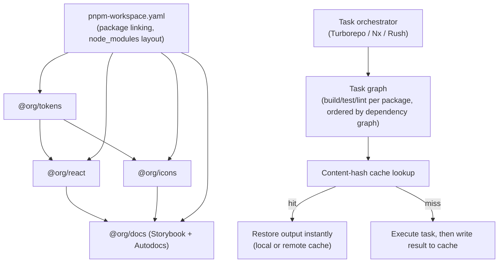

export const metadata = {
  title: "9. Monorepo Architecture",
  description:
    "Monorepo vs polyrepo, Turborepo vs Nx vs Lerna vs Rush, pnpm workspaces, task graphs, remote caching, incremental builds, changesets and CI/CD for a component library.",
};

# 9. Monorepo Architecture

## Definition

A **monorepo** is a single version-controlled repository containing
multiple, independently publishable packages — for a design system,
typically `@org/tokens`, `@org/react`, `@org/icons`, `@org/docs`, and
internal apps like the Storybook host — managed together with shared
tooling for dependency resolution, task orchestration, and versioning.
The defining property isn't "one big folder"; it's that a change spanning
multiple packages (a token rename that must also update every component
consuming it and the docs site referencing it) can land as **one atomic
commit, reviewed and merged as one unit**, rather than as N separate
commits across N separate repositories, each requiring its own version
bump before the next dependent package can even start its own change.

## Problem Statement

Consider the token-rename example concretely, in a **polyrepo** — separate
repos for `tokens`, `react-components`, and `docs`. Renaming a token
means: change and release `tokens` (a new npm version), then open a PR in
`react-components` to bump the `tokens` dependency and update every usage,
release *that* (another new version), then open a PR in `docs` to bump
`react-components` and update any docs referencing the old name, release
*that*. Three repos, three PRs, three releases, three review cycles, and
— critically — a window during which `tokens` has shipped the rename but
`react-components` hasn't picked it up yet, so any consumer building
against `tokens@latest` and `react-components@latest` together gets a
broken combination that never actually existed as a tested, reviewed
state. Nobody explicitly signed off on "tokens vX + react-components vY"
as a valid pairing; it just happened to be whatever versions each
consumer's `package.json` resolved to at install time.

A monorepo collapses this into one PR: the token rename, every consuming
component's update, and the docs update are one diff, reviewed together,
tested together via a single CI run that can actually verify the whole
change is internally consistent, and merged atomically. The core problem a
monorepo solves for a design system specifically is **cross-package
atomicity** — the ability to make and verify a change that spans package
boundaries as a single unit, instead of coordinating N independent
release cycles and hoping they land in the right order.

## Why Does This Exist?

Design systems are unusually monorepo-shaped compared to typical backend
service architectures, because their packages have an unusually **tight,
synchronous coupling**: `@org/react` cannot meaningfully exist at a
version that doesn't match a specific `@org/tokens` version, the docs site
is explicitly documenting the exact behavior of the components package,
and icons, themes, and component packages routinely change together in
response to a single design decision. This is the opposite of, say, a
microservices architecture, where services are deliberately decoupled and
independent deployability is the *goal* — for a design system, independent
release cadence across `tokens` and the components that consume them is
usually a liability, not a feature, because it reintroduces exactly the
"untested combination in the wild" problem above.

Monorepo tooling (Turborepo, Nx, Lerna, Rush) exists specifically to make
this coupling *manageable* at scale — because naively running every
package's full build/test/lint on every commit, in a repo with dozens of
packages, is far too slow to be usable. The core engineering problem all
of this tooling solves is: **given N packages with a known dependency
graph, run only the tasks that could possibly be affected by this change,
in the correct order, and reuse any previous result that's provably
unaffected.** That's the task graph, caching, and dependency graph
material covered below — it's not incidental tooling, it's the thing that
makes "one big repo" scale past the point where CI time becomes the
bottleneck.

## Historical Context

**Lerna** (2015) was the first widely adopted JavaScript monorepo tool,
built at a time when neither npm nor Yarn had native workspace support —
Lerna's original job was purely to solve *package linking and publishing*
across a repo: symlinking local packages into each other's
`node_modules`, and orchestrating `npm publish` across many packages with
coordinated version bumps. It had no meaningful task-graph or caching
story because that wasn't yet the bottleneck teams were hitting — repos
were smaller and CI time wasn't the dominant pain point. As Yarn Workspaces
(2017) and later npm Workspaces (2020) absorbed Lerna's linking
responsibility natively into the package managers themselves, Lerna's
original core job became redundant, and the project went through a period
of stagnation until Nx's team adopted and now co-maintains it — Lerna
today is largely a thin, opinionated versioning/publishing layer that can
optionally delegate task execution to Nx underneath.

**Nx**, from the former AngularJS team at Google turned Nrwl (2017),
targeted a different, larger problem from the start: task orchestration
and caching across large enterprise monorepos, generalized well beyond
Angular to any framework. Nx introduced the computation-caching model
(hash task inputs, skip re-running if the hash is unchanged) and a rich
plugin/generator ecosystem aimed at very large organizations with many
teams and inconsistent internal conventions — code generators to enforce
consistent scaffolding, a visual dependency-graph explorer, and deep
editor integration. **Rush**, from Microsoft (2016–2019 maturation), took
a stricter, more enterprise-security-conscious angle: mandatory PNPM
usage, strict phantom-dependency prevention, deterministic installs
enforced at the tooling level rather than left to convention — the
priorities of an org running monorepos with hundreds of engineers and
low tolerance for "works on my machine" drift.

**Turborepo**, released in 2021 and acquired by Vercel in December 2021,
arrived last with an explicit thesis: most teams don't need Nx's or
Rush's full feature surface, they need the two things that actually save
time day to day — a fast task graph executor and remote caching — with a
radically smaller configuration surface (`turbo.json` is commonly under
30 lines) and zero required migration off whatever package manager the
team already uses. Vercel's backing also meant tight, opinionated
integration with the Next.js ecosystem many design system docs sites and
example apps are built on, plus a hosted remote cache (Vercel Remote
Cache) with no separate infrastructure to stand up. This is the direct
reason Turborepo became the default recommendation for *new* design
system monorepos starting roughly 2022 onward — it solves the specific
80% of the problem (fast, cached, parallelized task execution) most teams
actually have, without asking for Nx's generator/plugin investment or
Rush's stricter operational model.

## How It Works Internally

Every serious monorepo build orchestrator (Turborepo, Nx, Rush) is built
around the same three mechanisms, implemented with different tradeoffs:

1. **A dependency graph**, derived from each package's `package.json`
   `dependencies`. Package `@org/react` depending on `@org/tokens` means
   an edge `tokens → react` in the graph — this is the ground truth both
   for *what order tasks must run in* and for *what's affected by a
   change* (impact analysis).
2. **A task graph**, derived from the dependency graph plus each
   package's declared task dependencies (e.g. "build depends on this
   package's own dependencies having already built" — `dependsOn:
   ["^build"]` in Turborepo's config, shown below). This is what
   determines which tasks *can* run in parallel (any two tasks with no
   dependency edge between them) versus which *must* run in sequence
   (`tokens`'s build must complete before `react`'s build can start,
   because `react`'s build imports `tokens`'s build output).
3. **Content-hash-based caching.** Before running a task, the orchestrator
   hashes every declared input to that task — source files, the task's
   own configuration, relevant environment variables, and (transitively)
   the hashes of the task's own dependencies' outputs. If that exact hash
   has been seen before — either in a local `.turbo`/`.nx` cache directory
   or in a **remote cache** — the orchestrator skips actually running the
   task and instead replays the previously recorded stdout and restores
   the previously recorded output files instantly. This is the single
   mechanism responsible for both **incremental builds** (skip work
   locally that a previous local run already did) and **remote caching**
   (skip work in CI, or on a teammate's machine, that *any* machine has
   already done for that exact input hash) — they're the same cache, just
   populated from different machines.

The practical consequence: the first time anyone builds a given input
combination, it costs full build time; every subsequent build of that
exact combination, by anyone, anywhere, costs roughly the time to
download the cached output — which is why a CI pipeline that took ten
minutes on every push can drop to under a minute once a teammate's
earlier, unrelated PR already built and cached the shared packages this
PR doesn't touch.

## Architecture



The structural point this diagram makes explicit: **pnpm Workspaces is
the linking layer every orchestrator sits on top of** (it makes
`@org/tokens` resolvable from `@org/react`'s `node_modules` at all), while
the orchestrator's job is purely about *task execution order and reuse*
on top of that already-linked graph. Confusing these two layers — thinking
Turborepo or Nx handles package linking — is a common source of
misdiagnosed monorepo problems; a "cannot find module '@org/tokens'"
error is a pnpm/workspace configuration problem, not a task-orchestrator
problem.

## Real-World Example

Vercel's own component and internal tooling monorepos are the canonical
Turborepo showcase, unsurprisingly, but the pattern generalizes: Shopify's
Polaris repository is a pnpm-based monorepo with separate packages for
`@shopify/polaris-tokens`, `@shopify/polaris` (the component library),
and the documentation site, structured explicitly so a token change and
its consuming component update land as one PR. Adobe's Spectrum
(`react-spectrum`) is a particularly large, Nx-adjacent-scale example —
hundreds of packages (React Aria's individual hooks are each separately
published, alongside the styled Spectrum components) where a fast,
correct dependency graph isn't optional tooling polish, it's the only
thing that makes "what does changing this one hook actually affect"
answerable at all. On the very-large-enterprise end, Microsoft's own
internal monorepos (and the Rush project's own documentation) describe
exactly the scenario Rush is built for: thousands of engineers, hundreds
of packages, an operational requirement that a phantom dependency (a
package importing something it never declared, that happened to be
present in `node_modules` only because a sibling package happened to
depend on it) simply cannot ship, because at that scale it *will*
eventually break in exactly the way that's hardest to debug — works
everywhere until one specific install ordering doesn't include the
undeclared package anymore.

## Implementation Example

### pnpm Workspaces — the linking layer underneath everything

```yaml
# pnpm-workspace.yaml
packages:
  - "packages/*"
  - "apps/*"
```

```json
// packages/react/package.json
{
  "name": "@org/react",
  "version": "4.2.0",
  "dependencies": {
    // "workspace:*" resolves to the local package during development
    // and is rewritten to the real published version number at publish
    // time — this is the mechanism that keeps local dev always pointed
    // at the current in-repo code, never a stale published version.
    "@org/tokens": "workspace:*"
  },
  "peerDependencies": {
    "react": ">=18.0.0"
  }
}
```

pnpm's **content-addressable store** is the specific mechanism that
prevents the class of bug most teams associate with npm/Yarn Classic
monorepos: a **phantom dependency**, where package A imports package B
without declaring it, and the import still resolves — silently — only
because npm/Yarn's flat `node_modules` hoisting happened to place B at
the top level as a side effect of some *other* package's real dependency
on B. That import works in dev, passes CI, and then breaks the moment the
sibling package that incidentally pulled in B is removed or B's version
changes for unrelated reasons — a bug that's specifically hard to diagnose
because nothing in A's own `package.json` looks wrong.

pnpm avoids this structurally: packages are stored once, content-hashed,
in a global store (`~/.pnpm-store`), and each package's `node_modules`
is populated with a **strict symlink structure** that only exposes the
dependencies that package *actually declared* — not everything hoisted to
the top of the tree. If `@org/react` imports `lodash` without declaring
it, that import fails immediately, in every environment, every time,
because `lodash` was genuinely never linked into `@org/react`'s
`node_modules` in the first place. This turns an intermittent,
environment-dependent bug class into a deterministic, immediate one —
exactly the property Rush's stricter operational model (discussed below)
depends on at very large scale, and part of why pnpm has become the
default workspace manager even for teams using Turborepo or Nx on top,
rather than npm or Yarn Classic workspaces.

### Task graph — Turborepo config

```json
// turbo.json
{
  "$schema": "https://turbo.build/schema.json",
  "tasks": {
    "build": {
      // "^build" means: this package's build task depends on every one
      // of its workspace dependencies' build tasks completing first —
      // this single line is what encodes "tokens must build before
      // react" into the task graph.
      "dependsOn": ["^build"],
      "outputs": ["dist/**"]
    },
    "test": {
      // Tests depend on this package's own build (types/output must
      // exist) but not on dependencies' tests — no reason to re-run
      // @org/tokens's tests just because @org/react changed.
      "dependsOn": ["build"],
      "outputs": ["coverage/**"]
    },
    "lint": {
      // No dependsOn at all: lint has no cross-package ordering
      // requirement, so every package's lint task can run fully in
      // parallel, maximizing use of available CI concurrency.
      "outputs": []
    }
  }
}
```

Running `turbo run build` computes the task graph from this config plus
the workspace dependency graph, then executes it with maximum legal
parallelism: `tokens`'s build runs first (nothing depends on it going
second), then `react` and `icons` build in parallel once `tokens` is
done (neither depends on the other), then `docs` builds last (it depends
on both). `lint` for every package, having no `dependsOn`, runs
immediately and fully in parallel with everything else — the task
graph, not the file-system layout, decides execution order.

### Remote cache — the actual ROI

```bash
# Local dev, first run — full cost, computed and cached.
$ turbo run build
• Packages in scope: @org/tokens, @org/react, @org/icons, @org/docs
  tokens:build: cache miss, executing 1.2s
  react:build: cache miss, executing 4.8s
  icons:build: cache miss, executing 0.9s
  docs:build: cache miss, executing 6.1s
 Tasks:    4 successful, 4 total
 Time:    9.4s

# Same exact inputs, from CI or a teammate's machine, minutes later —
# every task's content hash already exists in the remote cache.
$ turbo run build --remote-only
• Packages in scope: @org/tokens, @org/react, @org/icons, @org/docs
  tokens:build: cache hit, replaying output 43ms
  react:build: cache hit, replaying output 61ms
  icons:build: cache hit, replaying output 38ms
  docs:build: cache hit, replaying output 92ms
 Tasks:    4 successful, 4 total (4 cached)
 Time:    0.4s >>> FULL TURBO
```

This is the realistic ROI figure teams cite: a CI pipeline that runs the
full build/test/lint suite on every push, unmitigated, at ten minutes,
drops to well under a minute once the remote cache is warm and a given
PR only actually touches one package out of a dozen — every unaffected
package's tasks are cache hits, restored instantly rather than
recomputed. At real design-system scale (dozens of packages, dozens of
PRs a day, a docs/build/example-app fan-out that's expensive to fully
rebuild), this is not a marginal optimization — it's frequently the
difference between CI feeling instant and CI feeling like a tax
engineers route around (skipping checks, batching PRs to amortize the
cost) in ways that erode the whole point of having CI gates at all.

### Dependency graph as impact analysis

The same dependency graph that orders tasks also answers "what does this
change actually affect" — the basis for **affected-only** CI:

```bash
# Only run tasks for packages that changed since main, plus everything
# that transitively depends on them — not the whole repo.
$ turbo run test lint --filter="...[origin/main]"
```

```
# Nx's equivalent, plus its distinguishing feature: a visual, browsable
# graph of exactly this dependency structure for the whole workspace.
$ nx affected --target=test
$ nx graph
```

Concretely: if a PR only touches `packages/tokens/src/colors.ts`, this
computes that `@org/tokens` changed, that `@org/react`, `@org/icons`,
and `@org/docs` all transitively depend on it, and therefore need
re-testing — while a completely unrelated package with no dependency
edge to `tokens` is correctly skipped entirely. This is the same
mechanism [Chapter 7](/chapters/storybook)'s Chromatic TurboSnap and
[Chapter 8](/chapters/testing-strategy)'s scoped visual-regression
testing lean on — dependency-graph-based impact analysis is a
cross-cutting concern this chapter's tooling provides the foundation for.

### Changesets — versioning and publishing

**Changesets** solves a specific coordination problem: in a monorepo
with independently versioned packages, *someone* has to decide, for every
merged PR, which packages bumped, by how much (patch/minor/major), and
what the changelog entry says — and doing that centrally, after the fact,
from a release manager reading through merged PRs, doesn't scale and
loses the context only the PR author actually has. Changesets moves that
decision to **PR time, made by the contributor who made the change**:

```md
<!-- .changeset/loud-actors-worry.md — generated by `pnpm changeset` -->
---
"@org/tokens": minor
"@org/react": patch
---

Add a new `warning` semantic color token and update `Alert`'s warning
variant to consume it instead of a hardcoded hex value.
```

A contributor runs `pnpm changeset`, which interactively asks which
packages changed and at what semver level, and writes this file alongside
the code change in the same PR — so the release-intent decision is
reviewed as part of the PR, not guessed at later. On merge to `main`, the
**Changesets GitHub Action** collects every unreleased changeset file
across the repo, opens (or updates) a single standing **"Version
Packages" PR** that bumps every affected `package.json`, rewrites
`workspace:*` ranges to real version numbers, and concatenates the
changeset descriptions into each package's `CHANGELOG.md` — with correct
semver *propagation*: if `@org/tokens` gets a minor bump, every package
depending on it via `workspace:*` automatically gets at least a patch
bump too, since its dependency changed. Merging that Version Packages PR
triggers the actual `npm publish` for every bumped package. This is the
mechanism that makes many-package monorepo releases tractable without a
human release manager manually sequencing N publishes in the right order
every time.

### CI/CD for a design system monorepo

```yaml
# .github/workflows/ci.yml
name: CI
on: [pull_request]

jobs:
  build-test-lint:
    runs-on: ubuntu-latest
    steps:
      - uses: actions/checkout@v4
        with:
          # Turborepo's affected-filter needs enough history to diff
          # against origin/main — a shallow checkout breaks this.
          fetch-depth: 0

      - uses: pnpm/action-setup@v4
      - uses: actions/setup-node@v4
        with:
          node-version: 20
          cache: "pnpm"

      - run: pnpm install --frozen-lockfile

      # Only build/test/lint packages actually affected by this PR's
      # diff — this is the affected-only pattern from the dependency
      # graph section above, wired into CI rather than run manually.
      - run: pnpm turbo run build test lint --filter="...[origin/main]"
        env:
          TURBO_TOKEN: ${{ secrets.TURBO_TOKEN }}
          TURBO_TEAM: ${{ secrets.TURBO_TEAM }}

  changesets:
    runs-on: ubuntu-latest
    needs: build-test-lint
    if: github.ref == 'refs/heads/main'
    steps:
      - uses: actions/checkout@v4
      - uses: pnpm/action-setup@v4
      - uses: actions/setup-node@v4
        with: { node-version: 20, cache: "pnpm" }
      - run: pnpm install --frozen-lockfile
      # Opens/updates the standing Version Packages PR, or publishes if
      # that PR was just merged — see "Changesets" above.
      - uses: changesets/action@v1
        with:
          publish: pnpm changeset publish
        env:
          GITHUB_TOKEN: ${{ secrets.GITHUB_TOKEN }}
          NPM_TOKEN: ${{ secrets.NPM_TOKEN }}
```

The realistic shape for a design system's pipeline is exactly this:
affected-only build/test/lint gating every PR (fast because of the
remote cache and affected filtering), plus a separate, main-branch-only
job that runs the Changesets release flow — kept as two distinct jobs
because publishing should only ever happen from `main`, after the PR
gate has already passed, never speculatively on a feature branch.

## Advantages

- **Cross-package atomicity.** A token change and every consumer update
  land as one reviewed, tested commit — no window where an untested
  version combination exists in the wild.
- **A single source of truth for the dependency graph**, which powers
  both correct task ordering *and* impact analysis ("what does this
  change affect") for free, rather than requiring separate tooling for
  each.
- **Dramatic CI speedup at scale via remote caching** — commonly a
  multi-minute build collapsing to under a minute once the cache is warm
  and a PR only touches a fraction of the repo's packages.
- **Simplified dependency management.** One lockfile, one set of shared
  dev-tooling versions (TypeScript, ESLint, the test runner) — no
  cross-repo drift where `react-components` and `docs` silently end up on
  incompatible tool versions.
- **Lower coordination cost for contributors.** One clone, one install,
  one place to find every package — versus needing local checkouts of N
  repos correctly linked together to make a cross-package change at all.

## Disadvantages

- **Real initial setup and ongoing tooling investment.** `turbo.json`/
  `nx.json` configuration, CI wiring, and keeping the remote cache
  healthy are ongoing engineering responsibilities, not a one-time setup
  cost.
- **A single repo is a single point of CI/tooling failure.** A broken
  shared lint config or a misconfigured task graph can block PRs across
  every package simultaneously, versus a polyrepo where one repo's
  tooling breakage is contained.
- **Discoverability and permissions get coarser.** Fine-grained,
  per-repo access control (common in large enterprises with regulatory
  boundaries) is harder to express inside one repo than across separate
  ones.
- **Git history and clone size grow unbounded** across every package
  combined, which eventually becomes its own operational concern (shallow
  clones, sparse checkouts) at very large scale.
- **Task graph misconfiguration silently reintroduces the exact problem
  being solved.** A missing `dependsOn` edge means a stale cached output
  gets used where it shouldn't, or a package builds against an outdated
  dependency — the tooling's correctness is now itself something that
  needs testing and review.

## Alternatives

The tool-level comparison this chapter is explicitly built around —
Turborepo, Nx, Lerna, Rush, and plain pnpm Workspaces with no orchestrator
at all — covering every dimension from CONTENT_GUIDE §6:

| | Turborepo | Nx | Lerna | Rush | Plain pnpm Workspaces (no orchestrator) |
| --- | --- | --- | --- | --- | --- |
| What problem it solves | Fast task graph execution + remote caching, minimal config | Task orchestration + caching + code generation + dependency-graph visualization for large orgs | Historically: package linking + coordinated publishing (now mostly absorbed by native workspaces + Nx) | Enterprise-grade, strict, deterministic monorepo builds with phantom-dependency prevention | Package linking and script running only — no task graph or caching layer |
| Why it was created | Most teams don't need Nx/Rush's full surface — just fast, cached, parallel builds | Angular team's internal tooling generalized; targets large, multi-team enterprises needing generators + consistency enforcement | Pre-dated native Yarn/npm workspace support; needed to solve linking manually | Microsoft's internal need for strict, reproducible builds at massive scale with security guarantees | For repos small enough that raw pnpm scripts are still manageable |
| Performance | Excellent — content-hash caching, remote cache, minimal overhead | Excellent — same caching model, plus distributed task execution (Nx Cloud) for very large graphs | No built-in caching; performance is whatever the underlying package manager/scripts provide | Excellent — build cache + strict dependency resolution avoids redundant work | No caching at all; every script always runs in full |
| Developer experience | Very high — near-zero config, fast feedback, simple mental model | High but denser — generators and plugins are powerful but add conceptual surface | Low today — largely superseded, feels dated | Moderate — powerful but more ceremony (`rush update`, `rush build` instead of native commands) | Simple but manual — no affected-only runs, no caching feedback |
| Learning curve | Low — `turbo.json` is commonly under 30 lines | Moderate-high — generators, executors, plugin config, `project.json` per package | Low, but that's partly because it does less | Moderate-high — its own CLI, strict conventions, PNPM-only | Lowest — it's just pnpm |
| Community / ecosystem | Large and fast-growing, strong Vercel/Next.js ecosystem ties | Very large, mature plugin ecosystem (React, Angular, Node, custom) | Shrinking; effectively merged into Nx's maintenance | Smaller, enterprise-focused, but very stable | N/A — no ecosystem beyond pnpm itself |
| Maintenance burden | Low — small config surface, infrequent breaking changes | Moderate — plugin/version upgrades across a larger surface area | Low effort but low value — mostly legacy maintenance | Moderate — strict conventions require discipline but pay off in stability | Grows fast as repo scales — no automation to lean on |
| Enterprise suitability | Good to very good — increasingly used at scale, some large orgs still prefer Nx's generator ecosystem | Very high — built for exactly this; generators enforce consistency across many teams | Low — not a modern enterprise choice for new projects | Very high — the explicit design target (Microsoft's own scale) | Low past a small number of packages |
| When to choose it | New design system monorepo, small-to-mid team, wants speed with minimal config | Large org, many teams, needs generators/consistency enforcement/dependency-graph visualization | Never for a new project; only if already deeply invested and not ready to migrate | Very large enterprise, strict reproducibility and phantom-dependency prevention are hard requirements | Handful of packages, no real CI-time pain yet |
| When NOT to choose it | Need Nx's code generators or deep plugin ecosystem | Small team that doesn't need generators — the extra config surface is pure overhead | Any new project — pick Turborepo, Nx, or Rush instead | Small-to-mid team without Microsoft-scale operational requirements — the ceremony isn't worth it | Any repo experiencing real CI-time pain or needing affected-only builds |

Most **new** design system monorepos default to **Turborepo** today, and
the reasoning is specific: a design system's task graph (build tokens,
build components, build icons, build docs) is rarely deep or unusual
enough to need Nx's generators or plugin ecosystem, and the setup cost
difference is real — a team can be productively caching builds within an
afternoon on Turborepo versus a multi-day investment learning Nx's
generator/executor model properly. Vercel's backing also matters
concretely for design systems specifically, since the docs site is very
often a Next.js app already living in the same monorepo, and Turborepo's
integration there is first-class.

**Nx** wins out at larger, more complex organizations — commonly ones
with several distinct frontend frameworks in play simultaneously (a
React design system, an Angular internal tool, a handful of Node
services), where Nx's plugin ecosystem and code generators (`nx g
component Button`, scaffolding a new package with consistent structure
every time) pay for their steeper learning curve by enforcing consistency
across many teams who would otherwise each invent their own conventions.
Nx's dependency-graph visualizer is also a genuine organizational tool at
that scale — a new engineer can *see* the whole workspace's shape rather
than inferring it from `package.json` files.

**Lerna** is, in practice, largely legacy for new projects — its original
job (package linking, coordinated publishing) has been absorbed natively
by workspace-aware package managers and by Nx (which now co-maintains
Lerna and can run Lerna's versioning commands with Nx's task engine
underneath). Teams still on Lerna are usually there because of
sunk-cost/migration-effort, not because it's the best available option
for a new repo today.

**Rush** is chosen specifically by very large enterprises — the profile
is hundreds of packages, many teams, and an organizational requirement
for build reproducibility and strict dependency hygiene that treats
phantom dependencies as a genuine production risk rather than a
theoretical one. Its PNPM-only, stricter-by-default posture is a feature
at that scale and unnecessary ceremony below it — which is exactly why
Rush essentially never appears as the default recommendation for a
new, small-to-mid-size design system monorepo, but shows up reliably in
descriptions of the largest, most operationally conservative engineering
orgs.

## Tradeoffs

The core tradeoff underlying every choice in this chapter is
**configuration surface vs. power**. Turborepo trades away Nx's
generators, distributed task execution, and plugin ecosystem for a
config surface small enough to fully understand in one sitting — the
right trade when a team's actual need is "fast, cached builds," not "an
extensible platform for many teams' divergent conventions." Nx makes the
opposite trade deliberately, accepting more up-front learning cost in
exchange for tools (generators, the dependency-graph visualizer, a plugin
API) that pay off specifically when many teams need to be kept consistent
without a human enforcing it in every review. Rush trades developer
convenience (its own CLI instead of native package-manager commands,
mandatory PNPM, stricter defaults) for build reproducibility guarantees
that matter enormously at Microsoft's scale and are simply unnecessary
ceremony for a ten-package design system. Choosing the wrong side of this
tradeoff in either direction is a real, visible cost: over-provisioning
(Rush for a 15-package team) creates friction with no offsetting benefit;
under-provisioning (plain pnpm scripts for a 60-package monorepo with
active multi-team contribution) means CI time and dependency-graph
confusion compound until the team is forced into a disruptive mid-flight
migration anyway.

## Performance Considerations

The single highest-leverage performance lever covered in this chapter is
**remote cache hit rate**, and it depends on cache input hygiene more
than on which tool is chosen: if a task's declared inputs include
something that changes on every run for reasons unrelated to the actual
output (an embedded timestamp, a non-deterministic build ID, an
untrimmed environment variable), every run is a guaranteed cache miss
regardless of how good the orchestrator is. Getting `outputs` and cache
key inputs declared precisely — including explicitly listing which
environment variables affect a task's output, which both Turborepo and
Nx support and require deliberate configuration for — is the actual
engineering work behind "our CI is fast," not just "we adopted
Turborepo." Task granularity matters too: a single monolithic `build`
script that rebuilds every package in one process defeats the whole
per-package caching model; explicit per-package tasks with correctly
declared `dependsOn` edges are what let the orchestrator skip exactly the
packages a given change didn't touch.

## Scalability Considerations

As a design system monorepo's package count and contributor count grow,
three separate scaling concerns emerge that don't show up at small scale.
**Task graph correctness becomes safety-critical**: a missing or
incorrect `dependsOn` edge that was harmless with five packages (a
developer would just notice something looked stale) becomes a silent,
hard-to-diagnose correctness bug at fifty packages, where nobody has full
visibility into the whole graph — this is exactly the failure mode Nx's
visual graph explorer and Rush's stricter validation are built to
surface early. **Publish coordination gets harder without Changesets'
PR-time model**: a release manager manually deciding versions for dozens
of packages across dozens of weekly PRs doesn't scale linearly, it
degrades — decisions get rushed, changelog quality drops, and the
temptation to batch unrelated changes into one release grows, which
itself reintroduces some of the "untested combination" risk a monorepo
was meant to eliminate. **CI infrastructure cost scales with package
count times contributor count** even with caching, because cache misses
still happen constantly at the edges (new packages, first-time changes to
rarely-touched packages) — remote cache storage and bandwidth become a
real budget line item at hundreds of packages and dozens of daily PRs,
not just a nice-to-have optimization.

## Common Mistakes

<Callout type="danger" title="Treating the task orchestrator as the package linker">
  Turborepo and Nx don't link packages together — pnpm/Yarn/npm
  Workspaces does. A "module not found" error for a workspace package is
  a workspace-configuration problem, and debugging it by inspecting
  `turbo.json` instead of `pnpm-workspace.yaml` wastes time chasing the
  wrong layer.
</Callout>

<Callout type="danger" title="Declaring incomplete cache inputs">
  If a task's actual output depends on an environment variable or a file
  the orchestrator's config doesn't know to hash, a real behavioral change
  can silently be served from a stale cache — this is worse than no
  caching at all, because it produces confidently wrong output instead of
  an honest cache miss.
</Callout>

<Callout type="danger" title="Manually bumping versions instead of using Changesets">
  Hand-editing `package.json` version numbers across a multi-package
  release reintroduces exactly the coordination risk Changesets exists to
  remove — it's easy to miss that a dependent package needs at least a
  patch bump because a `workspace:*` dependency changed underneath it.
</Callout>

<Callout type="danger" title="Choosing Rush or Nx by reputation rather than actual team size/complexity">
  Adopting Rush's strict ceremony or Nx's generator/plugin surface for a
  ten-package, three-engineer design system adds real onboarding and
  maintenance friction with no corresponding benefit — match the tool to
  the team's actual scale, not to what the largest, most-discussed
  companies use.
</Callout>

## Best Practices

- **Default to Turborepo for a new design system monorepo** unless a
  concrete, present need (many teams needing generator-enforced
  consistency, or Microsoft-scale reproducibility requirements) points
  toward Nx or Rush specifically.
- **Use pnpm Workspaces underneath regardless of orchestrator choice** —
  its strict `node_modules` structure prevents phantom dependencies that
  npm/Yarn Classic allow silently.
- **Declare `outputs` and cache-relevant `env` vars precisely** for every
  task — a vague or incomplete cache-input declaration is the most common
  cause of both cache-miss waste and, worse, stale-cache correctness bugs.
- **Wire affected-only filtering into CI from day one**
  (`--filter="...[origin/main]"` or `nx affected`), not as a later
  optimization — retrofitting it after a team has gotten used to full
  rebuilds is a harder cultural shift than starting with it.
- **Adopt Changesets for any monorepo with more than a couple of
  independently versioned packages** — the PR-time versioning decision
  scales in a way a human release manager's after-the-fact judgment does
  not.
- **Review the dependency graph deliberately, not just the task
  config** — `nx graph` or Turborepo's `--graph` flag should be part of
  onboarding a new engineer, since an accurate mental model of the graph
  is what makes impact analysis ("what does this token change affect")
  trustworthy without re-deriving it from scratch each time.

## Interview Questions

<InterviewQuestion q="What specific problem does a monorepo solve for a design system that a polyrepo structurally cannot?">
  **What the interviewer is testing:** Whether the candidate understands
  monorepo adoption as solving a specific coordination problem
  (cross-package atomicity) rather than reciting "monorepos are easier to
  manage" as a vague preference.

  **Poor answer:** "It's easier to have everything in one place."

  **Good answer:** Explains that a change spanning multiple packages (a
  token rename and its consuming components) can land as one atomic,
  reviewed commit instead of N separately versioned, separately released
  changes.

  **Excellent senior answer:** All of the above, plus: names the specific
  polyrepo failure mode this prevents — an untested version combination
  existing in the wild because two packages' independent release cycles
  never actually validated that exact pairing together — and connects it
  to why design system packages specifically have unusually tight,
  synchronous coupling compared to, say, independently deployable
  microservices.

  **Common mistakes:** Describing monorepo benefits in terms of
  convenience only, without identifying the actual correctness risk a
  polyrepo introduces.
</InterviewQuestion>

<InterviewQuestion q="Explain, mechanically, how Turborepo or Nx decides a task can be skipped and its cached output reused instead.">
  **What the interviewer is testing:** Whether the candidate understands
  the caching mechanism as content-hash-based, not just "it remembers
  what it ran before" at a hand-wavy level.

  **Poor answer:** "It caches the build so it doesn't run twice."

  **Good answer:** Explains that the tool hashes a task's declared
  inputs — source files, config, relevant env vars, and transitively the
  hashes of its dependencies' outputs — and if that exact hash was seen
  before, replays the recorded output instead of re-executing.

  **Excellent senior answer:** All of the above, plus: explains why
  incomplete input declarations are dangerous (a real behavioral change
  can be silently served from a stale cache) and that remote and local
  caching are the same mechanism, just populated from different
  machines — which is why a teammate's earlier build can make your CI
  run instant.

  **Common mistakes:** Describing caching as file-timestamp-based (like
  `make`) rather than content-hash-based, or not knowing what happens on
  a cache miss.
</InterviewQuestion>

<InterviewQuestion q="Why does pnpm specifically, rather than npm or Yarn Classic, prevent phantom dependency bugs? Walk through the actual mechanism.">
  **What the interviewer is testing:** Deep, mechanical understanding of
  package manager internals as they apply to monorepo correctness, not
  just "pnpm is stricter" as an unexplained fact.

  **Poor answer:** "pnpm has stricter node_modules."

  **Good answer:** Explains that npm/Yarn Classic hoist dependencies to a
  flat top-level `node_modules`, which lets a package import something it
  never declared as long as some sibling package's real dependency
  happened to hoist it there; pnpm's symlink structure only exposes a
  package's own declared dependencies.

  **Excellent senior answer:** All of the above, plus: explains why this
  bug class is specifically dangerous (works until an unrelated sibling
  package's dependency changes or is removed, at which point an unrelated
  change breaks an unrelated-looking package) and connects this to why
  Rush mandates pnpm specifically for enterprise-scale reproducibility
  guarantees.

  **Common mistakes:** Conflating pnpm's disk-space savings (its
  content-addressable store) with its phantom-dependency prevention (its
  strict linking structure) — they're related but distinct properties.
</InterviewQuestion>

<InterviewQuestion q="A design system monorepo's CI takes 12 minutes on every PR regardless of how small the change is. Diagnose the likely causes and fix them.">
  **What the interviewer is testing:** Practical debugging ability
  applying this chapter's concepts to a realistic incident, not just
  theoretical tool knowledge.

  **Poor answer:** "Just add more CI runners."

  **Good answer:** Suspects the pipeline isn't using affected-only
  filtering (rebuilding every package regardless of what changed) and/or
  the remote cache isn't configured or isn't being hit, and proposes
  wiring in `--filter="...[origin/main]"`/`nx affected` plus verifying
  cache-input declarations are correct.

  **Excellent senior answer:** All of the above, plus: describes how to
  verify the diagnosis before fixing it (check whether unaffected
  packages are actually being skipped in the CI log, check the cache
  hit/miss ratio), and notes that if affected-filtering and caching are
  already correctly configured and it's still slow, the next suspect is
  overly broad `outputs`/`inputs` declarations causing false cache misses
  rather than the orchestrator itself.

  **Common mistakes:** Jumping to infrastructure scaling (more/faster
  runners) before checking whether the task graph and cache are even
  being used correctly.
</InterviewQuestion>

<InterviewQuestion q="When would you recommend Nx over Turborepo for a design system monorepo, specifically — not generically 'Nx is more powerful'?">
  **What the interviewer is testing:** Ability to give a concrete,
  scenario-based answer rather than a generic feature comparison —
  exactly the kind of judgment a staff engineer needs to actually make
  this call for a real org.

  **Poor answer:** "Nx has more features so it's better for bigger
  teams."

  **Good answer:** Names a concrete driver — multiple teams needing
  generator-enforced scaffolding consistency, or needing the
  dependency-graph visualizer for onboarding at a scale where the graph
  isn't mentally trackable — as the actual justification, not team size
  alone.

  **Excellent senior answer:** All of the above, plus: explicitly weighs
  this against Nx's steeper learning curve and larger config surface, and
  states that team size alone isn't sufficient justification — a
  50-engineer team with one clear set of conventions might still be
  better served by Turborepo's simplicity than by Nx's extensibility they
  don't need.

  **Common mistakes:** Treating "bigger team → Nx" as a fixed rule
  instead of reasoning from the actual organizational need (consistency
  enforcement across divergent teams) that justifies Nx's added
  complexity.
</InterviewQuestion>

<InterviewQuestion q="What problem does Changesets solve, and what breaks if a monorepo relies on manual version bumping instead?">
  **What the interviewer is testing:** Understanding of the versioning/
  release coordination problem specifically, separate from the
  build/caching material covered elsewhere in the chapter.

  **Poor answer:** "Changesets automates version bumps."

  **Good answer:** Explains that Changesets moves the versioning decision
  to PR time, made by the contributor with full context, rather than to
  a release manager guessing after the fact, and that it correctly
  propagates semver bumps to dependents via `workspace:*` ranges.

  **Excellent senior answer:** All of the above, plus: names the specific
  failure mode of manual bumping at scale — a dependent package's needed
  patch bump getting missed because nobody manually traced the
  `workspace:*` dependency chain — and connects this to why changelog
  quality specifically degrades under manual, after-the-fact versioning
  (the person writing the changelog wasn't the person who made the
  change).

  **Common mistakes:** Describing Changesets only as "automated npm
  publish" without addressing the actual coordination/decision problem it
  solves.
</InterviewQuestion>

## Manager-Level Questions

<ManagerQuestion q="Your design system currently lives in 4 separate repos (tokens, react, icons, docs) and the team is proposing a monorepo migration. How do you evaluate whether it's worth the disruption?">
  **What the interviewer is testing:** Whether the candidate can frame a
  significant infrastructure migration as a cost/benefit decision with
  concrete evidence, not just "monorepos are best practice."

  **Poor answer:** "Monorepos are the modern standard, we should
  migrate."

  **Good answer:** Looks for concrete evidence of the polyrepo pain this
  chapter describes — recent incidents where an untested version
  combination shipped, or measurable time lost coordinating cross-repo
  changes — before committing to the migration cost.

  **Excellent senior answer:** All of the above, plus: proposes a
  staged/reversible migration path to de-risk it, identifies which tool
  (Turborepo, given the team's likely size) fits without over-engineering,
  and sets a concrete success metric (fewer cross-repo coordination
  incidents, faster cross-package PR cycle time) to validate the
  migration actually paid off rather than just declaring victory on
  completion.

  **Common mistakes:** Treating the migration as self-evidently correct
  without identifying the specific pain it's meant to fix, or without a
  plan to measure whether it worked.
</ManagerQuestion>

<ManagerQuestion q="Your CI bill and build times have both crept up significantly over the past year as the design system monorepo grew. How do you diagnose whether this is a scaling problem or a configuration problem?">
  **What the interviewer is testing:** Systemic diagnostic thinking about
  a real operational cost, and whether the candidate defaults to "throw
  more infrastructure at it" or investigates root cause first.

  **Poor answer:** "Scale up the CI infrastructure."

  **Good answer:** Checks cache hit rate and whether affected-only
  filtering is actually working as configured before assuming the repo
  has simply outgrown the current tooling.

  **Excellent senior answer:** All of the above, plus: proposes tracking
  cache hit rate and per-PR CI time as ongoing metrics (not just a
  one-time investigation), distinguishes "the task graph/cache config has
  quietly drifted incorrect as new packages were added without updating
  `dependsOn`/`outputs`" from "the repo has genuinely outgrown Turborepo
  and needs Nx's distributed execution or a different remote cache tier,"
  and only escalates to a tooling migration once the configuration-level
  diagnosis is ruled out.

  **Common mistakes:** Assuming the problem is inherent to scale and
  reaching for a bigger/different tool before verifying the existing
  tooling is even configured correctly.
</ManagerQuestion>

<ManagerQuestion q="A new team joining the monorepo wants to use Yarn instead of pnpm because that's what they're used to. How do you handle this?">
  **What the interviewer is testing:** Whether the candidate can hold a
  technical standard for a good, specific reason while still being
  reasonable about legitimate friction for a new team.

  **Poor answer:** "Tell them no, pnpm is the standard."

  **Good answer:** Explains the concrete, non-negotiable reason (pnpm's
  strict linking prevents phantom dependencies that a mixed-package-
  manager or Yarn Classic setup would reintroduce) rather than just
  citing convention.

  **Excellent senior answer:** All of the above, plus: acknowledges the
  new team's friction as real and addresses it directly — better
  onboarding docs, pairing time, a short migration guide from their prior
  workflow — rather than dismissing the concern, while being clear that
  the package manager choice itself isn't actually up for debate given
  the correctness guarantees at stake for the whole repo, not just their
  packages.

  **Common mistakes:** Either caving on a decision with real technical
  justification, or refusing to acknowledge that the new team's
  onboarding friction is a legitimate cost worth actively mitigating.
</ManagerQuestion>

## Summary

A monorepo solves a specific, high-stakes problem for a design system:
cross-package atomicity — the ability to change a token, its consuming
components, and the docs referencing it as one reviewed, tested commit,
rather than coordinating N independently versioned, independently
released packages and risking an untested combination shipping in the
wild. pnpm Workspaces is the linking layer every orchestrator sits on top
of, and its content-addressable store plus strict `node_modules`
structure is specifically what prevents phantom dependencies that
npm/Yarn Classic's flat hoisting allows. On top of that linking layer,
Turborepo, Nx, Lerna, and Rush each solve task orchestration and caching
with different tradeoffs: Turborepo trades power for a minimal config
surface and is the default for new design system monorepos; Nx trades a
steeper learning curve for generators, plugins, and dependency-graph
visualization that pay off at larger, multi-team organizations; Lerna is
largely legacy, its original linking/publishing job absorbed by native
workspaces and Nx; Rush trades developer convenience for the strict
reproducibility guarantees very large enterprises like Microsoft
require. All of them share the same underlying mechanism: a dependency
graph that determines task ordering and doubles as impact analysis, plus
content-hash-based caching that powers both incremental local builds and
remote caching — the same cache, populated from different machines, with
real-world ROI commonly turning a ten-minute CI build into a sub-minute
cache hit. Changesets solves the versioning coordination problem this
enables: contributors declare version-bump intent at PR time, and a
standing release PR aggregates every pending changeset into correctly
propagated version bumps and changelogs, replacing a release manager's
after-the-fact guessing.

**Key takeaways**

- A monorepo's core value for a design system is cross-package
  atomicity — eliminating the untested-version-combination risk inherent
  to independently released, tightly coupled packages.
- pnpm Workspaces' strict linking structure is what prevents phantom
  dependencies; the task orchestrator (Turborepo/Nx/Rush) sits on top of
  this layer, it doesn't replace it.
- Turborepo is the default for new design system monorepos because of
  its minimal config surface; Nx earns its steeper learning curve at
  larger, multi-team scale via generators and dependency visualization;
  Lerna is largely legacy; Rush fits very large, reproducibility-strict
  enterprises.
- Caching, both local and remote, is content-hash-based — incomplete
  input declarations risk serving stale, wrong output, not just wasting
  a cache-miss.
- The dependency graph is dual-purpose: it orders tasks correctly and
  answers "what does this change affect" for impact analysis and scoped
  testing.
- Changesets moves version-bump decisions to PR time, made by the
  contributor with context, replacing unreliable after-the-fact release
  management.
