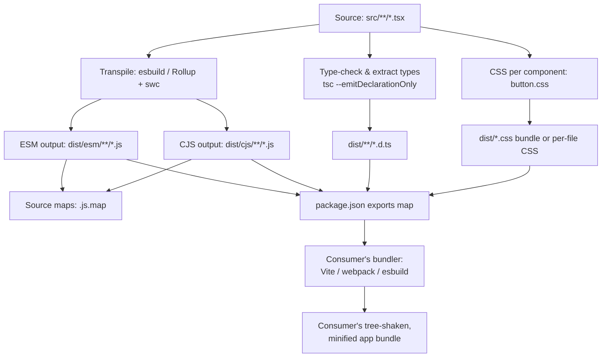

export const metadata = {
  title: "10. Packaging",
  description:
    "Rollup vs tsup vs Vite library mode vs Webpack, tree shaking and sideEffects, dual ESM/CJS packages, peer dependencies, package.json exports, and source maps.",
};

# 10. Packaging

## Definition

**Packaging** is the process of taking your design system's source code —
dozens or hundreds of TypeScript/TSX component files — and producing the
artifact that actually gets published to npm and consumed by other teams:
compiled JavaScript in one or more module formats, `.d.ts` type
declarations, source maps, and a `package.json` that correctly declares how
every one of those files is meant to be resolved, imported, and
tree-shaken by a consumer's own build tooling. It is the contract layer
between "code that works in this repo" and "code that works in *every*
repo that depends on it," and for a design system — which by definition is
consumed by many other applications with wildly different bundlers,
module systems, and React versions — getting this contract wrong breaks
things for everyone downstream at once.

## Problem Statement

Bundling an *application* and bundling a *library* solve almost opposite
problems, and treating them the same way is the single most common
packaging mistake teams make when they first ship a design system.

An application bundler's job is to produce the smallest possible set of
files to serve to a browser, for one specific app, with one specific set
of dependencies, running on one specific set of target browsers. It wants
to inline everything: your code, your dependencies, React itself if you
let it. Code splitting exists to defer *parts of the same app* to later
requests, not to keep the app's code separate from its libraries.

A library bundler's job is the opposite. Your output is not the final
artifact a browser will load — it is an *input* to someone else's
application bundler, which will run its own tree-shaking, its own code
splitting, its own minification, on top of whatever you ship. If you
bundle React into your library output, the consumer now ships two copies
of React. If you bundle your CSS-in-JS runtime, they can't dedupe it
against their own dependency graph. If you emit one giant `index.js` that
imports every component, their bundler cannot tree-shake unused
components out of *their* final bundle, even if they only `import
{ Button }`. Every one of these mistakes compounds: a design system is
imported by dozens of applications, so a packaging mistake made once is
paid for by every consumer, on every build, forever, until someone
notices bundle size ballooned and traces it back to your package.

The problems packaging must solve for a design system specifically are:
produce output that stays tree-shakable after it leaves your build and
enters a consumer's; never bundle a dependency the consumer is expected
to already have (React, React DOM, and often a peer UI primitive library
like Radix); support both the ESM-only modern toolchain and the
CJS-still-required Node/Jest/older-tooling world without shipping broken
duplicates of stateful modules like React context; and let consumers
import a single component without paying for the whole library, both at
the module-resolution level (`@org/ds/button`) and at the bundler level
(dead code elimination on what they *do* import from the barrel).

## Why Does This Exist?

Before ES Modules were a stable, universally supported target, there was
effectively one way to ship a library to npm: compile to CommonJS,
publish a single `main` entry, and let webpack or Browserify figure out
how to include it. This worked, but it meant every consumer bundle
included the *entire* library, because CJS's `require()` calls are
dynamic — a bundler cannot statically prove which parts of a
`module.exports` object are actually used without executing the module,
so it has to assume all of it might be. As component libraries grew (a
UI kit with 5 components vs. a design system with 150), this stopped
being a rounding error and started being a shipped-kilobytes problem:
apps using three components from a design system were paying the bundle
cost of all 150.

ESM's static `import`/`export` syntax gave bundlers something CJS never
could — an import graph they can analyze *without running any code* —
which is what made real tree shaking possible. That single technical
shift is why packaging as a discipline exists at all: once tree shaking
became possible, *how* you package your output started to directly
determine how much of it consumers actually pay for, and design systems,
being the most widely-imported, most components-per-package artifact in
most orgs, are exactly where that determination matters most. This is
also why packaging is inseparable from the tooling decisions in
[Chapter 9](/chapters/monorepo-architecture) — a monorepo publishing a
dozen packages needs every one of those packages packaged correctly, and
a mistake in a shared build config multiplies across all of them.

## Historical Context

In the CJS-only era (roughly pre-2018), Browserify and early webpack were
the default way to both build apps and, awkwardly, build libraries — you
just pointed the same bundler at your library's entry point and shipped
whatever came out, often literally the same bundled output an app would
produce, dependencies and all. This is why so many early React component
libraries had absurd install sizes: they bundled React itself, or lodash,
or moment.js, directly into the package.

Rollup arrived in 2015 specifically to solve the library case. Its author,
Rich Harris, built it while working on Ractive.js and needed something
that produced flat, ESM-native output rather than the runtime-heavy,
module-wrapped output webpack produced (webpack's output includes its own
module loader runtime to support things apps need — dynamic imports, HMR,
code splitting — that a library consumer's bundler will re-derive anyway).
Rollup's simpler, closer-to-source output became the de facto standard for
libraries: React itself, Vue, D3, and most of the npm ecosystem's
widely-used libraries are Rollup-built. This is also where the term
"tree shaking" was popularized — Rollup's docs used it to describe ESM
static analysis-based dead code elimination years before it was common
vocabulary.

Through the mid-2010s to today, the dual-package problem (needing to ship
both CJS for Node/Jest/older tooling and ESM for modern bundlers) became
unavoidable as the ecosystem migrated at different speeds — some
consumers were on Create React App and Jest (CJS-centric), others had
moved to Vite and native ESM. `package.json`'s `exports` field, stabilized
in Node 12/14 (2019-2020), finally gave packages a standard, enforceable
way to declare "here's the ESM build, here's the CJS build, resolve based
on how you're being imported" instead of the fragile `main`/`module`
dual-field convention that bundlers each interpreted slightly differently.

tsup, released in 2020 by Egoist, wraps esbuild (for fast transpilation)
and Rollup (for the parts esbuild can't do well, like certain
declaration-bundling and CJS/ESM dual output) behind a near-zero-config
CLI. It exploded in popularity through 2021-2023 specifically because
hand-rolling a correct Rollup config with a dozen plugins
(`@rollup/plugin-node-resolve`, `@rollup/plugin-commonjs`,
`rollup-plugin-dts`, `@rollup/plugin-typescript`, `rollup-plugin-esbuild`
or `@rollup/plugin-babel`...) had become its own maintenance burden, and
tsup encoded the "correct" configuration as sane defaults. Radix
Primitives, Zustand, and dozens of other now-widely-used libraries build
with tsup today.

Vite Library Mode (added in Vite 2.6, 2021) is Rollup under the hood —
Vite's production build has always used Rollup — exposed through Vite's
config surface (`build.lib`) so that teams already using Vite for
component development and Storybook don't need a second bundler
configuration just for the publish step.

## How It Works Internally

**Tree shaking**, mechanically: a bundler builds a module graph by
parsing every `import`/`export` statement statically — it does not
execute your code to figure out what's exported, it reads the syntax
tree. Because ESM imports and exports are declarative and can be
determined without execution (`import { Button } from './button'` names
exactly one binding, statically, at parse time), the bundler can build a
graph of *which exported bindings are actually referenced* from the
entry point(s) a consumer imports. Anything not reachable in that graph —
an unused named export, an unreferenced internal helper, an entire module
nobody imports from — is dead code, and gets eliminated before
minification even runs.

CommonJS cannot support this in general, because `require()` and
`module.exports` are just regular JavaScript values you can mutate at
runtime: `module.exports = condition ? a : b`, or
`Object.assign(module.exports, dynamicallyComputedObject)`, are both
valid CJS and both impossible to resolve without running the code. A
bundler encountering a CJS module has to assume, conservatively, that the
entire `module.exports` object might be used, because it cannot prove
otherwise through static analysis alone. This is the literal, mechanical
reason "tree shaking requires ESM" is true and not just folklore — it is
not that CJS is disallowed from being shaken, it's that dead code
elimination requires proving code is unreachable, and CJS's dynamic
semantics make that proof impossible in the general case.

**`sideEffects` in `package.json`** is the escape hatch bundlers need for
the one case ESM's static graph *can't* tell them: modules that do
something observable on import beyond exporting bindings — mutating a
global, registering a polyfill, or (the case that matters most for design
systems) an `import './button.css'` with no named imports at all. From
pure module-graph analysis, an unreferenced `import './button.css'` looks
identical to an unreferenced, safely-droppable module: nothing imports
anything *from* it. Without more information, a bundler doing aggressive
tree shaking would have to choose between two bad defaults — never drop
unreferenced imports (defeats side-effect-only modules like polyfills, so
this actually is the safe default and what happens with `sideEffects`
unset) or always drop them (breaks any CSS-import pattern). `sideEffects`
in `package.json` is your explicit declaration to the bundler about which
modules are safe to drop when unreferenced, and it's why declaring it
wrong — `"sideEffects": false` on a package that imports CSS
per-component — is a class of production bug specific to component
libraries. See the [Common Mistakes](#common-mistakes) section for the
exact failure mode.

**The dual package hazard**, mechanically: when a package ships both a
CJS and an ESM build, and a consumer's dependency graph ends up loading
*both* — say, one dependency imports your package via `require()` and
another imports it via `import` — Node and bundlers treat these as two
separate module instances. For a stateless utility library this is
merely wasteful. For a design system, it's a correctness bug, because
components rely on shared singletons: React context created in one
module instance is a *different* object identity than the same context
created in the other instance. A `<ThemeProvider>` mounted from the ESM
instance publishing into a context object, read by a `<Button>` resolved
from the CJS instance reading a *different* context object with the same
name, silently falls back to the context's default value — no error,
just wrong theming, and it only reproduces in specific bundler/consumer
combinations, which makes it miserable to debug. The fix isn't "don't
ship dual packages" (you need both formats for different consumers) — the
fix is `exports` conditions that guarantee a single resolved format per
consumer, covered below.

## Architecture

The build pipeline for a design system package takes one set of TSX
source files and fans out into every artifact a consumer might need:
CJS for Node/Jest, ESM for modern bundlers, `.d.ts` declarations for
TypeScript consumers, source maps for debugging, and CSS extracted
per-component so it can be tree-shaken alongside its component.



Every arrow into `exports` matters: it's the single lookup table a
consumer's module resolver uses to decide, for a given import specifier
and a given `condition` (`import`, `require`, `types`), which file on
disk to actually load. Get the map wrong and everything upstream of it —
however correct your ESM and CJS output individually are — resolves
incorrectly for some subset of consumers.

## Real-World Example

Radix Primitives, one of the most widely-adopted headless component
libraries (used as the behavioral layer under shadcn/ui and dozens of
in-house design systems), ships each primitive — `@radix-ui/react-dialog`,
`@radix-ui/react-dropdown-menu`, and so on — as its own tiny package
rather than one monolithic `@radix-ui/react` package with everything
inside it. This is a packaging decision, not just a monorepo convention:
by publishing granular packages, Radix guarantees that a consumer who
only needs `Dialog` never even resolves the module graph for `Tooltip`,
regardless of how good or bad any individual consumer's bundler
tree-shaking is. It's defense in depth against imperfect tree shaking
downstream — the same instinct that motivates subpath `exports` within a
single package (covered below), taken to its logical extreme of one
package per primitive. Radix builds with tsup, ships both ESM and CJS,
marks `react`/`react-dom` as peer dependencies, and — because it is a
*headless* library with effectively zero CSS of its own — sidesteps the
`sideEffects`/CSS tree-shaking hazard almost entirely, which is one of
several reasons headless libraries have an easier packaging story than
fully-styled ones like Chakra or Material UI, both of which have shipped
CSS-tree-shaking regressions in past major versions.

## Implementation Example

A realistic multi-entry design system package, built with tsup, with a
correct dual-format `exports` map, subpath exports per component, and
per-component CSS that survives tree shaking.

```jsonc
// package.json — the contract every consumer's resolver reads
{
  "name": "@acme/ds",
  "version": "4.2.0",
  "type": "module",
  // sideEffects: false says "no module in this package does anything
  // observable purely by being imported" — EXCEPT the CSS files, which
  // we explicitly carve out below. Getting this array wrong is the #1
  // cause of "styles missing in production, present in dev" bugs.
  "sideEffects": [
    "**/*.css",
    "./src/polyfills/*.ts"
  ],
  "files": ["dist"],
  "exports": {
    // The root entry — barrel import, `import { Button } from '@acme/ds'`
    ".": {
      "types": "./dist/index.d.ts",
      "import": "./dist/esm/index.js",
      "require": "./dist/cjs/index.cjs"
    },
    // Subpath export — `import { Button } from '@acme/ds/button'`.
    // This matters even with perfect bundler tree shaking, because it
    // lets consumers avoid resolving the barrel's module graph at all:
    // no risk of an accidental circular import or a bundler that only
    // partially tree-shakes barrel files pulling in the whole library.
    "./button": {
      "types": "./dist/button/index.d.ts",
      "import": "./dist/esm/button/index.js",
      "require": "./dist/cjs/button/index.cjs"
    },
    "./dialog": {
      "types": "./dist/dialog/index.d.ts",
      "import": "./dist/esm/dialog/index.js",
      "require": "./dist/cjs/dialog/index.cjs"
    },
    // Explicit CSS subpath exports. Some teams auto-inject CSS via JS
    // (CSS-in-JS, or a bundler CSS plugin the component imports), others
    // require consumers to import styles explicitly. Explicit imports
    // are more portable across bundlers and easier to audit for
    // tree-shaking correctness, at the cost of consumers having to
    // remember to add the import.
    "./button/style.css": "./dist/button/style.css",
    "./dialog/style.css": "./dist/dialog/style.css",
    // package.json itself must be exposed for tools (ESLint resolvers,
    // some bundlers) that read it directly.
    "./package.json": "./package.json"
  },
  // main/module/types are the pre-`exports` fallback for older
  // resolvers that don't understand the exports map yet. Keep them in
  // sync with the "." entry — some tooling still reads these directly.
  "main": "./dist/cjs/index.cjs",
  "module": "./dist/esm/index.js",
  "types": "./dist/index.d.ts",
  "peerDependencies": {
    "react": "^18.0.0 || ^19.0.0",
    "react-dom": "^18.0.0 || ^19.0.0"
  },
  "peerDependenciesMeta": {
    // react-dom is optional if a future RN/other-renderer build exists;
    // most web-only design systems omit this and require both.
    "react-dom": { "optional": false }
  },
  "devDependencies": {
    "react": "^18.3.0",
    "react-dom": "^18.3.0",
    "tsup": "^8.0.0",
    "typescript": "^5.5.0"
  },
  "scripts": {
    "build": "tsup",
    "prepublishOnly": "npm run build"
  }
}
```

The tsup config that produces this layout — note the explicit per-entry
map (not a single barrel entry), which is what gives you real subpath
`dist/<component>/index.js` files rather than one bundle you'd have to
manually split:

```ts
// tsup.config.ts
import { defineConfig } from "tsup";
import { glob } from "glob";

// Discover one entry per top-level component directory so each gets its
// own dist output — this is what makes `@acme/ds/button` resolve to a
// small, independent file instead of a slice of one big bundle.
const entries = glob.sync("src/*/index.ts");

export default defineConfig([
  {
    entry: { index: "src/index.ts", ...toEntryMap(entries) },
    format: ["esm"],
    outDir: "dist/esm",
    dts: true,
    sourcemap: true,
    // Never inline the consumer's own React — this is the packaging-
    // level enforcement of "peer deps aren't bundled."
    external: ["react", "react-dom"],
    // esbuild's own tree-shaking pass on our OWN internal dead code,
    // independent of whatever the consumer's bundler will later do.
    treeshake: true,
    splitting: false,
    clean: true,
  },
  {
    entry: { index: "src/index.ts", ...toEntryMap(entries) },
    format: ["cjs"],
    outDir: "dist/cjs",
    outExtension: () => ({ js: ".cjs" }),
    dts: false, // types only need emitting once, from the ESM pass
    sourcemap: true,
    external: ["react", "react-dom"],
  },
]);

function toEntryMap(paths: string[]) {
  return Object.fromEntries(
    paths.map((p) => {
      const name = p.split("/")[1]; // src/button/index.ts -> "button"
      return [name, p];
    }),
  );
}
```

And the equivalent hand-rolled Rollup config, useful to understand what
tsup is doing for you under the hood, and still the right choice when you
need a plugin tsup doesn't expose (custom SVG-to-component transforms,
non-standard CSS extraction):

```ts
// rollup.config.mjs
import resolve from "@rollup/plugin-node-resolve";
import commonjs from "@rollup/plugin-commonjs";
import esbuild from "rollup-plugin-esbuild";
import dts from "rollup-plugin-dts";
import postcss from "rollup-plugin-postcss";

const external = ["react", "react-dom", "react/jsx-runtime"];

export default [
  {
    input: "src/index.ts",
    external,
    output: [
      { file: "dist/esm/index.js", format: "esm", sourcemap: true },
      { file: "dist/cjs/index.cjs", format: "cjs", sourcemap: true },
    ],
    plugins: [
      resolve(),
      commonjs(),
      esbuild({ target: "es2020" }),
      // extract: true writes button.css alongside button's JS instead of
      // inlining a <style> injector at runtime — required for the
      // sideEffects/CSS-import pattern to work at all.
      postcss({ extract: true, modules: true }),
    ],
  },
  {
    // A second, types-only pass — Rollup itself doesn't type-check or
    // emit .d.ts; rollup-plugin-dts bundles the .d.ts files tsc already
    // emitted into one flat declaration file per entry.
    input: "src/index.ts",
    output: { file: "dist/index.d.ts", format: "es" },
    plugins: [dts()],
  },
];
```

## Advantages

A correctly packaged design system compounds benefits across every
consuming team simultaneously: a 2 KB improvement in tree-shaken Button
output is 2 KB saved *per app* that imports it, not once. Subpath and
`exports`-map correctness means consumers pay only for what they import,
which keeps the "just add the design system" decision cheap for app
teams evaluating bundle budgets — a real adoption blocker if it goes the
other way (see [Chapter 11](/chapters/governance) on adoption strategy).
Correct dual ESM/CJS output means the same package works whether a
consumer is on a bleeding-edge Vite app or a legacy CRA/Jest setup,
without maintaining two separate published packages. Correct peer
dependency declarations catch version-mismatch bugs (duplicate React
instances) at `npm install` time with a clear warning, instead of at
runtime with a cryptic "Invalid hook call" a consuming team then has to
debug and file against your package. And source maps that resolve to
your actual TSX source, not minified output, mean consuming teams can
step into design system code in their own devtools when a component
misbehaves — a meaningfully lower support burden than "file a bug and
wait."

## Disadvantages

None of this is free. A correct multi-entry, dual-format, sourcemap'd,
per-component-CSS build pipeline is genuinely more config than "point
webpack at an entry file," and every additional entry point or output
format is another thing that can silently drift out of sync — an
`exports` map that isn't kept in sync with actual `dist/` output after a
refactor is a real, recurring maintenance cost. Build time scales with
the number of formats and entries you produce; a design system building
ESM + CJS + types + per-component CSS across 150 components takes
meaningfully longer to build and publish than a single-bundle app. Tree
shaking and `sideEffects` correctness have to be verified continuously
(a new component added without a matching CSS `sideEffects` entry
silently regresses), which means packaging needs its own tests (see
[Performance Considerations](#performance-considerations)), not just a
build script you write once. And subpath exports, while good for
tree-shaking robustness, mean consumers write more granular import
statements (`from "@acme/ds/button"` per component instead of one barrel
import), which some teams find worse DX even when it's better for bundle
size — a real tradeoff to negotiate with consumers, not a strictly
dominant choice.

## Alternatives

The build-tool decision — what actually produces your `dist/` output —
is the first packaging decision a design system team makes, and it
determines how much of everything above you get by default versus by
hand-configuring.

| Dimension | Rollup | tsup | Vite Library Mode | Webpack |
| --- | --- | --- | --- | --- |
| What problem it solves | Flat, ESM-native library bundling with fine-grained plugin control | Zero-config wrapper around esbuild (speed) + Rollup (correctness) for the common library-build shape | Reuses Vite's existing Rollup-based prod build for teams already on Vite for dev | General-purpose module bundling; optimized for apps, not libraries |
| Why it was created | Needed simpler, non-runtime-wrapped output than webpack for shipping libraries (2015) | Hand-rolled Rollup configs for libraries had become their own maintenance burden (2020) | Avoid a second bundler config when Vite already builds the dev/Storybook environment | Needed a bundler that could handle code splitting, HMR, and complex app graphs (2012) |
| Performance (build speed) | Moderate — JS-based transforms unless esbuild/swc plugin used | Fast — esbuild does the heavy transpile work | Fast — Rollup + esbuild-based dep pre-bundling | Slower for library-shaped builds; its strengths (code splitting, HMR) are irrelevant here |
| Developer experience | Requires assembling plugins yourself (resolve, commonjs, dts, postcss) | Near-zero config; sane defaults for dual ESM/CJS + dts out of the box | Great if already using Vite; `build.lib` is a small config addition | High config burden to get flat, non-runtime-wrapped output; fighting the tool's defaults |
| Learning curve | Moderate — plugin ecosystem to learn | Low — few options, most are automatic | Low if already Vite-literate | High — webpack's config surface is large and app-oriented |
| Community / ecosystem | Very large; the long-standing library-bundling default, huge plugin ecosystem | Large and fast-growing; used by Radix, Zustand, many modern libraries | Large (inherits Vite's), but `build.lib` usage specifically is smaller | Largest overall, but shrinking specifically for library use cases |
| Maintenance burden | Higher — plugin versions, config drift over time | Low — config is small, defaults track ecosystem best practice | Low if you're already maintaining a Vite config anyway | High — webpack library configs need ongoing tuning as webpack evolves |
| Enterprise suitability | High — proven at scale (React, Vue, most of npm) | High and rising — proven in production by Radix, many DS teams | High for Vite-native orgs | Lower specifically for library output; still fine for the app side |
| When to choose it | Need a plugin tsup doesn't expose, or want full control over output shape | Default choice for a new design system package — least config for the correct shape | Already building/dev-serving with Vite and don't want a second tool | Building the *app* consuming the design system, not the design system itself |
| When NOT to choose it | Don't reach for it if tsup's defaults already produce what you need | If you need a highly custom multi-pass pipeline tsup doesn't support | If you're not otherwise a Vite shop — adds a dependency for no other benefit | Almost never for library *output* specifically — reserve it for apps |

In practice, most design systems today start with **tsup** and only drop
to hand-rolled **Rollup** when they hit a specific limitation — usually a
plugin tsup doesn't expose, like a custom SVG-to-React-component
transform, or a non-standard multi-pass CSS extraction step. Radix
Primitives, Zustand, and a large share of newer, widely-adopted component
libraries build with tsup specifically because it encodes the "produce
correct dual ESM/CJS + subpath + dts output" recipe as defaults instead
of requiring every team to rediscover it. Teams already standardized on
Vite for component development and Storybook (increasingly common since
Storybook 7+'s Vite builder) often reach for **Vite Library Mode**
instead, purely to avoid maintaining a second bundler configuration for
what is, under the hood, the same Rollup engine either way — this is a
tooling-consolidation choice, not a technical one. **Webpack** is
essentially never the choice for the *library build itself* at companies
shipping design systems today (Material UI, Spectrum, Polaris, Carbon
all ship Rollup or Rollup-adjacent output) — its strengths (code
splitting for lazy-loaded app routes, HMR, complex multi-app graphs) are
either irrelevant to a library build or actively counterproductive
(webpack's module-wrapper runtime adds bytes and structure a consumer's
own bundler then has to unwrap again). Webpack remains extremely common
on the *consumer* side — most enterprise apps still build with it — which
is exactly why library output needs to stay flat and unopinionated: it
has to re-bundle cleanly inside whatever the consumer chose, webpack
included.

## Tradeoffs

Every packaging decision trades build-time complexity against
consumer-time correctness. Producing dual ESM/CJS output roughly doubles
build steps and requires an `exports` map disciplined enough to avoid the
dual package hazard — but skipping CJS output means every Jest-based
consumer (still the majority of enterprise test setups as of this
writing) needs `transformIgnorePatterns` workarounds or fails outright.
Producing per-component subpath exports and per-component CSS files adds
publish-time file count and `exports`-map surface area — but a single
barrel bundle means a consumer's tree shaking is your library's *only*
line of defense against shipping unused components, and that defense is
imperfect in practice across the diversity of bundler configs real
consumers run. Marking React as a peer dependency (correct) means your
package literally cannot be `npm install`ed and used standalone without
the consumer also having React installed — this is by design, but it's
friction a truly zero-dependency component (say, a date formatting
utility with no React dependency) doesn't need to accept. Shipping source
maps that point at your original TSX increases published package size
(maps for every file, plus - if you choose - the source files themselves
via `sourcesContent`) in exchange for debuggability; some teams strip
`sourcesContent` from published maps specifically to keep publish size
down while keeping line-mapping intact, accepting that consumers see
your code structure but not literally your source text.

## Performance Considerations

Packaging choices show up as real, measurable numbers in a consumer's
bundle analyzer, and a design system team should be treating those
numbers as a first-class metric, not an afterthought. The two numbers
that matter: **install size** (what `npm install`s, dominated by whether
you accidentally bundled a dependency that should have been a peer) and
**tree-shaken import cost** (what actually survives into a consumer's
final bundle when they `import { Button }`). A regression in the second
number is invisible in your own repo's build — your tests still pass,
your own bundle looks fine — and only shows up in a consumer's bundle
analyzer, which is why design systems with mature packaging pipelines run
automated **bundle size budgets per exported entry point** in CI: a check
that imports each top-level export in isolation, runs it through a
representative bundler config, and fails the build if the tree-shaken
size for, say, `Button` exceeds a committed budget (see
[Chapter 13](/chapters/performance) for the general bundle-budget
pattern). This catches the specific, easy-to-introduce regression of a
component accidentally importing from a barrel file internally (`import
{ Icon } from '../index'` instead of `from '../icon'`), which silently
pulls the *entire* library into what should have been a 2 KB import,
because your own internal Icon reference now roots the whole module
graph.

## Scalability Considerations

As a design system grows past a few dozen components, the packaging
approach that worked at 10 components starts to strain in specific,
predictable ways. Build time is the first: type-checking and bundling
150+ components in both ESM and CJS, with per-component dts generation,
can push a full build from seconds to minutes — the standard mitigation
is incremental builds keyed to which files actually changed (handled by
your monorepo's task runner, see [Chapter 9](/chapters/monorepo-architecture)
on Turborepo/Nx remote caching, not by the bundler itself). The
`exports` map itself becomes a maintenance liability at scale — a 150-line
hand-maintained JSON object drifts from actual `dist/` output the moment
someone adds a component and forgets to add its subpath entry, so mature
design systems generate the `exports` map from the actual `src/*/index.ts`
directory listing as a build step, rather than hand-authoring it (the
`toEntryMap` pattern in the [Implementation Example](#implementation-example)
above is the seed of this). Publishing itself needs to scale too: a
monorepo publishing many small, focused packages (the Radix approach)
means a release touches N packages, which is exactly the problem
Changesets (covered in [Chapter 9](/chapters/monorepo-architecture)) is
built to batch and version-bump coherently, rather than a human tracking
version numbers across 40 packages by hand.

## Common Mistakes

<Callout type="danger" title="sideEffects: false with per-component CSS imports">
  This is the single most common, most painful packaging bug in styled
  component libraries. If a `Button` component does
  `import './button.css'` for its styles, and the package's
  `package.json` declares `"sideEffects": false` (often copy-pasted from
  a boilerplate without auditing what it actually claims), a consumer's
  production build will tree-shake the CSS import away entirely — the
  bundler was told, explicitly, that nothing in this package has
  side effects, so an unreferenced-by-name import like a bare
  `import './button.css'` is exactly the kind of "safe to drop" code the
  flag exists to permit. The result: `Button` renders completely
  unstyled in the consumer's production build, but looks perfectly fine
  in the design system's own dev environment (which never went through
  this tree-shaking path) and often in the consumer's *dev* build too
  (many dev servers don't run the same aggressive tree-shaking pass as
  production). It ships, passes review, passes the consumer's own visual
  QA against a dev build, and only breaks in production — usually
  discovered by an end user, not a test. The fix is either
  `"sideEffects": ["**/*.css"]` (or an explicit per-file list) so the
  bundler knows CSS imports must be preserved, or eliminating CSS-import
  side effects entirely by using a CSS-in-JS/zero-runtime approach that
  ties styles to the component's own JS export graph (see
  [Chapter 6](/chapters/styling-architecture)).
</Callout>

<Callout type="danger" title="React as a regular dependency instead of a peer dependency">
  Declaring `"react": "^18.0.0"` under `dependencies` instead of
  `peerDependencies` means npm/yarn/pnpm are free to install a *second*
  copy of React nested inside `node_modules/@acme/ds/node_modules/react`
  whenever version ranges don't perfectly align across the consumer's
  dependency tree. Two React instances in one page means two separate
  module-level singletons — two different internal dispatcher/hook
  states — and a component from one instance calling a hook while
  rendered under the other instance's tree is exactly the "Invalid hook
  call" error class, notoriously hard to debug because the error message
  doesn't say "you have two Reacts," it just says hooks were called
  incorrectly. `peerDependencies` instead tells the package manager
  "the consumer must supply this, don't install your own copy," which
  forces the version conflict to surface as an explicit, readable
  install-time warning instead of a runtime crash three layers deep.
</Callout>

<Callout type="danger" title="Barrel-file internal imports defeating tree shaking">
  Even with subpath exports correctly configured, a component that
  internally imports from the package's own barrel file — `import { Icon }
  from '../../index'` instead of `from '../../icon'` — roots the entire
  module graph through `index.ts` the moment *any* consumer imports
  *any* subpath. A consumer doing `import { Button } from '@acme/ds/button'`
  expecting a minimal, isolated import will instead pull in every module
  the barrel re-exports, because your own `Button` implementation
  referenced the barrel internally. This is invisible in your own repo's
  tests and often invisible in casual bundle inspection — it only shows
  up as an unexpectedly large tree-shaken size for what should have been
  a tiny import, which is exactly what a per-entry-point bundle-budget CI
  check (see [Performance Considerations](#performance-considerations))
  is designed to catch.
</Callout>

<Callout type="danger" title="Publishing minified output with no source maps, or source maps that don't resolve">
  Shipping only minified `dist` output with no `.js.map` files (or maps
  present but not referenced via `//# sourceMappingURL=` comments, or
  referencing paths that don't exist in the published npm tarball because
  `.npmignore`/`files` excluded them) forces consumers debugging into
  your components to step through single-letter-variable minified code
  in devtools instead of your actual TSX source. The common
  misconfiguration is generating maps correctly in the build but then
  excluding `*.map` files from the published package via an overly broad
  `.npmignore`, or setting `"files": ["dist/**/*.js"]` in `package.json`
  without also including `dist/**/*.js.map` and `dist/**/*.d.ts.map` —
  the build artifact exists locally and in CI, it just never makes it
  into the tarball `npm publish` actually uploads.
</Callout>

## Best Practices

- Default to **tsup** for a new design system package; only reach for
  hand-rolled Rollup when a specific plugin need forces it.
- Always mark `react` and `react-dom` as `peerDependencies` with a
  version range wide enough to cover the versions you actually test
  against (e.g. `^18.0.0 || ^19.0.0`), never `dependencies`.
- Ship both ESM and CJS via `package.json` `exports` conditions —
  never rely on the legacy `main`/`module` dual-field convention alone,
  since not all tooling resolves `module` consistently.
- Add subpath exports per top-level component
  (`@acme/ds/button`) in addition to the barrel export — never rely
  solely on the barrel plus tree shaking; treat subpaths as your defense
  in depth.
- Audit `sideEffects` every time a new CSS-import pattern is added; treat
  it as a reviewed, deliberate array, never a copy-pasted `false`.
- Generate the `exports` map from your actual `src/` directory structure
  as a build step once you pass roughly 20-30 components — hand-
  maintained maps drift.
- Run a per-entry-point bundle-size check in CI that fails on regression,
  not just a whole-package size check.
- Verify published source maps resolve correctly by actually installing
  the tarball (`npm pack` + install into a scratch app) before every
  release, not just trusting the local `dist/` output.
- Never internally import from your own barrel file inside component
  implementations — always import directly from the sibling module.

## Interview Questions

<InterviewQuestion q="Why does tree shaking require ESM and not CommonJS?">
  **What the interviewer is testing:** Whether you understand the actual
  mechanism behind tree shaking, not just that "ESM is better for it."

  **Poor answer:** "ESM is more modern so it supports tree shaking."

  **Good answer:** ESM imports/exports are static and can be analyzed
  without executing code, so a bundler can build a reachability graph and
  drop unreferenced exports. CJS's `require`/`module.exports` are just
  runtime JavaScript values, which can be conditionally assigned, so a
  bundler can't prove what's unused without running the code.

  **Excellent senior answer:** All of the above, plus a concrete example
  of why CJS is fundamentally unanalyzable (`module.exports = cond ? a :
  b`), and ties it to `sideEffects` as the specific escape hatch for
  import-order-dependent side effects (CSS imports, polyfills) that pure
  static analysis alone can't safely resolve either way.

  **Common mistakes:** Saying "ESM is faster" without explaining the
  mechanism; not knowing what `sideEffects` does or why it exists as a
  separate signal from the module format itself.
</InterviewQuestion>

<InterviewQuestion q="Walk me through why React must be a peer dependency in a component library, and what breaks if it isn't.">
  **What the interviewer is testing:** Real production debugging
  experience with the "Invalid hook call" bug class, not textbook
  knowledge of what peerDependencies means.

  **Poor answer:** "It's best practice to use peer deps for React."

  **Good answer:** If React is a regular dependency, npm can install a
  nested second copy under the library's own `node_modules`, giving the
  page two separate React module instances with separate internal
  states, which breaks hooks called across the boundary.

  **Excellent senior answer:** Explains the specific failure — two
  dispatcher instances means a component from one React copy calling
  hooks while a *different* React copy owns the current render — and
  notes this is exactly why "Invalid hook call" errors are notoriously
  hard to trace back to a duplicate-React root cause, since the error
  message gives no indication of it. Also mentions `peerDependenciesMeta`
  for optional peers as a related, more advanced tool.

  **Common mistakes:** Vaguely gesturing at "version conflicts" without
  explaining the actual runtime mechanism (singleton dispatcher state) or
  being able to describe what the resulting bug looks like in practice.
</InterviewQuestion>

<InterviewQuestion q="A component library ships fine in dev but its styles disappear in the consumer's production build. How do you debug this, and what's the likely root cause?">
  **What the interviewer is testing:** Whether you've actually hit and
  fixed this exact production incident, or can reason to it from first
  principles if you haven't.

  **Poor answer:** "Maybe a CSS purge tool removed the classes."

  **Good answer:** Suspects `sideEffects` misconfiguration — if the
  package declares `"sideEffects": false` while a component does a bare
  `import './x.css'`, production tree shaking will drop the CSS import as
  dead code since it looks, from static analysis, like an unreferenced
  module.

  **Excellent senior answer:** Explains *why* dev doesn't reproduce it
  (dev builds typically skip the aggressive tree-shaking pass that
  triggers this), gives the concrete fix (`"sideEffects": ["**/*.css"]`),
  and mentions the alternative architectural fix of avoiding bare
  CSS-import side effects entirely via a styling approach that ties CSS
  to the component's JS export graph.

  **Common mistakes:** Jumping straight to "clear the cache" or CDN-layer
  explanations without considering the build-time tree-shaking
  possibility, which is the actual common cause.
</InterviewQuestion>

<InterviewQuestion q="What is the dual package hazard, and how does the package.json exports field solve it?">
  **What the interviewer is testing:** Depth on module resolution beyond
  "we ship both formats for compatibility."

  **Poor answer:** "Some tools need CJS and some need ESM, so we ship
  both."

  **Good answer:** If both an ESM and CJS build of the same package end
  up loaded simultaneously in one consumer's dependency graph, they're
  treated as two separate module instances — a correctness problem for
  anything relying on shared singleton state, like React context.

  **Excellent senior answer:** Gives the concrete design-system failure
  mode (a `ThemeProvider` in one instance publishing to a context object
  a consumer component from the *other* instance doesn't share, silently
  falling back to default theme with no error), and explains that
  `exports` conditions (`import`/`require`) guarantee Node/bundlers
  resolve a single, consistent format per consumer rather than mixing
  both — which is the actual mechanism that prevents the hazard, not just
  "having both formats available."

  **Common mistakes:** Confusing the dual package hazard with simply
  "not supporting both formats," or not being able to name a concrete
  failure mode beyond "it might cause bugs."
</InterviewQuestion>

<InterviewQuestion q="Why would a design system choose subpath exports (@acme/ds/button) over relying solely on tree shaking from a single barrel import?">
  **What the interviewer is testing:** Understanding that tree shaking is
  a best-effort optimization performed by the *consumer's* tooling, not a
  guarantee the library author controls.

  **Poor answer:** "Subpaths are faster to import."

  **Good answer:** Not every consumer's bundler configuration performs
  perfect tree shaking (older webpack configs, certain minification
  settings, or accidental barrel-internal imports can all defeat it), so
  subpath exports give consumers a way to avoid resolving the barrel's
  module graph at all.

  **Excellent senior answer:** All of the above, plus names the specific
  library-side bug that defeats barrel-based tree shaking even in a
  well-configured consumer bundler — a component internally importing
  from its own package's barrel file, which roots the whole graph — and
  frames subpath exports as defense in depth against that class of
  mistake, citing Radix's one-package-per-primitive approach as the same
  instinct taken further.

  **Common mistakes:** Treating this as purely a DX question (fewer
  characters to type) without connecting it to bundle-size correctness.
</InterviewQuestion>

<InterviewQuestion q="When would you choose Vite Library Mode over tsup, given both ultimately use Rollup for the production build?">
  **What the interviewer is testing:** Whether the candidate understands
  these tools aren't competing on fundamentally different technology, so
  the decision is about the team's existing toolchain, not raw
  capability.

  **Poor answer:** "Vite is newer so it's better."

  **Good answer:** If the team already uses Vite for component
  development or Storybook's Vite builder, Library Mode avoids
  maintaining a second bundler configuration, since it reuses the same
  Rollup-based production pipeline.

  **Excellent senior answer:** Notes both are effectively Rollup under
  the hood, so the choice is about config surface and tooling
  consolidation, not output quality — tsup wins on zero-config dual
  ESM/CJS + dts defaults out of the box; Vite Library Mode wins when you
  want one tool for dev server, Storybook, and publish build instead of
  three separate configs to keep in sync.

  **Common mistakes:** Describing them as fundamentally different
  bundlers rather than recognizing the shared Rollup foundation, or
  picking one dogmatically without connecting it to the team's actual
  existing toolchain.
</InterviewQuestion>

## Manager-Level Questions

<ManagerQuestion q="A consuming team files a P1 bug: your design system update doubled their app's bundle size overnight. How do you handle this — technically and with the team?">
  **What the interviewer is testing:** Incident response process for a
  packaging regression that affects many consumers at once, and how you
  communicate under pressure with a team that's blocked.

  **Poor answer:** "I'd look into it and get back to them."

  **Good answer:** Immediately checks whether a `sideEffects` or
  `exports`-map change shipped in the release, reproduces with the
  specific consumer's bundler config, and ships a patch release reverting
  or fixing the regression while keeping the consuming team updated.

  **Excellent senior answer:** Adds the systemic fix, not just the patch:
  proposes per-entry-point bundle-size CI checks so this class of
  regression is caught before publish, not after a consumer reports it;
  communicates a clear timeline and workaround (pin to previous version)
  immediately rather than after diagnosis completes; and treats it as a
  postmortem-worthy incident given a design system regression multiplies
  across every consumer.

  **Common mistakes:** Framing it as a one-off bug fix without addressing
  why the packaging pipeline let it ship, or not communicating proactively
  with the blocked team while investigating.
</ManagerQuestion>

<ManagerQuestion q="Your team wants to move from a single barrel export to per-component subpath exports, which is a breaking change for every consumer's import statements. How do you plan and sequence that rollout across the org?">
  **What the interviewer is testing:** Cross-team migration planning for
  a packaging-level breaking change, connecting to governance/versioning
  practice.

  **Poor answer:** "We'd bump the major version and tell everyone to
  update their imports."

  **Good answer:** Ships subpath exports *additively* alongside the
  existing barrel first (non-breaking), gives consumers a deprecation
  window on the barrel, and provides a codemod to auto-rewrite imports.

  **Excellent senior answer:** Frames it as a governance process, not
  just a technical rollout — references an RFC before implementation,
  ties the deprecation window to actual adoption telemetry (percentage of
  consumers still on barrel imports) rather than a fixed calendar date,
  and only removes the old barrel path in a major version once telemetry
  shows adoption is high enough that the remaining migration cost is
  acceptable.

  **Common mistakes:** Treating it as a purely technical change without
  considering the dozens of consuming teams' migration cost, or not
  having a measurement mechanism to know when it's safe to remove the
  old path.
</ManagerQuestion>

<ManagerQuestion q="How would you decide whether it's worth the engineering investment to split the design system into many small packages (Radix-style, one per component) versus one package with subpath exports?">
  **What the interviewer is testing:** Cost-benefit reasoning about
  packaging architecture at an organizational level, not just technical
  preference.

  **Poor answer:** "Many small packages is more modern, so we should do
  that."

  **Good answer:** Weighs the marginal tree-shaking robustness of
  separate packages against the real cost — more `package.json`s to
  version and publish, more cross-package dependency management for
  composite components, more npm install overhead for consumers.

  **Excellent senior answer:** Frames it as most valuable when consumers
  have historically hit tree-shaking failures that subpath exports alone
  didn't fully solve (e.g. due to their own bundler configs), and notes
  the monorepo tooling cost (Changesets versioning many packages
  coherently, described in Chapter 9) that has to be in place *before*
  this split is worth doing — otherwise it multiplies release-process
  overhead without a corresponding consumer benefit.

  **Common mistakes:** Deciding purely on "what big-name libraries do"
  without evaluating whether the org's actual consumer bundler diversity
  justifies the extra packaging and release overhead.
</ManagerQuestion>

## Summary

Packaging is where a design system's source code becomes a contract with
every application that depends on it, and the priorities are the inverse
of app bundling: preserve tree-shakability rather than inline everything,
never bundle what should be a peer dependency, and produce output flat
enough to be re-bundled cleanly by whatever tool the consumer chose.
Tree shaking works because ESM's static import/export syntax lets a
bundler build a reachability graph without executing code — CJS's dynamic
`require`/`module.exports` semantics make that proof impossible in
general, which is the actual mechanical reason ESM is required for it.
`sideEffects` exists as the necessary escape hatch for the one case
static analysis alone can't resolve — CSS-import side effects — and
getting it wrong is the single most common production incident in styled
component libraries: styles vanish in production tree-shaking passes
while looking fine in dev. Dual ESM/CJS output is still required because
the ecosystem hasn't fully migrated to ESM-only tooling, and the
`package.json` `exports` field with `import`/`require` conditions is what
prevents the resulting dual package hazard from breaking singleton-
dependent modules like React context across the two builds. React and
React DOM must be peer, not regular, dependencies to prevent duplicate
React instances and the "Invalid hook call" bug class. tsup has become
the default build tool for new design system packages because it encodes
this entire correct recipe as defaults; Rollup remains the tool underneath
both tsup and Vite Library Mode, and is still the right direct choice
when a specific plugin need exceeds what tsup exposes; webpack is
essentially never chosen for the library build itself, even though it
remains extremely common on the consuming application side.

**Key takeaways**

- Tree shaking requires ESM's static, execution-free analyzability — CJS
  can't support it because its exports are runtime-mutable values.
- `sideEffects` is the escape hatch for import-order-dependent code (CSS,
  polyfills); declaring it wrong (`false` with CSS imports present) is
  the most common styled-component-library production bug.
- React/React DOM must be `peerDependencies`, never `dependencies`, to
  prevent duplicate React instances and "Invalid hook call" bugs.
- The `exports` field's `import`/`require` conditions are what actually
  prevent the dual package hazard, not merely shipping both formats.
- Subpath exports (`@acme/ds/button`) are defense in depth against
  imperfect consumer-side tree shaking, not just a DX nicety.
- tsup is the default build tool for new design system packages; Rollup
  and Vite Library Mode remain the right choice for specific plugin
  needs or existing Vite toolchains, respectively — webpack is rarely
  chosen for library output itself.

Packaging decisions interact directly with how the source lives and gets
published in the first place — see
[Monorepo Architecture](/chapters/monorepo-architecture) for how
Changesets, workspaces, and CI/CD tie into everything covered here.
