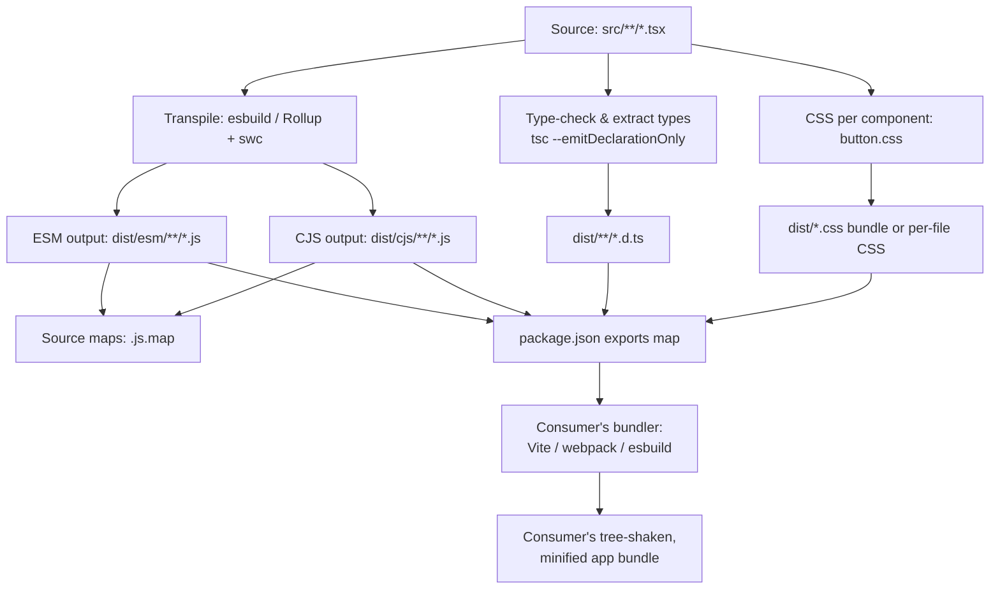

export const metadata = {
  title: "10. Packaging",
  description:
    "Rollup vs tsup vs Vite library mode vs Webpack, tree shaking and sideEffects, dual ESM/CJS packages, peer dependencies, package.json exports, and source maps.",
};

# 10. Packaging

## Quick Glance

- Packaging turns your design system's source code into what actually ships to npm: JS builds, type files, source maps, and a `package.json` that tells other tools how to use it.
- Tree shaking (removing unused code) needs ESM (`import`/`export` syntax) because a bundler can read it without running it — CommonJS (`require`) can't be read that way, so unused code can't be safely dropped.
- `sideEffects` in `package.json` tells a bundler which files are safe to drop if nothing imports from them — get it wrong and CSS imports vanish in production.
- Always mark `react` and `react-dom` as peer dependencies, never regular dependencies — otherwise a duplicate React copy can cause "Invalid hook call" errors.
- The dual package hazard: shipping both ESM and CJS builds can load two separate copies of your library at once, breaking shared state like React context — the `exports` field in `package.json` fixes this.
- Subpath exports (`@acme/ds/button`) let consumers skip the barrel file entirely, as backup protection against imperfect tree shaking in their bundler.
- tsup (wraps esbuild + Rollup) is the default build tool for new design system packages today; hand-rolled Rollup is for cases tsup can't cover; webpack is almost never used to build the library itself.
- If asked for the most common packaging bug: `sideEffects: false` plus a CSS import (`import './button.css'`) makes styles disappear in production only.
- Radix Primitives ships one tiny npm package per component instead of one big package, as extra insurance against imperfect tree shaking.
- Run a bundle-size check per exported entry point in CI so a regression is caught before publish, not after a consumer complains.

## Definition

**Packaging** is the process of turning your design system's source code
— often dozens or hundreds of TypeScript/TSX component files — into the
thing you actually publish to npm and that other teams install. The
output includes compiled JavaScript (in one or more module formats),
`.d.ts` type declaration files, source maps, and a `package.json` file.
The `package.json` tells a consumer's build tool how to find, import, and
tree-shake (remove code nobody actually uses) every file in your package.

Think of packaging as a contract. "Code that works in this repo" is not
the same thing as "code that works in every repo that depends on it." A
design system is used by many different apps, each with its own bundler,
module system, and React version. Get this contract wrong and you break
things for every one of those apps at once.

## Problem Statement

Bundling an *application* and bundling a *library* solve almost opposite
problems. Treating them the same way is the most common packaging
mistake teams make when they first ship a design system.

An application bundler has one job: produce the smallest set of files for
one specific app to send to a browser. That app has its own dependencies
and its own target browsers. The bundler wants to inline everything —
your code, your dependencies, even React itself if you let it. Code
splitting exists to delay loading *parts of that same app* until later,
not to keep the app's code separate from its libraries.

A library bundler's job is the opposite. Your output isn't the final
thing a browser loads — it's an *input* to someone else's application
bundler, which will run its own tree-shaking, code splitting, and
minification on top of whatever you ship. A few concrete failure
examples:

- Bundle React into your library, and the consumer now ships two copies
  of React.
- Bundle your CSS-in-JS runtime, and the consumer can't merge it with
  their own dependencies.
- Emit one giant `index.js` that imports every component, and the
  consumer's bundler can't remove unused components — even if they only
  wrote `import { Button }`.

These mistakes compound. A design system gets imported by dozens of
apps, so one packaging mistake gets paid for by every one of those apps,
on every build, forever — until someone notices their bundle got bigger
and traces it back to your package.

For a design system, packaging has to solve four problems:

- Keep the output tree-shakable after it leaves your build and enters a
  consumer's build.
- Never bundle a dependency the consumer already has — React, React DOM,
  and often a peer library like Radix.
- Support both the modern ESM (ECMAScript Modules — the `import`/`export`
  syntax) toolchain and the older CJS (CommonJS — the `require()`/
  `module.exports` syntax, still needed by Node, Jest, and some legacy
  tooling), without shipping broken duplicates of stateful modules like
  React context.
- Let a consumer import one component without paying for the whole
  library — both through module resolution (`@org/ds/button`) and
  through the bundler removing dead code from whatever they import from
  the main entry point.

## Why Does This Exist?

Before ESM was stable and widely supported, there was really only one
way to ship a library to npm: compile to CJS, publish a single `main`
entry point, and let webpack or Browserify figure out how to include it.
This worked, but it had a cost. CJS's `require()` calls are dynamic — a
bundler can't tell, just by reading the code, which parts of a
`module.exports` object are actually used. It would have to run the
module to know for sure. So bundlers had to assume every consumer might
use the whole thing, and every consumer bundle ended up including the
*entire* library.

At first this didn't matter much. But as component libraries grew — a UI
kit with 5 components versus a design system with 150 — it became a real
problem. An app using three components from a 150-component design
system was paying the bundle-size cost of all 150.

ESM's `import`/`export` syntax fixed this. Because ESM syntax is static
(a bundler can read it without running any code), a bundler can build a
map of what's actually used and drop everything else. This ability to
drop unused code is called tree shaking. This one technical shift is why
packaging became its own discipline: once tree shaking was possible, how
you package your output started to directly control how much of it a
consumer actually pays for. Design systems are usually the most
widely-imported package in an org, with the most components per package
— so packaging mistakes matter more here than almost anywhere else.

This is also why packaging can't be separated from the tooling choices in
[Chapter 9](/chapters/monorepo-architecture). A monorepo that publishes a
dozen packages needs every one of them packaged correctly — a mistake in
one shared build config multiplies across all of them.

## Historical Context

In the CJS-only era (roughly pre-2018), Browserify and early webpack were
the default way to build both apps and, somewhat awkwardly, libraries —
you just pointed the same bundler at your library's entry point and
shipped whatever came out, often the exact same kind of bundled output
an app would produce, dependencies and all. This is why so many early
React component libraries had absurd install sizes: they bundled React
itself, or lodash, or moment.js, directly into the package.

Rollup arrived in 2015 to solve the library case specifically. Its
author, Rich Harris, built it while working on Ractive.js and needed a
tool that produced flat, ESM-native output, instead of the
runtime-heavy, module-wrapped output webpack produced. (Webpack's output
includes its own module loader runtime, to support things apps need —
dynamic imports, hot module reloading, code splitting — that a library
consumer's own bundler will re-derive anyway.) Rollup's simpler,
closer-to-source output became the standard for libraries: React itself,
Vue, D3, and most of npm's widely-used libraries are built with Rollup.
This is also where the term "tree shaking" was popularized — Rollup's
docs used it to describe ESM-based dead code elimination years before it
was common vocabulary.

From the mid-2010s to today, the dual-package problem — needing to ship
both CJS for Node/Jest/older tooling and ESM for modern bundlers —
became unavoidable as the ecosystem migrated at different speeds. Some
consumers stayed on Create React App and Jest (CJS-centric); others moved
to Vite and native ESM. `package.json`'s `exports` field, stabilized in
Node 12/14 (2019-2020), finally gave packages a standard, enforceable way
to say "here's the ESM build, here's the CJS build, resolve based on how
you're being imported" — instead of the fragile `main`/`module`
dual-field convention that different bundlers interpreted slightly
differently.

tsup, released in 2020 by Egoist, wraps esbuild (for fast transpilation)
and Rollup (for the parts esbuild handles less well, like certain
declaration-bundling and CJS/ESM dual output) behind a near-zero-config
CLI. It exploded in popularity through 2021-2023, specifically because
hand-rolling a correct Rollup config with a dozen plugins
(`@rollup/plugin-node-resolve`, `@rollup/plugin-commonjs`,
`rollup-plugin-dts`, `@rollup/plugin-typescript`, `rollup-plugin-esbuild`
or `@rollup/plugin-babel`...) had become its own maintenance burden, and
tsup encoded the "correct" configuration as sane defaults. Radix
Primitives, Zustand, and dozens of other widely-used libraries build with
tsup today.

Vite Library Mode (added in Vite 2.6, 2021) is Rollup under the hood —
Vite's production build has always used Rollup — exposed through Vite's
config surface (`build.lib`), so teams already using Vite for component
development and Storybook don't need a second bundler configuration just
for the publish step.

## How It Works Internally

**Tree shaking**, mechanically, works like this: a bundler builds a
module graph by reading every `import`/`export` statement in your code.
It doesn't run your code to figure out what's exported — it just reads
the syntax. Because ESM imports and exports are declarative
(`import { Button } from './button'` names exactly one binding, and a
bundler can see that just by parsing the text), the bundler can trace
which exported bindings are actually used, starting from the file(s) a
consumer imports. Anything not reachable in that trace — an unused named
export, a helper nobody calls, a whole module nobody imports from — is
dead code, and the bundler removes it before minification even runs.

CommonJS can't support this in the general case. `require()` and
`module.exports` are just regular JavaScript values, and regular
JavaScript values can be changed at runtime. `module.exports = condition
? a : b` is valid CJS. So is `Object.assign(module.exports,
dynamicallyComputedObject)`. Neither can be resolved without actually
running the code. Faced with a CJS module, a bundler has to assume, to
be safe, that the whole `module.exports` object might be used — it has
no way to prove otherwise just by reading the text. This is the actual,
mechanical reason "tree shaking requires ESM" is true, not just a rule
of thumb. It's not that CJS is banned from being shaken — it's that
removing dead code requires *proving* the code is unreachable, and CJS's
dynamic behavior makes that proof impossible in general.

**`sideEffects` in `package.json`** is the escape hatch bundlers need for
the one case ESM's static graph can't handle on its own: modules that
*do* something when imported, beyond just exporting values. Examples:
mutating a global variable, registering a polyfill, or — the case that
matters most for design systems — `import './button.css'` with no named
imports at all. Looking only at the module graph, an unreferenced
`import './button.css'` looks exactly like an unused, safely-droppable
module: nothing imports anything *from* it. Without more information, an
aggressive tree-shaking bundler would have to pick one of two bad
defaults: never drop unreferenced imports (which defeats the point for
polyfills — this is actually the safe default when `sideEffects` is left
unset), or always drop them (which breaks any CSS-import pattern).
`sideEffects` in `package.json` is your explicit signal to the bundler
about which modules are safe to drop when nothing references them.
Getting it wrong — writing `"sideEffects": false` on a package that
still imports CSS per component — is a specific, common bug in component
libraries. See [Common Mistakes](#common-mistakes) for exactly how that
failure plays out.

**The dual package hazard**, mechanically: say a package ships both a
CJS build and an ESM build. If a consumer's dependency tree ends up
loading *both* — for example, one of their dependencies imports your
package with `require()` and another imports it with `import` — Node and
most bundlers treat these as two separate module instances. For a
stateless utility library that's just wasteful. For a design system, it's
a correctness bug, because components depend on shared singletons. React
context created in one module instance is a *different* object from the
same context created in the other instance, even though the code looks
identical. If a `<ThemeProvider>` from the ESM instance writes to one
context object, and a `<Button>` resolved from the CJS instance reads a
*different* context object with the same name, the button silently falls
back to the context's default value. No error — just wrong theming, and
it only shows up in specific bundler/consumer combinations, which makes
it miserable to debug. The fix isn't "don't ship dual packages" — you
genuinely need both formats for different consumers. The fix is
`exports` conditions that guarantee each consumer resolves to a single
format, covered below.

## Architecture

A design system package's build pipeline takes one set of TSX source
files and turns it into every artifact a consumer might need: a CJS
build for Node/Jest, an ESM build for modern bundlers, `.d.ts` type
declarations for TypeScript consumers, source maps for debugging, and
CSS split out per component so it can be tree-shaken alongside its
component.



Every arrow feeding into `exports` matters. The `exports` field is the
one lookup table a consumer's module resolver uses to decide which file
to load, given an import specifier and a condition (`import`, `require`,
or `types`). If that map is wrong, some subset of consumers will resolve
the wrong file — even if your ESM and CJS output are each individually
correct.

## Real-World Example

Radix Primitives is one of the most widely-used headless component
libraries — "headless" means it provides behavior and accessibility but
no visual styling. It's the behavioral layer under shadcn/ui and dozens
of in-house design systems. Radix ships each primitive —
`@radix-ui/react-dialog`, `@radix-ui/react-dropdown-menu`, and so on —
as its own tiny package, instead of one big `@radix-ui/react` package
containing everything.

This is a packaging decision, not just a monorepo convention. By
publishing separate, small packages, Radix guarantees that a consumer
who only needs `Dialog` never even resolves the module graph for
`Tooltip` — no matter how good or bad that consumer's bundler is at tree
shaking. It's an extra layer of protection against imperfect tree
shaking downstream. It's the same idea behind subpath `exports` within a
single package (covered below), just taken to its logical extreme: one
package per primitive.

Radix builds with tsup, ships both ESM and CJS, and marks `react`/
`react-dom` as peer dependencies. Because it's a headless library with
almost no CSS of its own, it mostly sidesteps the `sideEffects`/CSS
tree-shaking hazard described above. That's one reason headless
libraries have an easier packaging story than fully-styled ones like
Chakra UI or Material UI — both of which have shipped CSS-tree-shaking
bugs in past major versions.

## Implementation Example

Here's a realistic multi-entry design system package, built with tsup.
It has a correct dual-format `exports` map, subpath exports per
component, and per-component CSS that survives tree shaking.

```jsonc
// package.json — the contract every consumer's resolver reads
{
  "name": "@acme/ds",
  "version": "4.2.0",
  "type": "module",
  // sideEffects: false says "no module in this package does anything
  // observable purely by being imported" — EXCEPT the CSS files, which
  // we explicitly carve out below. Getting this array wrong is the #1
  // cause of "styles missing in production, present in dev" bugs.
  "sideEffects": [
    "**/*.css",
    "./src/polyfills/*.ts"
  ],
  "files": ["dist"],
  "exports": {
    // The root entry — barrel import, `import { Button } from '@acme/ds'`
    ".": {
      "types": "./dist/index.d.ts",
      "import": "./dist/esm/index.js",
      "require": "./dist/cjs/index.cjs"
    },
    // Subpath export — `import { Button } from '@acme/ds/button'`.
    // This matters even with perfect bundler tree shaking, because it
    // lets consumers avoid resolving the barrel's module graph at all:
    // no risk of an accidental circular import or a bundler that only
    // partially tree-shakes barrel files pulling in the whole library.
    "./button": {
      "types": "./dist/button/index.d.ts",
      "import": "./dist/esm/button/index.js",
      "require": "./dist/cjs/button/index.cjs"
    },
    "./dialog": {
      "types": "./dist/dialog/index.d.ts",
      "import": "./dist/esm/dialog/index.js",
      "require": "./dist/cjs/dialog/index.cjs"
    },
    // Explicit CSS subpath exports. Some teams auto-inject CSS via JS
    // (CSS-in-JS, or a bundler CSS plugin the component imports), others
    // require consumers to import styles explicitly. Explicit imports
    // are more portable across bundlers and easier to audit for
    // tree-shaking correctness, at the cost of consumers having to
    // remember to add the import.
    "./button/style.css": "./dist/button/style.css",
    "./dialog/style.css": "./dist/dialog/style.css",
    // package.json itself must be exposed for tools (ESLint resolvers,
    // some bundlers) that read it directly.
    "./package.json": "./package.json"
  },
  // main/module/types are the pre-`exports` fallback for older
  // resolvers that don't understand the exports map yet. Keep them in
  // sync with the "." entry — some tooling still reads these directly.
  "main": "./dist/cjs/index.cjs",
  "module": "./dist/esm/index.js",
  "types": "./dist/index.d.ts",
  "peerDependencies": {
    "react": "^18.0.0 || ^19.0.0",
    "react-dom": "^18.0.0 || ^19.0.0"
  },
  "peerDependenciesMeta": {
    // react-dom is optional if a future RN/other-renderer build exists;
    // most web-only design systems omit this and require both.
    "react-dom": { "optional": false }
  },
  "devDependencies": {
    "react": "^18.3.0",
    "react-dom": "^18.3.0",
    "tsup": "^8.0.0",
    "typescript": "^5.5.0"
  },
  "scripts": {
    "build": "tsup",
    "prepublishOnly": "npm run build"
  }
}
```

Here's the tsup config that produces this layout. Note the explicit
per-entry map (not a single barrel entry) — this is what gives you real
subpath files like `dist/<component>/index.js`, instead of one bundle
you'd have to manually split apart:

```ts
// tsup.config.ts
import { defineConfig } from "tsup";
import { glob } from "glob";

// Discover one entry per top-level component directory so each gets its
// own dist output — this is what makes `@acme/ds/button` resolve to a
// small, independent file instead of a slice of one big bundle.
const entries = glob.sync("src/*/index.ts");

export default defineConfig([
  {
    entry: { index: "src/index.ts", ...toEntryMap(entries) },
    format: ["esm"],
    outDir: "dist/esm",
    dts: true,
    sourcemap: true,
    // Never inline the consumer's own React — this is the packaging-
    // level enforcement of "peer deps aren't bundled."
    external: ["react", "react-dom"],
    // esbuild's own tree-shaking pass on our OWN internal dead code,
    // independent of whatever the consumer's bundler will later do.
    treeshake: true,
    splitting: false,
    clean: true,
  },
  {
    entry: { index: "src/index.ts", ...toEntryMap(entries) },
    format: ["cjs"],
    outDir: "dist/cjs",
    outExtension: () => ({ js: ".cjs" }),
    dts: false, // types only need emitting once, from the ESM pass
    sourcemap: true,
    external: ["react", "react-dom"],
  },
]);

function toEntryMap(paths: string[]) {
  return Object.fromEntries(
    paths.map((p) => {
      const name = p.split("/")[1]; // src/button/index.ts -> "button"
      return [name, p];
    }),
  );
}
```

And here's the equivalent hand-rolled Rollup config. It's useful for
understanding what tsup does for you under the hood, and it's still the
right choice when you need a plugin tsup doesn't expose — for example, a
custom SVG-to-component transform, or a non-standard CSS extraction step:

```ts
// rollup.config.mjs
import resolve from "@rollup/plugin-node-resolve";
import commonjs from "@rollup/plugin-commonjs";
import esbuild from "rollup-plugin-esbuild";
import dts from "rollup-plugin-dts";
import postcss from "rollup-plugin-postcss";

const external = ["react", "react-dom", "react/jsx-runtime"];

export default [
  {
    input: "src/index.ts",
    external,
    output: [
      { file: "dist/esm/index.js", format: "esm", sourcemap: true },
      { file: "dist/cjs/index.cjs", format: "cjs", sourcemap: true },
    ],
    plugins: [
      resolve(),
      commonjs(),
      esbuild({ target: "es2020" }),
      // extract: true writes button.css alongside button's JS instead of
      // inlining a <style> injector at runtime — required for the
      // sideEffects/CSS-import pattern to work at all.
      postcss({ extract: true, modules: true }),
    ],
  },
  {
    // A second, types-only pass — Rollup itself doesn't type-check or
    // emit .d.ts; rollup-plugin-dts bundles the .d.ts files tsc already
    // emitted into one flat declaration file per entry.
    input: "src/index.ts",
    output: { file: "dist/index.d.ts", format: "es" },
    plugins: [dts()],
  },
];
```

## Advantages

A correctly packaged design system pays off across every consuming team
at once. A 2 KB improvement in tree-shaken `Button` output saves 2 KB
*per app* that imports it, not just once.

Getting subpath exports and the `exports` map right means consumers only
pay for what they actually import. That keeps "just add the design
system" a cheap decision for app teams watching their bundle budget — a
real adoption blocker if it goes the other way (see
[Chapter 11](/chapters/governance) on adoption strategy).

Correct dual ESM/CJS output means the same package works whether a
consumer runs a modern Vite app or a legacy CRA/Jest setup, without you
having to maintain two separate published packages.

Correct peer dependency declarations catch version-mismatch bugs
(duplicate React instances) at `npm install` time, with a clear warning.
Without them, the same bug shows up at runtime as a cryptic "Invalid hook
call" error that a consuming team then has to debug and report back to
you.

And source maps that point at your actual TSX source, not minified
output, let consuming teams step into design system code in their own
devtools when a component misbehaves — a much lower support burden than
"file a bug and wait."

## Disadvantages

None of this comes free. A build pipeline that produces multiple
entries, dual formats, source maps, and per-component CSS is genuinely
more configuration than "point webpack at one entry file." Every extra
entry point or output format is another thing that can silently drift
out of sync — an `exports` map that falls out of sync with the actual
`dist/` output after a refactor is a real, recurring maintenance cost.

Build time also grows with the number of formats and entries you
produce. A design system building ESM + CJS + types + per-component CSS
across 150 components takes noticeably longer to build and publish than
a single-bundle app.

Tree shaking and `sideEffects` correctness need to be checked
continuously, not just set up once. A new component added without a
matching CSS entry in `sideEffects` will silently regress. That means
packaging needs its own tests (see
[Performance Considerations](#performance-considerations)), not just a
build script you write and forget.

Subpath exports help tree-shaking robustness, but they also mean
consumers write more, smaller import statements —
`from "@acme/ds/button"` per component, instead of one barrel import.
Some teams find this worse for developer experience, even though it's
better for bundle size. It's a real tradeoff to discuss with consumers,
not an obviously correct choice.

## Alternatives

The build-tool decision — what actually produces your `dist/` output —
is the first packaging decision a design system team makes. It
determines how much of everything above you get by default, and how
much you have to hand-configure yourself.

| Dimension | Rollup | tsup | Vite Library Mode | Webpack |
| --- | --- | --- | --- | --- |
| What problem it solves | Flat, ESM-native library bundling with fine-grained plugin control | Zero-config wrapper around esbuild (speed) + Rollup (correctness) for the common library-build shape | Reuses Vite's existing Rollup-based prod build for teams already on Vite for dev | General-purpose module bundling; optimized for apps, not libraries |
| Why it was created | Needed simpler, non-runtime-wrapped output than webpack for shipping libraries (2015) | Hand-rolled Rollup configs for libraries had become their own maintenance burden (2020) | Avoid a second bundler config when Vite already builds the dev/Storybook environment | Needed a bundler that could handle code splitting, HMR, and complex app graphs (2012) |
| Performance (build speed) | Moderate — JS-based transforms unless esbuild/swc plugin used | Fast — esbuild does the heavy transpile work | Fast — Rollup + esbuild-based dep pre-bundling | Slower for library-shaped builds; its strengths (code splitting, HMR) are irrelevant here |
| Developer experience | Requires assembling plugins yourself (resolve, commonjs, dts, postcss) | Near-zero config; sane defaults for dual ESM/CJS + dts out of the box | Great if already using Vite; `build.lib` is a small config addition | High config burden to get flat, non-runtime-wrapped output; fighting the tool's defaults |
| Learning curve | Moderate — plugin ecosystem to learn | Low — few options, most are automatic | Low if already Vite-literate | High — webpack's config surface is large and app-oriented |
| Community / ecosystem | Very large; the long-standing library-bundling default, huge plugin ecosystem | Large and fast-growing; used by Radix, Zustand, many modern libraries | Large (inherits Vite's), but `build.lib` usage specifically is smaller | Largest overall, but shrinking specifically for library use cases |
| Maintenance burden | Higher — plugin versions, config drift over time | Low — config is small, defaults track ecosystem best practice | Low if you're already maintaining a Vite config anyway | High — webpack library configs need ongoing tuning as webpack evolves |
| Enterprise suitability | High — proven at scale (React, Vue, most of npm) | High and rising — proven in production by Radix, many DS teams | High for Vite-native orgs | Lower specifically for library output; still fine for the app side |
| When to choose it | Need a plugin tsup doesn't expose, or want full control over output shape | Default choice for a new design system package — least config for the correct shape | Already building/dev-serving with Vite and don't want a second tool | Building the *app* consuming the design system, not the design system itself |
| When NOT to choose it | Don't reach for it if tsup's defaults already produce what you need | If you need a highly custom multi-pass pipeline tsup doesn't support | If you're not otherwise a Vite shop — adds a dependency for no other benefit | Almost never for library *output* specifically — reserve it for apps |

In practice, most design systems today start with **tsup**. They only
switch to hand-rolled **Rollup** when they hit a specific limitation
tsup can't cover — usually a missing plugin, like a custom
SVG-to-React-component transform, or a non-standard multi-pass CSS
extraction step. Radix Primitives, Zustand, and many other widely-used
component libraries build with tsup because it bakes the "correct dual
ESM/CJS + subpath + dts output" recipe into its defaults, instead of
making every team rediscover it themselves.

Teams already using Vite for component development and Storybook
(common since Storybook 7's Vite builder) often reach for **Vite Library
Mode** instead. This lets them avoid maintaining a second bundler
config, since Vite's production build already uses Rollup under the
hood. It's a tooling-consolidation choice, not a technical one — Vite
Library Mode and tsup ultimately produce similar output.

**Webpack** is almost never chosen for the *library build itself* at
companies shipping design systems today — Material UI, Spectrum,
Polaris, and Carbon all ship Rollup or Rollup-based output. Webpack's
strengths (code splitting for lazy-loaded routes, hot module reloading,
complex multi-app graphs) are either irrelevant to a library build or
actively hurt it — webpack's module-wrapper runtime adds bytes and
structure that a consumer's own bundler then has to unwrap again.
Webpack is still extremely common on the *consumer* side — most
enterprise apps still build with it. That's exactly why library output
needs to stay flat and unopinionated: it has to re-bundle cleanly inside
whatever tool the consumer chose, webpack included.

## Tradeoffs

Every packaging decision trades build-time complexity for consumer-time
correctness.

Producing dual ESM/CJS output roughly doubles your build steps, and
needs a disciplined `exports` map to avoid the dual package hazard. But
skipping CJS output means every Jest-based consumer (still the majority
of enterprise test setups) needs workarounds like
`transformIgnorePatterns`, or fails outright.

Producing per-component subpath exports and per-component CSS files
adds more files and more `exports`-map entries to maintain at publish
time. But relying on a single barrel bundle means a consumer's own tree
shaking is your library's *only* defense against shipping unused
components — and that defense is imperfect across the wide range of
bundler configs real consumers actually run.

Marking React as a peer dependency (the correct choice) means your
package can't be installed and used standalone — the consumer has to
also install React. This is by design, but it's friction a truly
zero-dependency piece of code (say, a date-formatting utility with no
React dependency) shouldn't have to accept.

Shipping source maps that point at your original TSX makes the
published package bigger — you're now shipping a map for every file, and
optionally the source files themselves via `sourcesContent`. In
exchange, you get real debuggability. Some teams strip `sourcesContent`
from published maps to keep publish size down while keeping
line-mapping intact — consumers can still see your code's structure,
just not your literal source text.

## Performance Considerations

Packaging choices show up as real, measurable numbers in a consumer's
bundle analyzer. A design system team should treat those numbers as a
first-class metric, not an afterthought.

Two numbers matter most:

- **Install size** — what `npm install` actually downloads. This is
  dominated by whether you accidentally bundled a dependency that should
  have been a peer instead.
- **Tree-shaken import cost** — what actually survives into a consumer's
  final bundle when they write `import { Button }`.

A regression in the second number is invisible inside your own repo's
build. Your tests still pass, your own bundle still looks fine. It only
shows up in a consumer's bundle analyzer. That's why design systems with
mature packaging pipelines run automated **bundle size budgets per
exported entry point** in CI. This is a check that imports each top-level
export in isolation, runs it through a realistic bundler config, and
fails the build if the tree-shaken size for, say, `Button`, goes over a
committed budget (see [Chapter 13](/chapters/performance) for the
general bundle-budget pattern).

This catches one specific, easy-to-introduce regression: a component
that accidentally imports from a barrel file internally —
`import { Icon } from '../index'` instead of `from '../icon'`. That
single internal reference silently pulls the *entire* library into what
should have been a 2 KB import, because it roots the whole module graph
through the barrel.

## Scalability Considerations

As a design system grows past a few dozen components, the packaging
approach that worked fine at 10 components starts to strain in
predictable ways.

Build time is the first strain point. Type-checking and bundling 150+
components in both ESM and CJS, with per-component `.d.ts` generation,
can push a full build from seconds to minutes. The standard fix is
incremental builds that only rebuild files that actually changed — this
is handled by your monorepo's task runner (see
[Chapter 9](/chapters/monorepo-architecture) on Turborepo/Nx remote
caching), not by the bundler itself.

The `exports` map itself becomes a maintenance problem at scale. A
150-line, hand-maintained JSON object drifts out of sync with the actual
`dist/` output the moment someone adds a component and forgets to add
its subpath entry. That's why mature design systems generate the
`exports` map from the actual `src/*/index.ts` directory listing, as a
build step, instead of hand-writing it. (The `toEntryMap` pattern in the
[Implementation Example](#implementation-example) above is the starting
point for this.)

Publishing itself needs to scale too. A monorepo that publishes many
small, focused packages (the Radix approach) means a release touches N
packages at once. That's exactly the problem Changesets (covered in
[Chapter 9](/chapters/monorepo-architecture)) is built to solve —
batching and version-bumping many packages together, instead of a human
tracking version numbers across 40 packages by hand.

## Common Mistakes

<Callout type="danger" title="sideEffects: false with per-component CSS imports">
  This is the single most common, most painful packaging bug in styled
  component libraries. Say a `Button` component does
  `import './button.css'` to load its styles, and the package's
  `package.json` declares `"sideEffects": false` — often copy-pasted from
  a boilerplate template without checking what it actually claims. A
  consumer's production build will tree-shake the CSS import away
  entirely. The bundler was explicitly told that nothing in this package
  has side effects, so a bare `import './button.css'`, with nothing
  named imported from it, looks exactly like the "safe to drop" code the
  flag exists to allow.

  The result: `Button` renders completely unstyled in the consumer's
  production build. But it looks fine in the design system's own dev
  environment (which never runs this tree-shaking pass), and often fine
  in the consumer's *dev* build too (many dev servers skip the
  aggressive tree-shaking pass that production uses). It ships. It
  passes code review. It passes the consumer's own visual QA against a
  dev build. It only breaks in production — usually found by an end
  user, not a test.

  The fix is either `"sideEffects": ["**/*.css"]` (or an explicit
  per-file list), so the bundler knows CSS imports must be kept. Or you
  can remove CSS-import side effects entirely, by using a CSS-in-JS or
  zero-runtime styling approach that ties styles to the component's own
  JS export graph (see [Chapter 6](/chapters/styling-architecture)).
</Callout>

<Callout type="danger" title="React as a regular dependency instead of a peer dependency">
  Declaring `"react": "^18.0.0"` under `dependencies` instead of
  `peerDependencies` means npm, yarn, or pnpm are free to install a
  *second* copy of React, nested inside
  `node_modules/@acme/ds/node_modules/react`, any time version ranges
  don't line up exactly across the consumer's dependency tree.

  Two React instances on one page means two separate module-level
  singletons — two different internal hook states. A component from one
  instance calling a hook while it's rendered under the other instance's
  tree is exactly the "Invalid hook call" error. This is notoriously
  hard to debug, because the error message doesn't say "you have two
  copies of React" — it just says hooks were called incorrectly.

  `peerDependencies` fixes this by telling the package manager "the
  consumer must supply this — don't install your own copy." That turns a
  version conflict into a clear, readable warning at install time,
  instead of a runtime crash three layers deep.
</Callout>

<Callout type="danger" title="Barrel-file internal imports defeating tree shaking">
  Even with subpath exports set up correctly, a component that
  internally imports from the package's own barrel file —
  `import { Icon } from '../../index'` instead of `from '../../icon'` —
  roots the entire module graph through `index.ts` the moment *any*
  consumer imports *any* subpath.

  A consumer writing `import { Button } from '@acme/ds/button'`,
  expecting a small, isolated import, will instead pull in every module
  the barrel re-exports — because your own `Button` implementation
  referenced the barrel internally.

  This is invisible in your own repo's tests, and often invisible in a
  casual look at your bundle too. It only shows up as an unexpectedly
  large tree-shaken size for what should have been a tiny import —
  exactly what a per-entry-point bundle-budget CI check (see
  [Performance Considerations](#performance-considerations)) is built to
  catch.
</Callout>

<Callout type="danger" title="Publishing minified output with no source maps, or source maps that don't resolve">
  Shipping only minified `dist` output with no `.js.map` files — or maps
  that exist but aren't referenced via a `//# sourceMappingURL=`
  comment, or maps that reference paths excluded from the published npm
  tarball by `.npmignore`/`files` — forces consumers debugging your
  components to step through single-letter-variable minified code in
  devtools, instead of your actual TSX source.

  The common mistake: the build generates maps correctly, but they get
  excluded from the published package. This usually happens through an
  overly broad `.npmignore`, or by setting `"files": ["dist/**/*.js"]`
  in `package.json` without also including `dist/**/*.js.map` and
  `dist/**/*.d.ts.map`. The build artifact exists locally and in CI — it
  just never makes it into the tarball that `npm publish` actually
  uploads.
</Callout>

## Best Practices

- Default to **tsup** for a new design system package; only reach for
  hand-rolled Rollup when a specific plugin need forces it.
- Always mark `react` and `react-dom` as `peerDependencies` with a
  version range wide enough to cover the versions you actually test
  against (e.g. `^18.0.0 || ^19.0.0`), never `dependencies`.
- Ship both ESM and CJS via `package.json` `exports` conditions —
  never rely on the legacy `main`/`module` dual-field convention alone,
  since not all tooling resolves `module` consistently.
- Add subpath exports per top-level component
  (`@acme/ds/button`) in addition to the barrel export — never rely
  solely on the barrel plus tree shaking; treat subpaths as your defense
  in depth.
- Audit `sideEffects` every time a new CSS-import pattern is added; treat
  it as a reviewed, deliberate array, never a copy-pasted `false`.
- Generate the `exports` map from your actual `src/` directory structure
  as a build step once you pass roughly 20-30 components — hand-
  maintained maps drift.
- Run a per-entry-point bundle-size check in CI that fails on regression,
  not just a whole-package size check.
- Verify published source maps resolve correctly by actually installing
  the tarball (`npm pack` + install into a scratch app) before every
  release, not just trusting the local `dist/` output.
- Never internally import from your own barrel file inside component
  implementations — always import directly from the sibling module.

## Interview Questions

<InterviewQuestion q="Why does tree shaking require ESM and not CommonJS?">
  **What the interviewer is testing:** Whether you understand *how* tree
  shaking actually works — not just that "ESM is better for it."

  **Poor answer:** "ESM is more modern so it supports tree shaking."

  **Good answer:** ESM imports and exports are static — a bundler can
  read them without running any code. That lets it build a map of what's
  actually used and drop anything unreferenced. CJS's
  `require`/`module.exports` are just regular JavaScript values that can
  be reassigned conditionally, so a bundler can't prove what's unused
  without actually running the code.

  **Excellent senior answer:** All of the above, plus a concrete example
  of why CJS can't be analyzed this way (`module.exports = cond ? a :
  b`). Also connects it to `sideEffects` — the escape hatch for side
  effects like CSS imports and polyfills that static analysis alone
  can't safely resolve.

  **Common mistakes:** Saying "ESM is faster" without explaining why.
  Not knowing what `sideEffects` does, or why it's a separate signal
  from the module format itself.
</InterviewQuestion>

<InterviewQuestion q="Walk me through why React must be a peer dependency in a component library, and what breaks if it isn't.">
  **What the interviewer is testing:** Real production debugging
  experience with the "Invalid hook call" bug, not just textbook
  knowledge of what `peerDependencies` means.

  **Poor answer:** "It's best practice to use peer deps for React."

  **Good answer:** If React is a regular dependency, npm can install a
  nested second copy under the library's own `node_modules`. That gives
  the page two separate React instances with separate internal states,
  which breaks hooks called across that boundary.

  **Excellent senior answer:** Explains the specific failure: two
  separate React instances means a component from one copy can call
  hooks while a *different* copy owns the current render. Notes why
  "Invalid hook call" errors are hard to trace back to a duplicate-React
  cause — the error message gives no hint of it. Also mentions
  `peerDependenciesMeta` for optional peers as a related, more advanced
  tool.

  **Common mistakes:** Vaguely mentioning "version conflicts" without
  explaining the actual runtime cause (duplicate singleton state), or
  being unable to describe what the resulting bug looks like in
  practice.
</InterviewQuestion>

<InterviewQuestion q="A component library ships fine in dev but its styles disappear in the consumer's production build. How do you debug this, and what's the likely root cause?">
  **What the interviewer is testing:** Whether you've actually hit and
  fixed this exact incident before, or can reason your way to it from
  first principles if you haven't.

  **Poor answer:** "Maybe a CSS purge tool removed the classes."

  **Good answer:** Suspects a `sideEffects` misconfiguration. If the
  package declares `"sideEffects": false` while a component does a bare
  `import './x.css'`, production tree shaking will drop the CSS import
  as dead code — because static analysis alone can't tell it apart from
  an unused module.

  **Excellent senior answer:** Explains why dev doesn't reproduce the bug
  (dev builds usually skip the aggressive tree-shaking pass that
  triggers it). Gives the concrete fix — `"sideEffects": ["**/*.css"]` —
  and mentions the alternative fix: avoid bare CSS-import side effects
  entirely, using a styling approach that ties CSS to the component's JS
  export graph.

  **Common mistakes:** Jumping straight to "clear the cache" or
  CDN-layer explanations, without considering build-time tree shaking —
  the actual common cause.
</InterviewQuestion>

<InterviewQuestion q="What is the dual package hazard, and how does the package.json exports field solve it?">
  **What the interviewer is testing:** Real depth on module resolution,
  beyond just "we ship both formats for compatibility."

  **Poor answer:** "Some tools need CJS and some need ESM, so we ship
  both."

  **Good answer:** If both an ESM and a CJS build of the same package
  get loaded at the same time in one consumer's dependency graph,
  they're treated as two separate module instances. That's a
  correctness problem for anything relying on shared singleton state,
  like React context.

  **Excellent senior answer:** Gives the concrete design-system failure:
  a `ThemeProvider` in one instance writes to a context object that a
  component from the *other* instance doesn't share, so it silently
  falls back to the default theme with no error. Explains that `exports`
  conditions (`import`/`require`) are what actually prevent this — they
  guarantee Node and bundlers resolve a single, consistent format per
  consumer, rather than mixing both. Just "having both formats
  available" isn't what fixes it.

  **Common mistakes:** Confusing the dual package hazard with simply
  "not supporting both formats." Not being able to name a concrete
  failure mode beyond "it might cause bugs."
</InterviewQuestion>

<InterviewQuestion q="Why would a design system choose subpath exports (@acme/ds/button) over relying solely on tree shaking from a single barrel import?">
  **What the interviewer is testing:** Understanding that tree shaking is
  a best-effort optimization done by the *consumer's* tooling — not a
  guarantee the library author controls.

  **Poor answer:** "Subpaths are faster to import."

  **Good answer:** Not every consumer's bundler does perfect tree
  shaking — older webpack configs, certain minification settings, and
  accidental barrel-internal imports can all defeat it. Subpath exports
  let consumers skip resolving the barrel's module graph entirely.

  **Excellent senior answer:** All of the above, plus names the specific
  library-side bug that defeats barrel-based tree shaking even in a
  well-configured consumer bundler: a component that internally imports
  from its own package's barrel file, which roots the whole graph.
  Frames subpath exports as defense in depth against that mistake, and
  cites Radix's one-package-per-primitive approach as the same idea
  taken further.

  **Common mistakes:** Treating this as purely a developer-experience
  question (fewer characters to type), without connecting it to
  bundle-size correctness.
</InterviewQuestion>

<InterviewQuestion q="When would you choose Vite Library Mode over tsup, given both ultimately use Rollup for the production build?">
  **What the interviewer is testing:** Whether the candidate understands
  these two tools aren't competing on fundamentally different
  technology — the decision is about the team's existing toolchain, not
  raw capability.

  **Poor answer:** "Vite is newer so it's better."

  **Good answer:** If the team already uses Vite for component
  development or Storybook's Vite builder, Library Mode avoids
  maintaining a second bundler config — it reuses the same Rollup-based
  production pipeline.

  **Excellent senior answer:** Notes both tools are effectively Rollup
  under the hood, so the real choice is about config surface and
  tooling consolidation, not output quality. tsup wins on zero-config
  dual ESM/CJS plus `.d.ts` defaults out of the box. Vite Library Mode
  wins when you want one tool for dev server, Storybook, and the publish
  build, instead of three separate configs to keep in sync.

  **Common mistakes:** Describing them as fundamentally different
  bundlers, instead of recognizing the shared Rollup foundation. Picking
  one dogmatically without connecting it to the team's actual existing
  toolchain.
</InterviewQuestion>

## Manager-Level Questions

<ManagerQuestion q="A consuming team files a P1 bug: your design system update doubled their app's bundle size overnight. How do you handle this — technically and with the team?">
  **What the interviewer is testing:** Incident-response skill for a
  packaging regression that affects many consumers at once, and how you
  communicate under pressure with a team that's blocked.

  **Poor answer:** "I'd look into it and get back to them."

  **Good answer:** Immediately checks whether a `sideEffects` or
  `exports`-map change shipped in the release. Reproduces the bug using
  the specific consumer's bundler config. Ships a patch release that
  reverts or fixes the regression, keeping the consuming team updated
  the whole time.

  **Excellent senior answer:** Adds the systemic fix, not just the
  one-off patch: proposes per-entry-point bundle-size CI checks so this
  class of regression gets caught before publish, not after a consumer
  reports it. Shares a clear timeline and workaround (pin to the
  previous version) right away, rather than waiting until diagnosis is
  finished. Treats it as worth a postmortem, since a design-system
  regression multiplies across every consumer.

  **Common mistakes:** Framing it as a one-off bug fix without asking why
  the packaging pipeline let it ship in the first place. Not
  communicating proactively with the blocked team while investigating.
</ManagerQuestion>

<ManagerQuestion q="Your team wants to move from a single barrel export to per-component subpath exports, which is a breaking change for every consumer's import statements. How do you plan and sequence that rollout across the org?">
  **What the interviewer is testing:** Cross-team migration planning for
  a packaging-level breaking change, connected to governance and
  versioning practice.

  **Poor answer:** "We'd bump the major version and tell everyone to
  update their imports."

  **Good answer:** Ships subpath exports additively, alongside the
  existing barrel, first (non-breaking). Gives consumers a deprecation
  window on the barrel. Provides a codemod that auto-rewrites imports.

  **Excellent senior answer:** Frames it as a governance process, not
  just a technical rollout — references writing an RFC before
  implementation. Ties the deprecation window to actual adoption data
  (percentage of consumers still on barrel imports), not a fixed
  calendar date. Only removes the old barrel path in a major version
  once the data shows adoption is high enough that the remaining
  migration cost is acceptable.

  **Common mistakes:** Treating it as a purely technical change, ignoring
  the migration cost for dozens of consuming teams. Having no way to
  measure when it's actually safe to remove the old path.
</ManagerQuestion>

<ManagerQuestion q="How would you decide whether it's worth the engineering investment to split the design system into many small packages (Radix-style, one per component) versus one package with subpath exports?">
  **What the interviewer is testing:** Cost-benefit reasoning about
  packaging architecture at an org level — not just personal technical
  preference.

  **Poor answer:** "Many small packages is more modern, so we should do
  that."

  **Good answer:** Weighs the extra tree-shaking robustness of separate
  packages against the real cost: more `package.json`s to version and
  publish, more cross-package dependency management for composite
  components, more `npm install` overhead for consumers.

  **Excellent senior answer:** Frames the split as most worthwhile when
  consumers have actually hit tree-shaking failures that subpath exports
  alone didn't fix (often due to their own bundler configs). Notes the
  monorepo tooling (Changesets versioning many packages together,
  described in Chapter 9) that needs to already be in place before this
  split is worth doing — otherwise it just multiplies release overhead
  without a matching benefit for consumers.

  **Common mistakes:** Deciding purely on "what big-name libraries do,"
  without checking whether the org's actual mix of consumer bundlers
  justifies the extra packaging and release overhead.
</ManagerQuestion>

## Summary

Packaging is where a design system's source code turns into a contract
with every application that depends on it. The priorities are the
reverse of app bundling: keep the output tree-shakable instead of
inlining everything, never bundle what should be a peer dependency, and
produce output flat enough to be re-bundled cleanly by whatever tool the
consumer chose.

Tree shaking works because ESM's static `import`/`export` syntax lets a
bundler build a map of what's actually used, without running any code.
CJS's dynamic `require`/`module.exports` behavior makes that proof
impossible in general — that's the real mechanical reason ESM is
required for tree shaking.

`sideEffects` exists as the escape hatch for the one thing static
analysis alone can't resolve: CSS-import side effects. Getting it wrong
is the single most common production incident in styled component
libraries — styles vanish during production tree-shaking passes while
looking completely fine in dev.

Dual ESM/CJS output is still needed because the ecosystem hasn't fully
moved to ESM-only tooling. The `package.json` `exports` field, with its
`import`/`require` conditions, is what stops the resulting dual package
hazard from breaking singleton-dependent modules like React context
across the two builds.

React and React DOM must be peer dependencies, not regular ones, to
prevent duplicate React instances and the "Invalid hook call" bug class.

tsup has become the default build tool for new design system packages
because it bakes this entire correct recipe into its defaults. Rollup is
still the engine underneath both tsup and Vite Library Mode, and remains
the right direct choice when a specific plugin need goes beyond what
tsup exposes. Webpack is almost never chosen for the library build
itself, even though it's still extremely common on the consuming
application side.

**Key takeaways**

- Tree shaking needs ESM's static syntax, which a bundler can read
  without running code. CJS can't support it because its exports are
  values that can change at runtime.
- `sideEffects` is the escape hatch for code with side effects, like CSS
  imports and polyfills. Declaring it wrong (`false`, while CSS imports
  still exist) is the most common production bug in styled component
  libraries.
- React and React DOM must be `peerDependencies`, never `dependencies`
  — otherwise you risk duplicate React instances and "Invalid hook call"
  bugs.
- The `exports` field's `import`/`require` conditions are what actually
  prevent the dual package hazard — just shipping both formats isn't
  enough on its own.
- Subpath exports (`@acme/ds/button`) are defense in depth against
  imperfect tree shaking on the consumer's side — not just a
  nice-to-have for developer experience.
- tsup is the default build tool for new design system packages. Rollup
  and Vite Library Mode are the right choice for specific plugin needs
  or an existing Vite toolchain, respectively. Webpack is rarely chosen
  for library output itself.

Packaging decisions connect directly to how the source code lives and
gets published in the first place — see
[Monorepo Architecture](/chapters/monorepo-architecture) for how
Changesets, workspaces, and CI/CD tie into everything in this chapter.
