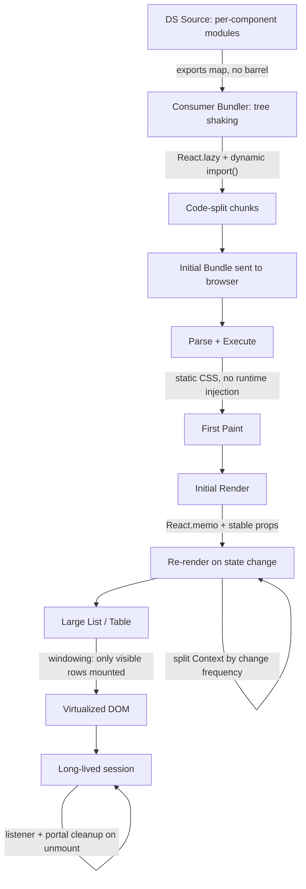

export const metadata = {
  title: "13. Performance",
  description:
    "Bundle size budgets, tree shaking, lazy loading and code splitting, CSS performance, rendering performance, context optimization, virtualization and memory usage.",
};

# 13. Performance

## Quick Glance

- Design system performance means controlling what a component library costs every app that uses it: bundle size, render CPU, memory, and CSS work.
- The core problem is multiplication: one wasteful component times fifty consuming teams equals fifty apps getting slower at once.
- Barrel files (an `index.ts` that re-exports everything) are the single most common real-world tree-shaking killer — fix with per-component subpath exports in `package.json`.
- `React.lazy` + `Suspense` defer heavy, rarely-used components (a rich text editor, a date picker) so their weight isn't in everyone's initial bundle.
- Runtime CSS-in-JS injects styles during render, which gets expensive on high-repeat leaf components (Badge in a 500-row table); zero-runtime CSS (Vanilla Extract, Panda CSS) generates that CSS at build time instead.
- Context re-renders every consumer when the Provider's value changes identity — not just the consumers that read the changed field. Split Context by how often each piece of state changes.
- `React.memo` plus stable, primitive props stops leaf components (Badge, Cell) from re-rendering needlessly in lists — verify the fix with the React DevTools Profiler, don't just assume it worked.
- Virtualize lists once they get into the thousands of rows; under a couple hundred rows, virtualization usually isn't worth the extra complexity.
- Tooltip and Popover are the most common source of memory leaks — always pair listeners/portals added on mount with cleanup in `useEffect`.
- Enforce bundle budgets in CI per component, not as one number for the whole library, so a regression is easy to trace to its cause.

## Definition

**Design system performance** means controlling the cost a component
library places on every app that uses it. That cost shows up in four ways:
bundle bytes sent over the network, CPU spent rendering and re-rendering,
memory held by long-lived widgets, and CSS work paid on every paint.

There are two different surfaces here, and teams often mix them up:

- **The package itself** — how it's built, what it exports, and how much
  of it can be removed (tree-shaken) by a consumer's bundler when unused.
- **The components at runtime** — how they render, re-render, and clean up
  inside a real app handling real amounts of data.

A design system that looks "fast" only in its own Storybook, but turns
slow inside a consumer's 500-row data table, has not actually solved the
problem it exists to solve.

## Problem Statement

Every other engineering team writes code that affects *their own* app. A
design system team writes code that affects *every* app that uses it.
That difference is the whole problem.

If a product engineer adds a 40kb dependency to one feature page, that one
page gets 40kb heavier. If a design system engineer adds the same
dependency inside a `<DatePicker>` that fifty teams import — and nothing
isolates that import behind a code-split boundary — all fifty apps get
40kb heavier at once. Worse, the design system team usually has no idea
this happened until someone notices Lighthouse scores dropping weeks
later.

The same multiplication happens at runtime. Nobody profiles a `<Badge>` or
`<Icon>` component on its own, because by itself it renders in under a
millisecond. But design systems don't ship components in isolation — they
ship components that get dropped into data tables and dashboards, where
the same small component might render five hundred or five thousand times
on one screen. A component that's cheap on its own becomes expensive the
moment it's used at the scale a design system is built for.

This is the central idea of this chapter: design system performance work
isn't about making one component fast. It's about making the
multiplication safe.

## Why Does This Exist?

Performance work became a core design-system discipline because three
things happened at roughly the same time, across the industry:

1. **Design systems succeeded at their real job: getting reused.** Once a
   design system is adopted broadly — Polaris across every Shopify admin
   screen, Carbon across every IBM Cloud console, an internal system across
   forty product teams — every wasted kilobyte and every wasted render in a
   shared component is now paid by all of those teams at once. Success
   turns a small inefficiency into a tax the whole company pays.
2. **JavaScript bundle size became a metric leadership cares about.** As
   React apps grew, the industry settled on Core Web Vitals (LCP, INP, CLS
   — three metrics Google uses to score page speed) as numbers that track
   with search ranking, ecommerce sales, and how often people use an
   internal tool. A design system sits directly upstream of how fast a
   consuming app becomes usable, whether the design system team thinks
   about it or not.
3. **CSS-in-JS's runtime cost became visible at scale.** CSS-in-JS means
   writing CSS inside your JavaScript/component file instead of a separate
   `.css` file. Early libraries like the original `styled-components` made
   this easy to write, but paid for it by recalculating styles on every
   render — invisible on a demo page with three components, very visible
   on a real page with a thousand styled elements. This is the direct
   reason the industry moved toward zero-runtime CSS (CSS generated ahead
   of time instead of during render), covered in depth in
   [Styling Architecture](/chapters/styling-architecture).

In short: a design system's whole value is reuse. But reuse is also its
whole performance risk — the same multiplier that makes it valuable makes
mistakes expensive.

## Historical Context

Early component libraries (roughly 2015–2018, when teams were moving from
jQuery UI to React) shipped as one big bundle: one script tag, one
`dist/bundle.js` file, every component included whether you used three of
them or thirty. Tree shaking — the process of a bundler automatically
deleting code you don't use — wasn't reliable yet. Babel-transpiled
CommonJS modules (an older module format) can't be scanned for unused code
the way modern ES modules can. So "importing one component" usually meant
"downloading the whole library" anyway.

Two things changed that. First, the industry moved to ES modules
(`import`/`export`) as the standard way to write and publish packages.
Second, bundlers gained the ability to statically analyze that code —
Rollup pioneered it, Webpack 2 added `sideEffects` support in 2017, and
esbuild and Vite later made this the default expectation. Together, these
made tree shaking work reliably at the individual-component level. Design
systems restructured their packages around it. [Packaging](/chapters/packaging)
covers how a design system builds for this; this chapter covers it from
the consumer's side, which is where tree shaking actually succeeds or
fails.

CSS-in-JS followed its own path. `styled-components` (2016) and Emotion
(2017) made it much easier to keep styles next to the component they
belonged to, and design systems adopted them widely through the late
2010s. By the early 2020s, teams running these libraries on large,
data-heavy pages started publishing profiling data showing that injecting
styles at runtime was eating a measurable chunk of render time. That
finding drove the rise of zero-runtime alternatives — Vanilla Extract
(2021) and Panda CSS (2023) — which keep the same "styles next to the
component" convenience but compile everything to plain CSS ahead of time.

Virtualization tooling (libraries that only render the rows currently
visible on screen, instead of every row) went through a similar
maturing process. `react-virtualized` (2016) was the first widely used
option, but it was one large package covering grids, lists, and tables
with a big API surface. `react-window` (2019, same author, deliberately
smaller) stripped that down to a lean, focused tool. TanStack Virtual
(2023, successor to `react-virtual`) went further still: it's headless
(it only handles the math of which rows are visible, and hands you full
control over the markup and styling) and works outside React too. Most
design systems today build their virtualized `<List>`/`<Table>` on top of
one of these rather than writing the scroll-position math themselves.

Bundle budget tooling — tools that fail a build if the bundle gets too big
— followed the same path as linting tools before it. `bundlesize` (2016)
was the first popular "fail CI if the bundle grows" tool. `size-limit`
(2018) added more checks, including actual run time, not just file size.
`bundlewatch` added automatic PR comments showing the size difference per
file. By the early 2020s, checking a component's gzip (compressed) size on
every pull request was standard practice at companies with mature design
systems — the same way requiring test coverage had become standard a
decade earlier.

## How It Works Internally

### Tree shaking from the consumer's side, precisely

[Packaging](/chapters/packaging) covers how a design system *builds* its
package to be tree-shakeable (able to have unused code deleted). Here's
what actually happens on the *consumer's* bundler when a consumer writes:

```ts
import { Button } from "@acme/ui";
```

The consumer's bundler (webpack, Rollup, esbuild — whatever their app
uses) scans the chain of ES modules starting from that import. For each
export in `@acme/ui`, it asks two questions: is this export actually used
anywhere, and if not, can the code that produces it be proven safe to
delete? "Safe to delete" means the module has no side effects — it
doesn't do anything the moment it runs, beyond producing the export. If
the answer is yes, the bundler deletes that code (this is called dead
code elimination). If the bundler *can't* prove it's safe, it keeps the
code anyway. "Maybe used" gets treated as "used." Deleting code that
actually does something when it loads — like a line that runs
`document.body.classList.add(...)`, or a CSS-in-JS library that injects a
stylesheet the moment it's imported — would change how the app behaves.
No bundler will risk that silently.

This is exactly where **barrel files** quietly break the whole mechanism.
A barrel file is an `index.ts` that re-exports every component from one
place:

```ts
// packages/ui/src/index.ts — the barrel
export * from "./Button";
export * from "./DatePicker"; // pulls in date-fns, ~25kb
export * from "./RichTextEditor"; // pulls in a whole editor engine, ~180kb
export * from "./Badge";
// ...120 more components
```

When a consumer writes `import { Button } from "@acme/ui"`, the bundler
sees this as an import from the *barrel file*, not from `Button.tsx`
directly. To delete `DatePicker` and `RichTextEditor` from the final
bundle, the bundler needs proof that loading those modules has no side
effects. In practice, that proof fails often, for a few concrete reasons:

- **CommonJS interop.** CommonJS (CJS) is an older module format that
  can't be scanned the way modern ES modules can. If any package in the
  chain still ships CJS — and a lot of npm packages do — the bundler
  can't see through it, and includes the whole thing.
- **The `sideEffects` field is missing or wrong.** `package.json` can
  declare `"sideEffects": false` to tell the bundler "nothing in this
  package does anything just by loading — it's safe to delete unused
  parts." Without an accurate version of this field, most bundlers
  assume the opposite (that any module might have side effects) and keep
  everything.
- **A component itself has a side effect.** A component file that
  registers something the moment it loads — an icon registry, a CSS-in-JS
  `injectGlobal` call, auto-wired analytics — genuinely isn't safe to
  delete. That's correct on its own. But when it's re-exported from the
  same barrel as everything else, and the bundler can't isolate it to
  just that one file, the "not safe to delete" label spreads to every
  other export in the barrel too.

The fix isn't a bundler setting — it's a structural change: **give every
component its own importable subpath**, so a consumer's import statement
points straight at the module they need, with no barrel file in between.

```json
// packages/ui/package.json
{
  "name": "@acme/ui",
  "exports": {
    "./button": {
      "types": "./dist/button.d.ts",
      "import": "./dist/button.mjs",
      "require": "./dist/button.cjs"
    },
    "./date-picker": {
      "types": "./dist/date-picker.d.ts",
      "import": "./dist/date-picker.mjs",
      "require": "./dist/date-picker.cjs"
    }
  },
  "sideEffects": false
}
```

```ts
// consumer app — imports exactly one component's module graph
import { Button } from "@acme/ui/button";
```

Now there's no ambiguity for the bundler to work out: `@acme/ui/button`
*is* the Button module, nothing more. Nothing from `DatePicker` or
`RichTextEditor` is even read, let alone included in the bundle. Some
design systems still keep a convenience barrel too, so `import { Button }
from "@acme/ui"` also works — that's fine, as long as the barrel only
re-exports modules that are genuinely free of side effects, and the
`sideEffects: false` claim in `package.json` is actually true. Worth
checking this in CI (see [Packaging](/chapters/packaging) for tools like
`publint` and `are-the-types-wrong`), because a false claim there will
silently strip code your components actually need at runtime.

### Lazy loading and code splitting

Some components cost a lot but rarely get rendered on the first screen a
user sees — a `<DatePicker>` behind a "pick a date" button someone might
never click this session, or a `<RichTextEditor>` that only mounts once
someone opens a comment box. Shipping their full weight in the initial
bundle makes every page load slower, to benefit an interaction that might
never happen. `React.lazy` combined with `Suspense` fixes this: it delays
downloading the component's code until the component is actually about to
render.

```tsx
import { lazy, Suspense } from "react";

// The dynamic import() is the split point — the bundler emits
// date-picker.[hash].js as its own chunk, only fetched when this
// module is actually evaluated (i.e., when RichTextEditor first renders).
const RichTextEditor = lazy(() => import("./RichTextEditor"));

export function CommentBox() {
  const [expanded, setExpanded] = useState(false);
  return expanded ? (
    <Suspense fallback={<EditorSkeleton />}>
      <RichTextEditor />
    </Suspense>
  ) : (
    <button onClick={() => setExpanded(true)}>Write a comment</button>
  );
}
```

There's one design-system-specific catch: a *consumer* of your library
decides when a heavy component is worth lazy-loading in their app, but you
as the design system author decide whether that's even *possible*. If
`RichTextEditor` and `Button` are both exported from one module graph that
isn't split apart, no amount of `React.lazy` wrapping on the consumer's
side saves them from `RichTextEditor`'s dependencies — those are already
bundled together upstream, before the consumer's code even runs. Subpath
exports (from the previous section) are what make lazy loading possible in
the first place; `React.lazy` is what a consumer adds on top of that.

### CSS performance: runtime injection vs static extraction

[Styling Architecture](/chapters/styling-architecture) covers the full
landscape of CSS approaches. Here's the specific mechanism behind the
performance difference.

Runtime CSS-in-JS libraries generate class names and inject `<style>`
rules *while the page renders*. The first time a given combination of
props is seen, the library turns the styles into a string, hashes that
string into a class name, and inserts a new CSS rule into the page. That
insertion forces the browser to throw away cached style calculations for
the affected part of the page and redo them. On a single Button, this cost
is too small to notice. But in a table rendering five hundred
`<Badge variant={...}>` cells, where `variant` is different per row, a
library that doesn't cache each variant's output correctly ends up paying
that recalculation cost hundreds of times in one render.

Static, zero-runtime CSS (Vanilla Extract, Panda CSS, or plain CSS Modules
using token-driven CSS variables) avoids this entirely. Class names and
their rules are generated once, at build time — before the app ever runs.
At runtime, applying a class name to an element is just writing an
attribute; the browser already has the rule parsed and ready. No
injection, no first-use recalculation cost. This is the main reason
design systems built for data-heavy screens — admin tools, data tables,
dashboards — have moved to zero-runtime CSS over the last few years.

The second performance factor in CSS is **how expensive a selector is to
match**. A selector like `.Table .Row .Cell.active .Badge` makes the
browser walk backward through several conditions, checking each one,
every time it recalculates styles. Deeply nested, highly specific
selectors get more expensive as the page grows. Design systems that use
flat, low-specificity selectors — one class per component, no nesting —
avoid this problem from the start. **Cascade layers** (`@layer`, a CSS
feature for grouping rules and controlling which group wins) help too,
separately from the specificity story covered in
[Styling Architecture](/chapters/styling-architecture): layers let every
rule stay simple and flat, because the *order of the layers* decides which
rule wins instead of how specific each selector is. That keeps the
browser's matching cost predictable even as the stylesheet grows into the
thousands of rules.

### Rendering performance: the leaf-component-in-a-list problem

React re-renders a component whenever its parent re-renders — unless that
component is memoized (told to skip re-rendering when its inputs haven't
changed) and its props stay the same reference between renders. A
`<Badge>` inside a table row looks harmless on its own, but think about
what happens when a table with a search box re-renders on every keystroke.
If `Badge` isn't wrapped in `React.memo`, all five hundred `Badge`
instances in that table re-render on every keystroke too — even though
none of their actual data (a status string, a color) changed. This is a
common, real bug in design systems, and it's why profiling (measuring
what's actually slow, instead of guessing) matters so much here: the
problem doesn't show up until a component is used at real production
scale.

The tool for catching it is the **React DevTools Profiler**. Record a
render (type into that search box, for example), then look at the flame
graph — a visual breakdown of what rendered — for a "commit" (one render
pass) that lights up five hundred `Badge` bars, even though the badge data
never changed. The Profiler's "why did this render" panel will name the
cause: "parent re-rendered, props unchanged." That's exactly the pattern
memoization is built to fix.

### Context optimization, deepened

[React Architecture](/chapters/react-architecture) introduces the idea of
splitting Context into smaller pieces. Here's the specific detail that
makes it matter for performance: **value identity**.

Every component that calls `useContext(MyContext)` re-renders whenever the
value passed to `MyContext.Provider` changes identity — meaning React sees
a new object reference, not the old one. This happens regardless of which
specific field inside that object a component actually reads; it's the
*whole object's* identity that matters, not any one field. This trips
people up constantly:

```tsx
// Anti-pattern: a brand-new object every render means every consumer
// re-renders on every render of the provider, regardless of which
// field they actually read.
function TableProvider({ children }: { children: ReactNode }) {
  const [selectedIds, setSelectedIds] = useState<Set<string>>(new Set());
  const [sortColumn, setSortColumn] = useState<string>("name");

  return (
    <TableContext.Provider
      value={{ selectedIds, setSelectedIds, sortColumn, setSortColumn }}
    >
      {children}
    </TableContext.Provider>
  );
}
```

`selectedIds` changes on almost every user action (checking a row).
`sortColumn` changes rarely. Bundled into one context value, a component
that only cares about the sort column re-renders every time a row gets
checked. The fix is to split state that changes at different speeds into
separate contexts, so each consumer only subscribes to the rate of change
it actually needs — worked in full in the Implementation Example below.

### Virtualization mechanism

A `<Table>` with ten thousand rows, rendered the naive way, creates ten
thousand real DOM nodes. Most of them are scrolled out of view and
invisible, but the browser still has to lay them out, paint them (if not
clipped), and hold them in memory. Virtualization — also called windowing
— fixes this by rendering only the DOM nodes for rows currently inside the
visible area (plus a small buffer around it), and using a spacer element
to make the scrollbar behave as if all ten thousand rows were really
there.

Concretely, here's what the library does: it measures (or estimates) each
row's height, works out which row numbers fall inside the visible area,
and renders only those rows, positioning each one at its correct offset
using `transform: translateY(...)`. A single tall spacer element keeps the
total scrollable height the same as it would be if every row were really
rendered. As the user scrolls, the library recalculates which rows are
visible and swaps them in and out — old rows unmount, new ones mount — so
the number of DOM nodes stays roughly constant no matter how many total
rows there are.

### Memory usage: cleanup in mount/unmount-heavy components

`<Tooltip>` and `<Popover>` are the components most likely to leak memory
in a design system. That's because they typically do two things: attach a
global event listener (for mousemove, scroll, resize, or clicking outside)
and render into a portal — a DOM node placed outside the component's own
position in the React tree. If the listener isn't removed and the portal
node isn't deleted when the component unmounts, every Tooltip a user has
ever hovered over in a session leaves behind a dangling listener and an
orphaned DOM node. This is exactly the kind of leak that shows up as "the
app gets sluggish over a long session" rather than a clean crash. The fix
is a `useEffect` cleanup function that undoes everything the effect set
up. This is worked out in full below, and you can verify it in Chrome
DevTools: take a heap snapshot, open and close a hundred tooltips, take a
second snapshot, and compare the retained object counts. A healthy
component returns to its starting count; a leaking one keeps climbing.

## Architecture

The diagram below shows where each technique in this chapter steps in,
following the path from source code to a screen that's rendered, scrolled,
and stays open for a while.



Reading it left to right: tree shaking and code splitting happen *before*
a single byte reaches the browser. Static CSS and initial-render
memoization act at *first paint*. Context splitting and `React.memo` act
on every *later* re-render. Virtualization controls *DOM node count* once
a list is showing real production data. Memory cleanup acts across the
*whole lifetime* of a session, not tied to any one render. Treating all of
this as one undifferentiated "performance" bucket is a mistake — each
piece needs a different technique, a different profiling tool, and fails
silently in its own way.

## Real-World Example

Data-dense admin screens are where every technique in this chapter earns
its keep at the same time. It's worth walking through a realistic,
composite scenario that mirrors what teams running large order, issue, or
ticket tables — the kind of screen Shopify's admin, Atlassian's Jira, and
similar enterprise tools all have — routinely run into.

A design system ships a `<Table>` built from `<Row>`, `<Cell>`, and
`<Badge>` primitives. A consuming team renders an order list with two
thousand rows, each with a status `Badge`. Three separate problems stack
on top of each other:

1. The table has a live search box wired directly into the same component
   tree as the rows, with no debouncing (delaying the search until typing
   pauses) and no isolation. Every keystroke re-renders the whole tree, and
   because `Badge` isn't memoized, two thousand `Badge` re-renders fire on
   every character typed. The React DevTools Profiler shows this
   immediately: a wide, uniform band of two thousand near-identical bars on
   every commit.
2. All two thousand rows are mounted as real DOM nodes at once — no
   virtualization. So beyond the re-render cost, the browser is also
   holding two thousand rows in layout and paint. Scrolling itself gets
   janky, independent of any React work.
3. Each `Badge`'s color is computed inline
   (`style={{ background: STATUS_COLORS[status] }}`) using a runtime
   CSS-in-JS call instead of a pre-built class. So each of those two
   thousand renders also pays a style-injection cost on top of the
   re-render cost.

The fix addresses the problems in the same order they stack: memoize
`Badge` so a search-box re-render doesn't cascade into it; virtualize the
row list with a TanStack Virtual–backed `<Table>` primitive so only about
20–30 rows are ever mounted no matter the total row count; and move
`Badge`'s color to a static, token-driven CSS class instead of a runtime
style object. No single one of these three fixes alone gets the table back
to smooth 60fps scrolling and fast keystroke response — it takes all
three together, because each one removes a different cost, and those
costs add up when left together.

## Implementation Example

### 1. Bundle budgets enforced in CI with size-limit

```json
// .size-limit.json — one entry per public entry point, not one for
// the whole package, so a regression is attributed to the exact
// component that caused it.
[
  {
    "name": "@acme/ui/button",
    "path": "dist/button.mjs",
    "limit": "2 KB"
  },
  {
    "name": "@acme/ui/date-picker",
    "path": "dist/date-picker.mjs",
    "limit": "8 KB"
  },
  {
    "name": "@acme/ui/data-table",
    "path": "dist/data-table.mjs",
    "limit": "6 KB"
  }
]
```

```yaml
# .github/workflows/size-check.yml
name: bundle size
on: [pull_request]
jobs:
  size:
    runs-on: ubuntu-latest
    steps:
      - uses: actions/checkout@v4
      - uses: pnpm/action-setup@v4
      - run: pnpm install --frozen-lockfile
      - run: pnpm build
      # Fails the check (not just warns) if any entry exceeds its
      # budget, and posts the per-entry diff as a PR comment so the
      # author sees exactly which component regressed and by how much.
      - uses: andresz1/size-limit-action@v1
        with:
          github_token: ${{ secrets.GITHUB_TOKEN }}
```

If a pull request adds `date-fns` as an unguarded import to `DatePicker`,
CI now fails with a clear, specific diff — `@acme/ui/date-picker: 8 KB →
33 KB (+25 KB)` — before it ever merges. That's much better than the
alternative: an unexplained drop in a consuming app's Lighthouse score
weeks later, with no obvious cause.

### 2. Subpath exports fixing the barrel-file tree-shaking failure

```ts
// BEFORE — packages/ui/src/index.ts, the barrel every component
// re-exports through. A consumer importing only Button pulls the
// entire module graph behind every other export in this file too,
// because the bundler cannot prove the unused exports are safe to drop.
export * from "./Button";
export * from "./DatePicker";
export * from "./RichTextEditor";
```

```ts
// AFTER — package.json exports map gives each component its own
// resolvable entry point. Consumers import directly from it, so the
// bundler's module graph for `import { Button } from "@acme/ui/button"`
// contains only Button's own dependencies.
```

```json
{
  "exports": {
    "./button": { "import": "./dist/button.mjs", "types": "./dist/button.d.ts" },
    "./date-picker": { "import": "./dist/date-picker.mjs", "types": "./dist/date-picker.d.ts" },
    "./rich-text-editor": { "import": "./dist/rich-text-editor.mjs", "types": "./dist/rich-text-editor.d.ts" }
  },
  "sideEffects": false
}
```

### 3. Lazy loading a heavy, rarely-used primitive

```tsx
// packages/ui/src/DatePicker/DatePicker.lazy.tsx
// The DS ships an explicit lazy wrapper so consumers get code
// splitting "for free" without having to know date-fns lives behind
// this component — they don't have to write React.lazy themselves.
import { lazy, Suspense, type ComponentProps } from "react";

const DatePickerImpl = lazy(() =>
  import("./DatePicker").then((m) => ({ default: m.DatePicker }))
);

export function DatePicker(props: ComponentProps<typeof DatePickerImpl>) {
  return (
    <Suspense fallback={<DatePickerSkeleton />}>
      <DatePickerImpl {...props} />
    </Suspense>
  );
}

function DatePickerSkeleton() {
  // Matches the real component's footprint so layout doesn't shift
  // once the chunk finishes loading and Suspense resolves.
  return <div className="dp-skeleton" style={{ height: 40, width: 240 }} />;
}
```

### 4. Static CSS instead of runtime style objects for a high-cardinality leaf

```ts
// Badge.css.ts — Vanilla Extract, compiled to static CSS at build
// time. Every variant's rule already exists in the stylesheet before
// the app ever runs; applying a class name at runtime is just a DOM
// attribute write, not a style-injection call.
import { style, styleVariants } from "@vanilla-extract/css";
import { tokens } from "../tokens.css";

export const base = style({
  display: "inline-flex",
  alignItems: "center",
  borderRadius: tokens.radius.full,
  fontSize: tokens.fontSize.sm,
  paddingInline: tokens.space[2],
});

export const variant = styleVariants({
  success: { background: tokens.color.successSurface, color: tokens.color.successText },
  warning: { background: tokens.color.warningSurface, color: tokens.color.warningText },
  danger: { background: tokens.color.dangerSurface, color: tokens.color.dangerText },
});
```

```tsx
// Badge.tsx — memoized, and props are stable primitives (a string
// enum), which is what makes React.memo's shallow comparison actually
// succeed instead of silently doing nothing.
import { memo } from "react";
import { base, variant } from "./Badge.css";

type BadgeProps = {
  status: "success" | "warning" | "danger";
  children: React.ReactNode;
};

function BadgeImpl({ status, children }: BadgeProps) {
  return <span className={`${base} ${variant[status]}`}>{children}</span>;
}

// React.memo only pays off if callers pass stable props. If a caller
// does `<Badge status={status}>{formatLabel(status)}</Badge>` where
// formatLabel returns a new string reference every render, memo still
// works here because strings are compared by value, not identity —
// this is precisely why Badge accepts primitives, not objects.
export const Badge = memo(BadgeImpl);
```

### 5. Context split by change frequency

```tsx
// TableContext.tsx — two contexts instead of one, split by how often
// their values change. Row-selection state churns on every click;
// the setters/sort handlers never change identity after mount. A row
// that only renders a sort indicator subscribes to StableTableContext
// and never re-renders when the user checks a different row.
import { createContext, useContext, useMemo, useState, type ReactNode } from "react";

type SelectionState = { selectedIds: ReadonlySet<string> };
type TableActions = {
  toggleRow: (id: string) => void;
  sortColumn: string;
  setSortColumn: (col: string) => void;
};

const SelectionContext = createContext<SelectionState | null>(null);
const ActionsContext = createContext<TableActions | null>(null);

export function TableProvider({ children }: { children: ReactNode }) {
  const [selectedIds, setSelectedIds] = useState<Set<string>>(new Set());
  const [sortColumn, setSortColumn] = useState("name");

  const toggleRow = useCallback((id: string) => {
    setSelectedIds((prev) => {
      const next = new Set(prev);
      next.has(id) ? next.delete(id) : next.add(id);
      return next;
    });
  }, []);

  // Actions object is memoized so its identity is stable across
  // renders that only change selectedIds — consumers of ActionsContext
  // (e.g. a sort-header component) don't re-render on row selection.
  const actions = useMemo(
    () => ({ toggleRow, sortColumn, setSortColumn }),
    [toggleRow, sortColumn]
  );

  const selection = useMemo(() => ({ selectedIds }), [selectedIds]);

  return (
    <ActionsContext.Provider value={actions}>
      <SelectionContext.Provider value={selection}>
        {children}
      </SelectionContext.Provider>
    </ActionsContext.Provider>
  );
}

export function useTableSelection() {
  const ctx = useContext(SelectionContext);
  if (!ctx) throw new Error("useTableSelection must be used within TableProvider");
  return ctx;
}

export function useTableActions() {
  const ctx = useContext(ActionsContext);
  if (!ctx) throw new Error("useTableActions must be used within TableProvider");
  return ctx;
}
```

### 6. Virtualized list primitive on TanStack Virtual

```tsx
// VirtualizedTable.tsx — the design system's windowed table primitive.
// Only rows inside the viewport (plus overscan) are ever mounted;
// scroll position and total height are simulated via a spacer element
// so native scrollbar behavior is preserved for arbitrary row counts.
import { useRef } from "react";
import { useVirtualizer } from "@tanstack/react-virtual";

type Row = { id: string; name: string; status: "success" | "warning" | "danger" };

export function VirtualizedTable({ rows }: { rows: Row[] }) {
  const parentRef = useRef<HTMLDivElement>(null);

  const virtualizer = useVirtualizer({
    count: rows.length,
    getScrollElement: () => parentRef.current,
    estimateSize: () => 44, // px per row, refined after first measure
    overscan: 8, // render a buffer above/below viewport to hide pop-in on fast scroll
  });

  return (
    <div ref={parentRef} className="vtable-viewport" role="table" aria-rowcount={rows.length}>
      <div style={{ height: virtualizer.getTotalSize(), position: "relative" }}>
        {virtualizer.getVirtualItems().map((virtualRow) => {
          const row = rows[virtualRow.index];
          return (
            <div
              key={row.id}
              role="row"
              aria-rowindex={virtualRow.index + 1}
              style={{
                position: "absolute",
                top: 0,
                left: 0,
                width: "100%",
                height: virtualRow.size,
                transform: `translateY(${virtualRow.start}px)`,
              }}
            >
              <span role="cell">{row.name}</span>
              <Badge status={row.status}>{row.status}</Badge>
            </div>
          );
        })}
      </div>
    </div>
  );
}
```

<Callout type="warning" title="Virtualization and accessibility don't come free">
  A virtualized list only has a handful of rows in the DOM at any moment.
  That means screen readers, which rely on `aria-rowcount`/`aria-rowindex`
  to announce position, need those values kept accurate as rows mount and
  unmount. It also means keyboard navigation (Home/End/PageDown) has to
  both scroll the virtualizer *and* move focus — not just one of the two.
  See [Accessibility](/chapters/accessibility) for the full pattern. Build
  virtualization as an accessibility feature from the start, not a
  performance feature you bolt accessibility onto afterward.
</Callout>

### 7. Cleanup in a portal-based Tooltip

```tsx
// useTooltip.ts — every subscription made on mount has a matching
// teardown in the effect's cleanup function. This is the difference
// between a Tooltip that's cheap to open a thousand times in a
// session and one that leaks a listener + a portal node every time.
import { useEffect, useRef, useState } from "react";
import { createPortal } from "react-dom";

export function useTooltip() {
  const [open, setOpen] = useState(false);
  const anchorRef = useRef<HTMLElement>(null);
  const portalNodeRef = useRef<HTMLDivElement | null>(null);

  useEffect(() => {
    if (!open) return;

    // Create the portal node lazily, only while open, and remove it
    // on cleanup — an always-mounted portal node for every Tooltip
    // instance a user has ever hovered is the classic leak shape here.
    const node = document.createElement("div");
    document.body.appendChild(node);
    portalNodeRef.current = node;

    const handleScroll = () => setOpen(false);
    const handleOutsideClick = (e: MouseEvent) => {
      if (!anchorRef.current?.contains(e.target as Node)) setOpen(false);
    };

    window.addEventListener("scroll", handleScroll, { capture: true, passive: true });
    document.addEventListener("mousedown", handleOutsideClick);

    return () => {
      window.removeEventListener("scroll", handleScroll, { capture: true });
      document.removeEventListener("mousedown", handleOutsideClick);
      document.body.removeChild(node);
      portalNodeRef.current = null;
    };
  }, [open]);

  return { open, setOpen, anchorRef, portalNodeRef };
}
```

Don't just guess this works from reading the code — check it in DevTools.
Open Chrome DevTools → Memory, take a heap snapshot, open and close a
Tooltip a hundred times programmatically, force garbage collection, then
take a second snapshot. Compare the retained object counts for the
component's constructor name. A correct implementation returns to its
starting count. A leaking one climbs steadily with every open/close
cycle.

## Advantages

- **Savings compound.** A 5kb cut in a component used by forty consuming
  apps saves 200kb total across the company. The same multiplier that
  makes performance bugs expensive makes performance fixes worth
  disproportionately more.
- **Regressions get caught upstream.** CI-enforced budgets catch a
  bloated dependency before it ships, instead of relying on forty
  separate app teams to each notice and report the same slowdown.
- **One correct, accessible virtualization instead of forty broken
  ones.** Consuming teams get a working windowed table without each one
  having to reinvent scroll-position math and its accessibility pitfalls.
- **Credibility.** A design system that visibly performs well under real
  data earns faster adoption than one that only looks good in a
  three-row Storybook demo. This is a real adoption lever, not just an
  engineering nicety (see [Governance](/chapters/governance) on adoption
  strategy).

## Disadvantages

- **Maintaining CI budgets is its own ongoing cost.** Budgets need
  revisiting as features legitimately grow. A stale, too-tight budget
  causes false failures, which erodes trust in the check and gets it
  overridden — defeating its purpose.
- **Virtualization adds real complexity.** Rows with different heights,
  sticky headers, and accessible keyboard navigation are all harder
  inside a virtualized list than a plain one. Smaller teams with lists
  that will never exceed a few hundred rows can reasonably skip it.
- **Aggressive memoization has its own cost.** `React.memo`'s comparison
  step isn't free. Over-applying it to components with naturally
  unstable props — a new object literal on every render, for example —
  adds a comparison cost on every render *without* stopping the
  re-render it was meant to prevent. That's worse than no memoization at
  all.
- **Premature optimization is a real risk.** Building a fully
  virtualized, context-split, lazy-loaded component before any consumer
  needs that scale is wasted effort — the cost is paid immediately, for
  a benefit that might never show up.

## Alternatives

Virtualization is the clearest case in this chapter where a design
system has several good library choices, each with different tradeoffs.
The table below compares them. The same ten-dimension format applies if
you're comparing bundle-budget tools (size-limit vs. bundlewatch vs.
bundlesize) or CSS approaches — both covered in
[Styling Architecture](/chapters/styling-architecture) and
[Packaging](/chapters/packaging).

| Dimension | react-window | react-virtualized | TanStack Virtual | No virtualization + CSS `content-visibility` |
| --- | --- | --- | --- | --- |
| What problem it solves | Lean windowing for fixed/variable-size lists and grids | Full-featured windowing incl. sticky rows, arbitrary layouts | Headless windowing primitive, framework-agnostic core | Lets the browser skip layout/paint for off-screen content without any windowing library |
| Why it was created | Same author's leaner rewrite of react-virtualized, targeting bundle size | First mainstream React virtualization solution (2016) | Successor to react-virtual; generalized beyond React to Vue/Solid | Native CSS feature (`content-visibility: auto`), no JS needed |
| Performance | Excellent; ~2-6kb, minimal render overhead | Good, but larger API surface adds weight | Excellent; near react-window, more flexible measurement | Good for paint/layout skip, but all DOM nodes still exist (no memory saving) |
| Developer experience | Simple API, limited to what it directly supports | More features but more configuration surface | Headless — full control, more code to write yourself | Zero API — just a CSS property, but no scroll-position virtualization |
| Learning curve | Low | Medium | Medium-high (headless requires understanding the model) | Very low |
| Community / ecosystem | Very high, React ecosystem default for years | High but largely superseded by react-window | Rapidly growing, TanStack brand backing | N/A — native CSS, browser support only |
| Maintenance burden | Low; stable, small API | Higher; larger surface, more edge cases | Low-medium; you own more integration code | None — no library dependency |
| Enterprise suitability | High — most design systems' default choice | Declining — largely legacy usage | High — increasingly the default for new builds | Only for moderate lists (hundreds, not tens of thousands) |
| When to choose it | Standard fixed or estimable-height lists/tables | Legacy codebases already using it, or need its specific sticky-grid features | New builds wanting full control of markup/a11y, or non-React targets | Lists too small to justify a dependency but large enough that paint cost matters |
| When NOT to choose it | Highly irregular row heights without measurement | New projects — react-window/TanStack Virtual supersede it | Teams wanting a batteries-included component, not a primitive | Any list needing true DOM-count reduction (huge lists, memory-constrained devices) |

Large product companies mostly build their design system's `<List>`/
`<Table>` primitive on **react-window or TanStack Virtual**, not
`react-virtualized`. A design system's whole job is to hand consumers a
*small, controlled* API — react-virtualized's larger surface area works
against that goal, even though it can do more. Teams that adopted design
systems more recently (2023 onward) lean toward **TanStack Virtual
specifically because it's headless** (meaning it only handles the
windowing math, not the markup). A design system already owns its own
markup and styling — that's the whole point of the system — so a
virtualization library that also tries to own markup, the way
react-virtualized partly does, works against the design system instead
of helping it. `content-visibility: auto` isn't a real substitute for
either one — it doesn't cut DOM node count or memory, only paint and
layout cost — but it's a fine, dependency-free choice for lists long
enough to want some browser help, without being long enough (low
thousands of rows) to justify a full virtualization library and its
accessibility overhead.

## Tradeoffs

Every technique in this chapter trades something for its performance
gain. Stating the gain without the cost is how a design system ends up
with performance work nobody wants to maintain:

- **Budget strictness vs. shipping speed.** A tight CI budget catches
  real regressions, but it also blocks legitimate growth — like a new
  required accessibility feature that adds 300 bytes. Budgets need a
  documented process for raising them on purpose, not just failing
  forever.
- **Lazy loading vs. perceived latency.** Deferring `RichTextEditor`'s
  code until it's rendered saves everyone who never opens it. But it
  costs the person who *does* open it a network round-trip they wouldn't
  have paid with eager loading. A skeleton screen softens this; it
  doesn't remove it.
- **Virtualization vs. complexity and accessibility risk.** Windowing a
  table is a real engineering investment with ongoing accessibility work
  (see the callout above). A team with 200 rows, and never more, is
  better off with a plain, unvirtualized list.
- **Memoization vs. comparison overhead.** `React.memo` isn't free to
  run. Applying it to every leaf component without thinking adds a
  comparison cost across the whole tree, even where re-renders were
  already cheap. That's a net loss on components that render rarely or
  trivially.
- **Zero-runtime CSS vs. authoring flexibility.** Static CSS extraction
  needs to know every style variant at build time. That's a real
  constraint compared to runtime CSS-in-JS, which can plug in any
  JavaScript value while rendering. See
  [Styling Architecture](/chapters/styling-architecture) for the full
  tradeoff.

## Performance Considerations

Concrete numbers a design system team should track, not vague goals:

- **Per-component gzip budgets.** Gzip is a compression format; "gzip
  size" is the size actually sent over the network. Core primitives
  (`Button`, `Badge`, `Icon`) should sit in the low single-digit
  kilobytes gzipped. Composite components (`DataTable`, `DatePicker`) can
  budget higher (5–15kb), but should still be tracked individually — not
  lumped into one whole-library number that hides which component caused
  the growth.
- **Re-render count, not just render time.** A component that renders in
  0.1ms but does so five thousand times unnecessarily costs more total
  frame time than a component that renders once in 5ms. Track *count*
  through the Profiler's commit view, not just how long each render
  takes.
- **Virtualization threshold.** As a rule of thumb, lists under roughly
  100–200 DOM nodes rarely need virtualization — the engineering and
  accessibility cost outweighs the benefit below that. Past that,
  windowing becomes worth it, and past a few thousand rows it's close to
  required for the scrolling to feel smooth.
- **CSS injection count in CSS-in-JS setups.** If you're still using a
  runtime CSS-in-JS library, watch for unbounded class generation: when
  style values are arbitrary numbers instead of a fixed set of variants,
  the library creates a new class for every unique value it sees. Over a
  long session this can leak memory (in the style cache) and keep adding
  injected rules.

## Scalability Considerations

As a design system grows from a handful of components to hundreds, and
from a handful of consuming teams to dozens, performance work has to move
from one-off checks to permanent infrastructure:

- **Historical budget dashboards**, not just pass/fail CI checks. A
  dashboard tracking each component's gzip size over time catches slow,
  gradual growth — a 200-byte regression every month for a year — that a
  single pull request's budget check would never catch by itself.
- **Virtualization becomes a built-in primitive, not a recipe to copy.**
  At small scale, "here's how to virtualize a list" can live in a doc
  page. At scale, with dozens of teams building tables on their own, the
  design system needs to *ship* the virtualized `<Table>` itself.
  Otherwise every team rebuilds — and likely gets wrong — windowing and
  its accessibility requirements on their own.
- **Context-splitting needs enforcement, not just guidance.** A lint rule
  that flags a Context provider whose `value` prop is a fresh object
  literal (missing `useMemo`) catches the mistake right when it's
  introduced. That scales much better than relying on code review to
  catch it in every pull request, from every team, touching shared
  state.
- **Memory leak detection needs to be automated**, not run manually in
  DevTools now and then. A CI step that mounts and unmounts a component
  many times in a headless browser, then checks that DOM node count and
  listener count return to baseline, catches leak regressions the same
  way a snapshot test catches visual regressions.

## Common Mistakes

<Callout type="danger" title="Re-exporting everything through one barrel index.ts">
  This is the single most common tree-shaking killer in design system
  packages. It feels like good developer experience ("one import path for
  everything"), but it silently defeats dead code elimination for every
  consumer, every time — unless every re-exported module can be proven
  free of side effects, which in practice it rarely can. Use
  per-component subpath exports as the primary import path instead.
</Callout>

<Callout type="danger" title="Passing inline object or function literals as props to a memoized component">
  `<Badge style={{ color: "red" }} />` or `<Row onSelect={() => select(id)}
  />` creates a new reference every render. That completely defeats
  `React.memo`'s shallow comparison — the memoized component re-renders
  every time anyway, but now also pays the comparison cost on top. Hoist
  the value with `useMemo`/`useCallback`, or change the prop to a
  primitive value instead.
</Callout>

<Callout type="danger" title="Forgetting listener/portal cleanup in mount-heavy components">
  A Tooltip or Popover that adds a window listener or creates a portal DOM
  node on mount, without a matching `useEffect` cleanup, leaks one of
  each on every open/close cycle. Over a long user session this adds up
  to a measurable, hard-to-diagnose slowdown — it looks like "the app
  gets sluggish over time" rather than an obvious crash.
</Callout>

<Callout type="danger" title="Virtualizing before you know the container's real height">
  Rendering a virtualizer before its scroll container has a measured
  height — during server rendering, or before layout settles — produces
  a wrong visible-row calculation and a visible jump once real
  measurements arrive. Only start virtualizing once the container has a
  stable, measured height, or give it an explicit fixed height up front.
</Callout>

<Callout type="danger" title="Enforcing the same bundle budget on every package indiscriminately">
  A flat "500 bytes max regression" rule applied to both `Icon` (which
  should almost never grow) and `DataTable` (which legitimately grows as
  features are added) creates constant false alarms on the component
  that's supposed to grow. That trains the team to routinely override the
  check — which defeats it everywhere, including on the components where
  it actually matters.
</Callout>

## Best Practices

- Make per-component subpath exports the main, documented way to import
  from the package. Treat any convenience barrel as a secondary, checked
  surface, not the default.
- Enforce bundle budgets in CI at the *individual component* level, with
  each component's budget set for its actual role — not one blanket
  number for the whole library.
- Ship a lazy-loading wrapper for genuinely heavy, optionally-rendered
  components (rich text editors, complex date pickers), so consumers get
  code splitting for free instead of having to build it themselves.
- Default to static, zero-runtime CSS for leaf components that render
  hundreds of times per screen (badges, icons, table cells).
- Memoize leaf components used inside lists and tables by default, and
  design their props around primitive values specifically so memoization
  actually works.
- Split Context by *how often it changes*, not just by logical grouping —
  fast-changing state and stable actions/config belong in separate
  providers, even when they're conceptually related.
- Ship virtualization as a built-in `<Table>`/`<List>` primitive once any
  consumer's list gets into the low thousands of rows, instead of leaving
  every team to build it themselves.
- Pair every `useEffect` that subscribes to something (a listener, a
  portal, a timer, an observer) with a cleanup function in the same
  effect, and check it with an automated mount/unmount stress test — not
  just code review.

## Interview Questions

<InterviewQuestion q="Why does a barrel file (index.ts re-exporting everything) hurt tree shaking, mechanically?">
  **What the interviewer is testing:** Whether you understand *why* tree
  shaking fails here — the actual mechanism, not just the folklore that
  "barrels are bad."

  **Poor answer:** "Barrel files are bad for bundle size."

  **Good answer:** Explains that importing from a barrel routes through a
  module the bundler must prove is free of side effects before it can drop
  unused exports — and that this proof fails often.

  **Excellent senior answer:** All of the above, plus names the specific
  failure modes: CJS interop breaking static analysis, a missing or wrong
  `sideEffects` field, and side effects in unrelated files re-exported from
  the same barrel. States the concrete fix — per-component subpath exports
  via the `package.json` `exports` map — not just "avoid barrels."

  **Common mistakes:** Treating it as a bundler bug rather than a real
  limit of static analysis; not knowing the `sideEffects` field exists or
  what it does.
</InterviewQuestion>

<InterviewQuestion q="A design system's Badge component is re-rendering 500 times when a user types in an unrelated search box. Walk me through how you'd diagnose and fix it.">
  **What the interviewer is testing:** Practical profiling skill, not just
  textbook knowledge of `React.memo`.

  **Poor answer:** "Wrap it in React.memo."

  **Good answer:** Describes using the React DevTools Profiler to confirm
  the re-render cascade and its cause (parent re-rendered, child wasn't
  memoized), then applying `React.memo`.

  **Excellent senior answer:** Adds the crucial follow-up: memo alone
  doesn't help if the parent passes unstable props (an inline object or
  function). So they'd also check what props Badge receives and hoist any
  non-primitive ones with `useMemo`/`useCallback`, then re-profile to
  confirm the fix actually cut the render count — not just assume it
  worked.

  **Excellent senior answer (continued):** Notes this pattern is common
  enough in design systems that leaf components used in lists should
  default to primitive props and memoization from the start, instead of
  fixing it one incident at a time.

  **Common mistakes:** Applying `React.memo` without checking prop
  stability, and declaring victory without re-profiling.
</InterviewQuestion>

<InterviewQuestion q="When would you NOT virtualize a list, even though you have the tooling available?">
  **What the interviewer is testing:** Judgment about when an optimization
  isn't worth its cost — not just knowing that the optimization exists.

  **Poor answer:** "Virtualization is always good for lists."

  **Good answer:** States that small lists (under a couple hundred rows)
  don't need it — the DOM and paint cost is small, and virtualization adds
  real complexity.

  **Excellent senior answer:** Names the specific added costs that make
  this a real tradeoff, not a free win: measuring dynamic row heights,
  keyboard navigation, keeping screen-reader `aria-rowindex` values
  accurate, sticky headers. States that below the point where those costs
  matter, a plain list is the better engineering choice.

  **Common mistakes:** Presenting virtualization as always better with no
  downside; not mentioning the accessibility cost at all.
</InterviewQuestion>

<InterviewQuestion q="Explain the performance difference between runtime CSS-in-JS and zero-runtime CSS, and why it matters more for a design system than a typical app.">
  **What the interviewer is testing:** Understanding of the actual
  mechanism (the cost of injecting styles) and why it multiplies more in a
  design system.

  **Poor answer:** "Zero-runtime CSS is faster."

  **Good answer:** Explains that runtime CSS-in-JS inserts styles while the
  page renders — a cost paid for every unique combination of styles seen —
  while zero-runtime CSS is generated once, at build time.

  **Excellent senior answer:** Connects it to the design-system-specific
  multiplier: a leaf component like Badge, rendered hundreds of times per
  screen, pays the injection cost hundreds of times if it isn't cached
  correctly — something a typical one-off app component never hits at that
  scale. Names this as the real reason the industry moved toward Vanilla
  Extract and Panda CSS for high-density UI, and links it to
  [Styling Architecture](/chapters/styling-architecture).

  **Common mistakes:** Treating this as a purely stylistic preference
  instead of a measurable runtime cost difference.
</InterviewQuestion>

<InterviewQuestion q="How would you set and enforce a bundle size budget for a design system, and what would make you change it?">
  **What the interviewer is testing:** Whether you can turn a performance
  goal into a real process, not just say "budgets are good."

  **Poor answer:** "I'd add a size check to CI."

  **Good answer:** Describes per-component budgets (using a tool like
  size-limit) in a CI check that blocks the pull request, sized to each
  component's actual role.

  **Excellent senior answer:** Adds that budgets need different
  thresholds per component (stricter on `Icon` than on `DataTable`), a
  documented process for deliberately raising a budget when growth is
  legitimate, and a historical dashboard to catch slow creep that no
  single pull-request check would flag. Connects this to the trust cost of
  a too-strict budget — teams start routinely overriding it.

  **Common mistakes:** Proposing one flat budget for the whole library; not
  accounting for a process to raise it when growth is legitimate.
</InterviewQuestion>

<InterviewQuestion q="What's the difference between Context re-rendering a consumer and a component actually needing to update?">
  **What the interviewer is testing:** Precise understanding of how
  Context decides who re-renders, building on the general
  React Architecture discussion but focused on the performance angle.

  **Poor answer:** "Context causes re-renders."

  **Good answer:** Explains that any consumer of a Context re-renders when
  the value passed to the Provider changes identity — no matter which
  field of that value the consumer actually reads.

  **Excellent senior answer:** Gives the fix: split one Context into
  multiple contexts, grouped by how often each piece of state changes.
  That way a component reading a rarely-changing field (like a stable
  setter) subscribes to a Context that itself rarely changes. Notes that
  wrapping the provider value in `useMemo` is necessary but not enough
  without that split, referencing
  [React Architecture](/chapters/react-architecture) for the base pattern.

  **Common mistakes:** Assuming `useMemo` on the Provider's value alone
  solves the problem, without also splitting by change frequency.
</InterviewQuestion>

## Manager-Level Questions

<ManagerQuestion q="A consuming team says your design system component is 'slow.' How do you approach the conversation and the investigation?">
  **What the interviewer is testing:** Whether you treat this as a shared,
  fact-finding problem or get defensive.

  **Poor answer:** "I'd ask them to send a repro and look into it
  eventually."

  **Good answer:** Describes gathering specifics — which component, at
  what amount of data, what "slow" actually means (load time? interaction
  lag? scroll jank?) — and reproducing it with the Profiler before
  concluding anything.

  **Excellent senior answer:** Frames it as a shared investigation, not an
  accusation in either direction. The design system team owns the
  component's built-in cost; the consuming team owns how they use it (an
  unmemoized wrapper, an unvirtualized 10,000-row list) — and the fix is
  often needed on both sides. Mentions turning the finding into a
  documented pattern, or a shipped primitive, so the next team doesn't hit
  the same issue.

  **Common mistakes:** Assuming fault lies with either side before
  profiling; treating it as a one-off fix instead of a chance to fix the
  pattern for everyone.
</ManagerQuestion>

<ManagerQuestion q="How do you decide where to invest limited engineering time between new component development and performance hardening of existing ones?">
  **What the interviewer is testing:** Prioritization judgment, and the
  ability to make the case for performance work in business terms.

  **Poor answer:** "Performance is always the priority."

  **Good answer:** Describes using data — bundle budget dashboards,
  reported incidents, usage patterns — to find which components are both
  heavily used and currently underperforming, instead of optimizing
  everything equally or going by gut feel.

  **Excellent senior answer:** Frames the investment as a multiplier: a
  fix to a component used by forty teams returns more value per
  engineering hour than a new component used by two. Describes setting an
  explicit, agreed-upon budget (say, 20% of sprint capacity) for hardening
  work, so it doesn't keep getting pushed aside by visible feature
  requests — a common failure mode on design system teams specifically.

  **Common mistakes:** No prioritization framework at all; treating
  performance work as something squeezed in only after every feature
  request is done.
</ManagerQuestion>

<ManagerQuestion q="Your bundle-size CI check is starting to get routinely overridden by teams under deadline pressure. What do you do?">
  **What the interviewer is testing:** Whether you fix the underlying
  trust or process problem, or just tighten the technical gate.

  **Poor answer:** "Make the check impossible to override."

  **Good answer:** Investigates why it's being overridden — stale budgets
  causing false alarms are a common root cause — and recalibrates before
  assuming the team is being careless.

  **Excellent senior answer:** Tells the two real causes apart and treats
  them differently. If budgets are genuinely stale, ship a process for
  deliberate, reviewed budget increases instead of ad hoc overrides. If
  the check is correct and still being overridden, that's an incentive or
  culture problem, not a tooling one — raise it directly with the
  managers of the overriding teams instead of trying to solve a people
  problem with a stricter gate.

  **Common mistakes:** Making the gate stricter without first finding out
  why people are bypassing it.
</ManagerQuestion>

## Summary

Design system performance is different from regular application
performance because of the multiplier effect: every byte, every
unnecessary re-render, and every leaked listener gets paid not once, but
once per consuming app, at whatever scale that app runs. This chapter
covered eight concrete problems and their fixes.

Barrel files silently defeat tree shaking — fixed with subpath exports.
Heavy, rarely-used components bloat the initial bundle — fixed with
`React.lazy` and dynamic imports. Runtime CSS-in-JS pays a style-injection
cost on components that render often — fixed with static, zero-runtime
CSS. Leaf components re-render needlessly inside lists and tables — fixed
with `React.memo` plus stable, primitive props, verified with the React
DevTools Profiler. Context's all-or-nothing subscription model amplifies
re-renders across unrelated state — fixed by splitting contexts by how
often they change. DOM node count becomes the bottleneck at thousands of
rows — fixed with windowing, via react-window or TanStack Virtual.
Long-lived, mount/unmount-heavy components like Tooltip and Popover leak
listeners and portal nodes — fixed with disciplined `useEffect` cleanup,
verified with Chrome DevTools heap snapshots.

The thread connecting all of them: none of these problems show up in
isolation, or in a small component demo. They only appear at the
production data volume and consumer count a design system is built for —
which is exactly why they need deliberate profiling and CI checks,
instead of being caught by just looking at the code.

**Key takeaways**

- Design system performance work exists because reuse multiplies both
  benefit and cost — a small per-component win compounds across every
  consuming app; a small regression does too.
- Barrel files (`index.ts` re-exporting everything) are the most common
  real-world tree-shaking killer; per-component subpath exports are the
  fix, not a bundler flag.
- Leaf components rendered at high cardinality (Badge, Icon, Cell in a
  table) need `React.memo` plus stable, primitive props by default, and
  static CSS instead of runtime style injection.
- Context re-renders every consumer on value identity change, not on
  field-level relevance — split contexts by how often their state actually
  changes.
- Virtualization (react-window, TanStack Virtual) is close to mandatory
  past a few thousand rows and unnecessary below a couple hundred — know
  the threshold, and budget for its real accessibility cost.
- Bundle budgets and memory-leak checks need to be automated and enforced
  in CI at the individual-component level; manual, occasional audits don't
  scale with the number of components or consumers.
