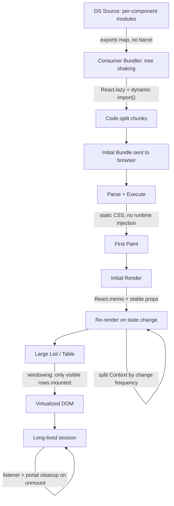

export const metadata = {
  title: "13. Performance",
  description:
    "Bundle size budgets, tree shaking, lazy loading and code splitting, CSS performance, rendering performance, context optimization, virtualization and memory usage.",
};

# 13. Performance

## Definition

**Design system performance** is the discipline of controlling the cost a
component library imposes on every application that consumes it — bundle
bytes shipped over the wire, CPU spent on render and re-render, memory held
by long-lived widgets, and CSS work paid on every paint. It spans two
distinct surfaces that most teams conflate: performance of the *package
itself* (how it's built, what it exports, how much of it tree-shakes away)
and performance of the *components at runtime* (how they render, re-render,
and clean up inside a real application with real data volumes). A design
system that is "fast" only in its own Storybook but slow inside a 500-row
data table in a consumer app has not solved the problem it exists to solve.

## Problem Statement

Every other engineering team at a company writes code that affects *their*
app. A design system team writes code that affects *every* app. That
asymmetry is the whole problem. If a product engineer adds a 40kb dependency
to a feature page, one page gets 40kb heavier. If a design system engineer
adds the same dependency inside a `<DatePicker>` that fifty consuming teams
import, and that import isn't isolated behind a code-split boundary, fifty
apps get 40kb heavier — and the design system team, sitting upstream of all
of them, usually has no idea it happened until someone notices Lighthouse
scores dropping three sprints later.

The same asymmetry shows up at runtime. A `<Badge>` or `<Icon>` component is
the kind of thing nobody profiles, because in isolation it renders in
under a millisecond. But design systems don't ship components in isolation
— they ship components that get dropped into data tables, virtualized
lists, and dashboards where the same leaf component might render five
hundred or five thousand times on a single screen. A component that is
individually cheap becomes collectively expensive the moment it's used at
the scale a design system is *built* for. This is the central inversion of
this chapter: design system performance work is not about making any one
component fast, it's about making the multiplication safe.

## Why Does This Exist?

Performance engineering became a first-class design-system discipline
because three things happened roughly together industry-wide:

1. **Design systems succeeded at their actual job.** Once a design system
   is adopted broadly — Polaris across every Shopify admin surface, Carbon
   across every IBM Cloud console, an internal system across forty product
   squads — every kilobyte and every wasted render in a shared primitive is
   now paid by every one of those surfaces, simultaneously. Success
   converts "small inefficiency" into "systemic tax."
2. **JavaScript bundle sizes became a boardroom metric.** As React
   applications grew, the industry converged on Core Web Vitals (LCP, INP,
   CLS) as things Google search ranking, ecommerce conversion rate, and
   internal tool adoption all correlate with. A design system sits directly
   upstream of a consuming app's Time to Interactive, whether the DS team
   thinks about it or not.
3. **CSS-in-JS's runtime cost became visible at scale.** Libraries like the
   original `styled-components` runtime made authoring ergonomic but paid
   for it with style recalculation on every render — invisible on a
   component demo page, very visible on a page rendering a thousand styled
   nodes. This is the direct historical driver behind the industry's move
   toward zero-runtime CSS, covered in depth in
   [Styling Architecture](/chapters/styling-architecture).

Performance work in a design system, in other words, exists because the
system's entire value proposition — reuse — is also its entire performance
risk. Reuse is a force multiplier in both directions.

## Historical Context

Early component libraries (roughly 2015–2018, the jQuery-UI-to-React
transition era) shipped as a single monolithic bundle: one script tag, one
`dist/bundle.js`, every component always included whether you used three of
them or thirty. Tree shaking wasn't yet reliable — Babel-transpiled CommonJS
modules can't be statically analyzed for dead code the way ES modules can —
so "importing one component" usually meant "downloading the whole library."

The shift to ES modules (`import`/`export`) as the standard authoring and
publishing format, combined with bundlers gaining static analysis
capability (Rollup pioneered this, Webpack 2 followed with `sideEffects`
support in 2017, esbuild and Vite's Rollup-based build later made it the
default expectation), made per-component tree shaking practical. Design
systems responded by restructuring their package layout around it — this is
covered from the packaging side in
[Packaging](/chapters/packaging) and revisited here from the *consumer's*
side, which is where tree shaking actually succeeds or fails.

CSS-in-JS had its own arc. `styled-components` (2016) and Emotion (2017)
made co-locating styles with components dramatically more ergonomic than
hand-maintained CSS Modules, and design systems adopted them heavily through
the late 2010s. By the early 2020s, teams running these libraries at scale
(large marketing sites, data-dense admin tools) started publishing profiling
data showing runtime style injection as a measurable chunk of render time,
which drove the rise of zero-runtime alternatives — Vanilla Extract (2021),
Panda CSS (2023) — that do the same authoring-time colocation but compile to
static CSS ahead of time.

Virtualization tooling followed a similar maturation curve:
`react-virtualized` (2016) was the first widely adopted solution but shipped
as one large, opinionated package covering grids, lists, and tables with a
sizeable API surface. `react-window` (2019, same author, deliberately
smaller) stripped it down to a lean primitive. TanStack Virtual (2023,
successor to `react-virtual`) went further and became headless and
framework-agnostic, giving a design system full control over markup and
styling while TanStack owns only the windowing math. Design systems today
typically build their virtualized `<List>`/`<Table>` primitive on top of one
of these rather than hand-rolling viewport math.

Bundle budget tooling followed the same trajectory as linting: `bundlesize`
(2016) was the first popular "fail CI if the bundle grows" tool; `size-limit`
(2018) generalized it with pluggable checks (including actual runtime
execution time, not just byte count); `bundlewatch` added GitHub PR
commenting with per-file diffs. By the early 2020s, gating PRs on a
component-level gzip budget was standard practice at design-system-mature
companies, the same way gating on test coverage had become standard a
decade earlier.

## How It Works Internally

### Tree shaking from the consumer's side, precisely

[Packaging](/chapters/packaging) covers how a design system *authors* its
build to be tree-shakeable. Here's what actually happens on the *consumer's*
bundler when they write:

```ts
import { Button } from "@acme/ui";
```

The consumer's bundler (webpack, Rollup, esbuild, whatever their app uses)
performs static analysis on the ES module graph rooted at that import. It
asks: which exports of `@acme/ui` are actually referenced, and can the
modules that produce the *unreferenced* exports be proven side-effect-free
and therefore safely deleted? If yes, dead code elimination removes them
from the final bundle. If the bundler cannot prove that, it keeps them —
"maybe used" is treated as "used," because deleting code that runs a
side effect (e.g., a module-scope `document.body.classList.add(...)`, or a
CSS-in-JS library injecting a stylesheet at import time) would change
runtime behavior, and a bundler will never risk that silently.

This is exactly where **barrel files** — an `index.ts` that re-exports
every component from one place —  quietly defeat the whole mechanism:

```ts
// packages/ui/src/index.ts — the barrel
export * from "./Button";
export * from "./DatePicker"; // pulls in date-fns, ~25kb
export * from "./RichTextEditor"; // pulls in a whole editor engine, ~180kb
export * from "./Badge";
// ...120 more components
```

A consumer writing `import { Button } from "@acme/ui"` is, from the
bundler's point of view, importing from the *barrel module*, not from
`Button.tsx` directly. To tree-shake away `DatePicker` and
`RichTextEditor`, the bundler has to prove that evaluating those modules
has no observable side effects. In practice this frequently fails, for a
few concrete reasons:

- **CommonJS interop.** If any dependency in the chain (a lot of npm
  packages still ship CJS, or dual-format packages get resolved to their
  CJS build under certain conditions) is not a real ES module, static
  analysis can't see through it at all — the whole subgraph is included.
- **The `sideEffects` field is missing or wrong.** Without an accurate
  `"sideEffects": false` (or an accurate array of the files that *do* have
  side effects) in `package.json`, most bundlers default to the
  conservative assumption that any module might have side effects, and
  keep it.
- **Component-level module side effects.** A component file that registers
  something in a module-scope side effect (icon registries, CSS-in-JS
  `injectGlobal`, analytics auto-instrumentation) is, correctly, not safe
  to drop — but that correctness spreads to everything else re-exported
  from the same barrel if the bundler can't isolate it per-file.

The fix is structural, not a bundler flag: **give every component its own
importable subpath**, so a consumer's import statement points directly at
the module they need, with no barrel in between.

```json
// packages/ui/package.json
{
  "name": "@acme/ui",
  "exports": {
    "./button": {
      "types": "./dist/button.d.ts",
      "import": "./dist/button.mjs",
      "require": "./dist/button.cjs"
    },
    "./date-picker": {
      "types": "./dist/date-picker.d.ts",
      "import": "./dist/date-picker.mjs",
      "require": "./dist/date-picker.cjs"
    }
  },
  "sideEffects": false
}
```

```ts
// consumer app — imports exactly one component's module graph
import { Button } from "@acme/ui/button";
```

Now there is no ambiguity for the bundler to resolve: `@acme/ui/button`
*is* the Button module, full stop. Nothing from `DatePicker` or
`RichTextEditor` is even parsed, let alone included. Some design systems
additionally keep a convenience barrel for DX (`import { Button } from
"@acme/ui"`) — that's fine *as long as* the barrel itself only re-exports
already-side-effect-free modules and the `sideEffects: false` claim is
actually true, which is worth a CI check (see
[Packaging](/chapters/packaging) for `publint`/`are-the-types-wrong`-style
validation), because a false claim silently strips code your components
actually need at runtime.

### Lazy loading and code splitting

Some components are expensive but rarely rendered on first paint — a
`<DatePicker>` behind a "pick a date" button a user might never click this
session, or a `<RichTextEditor>` that only mounts once someone opens a
comment box. Shipping their full weight in the initial bundle taxes every
page load to benefit a page interaction that may never happen. `React.lazy`
combined with `Suspense` defers the download until the component is
actually about to render:

```tsx
import { lazy, Suspense } from "react";

// The dynamic import() is the split point — the bundler emits
// date-picker.[hash].js as its own chunk, only fetched when this
// module is actually evaluated (i.e., when RichTextEditor first renders).
const RichTextEditor = lazy(() => import("./RichTextEditor"));

export function CommentBox() {
  const [expanded, setExpanded] = useState(false);
  return expanded ? (
    <Suspense fallback={<EditorSkeleton />}>
      <RichTextEditor />
    </Suspense>
  ) : (
    <button onClick={() => setExpanded(true)}>Write a comment</button>
  );
}
```

The design-system-specific nuance: a *consumer* of your library decides
when a heavy component is worth lazy-loading in their app, but you as the
DS author decide whether it's even *possible* — if `RichTextEditor` and
`Button` are both exported from one non-code-split module graph, no amount
of consumer-side `React.lazy` wrapping saves them from paying for
`RichTextEditor`'s dependencies, because they're statically bundled
together upstream. Subpath exports (above) are the enabling structure;
`React.lazy` is what a consumer layers on top of it.

### CSS performance: runtime injection vs static extraction

[Styling Architecture](/chapters/styling-architecture) covers the full
landscape of CSS approaches; the performance-specific mechanism is this.
Runtime CSS-in-JS libraries generate class names and inject `<style>` rules
*during* render — the first time a given prop combination is seen, the
library serializes styles to a string, hashes it to a class name, and calls
something equivalent to `styleSheet.insertRule()`. That insertion forces
the browser to invalidate its cached style computations for the affected
subtree, which the browser then has to redo. On a single Button that's
unmeasurable. In a table body rendering five hundred `<Badge variant={...}>`
cells where `variant` varies per row, if the library isn't caching
per-variant output correctly, you can end up paying that recalculation cost
hundreds of times per render pass.

Static/zero-runtime CSS (Vanilla Extract, Panda CSS, or plain CSS Modules
with token-driven CSS variables) sidesteps this entirely: class names and
their rules are generated at *build time*. At runtime, applying a class name
to an element is just a DOM attribute write — the browser already has the
rule parsed and cached, no injection, no recompute-on-first-use cost. This
is the single biggest reason design systems built for high-density,
data-heavy surfaces (admin tools, data tables, dashboards) have converged on
zero-runtime CSS over the last several years.

The second CSS performance axis is **selector cost at cascade scale**. A
selector like `.Table .Row .Cell.active .Badge` requires the browser to walk
right-to-left through the DOM tree checking each compound condition on every
style recalculation; deeply nested, high-specificity selectors get more
expensive to match as the DOM grows. Design systems that emit
low-specificity, flat class selectors (one class per component, no nesting)
avoid this by construction. **Cascade layers** (`@layer`) help here too,
independent of the specificity story covered in
[Styling Architecture](/chapters/styling-architecture): layers let you keep
every rule at low, flat specificity — because layer *order* resolves
precedence instead of selector complexity — which keeps the browser's
selector-matching cost bounded even as the design system's stylesheet grows
into the thousands of rules.

### Rendering performance: the leaf-component-in-a-list problem

React re-renders a component whenever its parent re-renders, unless that
component is memoized *and* its props are referentially stable. A
`<Badge>` inside a table row looks trivial in isolation, but consider what
happens when a table with a search input re-renders on every keystroke: if
`Badge` isn't wrapped in `React.memo`, every one of the five hundred `Badge`
instances in that table re-renders on every keystroke too, even though
`Badge`'s own props (a status string, a color) never changed. This is a
real, extremely common design-system bug class, and it's why profiling
matters more here than almost anywhere else in the codebase — it doesn't
show up until a component gets used at production data volume.

The tool for catching it is the **React DevTools Profiler**: record a
render pass (typing into that search box, say), and look at the flame graph
for a "commit" that shows five hundred `Badge` bars lit up when the
underlying badge data didn't change. The Profiler's "why did this render"
panel (available via the `<Profiler onRender>` API or the DevTools ranked
view) will point at "parent re-rendered, props unchanged" as the cause,
which is the specific signature memoization exists to eliminate.

### Context optimization, deepened

[React Architecture](/chapters/react-architecture) introduces Context
splitting; the performance-specific detail is about **value identity**.
Every component that calls `useContext(MyContext)` re-renders whenever the
*value* passed to `MyContext.Provider` changes identity — not when the
specific field a component reads changes, when the *whole object* the
provider passes gets a new reference. This trips people up constantly:

```tsx
// Anti-pattern: a brand-new object every render means every consumer
// re-renders on every render of the provider, regardless of which
// field they actually read.
function TableProvider({ children }: { children: ReactNode }) {
  const [selectedIds, setSelectedIds] = useState<Set<string>>(new Set());
  const [sortColumn, setSortColumn] = useState<string>("name");

  return (
    <TableContext.Provider
      value={{ selectedIds, setSelectedIds, sortColumn, setSortColumn }}
    >
      {children}
    </TableContext.Provider>
  );
}
```

`selectedIds` changes on nearly every user interaction (checking a row);
`sortColumn` changes rarely. Bundled into one context value, a component
that only cares about the sort column re-renders on every row selection.
The fix is to split state that changes at different *frequencies* into
separate contexts, so a consumer only subscribes to the churn rate it
actually needs — worked in full in the Implementation Example below.

### Virtualization mechanism

A `<Table>` with ten thousand rows, rendered naively, creates ten thousand
real DOM nodes — most of them scrolled out of view and invisible, but the
browser still has to lay them out, paint them (if not clipped), and hold
them in memory. Virtualization (windowing) renders only the DOM nodes for
rows currently inside (plus a small overscan buffer around) the visible
viewport, and uses a spacer/transform to make the scrollbar behave as if
all ten thousand rows existed. Concretely: the library measures (or
estimates) each row's height, computes which row indices fall inside
`[scrollTop, scrollTop + viewportHeight]`, renders only those rows
absolutely positioned (via `transform: translateY(...)`) at their correct
offset, and adjusts a single tall spacer element so the total scrollable
height matches what the full, unvirtualized list would have been. As the
user scrolls, the library recomputes the visible index range and swaps
which rows are actually mounted — old rows unmount, new ones mount, DOM
node count stays roughly constant regardless of total row count.

### Memory usage: cleanup in mount/unmount-heavy components

`<Tooltip>` and `<Popover>` are the components most likely to leak memory
in a design system, because they typically (a) attach a global event
listener (mousemove, scroll, resize, or an outside-click listener) and (b)
render into a portal — a DOM node outside the component's own React tree.
If the listener isn't removed and the portal node isn't cleaned up when the
component unmounts, every Tooltip a user has ever hovered over during a
session accumulates a dangling listener and orphaned DOM node, which is
exactly the shape of leak that shows up as an app slowing down over a long
session rather than crashing outright. The fix is a `useEffect` cleanup
function that mirrors every subscription made on mount — worked in full
below, and verified in Chrome DevTools by taking two heap snapshots (before
and after repeatedly opening/closing a hundred tooltips) and diffing
retained object counts; a healthy component shows the count return to
baseline, a leaking one shows it climb monotonically.

## Architecture

The diagram below places every technique in this chapter at the specific
point in the pipeline — from source code to a rendered, scrolled,
long-lived screen — where it intervenes.



Reading it left to right: tree shaking and code splitting act *before* a
byte reaches the browser. Static CSS and initial-render memoization act at
*first paint*. Context splitting and `React.memo` act on every
*subsequent* re-render. Virtualization acts on *DOM node count* once a list
is showing real production data volume. Memory cleanup acts across the
*whole lifetime* of a session, independent of any single render. Treating
these as one undifferentiated "performance" bucket is a mistake — each one
requires a different technique, a different profiling tool, and fails
silently in a different way.

## Real-World Example

Data-dense admin surfaces are where every technique in this chapter earns
its keep simultaneously, and it's worth walking through a composite,
realistic scenario that mirrors what teams running large order/issue/ticket
tables (the kind of surface Shopify's admin, Atlassian's Jira, and similar
enterprise tools all have) routinely run into.

A design system ships a `<Table>` built from `<Row>`, `<Cell>`, and
`<Badge>` primitives. A consuming team renders an order list with two
thousand rows, each with a status `Badge`. Three independent problems
compound:

1. The table has a live search box wired directly to the same component
   tree as the rows (no debouncing, no isolation) — every keystroke
   re-renders the whole tree, and because `Badge` isn't memoized, two
   thousand `Badge` re-renders fire on every character typed. React DevTools
   Profiler shows this immediately as a wide, uniform band of two thousand
   near-identical bars on every commit.
2. All two thousand rows are mounted as real DOM nodes at once (no
   virtualization), so beyond the re-render cost, the browser is also
   holding two thousand rows in layout and paint — scrolling itself becomes
   janky independent of any React work.
3. Each `Badge`'s color mapping is computed inline
   (`style={{ background: STATUS_COLORS[status] }}`) using a runtime
   CSS-in-JS call rather than a static class, so each of those two thousand
   renders also pays a style-injection cost on top of the reconciliation
   cost.

The fix compounds in the same order the problems do: memoize `Badge` so an
unrelated search-box re-render doesn't cascade into it; virtualize the row
list with a TanStack Virtual–backed `<Table>` primitive so only ~20–30 rows
are ever mounted regardless of total row count; and move `Badge`'s color
mapping to a static, token-driven CSS class instead of a runtime style
object. None of the three fixes alone gets the table back to 60fps
scrolling and sub-16ms keystroke response — it's the composition of all
three, because each one addresses a different cost that adds when the other
two are present.

## Implementation Example

### 1. Bundle budgets enforced in CI with size-limit

```json
// .size-limit.json — one entry per public entry point, not one for
// the whole package, so a regression is attributed to the exact
// component that caused it.
[
  {
    "name": "@acme/ui/button",
    "path": "dist/button.mjs",
    "limit": "2 KB"
  },
  {
    "name": "@acme/ui/date-picker",
    "path": "dist/date-picker.mjs",
    "limit": "8 KB"
  },
  {
    "name": "@acme/ui/data-table",
    "path": "dist/data-table.mjs",
    "limit": "6 KB"
  }
]
```

```yaml
# .github/workflows/size-check.yml
name: bundle size
on: [pull_request]
jobs:
  size:
    runs-on: ubuntu-latest
    steps:
      - uses: actions/checkout@v4
      - uses: pnpm/action-setup@v4
      - run: pnpm install --frozen-lockfile
      - run: pnpm build
      # Fails the check (not just warns) if any entry exceeds its
      # budget, and posts the per-entry diff as a PR comment so the
      # author sees exactly which component regressed and by how much.
      - uses: andresz1/size-limit-action@v1
        with:
          github_token: ${{ secrets.GITHUB_TOKEN }}
```

A PR that adds `date-fns` as an unguarded default import to `DatePicker`
now fails CI with a specific, attributable diff — `@acme/ui/date-picker: 8
KB → 33 KB (+25 KB)` — before it ever merges, rather than showing up as an
unexplained regression in a consuming app's Lighthouse score three sprints
later.

### 2. Subpath exports fixing the barrel-file tree-shaking failure

```ts
// BEFORE — packages/ui/src/index.ts, the barrel every component
// re-exports through. A consumer importing only Button pulls the
// entire module graph behind every other export in this file too,
// because the bundler cannot prove the unused exports are safe to drop.
export * from "./Button";
export * from "./DatePicker";
export * from "./RichTextEditor";
```

```ts
// AFTER — package.json exports map gives each component its own
// resolvable entry point. Consumers import directly from it, so the
// bundler's module graph for `import { Button } from "@acme/ui/button"`
// contains only Button's own dependencies.
```

```json
{
  "exports": {
    "./button": { "import": "./dist/button.mjs", "types": "./dist/button.d.ts" },
    "./date-picker": { "import": "./dist/date-picker.mjs", "types": "./dist/date-picker.d.ts" },
    "./rich-text-editor": { "import": "./dist/rich-text-editor.mjs", "types": "./dist/rich-text-editor.d.ts" }
  },
  "sideEffects": false
}
```

### 3. Lazy loading a heavy, rarely-used primitive

```tsx
// packages/ui/src/DatePicker/DatePicker.lazy.tsx
// The DS ships an explicit lazy wrapper so consumers get code
// splitting "for free" without having to know date-fns lives behind
// this component — they don't have to write React.lazy themselves.
import { lazy, Suspense, type ComponentProps } from "react";

const DatePickerImpl = lazy(() =>
  import("./DatePicker").then((m) => ({ default: m.DatePicker }))
);

export function DatePicker(props: ComponentProps<typeof DatePickerImpl>) {
  return (
    <Suspense fallback={<DatePickerSkeleton />}>
      <DatePickerImpl {...props} />
    </Suspense>
  );
}

function DatePickerSkeleton() {
  // Matches the real component's footprint so layout doesn't shift
  // once the chunk finishes loading and Suspense resolves.
  return <div className="dp-skeleton" style={{ height: 40, width: 240 }} />;
}
```

### 4. Static CSS instead of runtime style objects for a high-cardinality leaf

```ts
// Badge.css.ts — Vanilla Extract, compiled to static CSS at build
// time. Every variant's rule already exists in the stylesheet before
// the app ever runs; applying a class name at runtime is just a DOM
// attribute write, not a style-injection call.
import { style, styleVariants } from "@vanilla-extract/css";
import { tokens } from "../tokens.css";

export const base = style({
  display: "inline-flex",
  alignItems: "center",
  borderRadius: tokens.radius.full,
  fontSize: tokens.fontSize.sm,
  paddingInline: tokens.space[2],
});

export const variant = styleVariants({
  success: { background: tokens.color.successSurface, color: tokens.color.successText },
  warning: { background: tokens.color.warningSurface, color: tokens.color.warningText },
  danger: { background: tokens.color.dangerSurface, color: tokens.color.dangerText },
});
```

```tsx
// Badge.tsx — memoized, and props are stable primitives (a string
// enum), which is what makes React.memo's shallow comparison actually
// succeed instead of silently doing nothing.
import { memo } from "react";
import { base, variant } from "./Badge.css";

type BadgeProps = {
  status: "success" | "warning" | "danger";
  children: React.ReactNode;
};

function BadgeImpl({ status, children }: BadgeProps) {
  return <span className={`${base} ${variant[status]}`}>{children}</span>;
}

// React.memo only pays off if callers pass stable props. If a caller
// does `<Badge status={status}>{formatLabel(status)}</Badge>` where
// formatLabel returns a new string reference every render, memo still
// works here because strings are compared by value, not identity —
// this is precisely why Badge accepts primitives, not objects.
export const Badge = memo(BadgeImpl);
```

### 5. Context split by change frequency

```tsx
// TableContext.tsx — two contexts instead of one, split by how often
// their values change. Row-selection state churns on every click;
// the setters/sort handlers never change identity after mount. A row
// that only renders a sort indicator subscribes to StableTableContext
// and never re-renders when the user checks a different row.
import { createContext, useContext, useMemo, useState, type ReactNode } from "react";

type SelectionState = { selectedIds: ReadonlySet<string> };
type TableActions = {
  toggleRow: (id: string) => void;
  sortColumn: string;
  setSortColumn: (col: string) => void;
};

const SelectionContext = createContext<SelectionState | null>(null);
const ActionsContext = createContext<TableActions | null>(null);

export function TableProvider({ children }: { children: ReactNode }) {
  const [selectedIds, setSelectedIds] = useState<Set<string>>(new Set());
  const [sortColumn, setSortColumn] = useState("name");

  const toggleRow = useCallback((id: string) => {
    setSelectedIds((prev) => {
      const next = new Set(prev);
      next.has(id) ? next.delete(id) : next.add(id);
      return next;
    });
  }, []);

  // Actions object is memoized so its identity is stable across
  // renders that only change selectedIds — consumers of ActionsContext
  // (e.g. a sort-header component) don't re-render on row selection.
  const actions = useMemo(
    () => ({ toggleRow, sortColumn, setSortColumn }),
    [toggleRow, sortColumn]
  );

  const selection = useMemo(() => ({ selectedIds }), [selectedIds]);

  return (
    <ActionsContext.Provider value={actions}>
      <SelectionContext.Provider value={selection}>
        {children}
      </SelectionContext.Provider>
    </ActionsContext.Provider>
  );
}

export function useTableSelection() {
  const ctx = useContext(SelectionContext);
  if (!ctx) throw new Error("useTableSelection must be used within TableProvider");
  return ctx;
}

export function useTableActions() {
  const ctx = useContext(ActionsContext);
  if (!ctx) throw new Error("useTableActions must be used within TableProvider");
  return ctx;
}
```

### 6. Virtualized list primitive on TanStack Virtual

```tsx
// VirtualizedTable.tsx — the design system's windowed table primitive.
// Only rows inside the viewport (plus overscan) are ever mounted;
// scroll position and total height are simulated via a spacer element
// so native scrollbar behavior is preserved for arbitrary row counts.
import { useRef } from "react";
import { useVirtualizer } from "@tanstack/react-virtual";

type Row = { id: string; name: string; status: "success" | "warning" | "danger" };

export function VirtualizedTable({ rows }: { rows: Row[] }) {
  const parentRef = useRef<HTMLDivElement>(null);

  const virtualizer = useVirtualizer({
    count: rows.length,
    getScrollElement: () => parentRef.current,
    estimateSize: () => 44, // px per row, refined after first measure
    overscan: 8, // render a buffer above/below viewport to hide pop-in on fast scroll
  });

  return (
    <div ref={parentRef} className="vtable-viewport" role="table" aria-rowcount={rows.length}>
      <div style={{ height: virtualizer.getTotalSize(), position: "relative" }}>
        {virtualizer.getVirtualItems().map((virtualRow) => {
          const row = rows[virtualRow.index];
          return (
            <div
              key={row.id}
              role="row"
              aria-rowindex={virtualRow.index + 1}
              style={{
                position: "absolute",
                top: 0,
                left: 0,
                width: "100%",
                height: virtualRow.size,
                transform: `translateY(${virtualRow.start}px)`,
              }}
            >
              <span role="cell">{row.name}</span>
              <Badge status={row.status}>{row.status}</Badge>
            </div>
          );
        })}
      </div>
    </div>
  );
}
```

<Callout type="warning" title="Virtualization and accessibility don't come free">
  A virtualized list only has a handful of rows in the DOM at any moment,
  which means screen readers relying on `aria-rowcount`/`aria-rowindex`
  need those attributes kept accurate as rows mount and unmount, and
  keyboard navigation (Home/End/PageDown) needs to programmatically scroll
  the virtualizer *and* move focus, not just one or the other. See
  [Accessibility](/chapters/accessibility) for the full pattern — treat
  virtualization as an accessibility feature to build, not a performance
  feature that happens to also need accessibility bolted on after.
</Callout>

### 7. Cleanup in a portal-based Tooltip

```tsx
// useTooltip.ts — every subscription made on mount has a matching
// teardown in the effect's cleanup function. This is the difference
// between a Tooltip that's cheap to open a thousand times in a
// session and one that leaks a listener + a portal node every time.
import { useEffect, useRef, useState } from "react";
import { createPortal } from "react-dom";

export function useTooltip() {
  const [open, setOpen] = useState(false);
  const anchorRef = useRef<HTMLElement>(null);
  const portalNodeRef = useRef<HTMLDivElement | null>(null);

  useEffect(() => {
    if (!open) return;

    // Create the portal node lazily, only while open, and remove it
    // on cleanup — an always-mounted portal node for every Tooltip
    // instance a user has ever hovered is the classic leak shape here.
    const node = document.createElement("div");
    document.body.appendChild(node);
    portalNodeRef.current = node;

    const handleScroll = () => setOpen(false);
    const handleOutsideClick = (e: MouseEvent) => {
      if (!anchorRef.current?.contains(e.target as Node)) setOpen(false);
    };

    window.addEventListener("scroll", handleScroll, { capture: true, passive: true });
    document.addEventListener("mousedown", handleOutsideClick);

    return () => {
      window.removeEventListener("scroll", handleScroll, { capture: true });
      document.removeEventListener("mousedown", handleOutsideClick);
      document.body.removeChild(node);
      portalNodeRef.current = null;
    };
  }, [open]);

  return { open, setOpen, anchorRef, portalNodeRef };
}
```

Verifying this actually works is a DevTools exercise, not a code-review
guess: open Chrome DevTools → Memory → take a heap snapshot, programmatically
open and close a Tooltip a hundred times, force a GC, take a second
snapshot, and diff retained object counts filtered to the component's
constructor name. A correct implementation returns to baseline; a leaking
one shows the count climbing linearly with open/close cycles.

## Advantages

- **Compounding savings.** A 5kb reduction in a component used by forty
  consuming apps is a 200kb aggregate saving across the org — the same
  multiplier that makes DS performance bugs expensive makes DS performance
  fixes disproportionately valuable.
- **Regressions caught upstream.** CI-enforced budgets catch a bloat-causing
  dependency before it ships, rather than relying on forty separate app
  teams each independently noticing and reporting a slowdown.
- **One virtualization implementation, correctly accessible, instead of
  forty.** Consuming teams get a working windowed table without each
  reinventing viewport math and its accessibility pitfalls.
- **Credibility.** A design system that visibly performs well under real
  data volume earns adoption faster than one that only looks good in a
  three-row Storybook example — this is a genuine adoption lever, not just
  an engineering nicety (see [Governance](/chapters/governance) on adoption
  strategy).

## Disadvantages

- **CI budget maintenance is its own ongoing cost.** Budgets need
  revisiting as legitimate feature growth happens; a stale, too-tight
  budget generates false-positive failures that erode trust in the check
  and get overridden, defeating its purpose.
- **Virtualization adds real complexity.** Dynamic row heights, sticky
  headers, and accessible keyboard navigation are all harder inside a
  virtualized container than a plain DOM list; smaller consuming teams
  sometimes reasonably opt out for lists that will never exceed a few
  hundred rows.
- **Aggressive memoization has its own cost.** `React.memo`'s comparison
  isn't free — over-applying it to components with naturally unstable
  props (a new object literal every render, for example) adds a
  comparison cost on every render *without* preventing the re-render it
  was meant to prevent, which is strictly worse than no memoization.
- **Premature optimization risk.** Building a fully virtualized,
  context-split, lazy-loaded component before any consumer has hit the
  scale that requires it is wasted engineering effort the org pays for
  immediately in exchange for a benefit that may never materialize.

## Alternatives

Virtualization is the clearest case in this chapter where a design system
has several credible library choices, each trading off differently. Below
is the comparison; the same ten-dimension format applies if you're
evaluating bundle-budget tooling (size-limit vs. bundlewatch vs.
bundlesize) or CSS approaches, both covered in
[Styling Architecture](/chapters/styling-architecture) and
[Packaging](/chapters/packaging) respectively.

| Dimension | react-window | react-virtualized | TanStack Virtual | No virtualization + CSS `content-visibility` |
| --- | --- | --- | --- | --- |
| What problem it solves | Lean windowing for fixed/variable-size lists and grids | Full-featured windowing incl. sticky rows, arbitrary layouts | Headless windowing primitive, framework-agnostic core | Lets the browser skip layout/paint for off-screen content without any windowing library |
| Why it was created | Same author's leaner rewrite of react-virtualized, targeting bundle size | First mainstream React virtualization solution (2016) | Successor to react-virtual; generalized beyond React to Vue/Solid | Native CSS feature (`content-visibility: auto`), no JS needed |
| Performance | Excellent; ~2-6kb, minimal render overhead | Good, but larger API surface adds weight | Excellent; near react-window, more flexible measurement | Good for paint/layout skip, but all DOM nodes still exist (no memory saving) |
| Developer experience | Simple API, limited to what it directly supports | More features but more configuration surface | Headless — full control, more code to write yourself | Zero API — just a CSS property, but no scroll-position virtualization |
| Learning curve | Low | Medium | Medium-high (headless requires understanding the model) | Very low |
| Community / ecosystem | Very high, React ecosystem default for years | High but largely superseded by react-window | Rapidly growing, TanStack brand backing | N/A — native CSS, browser support only |
| Maintenance burden | Low; stable, small API | Higher; larger surface, more edge cases | Low-medium; you own more integration code | None — no library dependency |
| Enterprise suitability | High — most design systems' default choice | Declining — largely legacy usage | High — increasingly the default for new builds | Only for moderate lists (hundreds, not tens of thousands) |
| When to choose it | Standard fixed or estimable-height lists/tables | Legacy codebases already using it, or need its specific sticky-grid features | New builds wanting full control of markup/a11y, or non-React targets | Lists too small to justify a dependency but large enough that paint cost matters |
| When NOT to choose it | Highly irregular row heights without measurement | New projects — react-window/TanStack Virtual supersede it | Teams wanting a batteries-included component, not a primitive | Any list needing true DOM-count reduction (huge lists, memory-constrained devices) |

Large product companies overwhelmingly build their design system's
`<List>`/`<Table>` primitive on **react-window or TanStack Virtual** rather
than `react-virtualized`, because a design system's whole job is to hand
consumers a *small, controlled* API surface — react-virtualized's larger
surface area works against that goal even though it's capable of more.
Teams that adopted design systems more recently (2023+) lean toward
**TanStack Virtual specifically because it's headless**: a design system
already owns markup and styling (that's the point of the system), so a
virtualization library that tries to also own markup, the way
react-virtualized partially does, is fighting the design system rather than
serving it. `content-visibility: auto` is not a substitute for either — it
doesn't reduce DOM node count or memory, only paint/layout cost — but it's
a legitimate, dependency-free choice for lists that are long enough to want
*some* browser help but not long enough (low thousands of rows) to justify
committing to a virtualization primitive and its accessibility overhead.

## Tradeoffs

Every technique in this chapter trades something for its performance gain,
and stating the gain without the cost is how a design system ends up with
performance work nobody wants to maintain:

- **Budget strictness vs. shipping velocity.** A tight CI budget catches
  real regressions but also blocks legitimate growth (a new required a11y
  feature that adds 300 bytes); budgets need a documented process for
  raising them deliberately, not just failing silently forever.
- **Lazy loading vs. perceived latency.** Deferring `RichTextEditor`'s
  chunk until it's rendered saves everyone who never opens it, but costs
  the person who *does* open it a network round-trip they wouldn't have
  paid with eager loading — mitigated with a skeleton, not eliminated.
- **Virtualization vs. implementation complexity and accessibility risk.**
  Windowing a table is a real engineering investment with real ongoing
  a11y obligations (see the callout above); a consuming team with 200 rows
  and never more is rationally better off with a plain, unvirtualized list.
- **Memoization vs. comparison overhead.** `React.memo` isn't free to
  evaluate; applying it to every leaf component indiscriminately adds a
  shallow-compare cost across the tree even where re-renders were already
  cheap, which is a net loss on components that render rarely or trivially.
- **Zero-runtime CSS vs. authoring flexibility.** Static CSS extraction
  requires compile-time knowledge of every style permutation, which is a
  real constraint compared to runtime CSS-in-JS's ability to interpolate
  arbitrary JS values into styles at render time — see
  [Styling Architecture](/chapters/styling-architecture) for the full
  tradeoff.

## Performance Considerations

Concrete numbers a design system team should be tracking, not vague
aspiration:

- **Per-component gzip budgets.** Core primitives (`Button`, `Badge`,
  `Icon`) should sit in the low single-digit kilobytes gzipped; composite
  components (`DataTable`, `DatePicker`) can budget higher (5–15kb) but
  should still be individually tracked, not lumped into one whole-library
  number that hides which component is responsible for growth.
- **Re-render count, not just render time.** A component rendering in
  0.1ms five thousand times unnecessarily costs more aggregate frame time
  than a component rendering in 5ms once — track *count* via the Profiler's
  commit view, not only per-render duration.
- **Virtualization threshold.** As a rule of thumb, lists under roughly
  100–200 DOM nodes rarely need virtualization; the engineering and
  accessibility cost outweighs the benefit below that. Past that, windowing
  becomes worth the investment, and past a few thousand rows it becomes
  close to mandatory for acceptable scroll performance.
- **CSS injection count in CSS-in-JS setups.** If still using a runtime
  CSS-in-JS library, watch for the specific pathology of unbounded class
  generation — dynamic style values (arbitrary numbers, not a closed set of
  variants) generate a new class on every unique value seen, which can
  leak both memory (the style cache) and injected rule count over a long
  session.

## Scalability Considerations

As a design system grows from a handful of components to hundreds, and from
a handful of consuming teams to dozens, performance work has to move from
one-off audits to standing infrastructure:

- **Historical budget dashboards**, not just pass/fail CI gates — a
  dashboard tracking each component's gzip size over time surfaces slow,
  incremental creep (a 200-byte regression every month for a year) that a
  single-PR budget check would never catch on its own.
- **Virtualization becomes a first-class primitive, not a recipe.** At
  small scale, "here's how to virtualize a list" can live in documentation.
  At scale, with dozens of teams building tables independently, the design
  system needs to *ship* the virtualized `<Table>` itself — otherwise every
  team reinvents (and mis-implements) windowing and its accessibility
  requirements independently.
- **Context-splitting patterns need enforcement, not just guidance.** A
  lint rule flagging a Context provider whose `value` prop is a fresh
  object literal (no `useMemo`) catches the mistake at the point it's
  introduced, which scales far better than relying on code review to catch
  it in every PR across every team touching shared state.
- **Memory leak detection needs to be automated**, not manual DevTools
  sessions run occasionally — a CI step that mounts/unmounts a component
  N times in a headless browser and asserts DOM node count / listener count
  returns to baseline catches leak regressions the same way a snapshot test
  catches visual regressions.

## Common Mistakes

<Callout type="danger" title="Re-exporting everything through one barrel index.ts">
  This is the single most common tree-shaking killer in design system
  packages. It feels like good DX ("one import path for everything") but
  silently defeats dead code elimination for every consumer, every time,
  unless every re-exported module is provably side-effect-free — which in
  practice it rarely is. Use per-component subpath exports as the primary
  import path.
</Callout>

<Callout type="danger" title="Passing inline object or function literals as props to a memoized component">
  `<Badge style={{ color: "red" }} />` or `<Row onSelect={() => select(id)}
  />` creates a new reference every render, which defeats `React.memo`'s
  shallow comparison completely — the memoized component re-renders every
  time regardless, but now also pays the comparison cost. Hoist the value
  with `useMemo`/`useCallback`, or restructure the prop to be a primitive.
</Callout>

<Callout type="danger" title="Forgetting listener/portal cleanup in mount-heavy components">
  A Tooltip or Popover that adds a window listener or creates a portal DOM
  node on mount, without a matching `useEffect` cleanup, leaks one of each
  per open/close cycle. In a long user session this compounds into a
  measurable, hard-to-diagnose slowdown that looks like "the app gets
  sluggish over time" rather than an obvious crash.
</Callout>

<Callout type="danger" title="Virtualizing before you know the container's real height">
  Rendering a virtualizer before its scroll container has a measured height
  (e.g., during SSR or before layout settles) produces an incorrect
  visible-row calculation and a visible layout jump once real measurements
  land. Gate virtualization on a stable, measured container, or provide an
  explicit fixed height up front.
</Callout>

<Callout type="danger" title="Enforcing the same bundle budget on every package indiscriminately">
  A flat "500 bytes max regression" rule applied to both `Icon` (should
  genuinely almost never grow) and `DataTable` (legitimately grows as
  features are added) generates constant false-positive friction on the
  component that's supposed to grow, training the team to routinely
  override the check — which defeats it everywhere, including on the
  components where it actually matters.
</Callout>

## Best Practices

- Structure the package around per-component subpath exports as the
  primary, documented import path; treat any convenience barrel as a
  secondary, audited surface, not the default.
- Enforce bundle budgets in CI at the *individual component* level, with
  budgets set per-component based on its actual role, not one blanket
  number for the whole library.
- Ship a lazy-loading wrapper for genuinely heavy, optionally-rendered
  components (rich text editors, complex date pickers) so consumers get
  code splitting without having to implement it themselves.
- Default to static/zero-runtime CSS for high-cardinality leaf components
  (badges, icons, table cells) where the same component renders hundreds
  of times per screen.
- Memoize leaf components used inside lists and tables by default, and
  design their prop APIs around primitives specifically so that
  memoization can actually succeed.
- Split Context by *change frequency*, not just by logical grouping —
  frequently-changing state and stable actions/config belong in separate
  providers even when they're conceptually related.
- Ship virtualization as a built-in `<Table>`/`<List>` primitive once any
  consumer approaches list sizes in the low thousands, rather than leaving
  every team to hand-roll it.
- Pair every `useEffect` that subscribes to something (listener, portal,
  timer, observer) with a cleanup function in the same effect, and verify
  it with an automated mount/unmount stress test, not just code review.

## Interview Questions

<InterviewQuestion q="Why does a barrel file (index.ts re-exporting everything) hurt tree shaking, mechanically?">
  **What the interviewer is testing:** Whether you understand *why* tree
  shaking fails here, not just that it does — the mechanism, not the
  folklore.

  **Poor answer:** "Barrel files are bad for bundle size."

  **Good answer:** Explains that importing from a barrel routes through a
  module the bundler must statically prove is side-effect-free before it
  can drop unused exports, and that proof frequently fails.

  **Excellent senior answer:** All of the above, plus names the specific
  failure modes — CJS interop breaking static analysis, missing/incorrect
  `sideEffects` field, module-scope side effects in unrelated re-exported
  files — and states the concrete fix (per-component subpath exports via
  the `package.json` `exports` map), not just "avoid barrels."

  **Common mistakes:** Treating it as a bundler bug rather than a
  fundamental limit of static analysis; not knowing the `sideEffects`
  field exists or what it does.
</InterviewQuestion>

<InterviewQuestion q="A design system's Badge component is re-rendering 500 times when a user types in an unrelated search box. Walk me through how you'd diagnose and fix it.">
  **What the interviewer is testing:** Practical profiling skill, not just
  theoretical knowledge of `React.memo`.

  **Poor answer:** "Wrap it in React.memo."

  **Good answer:** Describes using the React DevTools Profiler to confirm
  the re-render cascade and its cause (parent re-render, unmemoized child),
  then applying `React.memo`.

  **Excellent senior answer:** Adds the crucial follow-up — memo alone
  doesn't help if the parent passes unstable props (inline object/function
  literals), so they'd also check the props Badge receives and hoist any
  non-primitive ones with `useMemo`/`useCallback`, then re-profile to
  confirm the fix actually reduced the commit's render count, not just
  assume it worked.

  **Excellent senior answer (continued):** Notes this is a sufficiently
  common pattern in design systems specifically that leaf components used
  in lists should default to accepting primitive props and being memoized,
  rather than fixing it reactively per incident.

  **Common mistakes:** Applying `React.memo` without checking prop
  stability and declaring victory without re-profiling.
</InterviewQuestion>

<InterviewQuestion q="When would you NOT virtualize a list, even though you have the tooling available?">
  **What the interviewer is testing:** Judgment about when an optimization
  isn't worth its cost — not just knowledge that the optimization exists.

  **Poor answer:** "Virtualization is always good for lists."

  **Good answer:** States that small lists (under a couple hundred rows)
  don't need it — the DOM/paint cost is negligible and virtualization adds
  real complexity.

  **Excellent senior answer:** Names the specific added costs that make it
  a real tradeoff, not a free win — dynamic row height measurement,
  keyboard navigation and screen reader `aria-rowindex` bookkeeping, sticky
  header interaction — and states that below the threshold where those
  costs matter, a plain list is the better engineering choice.

  **Common mistakes:** Presenting virtualization as strictly better with no
  downside; not mentioning the accessibility implications at all.
</InterviewQuestion>

<InterviewQuestion q="Explain the performance difference between runtime CSS-in-JS and zero-runtime CSS, and why it matters more for a design system than a typical app.">
  **What the interviewer is testing:** Understanding of the actual
  mechanism (style injection cost) and the multiplier argument specific to
  design systems.

  **Poor answer:** "Zero-runtime CSS is faster."

  **Good answer:** Explains that runtime CSS-in-JS injects styles during
  render (cost paid per unique style combination seen), while zero-runtime
  CSS is generated at build time (cost paid once, at build).

  **Excellent senior answer:** Ties it to the design-system-specific
  amplifier — a leaf component like Badge rendered hundreds of times per
  screen pays the injection cost hundreds of times if not cached correctly,
  which a typical one-off app component never encounters at that
  cardinality — and cites this as the real driver behind the industry
  move toward Vanilla Extract/Panda CSS in high-density UI, cross-referring
  to [Styling Architecture](/chapters/styling-architecture).

  **Common mistakes:** Treating this as a purely stylistic/DX preference
  rather than a measurable runtime cost difference.
</InterviewQuestion>

<InterviewQuestion q="How would you set and enforce a bundle size budget for a design system, and what would make you change it?">
  **What the interviewer is testing:** Whether you can operationalize a
  performance goal into process, not just state that budgets are good.

  **Poor answer:** "I'd add a size check to CI."

  **Good answer:** Describes per-component budgets (e.g. via size-limit) in
  a PR-gating CI check, sized to each component's actual role.

  **Excellent senior answer:** Adds that budgets need differentiated
  thresholds (a stricter budget on `Icon` than on `DataTable`), a
  documented process for deliberately raising a budget when growth is
  legitimate, and a historical dashboard to catch slow creep that no single
  PR-level check would flag — and connects this to the trust cost of a
  too-strict budget causing teams to routinely override it.

  **Common mistakes:** Proposing one flat budget for the entire library;
  not accounting for legitimate growth needing a raise process.
</InterviewQuestion>

<InterviewQuestion q="What's the difference between Context re-rendering a consumer and a component actually needing to update?">
  **What the interviewer is testing:** Precise understanding of Context's
  subscription model, deepened from the general React Architecture
  discussion into the performance-specific implication.

  **Poor answer:** "Context causes re-renders."

  **Good answer:** Explains that any consumer of a Context re-renders when
  the *value passed to the Provider* changes identity, regardless of which
  field of that value the consumer actually reads.

  **Excellent senior answer:** Gives the fix — splitting a single Context
  into multiple contexts partitioned by change frequency, so a component
  that only reads a rarely-changing field (like a stable action/setter)
  subscribes to a Context that itself rarely changes — and notes the
  `useMemo`-wrapped provider value is necessary but not sufficient without
  that split, referencing [React Architecture](/chapters/react-architecture)
  for the base pattern.

  **Common mistakes:** Assuming `useMemo` on the Provider's value alone
  solves the fan-out problem without also splitting by frequency.
</InterviewQuestion>

## Manager-Level Questions

<ManagerQuestion q="A consuming team says your design system component is 'slow.' How do you approach the conversation and the investigation?">
  **What the interviewer is testing:** Whether you treat this as a
  collaborative diagnostic problem or get defensive/dismissive.

  **Poor answer:** "I'd ask them to send a repro and look into it
  eventually."

  **Good answer:** Describes gathering specifics (which component, at what
  data scale, what does "slow" mean — load time, interaction lag, scroll
  jank) and reproducing it with the Profiler before concluding anything.

  **Excellent senior answer:** Frames it as a shared investigation, not an
  accusation in either direction — the DS team owns the component's
  intrinsic cost, the consuming team owns how they use it (unmemoized
  wrapper, unvirtualized 10k-row list), and the fix is often on both sides.
  Mentions building the finding into a documented pattern or a shipped
  primitive afterward so the next team doesn't hit the same issue.

  **Common mistakes:** Assuming fault lies with either side before
  profiling; treating it as a one-off fix rather than an opportunity to fix
  the pattern for everyone.
</ManagerQuestion>

<ManagerQuestion q="How do you decide where to invest limited engineering time between new component development and performance hardening of existing ones?">
  **What the interviewer is testing:** Prioritization judgment and the
  ability to make a performance investment case in business terms.

  **Poor answer:** "Performance is always the priority."

  **Good answer:** Describes using data — bundle budget dashboards,
  reported incidents, usage-at-scale patterns — to identify which
  components are both high-usage and currently underperforming, rather
  than optimizing uniformly or by gut feel.

  **Excellent senior answer:** Frames the investment in multiplier terms —
  a fix to a component used by forty teams returns more organizational
  value per engineering hour than a new component used by two — and
  describes setting an explicit, negotiated budget (e.g., 20% of sprint
  capacity) for hardening work so it doesn't get perpetually deprioritized
  against visible feature requests, which is a common failure mode on DS
  teams specifically.

  **Common mistakes:** No prioritization framework at all; treating
  performance work as something squeezed in only after all feature
  requests are satisfied.
</ManagerQuestion>

<ManagerQuestion q="Your bundle-size CI check is starting to get routinely overridden by teams under deadline pressure. What do you do?">
  **What the interviewer is testing:** Whether you address the underlying
  trust/process problem or just re-tighten the technical gate.

  **Poor answer:** "Make the check impossible to override."

  **Good answer:** Investigates why it's being overridden — stale budgets
  causing false positives are a common root cause — and recalibrates
  before assuming the team is being careless.

  **Excellent senior answer:** Distinguishes the two real causes and
  addresses each differently: if budgets are genuinely stale, ship a
  process for reviewed, deliberate budget increases (not ad hoc override);
  if the check is *correct* and being overridden anyway, treats that as an
  incentive/culture problem, not a tooling problem, and raises it with
  managers of the overriding teams directly rather than trying to solve a
  people problem with a stricter gate.

  **Common mistakes:** Escalating the technical strictness of the gate
  without first diagnosing why people are bypassing it.
</ManagerQuestion>

## Summary

Design system performance is different in kind from application
performance because of the multiplier: every byte, every unnecessary
re-render, and every leaked listener is paid not once but once per
consuming surface, at whatever scale that surface operates. This chapter
covered eight concrete mechanisms and their fixes — barrel files silently
defeating tree shaking (fixed with subpath exports), heavy rarely-used
components bloating initial bundles (fixed with `React.lazy` and dynamic
import), runtime CSS-in-JS paying a style-injection cost at high
cardinality (fixed with static/zero-runtime CSS), leaf components
re-rendering needlessly inside lists and tables (fixed with `React.memo`
plus stable, primitive props, verified with the React DevTools Profiler),
Context's all-or-nothing subscription model amplifying re-renders across
unrelated state (fixed by splitting contexts by change frequency), DOM
node count becoming the bottleneck at thousands of rows (fixed with
windowing via react-window or TanStack Virtual), and long-lived
mount/unmount-heavy components like Tooltip and Popover leaking listeners
and portal nodes (fixed with disciplined `useEffect` cleanup, verified with
Chrome DevTools heap snapshots). The throughline across all of them: none
of these problems are visible in isolation or in a component demo — they
only appear at the production data volume and consumer count a design
system is, by definition, built for, which is exactly why they need
deliberate profiling and CI enforcement rather than being caught by
inspection.

**Key takeaways**

- Design system performance work exists because reuse multiplies both
  benefit and cost — a small per-component win compounds across every
  consuming app; a small regression does too.
- Barrel files (`index.ts` re-exporting everything) are the most common
  real-world tree-shaking killer; per-component subpath exports are the
  fix, not a bundler flag.
- Leaf components rendered at high cardinality (Badge, Icon, Cell in a
  table) need `React.memo` plus stable, primitive props by default, and
  static CSS instead of runtime style injection.
- Context re-renders every consumer on value identity change, not on
  field-level relevance — split contexts by how often their state actually
  changes.
- Virtualization (react-window, TanStack Virtual) is close to mandatory
  past a few thousand rows and unnecessary below a couple hundred — know
  the threshold, and budget for its real accessibility cost.
- Bundle budgets and memory-leak checks need to be automated and enforced
  in CI at the individual-component level; manual, occasional audits don't
  scale with the number of components or consumers.
