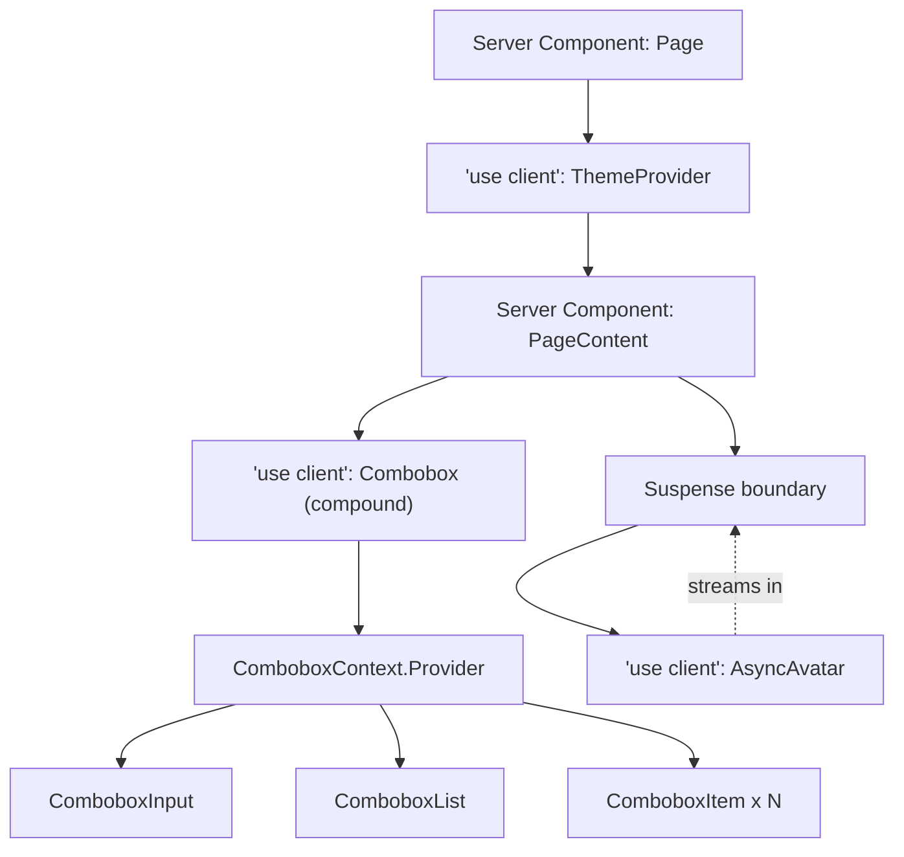

export const metadata = {
  title: "4. React Architecture for Design Systems",
  description:
    "Context and memoization strategy, context splitting, Server Components, concurrent rendering, Suspense, transitions, hydration and streaming SSR for component libraries.",
};

# 4. React Architecture for Design Systems

## Definition

React architecture, in the design-system sense, is the set of framework-level
decisions that never show up in a Figma file but decide whether the system is
fast, correct, and pleasant to consume at scale: how state is shared through
a component tree (Context and its alternatives), how re-renders are
contained (memoization), where the client/server boundary sits (Server
Components), how non-urgent updates are scheduled (concurrent rendering,
`useTransition`), how async state is represented in the render tree
(Suspense), and how server-rendered HTML reconciles with the client-rendered
tree (hydration, streaming). None of this is visible to a designer reviewing
a component in isolation. All of it is a system-wide multiplier: get one
mistake into a primitive like `Select` or `Button`, and every product team
that imports it inherits the mistake, usually without knowing why their app
feels slow.

## Problem Statement

A design system component is imported by definition far more times than any
single application component. A `Button` that's mounted in one feature team's
checkout flow is also mounted in the admin dashboard, the marketing site, the
mobile web wrapper, and a hundred other places nobody on the design system
team has ever looked at. This asymmetry changes the cost-benefit math for
every React performance and architecture decision:

- A re-render that costs 2ms in a normal app component is a rounding error.
  The same 2ms wasted re-render, if it happens inside a design system
  primitive that's mounted 500 times on one page (a data table's cells, a
  form's inputs), becomes a full second of wasted main-thread time.
- A Context provider that re-renders its entire subtree on every state
  change is annoying in a five-component app. In a design system's compound
  component (`Tabs`, `Accordion`, `Menu`), the same pattern means every
  consumer's page re-renders subtrees they never asked to re-render, and the
  design system team gets blamed for a performance regression they can't see
  in their own Storybook.
- Choosing `"use client"` on a primitive that didn't need it doesn't just
  affect that one component's bundle — it forces every ancestor up to the
  nearest Server Component boundary into the client bundle too, because
  Server and Client Components can't interleave arbitrarily (a Server
  Component can render a Client Component, but not the reverse without going
  through `children`).
- A hydration mismatch in a component used on one page is a bug report. The
  same mismatch in a component used everywhere is React silently discarding
  server HTML and re-rendering from scratch on every page in the product,
  which is a Core Web Vitals regression across the whole company.

This is the core problem this chapter addresses: the React-level decisions
that are "good enough" defaults in application code are frequently wrong
defaults in design system code, because the fan-out multiplies both the
benefit of getting them right and the cost of getting them wrong.

## Why Does This Exist?

React's rendering model is intentionally permissive by default — components
re-render, Context propagates to every consumer, and nothing is memoized
unless you ask for it. That default is fine for application code because
application code has natural boundaries: a form re-rendering when its input
changes is expected and cheap. Design systems break that assumption because
they sit at the base of the component tree, wrapping and being wrapped by
everything above them. A `ThemeProvider` sits above the entire application. A
`Button` sits below almost every other component. Both positions are
performance-critical for different reasons — the provider because it decides
who re-renders, the leaf because of sheer instance count — and React gives
you no default protection against either problem. You have to design for it.

The second reason this exists as its own discipline is that React itself has
changed shape underneath design systems in the last several years. Server
Components, concurrent rendering, and the new hydration model didn't exist
when Material-UI, Ant Design, or Chakra UI's original APIs were designed.
Every actively maintained design system has had to retrofit answers to "is
this a Server Component?" and "does this API work under React 18/19's
concurrent scheduler?" onto an API surface that predates both questions. A
design system that gets these questions right up front — as newer entrants
like [Radix UI](/chapters/case-studies), Base UI, and React Aria Components
have — ships a materially better default experience to every consuming team
than one that treats them as an afterthought.

## Historical Context

Class components and the pre-Hooks era pushed cross-cutting state (theme,
locale, form state) through either prop drilling or third-party state
libraries, because `Context` before React 16.3 was an unofficial, unstable
API. The 16.3 `Context` API (`React.createContext`) made Context safe and
idiomatic, and design systems adopted it immediately for exactly the
use case it was built for: low-frequency, broadly-consumed values like theme
and locale. Hooks (16.8) then made local compound-component state trivial to
share via `useContext` instead of the older render-prop or
higher-order-component patterns Material-UI and others had used up to that
point — this is why you'll see older design system source code full of
`withStyles(Component)` HOC wrappers that newer versions replaced with hooks.

React 18 (2022) is the real inflection point for this chapter. It shipped
automatic batching (fewer re-renders by default), the concurrent renderer
(the prerequisite for `useTransition` and `Suspense` for data), and a new
streaming SSR architecture (`renderToPipeableStream`) that changed how
hydration mismatches surface and how much of a page can start rendering
before all data is ready. React 19 (2024) shipped Server Components as a
stable, framework-integrated primitive (via Next.js's App Router and other
RSC-compatible frameworks) — which is the first time "should this design
system component be a Server Component?" became a question every component
API designer has to answer, not just an experimental one. Design systems
built or substantially revised after 2023 — Radix Themes, Base UI, Park UI
(built on Panda CSS, see [Chapter 6](/chapters/styling-architecture)) — treat
RSC-compatibility as a first-class constraint on the API design, not a
migration bolted on afterward.

## How It Works Internally

To make good decisions here you need a working mental model of four
mechanisms: Context propagation, the render/commit cycle, the Server/Client
Component boundary, and hydration.

**Context propagation.** When a `Context.Provider`'s `value` prop changes
(by reference — Context does not deep-compare), React schedules a re-render
for every component that calls `useContext` on that context, *regardless of
whether that component's own props or state changed*. Crucially, this
re-render bypasses `React.memo` on the *consumer* — memoizing a component
does not stop it from re-rendering when a context it reads changes, because
`useContext` subscribes independently of the props/state diff `memo`
performs. This is the single most common design-system performance bug:
wrapping a `MenuItem` in `React.memo` and being confused why it still
re-renders on every keystroke in a searchable menu, when the actual cause is
that it reads `useContext(MenuContext)` and the provider's `value` is a new
object literal on every parent render.

**Render vs. commit.** React's render phase (calling your function
components to produce a new element tree) is not the same as the commit
phase (applying the diff to the DOM). Memoization tools (`React.memo`,
`useMemo`, `useCallback`) only affect the render phase — they let React skip
*calling* a component or *recomputing* a value, they do nothing to the
commit phase. This matters because the "waste" from an unnecessary render is
not primarily DOM mutation (React's diffing means an unchanged subtree
commits nothing), it's the JavaScript execution cost of re-running component
functions, re-running hooks, and re-diffing children — which for a design
system with hundreds of live instances on a page is where the wasted time
actually goes.

**The Server/Client boundary.** Under RSC, the module graph is bifurcated at
build time by the `"use client"` directive. A file with that directive at
the top, and everything it imports, gets bundled for the client and
hydrated in the browser. A file without it is a Server Component: it
executes once on the server (or at build time for static routes), produces
a serialized description of its output, and ships *zero* JavaScript for
itself to the client. The critical internal rule: a Server Component can
import and render a Client Component, but a Client Component cannot import
a Server Component directly — it can only receive one as `children` or
another prop passed down from a Server Component ancestor. This asymmetry is
why the boundary should sit as low in the tree as possible: every Client
Component you declare drags its entire import subtree into the client
bundle, so a `"use client"` directive placed on a component that only needs
it for one `onClick` handler forces its whole visual subtree — icons, text
formatting helpers, layout children — into that bundle too, unless that
subtree is deliberately restructured to be passed in as `children` from a
Server Component parent.

**Hydration.** On the client, React walks the server-rendered DOM and the
client render output *in lockstep*, attempting to reuse existing DOM nodes
and attach event listeners rather than re-creating markup. It compares the
first client render's output against what the server sent down (embedded as
the initial HTML) node by node. If they diverge — different text content,
different attributes, a different element type — React logs a hydration
mismatch, discards the mismatched subtree (or, depending on the mismatch's
location and React's error-recovery heuristics, the whole tree), and
re-renders it client-side from scratch, discarding whatever performance
benefit SSR was supposed to provide for that subtree.

## Architecture

The following diagram shows how these four mechanisms compose in a typical
design-system-consuming page: a Server Component root, a client-boundary
`ThemeProvider`, a compound component with its own internal context, and a
Suspense boundary around an async leaf.



Read this diagram as: the page itself and most static content stay Server
Components (zero client JS), the client boundary is pushed down to exactly
the components that need interactivity or state (`ThemeProvider`,
`Combobox`), the compound component's internal state lives in its own
narrow context rather than leaking into the page's state, and an async leaf
is wrapped in `Suspense` so its fallback can stream in without blocking the
rest of the page. This is the shape every subsequent section in this
chapter is arguing toward.

## Real-World Example

Radix UI's `Select` and `DropdownMenu` primitives are the reference
implementation for the context-splitting and memoization patterns in this
chapter: each compound component ships its own tightly-scoped context
(`createSelectContext`, `createDropdownMenuContext`) rather than a single
shared "design system context," so a `Select`'s open/close state changes
never re-render an unrelated `DropdownMenu` on the same page, and each
context's value is only recomputed when its specific slice of state changes.
React Aria Components (Adobe's headless library, and the successor pattern
Adobe's own [Spectrum](/chapters/case-studies) is migrating toward) goes
further and exposes a *render props* API (`children` as a function receiving
state) specifically to avoid forcing consumers through Context subscription
at all for simple cases — you get the current state as an argument instead
of subscribing to a provider, which sidesteps context re-render fan-out
entirely for components that don't need persistent shared state.

On the Server Components side, shadcn/ui's popularization of the
"copy-paste, not npm-install" distribution model was driven partly by this
exact problem: because consumers own the source in their own repo, they can
freely choose which of a component's parts are Server vs Client Components
for their specific app, instead of inheriting one library author's
one-size-fits-all `"use client"` boundary. Vercel's own component
examples and the Next.js documentation consistently model this by pushing
`"use client"` down to a small `<Interactive>` wrapper around, say, a
`<Tooltip>`'s trigger, while the tooltip's static content stays server
rendered.

## Implementation Example

### Context, scoped correctly

A theme provider is the canonical "yes, use Context" case: the value is
read broadly, changes rarely, and prop-drilling it would be absurd.

```tsx
// theme-context.tsx
// Split into two contexts up front — state and setter — so that a
// component which only calls the setter (a ThemeToggle button) never
// re-renders when the theme value itself changes, and vice versa.
import { createContext, useContext, useMemo, useState, type ReactNode } from "react";

type Theme = "light" | "dark" | "high-contrast";

const ThemeStateContext = createContext<Theme | null>(null);
const ThemeSetterContext = createContext<((theme: Theme) => void) | null>(null);

export function ThemeProvider({
  defaultTheme = "light",
  children,
}: {
  defaultTheme?: Theme;
  children: ReactNode;
}) {
  const [theme, setTheme] = useState<Theme>(defaultTheme);

  // setTheme from useState is already referentially stable across
  // renders, so this "setter" context value never changes identity —
  // consumers of ONLY the setter never re-render after mount.
  return (
    <ThemeSetterContext.Provider value={setTheme}>
      <ThemeStateContext.Provider value={theme}>
        {children}
      </ThemeStateContext.Provider>
    </ThemeSetterContext.Provider>
  );
}

export function useTheme() {
  const theme = useContext(ThemeStateContext);
  if (theme === null) throw new Error("useTheme must be used within ThemeProvider");
  return theme;
}

export function useSetTheme() {
  const setTheme = useContext(ThemeSetterContext);
  if (setTheme === null) throw new Error("useSetTheme must be used within ThemeProvider");
  return setTheme;
}
```

### Compound component internal state — the case for Context

`Tabs` is the canonical compound-component case: `Tabs.List`, `Tabs.Trigger`,
and `Tabs.Content` need to agree on which tab is active without the
consumer manually wiring `active`/`onClick` props onto every child.

```tsx
// tabs.tsx
// Internal context is scoped to THIS Tabs instance only — nesting two
// <Tabs> trees never causes cross-talk, because each <Tabs.Root> creates
// its own Provider rather than reading a module-level singleton context.
import { createContext, useContext, useId, useState, type ReactNode } from "react";

type TabsContextValue = {
  activeValue: string;
  setActiveValue: (value: string) => void;
  baseId: string;
};

const TabsContext = createContext<TabsContextValue | null>(null);

function useTabsContext(component: string) {
  const ctx = useContext(TabsContext);
  if (!ctx) throw new Error(`<Tabs.${component}> must be rendered inside <Tabs.Root>`);
  return ctx;
}

export function Root({
  defaultValue,
  children,
}: {
  defaultValue: string;
  children: ReactNode;
}) {
  const [activeValue, setActiveValue] = useState(defaultValue);
  const baseId = useId();

  return (
    <TabsContext.Provider value={{ activeValue, setActiveValue, baseId }}>
      <div className="tabs-root">{children}</div>
    </TabsContext.Provider>
  );
}

export function List({ children }: { children: ReactNode }) {
  return (
    <div role="tablist" className="tabs-list">
      {children}
    </div>
  );
}

export function Trigger({ value, children }: { value: string; children: ReactNode }) {
  const { activeValue, setActiveValue, baseId } = useTabsContext("Trigger");
  const isActive = activeValue === value;

  return (
    <button
      role="tab"
      id={`${baseId}-tab-${value}`}
      aria-selected={isActive}
      aria-controls={`${baseId}-panel-${value}`}
      tabIndex={isActive ? 0 : -1}
      onClick={() => setActiveValue(value)}
      className={isActive ? "tabs-trigger tabs-trigger--active" : "tabs-trigger"}
    >
      {children}
    </button>
  );
}

export function Content({ value, children }: { value: string; children: ReactNode }) {
  const { activeValue, baseId } = useTabsContext("Content");
  if (activeValue !== value) return null;

  return (
    <div
      role="tabpanel"
      id={`${baseId}-panel-${value}`}
      aria-labelledby={`${baseId}-tab-${value}`}
      tabIndex={0}
    >
      {children}
    </div>
  );
}
```

This is the exact compound-component shape discussed in
[Chapter 3](/chapters/component-architecture) — the point here is narrower:
the context is *private* to this file, scoped per-`Root`-instance, and
carries only what `Trigger`/`Content` need, not the whole design system's
state.

### Memoizing a leaf primitive — why it's higher leverage here than in app code

```tsx
// icon.tsx
// Icon is rendered by nearly every other component in the system —
// buttons, menu items, table cells, badges. Memoizing it is cheap (a
// shallow prop compare on 2-3 primitive props) and the payoff compounds
// with every additional call site, unlike memoizing a one-off app
// component whose payoff is capped at its single usage.
import { memo } from "react";
import { icons, type IconName } from "./icon-registry";

type IconProps = {
  name: IconName;
  size?: 16 | 20 | 24;
  className?: string;
};

function IconImpl({ name, size = 20, className }: IconProps) {
  const IconSvg = icons[name];
  return (
    <IconSvg
      width={size}
      height={size}
      aria-hidden="true"
      className={className}
      focusable="false"
    />
  );
}

export const Icon = memo(IconImpl);
```

```tsx
// button.tsx
// useCallback here is NOT for Button's own render cost — it's so that
// Icon, rendered as a child, and any memoized descendants receive a
// stable onClick reference and don't bail out of their own memoization.
import { memo, useCallback, forwardRef, type ButtonHTMLAttributes } from "react";
import { Icon } from "./icon";
import type { IconName } from "./icon-registry";

type ButtonProps = ButtonHTMLAttributes<HTMLButtonElement> & {
  variant?: "primary" | "secondary" | "danger";
  icon?: IconName;
  isLoading?: boolean;
};

export const Button = memo(
  forwardRef<HTMLButtonElement, ButtonProps>(function Button(
    { variant = "primary", icon, isLoading, disabled, onClick, children, ...rest },
    ref,
  ) {
    const handleClick = useCallback(
      (event: React.MouseEvent<HTMLButtonElement>) => {
        if (isLoading) return;
        onClick?.(event);
      },
      [isLoading, onClick],
    );

    return (
      <button
        ref={ref}
        className={`btn btn--${variant}`}
        disabled={disabled || isLoading}
        aria-busy={isLoading || undefined}
        onClick={handleClick}
        {...rest}
      >
        {icon && !isLoading && <Icon name={icon} size={16} />}
        {isLoading && <Icon name="spinner" size={16} className="btn__spinner" />}
        {children}
      </button>
    );
  }),
);
```

### `useTransition` in a large Combobox

```tsx
// combobox.tsx
// Filtering 5,000+ options synchronously blocks the keystroke that
// triggered it from painting. Marking the filtered-list update as a
// transition lets React keep the input responsive and interrupt the
// filtering work if the user types again before it finishes.
import { useState, useMemo, useTransition, useDeferredValue } from "react";

type Option = { id: string; label: string };

export function Combobox({ options }: { options: Option[] }) {
  const [query, setQuery] = useState("");
  const [isPending, startTransition] = useTransition();
  const deferredQuery = useDeferredValue(query);

  const filtered = useMemo(
    () =>
      options.filter((option) =>
        option.label.toLowerCase().includes(deferredQuery.toLowerCase()),
      ),
    [options, deferredQuery],
  );

  return (
    <div className="combobox">
      <input
        value={query}
        onChange={(event) => {
          const next = event.target.value;
          // The input's own value updates synchronously (urgent) so
          // typing never feels laggy; only the derived list is deferred.
          setQuery(next);
          startTransition(() => {
            /* no-op: useDeferredValue + the transition below cover the
               list re-render; startTransition here signals React that
               any state update this event causes downstream is low
               priority, in case a consumer wraps this in onQueryChange. */
          });
        }}
        aria-expanded="true"
        role="combobox"
        aria-controls="combobox-listbox"
      />
      <ul id="combobox-listbox" role="listbox" aria-busy={isPending}>
        {filtered.map((option) => (
          <li key={option.id} role="option">
            {option.label}
          </li>
        ))}
      </ul>
    </div>
  );
}
```

### Suspense around an async leaf (avatar with remote image + fallback)

```tsx
// avatar.tsx
// AvatarImage suspends via a promise-caching image loader so the
// surrounding layout (name, timestamp) can render and paint immediately
// while only the image itself waits, instead of the whole row blocking.
import { Suspense, use, useMemo } from "react";

const imageCache = new Map<string, Promise<void>>();

function loadImage(src: string): Promise<void> {
  let promise = imageCache.get(src);
  if (!promise) {
    promise = new Promise((resolve, reject) => {
      const img = new Image();
      img.onload = () => resolve();
      img.onerror = reject;
      img.src = src;
    });
    imageCache.set(src, promise);
  }
  return promise;
}

function AvatarImage({ src, alt }: { src: string; alt: string }) {
  use(loadImage(src)); // suspends until resolved
  return ;
}

export function Avatar({ src, alt, initials }: { src?: string; alt: string; initials: string }) {
  const fallback = useMemo(() => <span className="avatar__initials">{initials}</span>, [initials]);

  if (!src) return <div className="avatar">{fallback}</div>;

  return (
    <div className="avatar">
      <Suspense fallback={fallback}>
        <AvatarImage src={src} alt={alt} />
      </Suspense>
    </div>
  );
}
```

### The Server/Client boundary, done right

```tsx
// card.tsx — no "use client" directive: pure presentation, server-renderable.
import type { ReactNode } from "react";

export function Card({ children, footer }: { children: ReactNode; footer?: ReactNode }) {
  return (
    <div className="card">
      <div className="card__body">{children}</div>
      {footer && <div className="card__footer">{footer}</div>}
    </div>
  );
}
```

```tsx
// dismissible-banner.tsx
// Only THIS leaf needs client state (dismissed) and an event handler —
// so only this file gets "use client". Card above stays a Server
// Component and is composed around this client leaf via children.
"use client";

import { useState } from "react";
import { Icon } from "./icon";

export function DismissibleBanner({ children }: { children: React.ReactNode }) {
  const [dismissed, setDismissed] = useState(false);
  if (dismissed) return null;

  return (
    <div role="alert" className="banner">
      <div className="banner__content">{children}</div>
      <button
        aria-label="Dismiss"
        onClick={() => setDismissed(true)}
        className="banner__dismiss"
      >
        <Icon name="close" size={16} />
      </button>
    </div>
  );
}
```

```tsx
// page.tsx (Server Component) — composes the client leaf as children of
// a server-rendered wrapper, so Card's own module graph stays server-only.
import { Card } from "./card";
import { DismissibleBanner } from "./dismissible-banner";

export default function Page() {
  return (
    <Card footer={<span>Updated 2 minutes ago</span>}>
      <DismissibleBanner>
        Your workspace plan is expiring in 3 days.
      </DismissibleBanner>
    </Card>
  );
}
```

### Hydration-safe IDs and content

```tsx
// form-field.tsx
// useId generates an id that's guaranteed identical between the server
// render and the client's first render (React coordinates this via a
// render-tree-position-derived id, not Math.random or a module counter),
// which is what a hand-rolled `id={Math.random()}` or `id={counter++}`
// cannot guarantee across server and client environments.
import { useId, type ReactNode } from "react";

export function FormField({
  label,
  error,
  children,
}: {
  label: string;
  error?: string;
  children: (fieldProps: { id: string; "aria-describedby"?: string }) => ReactNode;
}) {
  const id = useId();
  const errorId = `${id}-error`;

  return (
    <div className="form-field">
      <label htmlFor={id}>{label}</label>
      {children({ id, "aria-describedby": error ? errorId : undefined })}
      {error && (
        <span id={errorId} role="alert" className="form-field__error">
          {error}
        </span>
      )}
    </div>
  );
}
```

```tsx
// relative-time.tsx
// Rendering "3 minutes ago" depends on Date.now() at render time, which
// differs between the server's render moment and the client's hydration
// moment — a guaranteed mismatch. Render the stable, unambiguous value
// on the server and swap to the relative value only after mount.
"use client";

import { useEffect, useState } from "react";

function formatRelative(iso: string): string {
  const diffMs = Date.now() - new Date(iso).getTime();
  const minutes = Math.floor(diffMs / 60000);
  if (minutes < 1) return "just now";
  if (minutes < 60) return `${minutes}m ago`;
  return new Date(iso).toLocaleDateString();
}

export function RelativeTime({ dateTime }: { dateTime: string }) {
  // Server and first client render both show the absolute date — no
  // mismatch is possible because both environments compute the same
  // deterministic string. The relative string is applied post-mount.
  const [display, setDisplay] = useState(() => new Date(dateTime).toLocaleDateString());

  useEffect(() => {
    setDisplay(formatRelative(dateTime));
    const interval = setInterval(() => setDisplay(formatRelative(dateTime)), 60_000);
    return () => clearInterval(interval);
  }, [dateTime]);

  return <time dateTime={dateTime}>{display}</time>;
}
```

<Callout type="tip" title="suppressHydrationWarning is a scalpel, not a bandage">
  `suppressHydrationWarning` only silences the warning for the exact DOM
  node it's applied to, one level deep — it does not suppress React's
  discard-and-re-render behavior for mismatched children, and it does
  nothing at all for structural mismatches (different tag, different
  number of children). Legitimate uses are narrow: a `<time>` element whose
  text content is expected to differ (timestamp formatting, as above) where
  you've deliberately decided the flash is acceptable. Reaching for it to
  silence a mismatch caused by a `window` check or `Math.random()` is
  treating the symptom — fix the actual source of non-determinism instead.
</Callout>

## Advantages

Getting this architecture right buys a design system several compounding
wins. Context splitting turns an O(n) re-render fan-out (every consumer of a
monolithic context re-renders on any change) into an O(1) one (only actual
subscribers of the changed slice re-render), and because design system
context providers sit above entire applications, this difference is often
the entire performance story for a page. Correctly-scoped memoization on
leaf primitives means the design system team can absorb the cost of getting
memoization right *once*, centrally, instead of every consuming team having
to remember to wrap their own usage in `memo`. Pushing the Server/Client
boundary down means consumers on RSC-capable frameworks get a meaningfully
smaller client bundle for free — measured in real migrations, moving
primarily-presentational primitives (`Card`, `Badge`, `Avatar` markup,
`Divider`) out of the client bundle has shaved tens to low hundreds of KB
off first-load JS for consumers who otherwise imported the whole library as
client code. `Suspense` and `useTransition` let async and expensive UI
degrade gracefully — a slow avatar image or a 10,000-option filter no longer
blocks the rest of the page or the keystroke that triggered it. And
hydration-safe patterns (`useId`, deferred relative-time rendering) mean
consuming teams stop filing "flash of wrong content" and "hydration mismatch
warning spam in the console" bugs against components they didn't write and
can't easily debug themselves.

## Disadvantages

None of this is free. Splitting one context into several means more
provider nesting, more files, and a steeper onboarding curve for engineers
new to the codebase who now have to learn *which* context holds *which*
slice of state instead of one obvious `DesignSystemContext`. Aggressive
memoization has a real maintenance cost: `useCallback`/`useMemo` dependency
arrays are a common source of stale-closure bugs, and profiling has to
justify each one — memoizing something that re-renders cheaply anyway adds
comparison overhead for no benefit. The Server/Client boundary decision is
not a one-time cost; every new feature added to a "Server Component-safe"
primitive has to be re-evaluated for whether it introduces a client-only
dependency (an event handler, a browser API, a stateful hook), and getting
this wrong produces a build-time error that's confusing to engineers who
don't yet have a mental model of the RSC module graph. `useTransition` and
`Suspense` both require the whole team to understand React's concurrent
rendering model well enough to reason about when a component can be
interrupted mid-render — a component with a side effect that assumes it
runs to completion (a non-idempotent effect, a mutation inside render) can
produce subtly wrong behavior under concurrent rendering that only shows up
under real user interaction patterns, not in a quick manual test.

## Alternatives

The recurring decision this chapter is really about is: *how should state be
shared across a component tree, and where should the client/server line
be drawn?* For state sharing specifically, Context is the React-native
default, but it's not the only option a design system team reaches for.

| Dimension | React Context | External store (Zustand/Jotai) | Prop drilling / composition | `useSyncExternalStore` custom store |
| --- | --- | --- | --- | --- |
| What problem it solves | Passing a value through the tree without manual prop threading | Cross-tree state with fine-grained subscriptions, outside React's render cycle | Explicit, traceable data flow with zero extra dependency | Subscribing React components to state that lives outside React (browser APIs, external caches) |
| Why it was created | Ship an official replacement for unstable legacy context | Redux felt too heavy for component-local shared state; wanted atom-level subscriptions | Always available — it's just React | React 18 needed a safe way for libraries to read external mutable state under concurrent rendering |
| Performance | Whole-subtree re-render per provider unless manually split | Subscribes per-selector — only re-renders components reading the changed slice | No re-render fan-out risk; cost is purely wiring | As precise as the store's own subscription granularity |
| Developer experience | Built in, no dependency, familiar to every React dev | Small API surface, devtools support, minimal boilerplate | Simplest possible mental model, but gets unwieldy past 3-4 levels | Powerful but low-level; most teams wrap it rather than use it directly |
| Learning curve | Low | Low–medium | Lowest | Medium–high |
| Community / ecosystem | Native — universal | Large, active, well-documented (Zustand, Jotai, Valtio) | N/A | Small; mostly used inside other libraries, not directly by app teams |
| Maintenance burden | Low, but re-render bugs are easy to introduce silently | Low; selector-based API resists the "one big context" trap by design | Grows with tree depth; refactors ripple through prop signatures | Low once written, but the store itself needs careful design |
| Enterprise suitability | High for scoped, well-split usage | High — many production design systems use Zustand for cross-component (not per-instance) state | High for shallow trees; poor fit for deep compound components | High when the state genuinely lives outside React (e.g. a global focus manager) |
| When to choose it | Compound-component-local state, theme/locale, anything read broadly and written rarely | Cross-cutting app-level state a design system needs to *read* (e.g. a toast queue) without re-render fan-out | Small, shallow component trees; when the flow needs to be obvious to a code reviewer | Bridging a non-React state source (browser focus, media queries, external cache) into React safely |
| When NOT to choose it | High-frequency updates (drag position, live text input) shared broadly | Introduces a dependency the design system now owns the version/bundle-size cost of | Deep compound components (`Tabs`, `Menu`) — becomes unmaintainable past 2-3 levels | Building it yourself when a well-tested library already solves the same problem |

In practice, most design systems use Context for everything genuinely
internal to a compound component (this is close to unanimous — Radix,
React Aria, Ariakit, Chakra, MUI's unstyled base all do this) and reach for
an external store only for cross-cutting, app-shaped state that the design
system needs to *observe* rather than own — a global toast/notification
queue is the most common example, because toasts are triggered from
anywhere in the app, not from within a single compound component's subtree,
which is precisely the shape Context handles badly (every toast-triggering
component would need to be a descendant of the toast provider, which isn't
true in a real app). Large companies with framework flexibility requirements
(Shopify's Polaris, Atlassian's Design System) lean toward keeping the
dependency graph minimal and use plain Context plus `useReducer` for
anything more complex than a single piece of state, specifically because an
external store dependency becomes a version-compatibility burden multiplied
across every consuming team the moment it's baked into the library's own
`package.json` dependencies rather than left as a peer choice for the
consumer's app-level state.

## Tradeoffs

Every decision in this chapter is a tradeoff between authoring simplicity
and consumption-time performance, and the right answer skews toward
consumption-time performance more aggressively here than in application
code, because of the fan-out argument from the Problem Statement. Splitting
context costs the design system team an afternoon of refactoring and buys
every consuming team a re-render fix they'll never have to think about.
Pushing `"use client"` down costs the team a design review of "does this
prop introduce a client dependency" on every PR, and buys every RSC-capable
consumer a smaller bundle without them doing anything. The one place this
logic reverses is `useTransition`/`Suspense`: these add real conceptual
overhead (interruptible rendering, idempotency requirements) for components
that are not actually expensive to render — a five-item `<Select>` gains
nothing from `useTransition` and picking it up anyway just adds complexity
consumers have to reason about for no payoff. Reserve concurrent-rendering
APIs for the specific components where the fan-out or data size is large
enough to matter (large `Combobox`/`Select` option lists, data-heavy
`Table` filtering), not as a blanket default.

## Performance Considerations

The measurable levers, in rough order of typical impact for a mature design
system:

1. **Context granularity.** Profile with React DevTools' Profiler tab,
   sort by "why did this render," and look specifically for components
   re-rendering with an unchanged prop diff — that's the signature of a
   context re-render. Splitting a monolithic `DesignSystemContext` into
   `ThemeContext` + `LocaleContext` + `DensityContext` is usually the
   single highest-leverage fix available, because it's O(1) effort against
   an O(n-consumers) payoff.
2. **Leaf memoization with measured payoff.** Memoize components that are
   (a) rendered many times per page and (b) receive stable-ish props most of
   the time. Icon, Avatar, Badge, Chip, table-cell-shaped primitives are the
   textbook cases. Don't memoize components rendered once per page (a page
   header, a modal) — there's no fan-out to recoup the comparison cost.
3. **Bundle size via the Server/Client split.** Run a bundle analyzer
   against a consuming app before and after moving presentational
   primitives out of `"use client"` files. This is the performance win most
   visible to consumers in Lighthouse/Core Web Vitals scores, because it
   directly reduces Total Blocking Time and Time to Interactive.
4. **Deferred/transitioned updates for expensive derived state.**
   `useDeferredValue` and `useTransition` don't make computation faster —
   they make the *input handling* stay responsive while expensive
   computation happens at lower priority. Reach for these only once
   profiling shows an interaction (typing, filtering) is actually janky,
   not preemptively.
5. **Hydration cost.** Every hydration mismatch means React discards and
   re-renders a subtree — measure this with the "Recoverable Errors"
   reporting React 18+ exposes, not just by eyeballing the console, because
   mismatches in production can be silently swallowed by error boundaries
   while still costing the re-render.

See [Chapter 13](/chapters/performance) for the broader bundle-budget and
virtualization discussion this plugs into.

## Scalability Considerations

At small scale (a handful of teams, one product), a slightly-too-broad
context or a missing `memo` is invisible. The problems in this chapter are
specifically *scale* problems: they show up once a design system has enough
consumers that (a) a single page composes dozens of instances of the same
primitive, (b) enough different teams are building on top of the compound
components that nobody remembers the original context shape's intent, and
(c) the org has both RSC and non-RSC consumers simultaneously (a Next.js App
Router app and a Vite SPA both importing the same package), which is
increasingly the normal case for a company mid-migration. Design systems
built to serve this kind of heterogeneous, multi-framework consumer base
generally version their client-boundary decisions carefully — a `"use
client"` directive removed in a minor version is technically a breaking
change for consumers relying on tree-shaking it differently — and treat
context-shape changes as they'd treat any other public API change, because
compound-component context, even though it's "internal," is observable
through behavior (whether nested instances interfere, whether SSR output
matches).

## Common Mistakes

<Callout type="danger" title="Memoizing a component that reads Context">
  Wrapping a component in `React.memo` does nothing to stop it re-rendering
  when a `useContext` value it reads changes — `memo`'s prop comparison and
  Context's subscription model are independent mechanisms. The fix is
  splitting or narrowing the context, not adding more `memo`.
</Callout>

<Callout type="danger" title="A new object/array literal as a context value">
  `<Ctx.Provider value={{ theme, setTheme }}>` creates a brand-new object on
  every render of the provider component, which re-renders every consumer
  every time regardless of whether `theme` actually changed. Memoize the
  value with `useMemo`, or (better, as shown above) split state and setter
  into separate contexts so the setter's identity is trivially stable.
</Callout>

<Callout type="danger" title="'use client' at the top of a barrel file">
  Putting `"use client"` in an `index.ts` that re-exports the entire
  component library forces every component in the package into the client
  bundle for every consumer, even ones only using server-renderable
  primitives. The directive must live on the specific files that need it,
  not on the aggregating export.
</Callout>

<Callout type="danger" title="Reading window/document/Math.random at module or render scope">
  Any of these executed during render produces different output on the
  server (no `window`, no browser `Math.random` seed parity) than on the
  client's first render, guaranteeing a hydration mismatch. Move the check
  into `useEffect` (runs client-only, after hydration) or use `useId` for
  identifiers.
</Callout>

<Callout type="danger" title="Treating useTransition as a performance fix for slow computation">
  `useTransition` reprioritizes *when* a render happens, it doesn't make the
  render itself faster. If filtering 50,000 items genuinely takes 400ms,
  wrapping it in a transition keeps the input responsive but the list still
  takes 400ms to update — the real fix is virtualization (see
  [Chapter 13](/chapters/performance)) or moving the filter off the main
  thread.
</Callout>

## Best Practices

- Default new context to being split by *update frequency and audience*,
  not by "what feels like one concept" — a value that changes often (open
  state) and a value that changes rarely (labels, ids) belong in separate
  contexts even if they're conceptually part of "the same" compound
  component.
- Memoize the context `value` itself with `useMemo`, and memoize consumer
  leaf components with `React.memo`, treating these as two separate, both
  necessary, fixes — one without the other only solves half the problem.
- Default every new component to being a Server Component (no directive);
  add `"use client"` only when the compiler/linter actually forces it
  (event handlers, hooks like `useState`/`useEffect`, browser APIs), and
  push that directive as far down the tree as the interactive requirement
  actually lives, not up at the nearest convenient file.
- Use `useId` for every generated DOM id in a shared component — never a
  module-level counter or `Math.random()`.
- Gate any render-time environment check (`typeof window !== "undefined"`)
  behind `useEffect` + local state, never inline in the render body.
- Reserve `useTransition`/`useDeferredValue`/`Suspense` for components with
  measured (not assumed) cost — profile first, then apply.
- Document the client/server boundary decision in the component's own
  README or Storybook doc page, so consumers on RSC frameworks know without
  reading source whether a component is safe to import into a Server
  Component tree directly.

This dovetails with the API design principles in
[Chapter 3](/chapters/component-architecture) — a component whose props are
designed to avoid forcing client-only patterns (functions, class instances)
onto every consumer stays easier to keep server-renderable as the component
grows.

## Interview Questions

<InterviewQuestion q="A team reports that their page re-renders every design-system Button whenever an unrelated modal opens. Where do you look first?">
  **What the interviewer is testing:** Whether you have the correct mental
  model of Context propagation versus `React.memo`, and can diagnose from a
  symptom back to a root cause rather than guessing at fixes.

  **Poor answer:** "Wrap Button in `React.memo`."

  **Good answer:** Checks whether Button reads a shared context, and
  whether that context's provider re-renders (and produces a new `value`
  reference) when the modal's open state changes.

  **Excellent senior answer:** Explains that `memo` doesn't block
  context-driven re-renders, walks through using the React DevTools
  Profiler's "why did this render" flag to confirm the context is the
  cause, then proposes splitting the context or memoizing the provider's
  value — and notes that if Button doesn't actually read that context,
  the fan-out is coming from somewhere else (an unmemoized parent, a new
  `style` object prop) and describes how they'd verify which.

  **Common mistakes:** Reaching for `memo` as a reflexive fix without
  diagnosing whether the cause is Context, an unstable prop reference, or
  actual state change; not knowing that `memo` and Context are independent
  mechanisms.
</InterviewQuestion>

<InterviewQuestion q="When should a design-system component be a Server Component versus a Client Component, and what happens if you get it wrong?">
  **What the interviewer is testing:** Understanding of the RSC module
  graph and its concrete, not just theoretical, consequences.

  **Poor answer:** "Interactive components are client, everything else is
  server."

  **Good answer:** States the rule correctly and adds that a Client
  Component's entire import subtree gets bundled for the client too.

  **Excellent senior answer:** Explains the asymmetry (Server can render
  Client, not the reverse without `children`), why the boundary should sit
  as low as possible, and walks through a concrete failure mode: a
  `"use client"` on a barrel `index.ts` pulling the whole library into every
  consumer's client bundle regardless of which components they actually use
  interactively.

  **Excellent senior answer (cont.):** Also mentions the forced-waterfall
  cost — a Client Component ancestor can't easily fetch data server-side
  for its Server Component children the way a fully server-rendered tree
  can, so an overly-high client boundary can also cost data-fetching
  parallelism, not just bundle size.

  **Common mistakes:** Thinking `"use client"` only affects that one file's
  own bundle contribution; not knowing the composition-via-children
  escape hatch exists at all.
</InterviewQuestion>

<InterviewQuestion q="Why might you choose useCallback on a design-system Button's internal click handler even if profiling shows Button itself renders fast?">
  **What the interviewer is testing:** Whether the candidate understands
  memoization as a *propagation* tool, not just a self-optimization tool.

  **Poor answer:** "It always helps performance."

  **Good answer:** Says it keeps the reference stable for memoized children
  (like an internal Icon) so they don't bail out of their own `memo` check.

  **Excellent senior answer:** Notes the actual leverage argument — Button
  itself might render in under a millisecond, but it's instantiated
  hundreds of times per page across every consumer, so a stable callback
  reference that lets a memoized Icon skip re-render is a small win
  multiplied by every Button on every page in every consuming app, which is
  categorically different math than the same optimization in a one-off app
  component.

  **Common mistakes:** Applying `useCallback` reflexively everywhere
  without being able to say what specifically it prevents downstream; not
  recognizing that `useCallback` with an empty/wrong dependency array can
  introduce stale-closure bugs, which is the real cost side of this
  tradeoff.
</InterviewQuestion>

<InterviewQuestion q="Explain a hydration mismatch: what is it mechanically, and give a concrete design-system example along with the fix.">
  **What the interviewer is testing:** First-principles understanding of
  SSR/hydration, not just pattern-matching "use useEffect."

  **Poor answer:** "It's when the server and client don't match, wrap it in
  useEffect."

  **Good answer:** Explains React compares server HTML to first client
  render node-by-node and discards mismatched subtrees, and gives an
  example like a randomly generated id or a `Date.now()`-based render.

  **Excellent senior answer:** Gives the `useId` fix for generated ids
  specifically (not just "use useEffect", since `useId` solves it without
  a client-only re-render at all), explains the relative-time pattern
  (render deterministic value first, swap after mount), and states
  precisely what `suppressHydrationWarning` does and does not cover — that
  it silences the warning one node deep and doesn't fix structural
  mismatches.

  **Common mistakes:** Treating `suppressHydrationWarning` as a general
  fix rather than a narrow, deliberate tool; not knowing `useId` exists as
  the purpose-built solution for the id-generation case.
</InterviewQuestion>

<InterviewQuestion q="Your Combobox has 8,000 options and users report the input feels laggy while typing. Walk through your fix.">
  **What the interviewer is testing:** Whether the candidate can correctly
  sequence concurrent-rendering tools against the actual bottleneck instead
  of reaching for a keyword.

  **Poor answer:** "Add useTransition."

  **Good answer:** Profiles first to confirm the filter computation, not
  something else, is the bottleneck; separates the input's own value
  (kept synchronous/urgent) from the filtered list (deferred).

  **Excellent senior answer:** Uses `useDeferredValue` on the query fed
  into the filter (or `startTransition` around the state update that
  triggers it), explains this doesn't make the filter faster — it just lets
  the keystroke's own re-render finish before the expensive list
  re-computation runs — and states that if 8,000 items is still slow after
  deferring, the real fix is virtualization (rendering only visible rows),
  which is a separate, complementary technique.

  **Common mistakes:** Believing `useTransition`/`useDeferredValue` reduce
  computation cost rather than reschedule it; not mentioning virtualization
  as the actual fix for genuinely large lists.
</InterviewQuestion>

<InterviewQuestion q="Why do many modern headless component libraries expose state via render props (children as a function) as an alternative to Context?">
  **What the interviewer is testing:** Breadth beyond "always use Context"
  — awareness of the fan-out tradeoff Context introduces even when scoped.

  **Poor answer:** "Render props are more flexible."

  **Good answer:** Notes that render props hand the consumer state directly
  as a function argument, avoiding a subscription mechanism entirely for
  simple cases.

  **Excellent senior answer:** Connects it back to the re-render fan-out
  problem: a `useContext` subscription re-renders on *any* context value
  change even if the consuming component only reads one field, whereas a
  render-props API gives the consumer exactly the values it destructures,
  with no hidden subscription — and notes the real cost (deeper JSX
  nesting, less familiar API shape to engineers used to hooks-only
  libraries) as the reason not every library defaults to it.

  **Common mistakes:** Dismissing render props as "old React" without
  understanding the specific re-render-avoidance reason they persist in
  new, actively-designed APIs like React Aria Components.
</InterviewQuestion>

## Manager-Level Questions

<ManagerQuestion q="Your design system's next major version needs to add Server Component support. How do you plan and stage that rollout across dozens of consuming teams?">
  **What the interviewer is testing:** Ability to sequence a
  framework-level migration as an organizational problem, not just a
  technical refactor.

  **Poor answer:** "Ship it in the next major version and tell teams to
  upgrade."

  **Good answer:** Proposes auditing components for client-only
  dependencies first, then shipping the RSC-compatible boundary as an
  additive, backward-compatible change where possible.

  **Excellent senior answer:** Separates "components that can become
  server-renderable with zero API change" (ship immediately, non-breaking)
  from "components whose public API needs to change" (batch into the next
  major, with a codemod and migration guide per
  [Chapter 11](/chapters/governance)), sets up a canary consumer on the
  RSC-capable framework before general rollout, and defines a rollback plan
  if a "server-safe" component turns out to have a hidden client dependency
  once real consumer traffic exercises it.

  **Common mistakes:** Treating this as purely a big-bang major version
  instead of finding the non-breaking subset; not accounting for consumers
  who aren't on an RSC-capable framework at all and need the package to
  keep working for them unchanged.
</ManagerQuestion>

<ManagerQuestion q="An engineer on your team wants to add a third-party state management library as a dependency of the design system, to simplify some cross-component state. How do you evaluate that request?">
  **What the interviewer is testing:** Judgment about dependency ownership
  and the asymmetric cost of adding dependencies to a widely-consumed
  package versus application code.

  **Poor answer:** "If it makes the code cleaner, approve it."

  **Good answer:** Weighs the bundle-size and version-compatibility cost
  against the internal simplification, and asks whether Context can solve
  it with acceptable performance first.

  **Excellent senior answer:** Frames it explicitly as: every dependency
  added to the design system's `package.json` becomes every consuming
  team's transitive dependency too, with a version this team now owns
  keeping compatible across the whole consumer base — a cost application
  code doesn't pay. Distinguishes "state genuinely internal to one
  compound component" (Context, no new dependency needed) from "state that
  legitimately crosses the whole app" (a peer dependency the *consumer*
  chooses, not one baked into the library).

  **Common mistakes:** Evaluating the request only on code-quality
  grounds without pricing in the org-wide dependency cost; not considering
  a peer-dependency structure as a middle ground.
</ManagerQuestion>

<ManagerQuestion q="A consuming team files a P1 bug: hydration mismatch warnings flooding their production console after upgrading your design system. How do you triage and respond?">
  **What the interviewer is testing:** Incident response process combined
  with technical depth — can they lead this to a real root cause fast, and
  communicate correctly under pressure.

  **Poor answer:** "Tell them to add suppressHydrationWarning."

  **Good answer:** Asks for a minimal repro, checks the changelog for
  components touched in the upgrade that render ids, dates, or
  environment-dependent values.

  **Excellent senior answer:** Treats "flooding the console" as a signal
  the mismatch is in a broadly-used primitive, not a one-off — prioritizes
  accordingly, reproduces locally with the same React version, bisects the
  changelog to the offending commit, and distinguishes a real fix (root
  cause: non-deterministic render) from a stopgap (`suppressHydrationWarning`
  as a same-day mitigation while the real fix ships) — communicating both
  timelines clearly to the reporting team rather than presenting the
  stopgap as the resolution.

  **Common mistakes:** Shipping `suppressHydrationWarning` as the permanent
  fix; not recognizing that "flooding the console" implies broad blast
  radius and should affect prioritization versus a rare edge case.
</ManagerQuestion>

## Summary

React's default rendering model — Context propagating broadly, nothing
memoized unless asked, a permissive client/server boundary, synchronous
rendering — is tuned for application code, where mistakes are locally
contained. A design system inverts that assumption: because every primitive
is instantiated far more times than any application component, and every
context provider sits above entire product trees, the same "good enough"
defaults become system-wide performance and correctness bugs. The fixes are
consistent across all four mechanisms covered here: narrow the scope of
what re-renders (split Context by update frequency, memoize high-fan-out
leaves), push boundaries down and out (client directives on the smallest
possible files, `Suspense` around genuinely-async leaves only), and make
render output deterministic between server and client (`useId`, deferred
non-deterministic values) rather than reaching for warning-suppression as a
first resort. None of these are exotic React features — every tool
discussed here (`memo`, `useMemo`, `useCallback`, `useTransition`,
`Suspense`, `useId`) is documented, mainstream API. The skill this chapter
is really teaching is recognizing *which* of these problems you have from a
symptom, and applying the fix at the layer (Context shape, boundary
placement, determinism) that actually caused it rather than reaching for
the nearest keyword.

**Key takeaways**

- `React.memo` and Context subscriptions are independent mechanisms —
  memoizing a context consumer does not stop it re-rendering when the
  context value changes; you have to split or narrow the context itself.
- Memoizing a design-system leaf (Icon, Avatar, Button) has outsized
  leverage compared to app code because of instance fan-out — the same
  small saving compounds across every usage site in every consuming app.
- Default new components to Server Components; add `"use client"` only
  where actually required, and push the directive as far down the tree as
  possible — never on a barrel/index file.
- `useTransition`/`useDeferredValue`/`Suspense` reschedule work, they don't
  make it faster — profile to confirm a real cost before reaching for them,
  and pair large-list problems with virtualization instead.
- Hydration mismatches come from non-deterministic render output (ids,
  dates, `window`/`Math.random` checks); fix the source with `useId` or
  deferred client-only rendering — reserve `suppressHydrationWarning` for
  narrow, deliberate cases, never as a default fix.
- These are organizational decisions as much as technical ones: a dependency,
  a context shape, or a client boundary added to the design system's public
  surface becomes every consuming team's cost to carry, not just this
  team's.
