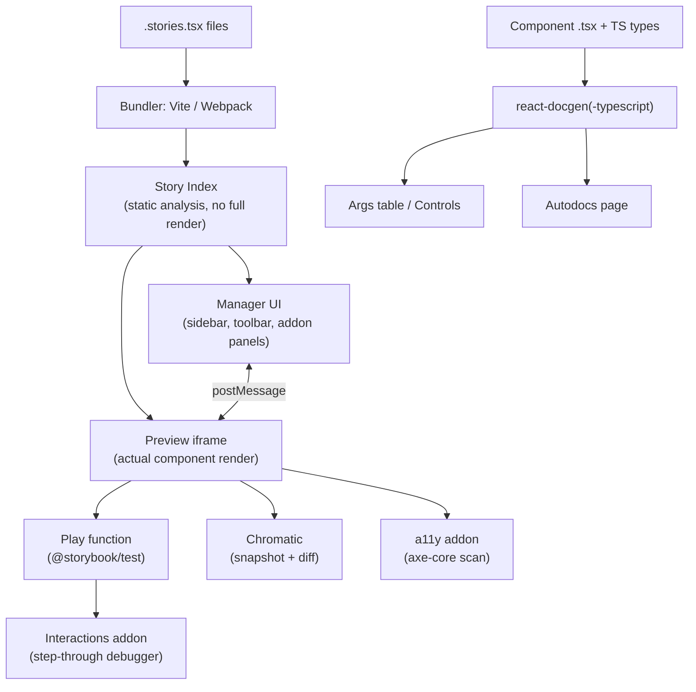

export const metadata = {
  title: "7. Storybook",
  description:
    "Component Driven Development, CSF, args and controls, autodocs, play functions and interaction tests, Chromatic visual regression, and the accessibility addon.",
};

# 7. Storybook

## Definition

**Storybook** is a workshop environment for building, viewing, and testing
UI components in isolation from the application(s) that consume them. A
**story** is a single, named rendering of a component in one state — one
combination of props, one piece of data, one interaction sequence — and a
component typically has many stories (`Default`, `Loading`, `Disabled`,
`WithError`, `LongLabel`). Storybook compiles every story into a
standalone, addressable page, wraps them in a shared UI (the sidebar,
canvas, and addon panel), and layers tooling on top — controls, docs
generation, interaction testing, accessibility auditing, visual diffing —
that turns the story set into the primary review and QA surface for a
design system.

## Problem Statement

Say you're building a `Combobox` component with async search, multi-select,
keyboard navigation, an error state, and a max-selection limit. To see the
"5 items selected, at the max limit, one item has a validation error" state
in a real application, you'd need to: find or fake the right backend
response, navigate to the screen that uses this combobox, drive the UI
through five interactions to reach that exact state, and hope a page reload
during development doesn't reset you back to square one. Multiply that by
every state combination across every component in the library, and by every
reviewer or designer who needs to independently verify the same states
before sign-off — the app-navigation tax makes exhaustive review
economically impossible. Teams respond by *not* reviewing edge-case states,
which is exactly where design systems break down in practice: the demo
looks right, the disabled-and-loading combo three clicks deep does not.

There's a second, sharper version of this problem specific to design
systems: your components are consumed by *other people's* applications,
which you often don't have running locally and can't easily drive into a
target state. A design system needs a way to develop and demonstrate a
component's full state surface with zero dependency on any consuming app.
That's the gap Storybook fills — an environment where "loading, with an
error, at max width, in dark mode" is one click in a sidebar, not a
scripted sequence through a product you don't own.

## Why Does This Exist?

Storybook was created in 2016 (originally as a fork of `react-storybook`
inside the Kadira team, later independently maintained) explicitly to solve
component isolation for React, and it generalized from there to Vue,
Angular, Svelte, and Web Components. The motivating insight was that
**component development and application development have different unit of
work**: an app developer cares about a screen, a design system engineer
cares about a component's full prop/state matrix. Trying to develop and
review design-system components inside an app forces app-shaped workflows
(routing, data fetching, screen composition) onto a fundamentally
component-shaped problem.

The deeper reason it stuck — and became close to the default tool in this
space — is organizational, not just technical. A design system sits between
two disciplines that don't share a codebase: design and engineering.
Storybook's rendered, URL-addressable story ("here's the `Button` in its
`disabled` + `loading` state, share this link") became the first *shared
artifact* both sides could point at, comment on, and treat as the ground
truth for "does the implementation match the design." Before Storybook (or
similar tools), that ground truth was either a Figma file that drifted from
the shipped code, or a staging URL of a whole app that buried the component
inside unrelated context.

## Historical Context

Storybook's evolution tracks the evolution of component-driven React
itself. Early versions (v1–v3, 2016–2018) used a `storiesOf()` imperative
API and were primarily a dev-time visual playground — useful, but discarded
in CI because there was no story format a build tool could statically
analyze. **CSF (Component Story Format)**, introduced with Storybook 5.2
in 2019, changed that: stories became plain ES module exports, which meant
tooling (bundlers, docs generators, test runners) could statically discover
every story without executing Storybook itself. **CSF3**, shipped with
Storybook 7 (2023), simplified the format further — stories became plain
objects instead of functions, args became the default way to configure a
story, and the boilerplate needed per story dropped by roughly half.

Storybook 7 (2023) was the bigger architectural shift: **Autodocs** moved
from an addon bolted onto stories to a first-class, story-driven mechanism;
Vite became a first-class builder alongside Webpack, cutting Storybook's
own startup and rebuild time dramatically for large component libraries;
and the testing surface (play functions, the interactions addon) matured
enough that teams began treating Storybook as a legitimate part of the test
suite, not just a docs/demo tool. Storybook 8 (2024) unified the testing
story further by standardizing on `@storybook/test` (a wrapper around
`@testing-library/dom` and `vitest`'s expect) so the same assertion syntax
works inside a play function and inside a standalone test file — closing
the gap between "a story" and "a test" almost entirely. This is also the
period Chromatic — built by the same core team as Storybook — became the
default pairing for visual regression, because it consumes stories directly
with no separate test-authoring step.

## How It Works Internally

Storybook is, mechanically, a static site generator plus a dev server built
around one core idea: **a story is a pure function of args to a rendered
component**. At build (or dev-server start) time, Storybook:

1. **Discovers** every `*.stories.tsx` file matching the glob in
   `.storybook/main.ts`.
2. **Statically analyzes** each file's exports via its bundler (Vite or
   Webpack) to build an index of every story — its title, args, and
   metadata — without fully executing application code. This index is
   what powers the sidebar and search instantly, even in a library with
   thousands of stories.
3. **Renders** the requested story's default export (the `Meta`) merged
   with the individual story's `args` into the framework's real render
   function (`ReactDOM.render` under the hood for the React renderer) inside
   an iframe (`preview-iframe.html`), isolated from Storybook's own UI
   chrome (the "manager"). This iframe/manager split is deliberate: the
   manager (sidebar, toolbar, addon panels) and the preview (your actual
   component) run in separate execution contexts communicating over
   `postMessage`, so an addon reading React DevTools-style data from your
   component can't accidentally leak Storybook's own React tree, and a
   crash in your component doesn't take down the whole UI.
4. **Extracts type information** for Controls and Autodocs via
   `react-docgen-typescript` (or the lighter `react-docgen` for plain JS),
   which parses your component's TypeScript prop types statically — this
   is the same mechanism that also powers the auto-generated docs, covered
   below.

This architecture is why Storybook scales to component libraries with
hundreds of components and thousands of stories without every developer's
laptop grinding to a halt: only the story index needs to be built eagerly;
individual story modules are code-split and loaded on demand by the
bundler, and Storybook 7+'s Vite builder specifically leans on native ESM
so a story's dev-server startup and HMR cost is close to instant regardless
of how many *other* stories exist in the repo.

## Architecture



The important structural point this diagram makes: **stories are the
single input that every downstream tool consumes** — docs, controls,
interaction tests, visual regression, and accessibility checks all derive
from the same story definitions rather than from separately maintained
artifacts. That single-source property is what prevents docs drift (see
[Autodocs](#autodocs) below) and is the main architectural argument for
adopting Storybook over hand-rolling a docs site plus a separate test
suite plus a separate manual QA checklist.

## Real-World Example

Shopify's Polaris, Adobe's Spectrum, IBM's Carbon, and Atlassian's design
system all publish a public Storybook (or a Storybook-derived docs site) as
their canonical component reference — not incidentally, but because it's
the artifact both their internal consumers and their own design/engineering
review loop already use daily. Atlassian in particular has spoken publicly
about using Storybook plus Chromatic as the *release gate* for their
`@atlaskit` packages: a PR that changes a shared primitive (say, a token
consumed by `Button`) cannot merge until Chromatic shows every affected
story's visual diff has been explicitly accepted by a human, which turns an
otherwise invisible cascading regression into a concrete, reviewable diff
list. This is the pattern most large orgs converge on: Storybook is not
"the place developers preview components" so much as "the shared surface
design and engineering both sign off against before a component ships."

## Implementation Example

### Component Driven Development in practice

**Component Driven Development (CDD)** is the methodology Storybook is
built to support: build UI bottom-up, starting from the smallest
independent pieces (atoms: `Icon`, `Text`, `Button`) and composing upward
into molecules (`FormField` = `Label` + `Input` + `HelperText`) and
eventually screens — verifying each layer in isolation *before* composing
it into the next. This deliberately mirrors a design system's own
hierarchy (see [Chapter 1](/chapters/what-is-a-design-system) on
primitive vs. composite layers): a `Button`'s states are fully specified
and reviewed as a story before anyone builds the `Dialog` that uses three
buttons in a footer, so a bug in `Dialog` can be immediately localized to
composition logic rather than re-litigating whether `Button` itself is
correct. The alternative — building top-down from a full screen and
carving out reusable pieces afterward — tends to produce components that
only actually work in the one screen shape they were extracted from,
because their prop surface was never independently stress-tested.

### CSF3 stories

Here's a production-shaped story file for a `Combobox` component — note
that this covers ordinary variants, an interaction test, and explicit
accessibility-relevant states in the same file:

```tsx
// Combobox.stories.tsx
import type { Meta, StoryObj } from "@storybook/react";
import { within, userEvent, expect, waitFor } from "@storybook/test";

import { Combobox } from "./Combobox";

const FRUIT_OPTIONS = ["Apple", "Apricot", "Banana", "Blueberry", "Cherry"];

// Meta configures shared defaults (args, argTypes, decorators) for every
// story in this file, and drives the Autodocs page's controls table.
const meta: Meta<typeof Combobox> = {
  title: "Inputs/Combobox",
  component: Combobox,
  // Autodocs reads this tag to auto-generate a docs page from the
  // component's TS prop types plus these stories — see "Autodocs" below.
  tags: ["autodocs"],
  args: {
    label: "Favorite fruit",
    options: FRUIT_OPTIONS,
    onChange: () => {},
  },
  argTypes: {
    // Restricting a free-form prop to a Controls dropdown documents the
    // intended values without weakening the underlying TS type.
    size: {
      control: "select",
      options: ["sm", "md", "lg"],
    },
  },
};
export default meta;

type Story = StoryObj<typeof Combobox>;

// The simplest possible story: Meta's args, unmodified. This is the
// baseline every other story in the file is a delta from.
export const Default: Story = {};

export const WithError: Story = {
  args: {
    error: "Please choose a fruit from the list.",
  },
};

export const Disabled: Story = {
  args: {
    disabled: true,
    value: "Apple",
  },
};

// Multi-select at its documented maximum — the exact state that's
// expensive to reach by navigating a real app, trivial here.
export const AtMaxSelections: Story = {
  args: {
    multiple: true,
    maxSelections: 3,
    value: ["Apple", "Apricot", "Banana"],
  },
};

// A play function runs after the story renders, inside the same iframe,
// using Testing Library's role/label queries — this both documents the
// expected keyboard interaction and asserts it never regresses.
export const KeyboardNavigation: Story = {
  play: async ({ canvasElement, step }) => {
    const canvas = within(canvasElement);
    const input = canvas.getByRole("combobox", { name: /favorite fruit/i });

    await step("typing filters the option list", async () => {
      await userEvent.type(input, "ap");
      await waitFor(() =>
        expect(canvas.getByRole("option", { name: "Apple" })).toBeInTheDocument(),
      );
      expect(canvas.queryByRole("option", { name: "Banana" })).not.toBeInTheDocument();
    });

    await step("arrow down then enter selects the highlighted option", async () => {
      await userEvent.keyboard("{ArrowDown}{Enter}");
      expect(input).toHaveValue("Apple");
    });
  },
};
```

### Args and Controls

**Args** are a story's props, represented as a plain serializable object
rather than JSX — `Default.args = { label: "Favorite fruit" }` instead of
`<Combobox label="Favorite fruit" />`. This is a deliberate design choice,
not a stylistic one: because args are plain data, Storybook can generate a
UI to *edit* them at runtime (the **Controls** addon panel) without needing
to re-parse or re-render your JSX — it just re-invokes the story function
with a new args object. Controls infers the right input widget (text field,
boolean toggle, number stepper, color swatch, `select`/`radio` for a union
type) directly from the component's TypeScript prop types via
`react-docgen-typescript`, and `argTypes` in the `Meta` lets you override
that inference where the automatic guess isn't the most useful one (e.g.
constraining a `string` prop that's really a closed set of design tokens to
a `select` control, as shown for `size` above).

The practical payoff: Controls *is* the props-testing playground teams used
to hand-build — a page with a component and a pile of ad hoc toggles wired
up to `useState`. That playground is now generated for free from the same
type information the compiler already checks, so it can never drift out of
sync with the component's actual prop surface the way a hand-maintained one
inevitably does.

### Autodocs

**Autodocs** generates a full docs page — prop table, description,
canonical example, every story rendered inline — directly from a
component's stories and TypeScript types, with zero hand-written
Markdown required beyond the `tags: ["autodocs"]` line shown above. The
mechanism: Storybook's docs preset reads the same `react-docgen-typescript`
output Controls uses (prop names, types, default values, JSDoc comments on
each prop) to build the props table, and it renders each named export from
the `.stories.tsx` file as a live example beneath it. Because the docs page
and the props table are *derived*, not authored, from the stories and types
that already have to stay correct for the component to compile and for
existing stories to render, there's no separate "docs" artifact that can
silently fall out of sync with the implementation — the classic failure
mode of hand-written component docs, where a prop gets renamed and the
Markdown doc quietly keeps referencing the old name for months. Teams
augment Autodocs with an `## Usage` MDX doc block per component for
narrative guidance (when to use this vs. a related component, accessibility
notes) but the generated prop table and example gallery are never
hand-maintained.

### Play functions and interaction tests

A **play function**, as shown in `KeyboardNavigation` above, runs inside
the browser after a story renders and drives real DOM events —
`userEvent.type`, `userEvent.click`, `userEvent.keyboard` — against the
rendered component, then asserts on the result with `expect` from
`@storybook/test` (which re-exports Vitest's `expect` plus DOM matchers).
This deliberately blurs the line between "a story" and "a test": the same
file that documents a component's states also verifies its behavior, and
the **Interactions addon panel** lets a developer step through each
`step()` block visually, watching the DOM change in real time — genuinely
useful for debugging a flaky interaction in a way a headless test runner's
stack trace isn't.

Storybook 8's **test runner** (`@storybook/test-runner`, built on
Playwright) executes every story's play function headlessly in CI,
turning the whole story file into a CI-gating test suite with no separate
test files to maintain. This matters specifically for the bug class
interaction tests catch that a pure unit test (rendering a component and
asserting on its output) does not: real focus order across a multi-step
keyboard flow, whether a second click while a request is in flight
double-submits, whether `Escape` correctly returns focus to the trigger
element. [Chapter 8](/chapters/testing-strategy) goes deeper on where
interaction testing sits relative to unit and E2E testing in a design
system's test pyramid specifically.

### Chromatic and visual regression testing

**Chromatic**, built by the Storybook core team, takes a screenshot of
every story on every push, and diffs each screenshot pixel-by-pixel
against an accepted baseline for that story. Mechanically: Chromatic
renders your Storybook in a set of real browsers on its own infrastructure
(so results are consistent regardless of which OS/GPU a contributor's
laptop has), captures a DOM snapshot plus a rendered screenshot per story,
and computes a perceptual diff against the last-accepted snapshot for that
exact story. Where the diff exceeds a threshold, the PR gets a "changes
found" status and a reviewer sees a side-by-side (or overlay/slider) view
of exactly which pixels changed — accepting the diff makes it the new
baseline; rejecting it blocks the merge.

This is the practical alternative to a human eyeballing every PR's visual
output: at more than a few dozen components, no reviewer reliably notices
that a shared spacing token change nudged forty components' padding by
2px, but a pixel diff catches it unconditionally, every time, on every
affected story — including ones the PR author never thought to manually
check. The tradeoff, covered in more depth in
[Chapter 8](/chapters/testing-strategy), is that pixel diffing has a real
false-positive rate from font antialiasing, animation timing, and
non-deterministic content, which is why teams pin fonts, disable CSS
transitions in the test environment, and freeze non-deterministic data
(dates, random IDs) specifically for snapshot stories.

### The accessibility addon

The **a11y addon** (`@storybook/addon-a11y`) runs **axe-core** — the same
open-source accessibility rules engine used by Lighthouse and most browser
a11y devtools — against the currently rendered story's DOM, automatically,
every time you view a story or switch args in Controls. Violations
(missing accessible names, insufficient color contrast, invalid ARIA
attribute combinations, focusable elements with no visible focus indicator)
show up as a categorized list in the addon panel with a link to the
specific WCAG success criterion violated, letting a developer catch a
regression *while building the component*, not after a separate a11y audit
pass weeks later. Paired with the test runner, the a11y addon's checks can
also run headlessly in CI and fail the build on new violations — turning
"accessible by default" from a policy into an enforced gate. The addon's
coverage has the same structural limits as any automated a11y tool
(roughly a third of WCAG success criteria are mechanically checkable at
all); [Chapter 5](/chapters/accessibility) covers what automated tooling
catches versus what still requires a manual or screen-reader pass.

## Advantages

- **Isolation eliminates the app-navigation tax.** Every state is one
  sidebar click away, which is what actually makes exhaustive review of
  edge cases economically feasible rather than theoretical.
- **Single source of truth for docs, controls, tests, and visual
  baselines.** All four are derived from the same stories, so they can't
  drift independently the way four separately maintained artifacts would.
- **Shared review surface between design and engineering.** A story URL is
  something a designer can open, click through states, and comment on
  without touching code or running the app locally.
- **Framework-agnostic wrapper around the same core model.** The same CSF
  mental model works across React, Vue, Angular, Svelte, and Web
  Components, which matters for design systems that ship multi-framework
  bindings (see [Chapter 6](/chapters/styling-architecture) on
  multi-framework styling concerns).
- **CI-gatable.** Both Chromatic (visual) and the test runner
  (interaction/a11y) can block a merge, converting "please remember to
  check this" into an enforced pipeline step.

## Disadvantages

- **Real setup and maintenance cost.** `.storybook/main.ts` configuration,
  addon compatibility across major version bumps, and keeping the build
  fast as story count grows into the thousands are ongoing engineering
  work, not a one-time cost.
- **A second build target.** Stories need their own decorators/mocks for
  anything that depends on app-level context (routing, auth, a data
  provider) — that context has to be faked inside Storybook, which is
  duplicate infrastructure to maintain alongside the app's real providers.
- **Chromatic is a paid product at scale.** The free tier's snapshot quota
  is exhausted quickly by an active monorepo with thousands of stories and
  frequent pushes; budgeting for it is a real line item, not incidental.
- **False sense of coverage.** A component can have a beautifully complete
  story set and still ship with a business-logic bug, because stories
  intentionally don't exercise real data-fetching, routing, or app state —
  that's out of scope by design, not a gap to "fix."
- **Interaction tests inside Storybook can outgrow the tool.** Once a play
  function needs deep async mocking or cross-page assertions, that's a
  signal to move the scenario into Playwright rather than stretching
  Storybook to cover it (see [Chapter 8](/chapters/testing-strategy)).

## Alternatives

| | Storybook | Ladle | Histoire | Docz | Hand-rolled `/dev` route |
| --- | --- | --- | --- | --- | --- |
| What problem it solves | Full component workshop: isolation, docs, controls, testing, visual regression | Fast, minimal CSF-compatible story runner | Vue-first story runner with a similar model to Storybook | MDX-first component docs site | Whatever the team specifically needs, nothing more |
| Why it was created | Generalize component isolation across frameworks with a rich addon ecosystem | Storybook felt too heavy/slow for large React-only repos; built on esbuild | Storybook's Vue support felt secondary; native Vite/Vue integration | Docs-first teams wanted MDX as the primary authoring surface | Zero dependency on third-party tooling |
| Performance | Good with Vite builder; can lag on Webpack or very large story counts | Excellent — esbuild-based, near-instant startup | Excellent — native Vite | Good, MDX compile cost scales with doc size | Depends entirely on what's built |
| Developer experience | Mature, batteries-included, huge addon catalog | Minimal but polished; CSF-compatible so migration is low-friction | Good for Vue teams; smaller addon ecosystem | Great for docs-heavy teams, weaker for interaction testing | No abstraction to learn, but no tooling gifted either |
| Learning curve | Moderate — CSF, addons, config layering | Low — intentionally small surface area | Low-moderate | Low if already MDX-fluent | None, but all the design decisions are now yours |
| Community / ecosystem | Largest by far; official integrations for nearly every tool | Small but growing, React-focused | Small, Vue-focused | Smaller, largely superseded by Storybook 7's own MDX docs | None — you own it |
| Maintenance burden | Real, but amortized across a huge ecosystem and long-term-support releases | Low — small surface area, few addons to keep compatible | Low | Low-moderate | Entirely yours, forever |
| Enterprise suitability | High — this is what large design system orgs standardize on | Emerging, best for React-only mid-size teams | Best fit for Vue-only orgs | Niche | Only for very small, tightly scoped internal tools |
| When to choose it | Multi-framework or large design system with a real design/eng review loop | React-only repo prioritizing raw dev-server speed over addon breadth | Vue-only design system | Documentation-heavy site where testing/visual-regression matter less | A handful of components, no cross-team review workflow |
| When NOT to choose it | A 3-component internal tool with one maintainer | Need Chromatic-grade visual regression or the full addon catalog | Non-Vue stack | Need first-class interaction testing | More than a few components, or any external consumers |

Most large, multi-team design system orgs standardize on Storybook itself
rather than an alternative, and the reason is organizational as much as
technical: Storybook's addon ecosystem (Chromatic, the a11y addon, the
test runner, Figma embeds) is where the *integrations* other tools
haven't matched yet, and a design system's value is disproportionately in
those integrations — the review workflow, the CI gates, the docs
generation — not in the raw story-rendering primitive, which every
alternative in the table above does adequately. Ladle and Histoire earn
their keep specifically when a team has already hit a real pain point with
Storybook's dev-server startup time on a very large monorepo and doesn't
need the addon ecosystem enough to justify the tradeoff; that's a genuine
and increasingly common complaint at scale, but it's a minority case
relative to teams who haven't outgrown Storybook's Vite builder.

## Tradeoffs

The central tradeoff is **isolation vs. fidelity**. Every property that
makes Storybook valuable — fast iteration, addressable states, no app
dependency — comes from deliberately *not* running your real app around
the component. That means anything the real app provides implicitly
(routing context, a real data layer, real global CSS resets, real font
loading) has to be explicitly reconstructed inside Storybook via
decorators and mocks, and every one of those reconstructions is a place
where Storybook's rendering can silently diverge from production
rendering — a story can look perfect and the same component can still
render subtly differently inside the actual app if a decorator's mock
context doesn't match the real provider's behavior closely enough. Teams
manage this by keeping decorators as thin and close to the real providers
as possible (wrapping a real `ThemeProvider` with test data rather than a
hand-rolled stand-in) and by treating Storybook as the primary surface for
component-level correctness while still relying on integration/E2E tests
for full-app fidelity — see [Chapter 8](/chapters/testing-strategy) for
where that boundary sits.

## Performance Considerations

Storybook's build performance has two dimensions that matter separately.
**Dev-server startup and HMR** scale with story count under the legacy
Webpack builder because Webpack's dependency graph analysis is eager; the
Vite builder (default since Storybook 7) uses native ESM and only compiles
the story you're actually viewing, so startup time stays roughly flat as
the story count grows into the thousands — this is the single biggest
lever for keeping Storybook usable in a large monorepo, and migrating an
old Webpack-based Storybook to the Vite builder is usually the first fix
when "Storybook is slow" becomes a recurring complaint. **Chromatic build
time** scales with the number of stories captured per push; teams manage
this with **TurboSnap** (Chromatic's own dependency-aware feature that
only re-snapshots stories whose source files actually changed since the
last build, using the same kind of dependency graph reasoning covered in
[Chapter 9](/chapters/monorepo-architecture)) rather than re-snapshotting
every story on every push.

## Scalability Considerations

At a few hundred components and low thousands of stories, the main
scalability risks are: story index build time (mitigated by the Vite
builder), Chromatic snapshot volume and cost (mitigated by TurboSnap and
scoping visual regression to changed packages only via
[monorepo](/chapters/monorepo-architecture) task graphs), and addon
sprawl — every addon adds to both build time and cognitive overhead, so
large orgs typically audit and prune their addon list on a cadence rather
than accumulating every addon that looked useful at some point. Story
*organization* also becomes a real scalability concern independent of
tooling: without an enforced naming/`title` convention (e.g. mirroring the
actual package/component directory structure), a sidebar with two thousand
stories becomes unnavigable regardless of how fast the tool itself is —
this is a governance problem as much as a technical one, and pairs with
the contribution conventions covered in
[Chapter 11](/chapters/governance).

## Common Mistakes

<Callout type="danger" title="Treating Storybook as a substitute for real integration testing">
  A component can pass every story and interaction test in isolation and
  still break when composed with real siblings inside the actual app —
  Storybook deliberately doesn't exercise real routing, real data
  fetching, or real global CSS. Teams that drop E2E/integration coverage
  entirely because "Storybook passes" get burned by exactly this gap.
</Callout>

<Callout type="danger" title="Letting stories silently drift from real usage">
  A story authored once and never revisited eventually stops representing
  how the component is actually used in production once its props evolve.
  Stories need the same code-review scrutiny as the component itself —
  add or update a story in the same PR that changes the component's prop
  surface, not as a follow-up.
</Callout>

<Callout type="danger" title="Auto-accepting Chromatic diffs to unblock a PR">
  The single most common way visual regression testing loses its value:
  under deadline pressure, a reviewer accepts a diff without actually
  looking at it, which trains the whole team to treat visual regression
  gates as a rubber stamp rather than a real check. If this becomes
  routine, the gate is providing zero signal while still costing CI time
  and Chromatic snapshot budget.
</Callout>

<Callout type="danger" title="Overusing decorators to fake too much app context">
  A decorator that reconstructs half the app's provider tree just to get
  one story rendering is a sign the component itself has too many
  implicit dependencies on ambient context — the fix is usually in the
  component's API (accept the data as props, don't reach into a global
  context), not in a heavier decorator. See
  [Chapter 3](/chapters/component-architecture) on state ownership.
</Callout>

## Best Practices

- **One story per meaningfully distinct state**, not one story per prop —
  a `size` prop with three values doesn't need three stories unless size
  interacts with something else worth reviewing separately.
- **Keep the `Default` story argument-free** (or as close to it as
  possible) so it always reflects the component's actual default props,
  not a curated "nice-looking" configuration that masks what a consumer
  gets for free.
- **Co-locate stories with the component** (`Button.tsx`,
  `Button.stories.tsx`, `Button.test.tsx` in the same directory) so a
  contributor updating the component sees the stories that need updating
  in the same file listing.
- **Write play functions for keyboard and focus behavior specifically**
  — this is the bug class unit tests and visual snapshots both miss, and
  it's exactly the behavior a design system's consumers depend on most.
- **Gate merges on both Chromatic and the a11y/test runner in CI**, not
  just on unit tests — visual and accessibility regressions are the
  failure modes most specific to a design system's job.
- **Prune stale addons and stories on a cadence.** An addon or a story
  nobody has looked at in a year is a maintenance cost with no offsetting
  value; treat the story set as a living surface, not a write-once
  artifact.

## Interview Questions

<InterviewQuestion q="Why would a design system team invest in Storybook instead of just building components inside the consuming application and reviewing them there?">
  **What the interviewer is testing:** Whether you understand the actual
  cost Storybook removes — the app-navigation tax on reaching edge-case
  states — versus reciting "Storybook is for component docs" as a
  buzzword.

  **Poor answer:** "It's the standard tool for building components."

  **Good answer:** Explains that isolation makes every state directly
  addressable, which makes exhaustive state review actually feasible.

  **Excellent senior answer:** All of the above, plus: names the
  organizational function (shared review surface between design and
  engineering), the mechanism that keeps docs from drifting (Autodocs
  reading the same stories/types), and is explicit that Storybook doesn't
  replace integration/E2E coverage — it isolates a different layer of the
  test pyramid.

  **Common mistakes:** Treating Storybook as purely a "documentation tool"
  and missing its role in visual regression, interaction testing, and
  accessibility auditing; not being able to name what breaks if you skip
  it (edge-case states go unreviewed).
</InterviewQuestion>

<InterviewQuestion q="Walk me through how Autodocs generates a props table without you writing any Markdown for it. What's the actual mechanism?">
  **What the interviewer is testing:** Whether you understand this as an
  engineering mechanism (static type analysis) rather than "magic," since
  this question tends to separate people who've used Storybook casually
  from people who've had to debug why a prop didn't show up in the docs.

  **Poor answer:** "Storybook reads your component and makes docs for
  you."

  **Good answer:** Names `react-docgen-typescript` as the tool that
  statically parses the component's TS types to extract prop
  name/type/default, which both Controls and Autodocs consume.

  **Excellent senior answer:** All of the above, plus: explains why this
  specifically prevents docs drift (docs are derived from the same source
  of truth the compiler already checks, not hand-authored), and can name
  the failure mode when it breaks — e.g. a prop typed too loosely (`any`,
  or a type imported from a barrel file `react-docgen` can't resolve)
  produces a useless or missing Controls entry.

  **Common mistakes:** Assuming Autodocs parses JSDoc comments alone
  without understanding the type-extraction step; not knowing this same
  mechanism powers Controls, not just the docs page.
</InterviewQuestion>

<InterviewQuestion q="What's the difference between a Storybook play function and a Testing Library unit test, and when would you use one over the other?">
  **What the interviewer is testing:** Understanding of where interaction
  testing sits in the test pyramid relative to unit testing — a
  design-system-specific distinction most app engineers haven't had to
  reason about explicitly.

  **Poor answer:** "They're basically the same, both use
  `userEvent`/`expect`."

  **Good answer:** Notes that a play function runs in a real browser
  against the rendered story, visible and step-through-able in the
  Interactions panel, versus a Testing Library test typically running
  headlessly in jsdom.

  **Excellent senior answer:** All of the above, plus: explains that play
  functions get you a story *and* a test from one artifact (no duplicate
  authoring), that they're specifically good for the bug class of real
  focus order/keyboard sequences, and states a concrete line for when to
  graduate a scenario out of Storybook into Playwright instead (cross-page
  flows, deep async mocking).

  **Common mistakes:** Not knowing both now share `@storybook/test`'s
  assertion API as of Storybook 8, or being unable to say when one is
  clearly the wrong tool for the job.
</InterviewQuestion>

<InterviewQuestion q="Chromatic flags a visual diff on 40 components after a one-line CSS change. How do you evaluate whether this is a real regression?">
  **What the interviewer is testing:** Practical judgment under a
  visual-regression signal, not just knowledge that the tool exists.

  **Poor answer:** "I'd just accept the diffs if it looks fine."

  **Good answer:** Traces the CSS change to a shared token or utility
  class, confirms the diff is the expected, intended cascading effect,
  and accepts in bulk only after spot-checking a representative sample.

  **Excellent senior answer:** All of the above, plus: distinguishes
  "expected cascading diff from an intentional shared-token change" from
  "unexpected diff revealing an unrelated regression riding along in the
  same PR," and flags that mass-accepting 40 diffs without inspection
  defeats the entire point of the gate — ties this back to why the review
  step exists (catching regressions no single reviewer would manually
  notice).

  **Common mistakes:** Treating "a lot of diffs" as automatically
  suspicious or automatically fine without actually reasoning about
  whether the change was the intended cause.
</InterviewQuestion>

<InterviewQuestion q="The a11y addon shows zero violations on a component. Does that mean the component is accessible? Why or why not?">
  **What the interviewer is testing:** Whether the candidate understands
  the real limits of automated accessibility tooling, not just that the
  tool exists.

  **Poor answer:** "Yes, if axe-core shows no violations it's
  accessible."

  **Good answer:** No — axe-core catches mechanically verifiable issues
  (contrast ratios, missing accessible names, invalid ARIA) but can't
  verify things like whether the reading order makes sense to a screen
  reader user or whether a custom widget's keyboard model matches user
  expectations.

  **Excellent senior answer:** All of the above, plus: cites that
  automated tooling generally catches roughly a third of real-world WCAG
  issues and explains why — the checkable third is structural/mechanical,
  the rest requires human judgment about meaning and experience — and
  states what closes the gap (manual screen-reader pass, keyboard-only
  walkthrough). Cross-references [Chapter 5](/chapters/accessibility).

  **Common mistakes:** Treating a clean axe-core report as a finish line
  rather than a floor.
</InterviewQuestion>

<InterviewQuestion q="When would you NOT recommend adopting Storybook for a team?">
  **What the interviewer is testing:** Judgment and ability to reason
  about cost, not blind tool advocacy — a strong signal for staff-level
  thinking.

  **Poor answer:** "Storybook is always a good idea."

  **Good answer:** Names concrete disqualifiers — a very small component
  count, a single maintainer, no separate design/engineering review
  workflow that would benefit from a shared surface.

  **Excellent senior answer:** All of the above, plus: frames it as an ROI
  calculation (setup + ongoing maintenance cost vs. the review-tax it
  removes), and notes that the calculation flips as the component count
  and consumer count grow — so the right answer for a 5-component internal
  tool and a 200-component org-wide design system are opposite, and a good
  engineer should say so unprompted.

  **Common mistakes:** Answering as if the question has one universally
  correct answer instead of reasoning from the org's actual scale and
  workflow.
</InterviewQuestion>

## Manager-Level Questions

<ManagerQuestion q="Your team spends significant time each sprint accepting or investigating Chromatic diffs. How do you tell whether this is time well spent or a process that needs to change?">
  **What the interviewer is testing:** Whether the candidate manages tools
  as a cost/benefit tradeoff over time, not just as a fixed process once
  adopted.

  **Poor answer:** "Chromatic is best practice, so the time is
  justified."

  **Good answer:** Looks at what fraction of diffs turn out to be real
  regressions vs. noise, and if the ratio is heavily skewed toward noise
  (font rendering, animation timing), treats that as a signal to fix the
  test environment (pinned fonts, disabled transitions) rather than
  accepting the tax indefinitely.

  **Excellent senior answer:** All of the above, plus: proposes a concrete
  metric to track (diffs reviewed vs. real regressions caught) and a
  decision rule for when to scope Chromatic down (TurboSnap, fewer
  browsers, sampling) versus when the signal is proving its worth and
  should stay as-is.

  **Common mistakes:** Treating the tool's cost as fixed and unquestionable
  once adopted, rather than something a manager should periodically
  re-justify against what it's actually catching.
</ManagerQuestion>

<ManagerQuestion q="A new hire wants to skip writing stories for a component 'to save time' and just ship it with unit tests. How do you respond?">
  **What the interviewer is testing:** Whether the candidate can hold a
  team standard without being dogmatic, and can articulate the actual
  cost of skipping stories rather than just citing policy.

  **Poor answer:** "Stories are required, no exceptions."

  **Good answer:** Explains what's specifically lost — the shared
  design/engineering review surface, the free docs page, the visual
  regression baseline — and asks what's actually driving the time
  pressure before deciding whether an exception is warranted.

  **Excellent senior answer:** All of the above, plus: distinguishes
  between a component with real external consumers/design review (stories
  are non-negotiable) and a genuinely internal, throwaway component
  (where the calculation might differ), and turns this into a coaching
  moment about *why* the convention exists rather than a bare rule
  enforcement.

  **Common mistakes:** Either rigidly enforcing the rule with no
  reasoning given, or letting the exception become the norm without
  addressing the underlying time pressure.
</ManagerQuestion>

<ManagerQuestion q="How would you decide whether it's worth migrating a large, Webpack-based Storybook setup to the Vite builder?">
  **What the interviewer is testing:** Cost/benefit reasoning about
  tooling migrations at scale, and whether the candidate can quantify a
  developer-experience problem rather than treating it as a vague
  complaint.

  **Poor answer:** "Vite is faster, so we should migrate."

  **Good answer:** Measures actual dev-server startup and HMR time today,
  estimates the migration cost (addon compatibility, config rewrite,
  regression risk), and weighs that against the aggregate time saved
  across the whole team per day.

  **Excellent senior answer:** All of the above, plus: proposes doing it
  incrementally/behind a flag to de-risk a large monorepo migration, names
  the specific addon-compatibility risk as the main unknown to validate
  early with a spike, and frames the decision in terms of engineering-hours
  saved per week versus migration cost — the kind of concrete ROI framing
  expected at staff/manager level.

  **Common mistakes:** Treating "the new tool is objectively faster" as
  sufficient justification without quantifying the actual team-wide time
  cost of the status quo or the migration's real risk.
</ManagerQuestion>

## Summary

Storybook exists to solve a specific, expensive problem: reaching and
reviewing a component's full state matrix inside a real application is
economically infeasible, which means edge cases silently go unreviewed.
By rendering each state as an isolated, addressable story, Storybook
removes that navigation tax and — because every downstream tool (Autodocs,
Controls, Chromatic, the a11y addon, play functions) derives from the same
story definitions — keeps docs, tests, and visual baselines from drifting
independently the way separately maintained artifacts do. Component Driven
Development is the methodology this enables: build and verify bottom-up,
atoms before molecules before screens, mirroring a design system's own
layered architecture. CSF3 made stories plain, statically analyzable
objects; Autodocs and Controls derive directly from TypeScript types via
`react-docgen`; play functions blur story and test by driving real DOM
interactions with `@storybook/test`; Chromatic turns pixel-diffing into a
CI gate instead of relying on human eyeballs; and the a11y addon runs
axe-core automatically on every story, catching the mechanically checkable
third of accessibility issues before a component ships. None of this
replaces real integration or E2E testing — Storybook deliberately doesn't
exercise routing, data fetching, or full app composition — which is why it
occupies a specific, bounded layer of the test pyramid covered in depth in
[Chapter 8](/chapters/testing-strategy).

**Key takeaways**

- Storybook's core value is eliminating the app-navigation tax on
  reaching and reviewing edge-case component states.
- CSF3 makes stories statically analyzable plain objects, which is what
  lets Autodocs, Controls, Chromatic, and the test runner all derive from
  the same source without hand-maintained duplication.
- Autodocs and Controls both come from `react-docgen(-typescript)`
  parsing real TypeScript prop types — this is why generated docs can't
  drift the way hand-written docs do.
- Play functions run real DOM interactions inside the rendered story,
  catching keyboard/focus-order bugs that pure unit tests miss.
- Chromatic's snapshot diffing is the practical replacement for manual
  pixel-regression review at scale, but requires review discipline —
  auto-accepting diffs defeats its purpose.
- Storybook is not a substitute for integration/E2E testing; it isolates
  one specific, bounded layer of the pyramid.
