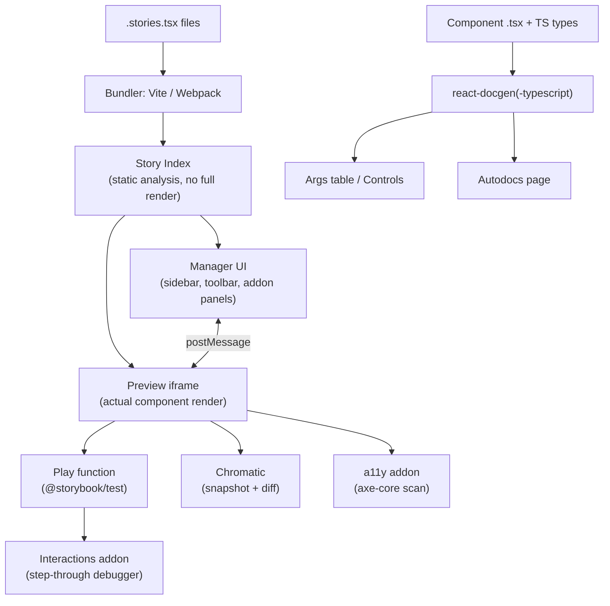

export const metadata = {
  title: "7. Storybook",
  description:
    "Component Driven Development, CSF, args and controls, autodocs, play functions and interaction tests, Chromatic visual regression, and the accessibility addon.",
};

# 7. Storybook

## Quick Glance

- Storybook is a workshop for building and testing UI components on their own, outside the app that uses them.
- A **story** is one named rendering of a component in one state (`Default`, `Loading`, `Disabled`).
- CSF (Component Story Format) makes stories plain, exported objects that tools can read without running the app — CSF3 (Storybook 7) simplified this further.
- Big idea to remember: every tool (docs, Controls, Chromatic, the a11y addon, play functions) reads the same story files, so nothing drifts out of sync.
- **Autodocs** builds a full docs page straight from your TypeScript prop types and stories — no hand-written Markdown needed.
- **Play functions** run real clicks/keystrokes against a rendered story and assert on the result — this is a test and a demo in one file.
- **Chromatic** takes a screenshot of every story on every push and flags pixel differences for a human to accept or reject.
- The **a11y addon** runs `axe-core` on every story automatically, catching about a third of real accessibility issues (the mechanically checkable ones).
- If asked "why Storybook over building components inside the app": say it removes the tax of navigating an app to reach one edge-case state.
- If asked "does Storybook replace E2E/integration testing": no — it deliberately skips real routing, data fetching, and app composition.

## Definition

**Storybook** is a workshop for building, viewing, and testing UI
components on their own — separate from the app(s) that use them. A
**story** is one named picture of a component in one state: one set of
props, one piece of data, one interaction. A component usually has many
stories (`Default`, `Loading`, `Disabled`, `WithError`, `LongLabel`).

Storybook turns every story into its own page. It wraps all the pages in
one shared UI — a sidebar, a canvas, and an addon panel — and adds tools on
top: controls for editing props live, automatic docs, interaction tests,
accessibility checks, and visual diffing. Together, these tools make the
story set the main place a design system gets reviewed and checked.

## Problem Statement

Say you're building a `Combobox` component with async search,
multi-select, keyboard navigation, an error state, and a max-selection
limit. You want to see the state "5 items selected, at the max limit, one
item has a validation error" inside a real application. To get there you'd
need to: find or fake the right backend response, navigate to the screen
that uses this combobox, click through five steps to reach that exact
state, and hope a page reload during development doesn't send you back to
square one.

Now multiply that by every state combination, across every component, for
every reviewer or designer who needs to check the same states before
sign-off. This "app-navigation tax" makes full review too expensive to do
in practice. So teams stop reviewing edge cases — which is exactly where
design systems break in the real world. The demo looks right, but the
disabled-and-loading combination three clicks deep does not.

There's a second, sharper version of this problem. Design system
components are used by *other people's* applications — apps you often
can't run locally and can't easily steer into a specific state. A design
system needs a way to build and show a component's full range of states
with zero dependency on any app that consumes it. That's the gap Storybook
fills: "loading, with an error, at max width, in dark mode" becomes one
click in a sidebar, not a scripted walk through a product you don't own.

## Why Does This Exist?

Storybook was created in 2016, originally as a fork of `react-storybook`
inside the Kadira team, later maintained independently. It was built to
solve component isolation for React, then spread to Vue, Angular, Svelte,
and Web Components. The core insight: **building a component and building
an app are different jobs.** An app developer thinks in terms of a screen.
A design system engineer thinks in terms of a component's full set of
props and states. Trying to build and review design-system components
inside an app forces app-shaped work (routing, data fetching, screen
layout) onto a problem that's really about components.

The deeper reason Storybook stuck — and became close to the default tool
in this space — is organizational, not just technical. A design system
sits between two groups that don't share a codebase: design and
engineering. A Storybook story is rendered and has its own URL, so
"here's the `Button` in its `disabled` + `loading` state, share this link"
became the first artifact *both* sides could open, click through, and
comment on. It became the shared ground truth for "does the code match
the design." Before Storybook (or a similar tool), that ground truth was
either a Figma file that had drifted from the shipped code, or a staging
URL for a whole app that buried the one component you cared about inside
everything else.

## Historical Context

Storybook's history tracks the history of component-driven React itself.
Early versions (v1–v3, 2016–2018) used an imperative `storiesOf()` API and
were mostly a dev-time visual playground — useful, but usually skipped in
CI, because there was no story format a build tool could scan without
actually running Storybook. **CSF (Component Story Format)**, introduced
in Storybook 5.2 (2019), changed that. Stories became plain ES module
exports, so tooling (bundlers, docs generators, test runners) could find
every story just by reading the file, with no need to run Storybook
itself. **CSF3**, shipped with Storybook 7 (2023), simplified the format
further: stories became plain objects instead of functions, "args" (a
story's props, described below) became the default way to configure a
story, and the amount of boilerplate per story dropped by roughly half.

Storybook 7 (2023) was the bigger architectural shift. **Autodocs** moved
from being a bolted-on addon to a first-class, story-driven feature. Vite
became a first-class builder alongside Webpack, which cut Storybook's own
startup and rebuild time a lot for large component libraries. And the
testing tools (play functions, the interactions addon) matured enough
that teams started treating Storybook as a real part of the test suite,
not just a docs tool. Storybook 8 (2024) tied the testing story together
further by standardizing on `@storybook/test` — a wrapper around
`@testing-library/dom` and Vitest's `expect` — so the same assertion
syntax works both inside a play function and inside a standalone test
file. This closed most of the gap between "a story" and "a test." This
period is also when Chromatic — built by the same core team as Storybook —
became the default pairing for visual regression testing, because it
reads stories directly with no separate step to write tests.

## How It Works Internally

Storybook is, mechanically, a static site generator plus a dev server,
built around one idea: **a story is a pure function that turns args
(props) into a rendered component.** At build time (or when the dev
server starts), Storybook:

1. **Finds** every `*.stories.tsx` file matching the pattern set in
   `.storybook/main.ts`.
2. **Reads each file's exports statically**, using its bundler (Vite or
   Webpack), to build an index of every story — its title, args, and
   metadata — without fully running your application code. This index is
   what makes the sidebar and search feel instant, even in a library with
   thousands of stories.
3. **Renders** the requested story. It merges the story's own `args` into
   the shared defaults from the file's `Meta` export, then hands that off
   to the framework's real render function (plain `ReactDOM.render` under
   the hood for React). This happens inside an iframe
   (`preview-iframe.html`) that's kept separate from Storybook's own UI
   (called the "manager"). This split is deliberate: the manager (sidebar,
   toolbar, addon panels) and the preview (your actual component) run in
   separate contexts, talking to each other over `postMessage`. That way
   an addon reading data from your component can't accidentally leak
   Storybook's own internals, and a crash inside your component doesn't
   take down the whole UI.
4. **Pulls out type information** for Controls and Autodocs using
   `react-docgen-typescript` (or the lighter `react-docgen` for plain JS).
   This tool reads your component's TypeScript prop types directly from
   the source — the same mechanism that powers the auto-generated docs,
   covered below.

This is why Storybook can scale to hundreds of components and thousands
of stories without grinding every developer's laptop to a halt. Only the
story index has to be built up front. Individual story files are split
and loaded on demand by the bundler, and Storybook 7+'s Vite builder
leans on native ESM (the browser's built-in module system) so a story's
startup and hot-reload time stay close to instant, no matter how many
*other* stories exist in the repo.

## Architecture



The key point this diagram makes: **stories are the single input every
other tool reads from.** Docs, controls, interaction tests, visual
regression, and accessibility checks all come from the same story files,
instead of from separately maintained artifacts. That single-source
property is what keeps docs from drifting out of sync (see
[Autodocs](#autodocs) below), and it's the main reason to pick Storybook
over hand-building a docs site plus a separate test suite plus a manual
QA checklist.

## Real-World Example

Shopify's Polaris, Adobe's Spectrum, IBM's Carbon, and Atlassian's design
system all publish a public Storybook (or a Storybook-based docs site) as
their main component reference. That's not an accident — it's the same
tool their internal teams and their own design/engineering review process
already use every day. Atlassian in particular has talked publicly about
using Storybook plus Chromatic as a *release gate* for their `@atlaskit`
packages: a PR that changes a shared primitive (say, a token used by
`Button`) can't merge until Chromatic shows every affected story's visual
diff, and a human has explicitly accepted each one. That turns an
otherwise invisible cascading regression into a concrete list a reviewer
can check. This is the pattern most large companies land on: Storybook
isn't just "where developers preview components" — it's the shared
surface design and engineering both sign off on before a component ships.

## Implementation Example

### Component Driven Development in practice

**Component Driven Development (CDD)** is the approach Storybook is built
to support: build UI from the bottom up. Start with the smallest
independent pieces (atoms like `Icon`, `Text`, `Button`), combine them
into molecules (`FormField` = `Label` + `Input` + `HelperText`), and
eventually build full screens — checking each layer on its own *before*
combining it into the next. This mirrors a design system's own layering
(see [Chapter 1](/chapters/what-is-a-design-system) on primitive vs.
composite layers). A `Button`'s states get fully specified and reviewed
as a story before anyone builds the `Dialog` that uses three buttons in a
footer. That way, a bug in `Dialog` can be traced straight to the
composition logic, instead of re-litigating whether `Button` itself is
correct.

The alternative — building a full screen first and carving out reusable
pieces afterward — tends to produce components that only really work in
the one screen shape they were pulled out of, because their prop surface
was never tested on its own.

### CSF3 stories

Here's a production-shaped story file for a `Combobox` component. It
covers ordinary variants, an interaction test, and accessibility-relevant
states in the same file:

```tsx
// Combobox.stories.tsx
import type { Meta, StoryObj } from "@storybook/react";
import { within, userEvent, expect, waitFor } from "@storybook/test";

import { Combobox } from "./Combobox";

const FRUIT_OPTIONS = ["Apple", "Apricot", "Banana", "Blueberry", "Cherry"];

// Meta configures shared defaults (args, argTypes, decorators) for every
// story in this file, and drives the Autodocs page's controls table.
const meta: Meta<typeof Combobox> = {
  title: "Inputs/Combobox",
  component: Combobox,
  // Autodocs reads this tag to auto-generate a docs page from the
  // component's TS prop types plus these stories — see "Autodocs" below.
  tags: ["autodocs"],
  args: {
    label: "Favorite fruit",
    options: FRUIT_OPTIONS,
    onChange: () => {},
  },
  argTypes: {
    // Restricting a free-form prop to a Controls dropdown documents the
    // intended values without weakening the underlying TS type.
    size: {
      control: "select",
      options: ["sm", "md", "lg"],
    },
  },
};
export default meta;

type Story = StoryObj<typeof Combobox>;

// The simplest possible story: Meta's args, unmodified. This is the
// baseline every other story in the file is a delta from.
export const Default: Story = {};

export const WithError: Story = {
  args: {
    error: "Please choose a fruit from the list.",
  },
};

export const Disabled: Story = {
  args: {
    disabled: true,
    value: "Apple",
  },
};

// Multi-select at its documented maximum — the exact state that's
// expensive to reach by navigating a real app, trivial here.
export const AtMaxSelections: Story = {
  args: {
    multiple: true,
    maxSelections: 3,
    value: ["Apple", "Apricot", "Banana"],
  },
};

// A play function runs after the story renders, inside the same iframe,
// using Testing Library's role/label queries — this both documents the
// expected keyboard interaction and asserts it never regresses.
export const KeyboardNavigation: Story = {
  play: async ({ canvasElement, step }) => {
    const canvas = within(canvasElement);
    const input = canvas.getByRole("combobox", { name: /favorite fruit/i });

    await step("typing filters the option list", async () => {
      await userEvent.type(input, "ap");
      await waitFor(() =>
        expect(canvas.getByRole("option", { name: "Apple" })).toBeInTheDocument(),
      );
      expect(canvas.queryByRole("option", { name: "Banana" })).not.toBeInTheDocument();
    });

    await step("arrow down then enter selects the highlighted option", async () => {
      await userEvent.keyboard("{ArrowDown}{Enter}");
      expect(input).toHaveValue("Apple");
    });
  },
};
```

### Args and Controls

**Args** are a story's props, written as a plain object instead of JSX —
`Default.args = { label: "Favorite fruit" }` instead of `<Combobox
label="Favorite fruit" />`. This is a deliberate choice, not a style
preference. Because args are plain data, Storybook can build a UI to
*edit* them while you watch (the **Controls** addon panel) without
needing to re-parse or re-render your JSX — it just calls the story
function again with a new args object.

Controls picks the right input for each prop (text field, toggle, number
stepper, color swatch, a dropdown for a fixed set of options) by reading
the component's TypeScript prop types through `react-docgen-typescript`.
The `argTypes` field on `Meta` lets you override that automatic guess
when it's not the most useful one — for example, restricting a `string`
prop that's really a closed set of design tokens to a dropdown, as shown
for `size` above.

The practical payoff: Controls is the props-testing playground teams used
to build by hand — a page with a component and a pile of toggles wired up
to `useState`. That playground now comes for free, generated from the
same type information the compiler already checks. It can never drift out
of sync with the component's real prop surface the way a hand-built one
always eventually does.

### Autodocs

**Autodocs** builds a full docs page — a prop table, a description, a
canonical example, and every story rendered inline — straight from a
component's stories and TypeScript types. You don't write any Markdown
beyond the `tags: ["autodocs"]` line shown above.

Here's the mechanism: Storybook's docs preset reads the same
`react-docgen-typescript` output that Controls uses (prop names, types,
default values, JSDoc comments on each prop) to build the props table,
and it renders each named export from the `.stories.tsx` file as a live
example underneath it. Because the docs page and props table are
*derived* — not hand-written — from the stories and types that already
have to stay correct for the component to compile, there's no separate
"docs" artifact that can silently fall out of sync with the real
component. That's the classic failure of hand-written component docs: a
prop gets renamed, and the Markdown doc quietly keeps referencing the old
name for months. Teams still add an `## Usage` MDX doc block per
component for narrative guidance (when to use this vs. a related
component, accessibility notes), but the generated prop table and example
gallery are never hand-maintained.

### Play functions and interaction tests

A **play function**, shown in `KeyboardNavigation` above, runs in the
browser right after a story renders. It drives real DOM events —
`userEvent.type`, `userEvent.click`, `userEvent.keyboard` — against the
rendered component, then checks the result with `expect` from
`@storybook/test` (which re-exports Vitest's `expect` plus DOM matchers).
This blurs the line between "a story" and "a test" on purpose: the same
file that shows a component's states also checks its behavior. The
**Interactions addon panel** lets a developer step through each `step()`
block visually, watching the DOM change in real time. This is genuinely
useful for debugging a flaky interaction in a way a plain test runner's
stack trace isn't.

Storybook 8's **test runner** (`@storybook/test-runner`, built on
Playwright) runs every story's play function headlessly in CI, turning
the whole story file into a CI-gating test suite with no separate test
files to maintain. This matters for a specific class of bugs that a plain
unit test (render a component, check its output) can't catch: real focus
order across a multi-step keyboard flow, whether a second click while a
request is in flight double-submits, whether pressing `Escape` correctly
returns focus to the trigger element.
[Chapter 8](/chapters/testing-strategy) goes deeper on where interaction
testing sits relative to unit and E2E testing in a design system's test
pyramid.

### Chromatic and visual regression testing

**Chromatic**, built by the Storybook core team, takes a screenshot of
every story on every push, then diffs each screenshot pixel-by-pixel
against an accepted baseline for that story. Mechanically: Chromatic
renders your Storybook in a set of real browsers on its own
infrastructure (so results stay consistent no matter which OS or GPU a
contributor's laptop has), captures a DOM snapshot plus a screenshot per
story, and compares it against the last-accepted snapshot for that exact
story. When the difference is bigger than a threshold, the PR gets a
"changes found" status, and a reviewer sees a side-by-side (or
overlay/slider) view of exactly which pixels changed. Accepting the diff
makes it the new baseline; rejecting it blocks the merge.

This replaces a human eyeballing every PR's visual output. Past a few
dozen components, no reviewer reliably notices that a shared spacing
token change nudged forty components' padding by 2px — but a pixel diff
catches it every time, on every affected story, including ones the PR
author never thought to check by hand. The tradeoff — covered more in
[Chapter 8](/chapters/testing-strategy) — is that pixel diffing has a
real false-positive rate, caused by font antialiasing, animation timing,
and content that isn't the same every run. That's why teams pin fonts,
turn off CSS transitions in the test environment, and freeze
non-deterministic content (dates, random IDs) specifically for snapshot
stories.

### The accessibility addon

The **a11y addon** (`@storybook/addon-a11y`) runs **axe-core** — the same
open-source accessibility rules engine used by Lighthouse and most
browser a11y devtools — against the current story's rendered DOM. It runs
automatically, every time you view a story or change args in Controls.
Violations (missing accessible names, low color contrast, invalid ARIA
attribute combinations, focusable elements with no visible focus ring)
show up as a categorized list in the addon panel, with a link to the
specific WCAG success criterion that was violated. This lets a developer
catch a regression *while building the component*, instead of during a
separate a11y audit weeks later.

Paired with the test runner, the a11y addon's checks can also run
headlessly in CI and fail the build on new violations — turning
"accessible by default" from a policy into an enforced gate. The addon
has the same limits as any automated a11y tool: roughly a third of WCAG
success criteria can be checked mechanically at all.
[Chapter 5](/chapters/accessibility) covers what automated tooling catches
versus what still needs a manual or screen-reader pass.

## Advantages

- **Isolation removes the app-navigation tax.** Every state is one
  sidebar click away, which is what actually makes full review of edge
  cases realistic instead of theoretical.
- **One source of truth for docs, controls, tests, and visual
  baselines.** All four are derived from the same stories, so they can't
  drift apart the way four separately maintained artifacts would.
- **A shared review surface between design and engineering.** A story URL
  is something a designer can open, click through, and comment on without
  touching code or running the app locally.
- **Framework-agnostic.** The same CSF mental model works across React,
  Vue, Angular, Svelte, and Web Components — useful for design systems
  that ship bindings for more than one framework (see
  [Chapter 6](/chapters/styling-architecture) on multi-framework styling).
- **CI-gatable.** Both Chromatic (visual) and the test runner
  (interaction/a11y) can block a merge, turning "please remember to
  check this" into an enforced pipeline step.

## Disadvantages

- **Real setup and maintenance cost.** Configuring `.storybook/main.ts`,
  keeping addons compatible across major version bumps, and keeping the
  build fast as story count grows into the thousands are ongoing work,
  not a one-time cost.
- **A second build target.** Stories need their own decorators/mocks for
  anything that depends on app-level context (routing, auth, a data
  provider). That context has to be faked inside Storybook, which is
  extra infrastructure to maintain alongside the app's real providers.
- **Chromatic costs money at scale.** The free tier's snapshot quota runs
  out fast for an active monorepo with thousands of stories and frequent
  pushes — budget for it as a real line item.
- **False sense of coverage.** A component can have a beautifully
  complete story set and still ship with a business-logic bug, because
  stories don't exercise real data-fetching, routing, or app state on
  purpose — that's out of scope by design, not a gap to fix.
- **Interaction tests inside Storybook can outgrow the tool.** Once a
  play function needs deep async mocking or checks that span multiple
  pages, that's a sign to move the scenario into Playwright instead of
  stretching Storybook to cover it (see
  [Chapter 8](/chapters/testing-strategy)).

## Alternatives

| | Storybook | Ladle | Histoire | Docz | Hand-rolled `/dev` route |
| --- | --- | --- | --- | --- | --- |
| What problem it solves | Full component workshop: isolation, docs, controls, testing, visual regression | Fast, minimal CSF-compatible story runner | Vue-first story runner with a similar model to Storybook | MDX-first component docs site | Whatever the team specifically needs, nothing more |
| Why it was created | Generalize component isolation across frameworks with a rich addon ecosystem | Storybook felt too heavy/slow for large React-only repos; built on esbuild | Storybook's Vue support felt secondary; native Vite/Vue integration | Docs-first teams wanted MDX as the primary authoring surface | Zero dependency on third-party tooling |
| Performance | Good with Vite builder; can lag on Webpack or very large story counts | Excellent — esbuild-based, near-instant startup | Excellent — native Vite | Good, MDX compile cost scales with doc size | Depends entirely on what's built |
| Developer experience | Mature, batteries-included, huge addon catalog | Minimal but polished; CSF-compatible so migration is low-friction | Good for Vue teams; smaller addon ecosystem | Great for docs-heavy teams, weaker for interaction testing | No abstraction to learn, but no tooling gifted either |
| Learning curve | Moderate — CSF, addons, config layering | Low — intentionally small surface area | Low-moderate | Low if already MDX-fluent | None, but all the design decisions are now yours |
| Community / ecosystem | Largest by far; official integrations for nearly every tool | Small but growing, React-focused | Small, Vue-focused | Smaller, largely superseded by Storybook 7's own MDX docs | None — you own it |
| Maintenance burden | Real, but amortized across a huge ecosystem and long-term-support releases | Low — small surface area, few addons to keep compatible | Low | Low-moderate | Entirely yours, forever |
| Enterprise suitability | High — this is what large design system orgs standardize on | Emerging, best for React-only mid-size teams | Best fit for Vue-only orgs | Niche | Only for very small, tightly scoped internal tools |
| When to choose it | Multi-framework or large design system with a real design/eng review loop | React-only repo prioritizing raw dev-server speed over addon breadth | Vue-only design system | Documentation-heavy site where testing/visual-regression matter less | A handful of components, no cross-team review workflow |
| When NOT to choose it | A 3-component internal tool with one maintainer | Need Chromatic-grade visual regression or the full addon catalog | Non-Vue stack | Need first-class interaction testing | More than a few components, or any external consumers |

Most large, multi-team design system orgs stick with Storybook itself
rather than switching to an alternative, and the reason is organizational
as much as technical: Storybook's addon ecosystem (Chromatic, the a11y
addon, the test runner, Figma embeds) is where the *integrations* other
tools haven't matched yet. A design system's value comes disproportionately
from those integrations — the review workflow, the CI gates, the docs
generation — not from the raw story-rendering itself, which every
alternative in the table above does well enough. Ladle and Histoire earn
their keep specifically when a team has already hit a real pain point
with Storybook's dev-server startup time on a very large monorepo and
doesn't need the addon ecosystem enough to justify sticking with
Storybook. That's a real and increasingly common complaint at scale, but
it's still the minority case compared to teams who haven't outgrown
Storybook's Vite builder.

## Tradeoffs

The central tradeoff is **isolation vs. fidelity**. Every property that
makes Storybook valuable — fast iteration, addressable states, no app
dependency — comes from deliberately *not* running your real app around
the component. That means anything the real app provides for free
(routing context, a real data layer, real global CSS resets, real font
loading) has to be rebuilt inside Storybook using decorators and mocks.
Every one of those rebuilds is a place where Storybook's rendering can
quietly diverge from production rendering: a story can look perfect, and
the same component can still render subtly differently inside the actual
app, if a decorator's mock context doesn't match the real provider
closely enough.

Teams manage this by keeping decorators thin and close to the real
providers — wrapping a real `ThemeProvider` with test data, instead of a
hand-rolled stand-in — and by treating Storybook as the main surface for
component-level correctness while still relying on integration/E2E tests
for full-app fidelity. See [Chapter 8](/chapters/testing-strategy) for
where that boundary sits.

## Performance Considerations

Storybook's build performance has two parts worth looking at separately.

**Dev-server startup and hot reload** scale with story count under the
older Webpack builder, because Webpack's dependency-graph analysis is
eager (it processes everything up front). The Vite builder (default since
Storybook 7) uses native ESM and only compiles the story you're actually
viewing, so startup time stays roughly flat even as story count grows
into the thousands. This is the single biggest lever for keeping
Storybook usable in a large monorepo — migrating an old, Webpack-based
Storybook to the Vite builder is usually the first fix when "Storybook is
slow" becomes a recurring complaint.

**Chromatic build time** scales with the number of stories captured per
push. Teams manage this with **TurboSnap**, Chromatic's own feature that
only re-snapshots stories whose source files actually changed since the
last build (using the same kind of dependency-graph reasoning covered in
[Chapter 9](/chapters/monorepo-architecture)), instead of re-snapshotting
every story on every push.

## Scalability Considerations

At a few hundred components and low thousands of stories, the main risks
are: story index build time (fixed by the Vite builder), Chromatic
snapshot volume and cost (fixed by TurboSnap and scoping visual
regression to changed packages only, via
[monorepo](/chapters/monorepo-architecture) task graphs), and addon
sprawl — every addon adds to both build time and mental overhead, so
large orgs typically audit and prune their addon list on a schedule
instead of keeping every addon that once looked useful.

Story *organization* becomes a real scalability concern on its own, apart
from tooling. Without an enforced naming/`title` convention (for example,
mirroring the actual package/component folder structure), a sidebar with
two thousand stories becomes unnavigable no matter how fast the tool
itself runs. This is a governance problem as much as a technical one, and
it connects to the contribution conventions covered in
[Chapter 11](/chapters/governance).

## Common Mistakes

<Callout type="danger" title="Treating Storybook as a substitute for real integration testing">
  A component can pass every story and interaction test in isolation and
  still break when it's combined with real siblings inside the actual
  app. Storybook deliberately skips real routing, real data fetching, and
  real global CSS. Teams that drop E2E/integration coverage entirely
  because "Storybook passes" get burned by exactly this gap.
</Callout>

<Callout type="danger" title="Letting stories silently drift from real usage">
  A story written once and never revisited eventually stops matching how
  the component is actually used in production, once its props change.
  Stories need the same code-review attention as the component itself —
  add or update a story in the same PR that changes the component's
  props, not as a follow-up later.
</Callout>

<Callout type="danger" title="Auto-accepting Chromatic diffs to unblock a PR">
  The single most common way visual regression testing loses its value:
  under deadline pressure, a reviewer accepts a diff without actually
  looking at it. That trains the whole team to treat the visual
  regression gate as a rubber stamp instead of a real check. If this
  becomes routine, the gate gives zero signal while still costing CI time
  and Chromatic snapshot budget.
</Callout>

<Callout type="danger" title="Overusing decorators to fake too much app context">
  A decorator that rebuilds half the app's provider tree just to get one
  story rendering is a sign the component itself depends on too much
  hidden, ambient context. The fix is usually in the component's API
  (accept the data as props, don't reach into a global context), not in a
  heavier decorator. See
  [Chapter 3](/chapters/component-architecture) on state ownership.
</Callout>

## Best Practices

- **One story per meaningfully distinct state**, not one story per prop —
  a `size` prop with three values doesn't need three stories unless size
  interacts with something else worth reviewing separately.
- **Keep the `Default` story argument-free** (or as close as possible) so
  it always reflects the component's real default props, not a curated
  "nice-looking" configuration that hides what a consumer actually gets
  for free.
- **Co-locate stories with the component** (`Button.tsx`,
  `Button.stories.tsx`, `Button.test.tsx` in the same folder) so a
  contributor updating the component sees the stories that need updating
  in the same file listing.
- **Write play functions for keyboard and focus behavior specifically** —
  this is the bug class that unit tests and visual snapshots both miss,
  and it's exactly the behavior a design system's consumers depend on
  most.
- **Gate merges on both Chromatic and the a11y/test runner in CI**, not
  just on unit tests — visual and accessibility regressions are the
  failure modes most specific to a design system's job.
- **Prune stale addons and stories on a schedule.** An addon or a story
  nobody has looked at in a year is a maintenance cost with no offsetting
  value; treat the story set as a living thing, not a write-once
  artifact.

## Interview Questions

<InterviewQuestion q="Why would a design system team invest in Storybook instead of just building components inside the consuming application and reviewing them there?">
  **What the interviewer is testing:** Whether you understand the actual
  cost Storybook removes — the app-navigation tax on reaching edge-case
  states — versus reciting "Storybook is for component docs" as a
  buzzword.

  **Poor answer:** "It's the standard tool for building components."

  **Good answer:** Explains that isolation makes every state directly
  addressable, which makes exhaustive state review actually feasible.

  **Excellent senior answer:** All of the above, plus: names the
  organizational function (shared review surface between design and
  engineering), the mechanism that keeps docs from drifting (Autodocs
  reading the same stories/types), and is explicit that Storybook doesn't
  replace integration/E2E coverage — it isolates a different layer of the
  test pyramid.

  **Common mistakes:** Treating Storybook as purely a "documentation tool"
  and missing its role in visual regression, interaction testing, and
  accessibility auditing; not being able to name what breaks if you skip
  it (edge-case states go unreviewed).
</InterviewQuestion>

<InterviewQuestion q="Walk me through how Autodocs generates a props table without you writing any Markdown for it. What's the actual mechanism?">
  **What the interviewer is testing:** Whether you understand this as an
  engineering mechanism (static type analysis) rather than "magic," since
  this question tends to separate people who've used Storybook casually
  from people who've had to debug why a prop didn't show up in the docs.

  **Poor answer:** "Storybook reads your component and makes docs for
  you."

  **Good answer:** Names `react-docgen-typescript` as the tool that
  statically parses the component's TS types to extract prop
  name/type/default, which both Controls and Autodocs consume.

  **Excellent senior answer:** All of the above, plus: explains why this
  specifically prevents docs drift (docs are derived from the same source
  of truth the compiler already checks, not hand-authored), and can name
  the failure mode when it breaks — e.g. a prop typed too loosely (`any`,
  or a type imported from a barrel file `react-docgen` can't resolve)
  produces a useless or missing Controls entry.

  **Common mistakes:** Assuming Autodocs parses JSDoc comments alone
  without understanding the type-extraction step; not knowing this same
  mechanism powers Controls, not just the docs page.
</InterviewQuestion>

<InterviewQuestion q="What's the difference between a Storybook play function and a Testing Library unit test, and when would you use one over the other?">
  **What the interviewer is testing:** Understanding of where interaction
  testing sits in the test pyramid relative to unit testing — a
  design-system-specific distinction most app engineers haven't had to
  reason about explicitly.

  **Poor answer:** "They're basically the same, both use
  `userEvent`/`expect`."

  **Good answer:** Notes that a play function runs in a real browser
  against the rendered story, visible and step-through-able in the
  Interactions panel, versus a Testing Library test typically running
  headlessly in jsdom.

  **Excellent senior answer:** All of the above, plus: explains that play
  functions get you a story *and* a test from one artifact (no duplicate
  authoring), that they're specifically good for the bug class of real
  focus order/keyboard sequences, and states a concrete line for when to
  graduate a scenario out of Storybook into Playwright instead (cross-page
  flows, deep async mocking).

  **Common mistakes:** Not knowing both now share `@storybook/test`'s
  assertion API as of Storybook 8, or being unable to say when one is
  clearly the wrong tool for the job.
</InterviewQuestion>

<InterviewQuestion q="Chromatic flags a visual diff on 40 components after a one-line CSS change. How do you evaluate whether this is a real regression?">
  **What the interviewer is testing:** Practical judgment under a
  visual-regression signal, not just knowledge that the tool exists.

  **Poor answer:** "I'd just accept the diffs if it looks fine."

  **Good answer:** Traces the CSS change to a shared token or utility
  class, confirms the diff is the expected, intended cascading effect,
  and accepts in bulk only after spot-checking a representative sample.

  **Excellent senior answer:** All of the above, plus: distinguishes
  "expected cascading diff from an intentional shared-token change" from
  "unexpected diff revealing an unrelated regression riding along in the
  same PR," and flags that mass-accepting 40 diffs without inspection
  defeats the entire point of the gate — ties this back to why the review
  step exists (catching regressions no single reviewer would manually
  notice).

  **Common mistakes:** Treating "a lot of diffs" as automatically
  suspicious or automatically fine without actually reasoning about
  whether the change was the intended cause.
</InterviewQuestion>

<InterviewQuestion q="The a11y addon shows zero violations on a component. Does that mean the component is accessible? Why or why not?">
  **What the interviewer is testing:** Whether the candidate understands
  the real limits of automated accessibility tooling, not just that the
  tool exists.

  **Poor answer:** "Yes, if axe-core shows no violations it's
  accessible."

  **Good answer:** No — axe-core catches mechanically verifiable issues
  (contrast ratios, missing accessible names, invalid ARIA) but can't
  verify things like whether the reading order makes sense to a screen
  reader user or whether a custom widget's keyboard model matches user
  expectations.

  **Excellent senior answer:** All of the above, plus: cites that
  automated tooling generally catches roughly a third of real-world WCAG
  issues and explains why — the checkable third is structural/mechanical,
  the rest requires human judgment about meaning and experience — and
  states what closes the gap (manual screen-reader pass, keyboard-only
  walkthrough). Cross-references [Chapter 5](/chapters/accessibility).

  **Common mistakes:** Treating a clean axe-core report as a finish line
  rather than a floor.
</InterviewQuestion>

<InterviewQuestion q="When would you NOT recommend adopting Storybook for a team?">
  **What the interviewer is testing:** Judgment and ability to reason
  about cost, not blind tool advocacy — a strong signal for staff-level
  thinking.

  **Poor answer:** "Storybook is always a good idea."

  **Good answer:** Names concrete disqualifiers — a very small component
  count, a single maintainer, no separate design/engineering review
  workflow that would benefit from a shared surface.

  **Excellent senior answer:** All of the above, plus: frames it as an ROI
  calculation (setup + ongoing maintenance cost vs. the review-tax it
  removes), and notes that the calculation flips as the component count
  and consumer count grow — so the right answer for a 5-component internal
  tool and a 200-component org-wide design system are opposite, and a good
  engineer should say so unprompted.

  **Common mistakes:** Answering as if the question has one universally
  correct answer instead of reasoning from the org's actual scale and
  workflow.
</InterviewQuestion>

## Manager-Level Questions

<ManagerQuestion q="Your team spends significant time each sprint accepting or investigating Chromatic diffs. How do you tell whether this is time well spent or a process that needs to change?">
  **What the interviewer is testing:** Whether the candidate manages tools
  as a cost/benefit tradeoff over time, not just as a fixed process once
  adopted.

  **Poor answer:** "Chromatic is best practice, so the time is
  justified."

  **Good answer:** Looks at what fraction of diffs turn out to be real
  regressions vs. noise, and if the ratio is heavily skewed toward noise
  (font rendering, animation timing), treats that as a signal to fix the
  test environment (pinned fonts, disabled transitions) rather than
  accepting the tax indefinitely.

  **Excellent senior answer:** All of the above, plus: proposes a concrete
  metric to track (diffs reviewed vs. real regressions caught) and a
  decision rule for when to scope Chromatic down (TurboSnap, fewer
  browsers, sampling) versus when the signal is proving its worth and
  should stay as-is.

  **Common mistakes:** Treating the tool's cost as fixed and unquestionable
  once adopted, rather than something a manager should periodically
  re-justify against what it's actually catching.
</ManagerQuestion>

<ManagerQuestion q="A new hire wants to skip writing stories for a component 'to save time' and just ship it with unit tests. How do you respond?">
  **What the interviewer is testing:** Whether the candidate can hold a
  team standard without being dogmatic, and can articulate the actual
  cost of skipping stories rather than just citing policy.

  **Poor answer:** "Stories are required, no exceptions."

  **Good answer:** Explains what's specifically lost — the shared
  design/engineering review surface, the free docs page, the visual
  regression baseline — and asks what's actually driving the time
  pressure before deciding whether an exception is warranted.

  **Excellent senior answer:** All of the above, plus: distinguishes
  between a component with real external consumers/design review (stories
  are non-negotiable) and a genuinely internal, throwaway component
  (where the calculation might differ), and turns this into a coaching
  moment about *why* the convention exists rather than a bare rule
  enforcement.

  **Common mistakes:** Either rigidly enforcing the rule with no
  reasoning given, or letting the exception become the norm without
  addressing the underlying time pressure.
</ManagerQuestion>

<ManagerQuestion q="How would you decide whether it's worth migrating a large, Webpack-based Storybook setup to the Vite builder?">
  **What the interviewer is testing:** Cost/benefit reasoning about
  tooling migrations at scale, and whether the candidate can quantify a
  developer-experience problem rather than treating it as a vague
  complaint.

  **Poor answer:** "Vite is faster, so we should migrate."

  **Good answer:** Measures actual dev-server startup and HMR time today,
  estimates the migration cost (addon compatibility, config rewrite,
  regression risk), and weighs that against the aggregate time saved
  across the whole team per day.

  **Excellent senior answer:** All of the above, plus: proposes doing it
  incrementally/behind a flag to de-risk a large monorepo migration, names
  the specific addon-compatibility risk as the main unknown to validate
  early with a spike, and frames the decision in terms of engineering-hours
  saved per week versus migration cost — the kind of concrete ROI framing
  expected at staff/manager level.

  **Common mistakes:** Treating "the new tool is objectively faster" as
  sufficient justification without quantifying the actual team-wide time
  cost of the status quo or the migration's real risk.
</ManagerQuestion>

## Summary

Storybook exists to solve one specific, expensive problem: reaching and
reviewing a component's full range of states inside a real application is
too costly to do in practice, so edge cases silently go unreviewed. By
rendering each state as its own addressable story, Storybook removes that
navigation tax. Because every other tool (Autodocs, Controls, Chromatic,
the a11y addon, play functions) reads from the same story files, docs,
tests, and visual baselines can't drift apart the way separately
maintained artifacts do.

Component Driven Development is the approach this enables: build and
check bottom-up, atoms before molecules before screens, mirroring a
design system's own layered structure. CSF3 made stories plain,
statically readable objects. Autodocs and Controls both come from reading
TypeScript types via `react-docgen`. Play functions blur story and test by
driving real DOM interactions with `@storybook/test`. Chromatic turns
pixel-diffing into a CI gate instead of relying on human eyeballs. And the
a11y addon runs axe-core automatically on every story, catching the
mechanically checkable third of accessibility issues before a component
ships.

None of this replaces real integration or E2E testing — Storybook
deliberately doesn't exercise routing, data fetching, or full app
composition — which is why it occupies a specific, bounded layer of the
test pyramid covered in depth in [Chapter 8](/chapters/testing-strategy).

**Key takeaways**

- Storybook's core value is eliminating the app-navigation tax on
  reaching and reviewing edge-case component states.
- CSF3 makes stories statically analyzable plain objects, which is what
  lets Autodocs, Controls, Chromatic, and the test runner all derive from
  the same source without hand-maintained duplication.
- Autodocs and Controls both come from `react-docgen(-typescript)`
  parsing real TypeScript prop types — this is why generated docs can't
  drift the way hand-written docs do.
- Play functions run real DOM interactions inside the rendered story,
  catching keyboard/focus-order bugs that pure unit tests miss.
- Chromatic's snapshot diffing is the practical replacement for manual
  pixel-regression review at scale, but requires review discipline —
  auto-accepting diffs defeats its purpose.
- Storybook is not a substitute for integration/E2E testing; it isolates
  one specific, bounded layer of the pyramid.

