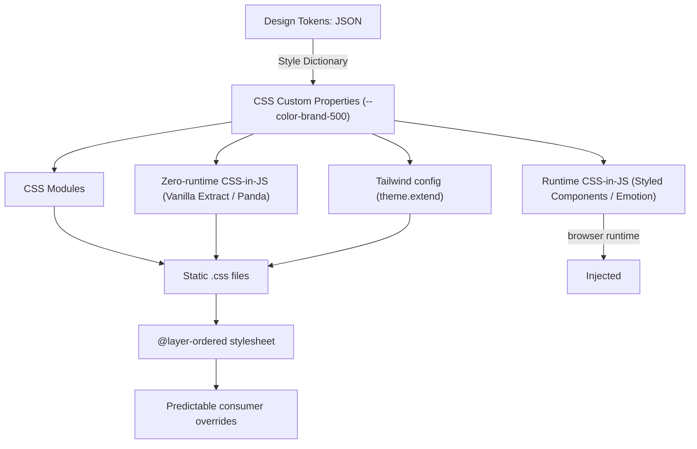

export const metadata = {
  title: "6. Styling Architecture",
  description:
    "CSS Modules, Sass/Less, CSS-in-JS (Styled Components, Emotion, Linaria), zero-runtime CSS (Vanilla Extract, Panda CSS), Tailwind, cascade layers, Shadow DOM, and token integration.",
};

# 6. Styling Architecture

## Quick Glance

- Styling architecture is about how CSS gets from a component's source code to the browser: scoped at build time or runtime, shipped as static files or generated JavaScript, and how predictably consumers can override it.
- The one problem every tool in this chapter solves: plain CSS has a single global namespace, so `.button` in one file can silently collide with `.button` in another.
- Two families, split by *when* the CSS is produced: build-time (CSS Modules, Vanilla Extract, Panda CSS, Tailwind — zero runtime cost) versus browser runtime (Styled Components, Emotion — real CSSOM injection cost on every render).
- Runtime CSS-in-JS (Styled Components/Emotion) cannot power a React Server Component — there's no browser or CSSOM on the server, so any component using it needs `"use client"`.
- CSS custom properties (`--token-name: value`) are the shared substrate every approach in this chapter can consume — this is the actual delivery mechanism for design tokens, independent of which styling library sits on top.
- Cascade Layers (`@layer`) let a design system say "our rules always lose to the consumer's," regardless of selector specificity — replacing fragile `!important` conventions.
- Shadow DOM gives the strongest possible style isolation (browser-enforced, cannot leak either direction) but has real friction with React's event system — reserve it for cross-framework or third-party embedding, not as a React-only default.
- Industry trend since ~2022: new design systems default to zero-runtime CSS-in-JS (Vanilla Extract, Panda CSS) or Tailwind, driven by RSC compatibility, lower measured runtime cost, and less hydration risk — not just fashion.
- If asked "why did GitHub/Shopify move off Styled Components," the answer is: measured runtime overhead at scale, plus RSC incompatibility, plus hydration-coordination risk that static CSS removes entirely.

## Definition

Styling architecture is the set of decisions a design system makes about
*how CSS gets from a component's source code to the browser*: whether
styles are scoped at build time or at runtime, whether they ship as static
files or generated JavaScript, how design tokens (see
[Chapter 2](/chapters/design-tokens)) get delivered into that CSS, and how
predictably a consuming application can override a component's default
styles without fighting a specificity war. It's one of the most
consequential — and most often revisited — decisions a design system team
makes, because unlike a component's API, its styling mechanism is very
expensive to change later. Every component in the library, and every
consumer's override, depends on it.

## Problem Statement

Plain CSS has one structural flaw that every approach in this chapter
exists to solve: the global namespace. A class named `.button` in one file
collides with a class named `.button` in another file, with no compiler or
runtime protection — whichever stylesheet loads last simply wins, silently.
On a single page, this is just annoying. At the scale of a design system
consumed by dozens of independently-built product surfaces, each with its
own CSS, it's untenable.

Beyond naming collisions, a design system has to solve three more problems
plain CSS doesn't handle on its own:

- **Delivering tokens** (see [Chapter 2](/chapters/design-tokens)) into the
  actual property values components use, so a rebrand or a dark-mode
  switch doesn't mean editing every component's CSS by hand.
- **Predictable overrides**, so a consumer can intentionally customize a
  component's look without fighting specificity or reaching for
  `!important`.
- **Runtime cost**, because a design system's styling mechanism runs on
  every page every consumer ships — at a scale where any inefficiency adds
  up fast.

## Why Does This Exist?

This entire chapter's worth of tooling exists because CSS was designed as a
document-styling language in 1996, with one single, page-wide global
namespace. The ecosystem has spent roughly three decades bolting
component-level scoping onto it, through progressively more sophisticated
tools. Each generation solved the previous generation's biggest pain point,
while introducing a new one of its own:

- **Preprocessors** (Sass, Less) solved CSS's lack of variables and nesting
  — but didn't solve scoping at all.
- **CSS Modules** solved scoping, using build-time class-name hashing — but
  didn't solve dynamic, prop-driven styles.
- **CSS-in-JS** (Styled Components, Emotion) solved dynamic styles and
  scoping together — but introduced a runtime cost.
- **Zero-runtime CSS-in-JS** (Vanilla Extract, Panda CSS) kept the dynamic,
  type-safe authoring experience while moving that cost back to build
  time.
- **Tailwind** sidestepped the scoping problem entirely by never generating
  per-component class names in the first place.

Understanding this chapter means understanding *which specific problem*
each generation solved — not just which tool is fashionable right now,
because "fashionable" keeps changing, and the underlying tradeoffs are what
actually carry over between jobs and years.

## Historical Context

Sass (2006) and Less (2009) predate component-scoped CSS as a concept
entirely — they were solving "CSS has no variables, no nesting, no
mixins," a real and painful gap before CSS custom properties existed (more
on those below). CSS Modules (2015, popularized by webpack's
`css-loader`) was the first mainstream build-time answer to scoping:
compile-time class-name hashing (`.button` becomes `.button_a1b2c3`)
guarantees uniqueness with no runtime cost at all. Styled Components (2016)
and Emotion (2017) arrived alongside React's rise and solved a problem CSS
Modules didn't: dynamic, prop-driven styles co-located with the component
that uses them (`` styled.button`color: ${props => props.color}` ``), at
the cost of generating and injecting styles in the browser at runtime. This
runtime CSS-in-JS era dominated new React design systems roughly from 2017
to 2021 — Material-UI (before its v5 Emotion default and later moves),
early Chakra UI, and countless internal design systems were all built on
Styled Components or Emotion during this window.

The pendulum swung back starting around 2020-2021 with Vanilla Extract and
later Panda CSS (2023): "zero-runtime CSS-in-JS" keeps the
TypeScript-authored, colocated developer experience, but extracts all
styles to static CSS files *at build time*, shipping zero styling
JavaScript to the browser. This shift is real and ongoing, not a one-off —
covered in depth in [Alternatives](#alternatives) below — driven by React
Server Components' incompatibility with runtime style injection, and by
measured runtime and bundle-size costs that got harder to justify once
faster alternatives existed. Tailwind CSS (2017) grew in parallel from a
different premise entirely — utility classes instead of component-scoped
styles — and by the mid-2020s had become the default choice for a large
share of new products, including design-system-adjacent ecosystems like
shadcn/ui, precisely because it sidesteps the runtime-cost question by
generating static utility CSS at build time, through a different mechanism
than either CSS Modules or zero-runtime CSS-in-JS.

## How It Works Internally

**CSS Modules** work through a build-time transformation: a bundler plugin
(`css-loader`, or Vite's built-in support) parses each `.module.css` file,
generates a unique, deterministic (or content-hashed) class name for every
local class selector, rewrites the CSS with those new names, and produces a
JavaScript object that maps your original class names to the generated
ones — you import that object and use it in your component. There's zero
runtime cost beyond loading a normal `.css` file: the "smart" work happens
entirely at build time, and the browser just sees plain, already-scoped
CSS.

**Sass/Less** work as pure compilers: a `.scss`/`.less` file with
variables, nesting, mixins, and functions gets compiled to plain CSS before
it ever reaches a browser or a bundler's CSS handling. There's no scoping
mechanism built in at all — Sass/Less output is exactly as global-namespaced
as hand-written CSS, unless you separately layer CSS Modules or a manual
naming convention (BEM) on top.

**Styled Components / Emotion (runtime CSS-in-JS)** work by intercepting a
component's render: a tagged template literal (`` styled.div`...` ``)
creates a React component that, on every render, computes the actual CSS
string (interpolating any prop-driven values), hashes it to generate a
unique class name, and — if that hash hasn't been seen before — injects a
new `<style>` rule into the document via the CSSOM
(`document.styleSheets` APIs), then applies the generated class name to the
rendered DOM node. This is real work happening in the browser for every
unique style combination: string interpolation, hashing, and a CSSOM
insertion, all during React's render/commit cycle. Emotion optimizes this
more aggressively than early Styled Components (a compiled mode via
`@emotion/babel-plugin` can pre-hash static parts at build time), but the
fundamentally dynamic, runtime-driven mechanism is the same for any part of
a style that depends on props or state.

**Vanilla Extract / Panda CSS (zero-runtime CSS-in-JS)** work by running
your TypeScript style definitions through a *build-time* compiler (a
webpack/Vite plugin, or Panda's separate codegen CLI step) that statically
evaluates every `style()`/`css()` call, extracts the resulting CSS to real
`.css` files on disk, and replaces your style calls in the compiled
JavaScript with plain string class-name references. By the time the bundle
reaches the browser, there's no styling-library runtime at all — only
static CSS files and string constants. The tradeoff this forces: because
extraction happens at build time, style values generally need to be
statically analyzable (known at build time). That's why fully dynamic,
runtime-computed styles (an arbitrary user-picked hex color, for instance)
typically fall back to a CSS custom property set via inline `style` for
just that one dynamic slice, rather than generating full CSS-in-JS for it.

**Tailwind CSS** works through a different mechanism entirely: it doesn't
generate per-component CSS at all. A build-time scanner walks your source
files, finds every utility class name used in a `className`/`class`
attribute (`px-4`, `text-sm`, `bg-brand-500`), and generates exactly the
CSS for those classes — and only those classes — from a fixed, predefined
utility vocabulary, discarding everything unused. There's no per-component
scoping to solve, because there's no per-component CSS being generated —
every class is a small, globally-shared, single-purpose utility, and the
"scoping" problem is sidestepped by making utility names so narrow and
unambiguous that a collision essentially can't happen (`.mt-4` means
exactly one thing everywhere it's used).

**CSS Custom Properties** (`--token-name: value;`) are the one mechanism
underlying nearly every approach above. They're a native, runtime-mutable
CSS feature — the browser resolves `var(--token-name)` at paint/layout
time, and automatically re-resolves it if the custom property's value
changes (via a class toggle, a media query, or JavaScript calling
`element.style.setProperty`). This is why custom properties, not any
specific styling library, are the actual token-delivery mechanism discussed
throughout [Chapter 2](/chapters/design-tokens): CSS Modules, Styled
Components, Vanilla Extract, and Tailwind can all consume the same
`var(--color-brand-500)` reference. They differ only in how the *rest* of
the component's CSS gets scoped and shipped, not in how tokens are threaded
through.

**CSS Cascade Layers (`@layer`)** are a native CSS feature (broadly
supported since 2022) that let you explicitly define the priority order
between groups of rules, independent of selector specificity or source
order. Rules inside an earlier-declared layer always lose to rules inside a
later-declared layer, *no matter how specific either selector is*. That's
the actual problem layers solve: without them, a design system's `.btn {
color: blue }` and a consumer's `.custom-page .btn { color: red }` resolve
by specificity math (the consumer wins here, because their selector is more
specific) — which is inconsistent and hard for a design system to predict
across every possible consumer selector shape. With layers, the design
system declares its own styles inside a low-priority layer (`@layer
components`), and consumers' overrides — even a single unspecific class —
reliably win, because unlayered or later-layered rules always beat
earlier-layered ones.

**Shadow DOM** is a browser-native encapsulation boundary (part of the Web
Components spec): a "shadow root" attached to an element creates a
sub-DOM tree whose styles are fully isolated in both directions — CSS
inside the shadow root cannot leak out to style the rest of the page, and
page-level CSS cannot reach in to style the shadow root's contents (with a
small number of deliberate exceptions: inherited properties, and
`::part()`/custom-property piercing). This is stronger isolation than any
build-time scoping mechanism (CSS Modules, zero-runtime CSS-in-JS) can
offer, because the browser's rendering engine itself enforces it — not
unique class names that a sufficiently ID-specific or `!important`-laden
consumer selector could theoretically still override.

## Architecture



Read this as: whichever authoring mechanism a team picks, tokens flow
through the same CSS custom property layer (see
[Chapter 2](/chapters/design-tokens)). The mechanisms then split into two
families by *when* the final CSS gets produced — build time (CSS Modules,
Vanilla Extract, Panda, Tailwind, all converging on static `.css` files)
versus browser runtime (Styled Components, Emotion, injecting `<style>`
tags on the fly) — with cascade layers as the final step that makes the
build-time family's output reliably overridable by consumers.

## Real-World Example

GitHub's Primer design system migrated from Styled Components to CSS
Modules and published the reasoning: runtime style computation was showing
up in their own performance profiling as measurable overhead at GitHub's
scale, and CSS Modules' zero-runtime, build-time-only cost was a direct
fix. Shopify's Polaris moved away from Sass toward CSS custom properties
plus CSS Modules for a similar reason — predictable, static output, with
tokens delivered natively via custom properties rather than compiled-away
Sass variables that can't change at runtime for theming. Vanilla Extract
itself was built by the Seek (Australian jobs platform) design system team,
specifically because they wanted Styled Components' TypeScript-native,
colocated authoring feel without its runtime cost — and it's since been
adopted by teams including parts of Discord's web client and numerous
design systems in the Vercel/Next.js ecosystem. Part of the reason: it's
the only kind of CSS-in-JS that's compatible with React Server Components,
since runtime CSS-in-JS libraries need to inject styles during a
client-side render, and there's no defined way to do that inside a Server
Component, which never runs in the browser at all. Vercel's own design
system and much of the shadcn/ui ecosystem default to Tailwind, and Adobe's
Spectrum 2 (the current generation of Adobe's system) uses a build-time CSS
approach with heavy custom-property-based theming rather than runtime
CSS-in-JS — reflecting the same industry-wide shift discussed below.

## Implementation Example

### CSS Modules with token consumption

```css
/* button.module.css */
/* Every value here is a var() reference into the token layer, never a
   literal hex/px value — this is what makes a rebrand or dark-mode switch
   a token-file change instead of a per-component CSS edit. */
.button {
  display: inline-flex;
  align-items: center;
  gap: var(--space-2);
  padding-block: var(--space-2);
  padding-inline: var(--space-4);
  border-radius: var(--radius-md);
  font: var(--font-body-medium);
  background-color: var(--color-action-primary-default);
  color: var(--color-text-on-brand);
  transition: background-color var(--motion-duration-fast) var(--motion-easing-standard);
}

.button:hover {
  background-color: var(--color-action-primary-hover);
}

.button:disabled {
  background-color: var(--color-action-disabled);
  color: var(--color-text-disabled);
  cursor: not-allowed;
}

.buttonSecondary {
  background-color: transparent;
  color: var(--color-action-primary-default);
  border: 1px solid var(--color-border-default);
}
```

```tsx
// button.tsx
// CSS Modules import as a typed object of class-name strings (with a
// .d.ts codegen step or a typed-css-modules plugin) — collisions with
// any other component's ".button" class are structurally impossible
// because the imported name is a hashed string, not the literal text
// "button".
import styles from "./button.module.css";
import clsx from "clsx";
import { forwardRef, type ButtonHTMLAttributes } from "react";

type ButtonProps = ButtonHTMLAttributes<HTMLButtonElement> & {
  variant?: "primary" | "secondary";
};

export const Button = forwardRef<HTMLButtonElement, ButtonProps>(function Button(
  { variant = "primary", className, ...rest },
  ref,
) {
  return (
    <button
      ref={ref}
      className={clsx(styles.button, variant === "secondary" && styles.buttonSecondary, className)}
      {...rest}
    />
  );
});
```

### Runtime CSS-in-JS (Emotion) — for comparison

```tsx
// button.emotion.tsx
// Shown for comparison against the CSS Modules version above: the CSS is
// colocated and can reference props directly, but every unique prop
// combination (here, `variant`) triggers a runtime style computation and
// class-name hash the first time it's seen, rather than being resolved
// entirely at build time.
import { css } from "@emotion/react";
import { forwardRef, type ButtonHTMLAttributes } from "react";

const base = css`
  display: inline-flex;
  align-items: center;
  gap: var(--space-2);
  padding-block: var(--space-2);
  padding-inline: var(--space-4);
  border-radius: var(--radius-md);
  font: var(--font-body-medium);
`;

const variants = {
  primary: css`
    background-color: var(--color-action-primary-default);
    color: var(--color-text-on-brand);
    &:hover {
      background-color: var(--color-action-primary-hover);
    }
  `,
  secondary: css`
    background-color: transparent;
    color: var(--color-action-primary-default);
    border: 1px solid var(--color-border-default);
  `,
};

type ButtonProps = ButtonHTMLAttributes<HTMLButtonElement> & {
  variant?: "primary" | "secondary";
};

export const Button = forwardRef<HTMLButtonElement, ButtonProps>(function Button(
  { variant = "primary", ...rest },
  ref,
) {
  return <button ref={ref} css={[base, variants[variant]]} {...rest} />;
});
```

<Callout type="warning" title="This component can't be a Server Component">
  The `css` prop and `@emotion/react`'s runtime need a client-side
  style-injection mechanism that has no defined behavior inside a React
  Server Component — this file needs `"use client"` the moment you adopt
  Emotion's `css` prop API, which (per
  [Chapter 4](/chapters/react-architecture)) forces its entire import
  subtree into the client bundle. This is one of the concrete, current
  reasons large teams have moved off runtime CSS-in-JS.
</Callout>

### Zero-runtime CSS-in-JS with Vanilla Extract

```ts
// button.css.ts
// This file is TypeScript, gets type-checked, supports autocompletion on
// token names via the theme contract below — but is fully evaluated and
// extracted to a static .css file at build time. Nothing here executes
// in the browser.
import { style, styleVariants } from "@vanilla-extract/css";
import { vars } from "../theme.css";

export const base = style({
  display: "inline-flex",
  alignItems: "center",
  gap: vars.space[2],
  paddingBlock: vars.space[2],
  paddingInline: vars.space[4],
  borderRadius: vars.radius.md,
  transition: `background-color ${vars.motion.durationFast} ${vars.motion.easingStandard}`,
});

export const variant = styleVariants({
  primary: {
    backgroundColor: vars.color.action.primaryDefault,
    color: vars.color.text.onBrand,
    selectors: {
      "&:hover": { backgroundColor: vars.color.action.primaryHover },
    },
  },
  secondary: {
    backgroundColor: "transparent",
    color: vars.color.action.primaryDefault,
    border: `1px solid ${vars.color.border.default}`,
  },
});
```

```ts
// theme.css.ts
// createThemeContract defines the SHAPE of the token API (names only, no
// values) — this is what makes vars.color.action.primaryDefault
// type-checked and autocompletable everywhere it's referenced, and lets
// multiple theme files (light.css.ts, dark.css.ts) each supply concrete
// values for the same contract.
import { createThemeContract } from "@vanilla-extract/css";

export const vars = createThemeContract({
  space: { 2: "", 4: "" },
  radius: { md: "" },
  motion: { durationFast: "", easingStandard: "" },
  color: {
    action: { primaryDefault: "", primaryHover: "" },
    text: { onBrand: "" },
    border: { default: "" },
  },
});
```

```tsx
// button.tsx
import { style } from "@vanilla-extract/css";
import * as styles from "./button.css";
import clsx from "clsx";
import { forwardRef, type ButtonHTMLAttributes } from "react";

type ButtonProps = ButtonHTMLAttributes<HTMLButtonElement> & {
  variant?: "primary" | "secondary";
};

export const Button = forwardRef<HTMLButtonElement, ButtonProps>(function Button(
  { variant = "primary", className, ...rest },
  ref,
) {
  return (
    <button ref={ref} className={clsx(styles.base, styles.variant[variant], className)} {...rest} />
  );
});
```

### Panda CSS — the atomic-CSS-via-build-time-extraction hybrid

```tsx
// button.tsx
// Panda's `css()` call looks like a CSS-in-JS API but is fully statically
// analyzed at build time by Panda's codegen step — it resolves to a set
// of small, deduplicated atomic class names (similar output shape to
// Tailwind) rather than one big per-component class, while still giving
// you a typed, token-aware authoring API.
import { css, cva } from "../styled-system/css";
import { forwardRef, type ButtonHTMLAttributes } from "react";

const button = cva({
  base: {
    display: "inline-flex",
    alignItems: "center",
    gap: "2",
    paddingBlock: "2",
    paddingInline: "4",
    borderRadius: "md",
  },
  variants: {
    variant: {
      primary: {
        bg: "action.primary.default",
        color: "text.onBrand",
        _hover: { bg: "action.primary.hover" },
      },
      secondary: {
        bg: "transparent",
        color: "action.primary.default",
        borderWidth: "1px",
        borderColor: "border.default",
      },
    },
  },
  defaultVariants: { variant: "primary" },
});

type ButtonProps = ButtonHTMLAttributes<HTMLButtonElement> & {
  variant?: "primary" | "secondary";
};

export const Button = forwardRef<HTMLButtonElement, ButtonProps>(function Button(
  { variant, className, ...rest },
  ref,
) {
  return <button ref={ref} className={css(button.raw({ variant }), className)} {...rest} />;
});
```

### Tailwind consuming the token system as its config

```ts
// tailwind.config.ts
// Tailwind's theme is NOT a second source of truth here — every value
// below is generated from the same design-tokens JSON that feeds Style
// Dictionary (see Chapter 2), so Tailwind's utility classes and the rest
// of the styling stack always agree on what "space-4" or "brand-500"
// means.
import type { Config } from "tailwindcss";
import tokens from "./tokens/build/tailwind-theme.json";

export default {
  content: ["./src/**/*.{ts,tsx}"],
  theme: {
    extend: {
      colors: tokens.colors,
      spacing: tokens.spacing,
      borderRadius: tokens.radii,
      fontFamily: tokens.fontFamily,
    },
  },
} satisfies Config;
```

```tsx
// button.tsx
import { forwardRef, type ButtonHTMLAttributes } from "react";
import { cva, type VariantProps } from "class-variance-authority";
import { cn } from "../lib/cn";

const buttonVariants = cva(
  "inline-flex items-center gap-2 rounded-md px-4 py-2 transition-colors",
  {
    variants: {
      variant: {
        primary: "bg-action-primary-default text-text-on-brand hover:bg-action-primary-hover",
        secondary: "bg-transparent text-action-primary-default border border-border-default",
      },
    },
    defaultVariants: { variant: "primary" },
  },
);

type ButtonProps = ButtonHTMLAttributes<HTMLButtonElement> & VariantProps<typeof buttonVariants>;

export const Button = forwardRef<HTMLButtonElement, ButtonProps>(function Button(
  { variant, className, ...rest },
  ref,
) {
  return <button ref={ref} className={cn(buttonVariants({ variant }), className)} {...rest} />;
});
```

### Cascade layers for predictable consumer overrides

```css
/* design-system.css — entry stylesheet the package ships */
/* Declaring the layer order up front, even before any rules exist in
   some of them, fixes the override priority permanently: reset always
   loses to tokens, tokens always lose to components, components always
   lose to anything a consumer writes outside this layer stack entirely
   (unlayered consumer CSS always beats any layered rule, by spec). */
@layer reset, tokens, components;

@layer reset {
  *,
  *::before,
  *::after {
    box-sizing: border-box;
  }
}

@layer tokens {
  :root {
    --color-action-primary-default: oklch(56% 0.18 260);
    --space-4: 1rem;
  }
}

@layer components {
  .btn {
    background-color: var(--color-action-primary-default);
    padding-inline: var(--space-4);
  }
}
```

```css
/* consumer's own app.css */
/* This rule wins over .btn's background-color above, even though ".btn"
   and this selector have comparable specificity, because it is NOT
   inside any @layer — unlayered rules always beat layered ones,
   regardless of selector specificity or source order. This is the
   predictability guarantee cascade layers give a design system's
   consumers. */
.btn {
  background-color: var(--brand-override-color);
}
```

<Callout type="tip" title="Layers solve the problem !important used to paper over">
  Before cascade layers, design systems facing "consumers can't override
  our styles" either shipped deliberately low-specificity selectors and
  hoped, or told consumers to reach for `!important` — both fragile.
  `@layer` gives the design system a way to say, declaratively, "our rules
  always lose to yours," without caring what selector shape the consumer
  writes.
</Callout>

### Shadow DOM encapsulation (Web Components context)

```ts
// x-button.ts
// Shown for the case where a design system targets multiple frameworks
// (or framework-agnostic embedding) via Web Components — Shadow DOM
// guarantees this component's internal CSS can never leak out, and no
// host page CSS can accidentally reach in, without relying on any
// build-time class-hashing convention at all.
class XButton extends HTMLElement {
  #shadow: ShadowRoot;

  constructor() {
    super();
    this.#shadow = this.attachShadow({ mode: "open" });
  }

  connectedCallback() {
    const variant = this.getAttribute("variant") ?? "primary";
    this.#shadow.innerHTML = `
      <style>
        /* Fully encapsulated — this selector can never match anything
           outside this shadow root, and no page-level ".btn" rule can
           reach in here either. */
        button {
          background-color: var(--color-action-primary-default, #2563eb);
          color: var(--color-text-on-brand, white);
          padding: var(--space-2, 8px) var(--space-4, 16px);
          border-radius: var(--radius-md, 6px);
          border: none;
        }
      </style>
      <button part="button"><slot></slot></button>
    `;
  }
}

customElements.define("x-button", XButton);
```

Note the two deliberate escape hatches used here: CSS custom properties
*do* pierce the shadow boundary (they're inherited like any other inherited
CSS property), which is how tokens still reach into a Shadow DOM component
without breaking encapsulation. And `part="button"` exposes a named "part"
a page author can style from outside via `::part(button)`, giving
controlled, opt-in external styling without fully breaking isolation.

## Advantages

Build-time approaches (CSS Modules, Vanilla Extract, Panda, Tailwind) share
one core advantage: zero runtime styling cost. No CSSOM insertion, no style
recomputation, no hydration-time style mismatch risk, and full
compatibility with React Server Components, since producing the CSS never
depends on JavaScript running in a browser. Runtime CSS-in-JS's advantage
is genuinely better authoring ergonomics for fully dynamic,
truly runtime-computed styles — an arbitrary color from a color picker, a
computed layout value — where build-time extraction structurally can't
help, because the value isn't known until the browser runs. CSS custom
properties as the shared token layer give every approach in this chapter
the same live-updating theming: flipping a `data-theme` attribute or class
on `<html>` instantly re-resolves every `var()` reference across the whole
page, with no re-render and no re-computation — just the browser's native
cascade doing what it already does. Cascade layers give any build-time
approach a native, standards-based answer to the override-predictability
problem that used to require specificity gymnastics or `!important`.
Shadow DOM's advantage is the strongest possible isolation guarantee —
genuinely impossible-to-leak styles in either direction, useful
specifically for design systems that need to be embeddable into pages they
don't control at all (a third-party widget, a micro-frontend with unknown
host CSS).

## Disadvantages

Runtime CSS-in-JS pays a real, measured cost: style computation and CSSOM
insertion on every unique style combination during render, larger
JavaScript bundles (the styling library itself, plus every component's
style definitions, ship as JS — not just CSS), a specific and now
well-documented incompatibility with Server Components, and historically
worse SSR performance from the extra step of extracting critical CSS on the
server and rehydrating it correctly on the client. Zero-runtime CSS-in-JS's
disadvantage is its static-analysis constraint: genuinely dynamic,
per-instance runtime values (not just a fixed set of variants) require
falling back to inline custom properties, an extra pattern authors have to
learn — and the build tooling (a webpack/Vite plugin, or a separate codegen
step for Panda) adds real build-pipeline complexity and a slower initial
learning curve than "just write CSS." Tailwind's disadvantage is markup
verbosity (`className` strings with a dozen or more utility classes are
common), and, without a component abstraction layer on top (`cva`, or
wrapping in actual components as shown above), a real risk of style
duplication and drift across usages instead of one source of truth per
pattern. CSS Modules' disadvantage is the least ergonomic dynamic-styling
story of any approach here — conditional or prop-driven styles need manual
class-name composition (`clsx`), with no built-in variant API. Shadow DOM's
disadvantage is real friction with React specifically (React's synthetic
event system and portal-based patterns don't cross shadow boundaries
cleanly without extra work), historically fragmented cross-browser DevTools
support, and the practical reality that most product teams building with
React have no reason to reach for Web Components at all.

## Alternatives

The chapter's core comparison — CSS Modules, Styled Components, Emotion,
Vanilla Extract, Panda CSS, and Tailwind — is the decision most new design
systems have to make once, expensively, up front.

| Dimension | CSS Modules | Styled Components | Emotion | Vanilla Extract | Panda CSS | Tailwind CSS |
| --- | --- | --- | --- | --- | --- | --- |
| What problem it solves | Global namespace collisions, build-time scoping | Scoped, dynamic, colocated styles | Same as Styled Components, with a smaller/faster runtime | Colocated, type-safe styles with zero runtime cost | Type-safe, token-aware styles compiled to atomic CSS, zero runtime | Rapid UI construction from a fixed utility vocabulary, no custom CSS authoring at all |
| Why it was created | webpack-era need for guaranteed-unique class names | React needed colocated, dynamic styling without manual class management | Faster, smaller alternative to Styled Components with similar API | Wanted CSS-in-JS ergonomics without CSS-in-JS's runtime cost | Wanted Chakra-style token-aware styling with zero runtime, atomic output | Wanted to stop context-switching between markup and stylesheet entirely |
| Performance | Zero runtime — static CSS output | Runtime style computation + CSSOM injection on every unique combination | Same mechanism as Styled Components, optimized further (especially compiled mode) | Zero runtime — fully static CSS output | Zero runtime — static, deduplicated atomic CSS output | Zero runtime — static CSS output, typically the smallest final CSS due to aggressive class reuse |
| Developer experience | Simple, familiar CSS syntax; manual dynamic-style composition | Excellent for dynamic, prop-driven styles; full CSS syntax in JS | Same strengths as Styled Components, slightly more API surface (css prop, object styles) | Strong type safety and autocomplete on tokens; requires a build plugin | Strong type safety, familiar CSS-property-named API, requires codegen step | Extremely fast iteration once utility vocabulary is memorized; verbose className strings |
| Learning curve | Low | Low–medium | Low–medium | Medium (new mental model: build-time constraints) | Medium (build-time constraints + own conventions) | Medium (utility vocabulary is large, but conceptually simple) |
| Community / ecosystem | Large, mature, built into most bundlers | Very large, long history, huge plugin/tooling ecosystem | Large; used by Material-UI/MUI, many enterprise systems | Growing steadily; strong in the Next.js/Vercel ecosystem | Newer but fast-growing; strong token-system-first positioning | Enormous — arguably the largest current CSS ecosystem, huge component marketplace (shadcn/ui etc.) |
| Maintenance burden | Low | Medium — runtime behavior can regress with library upgrades | Medium, similar to Styled Components | Low once set up; build plugin upgrades occasionally need attention | Low once set up; newer tool, smaller long-term track record | Low; config-driven, stable API surface |
| Enterprise suitability | High — proven at scale (Polaris, Primer) | High historically, declining for new systems specifically due to RSC incompatibility | High historically, same trend as Styled Components | High and growing — the current default recommendation for new systems wanting CSS-in-JS ergonomics | High and growing rapidly | Very high — default for a large share of new enterprise and startup products alike |
| When to choose it | Team wants plain CSS with guaranteed scoping, minimal new concepts | Legacy codebase already using it; team strongly prioritizes dynamic runtime styling over RSC compatibility | Same as Styled Components, when starting fresh and choosing between the two | New system wanting CSS-in-JS DX with zero runtime cost and RSC compatibility | Same as Vanilla Extract, when the atomic-CSS output model and its recipe/variant API fit the team | New system prioritizing velocity, consistency-by-constraint, and RSC compatibility, and where markup verbosity is an acceptable tradeoff |
| When NOT to choose it | Team needs heavily dynamic, runtime-computed styles with no variant fallback | Building for React Server Components; performance-critical, high-fan-out design system primitives | Same caveats as Styled Components | Team needs fully runtime-arbitrary style values with no static variant structure | Same caveats as Vanilla Extract; also newer/smaller ecosystem is a real risk factor for long-term bets | Team/org has strong aversion to utility-class markup, or needs deeply custom, non-utility-representable visual design frequently |

### Why large companies are moving toward zero-runtime approaches

This shift is real and worth naming directly — it's one of the more
consequential styling-architecture trends of the last five years. Three
concrete forces are driving it.

First, **React Server Components** structurally cannot run a runtime
CSS-in-JS library's style-injection logic — there's no browser, no
`document`, no CSSOM to inject into, during a Server Component's execution.
So any design system component built with Styled Components' or Emotion's
`css` prop has to become a Client Component the moment it needs that
mechanism, which (per [Chapter 4](/chapters/react-architecture)) drags its
whole import subtree into the client bundle. Teams adopting Next.js's App
Router at scale hit this wall directly — it's a hard technical
incompatibility, not a preference.

Second, **measured runtime and bundle-size cost**: multiple large
engineering orgs (GitHub's Primer team, publicly, and privately at many
companies with internal design systems) have profiled runtime CSS-in-JS
under real production load and found style computation and CSSOM insertion
showing up as non-trivial main-thread time at scale — plus the styling
library itself, and every component's style logic, shipping as client
JavaScript that a zero-runtime or static-CSS approach doesn't pay for at
all.

Third, **hydration risk**: runtime CSS-in-JS historically needed careful
server/client coordination (extracting critical CSS server-side,
rehydrating the style cache client-side) to avoid a flash of unstyled or
mis-styled content — and that coordination is an entire class of bug that
simply doesn't exist when the CSS is static from the start.

None of this means runtime CSS-in-JS is "dead." Styled Components and
Emotion remain widely deployed in existing codebases, and genuinely
runtime-dynamic styling (arbitrary user-picked values with no fixed variant
set) is still easier to express with them. But for a **new** design system
built after roughly 2022, the default recommendation across the industry
has clearly shifted toward zero-runtime CSS-in-JS (Vanilla Extract, Panda
CSS) or Tailwind — specifically because both eliminate the RSC
incompatibility and the runtime cost at the same time, and the tooling
needed to adopt them (a build plugin, a config file) is no longer the
adoption barrier it was in 2020.

## Tradeoffs

The tradeoff underlying nearly every choice in this chapter is *authoring
flexibility at runtime* versus *cost paid by every consumer, every page
load*. Runtime CSS-in-JS maximizes the former — you can compute a style
from literally any runtime value with no build-time constraint — at the
cost of the latter, paid by every single user of every product built on
the design system. Zero-runtime approaches invert this: they constrain
what can be expressed (styles generally need to be statically analyzable,
variants need to be enumerable) in exchange for eliminating that cost
entirely. Tailwind takes the constraint furthest — no custom
CSS-in-JS-like dynamic computation at all, just composition of a fixed
utility vocabulary — and gets the most predictable, smallest, most
cacheable output as a result. CSS Modules sits in between: zero runtime
cost like the build-time approaches, but without the type-safe,
token-aware authoring ergonomics the newer zero-runtime CSS-in-JS tools add
on top.

The second tradeoff, separate from the first, is override predictability
versus encapsulation strength: cascade layers give a design system
fine-grained, intentional control over *which* of its own rules a consumer
can easily override, while Shadow DOM gives total, unconditional isolation
that a consumer generally cannot override at all without the design system
explicitly exposing a `::part()` or custom property escape hatch. The right
choice depends entirely on whether the design system wants consumers
customizing its components (most React design systems: yes) or wants to
guarantee a component looks identical everywhere regardless of host page
CSS (embeddable widgets: often yes).

## Performance Considerations

For runtime CSS-in-JS specifically, the concrete, measurable costs are:
style-string interpolation and hashing on every unique prop combination
(cacheable per-hash, but the cache itself has memory and lookup cost);
CSSOM insertion cost (`insertRule` calls are not free, and a page mounting
hundreds of design-system component instances with many unique style
combinations can produce hundreds of these calls on the initial render);
and the client bundle weight of the styling library's runtime itself
(Emotion's core is smaller than early Styled Components, but neither is
zero).

For any build-time approach, the performance profile shifts almost
entirely to **CSS file size and specificity/cascade complexity** rather
than runtime cost. The practical levers are keeping the generated CSS's
total selector count and rule count bounded (Tailwind's and Panda's atomic
class approach naturally caps this through deduplication; hand-written CSS
Modules can bloat if every variant gets its own full rule set instead of
composing small ones), and making sure critical, above-the-fold CSS is
inlined or delivered with the smallest possible blocking request, rather
than deferred behind one large monolithic stylesheet. Cascade layers
themselves have no runtime performance cost — they're resolved by the
browser's existing cascade-resolution engine, not an added computation
step. See [Chapter 13](/chapters/performance) for the broader
CSS-performance and bundle-budget discussion this connects to, including
how these choices interact with code-splitting a large component library's
stylesheet across route boundaries.

## Scalability Considerations

At small scale, almost any approach in this chapter works fine — the
differences only compound once a design system has enough components,
enough consumers, and enough concurrent page instances of those components
for the runtime-vs-build-time cost difference to become visible in
aggregate. The scaling failure mode specific to runtime CSS-in-JS is that
its cost is proportional to the number of *unique* style combinations
actually rendered on a page, and that number grows with the design
system's own success — more variants, more consumers combining props in
more ways, more unique hashes computed and injected. The scaling failure
mode specific to Tailwind and atomic-CSS approaches is closer to the
opposite: the CSS file size grows sublinearly with usage, because classes
are shared and deduplicated across the whole app — which is exactly why
these approaches tend to hold up better as a design system's consumer base
grows into the tens or hundreds of teams. Cascade layers scale well
organizationally too: because override priority is declared once,
centrally, in the layer order, a design system doesn't need to coordinate
specificity conventions with every consuming team individually as the
number of consumers grows — a real coordination cost the pre-layers era
paid in practice (style guides full of "never use `!important`, always use
exactly one class" conventions that had to be manually enforced).

## Common Mistakes

<Callout type="danger" title="Hardcoding hex/px values instead of token references">
  Any styling mechanism in this chapter can be used correctly or
  incorrectly on this axis — the mistake is writing `background: #2563eb`
  in a component's CSS/style object instead of `background:
  var(--color-action-primary-default)` (or the equivalent token reference
  in Vanilla Extract/Panda/Tailwind). This silently breaks theming, dark
  mode, and rebranding for that one component, and it's the single most
  common styling-architecture bug regardless of which tool a team uses.
</Callout>

<Callout type="danger" title="Shipping a runtime CSS-in-JS component and calling it Server-Component-ready">
  A component built with Styled Components or Emotion's `css` prop cannot
  be a Server Component — it needs `"use client"` the moment it uses that
  mechanism. Claiming RSC support while still using runtime style injection
  is a build-time contradiction that will either fail to compile or
  silently force the whole subtree client-side.
</Callout>

<Callout type="danger" title="Fighting specificity with !important instead of cascade layers">
  `!important` is a blunt, global escalation that breaks down the moment
  two rules both use it — it doesn't express "the design system's default
  should lose to a consumer's override," it just wins unconditionally
  until something else uses `!important` too. `@layer` expresses the
  actual intent (priority order between groups of rules) directly and
  composably.
</Callout>

<Callout type="danger" title="Treating Tailwind's utility classes as the design system, with no component abstraction">
  Repeating the same 12-class `className` string across every button
  instance in an app, with no shared `Button` component or `cva` variant
  definition wrapping it, reintroduces exactly the drift and
  inconsistency problem a design system exists to prevent — Tailwind
  should be the styling *mechanism* underneath shared components, not a
  replacement for having shared components at all.
</Callout>

<Callout type="danger" title="Assuming Shadow DOM style isolation applies to a React app with no Web Components">
  Reaching for Shadow DOM to "guarantee style isolation" in a normal React
  design system, without an actual Web Components / cross-framework
  embedding requirement, adds real friction (React's event system and
  portal patterns don't cross shadow boundaries cleanly) for an isolation
  guarantee that build-time scoping (CSS Modules, Vanilla Extract, Panda)
  already provides at a much lower cost for a React-only consumer base.
</Callout>

## Best Practices

- Deliver every token through CSS custom properties, regardless of which
  authoring mechanism sits on top — this is the one layer every approach
  in this chapter can share, and it's what makes theming/dark-mode/rebrand
  a token-file change instead of a per-component-per-mechanism edit (see
  [Chapter 2](/chapters/design-tokens)).
- Default new design systems to a zero-runtime approach (Vanilla Extract,
  Panda CSS) or Tailwind unless there's a specific, articulable need for
  fully runtime-dynamic styling that a variant-based API can't express —
  this is the current, well-justified industry default, not just a trend
  to follow blindly.
- Declare cascade layer order once, centrally, in the design system's
  entry stylesheet, and keep the design system's own rules in an
  early/low-priority layer so consumer overrides are reliable without
  `!important`.
- Wrap Tailwind utility compositions in actual shared components (or
  `cva`-defined variants) rather than letting consumers hand-compose
  utility strings per instance — Tailwind is a styling mechanism, not a
  substitute for component-level consistency.
- If genuinely runtime-arbitrary values are needed inside an otherwise
  zero-runtime component, fall back to a CSS custom property set via
  inline `style` for just that value, rather than abandoning the
  zero-runtime approach for the whole component.
- Reserve Shadow DOM for actual cross-framework or fully third-party
  embedding requirements — don't reach for it as a default isolation
  strategy in a React-only consumer base where build-time scoping already
  solves the problem more cheaply.
- Audit new/changed components for hardcoded literal values (color, space,
  radius, motion) as a required PR check, regardless of which styling
  mechanism the codebase uses — this is the highest-frequency real bug in
  practice.

## Interview Questions

<InterviewQuestion q="Why have several large design system teams moved away from runtime CSS-in-JS (Styled Components/Emotion) toward zero-runtime approaches in the last few years?">
  **What the interviewer is testing:** Whether the candidate is current on
  a real, ongoing industry shift and can explain the underlying mechanics,
  not just repeat "it's faster."

  **Poor answer:** "Zero-runtime is newer and better."

  **Good answer:** Cites runtime style-injection cost and bundle size as
  reasons.

  **Excellent senior answer:** Names three concrete, distinct forces: React
  Server Components' structural incompatibility with runtime style
  injection (no browser/CSSOM during server execution), measured
  production runtime cost from style computation and CSSOM insertion at
  scale, and hydration-coordination risk that static CSS eliminates
  entirely — and notes this doesn't make runtime CSS-in-JS obsolete for
  existing codebases or genuinely dynamic-styling use cases, just a
  different default recommendation for new systems.

  **Common mistakes:** Citing only bundle size without mentioning the RSC
  incompatibility, which is the more structurally forcing reason for teams
  on modern React frameworks.
</InterviewQuestion>

<InterviewQuestion q="Explain, mechanically, how CSS Modules achieve scoping with zero runtime cost, and contrast that with how Styled Components achieves scoping.">
  **What the interviewer is testing:** Depth beyond "CSS Modules scope
  classes" — the actual build-time vs runtime mechanism difference.

  **Poor answer:** "CSS Modules use unique class names."

  **Good answer:** Explains the build-time hashing step (a bundler plugin
  rewrites class names and produces a lookup object).

  **Excellent senior answer:** Contrasts this precisely with Styled
  Components: CSS Modules resolve scoping entirely at build time, so the
  browser only ever sees plain, pre-scoped CSS with zero JavaScript
  involvement at render; Styled Components resolve scoping (and any
  prop-driven values) at component render time in the browser, hashing the
  computed style string and injecting a `<style>` rule via the CSSOM on
  first encounter of each unique combination — meaning CSS Modules' cost is
  paid once at build time regardless of how many times the component
  renders, while Styled Components' cost is paid, at least partially, on
  the client for every unique style combination actually rendered.

  **Common mistakes:** Describing both as "just class name scoping"
  without distinguishing when the scoping work actually happens.
</InterviewQuestion>

<InterviewQuestion q="What problem do CSS Cascade Layers solve that specificity and !important don't solve well, and how would you use @layer in a design system's stylesheet?">
  **What the interviewer is testing:** Practical, current knowledge of a
  relatively recent (but now well-supported) CSS feature directly relevant
  to design system override predictability.

  **Poor answer:** "@layer lets you organize CSS into sections."

  **Good answer:** States that layers control priority independent of
  selector specificity, so a design system can guarantee consumer
  overrides win without relying on writing deliberately low-specificity
  selectors.

  **Excellent senior answer:** Explains the actual rule — an unlayered
  rule or a rule in a later-declared layer always beats a rule in an
  earlier-declared layer, regardless of either selector's specificity —
  and gives the concrete pattern: declare `@layer reset, tokens,
  components;` once in the design system's entry stylesheet, put the
  system's own component rules in the `components` layer, and any
  consumer CSS outside `@layer` automatically wins without needing
  `!important` or artificially inflated selectors.

  **Common mistakes:** Confusing `@layer` with plain CSS nesting or
  thinking it changes specificity math itself rather than overriding it.
</InterviewQuestion>

<InterviewQuestion q="When, if ever, would a React-based design system reach for Shadow DOM, and why do most React design systems avoid it?">
  **What the interviewer is testing:** Judgment about when strong
  encapsulation is actually needed versus over-engineering.

  **Poor answer:** "Shadow DOM is for Web Components, React doesn't need
  it."

  **Good answer:** Says it's for cases needing style isolation stronger
  than build-time scoping, like embeddable third-party widgets.

  **Excellent senior answer:** Gives the concrete reason most React
  systems avoid it: React's synthetic event system and certain composition
  patterns (portals, some ref forwarding) don't cross shadow boundaries
  cleanly without extra plumbing, and build-time scoping (CSS Modules,
  Vanilla Extract) already gives strong-enough isolation for a
  React-only, single-host-page consumer base at much lower friction —
  reserving Shadow DOM for genuine cross-framework or fully third-party
  embedding scenarios (a widget embedded into an unknown host page's CSS)
  where that stronger, browser-enforced guarantee is actually load-bearing.

  **Common mistakes:** Not knowing about the concrete React/Shadow-DOM
  friction points; treating Shadow DOM as strictly superior without
  weighing the cost.
</InterviewQuestion>

<InterviewQuestion q="How does a design system deliver its design tokens consistently across CSS Modules, Vanilla Extract, and Tailwind consumers simultaneously?">
  **What the interviewer is testing:** Whether the candidate understands
  CSS custom properties as the shared substrate underneath every styling
  mechanism, connecting this chapter to Chapter 2.

  **Poor answer:** "Each tool has its own token system, you'd configure
  them separately."

  **Good answer:** Says CSS custom properties are the common layer every
  approach can reference.

  **Excellent senior answer:** Describes the actual pipeline: a single
  token source (JSON, or Figma Variables per
  [Chapter 2](/chapters/design-tokens)) runs through Style Dictionary (or
  equivalent) to produce both a `.css` file of custom properties and a
  Tailwind theme config object from the *same* source, so `var(--color-
  brand-500)` (used directly in CSS Modules, or referenced inside Vanilla
  Extract's theme contract) and Tailwind's `bg-brand-500` utility always
  resolve to the same underlying value, because they're generated from one
  upstream source rather than hand-maintained independently in each tool's
  config.

  **Common mistakes:** Proposing to maintain token values separately per
  tool, which is exactly the drift risk a token pipeline is designed to
  eliminate.
</InterviewQuestion>

<InterviewQuestion q="A consuming team complains they can't override a design system Button's background color no matter what CSS they write. What are the possible causes and fixes?">
  **What the interviewer is testing:** Practical debugging ability across
  the specificity/layers/encapsulation space this chapter covers.

  **Poor answer:** "Tell them to use !important."

  **Good answer:** Checks whether the design system's selector is more
  specific, or whether `!important` is already used internally.

  **Excellent senior answer:** Walks through the full possibility space:
  the design system might be using a CSS Modules-generated class with
  higher effective specificity than the consumer's selector; it might be
  using `!important` internally (a real anti-pattern per this chapter); if
  the design system uses cascade layers, the consumer's rule might
  accidentally also be inside a layer that's declared earlier; or, if the
  component is Shadow-DOM-encapsulated, no amount of page-level CSS can
  reach in at all without a `::part()` escape hatch — diagnoses which case
  applies before proposing a fix, and proposes the systemic fix (adopting
  `@layer` with the design system's rules in an early layer) rather than a
  one-off patch for this consumer.

  **Common mistakes:** Jumping straight to `!important` as the fix, which
  only escalates the same brittle mechanism rather than solving the
  underlying predictability problem.
</InterviewQuestion>

## Manager-Level Questions

<ManagerQuestion q="Your design system currently uses Styled Components. The org is adopting Next.js App Router and Server Components broadly. How do you plan the migration?">
  **What the interviewer is testing:** Ability to plan a genuinely
  expensive, foundational migration with appropriate sequencing and risk
  management, not just "rewrite everything."

  **Poor answer:** "Do a big-bang rewrite to Vanilla Extract before the
  next release."

  **Good answer:** Proposes an incremental migration, component by
  component, prioritizing the most-used primitives first.

  **Excellent senior answer:** Frames this as a multi-quarter, dependency-
  ordered migration: audits which components are purely presentational
  (safe to migrate and make server-renderable) versus genuinely
  interactive (lower priority, since they need `"use client"` regardless
  of styling mechanism); picks a target (Vanilla Extract or Tailwind)
  based on the team's existing TypeScript-heavy authoring preference;
  ships the migration as non-breaking changes where the public API doesn't
  change, and stages any necessary breaking changes into a major version
  with a codemod, per [Chapter 11](/chapters/governance); and sets up a
  canary consumer on the new framework to validate before a broader
  rollout.

  **Common mistakes:** Not distinguishing "components that can migrate
  non-breaking" from "components whose API has to change," and thus
  treating the whole migration as one big-bang event.
</ManagerQuestion>

<ManagerQuestion q="A team wants to adopt Tailwind for a new product, but your design system is built on CSS Modules. How do you handle the mismatch?">
  **What the interviewer is testing:** Pragmatic cross-team negotiation
  and technical judgment about whether styling-mechanism consistency is
  actually load-bearing or a false constraint.

  **Poor answer:** "Tell them no, everyone uses CSS Modules."

  **Good answer:** Notes that as long as tokens are delivered via CSS
  custom properties, the consuming team's utility classes and the design
  system's components can coexist, since Tailwind utilities just reference
  the same `var()` tokens.

  **Excellent senior answer:** Distinguishes the two separable concerns:
  the design system's own *component* styling mechanism (CSS Modules) does
  not need to match a consumer's *page-level* styling choice, as long as
  both consume the same token layer via custom properties — proposes
  generating a Tailwind theme config from the same token source (as shown
  in this chapter) so the consuming team's utilities stay in sync with the
  design system's tokens automatically, and flags the one real
  compatibility risk to check: whether both approaches' generated CSS
  specificity/cascade-layer setup interacts predictably, testing this
  explicitly rather than assuming it just works.

  **Common mistakes:** Treating "same styling mechanism everywhere" as a
  hard requirement rather than recognizing tokens are the actual shared
  contract, not the styling library.
</ManagerQuestion>

<ManagerQuestion q="How would you decide, as a technical lead, between adopting Vanilla Extract versus Panda CSS versus Tailwind for a brand-new design system built today?">
  **What the interviewer is testing:** Structured decision-making under
  genuine ambiguity — this is a real, current, debatable choice with no
  single correct answer, and the interviewer wants to see the reasoning
  process, not a specific verdict.

  **Poor answer:** "I'd just pick whichever is most popular."

  **Good answer:** Weighs team familiarity, ecosystem maturity, and
  whether the team wants CSS-property-shaped authoring (Vanilla
  Extract/Panda) versus utility-class authoring (Tailwind).

  **Excellent senior answer:** Lays out the actual decision criteria: team
  size and existing skill (a team fluent in writing real CSS properties
  gets more value from Vanilla Extract/Panda's near-1:1 mapping; a team
  optimizing for raw velocity and consistency-by-constraint benefits more
  from Tailwind's fixed vocabulary); how design-heavy vs. utility-driven
  the product's visual language is expected to be; long-term ecosystem risk
  (Tailwind's ecosystem size is a real hedge against being an early adopter
  of a smaller tool); and RSC-compatibility, which all three satisfy
  equally — concluding that the difference between the zero-runtime
  options is smaller than the difference between any of them and staying
  on runtime CSS-in-JS, so getting off runtime CSS-in-JS is the higher-
  priority decision, with the specific zero-runtime tool chosen based on
  team fit.

  **Common mistakes:** Presenting this as a single objectively-correct
  choice rather than a genuine, defensible tradeoff decision; not
  separating "which zero-runtime tool" from the more consequential
  "runtime vs zero-runtime" decision.
</ManagerQuestion>

## Summary

Every mechanism in this chapter exists to solve the same original problem
— CSS's global namespace — but they diverge sharply on *when* the
solution's cost gets paid: build time (CSS Modules, Vanilla Extract, Panda
CSS, Tailwind) or browser runtime (Styled Components, Emotion). That single
axis explains most of the chapter's other conclusions. Build-time
approaches ship zero styling JavaScript, are naturally compatible with
React Server Components, and have become the clear industry default for
new design systems since roughly 2022 — driven by RSC's structural
incompatibility with runtime style injection, measured production
performance cost, and hydration-coordination risk that static CSS
eliminates outright. Sass and Less solved CSS's pre-custom-property lack of
variables and nesting but never solved scoping, and are largely legacy
choices for new systems now that native CSS custom properties cover the
variables use case with runtime theming for free. CSS custom properties
are the actual, shared token-delivery mechanism underneath every approach
in this chapter — the styling library changes, the `var()` reference
doesn't. Cascade layers give any build-time approach a native, predictable
answer to the consumer-override problem that used to require specificity
tricks or `!important`. And Shadow DOM offers the strongest possible
isolation, but at a real cost in React-specific friction that only pays off
for genuine cross-framework or third-party-embedding use cases, not as a
default for a React-only consumer base.

**Key takeaways**

- CSS's core unsolved problem is the global namespace; every tool in this
  chapter is a different-generation answer to it, trading authoring
  flexibility against runtime cost.
- Runtime CSS-in-JS (Styled Components, Emotion) pays real, measured cost
  in browser style computation and CSSOM insertion, and is structurally
  incompatible with React Server Components without a `"use client"`
  boundary.
- Zero-runtime CSS-in-JS (Vanilla Extract, Panda CSS) and Tailwind are the
  current, well-justified industry default for new design systems, driven
  by RSC compatibility and eliminated runtime cost, not just trend-chasing.
- CSS custom properties are the shared token-delivery substrate across
  every approach — this is what [Chapter 2](/chapters/design-tokens)'s
  token pipeline actually outputs into, regardless of which styling
  mechanism sits on top.
- CSS Cascade Layers (`@layer`) give a design system a native,
  specificity-independent way to guarantee consumer overrides win,
  replacing fragile `!important`-based conventions.
- Shadow DOM offers the strongest style isolation available but real
  React-specific friction — reserve it for genuine cross-framework or
  third-party embedding needs, not as a default for React-only consumers.
