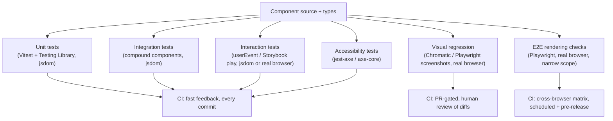

export const metadata = {
  title: "8. Testing Strategy",
  description:
    "The design system testing pyramid: unit, integration, interaction, accessibility, visual regression and snapshot testing with Vitest, Testing Library and Playwright.",
};

# 8. Testing Strategy

## Quick Glance

- A design system's test pyramid is shaped differently from an app's: heavy on unit, interaction, accessibility, and visual testing, and light on E2E, because components don't own routing or business logic.
- **Unit tests** check rendering and behavior in `jsdom` (a fake DOM in Node) — fast, no real browser needed.
- **Interaction tests** drive a component through a real sequence of events (`userEvent`) and catch focus-order/timing bugs a props-only test can't reach.
- **Accessibility tests** (`jest-axe`/`axe-core`) mechanically check about a third of WCAG success criteria — a floor, not proof the component is accessible.
- **Visual regression** (Chromatic, Playwright screenshots) needs a real browser because it depends on real fonts, layout, and paint — its biggest failure mode is flaky diffs from font/animation timing.
- **Snapshot testing** is fine for small, stable output (like generated CSS variables) and an anti-pattern for full component markup, where diffs get rubber-stamped instead of read.
- Testing Library's rule: query by role and accessible name (`getByRole`), not by CSS class or test ID — this doubles as an accessibility check.
- If asked "why is E2E narrow here": say a design system has no user flows to test, so E2E is scoped to cross-browser rendering checks only.
- Vitest is faster than Jest at scale mainly because it reuses the app's real Vite transform pipeline instead of a separate Babel step.
- If asked "is a clean jest-axe report enough": no — automated tools catch the mechanical third; the rest needs a manual screen-reader/keyboard pass.

## Definition

A design system's **testing strategy** is a deliberate choice about where
to spend test effort: unit, integration, interaction, accessibility, and
visual regression. The goal is to catch the specific bugs a component
library actually produces — not to copy the E2E-heavy pyramid a typical
product application uses.

Here's why the shape is different. A design system component owns
*rendering, behavior, and accessibility* — but not business logic, data
fetching, or routing. So the tests that catch real regressions cluster
around the unit, interaction, and visual layers. End-to-end (E2E) testing
— tests that drive a real browser through a full user flow — plays a
narrow, specific role here, instead of the dominant role it plays in
application testing.

## Problem Statement

Take the standard testing pyramid most engineers learn: lots of unit
tests, a moderate layer of integration tests, and a thin cap of expensive
E2E tests. Now apply it, unmodified, to a design system repo. It doesn't
fit.

An E2E test drives a browser through a *user flow*: log in, add an item to
a cart, check out. A design system doesn't have user flows — it has
components with no opinion about what screen they're on or what happens
after you click them. Writing "E2E tests" for a `Button` means either
inventing a fake screen just to put it on (testing a screen nobody ships)
or skipping E2E almost entirely.

If a team applies the standard pyramid by rote, one of two bad things
happens. Either they waste effort building fake E2E scaffolding around
components that don't need it, or they under-invest in the layers that
actually matter: does this component render the right ARIA attributes in
every state, does the visual output break when a shared token changes,
does keyboard navigation work exactly as documented. This isn't a
nitpick — it's the difference between a test suite that catches the bugs a
design system actually ships (broken focus order, a token change quietly
shifting spacing across forty components, a missing `aria-invalid` on an
error state) and one that gives false confidence while missing all three.

## Why Does This Exist?

The shape of a design system's test pyramid follows directly from what a
component *is responsible for* — and what it explicitly is not. A
component in `@org/design-system` typically has: props in, markup and
behavior out, no server calls, no routing, no business rules about what a
valid order total is. So its correctness has four parts:

- **Rendering correctness** — does it produce the right DOM for a given
  set of props?
- **Behavioral correctness** — does clicking, typing, or pressing a key do
  the documented thing?
- **Accessibility correctness** — can this be used and understood with
  assistive technology?
- **Visual correctness** — does it still look right after an unrelated
  dependency changed?

None of those four need a browser navigating between pages, or a backend
answering requests. That's exactly why unit, interaction, and visual
testing dominate here, and E2E is reserved for one narrow slice: "does
this render correctly across real browser engines," not "does this user
flow work." Teams that get this allocation wrong pay for it either way:
too much E2E wastes CI minutes on scenarios the design system doesn't
own; too little unit/visual/interaction coverage means the bugs that
*do* belong to this layer ship silently.

## Historical Context

Testing Library (`@testing-library/react`), released in 2018 by Kent C.
Dodds, was the turning point for this whole area. It replaced Enzyme's
API, which focused on implementation details (`wrapper.state()`,
`wrapper.find('.btn')` matching CSS classes), with one centered on the
accessibility tree (`getByRole`, `getByLabelText`). This wasn't just a
style preference — it directly made component tests start catching
accessibility regressions as a side effect of normal behavior testing.
If a test can't find your button by its accessible role, that's telling
you something a screen reader user would also struggle with.

Jest snapshot testing, popular around the same time, initially looked
like a cheap fix for "regression testing for UI": render a component,
save the output, diff it against future runs. But the industry spent the
next several years learning its failure mode in practice. Developers
rubber-stamp large, unreadable diffs without reading them, and a snapshot
changing doesn't tell you whether it's "a real regression" or "an
intentional change" — covered in depth below.

Percy (2016) and later Chromatic (Storybook's own visual regression
product, which became mainstream alongside CSF around 2019–2021)
answered a related problem — "how do I know the DOM output still looks
right" — but by diffing pixels instead of markup. That sidesteps
snapshot testing's biggest failure (unreadable diffs) at the cost of a
new one (flaky diffs from rendering that isn't perfectly consistent run
to run, covered below).

Vitest, released in 2021 alongside Vite's rise, is the most recent big
shift: a test runner with a Jest-compatible API, built on native ESM
(the browser's built-in module system) and Vite's own transform
pipeline. Large monorepos have adopted it specifically for the speed
difference at scale — covered in detail in its own section below.

## How It Works Internally

The mechanism that ties this whole layer together: every tool here
operates on **the same rendered output** — a component tree mounted with
`render()` from Testing Library. That render can happen in a headless DOM
(`jsdom`/`happy-dom`, for unit and interaction tests), a real browser
(Playwright, for E2E and browser-mode Vitest), or Storybook's preview
iframe (for visual regression and Storybook-hosted interaction tests, see
[Chapter 7](/chapters/storybook)). What differs between layers is *what
gets checked against that render* and *what environment it renders in*:

- **Unit tests** check the accessibility tree and DOM output for a given
  set of props, in `jsdom`/`happy-dom` — no real browser needed, because
  layout and paint don't matter for what's being checked.
- **Interaction tests** additionally *drive* the render with simulated
  real events (`userEvent`, which dispatches actual `PointerEvent`/
  `KeyboardEvent` sequences instead of calling handlers directly), then
  check the DOM state after each step.
- **Accessibility tests** run `axe-core`'s rule engine against the
  rendered DOM to mechanically check WCAG success criteria that have a
  programmatic check — contrast ratios computed from resolved styles,
  ARIA attribute validity, landmark structure.
- **Visual regression tests** render in a *real* browser (Chromatic's
  cloud browsers, or Playwright's) because pixel output depends on real
  font rendering, real layout, and real paint — none of which `jsdom`
  simulates. They then diff the rendered pixels against a stored baseline
  image.
- **E2E tests** load the actual built package inside a real browser via
  Playwright and check rendering and behavior with no mocked DOM APIs
  anywhere in the stack.

This is why the pyramid is shaped the way it is: each layer down from E2E
trades away some realism (a real browser, real paint, real event timing)
for much lower cost and higher speed. A design system's correctness
surface — rendering, behavior, accessibility, not business logic or
navigation — happens to be almost entirely testable at the cheap end of
that tradeoff.

## Architecture



The shape to notice: five of the seven layers run on every commit,
because they're fast and don't need a real browser. Visual regression is
PR-gated specifically because it needs a human to judge the diff. E2E
runs least often, because it's the most expensive and narrowest in scope.
This cost/frequency balance is the opposite of a typical app's, and it's
the concrete expression of the "different pyramid shape" idea above.

## Real-World Example

Radix UI's own test suite (the primitives library many design systems
build on top of, covered further in
[Chapter 14](/chapters/case-studies)) is a good example precisely because
it's almost entirely about behavior and accessibility. Its tests check
ARIA attribute presence, focus movement, and keyboard event sequences for
components like `Dialog` and `DropdownMenu`, with almost no snapshot or
visual assertions in the core package — because Radix ships unstyled, so
visual regression genuinely isn't its concern; a consumer's own styling
layer owns that.

Contrast that with Shopify's Polaris, which *does* ship default styling
and correspondingly invests heavily in Chromatic visual regression across
its component set — the testing investment tracks exactly what each
library actually owns. Atlassian's `@atlaskit` packages are a good
example of the accessibility layer specifically: their design system team
has publicly described using `jest-axe` as a required check inside unit
tests, not just as a separate audit step, so a component *cannot* merge
with a missing accessible name or an invalid ARIA pattern. That catches
the issue at the same point in the workflow as a type error, instead of
in a downstream audit weeks later.

## Implementation Example

### Unit testing components

What's worth unit-testing on a `Button` or `Input` is behavior and
accessibility surface — not implementation details like internal state
variable names or which CSS class got applied:

```tsx
// Button.test.tsx
import { describe, it, expect, vi } from "vitest";
import { render, screen } from "@testing-library/react";
import userEvent from "@testing-library/user-event";

import { Button } from "./Button";

describe("Button", () => {
  it("renders its accessible name from children", () => {
    render(<Button>Save changes</Button>);
    // Query by role + accessible name — the same lookup a screen reader
    // user's assistive tech performs. This is deliberate: see "Testing
    // Library" below for why this specific query style matters more here
    // than in an app.
    expect(screen.getByRole("button", { name: "Save changes" })).toBeInTheDocument();
  });

  it("is not operable when disabled", async () => {
    const onClick = vi.fn();
    const user = userEvent.setup();
    render(
      <Button disabled onClick={onClick}>
        Save changes
      </Button>,
    );
    const button = screen.getByRole("button", { name: "Save changes" });
    // Assert the actual accessibility contract for disabled controls, not
    // just that a `disabled` prop was passed through.
    expect(button).toBeDisabled();
    await user.click(button);
    expect(onClick).not.toHaveBeenCalled();
  });

  it("exposes a loading state to assistive technology, not just visually", () => {
    render(<Button loading>Save changes</Button>);
    const button = screen.getByRole("button");
    // A spinner that's only communicated via a CSS class is invisible to
    // a screen reader — aria-busy is the actual contract worth testing.
    expect(button).toHaveAttribute("aria-busy", "true");
  });

  it("forwards a ref to the underlying DOM button", () => {
    const ref = { current: null as HTMLButtonElement | null };
    render(<Button ref={ref}>Save changes</Button>);
    // Design systems promise ref forwarding as part of the public API
    // contract (see Chapter 3) — worth asserting explicitly, since a
    // regression here silently breaks every consumer relying on it.
    expect(ref.current).toBeInstanceOf(HTMLButtonElement);
  });
});
```

What's *not* worth testing here: how `loading` internally sets
`aria-busy` (that's an implementation detail — test the resulting
attribute, not the code path), a snapshot of the full rendered markup
(see Snapshot Testing below for why), or re-testing that React itself
calls `onClick` on click (that's testing React, not your component).

### Integration testing compound components

A compound component like `Tabs` — `Tabs.Root`, `Tabs.List`, `Tabs.Tab`,
`Tabs.Panel` (see [Chapter 3](/chapters/component-architecture) for the
compound component pattern itself) — has correctness that only shows up
at the *composition* level: which panel is visible depends on state
shared across four separate subcomponents. Testing each subcomponent
fully on its own can't catch a coordination bug, so integration tests
render the whole composed unit:

```tsx
// Tabs.test.tsx
import { describe, it, expect } from "vitest";
import { render, screen } from "@testing-library/react";
import userEvent from "@testing-library/user-event";

import { Tabs } from "./Tabs";

describe("Tabs (integration)", () => {
  it("shows only the panel matching the active tab, and updates aria-selected", async () => {
    const user = userEvent.setup();
    render(
      <Tabs.Root defaultValue="billing">
        <Tabs.List aria-label="Account settings">
          <Tabs.Tab value="profile">Profile</Tabs.Tab>
          <Tabs.Tab value="billing">Billing</Tabs.Tab>
        </Tabs.List>
        <Tabs.Panel value="profile">Profile form</Tabs.Panel>
        <Tabs.Panel value="billing">Billing form</Tabs.Panel>
      </Tabs.Root>,
    );

    expect(screen.getByRole("tab", { name: "Billing" })).toHaveAttribute(
      "aria-selected",
      "true",
    );
    expect(screen.getByText("Billing form")).toBeVisible();
    expect(screen.queryByText("Profile form")).not.toBeInTheDocument();

    await user.click(screen.getByRole("tab", { name: "Profile" }));

    // The state coordination between Tabs.List and Tabs.Panel is the
    // thing under test — this bug class doesn't exist at the individual
    // subcomponent level.
    expect(screen.getByRole("tab", { name: "Profile" })).toHaveAttribute(
      "aria-selected",
      "true",
    );
    expect(screen.getByText("Profile form")).toBeVisible();
  });
});
```

### Interaction testing

Interaction tests exist to catch a bug class unit tests structurally
can't reach: bugs in *sequences* of real events. Focus order across
multiple key presses. Whether a second `Enter` while a menu is animating
closes it too early. Whether `Tab` after selecting an option lands focus
in the right place. The tooling is the same `userEvent` API shown above,
or Storybook's play functions (see [Chapter 7](/chapters/storybook) for
how play functions work) when it helps to see the scenario step through
visibly in the Interactions panel:

```tsx
// Select.interaction.test.tsx
import { describe, it, expect } from "vitest";
import { render, screen } from "@testing-library/react";
import userEvent from "@testing-library/user-event";

import { Select } from "./Select";

describe("Select keyboard interaction", () => {
  it("opens on ArrowDown, moves highlight with arrows, commits with Enter, returns focus to trigger", async () => {
    const user = userEvent.setup();
    render(
      <Select.Root label="Country">
        <Select.Option value="in">India</Select.Option>
        <Select.Option value="jp">Japan</Select.Option>
        <Select.Option value="us">United States</Select.Option>
      </Select.Root>,
    );

    const trigger = screen.getByRole("combobox", { name: "Country" });
    trigger.focus();
    await user.keyboard("{ArrowDown}");
    expect(screen.getByRole("listbox")).toBeInTheDocument();

    await user.keyboard("{ArrowDown}{ArrowDown}{Enter}");

    // The full sequence — not just the end state — is what's meaningful:
    // this catches a bug where, e.g., the second ArrowDown skips an
    // option because of an off-by-one in highlight index management.
    expect(trigger).toHaveTextContent("United States");
    // Closing a listbox without returning focus to the trigger is a
    // common, easy-to-miss a11y regression.
    expect(trigger).toHaveFocus();
  });
});
```

This differs from the unit test class above in one important way. A unit
test typically drives the component straight into a target state via
props (`<Select defaultValue="us">`) and checks that state. An
interaction test insists on reaching that state through the *same event
sequence a real keyboard user would produce* — which is exactly what
catches order-of-operations and focus-management bugs that a props-driven
test never exercises.

### Accessibility testing

`jest-axe` (for Vitest/Jest unit tests) and `@axe-core/react` (for
runtime dev-mode auditing inside an actual running app) both wrap the
same axe-core rule engine used by Storybook's a11y addon
([Chapter 7](/chapters/storybook)) and Lighthouse:

```tsx
// Dialog.a11y.test.tsx
import { describe, it, expect } from "vitest";
import { render } from "@testing-library/react";
import { axe } from "vitest-axe"; // jest-axe's Vitest-compatible equivalent

import { Dialog } from "./Dialog";

describe("Dialog accessibility", () => {
  it("has no detectable axe violations when open", async () => {
    const { container } = render(
      <Dialog.Root open onOpenChange={() => {}}>
        <Dialog.Title>Delete project</Dialog.Title>
        <Dialog.Description>
          This action cannot be undone.
        </Dialog.Description>
        <Dialog.Content>
          <button>Cancel</button>
          <button>Delete</button>
        </Dialog.Content>
      </Dialog.Root>,
    );

    // toHaveNoViolations checks WCAG 2.x rules axe-core can evaluate
    // programmatically — contrast, ARIA validity, labeling, landmarks.
    const results = await axe(container);
    expect(results).toHaveNoViolations();
  });
});
```

<Callout type="warning" title="Automated a11y tooling has a real, measurable ceiling">
  Deque Systems' own research on axe-core — the engine behind `jest-axe`,
  `@axe-core/react`, the Storybook a11y addon, and Lighthouse — puts
  automated coverage at roughly **20–40% of WCAG success criteria**,
  commonly rounded to "about a third." This is a structural limit, not a
  gap current tools just haven't closed yet. Rules like color contrast,
  ARIA attribute validity, and landmark structure can be checked
  mechanically from computed styles and the accessibility tree. But
  questions like "does this error message make sense when read aloud out
  of context," "is this the right heading level for the actual content,"
  or "does this custom widget's keyboard model match what a screen reader
  user expects" need human judgment about meaning — something a rule
  engine can't evaluate. A clean `jest-axe` report is a floor, not proof
  of accessibility. See [Chapter 5](/chapters/accessibility) for the
  manual testing (screen reader walkthroughs, keyboard-only passes) that
  closes the remaining gap.
</Callout>

### Visual regression testing

Visual regression tools (Chromatic, Percy, Playwright's
`toHaveScreenshot()`) all follow the same basic pattern: render the
component or story in a real browser, capture a screenshot, and compare
it — pixel by pixel, or with a perceptual diff — against a stored
baseline image for that exact scenario:

```tsx
// Card.visual.spec.ts — Playwright screenshot testing
import { test, expect } from "@playwright/test";

test.describe("Card visual regression", () => {
  test("default state matches baseline", async ({ page }) => {
    await page.goto("/storybook/iframe.html?id=surfaces-card--default");
    // Wait for web fonts to finish loading before capturing — the #1
    // source of flaky visual diffs is a screenshot taken mid-font-swap.
    await page.evaluate(() => document.fonts.ready);
    await expect(page.locator("#storybook-root")).toHaveScreenshot(
      "card-default.png",
      { maxDiffPixelRatio: 0.01 },
    );
  });
});
```

The mechanism is simple; the practical failure mode is not. **Font
rendering and animation timing are the number-one cause of flaky visual
diffs.** A screenshot taken one frame before a web font finishes
swapping, or mid-transition on a hover/focus animation, produces a "diff"
that's really just timing noise. A team that doesn't fix this quickly
trains itself to ignore visual regression alerts entirely (the same
failure mode described for Chromatic in
[Chapter 7](/chapters/storybook)). The standard fixes, in order of
impact:

- Disable CSS transitions and animations in the test environment (inject
  a global `* { animation: none !important; transition: none !important; }`
  only for visual test runs).
- Explicitly wait for `document.fonts.ready` before capturing.
- Pin to a small, controlled set of target browsers/viewports instead of
  the full real-world matrix.
- Freeze any non-deterministic content — relative timestamps, random IDs,
  locale-dependent number formatting — with fixed test fixtures.

### Snapshot testing

Jest/Vitest **snapshot testing** works like this: render a component,
save its output as text, and fail the test if a future render produces
different output. It looked like an easy win for UI regression testing
when it was introduced. The industry's experience with it at scale
surfaced two specific, well-documented problems:

```tsx
// Anti-pattern: a full-markup snapshot that will churn on every
// unrelated refactor and gets rubber-stamped rather than read.
it("matches snapshot", () => {
  const { container } = render(<Card title="Hello" />);
  expect(container).toMatchSnapshot(); // dozens of lines of DOM structure
});
```

The first problem is **blind approval**: a diff spanning fifty lines of
saved markup isn't something a human reliably reads line-by-line under PR
review pressure. In practice, `git commit` / `jest -u` becomes a reflex,
and the "test" stops giving any real signal, positive or negative.

The second problem is **testing structure instead of behavior**: a
snapshot of full markup breaks on *any* markup change, including
correct, intentional ones (adding a wrapper `<div>` for a new feature).
That means the test can't tell "this is a regression" from "this is
expected" — it just says "something changed," and a human has to do all
the actual reasoning the test should have done. That's close to the
opposite of what a good test should do: a good test fails specifically
when behavior is wrong, and stays green through refactors that keep
behavior the same.

Snapshot testing is genuinely useful in one narrow case: **small,
stable, meaningful output** — a design token transformation's generated
CSS variables, a component's resolved `className` string, a small
serialized object with a handful of fields. Here the surface is small
enough that a diff is actually readable, and the thing being snapshotted
rarely changes on purpose. The rule of thumb: if a snapshot diff would
take more than a few seconds to actually check, it's testing structure,
not behavior — replace it with an explicit assertion (`expect(button)
.toHaveAttribute("aria-busy", "true")` instead of a full-markup snapshot
of the same button).

### Playwright

Playwright's role in a design system repo is deliberately **narrower**
than in an application repo. It's not testing user flows — a design
system has none — it's doing **cross-browser rendering checks**:
confirming CSS actually computes and paints consistently across
Chromium, Firefox, and WebKit. `jsdom`-based unit tests can't verify this
at all, since `jsdom` doesn't implement real layout or paint.

```ts
// cross-browser.spec.ts
import { test, expect, devices } from "@playwright/test";

// Design systems specifically care about real engine differences —
// Safari's flexbox gap handling, Firefox's focus-ring rendering — that
// jsdom-based unit tests cannot catch because jsdom never lays anything
// out or paints anything.
for (const browserName of ["chromium", "firefox", "webkit"] as const) {
  test(`Button renders a visible focus ring in ${browserName}`, async ({
    page,
  }) => {
    await page.goto("/storybook/iframe.html?id=inputs-button--default");
    await page.keyboard.press("Tab");
    const outline = await page
      .locator("button")
      .evaluate((el) => getComputedStyle(el).outlineStyle);
    expect(outline).not.toBe("none");
  });
}
```

This is also where Storybook's own **test runner** (mentioned in
[Chapter 7](/chapters/storybook)) sits — it's Playwright under the hood,
running every story's play function headlessly across real browser
engines in CI. It's the closest a design system gets to "E2E" without
inventing a fake application to test against.

### Vitest vs Jest

```tsx
// vitest.config.ts — note the shared config surface with Vite itself,
// which is exactly why a Vite-built design system's test config is
// nearly free once the build is already on Vite.
import { defineConfig } from "vitest/config";
import react from "@vitejs/plugin-react";

export default defineConfig({
  plugins: [react()],
  test: {
    environment: "jsdom",
    setupFiles: ["./vitest.setup.ts"],
    coverage: { provider: "v8", reporter: ["text", "html"] },
  },
});
```

| | Vitest | Jest |
| --- | --- | --- |
| What problem it solves | Fast, ESM-native test execution reusing the project's real Vite transform pipeline | Mature, zero-config-friendly test runner with a huge ecosystem, predates widespread ESM tooling |
| Why it was created | Jest's CommonJS-era transform pipeline (Babel) duplicates build config and is slow on large ESM codebases | General-purpose JS testing needed a batteries-included runner in the pre-Vite era |
| Performance | Significantly faster in large monorepos — no separate transform step, native ESM, smart watch-mode re-runs via Vite's module graph | Slower on large suites, especially with Babel transforms and `ts-jest`; improved but still behind on cold start |
| Developer experience | Near-instant watch mode, shares config with the app's real Vite build, built-in browser-mode for real-DOM testing | Extremely mature DX, huge community troubleshooting surface, `--watch` is solid but slower to start |
| Learning curve | Low if already on Vite; near-identical API to Jest (`describe`/`it`/`expect`) intentionally | Low — long-established, most engineers already know it |
| Community / ecosystem | Growing fast, official integrations for Testing Library/MSW/most modern tooling, still smaller than Jest's | Largest test-runner ecosystem in the JS world, virtually every tutorial/StackOverflow answer targets it |
| Maintenance burden | Low once on Vite; config is largely shared with the build tool | Low, but Babel/`ts-jest` transform config is a recurring source of subtle bugs at scale |
| Enterprise suitability | High and rising — default choice for new Vite-based projects | Still very high — many large, established codebases aren't moving off it soon |
| When to choose it | New project already on Vite, or a large monorepo where transform/startup speed is a measured pain point | Existing large Jest suite with no acute speed problem, or dependency on a Jest-only plugin |
| When NOT to choose it | Deep dependency on a Jest-specific plugin with no Vitest equivalent yet | Starting fresh on Vite with no legacy Jest investment — there's no longer a strong reason to pick Jest new |

The real driver behind migrations, concretely: teams don't move to
Vitest because "it's newer" — they move because a large monorepo's Jest
suite has a slow transform step (Babel or `ts-jest` re-parsing and
re-transforming TypeScript on every run), and that shows up in both cold
start and watch mode. Vitest reuses the exact same Vite pipeline the app
already runs through in dev, so there's no separate transform
configuration to maintain or to fall out of sync with the real build.

Large orgs still on Jest generally aren't migrating just for its own
sake — the switch tends to happen alongside a broader move to Vite for
the build itself, since doing it standalone is real work (different mock
APIs, config translation, subtle differences in timer/module-mocking
behavior). That work only clearly pays off once the suite is large enough
to actually feel Jest's transform overhead.

### Testing Library and its guiding philosophy

Testing Library's stated philosophy — *"the more your tests resemble the
way your software is used, the more confidence they can give you"* —
translates into one concrete rule: **query by role and accessible name,
not by CSS class, test ID, or component internals**:

```tsx
// Anti-pattern — queries by implementation detail (a CSS class or
// test-id), which passes even if the button is invisible to a screen
// reader (e.g. missing an accessible name).
screen.getByTestId("submit-button");

// Testing Library idiom — queries the same way the accessibility tree
// exposes the element, which fails loudly if the button has no
// accessible name, exactly the way a screen reader user would also fail
// to identify it.
screen.getByRole("button", { name: "Submit order" });
```

This matters *more* for a design system than for an application, for a
specific reason: **a design system's actual consumers interact with the
component through the same accessible-role/name interface a screen
reader user does.** An app consuming `<Button>` from the design system
doesn't know or care about the button's internal class names or DOM
depth. It cares that it's a real `<button>` with a correct role and
accessible name — that's the contract the design system promises every
consumer, and it's also literally the interface assistive technology uses
to expose the button to a non-sighted user.

A test suite that queries by role/label is therefore testing the
component's *actual public API* (its accessible contract), not an
incidental implementation detail like which CSS class happens to be
applied this week. A design system's public API is exactly what has to
stay stable across refactors, or consumers break. This is the same
reasoning [Chapter 3](/chapters/component-architecture) applies to
composition patterns: test the contract, not the implementation, because
the contract is what a hundred downstream consumers actually depend on.

## Advantages

- **The pyramid shape matches the actual bug surface.** Heavy unit,
  interaction, and visual investment catches the regressions a design
  system actually ships; minimal E2E avoids wasted effort on flows the
  library doesn't own.
- **Testing Library's role-based queries double as accessibility
  verification.** A passing test suite is partial evidence the component
  is operable by assistive technology, essentially for free.
- **Fast feedback loop.** Unit, integration, interaction, and
  accessibility tests all run in `jsdom` without a browser, which keeps
  the inner dev loop and CI both fast. Visual regression and E2E, the
  two layers that need a real browser, are correspondingly the two run
  least often.
- **Layered coverage catches genuinely different bug classes.** Unit
  tests catch wrong output for given props; interaction tests catch
  sequence/timing/focus bugs; visual regression catches unintended
  cascading style changes; accessibility tests catch a mechanically
  checkable subset of a11y regressions — no single layer covers what the
  others do.

## Disadvantages

- **Automated accessibility testing has a hard ceiling.** Roughly a third
  of real issues are mechanically catchable; teams that treat a clean
  `jest-axe` report as "done" ship real accessibility gaps.
- **Visual regression is inherently flaky without active maintenance.**
  Font loading and animation timing produce false positives that erode
  trust in the gate if not actively fixed.
- **Snapshot testing is easy to misuse and hard to fix once misused.**
  Once a team's culture normalizes blindly re-approving snapshot diffs,
  reversing that habit is a cultural problem, not a tooling fix.
- **Multiple test layers is a real ongoing cost.** Five to seven distinct
  test types per component means more infrastructure to maintain, more CI
  time, and more places a flaky test can hide than a single-layer
  strategy — this only pays off at real component-library scale.
- **A narrow E2E layer can mean cross-browser bugs slip through longer.**
  Deliberately scoping E2E down trades away some real-browser coverage
  for speed; a genuine cross-engine rendering bug might only surface in
  the (less frequent) Playwright run instead of on every commit.

## Alternatives

Testing *strategy* itself doesn't have interchangeable "alternatives" the
way a styling engine does, but the tools within each layer do. What's
worth comparing explicitly is **where a team draws the layer
boundaries** — how much gets pushed into unit vs. interaction vs. visual
vs. E2E:

| Approach | What problem it solves | Performance | DX | Learning curve | Ecosystem | Maintenance burden | Enterprise suitability | When to choose | When NOT to choose |
| --- | --- | --- | --- | --- | --- | --- | --- | --- | --- |
| Unit-heavy, minimal visual/E2E | Fast feedback on behavior/props | Fastest | High — quick loop | Low | Huge (Testing Library, Vitest) | Low | Good for small/early-stage systems | Small team, few visual regressions historically | Component library with heavy shared-token cascading risk |
| Balanced pyramid (this chapter's model) | Matches design-system-specific bug surface across all layers | Fast on the cheap layers, slower on visual/E2E (mitigated by scoping) | High once set up; real initial setup cost | Moderate | Strong across all tools involved | Moderate — multiple layers to keep healthy | High — this is what large design system orgs converge on | Any design system with real external consumers and a shared token/style layer | Very small internal component set, single maintainer |
| Visual-regression-heavy, light unit | Catch every pixel regression | Slow CI (many browser-rendered snapshots), noisy | Lower — diff review fatigue | Low tool-wise, high process discipline needed | Chromatic/Percy ecosystem strong | High — snapshot review is ongoing manual work | Works but expensive at scale | Highly visual, low-behavior-complexity component set | Complex interactive components (visual diffing alone won't catch keyboard/focus bugs) |
| E2E-heavy (app-pyramid applied unmodified) | Full-fidelity, real browser confidence | Slowest, most expensive CI | Poor — slow loop discourages writing tests at all | Low if already Playwright-fluent | Strong (Playwright) | High — E2E suites are notoriously expensive to keep green | Poor fit for a component library specifically | Rarely the right default for a design system | A design system, essentially always — this pyramid shape is mismatched to what the library actually owns |

Large, mature design system orgs converge on the balanced pyramid model
because it's the only one of these that doesn't either waste CI budget
(E2E-heavy) or leave a real bug class uncovered (unit-only, visual-only).
Companies with a heavy design/engineering review culture (Atlassian,
Shopify) lean visibly further toward the visual-regression layer, because
their components ship fully styled and cascading token changes are a
real, frequent risk. Companies shipping unstyled primitives (Radix) lean
further toward the accessibility/interaction layers, because that's the
entirety of what they own.

## Tradeoffs

The central tradeoff across every layer here is **fidelity vs. speed**,
repeated at each rung of the pyramid. `jsdom` is fast but doesn't paint,
so it can't catch real rendering bugs; a real browser catches them but is
slower and more expensive to run on every commit.

The design-system-specific answer is not "maximize fidelity everywhere."
It's to spend the expensive, high-fidelity layers (visual regression,
Playwright) exactly where cheap layers structurally can't substitute —
real paint, real cross-engine CSS differences — and push everything else
(props → output correctness, event sequences, ARIA attribute presence)
down into the fast layers, where speed doesn't cost any real coverage.
Getting this allocation wrong in either direction is the real risk:
over-investing in slow, real-browser layers for things `jsdom` could
catch just as well burns CI budget and developer patience for no extra
signal; under-investing in visual/E2E for the specific bug classes only a
real browser can catch (font rendering, cross-engine flexbox differences,
actual paint-dependent contrast) leaves real regressions unguarded.

## Performance Considerations

Test suite performance in a design system repo compounds differently
than in an app repo, because component libraries tend to have a very
high test *count* relative to code volume — hundreds of small, focused
unit tests per package is normal. `jsdom`'s per-test setup/teardown cost,
multiplied across thousands of tests, becomes the dominant cost long
before any individual test is slow. Vitest's parallelized worker pool
and (for Vite-based projects) shared transform cache directly address
this — the concrete performance argument for the Vitest migration
discussed above, beyond just "it feels faster."

Visual regression's cost scales with snapshot *count*, not test
complexity. Chromatic's TurboSnap (mentioned in
[Chapter 7](/chapters/storybook)) and Playwright's ability to scope
screenshot tests to only the packages a
[monorepo](/chapters/monorepo-architecture)'s dependency graph marks as
affected are both direct responses to this.

Accessibility tests (`jest-axe`) run axe-core's full rule set on every
invocation by default. At high test counts, scoping the rule set to only
the WCAG level actually targeted (commonly AA) instead of running every
available rule keeps this layer from becoming a bottleneck, without
losing meaningful coverage.

## Scalability Considerations

As a design system's component count and consumer count grow, three
things scale worse than expected unless a team steps in deliberately.

First, visual regression snapshot volume grows with both component count
*and* story count per component — which is why scoping visual tests only
to packages a change actually touches, via the dependency graph covered
in [Chapter 9](/chapters/monorepo-architecture), becomes necessary rather
than optional past a few hundred components.

Second, flaky test accumulation compounds. A 0.5% flake rate per test is
invisible at 50 tests and a serious CI-reliability problem at 5,000. This
is an argument for actively quarantining and fixing flaky tests rather
than re-running until green — a habit that erodes trust in the whole
suite, the same way blindly accepted snapshot diffs do.

Third, accessibility and interaction test authorship needs to scale with
contributor count, not just component count. This is where documented
conventions (a `.a11y.test.tsx` naming pattern, a required checklist in
the PR template) matter more than tooling — tying back into the
contribution-model concerns covered in
[Chapter 11](/chapters/governance).

## Common Mistakes

<Callout type="danger" title="Applying an application's E2E-heavy pyramid unmodified">
  A design system component doesn't own routing or business logic, so
  building elaborate E2E suites around fake screens wastes CI budget on
  scenarios the library was never responsible for, while starving the
  unit/interaction/visual layers that actually catch this layer's real
  bugs.
</Callout>

<Callout type="danger" title="Treating a clean jest-axe report as 'accessible, done'">
  Automated a11y tooling catches roughly a third of real issues by
  design — the mechanically checkable third. Shipping without a manual
  screen-reader and keyboard-only pass leaves the other two-thirds
  unverified. See [Chapter 5](/chapters/accessibility).
</Callout>

<Callout type="danger" title="Rubber-stamping snapshot or visual diffs under deadline pressure">
  Both failure modes share the same root cause: a diff too large or too
  frequent for a human to actually evaluate gets approved on reflex. That
  silently turns a regression gate into a no-op, while the CI time and
  false confidence remain.
</Callout>

<Callout type="danger" title="Querying by test-id or CSS class instead of role/label">
  A test that passes via `getByTestId` can still describe a component
  that's functionally broken for a screen reader user — missing
  accessible name, wrong role. Querying by role/label the way Testing
  Library recommends makes the test fail exactly when a real assistive-
  technology user would also fail.
</Callout>

<Callout type="danger" title="Not isolating flaky visual tests from font/animation nondeterminism">
  Shipping visual regression tests without disabling animations and
  waiting on `document.fonts.ready` guarantees a nonzero false-positive
  rate that compounds over time into ignored, distrusted alerts — fix the
  environment, don't just tolerate the flakiness.
</Callout>

## Best Practices

- **Query by role and accessible name by default**; reach for `data-
  testid` only as a last resort when no accessible query exists (rare for
  a well-built design system component).
- **Assert on the accessibility contract explicitly** (`aria-busy`,
  `aria-selected`, `toBeDisabled()`) rather than snapshotting full markup
  — explicit assertions fail specifically when behavior is wrong and stay
  green through unrelated refactors.
- **Write interaction tests for every documented keyboard interaction
  pattern**, not just click handlers — this is the layer that catches
  focus-order and event-sequence bugs nothing else does.
- **Scope visual regression to affected packages only**, using the
  monorepo's dependency graph, rather than re-snapshotting the whole
  library on every push.
- **Disable animations and wait on font-load before every visual
  screenshot** — this single change eliminates the majority of flaky
  visual diffs.
- **Reserve Playwright for genuine cross-browser rendering risk**, not as
  a default layer for every component — a component with no
  browser-specific CSS behavior gets little marginal value from an E2E
  pass beyond what unit/visual already cover.
- **Quarantine and fix flaky tests immediately rather than re-running
  until green** — a flaky test that's tolerated repeatedly is a test the
  team has already stopped trusting.

## Interview Questions

<InterviewQuestion q="Why does a design system's testing pyramid look different from a typical application's?">
  **What the interviewer is testing:** Whether the candidate understands
  this as a consequence of what a design system component actually owns
  (rendering/behavior/a11y, not business logic or routing), not just a
  stylistic preference.

  **Poor answer:** "Design systems just need fewer tests."

  **Good answer:** Explains that components don't have user flows, so
  E2E is narrow, while unit/interaction/visual carry more weight because
  that's where a component's real bug surface lives.

  **Excellent senior answer:** All of the above, plus: gives concrete
  examples of the bug classes each layer catches (unit: wrong output for
  given props; interaction: focus-order/sequence bugs; visual: cascading
  token regressions; a11y: mechanically checkable WCAG violations) and
  explains why E2E specifically is reserved for cross-browser rendering
  checks rather than dropped entirely.

  **Common mistakes:** Concluding "design systems need less testing"
  rather than "design systems need testing effort reallocated to
  different layers."
</InterviewQuestion>

<InterviewQuestion q="What specific bug class does an interaction test catch that a standard unit test cannot?">
  **What the interviewer is testing:** Precise understanding of layer
  boundaries, not just familiarity with `userEvent`.

  **Poor answer:** "Interaction tests check clicking and typing."

  **Good answer:** Notes that unit tests typically drive a component into
  a target state via props, while interaction tests reach that state
  through a real, ordered event sequence — catching bugs in event order,
  timing, and focus movement that a props-driven test structurally can't
  exercise.

  **Excellent senior answer:** All of the above, plus: a concrete example
  (an off-by-one in keyboard-highlight index management that only
  manifests across a specific ArrowDown/ArrowDown/Enter sequence) and
  correctly distinguishes this from what a visual regression test would
  catch instead.

  **Common mistakes:** Treating "interaction test" and "unit test with
  userEvent" as synonymous without identifying what's structurally
  different about asserting on a sequence versus asserting on an end
  state.
</InterviewQuestion>

<InterviewQuestion q="A jest-axe test suite reports zero violations across the whole component library. Is the library accessible? Justify your answer with the actual mechanism.">
  **What the interviewer is testing:** Depth of understanding of
  automated a11y tooling's real limits, and whether the candidate can
  explain *why* rather than just cite a rule of thumb.

  **Poor answer:** "Yes, that means it's fully accessible."

  **Good answer:** No — axe-core checks mechanically verifiable criteria
  (contrast, ARIA validity, labeling) but can't evaluate meaning-dependent
  criteria (does content make sense read aloud, is the reading order
  logical).

  **Excellent senior answer:** All of the above, plus: cites the
  approximate real-world coverage figure (roughly a third of WCAG success
  criteria) and its cause (mechanical vs. judgment-based criteria), and
  names what closes the remaining gap (manual screen reader + keyboard-
  only testing per [Chapter 5](/chapters/accessibility)).

  **Common mistakes:** Treating automated a11y coverage as binary
  (accessible/not) rather than as a partial, bounded signal.
</InterviewQuestion>

<InterviewQuestion q="Your Chromatic visual regression suite is flagging diffs on roughly 15% of PRs even when nothing visual actually changed. Diagnose and fix this.">
  **What the interviewer is testing:** Practical, hands-on debugging
  instinct for the single most common visual-regression failure mode.

  **Poor answer:** "Increase the diff threshold until it stops
  flagging."

  **Good answer:** Identifies font-loading timing and CSS animation/
  transition timing as the most likely causes, and proposes waiting on
  `document.fonts.ready` before capture and disabling transitions in the
  test environment.

  **Excellent senior answer:** All of the above, plus: explains why
  blindly raising the diff threshold is the wrong fix (it also hides real
  small regressions, defeating the tool's purpose) versus fixing the
  actual nondeterminism at its source, and mentions pinning to a
  controlled browser/viewport matrix as an additional lever.

  **Common mistakes:** Reaching for threshold-tuning before diagnosing
  the actual source of nondeterminism.
</InterviewQuestion>

<InterviewQuestion q="When is a Jest snapshot test the right tool, and when is it an anti-pattern?">
  **What the interviewer is testing:** Nuanced judgment rather than a
  blanket "snapshots are bad" reflex, which is a common oversimplification
  that misses real, narrow legitimate uses.

  **Poor answer:** "Snapshot tests are always bad, never use them."

  **Good answer:** Explains the two core pitfalls (blind approval of
  large diffs, asserting structure instead of behavior) and that
  full-component-markup snapshots are usually the anti-pattern.

  **Excellent senior answer:** All of the above, plus: identifies where
  snapshots are still legitimately useful — small, stable, meaningful
  output like a token transform's generated output or a `className`
  composition string — and gives the concrete rule of thumb: if a diff
  takes more than a few seconds to evaluate, it's testing structure, not
  behavior, and should become an explicit assertion instead.

  **Common mistakes:** Either defending snapshot testing unconditionally
  or rejecting it unconditionally, rather than drawing the actual line.
</InterviewQuestion>

<InterviewQuestion q="Why would a large monorepo migrate from Jest to Vitest, concretely — what's actually slow about Jest at scale?">
  **What the interviewer is testing:** Whether the candidate understands
  the real mechanical cause of the speed difference, not just "Vitest is
  the new hotness."

  **Poor answer:** "Vitest is just faster."

  **Good answer:** Jest's transform pipeline (Babel or `ts-jest`)
  re-parses and re-transforms TypeScript separately from the app's real
  build; Vitest reuses the project's actual Vite transform pipeline, so
  there's no duplicate, out-of-sync transform step.

  **Excellent senior answer:** All of the above, plus: notes this
  specifically compounds at monorepo scale — cold start and watch-mode
  re-run cost both scale with the duplicated transform work — and that
  the migration decision should be driven by a measured pain point
  (actual CI/watch-mode timing), not adopted reflexively when there's no
  acute problem and real migration cost (mock API differences, config
  translation).

  **Common mistakes:** Citing "Vitest is faster" without being able to
  explain the actual mechanism (shared Vite pipeline vs. separate Babel
  transform).
</InterviewQuestion>

## Manager-Level Questions

<ManagerQuestion q="Your team wants to add a full Playwright E2E suite to the design system repo, mirroring what the product teams do. How do you evaluate this proposal?">
  **What the interviewer is testing:** Whether the candidate can push back
  on a reasonable-sounding but mismatched proposal using cost/benefit
  reasoning specific to what a design system owns.

  **Poor answer:** "Sure, more testing is always good."

  **Good answer:** Questions what user flows would even be tested, since
  a design system doesn't own routing/business logic, and redirects the
  proposal toward the narrower, genuinely valuable use (cross-browser
  rendering checks) instead of a full E2E suite.

  **Excellent senior answer:** All of the above, plus: frames the
  decision in terms of what bug class would actually be caught versus the
  CI cost of a real-browser suite, and proposes a scoped alternative
  (Playwright cross-browser rendering checks, or leaning on Storybook's
  Playwright-based test runner) that gets most of the value at a fraction
  of the cost.

  **Common mistakes:** Approving the proposal by analogy to app-testing
  norms without examining whether it fits what this specific codebase
  owns.
</ManagerQuestion>

<ManagerQuestion q="A contributor says writing accessibility tests for every component is slowing down their velocity. How do you respond as their manager?">
  **What the interviewer is testing:** Whether the candidate can hold a
  non-negotiable quality bar without being purely authoritarian, and can
  articulate the actual cost of skipping it.

  **Poor answer:** "It's policy, just do it."

  **Good answer:** Explains what's actually being traded away (shipping
  a component with an unverified accessibility contract to potentially
  thousands of downstream consumers) and offers to pair on writing the
  first few to build the habit and speed.

  **Excellent senior answer:** All of the above, plus: distinguishes
  between accessibility testing feeling slow because it's new (a coaching
  problem, solved with pairing/examples) versus the actual test tooling
  being genuinely slow (an infrastructure problem worth fixing), and
  investigates which one this actually is before prescribing a fix.

  **Common mistakes:** Either overriding the concern with pure authority,
  or accepting reduced a11y coverage to protect short-term velocity
  without addressing the root cause.
</ManagerQuestion>

<ManagerQuestion q="Your visual regression suite's false-positive rate has crept up over six months and the team has started auto-accepting most diffs. How do you fix this as a manager, not just as an IC?">
  **What the interviewer is testing:** Systemic thinking about a tooling
  regression trust problem, not a one-off technical fix.

  **Poor answer:** "Tell everyone to review diffs more carefully."

  **Good answer:** Diagnoses the technical root cause (likely font/
  animation nondeterminism) and fixes the environment, then re-establishes
  the review habit once the signal is trustworthy again.

  **Excellent senior answer:** All of the above, plus: proposes a
  concrete metric to track ongoing health (false-positive rate over time,
  or diffs-rejected vs. diffs-accepted ratio), treats the erosion of trust
  as the real problem to solve (not just the flakiness itself), and
  builds a lightweight recurring check-in so this doesn't silently recur
  in another six months.

  **Common mistakes:** Treating this as purely a technical bug to patch
  rather than also a team-trust and process problem that needs an
  ongoing check, not a one-time fix.
</ManagerQuestion>

## Summary

A design system's testing pyramid is shaped by what a component actually
owns — rendering, behavior, and accessibility, not business logic or
routing. That pushes most of the real coverage into unit, integration,
interaction, accessibility, and visual regression testing, with E2E
narrowed to cross-browser rendering checks rather than the user-flow
testing it does in an application repo.

Unit tests should check behavior and the accessibility contract (roles,
ARIA attributes, disabled/loading states), not implementation details or
full-markup snapshots. Integration tests are necessary specifically for
compound components, where correctness only exists at the composed
level. Interaction tests, via `userEvent` or Storybook play functions,
catch a distinct bug class — event sequence, timing, and focus-order
bugs — that props-driven unit tests structurally cannot reach.
Accessibility tooling (`jest-axe`, axe-core) is genuinely valuable but
caps out around a third of real WCAG issues by design, since the rest
requires human judgment.

Visual regression's mechanical process (screenshot, diff against
baseline) is sound, but its practical failure mode — flaky diffs from
font and animation timing — has to be actively engineered around, or the
whole gate loses the team's trust. Snapshot testing is a legitimate tool
for small, stable, meaningful output, and an anti-pattern when applied to
full component markup, where it produces unreadable diffs that get
rubber-stamped instead of evaluated.

Vitest's advantage over Jest is concrete and mechanical — reusing the
project's real Vite transform pipeline instead of a separate Babel-based
one — and the migration is worth making once that transform overhead
becomes a measured pain point at scale. Testing Library's role/label
query philosophy matters more here than in an app, because a design
system's actual public contract with its consumers *is* the accessible
role/name interface — the same interface a screen reader exposes to an
assistive-technology user.

**Key takeaways**

- A design system's test pyramid is unit/integration/interaction/
  accessibility/visual-heavy and E2E-light, because that's where its
  actual correctness surface lives.
- Interaction tests catch event-sequence and focus-order bugs that
  props-driven unit tests structurally cannot.
- Automated accessibility tooling (`jest-axe`, axe-core) catches roughly
  a third of real issues — a floor, not a certificate.
- Visual regression's #1 practical failure mode is flakiness from font
  and animation timing; mitigate at the environment level, don't tolerate
  it or blindly widen thresholds.
- Snapshot testing is fine for small, stable output and an anti-pattern
  for full component markup, where diffs become unreadable and get
  rubber-stamped.
- Testing Library's role/label query philosophy matters more for a
  design system because that accessible interface *is* the component's
  actual public contract with every consumer.
