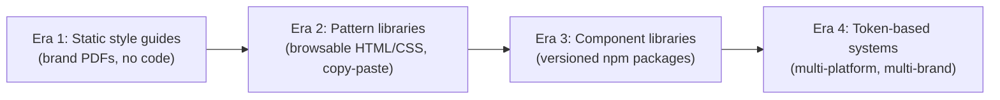
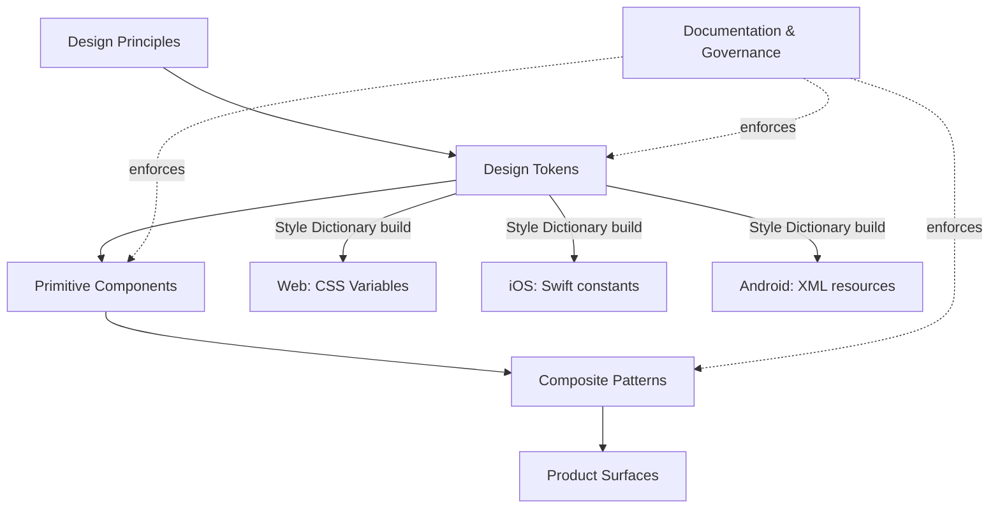

export const metadata = {
  title: "1. What is a Design System?",
  description:
    "First-principles definition, the difference between a component library, pattern library, UI kit and design language, and why large companies invest millions into design systems.",
};

# 1. What is a Design System?

## Quick Glance

- A design system is the single source of truth for a product's UI: visual language, interaction patterns, component behavior, and the code behind all of it.
- Think of it as an organizational contract, not just an artifact — it decides who can define "what a primary button is" and spreads that decision everywhere automatically.
- It matters most once an org passes roughly 20-30 engineers or 3-4 product teams, because informal coordination (Slack, code review) stops scaling past that point.
- Three ROI drivers to name in interviews: product velocity, brand consistency at scale, and engineering leverage (one fix ships to every consumer via a version bump).
- History in one line: static style guides (PDFs) → browsable pattern libraries (copy-paste) → versioned component libraries (npm) → token-based, multi-platform systems.
- Five layers, bottom to top of failure risk: design principles, design tokens, primitive components, composite patterns, documentation/governance — most systems fail at the governance layer, not the code layers.
- Know the precise vocabulary: UI kit (pictures, no code) < pattern library (copyable code, drifts) < component library (real versioned dependency) < design system (all of it, plus governance).
- If asked "why not just use our component library," answer with the problem it solves (governance + consistency + leverage), not the artifact itself.
- Real-world contrast to cite: Shopify Polaris (built for non-designer merchants + third-party app governance) vs. Google Material (built to span many device types and platforms).
- The most common interview tell of a weak answer: describing only the visual/code layer and never mentioning governance, ownership, or process.

## Definition

A **design system** is the single source of truth for a product's UI
decisions. It covers the visual language, interaction patterns, component
behavior, and the actual code that implements all of it. The goal: every
team building part of the product ships something consistent, accessible,
and on-brand — without re-inventing those decisions from scratch each
time.

That's the one-sentence version an interviewer wants to hear first. But it
hides the part that actually matters at the senior level: a design system
is not really an artifact (a file, a package) — it's an **organizational
contract**. It's what lets a 40-person product engineering org ship a
checkout flow, a settings page, and an onboarding wizard — built by three
different teams, in three different sprints — and have them all look and
behave like one team built them on the same day.

Take away the Figma files and the npm package for a moment. What's left is
a governance structure: a decision about who gets to define what "primary
button" means, and a mechanism that spreads that decision to every
consumer automatically, before a design or engineering review even gets
the chance to catch drift.

This framing — governance mechanism first, artifact second — ties
together every other topic in this chapter. It's usually the detail that
separates a mid-level answer from a staff-level one in an interview.

## Problem Statement

Before design systems existed as a discipline, every product team solved
the same UI problems on its own, over and over. A checkout team builds a
modal (a popup window). Six months later, a settings team — with zero
visibility into the checkout team's code — builds a slightly different
modal: different padding, a different close-icon size, and different (or
missing) focus-trap behavior (the rule that keeps keyboard focus locked
inside the popup while it's open).

Now multiply that by every button, form field, dropdown, toast, and empty
state across a product built by 200 engineers. You get three compounding
failures:

1. **Brand and UX incoherence.** Users experience a product as one single
   thing. But if every screen was designed and built alone, the product
   *feels* stitched together from different apps. Trust erodes in small
   ways that are hard to name — a shadow that's slightly off here, an
   error message that looks different there.
2. **Wasted engineering effort.** The same button, modal, and date picker
   get rebuilt dozens of times across the org — with the same bugs, the
   same accessibility gaps, and the same broken edge cases on small
   screens. This is pure waste. It's effort spent solving an
   already-solved problem, instead of building the features that
   actually make the product different.
3. **Unbounded design debt.** Without one shared source of truth, keeping
   things consistent becomes a full-time manual QA job. Someone has to
   notice that Team A's spacing doesn't match Team B's — and by the time
   they notice, dozens of screens have already shipped with the mismatch
   baked in. There's no automated way to catch this, because there was
   never a written rule to check against.

A design system is the answer to this problem. Instead of solving the
same UI problem N times, and instead of relying on people to catch
inconsistency after the fact, you solve it once. You encode the solution
as tokens, components, and documented rules — and make that encoded
solution easier to reach for than reinventing it.

<Callout type="info" title="The tell in interviews">
  When an interviewer asks "why do we need a design system, we already
  have a component library," they're testing whether you mix up the
  *artifact* (the component library) with the *problem it solves*
  (governance, consistency, and leverage at scale). Answer with the
  problem, not the artifact.
</Callout>

## Why Does This Exist?

Design systems exist because of a scaling law. Once a product org passes
roughly 20-30 engineers, or 3-4 product teams, **the cost of communication
between teams grows faster than headcount** — and UI consistency is one
of the first things to suffer. Below that size, a single designer or a
tight-knit team can hold the entire visual language in their head, and
enforce it through code review and Slack messages. Above that size, this
informal system breaks down. Nobody can see every pull request across
every team anymore, and design review turns into a bottleneck instead of
a safety net.

Three concrete forces make design systems a smart investment, not just a
nice-to-have. Interviewers expect you to name all three — and to tie them
to business outcomes, not just looks.

**Product velocity.** A team building a new feature screen with a mature
design system doesn't design or build buttons, inputs, modals, or layout
pieces from scratch. They put together existing, tested, documented
components instead. Airbnb's design team has described this as the
difference between "designing pixels" and "designing systems of pixels."
Once the system exists, feature teams spend their time on the parts of
the product that are actually new — not on re-arguing what a checkbox
should look like. This is leverage in the literal sense: one investment
(the system) pays off on every future feature built on top of it.

**Brand consistency at scale.** For a company like Shopify or Atlassian,
the product *is* the brand for most users. They never see a billboard —
they experience the company through the UI, every day. A design system
is what keeps that experience coherent across a huge, constantly-changing
set of screens (Atlassian alone ships Jira, Confluence, Trello, Bitbucket,
and a dozen smaller products), without a central team having to manually
review every screen.

**Engineering leverage and cost reduction.** This is the number that
actually gets a budget approved. Say a shared, accessible, well-tested
Button component is used 4,000 times across an org. Now an accessibility
fix, a performance fix, or a new theming feature ships once and reaches
everywhere with a single version bump — instead of needing 4,000 separate
patches across 4,000 hand-built buttons. Companies with public design
systems point to this multiplier effect — fewer duplicate components,
fewer accessibility bugs, faster onboarding for new engineers — as the
real return on investment. Not "it looks nicer."

<Callout type="tip" title="How to answer the ROI question">
  If a skeptical VP asks you to justify design system investment, don't
  lead with consistency. Lead with the multiplier: N teams no longer each
  pay the cost of building, testing, and maintaining the same 40
  components on their own. One team pays that cost once. The other N
  teams pay only the much smaller cost of plugging it in.
</Callout>

## Historical Context

To understand why today's design systems look the way they do, it helps
to trace four distinct eras. The tools and vocabulary from each era are
still visible today in how teams talk about design systems.

### Era 1: Static style guides (pre-2010s)

The earliest form of design consistency documentation was the print-style
brand guide, moved to the web as a static page or PDF: "our primary color
is #0057D8, our headline font is Helvetica Bold at 32px." These were
**design-language documents with zero code enforcement** — nothing in the
system checked that shipped code actually matched the document. A
developer could read the PDF and still build the blue as `#0058D9`,
because nothing caught the mistake. Style guides captured *intent*, not
*implementation*. The gap between the two was the whole problem, and only
manual QA closed it.

### Era 2: Pattern libraries (early–mid 2010s)

As frontend frameworks matured (Backbone, then Angular, then early React),
teams started building living, browsable catalogs of UI patterns — real
rendered HTML/CSS snippets you could copy, not just pictures in a PDF.
Salesforce's early Lightning Design System and Yelp's Styleguide are good
examples from this era. This was a real step forward: the pattern library
was closer to what actually shipped, so drift was smaller. But patterns
were still mostly **copy-pasted**, not used as a shared dependency (a
package other code imports and relies on). Each team copied the HTML/CSS
into its own codebase. That meant a fix made upstream still had to be
manually copied everywhere else, by hand.

### Era 3: Component-library systems (mid 2010s–2019)

The shift that defines the modern design-system era: treating the UI
layer as an actual **versioned software dependency**. That means a
component library published to a package registry like npm, which
product teams `import` instead of copy. Google's Material Design (2014)
and Salesforce Lightning made this the norm: a design language *and* a
shipped set of components, versioned together, used as a real package
with a real API contract. This is also when "design system" became its
own job title and discipline — with dedicated design-system engineers and
designers — separate from general product engineering.

### Era 4: Token-based, multi-platform systems (2019–today)

The current era is defined by two shifts, covered in full in
[design tokens](/chapters/design-tokens):

1. Design decisions (color, spacing, typography) got pulled *out* of
   component code and turned into portable, platform-independent
   **design tokens** — simple named key/value data that a build tool
   (Style Dictionary is the standard one) compiles into CSS variables,
   Swift constants, or Android XML files.
2. Systems became multi-platform and multi-brand by default. Companies
   like Adobe (Spectrum) and IBM (Carbon) needed one design language to
   drive web, native mobile, and sometimes desktop apps, all at once.

The W3C Design Tokens Community Group is working to standardize the
token file format (still evolving). That effort is the clearest sign that
tokens are now treated as core infrastructure — not just a design
deliverable.



## How It Works Internally

A mature design system isn't one thing. It's a stack of layers, each one
built on the layer below it, and each one owned by a slightly different
discipline (design, engineering, or both). This layering is the single
most useful mental model — both for interviews and for actually building
a system. Most confusing questions ("is this a design-system thing or a
component-library thing?") get easy to answer once you place them at the
right layer.

**Layer 1 — Design principles.** The qualitative rules that guide every
decision above them: "clarity over cleverness," "content first," "one
primary action per screen." These rarely show up in code. They show up in
design review conversations, and in the "why we built it this way"
sections of component docs.

**Layer 2 — Design tokens.** The smallest named values — colors, spacing,
type sizes, corner radii, shadows, motion durations — that store the
visual language as data instead of as hardcoded values inside component
code. This layer is what makes theming, rebranding, and multi-platform
output possible without touching a single component. Full details in
[design tokens](/chapters/design-tokens).

**Layer 3 — Primitive/foundational components.** Buttons, inputs,
checkboxes, typography components — the smallest reusable pieces, built
using tokens instead of hardcoded values. This is where patterns like
compound components, polymorphism, and headless composition live; see
[component architecture](/chapters/component-architecture).

**Layer 4 — Composite patterns.** Combinations of primitives that solve a
recurring UX problem — a form-with-validation pattern, a data-table
pattern, a settings-page layout pattern. These are usually *documented*
patterns rather than single components (sometimes they're shipped as
actual components, sometimes just as guidance), because the right
combination often depends on the product's context.

**Layer 5 — Documentation and governance.** The layer that makes the
other four layers easy to find, adopt, and keep alive: usage guidelines,
do/don't examples, a process for contributing, a versioning policy, and a
support model. Without this layer, the other four rot. Components get
built, nobody finds them, so they get rebuilt somewhere else — and the
system's whole point (write once, use everywhere) quietly fails.
Governance is covered in full in [governance](/chapters/governance).

A design system almost always fails at layer 5, not layers 1-4. The
technical layers are hard, but they're solvable engineering problems. The
governance layer is an ongoing organizational problem with no permanent
fix — which is why interviewers probe it so heavily (see
[Manager-Level Questions](#manager-level-questions) below, and the full
[governance](/chapters/governance) chapter).

## Architecture

The layers above fit together into a pipeline. Design decisions flow down
through tokens into components. Components combine into patterns.
Patterns assemble into product screens. Documentation and governance wrap
around every layer, keeping it discoverable and enforced.



The two dotted "enforces" arrows are worth calling out. They show the
part most junior engineers miss: governance isn't a layer components pass
*through* — it's a rule applied *to* every other layer, through lint
rules, pull-request review requirements, contribution templates, and a
deprecation policy. A token pipeline with no governance still technically
"works" — it compiles. But nothing stops a second, conflicting set of
tokens from showing up next to it within a few months.

## Real-World Example

Take Shopify's **Polaris** design system. Shopify's core problem:
merchants — small business owners with no design background — need to
run a complex admin panel (orders, inventory, payments, marketing, apps)
without feeling overwhelmed. Polaris exists to solve exactly that. It's
opinionated, almost strict, with firm rules on tone of voice, empty
states, and how much information fits on one screen — because Shopify
decided that merchants understanding the screen matters more than giving
engineers flexible components.

Polaris also has to serve **third-party app developers** building inside
the Shopify admin panel. So it ships more than React components — it
ships strict design guidelines and a review process for apps that want
the "Built for Shopify" badge. That's governance applied outside the
company. Polaris isn't just an internal consistency tool. It's how
Shopify keeps an entire outside ecosystem of apps visually and
behaviorally in line with its own product, without a Shopify engineer
reviewing every line of every app.

Compare that to **Google Material Design**. Material's core problem was
different: Google needed one design language that works across a huge
range of device types — phone, tablet, wearables, desktop web, TV — and
later, across multiple platform toolkits (Android native, Flutter, web).
Material's focus on motion that mimics physical objects, its use of
elevation (shadow to show depth), and its strong rules about layout grids
and screen-size breakpoints all come directly from that cross-platform
goal. Polaris optimizes for "a non-designer merchant can run a complex
admin panel." Material optimizes for "the same design language has to
feel native across very different device types." Same category of tool,
different root problem, different resulting system — this contrast is
exactly what interviewers want you to be able to draw.

## Implementation Example

Design principles and governance live mostly in documents, not code. But
*enforcing* those principles usually does live in code — most often as
lint rules and typed component APIs that make the "wrong" way to use a
component hard or impossible, instead of just discouraged in a wiki page.
Here's a concrete, senior-level example: encoding the design principle
"only one primary action per view" directly into a component's type
system, so breaking the rule is a compile error, not just a comment in
design review.

```tsx
// packages/ui/src/components/action-group/action-group.tsx
//
// Design principle: "One primary action per screen." Rather than relying
// on design review to catch a second `variant="primary"` Button slipping
// into a footer, we encode the constraint in the type system: ActionGroup
// only accepts a single element typed as the primary action, and any
// number of secondary actions. A second primary action is now a
// TypeScript error, not a code-review nit that ships anyway under
// deadline pressure.
import type { ReactElement } from "react";
import { Button, type ButtonProps } from "../button/button";

type PrimaryAction = ReactElement<ButtonProps & { variant: "primary" }>;
type SecondaryAction = ReactElement<ButtonProps & { variant?: "secondary" | "tertiary" }>;

interface ActionGroupProps {
  /** Exactly one primary action — the design principle enforced at the type level. */
  primaryAction: PrimaryAction;
  /** Zero or more secondary actions, rendered before the primary action. */
  secondaryActions?: SecondaryAction[];
}

export function ActionGroup({ primaryAction, secondaryActions = [] }: ActionGroupProps) {
  return (
    <div className="action-group" role="group" aria-label="Actions">
      {secondaryActions.map((action, index) => (
        <span key={index} className="action-group__secondary">
          {action}
        </span>
      ))}
      <span className="action-group__primary">{primaryAction}</span>
    </div>
  );
}

// Usage — this compiles:
// <ActionGroup
//   primaryAction={<Button variant="primary">Save</Button>}
//   secondaryActions={[<Button variant="secondary">Cancel</Button>]}
// />

// Usage — this is a TypeScript error, because `primaryAction` requires
// `variant: "primary"` and only accepts a single element, not an array:
// <ActionGroup
//   primaryAction={<Button variant="secondary">Save</Button>}  // ❌ type error
// />
```

This is a small example, but it shows the core idea that separates a
"design system" from "a folder of shared components." The system
actively prevents the exact kind of inconsistency it was built to stop —
instead of just writing down the rule and hoping engineers read the docs.

## Advantages

- **Compounding engineering leverage.** A fix to the shared Button
  component — an accessibility bug, a new theming feature, a performance
  improvement — ships once and reaches every consumer on the next version
  bump. No need for N separate patches.
- **Faster time-to-market for new features.** Feature teams put together
  existing, tested building blocks instead of rebuilding and re-testing
  basic UI from scratch. This is a direct, measurable speed gain.
- **Consistent, predictable UX.** Users build muscle memory across the
  product because interaction patterns — how a modal closes, how form
  errors show up — don't change from team to team.
- **Accessibility by default.** Centralizing components means
  accessibility work — focus management, ARIA roles (attributes that
  describe UI to screen readers), keyboard navigation, see
  [accessibility](/chapters/accessibility) — gets done once by
  specialists. Every consumer inherits it, instead of every feature team
  trying (and often getting it wrong) on their own.
- **Lower onboarding cost.** A new engineer joining any product team only
  has to learn one component API and one set of conventions — not a
  different custom UI layer for every team.
- **Brand and design coherence at scale** — without a central design team
  having to manually review every screen shipped across the org.

## Disadvantages

- **Real upfront and ongoing cost.** A design system needs a dedicated
  team — designers, engineers, sometimes a PM — that doesn't ship
  user-facing features directly. That's a real cost that has to be
  justified over and over, not just once when the team is founded.
- **Adoption friction and the "not invented here" problem.** Product
  teams under deadline pressure will work around a design system that's
  missing a component they need, or whose API doesn't fit their case.
  This creates "shadow" components — duplicates built outside the
  system — that undermine the whole point of having one.
- **Governance overhead.** RFCs (formal proposals for a change),
  contribution review, and version discipline (see
  [governance](/chapters/governance)) are genuinely slower than one team
  just building whatever it wants. That slowness is a real, legitimate
  complaint — not just resistance to change.
- **Risk of over-abstraction.** A system built too early — before enough
  real usage patterns exist to generalize from — tends to guess wrong
  about what should be configurable. This produces components with either
  too few escape hatches (teams can't do what they need) or too many (an
  API buried under too many options to maintain).
- **Coupling and blast radius.** Because so many screens depend on the
  same shared code, a breaking change or a subtle bug in a core component
  can break dozens of product surfaces at once. The same leverage that
  makes fixes powerful also makes mistakes expensive.

## Alternatives

People often use "design system" loosely to mean any of several related
but different things. Mixing them up is one of the clearest interview
tells that someone hasn't actually built one. Here's the precise
breakdown — which is itself a required topic for this chapter.

| Dimension | UI Kit | Pattern Library | Component Library | Design System |
| --- | --- | --- | --- | --- |
| What it is | A set of static visual assets (usually Figma/Sketch files) — buttons, icons, colors, as pictures | A browsable catalog of reusable UI *patterns*, often as markup/CSS snippets or copy-paste code | A versioned, installable package of coded, interactive UI components (e.g. an npm package) | The full stack: principles + tokens + component library + patterns + documentation + governance |
| What problem it solves | Gives designers a consistent visual starting point in design tools | Gives engineers a reference implementation to copy for common UI patterns | Gives engineers a single shared, tested, accessible implementation to *depend on*, not copy | Gives the whole org (design + engineering + product) one enforced source of truth across every layer |
| Why it was created | Designers needed a shared visual starting point before code existed at all | Engineers needed faster-than-scratch reference markup once frontend frameworks matured | Package registries (npm) made "depend on, don't copy" UI code practical | Team/product count outgrew what informal coordination and a component library alone could keep coherent |
| Who owns it | Usually design alone | Usually engineering, loosely coordinated with design | A dedicated design-system/platform engineering team | A cross-functional dedicated team (design + engineering + sometimes PM) |
| Code enforcement | None — it's pictures, not code | Weak — copied code drifts from the source immediately | Strong — a shared dependency; a bug fix ships to every consumer | Strong, plus process enforcement (RFCs, review, versioning policy) |
| Performance | N/A — no runtime footprint | Whatever the copied code's quality happens to be; no shared optimization | Consistent, since every consumer runs the same optimized, shared implementation | Same as component library, plus token-driven theming with no extra runtime cost when done well |
| Developer experience | Poor for engineers — pictures require manual re-implementation in code | Fast to start, but re-implementing per team; no version upgrades or fixes | Good — install, import, get fixes via version bumps | Best — components, tokens, and docs discoverable in one coherent, documented system |
| Learning curve | Very low | Low | Low-to-moderate (package API, versioning) | Moderate (principles, tokens, governance process, plus the component API) |
| Community / ecosystem support | Tooling-dependent (Figma community files) only | Rare to have real ecosystem tooling around it | Strong for popular libraries (npm ecosystem, TS types, testing tooling) | Strongest for well-known systems (Material, Carbon, Spectrum) — large community, plugins, integrations |
| Maintenance burden | Low effort, but high drift risk since nothing keeps it in sync with code | Rises with every consuming team, since each copy must be independently updated | Centralized — one team maintains, many teams benefit | Highest upfront (principles, tokens, governance, components all maintained together), but lowest per-consumer over time |
| Enterprise suitability | Low alone — insufficient for engineering consistency at scale | Low-to-moderate — breaks down past a handful of consuming teams | High for mid-size orgs with 2+ product surfaces | Highest — this is the standard for large, multi-team, multi-platform orgs (Google, Shopify, Atlassian, IBM, Adobe) |
| When to choose it | Early-stage product, design still exploring visual direction | You need shared reference code fast and don't yet have engineering bandwidth for a real package | You have 2+ teams that need to *consume*, not copy, the same components | You have brand, platform, and team-count pressure that a component library alone can't solve |
| When NOT to choose it | Once you have real shipped code — a UI kit alone will drift from implementation immediately | Once you have more than a couple of consuming teams — copy-paste drift becomes unmanageable | If you have no governance/versioning discipline, a component library becomes "just another shared folder people are afraid to touch" | If you're a single small team on one product — the governance overhead outweighs the benefit |

The practical distinction interviewers actually care about is **artifact
vs. dependency vs. system**. A UI kit is pixels, not code — it can't
check itself against what actually ships. A pattern library is code, but
copied code, so it drifts the moment the source changes and nobody
copies the update everywhere. A component library is a real dependency —
consumers get fixes automatically via version bumps — but it says
nothing about *process*: who can add a component, how breaking changes
get communicated, what happens when two teams need conflicting versions.
A design system is the component library *plus* the tokens, principles,
and governance that keep the whole thing coherent as the org and the
product grow. Large companies invest specifically in the last one,
because at their scale the real failure isn't "we don't have a Button
component" — it's "we have eleven Button components, and nobody knows
which one is the real one."

## Tradeoffs

The central tradeoff in deciding *how much* design system to build:
speed of the individual team versus coherence of the whole product. A
fully centralized system with strict governance keeps things coherent,
but slows down any team that needs something the system doesn't support
yet — they either wait for a proposal (RFC) to get approved, or fork the
code. A loose, lightly-governed shared library keeps individual teams
fast, but slowly turns into "a UI kit with extra steps" as teams patch
around gaps on their own instead of contributing fixes back.

Most mature orgs settle on a **federated contribution model** (detailed
in [governance](/chapters/governance)) to manage this tradeoff. A small
core team owns the primitives and sets the approval bar for anything
shared. Product teams can contribute composite patterns through a
lighter review process.

A second tradeoff worth naming: **investing early versus investing
late**. Building a design system before a company has enough real
product surface area to generalize from is a classic, expensive mistake
— you end up baking one team's assumptions into the system as if they
applied to everyone, and have to walk that back later. Waiting too long
means dozens of different, undocumented UI implementations have already
piled up, and the cost to migrate them explodes.

In practice, the signal to start investing seriously is when a *second*
product team needs the same component the first team already built.
That's real evidence of shared need — not a guess about what might be
needed someday.

## Performance Considerations

At this level — "what is a design system" — performance is mostly about
how the system is *built and delivered*, not about runtime rendering
speed (that's covered in depth in [performance](/chapters/performance)).
Two things matter here:

- **Bundle size discipline is a governance concern, not just a technical
  one.** Every component added to the shared library now ships to every
  consumer that imports from the package — unless the package is
  properly tree-shakeable (only ships the parts you actually use; see
  [packaging](/chapters/packaging)). A governance process that doesn't
  weigh bundle-size impact when approving new components will quietly
  bloat every product built on top of it.
- **Documentation-site performance is part of adoption, not a side
  concern.** If a design system's own documentation site (usually
  Storybook, see [Storybook](/chapters/storybook)) is slow or hard to
  search, engineers under deadline pressure will skip it and build a
  component by hand instead — defeating the entire point of having built
  the system.

## Scalability Considerations

Scalability for a design system means two different things, depending on
the axis: scaling to **more consumers**, and scaling to **more platforms
and brands**.

Scaling to more consumers is mainly an organizational and governance
problem. As team count grows, so does the volume of feature requests,
edge cases, and conflicting needs sent to the core team. This is why
mature systems adopt tiered contribution models and formal proposal
(RFC) processes (see [governance](/chapters/governance)). Without a
formal process, the core team becomes a bottleneck that grows in direct
proportion to the number of consumers — which stops working past a
certain org size.

Scaling to more platforms and brands is mainly a token-architecture
problem. A system with colors hardcoded into component CSS can't support
a second brand or a dark mode without a rewrite. A system built on a
proper token hierarchy (see [design tokens](/chapters/design-tokens)) can
add a second brand or theme as a new set of token *values* — with zero
changes to component code. IBM Carbon and Adobe Spectrum are the clearest
examples of systems built specifically for this kind of scale. Carbon
spans dozens of IBM product lines. Spectrum spans every Adobe creative
and enterprise product, across web, desktop, and mobile.

## Common Mistakes

<Callout type="danger" title="Building the system before there's a second consumer">
  Generalizing from a single team's UI needs produces a system that bakes
  in that one team's assumptions as if they applied to everyone. The fix
  usually needed six months later — loosening constraints that were never
  actually general in the first place — costs more than waiting for a
  second real consumer to test the API first.
</Callout>

<Callout type="danger" title="Treating the design system as 'the component library'">
  Teams that ship a shared npm package and call it done are surprised
  when consistency still slips — because they never built the
  documentation, governance, and enforcement layers that make a
  component library last. The component library is necessary, but it's
  not enough on its own.
</Callout>

<Callout type="danger" title="No deprecation or migration path for breaking changes">
  Publishing a v2 of a core component without a codemod (an automated
  code-rewriting script) or a clear migration guide all but guarantees
  teams stay stuck on v1 forever — fragmenting the exact consistency the
  system was built to provide. See [governance](/chapters/governance) for
  the migration tooling this needs.
</Callout>

<Callout type="danger" title="No metric for adoption or health">
  Teams that don't track "% of UI built with the design system," or
  count shadow/duplicate components, have no way to know whether the
  system is actually working — or being quietly worked around under
  deadline pressure.
</Callout>

## Best Practices

- Start from real, repeated pain across at least two teams — not a guess
  based on one team's needs.
- Invest in documentation and discoverability as seriously as you invest
  in the components themselves. A great component nobody can find
  delivers zero value, no matter how well it's built.
- Write down design principles explicitly, early on. They're the
  tie-breaker in every unclear API or visual decision that comes up
  later. Without them, every debate starts over from scratch.
- Build governance — the contribution model, RFC process, and versioning
  policy (see [governance](/chapters/governance)) — at the same time as
  the first components. Don't leave it for later, after inconsistency has
  already crept in.
- Track adoption metrics — usage percentage, shadow-component count,
  support ticket volume. Treat a drop in adoption as a signal to
  investigate friction, not as a discipline problem to punish.
- Build for tokens (see [design tokens](/chapters/design-tokens)) from
  day one, even with a single brand. Adding token-based theming later,
  onto components with hardcoded values, is a much bigger project than
  building it in from the start.

## Interview Questions

<InterviewQuestion q="What's the difference between a component library and a design system?">
  **What the interviewer is testing:** Whether you understand that a
  design system includes governance, principles, and documentation — not
  just shipped code — and can explain the difference precisely instead of
  treating the two terms as the same thing.

  **Poor answer:** "They're basically the same thing, just different
  names."

  **Good answer:** A component library is the coded implementation. A
  design system also includes design tokens, principles, documentation,
  and governance for how components get used and changed over time.

  **Excellent senior answer:** Adds that mixing up the two terms causes a
  real organizational failure: a team that ships a component library and
  calls it "the design system" gets surprised when consistency still
  slips, because nobody owns the RFC process, deprecation policy, or
  adoption metrics — the parts that keep the library from fragmenting as
  more teams use it.

  **Common mistakes:** Describing only the visual/code layer, and never
  mentioning governance, ownership, or process.
</InterviewQuestion>

<InterviewQuestion q="A UI kit, a pattern library, and a component library all sound similar — how would you distinguish them to a new PM on your team?">
  **What the interviewer is testing:** Precision under pressure to
  simplify — can you compress an accurate technical distinction for a
  non-technical audience without losing the part that matters.

  **Poor answer:** "They're all just different names for the same design
  files."

  **Good answer:** UI kit = pictures for designers; pattern library =
  copyable reference code; component library = a real shared dependency
  that ships fixes to every consumer automatically.

  **Excellent senior answer:** Frames the distinction around *drift
  risk*: a UI kit and a pattern library can silently drift from what's
  actually shipped, because nothing enforces the connection. A component
  library, as a real npm dependency, can't drift from itself — every
  consumer runs the same code, with an explicit version number.

  **Common mistakes:** Treating "component library" and "design system"
  as interchangeable in the same breath as explaining the other two.
</InterviewQuestion>

<InterviewQuestion q="Why would a company with only one product still invest in a design system?">
  **What the interviewer is testing:** Whether you understand that
  design systems solve team-scaling problems, not just multi-product
  problems. A single product built by many teams has the exact same
  consistency and duplication pressures as multiple products would.

  **Poor answer:** "They probably wouldn't need one — design systems are
  for companies with multiple products."

  **Good answer:** Even a single product, once enough separate teams
  build it (checkout, settings, onboarding, and so on), has the same
  consistency-drift and duplicated-effort problem multi-product
  companies face.

  **Excellent senior answer:** Names the actual scaling signal — roughly
  20-30+ engineers, or 3-4+ semi-independent teams working on the same
  product — and explains that below that size, informal coordination (a
  small design team, code review) is genuinely enough. A formal design
  system before that point would be premature overhead.

  **Common mistakes:** Assuming "design system" only makes sense for
  companies with literally multiple branded products.
</InterviewQuestion>

<InterviewQuestion q="How would you explain why Shopify Polaris and Google Material Design look and feel so different, given they're both 'design systems'?">
  **What the interviewer is testing:** Whether you can connect a design
  system's concrete traits back to the actual business or product
  problem it was built to solve — rather than treating design systems as
  interchangeable, generic things.

  **Poor answer:** "Different companies just have different taste."

  **Good answer:** Polaris optimizes for non-designer merchants operating
  a complex admin; Material optimizes for one language spanning many
  device form factors and platforms.

  **Excellent senior answer:** Extends this into a general principle: how
  opinionated and structured a design system is comes directly from its
  root constraint — how sophisticated the audience is, how many
  platforms it spans, whether it's one brand or many. So "which design
  system is better" is usually the wrong question. The right question
  is: whose constraints match yours?

  **Common mistakes:** Comparing them purely on visual style (flat vs.
  skeuomorphic, color choices) without connecting the differences to the
  underlying product problem each was built to solve.
</InterviewQuestion>

<InterviewQuestion q="What's the actual mechanism by which a design system prevents inconsistency, rather than just documenting it?">
  **What the interviewer is testing:** Depth beyond the marketing pitch
  — can you name the actual enforcement mechanisms (typed APIs,
  shared-dependency versioning, lint rules, visual regression tests, PR
  review gates) instead of just vaguely saying systems "help with
  consistency."

  **Poor answer:** "It has all the components documented so people use
  them."

  **Good answer:** Because components are a shared dependency, a fix or
  rule built into the component ships to every consumer automatically
  via a version bump — instead of relying on every team to read and
  follow documentation on their own.

  **Excellent senior answer:** Gives a concrete example of encoding a
  design rule in the type system or component API — for instance, an API
  that turns "two primary buttons in one view" into a compile error, not
  just a documented convention. Connects it to the bigger principle:
  documentation alone never fully prevents drift. Code-level and
  process-level enforcement — lint rules, visual regression tests,
  RFC-gated contribution — is what actually prevents it.

  **Common mistakes:** Describing the *contents* of the system
  (components, tokens, docs) without describing the *enforcement
  mechanism* that keeps consumers from deviating from them.
</InterviewQuestion>

<InterviewQuestion q="If you joined a company with no design system and five different product teams, how would you decide what to build first?">
  **What the interviewer is testing:** Prioritization instinct — would
  you default to building speculative infrastructure, or start from
  evidenced, repeated pain?

  **Poor answer:** "I'd start by building a comprehensive component
  library covering every common UI need."

  **Good answer:** Audit the five teams' existing UI for the components
  that are duplicated most often and causing the most visible
  inconsistency or bug volume, and start there.

  **Excellent senior answer:** Adds that the first deliverable should be
  narrow and proven — tokens plus 3-5 highest-leverage primitives, like
  Button, Input, Typography — with a real second consumer testing the
  API before expanding it further. Adds lightweight governance (even
  just an informal RFC doc) from day one, instead of a big-bang,
  all-at-once system that risks baking one team's assumptions in as
  universal.

  **Common mistakes:** Jumping straight to "build everything" or
  "pick a component library like MUI" without first establishing what the
  org's actual, evidenced pain points are.
</InterviewQuestion>

## Manager-Level Questions

<ManagerQuestion q="How would you get a resistant team to adopt the design system instead of building their own components?">
  **What the interviewer is testing:** Influence without authority — the
  core skill of a design-system lead, since they rarely have the org
  power to mandate adoption directly.

  **Poor answer:** "I'd escalate to their engineering manager and get it
  mandated from above."

  **Good answer:** Find the team's actual pain point — a bug they keep
  re-fixing, a slow build — and show the design system solves it
  directly. Don't lead with a consistency argument they don't personally
  feel.

  **Excellent senior answer:** Adds a concrete adoption mechanism: a
  low-friction migration path (a codemod, or a period where old and new
  can run side by side), a named point of contact for their edge cases
  so they don't feel abandoned mid-migration, and a success metric
  tracked publicly — so the win is visible to their own leadership, not
  just to the design-system team.

  **Common mistakes:** Relying purely on top-down mandate, which breeds
  resentment and shadow non-compliance even when it technically "works."
</ManagerQuestion>

<ManagerQuestion q="How do you decide when a design system investment has paid for itself, and how would you communicate that to leadership?">
  **What the interviewer is testing:** Whether you can translate design
  system work into business metrics leadership actually tracks, not just
  engineering-internal metrics.

  **Poor answer:** "It's pretty clearly better once most teams are using
  it."

  **Good answer:** Track concrete metrics — component adoption
  percentage across teams, reduction in duplicate/shadow components,
  time-to-ship for new features using system components vs. historical
  baseline, and accessibility/bug regression rates.

  **Excellent senior answer:** Frames these metrics as a dashboard
  reviewed on a regular cadence (quarterly), ties at least one metric
  directly to a cost leadership already tracks — engineering hours
  saved, incident count from UI bugs. Is honest that some value (brand
  coherence, faster onboarding) is real but harder to measure exactly —
  naming that tradeoff explicitly, instead of overclaiming precision on
  soft metrics.

  **Common mistakes:** Presenting only qualitative wins ("it looks more
  consistent now") with no quantitative backing, which doesn't survive a
  budget review.
</ManagerQuestion>

<ManagerQuestion q="Two teams disagree about whether a new component belongs in the shared design system or should stay team-owned. How do you resolve it?">
  **What the interviewer is testing:** Governance judgment — whether you
  have a repeatable decision framework rather than resolving each
  conflict ad hoc based on whoever argues loudest.

  **Poor answer:** "I'd just make the call myself as the design system
  owner."

  **Good answer:** Apply a consistent rule: if a second team has a
  genuine, similar need, it likely belongs in the shared system; if it's
  a one-off need specific to one team's domain, it should stay
  team-owned, possibly built on top of shared primitives.

  **Excellent senior answer:** Names the actual criteria in more detail:
  real evidence of reuse (observed, not just claimed), whether the
  component captures a general pattern or one team's specific business
  logic, and the ongoing maintenance cost the core team would take on.
  Routes genuinely unclear cases through the RFC process (see
  [governance](/chapters/governance)) instead of deciding alone — so the
  resolution is legitimate and repeatable.

  **Common mistakes:** Deciding based on team seniority/politics rather
  than a consistent, transparent set of criteria applied the same way
  every time.
</ManagerQuestion>

## Summary

A design system is best understood as an organizational contract enforced
through code — not just a component library or a set of Figma files. It
exists because, past a certain team and product size, informal
coordination (code review, tribal knowledge, a shared Slack channel)
stops being enough to prevent UI inconsistency and duplicated effort. The
cost of that failure grows with every added team and screen.

The precise vocabulary matters in interviews. A UI kit is static design
assets with zero code enforcement. A pattern library is copyable
reference code that drifts from its source the moment someone copies it.
A component library is a real, versioned dependency that mechanically
can't drift from itself. A design system is the full stack — principles,
tokens, components, patterns, documentation, and governance — that keeps
all of the above coherent as an org grows.

Historically, systems evolved from static style guides, through
browsable pattern libraries, to versioned component-library packages, to
today's token-based, multi-platform, multi-brand systems. The same
pressure drove each step: closing the gap between documented intent and
what actually ships.

Real-world systems like Polaris, Material, Carbon, and Spectrum look
different from each other because they were built to solve different
root problems — a non-designer audience, cross-platform device types,
brand coherence across many product lines, consistency across creative
tools. That's the frame to reach for whenever you're asked to compare
them.

**Key takeaways**

- A design system is an enforced organizational contract, not just a
  component library or a Figma file.
- UI kit, pattern library, component library, and design system are
  different things, each with more code enforcement and governance than
  the last — mixing them up is a common interview tell.
- Design systems solve velocity, brand-consistency, and
  engineering-leverage problems that show up specifically at team/product
  scale — not just an aesthetic nicety.
- The historical arc — style guides, then pattern libraries, then
  component libraries, then token-based multi-platform systems —
  reflects one consistent drive: closing the gap between documented
  design intent and shipped code.
- Real systems (Polaris, Material, Carbon, Spectrum) differ because they
  were built to solve different root constraints — always tie
  comparisons back to the underlying product problem.
- Documentation and governance are the layer that most often determines
  success or failure — not component code quality.

Continue to [design tokens](/chapters/design-tokens) to see how the
visual-language layer of a design system gets represented as data and
compiled across platforms.
