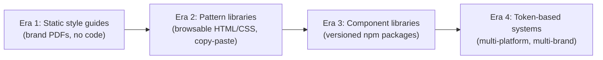
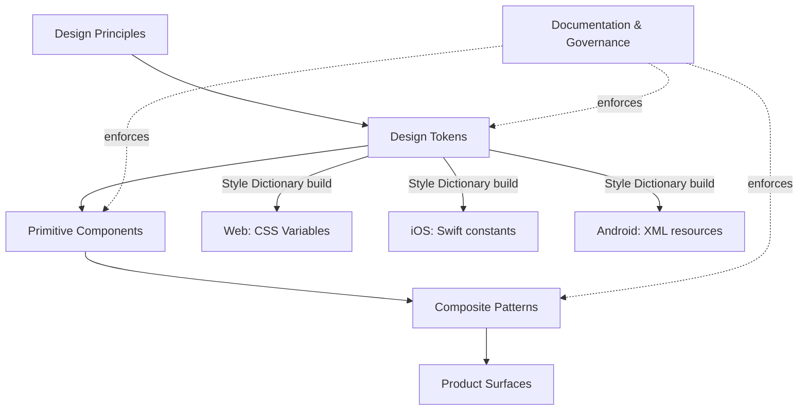

export const metadata = {
  title: "1. What is a Design System?",
  description:
    "First-principles definition, the difference between a component library, pattern library, UI kit and design language, and why large companies invest millions into design systems.",
};

# 1. What is a Design System?

## Definition

A **design system** is the single source of truth that codifies a
product's UI decisions — visual language, interaction patterns, component
behavior, and the code that implements all of it — so that every team
building product surfaces produces consistent, accessible, on-brand
experiences without re-deriving those decisions from scratch each time.

That's the one-sentence version an interviewer wants to hear first. But the
sentence hides the part that actually matters at the senior level: a design
system is not an artifact, it's an **organizational contract**. It is the
thing that lets a 40-person product engineering org ship a checkout flow,
a settings page, and an onboarding wizard in three different teams, in
three different sprints, and have them look and behave like they were built
by the same team on the same day. Strip away the Figma files and the npm
package for a moment and what's left is a governance structure: a decision
about who is allowed to define what "primary button" means, and a
mechanism for that decision to propagate to every consumer without a
design or engineering review catching drift after the fact.

That framing — governance mechanism first, artifact second — is the thread
that ties every other topic in this chapter together, and it's usually the
detail that separates a mid-level answer from a staff-level one in an
interview.

## Problem Statement

Before design systems existed as a discipline, every product team solved
the same UI problems independently, over and over. A checkout team builds
a modal. A settings team, six months later and with zero visibility into
the checkout team's code, builds a slightly different modal — different
padding, different close-icon size, different focus-trap behavior (or
none at all). Multiply that by every button, form field, dropdown, toast,
and empty state across a product with 200 engineers, and you get three
compounding failures:

1. **Brand and UX incoherence.** Users perceive a product as a single
   thing, but if every screen was designed and built in isolation, the
   product *feels* stitched together from different apps. Trust erodes in
   small, hard-to-name ways — a slightly-off shadow here, an
   inconsistent error state there.
2. **Wasted engineering effort.** The same button, the same modal, the
   same date picker gets rebuilt — with the same bugs, the same
   accessibility gaps, the same responsive edge cases — dozens of times
   across an org. This is pure waste: it's effort spent re-solving a
   solved problem instead of shipping product-differentiating features.
3. **Unbounded design debt.** Without a canonical source of truth,
   "consistency" becomes a full-time manual QA job — someone has to
   notice that Team A's spacing scale drifted from Team B's, and by the
   time they notice, dozens of screens already shipped with the drift
   baked in. There is no automated way to catch a violation because there
   was never a codified rule to violate.

A design system is the engineering and design answer to this problem: stop
solving the same UI problem N times, and stop relying on human vigilance
to catch inconsistency after the fact. Solve it once, encode the solution
as tokens, components, and documented rules, and make the encoded solution
easier to reach for than reinventing it.

<Callout type="info" title="The tell in interviews">
  When an interviewer asks "why do we need a design system, we already
  have a component library," they are testing whether you conflate the
  *artifact* (component library) with the *problem it solves*
  (governance + consistency + leverage at scale). Answer the problem, not
  the artifact.
</Callout>

## Why Does This Exist?

Design systems exist because of a scaling law that hits every product
organization once it passes roughly 20–30 engineers or 3–4 product teams:
**communication cost between teams grows faster than headcount**, and UI
consistency is one of the first casualties. Below that scale, a single
designer or a tight-knit team can hold the entire visual language in their
head and enforce it through code review and Slack messages. Above it, that
informal enforcement mechanism collapses — nobody has visibility into
every PR across every team, and design review becomes a bottleneck rather
than a safety net.

There are three concrete forces that make design systems a rational
investment rather than a nice-to-have, and interviewers expect you to be
able to name all three, tied to business outcomes rather than aesthetics:

**Product velocity.** A team building a new feature screen with a mature
design system doesn't design or build buttons, inputs, modals, or layout
primitives from scratch — they compose existing, tested, documented
components. Airbnb's design org has publicly described this as the
difference between "designing pixels" and "designing systems of pixels";
once the system exists, feature teams spend their design and engineering
time on the parts of the product that are actually novel, not on
re-litigating what a checkbox looks like. This is leverage in the literal
sense: one investment (the system) pays a dividend on every future feature
built on top of it.

**Brand consistency at scale.** For a company like Shopify or Atlassian,
the product *is* the brand for most users — they never see a billboard,
they experience the company through the UI every day. A design system is
the mechanism that keeps that experience coherent across a huge and
constantly-changing surface area (Atlassian alone ships Jira, Confluence,
Trello, Bitbucket, and a dozen smaller products) without a central team
manually reviewing every screen.

**Engineering leverage and cost reduction.** This is the number that
actually gets budget approved. A shared, accessible, well-tested Button
component that's used 4,000 times across an org means an accessibility
fix, a performance fix, or a new theming capability ships once and
propagates everywhere via a version bump — instead of requiring 4,000
individual patches across 4,000 hand-rolled buttons. Companies with public
design systems consistently cite this multiplier effect (fewer duplicate
components, fewer accessibility regressions, faster onboarding for new
engineers) as the actual ROI case, not "it looks nicer."

<Callout type="tip" title="How to answer the ROI question">
  If asked to justify design system investment to a skeptical VP, don't
  lead with consistency — lead with the multiplier: N teams no longer
  each independently pay the cost of building, testing, and maintaining
  the same 40 components. One team pays that cost once; N teams pay only
  the (much smaller) cost of integration.
</Callout>

## Historical Context

Understanding *why* today's design systems look the way they do requires
tracing four distinct eras, because the tooling and vocabulary of each era
are still visible as sediment in how teams talk about design systems
today.

### Era 1: Static style guides (pre-2010s)

The earliest form of design consistency documentation was the print-style
brand guide, ported to the web as a static page or PDF: "our primary color
is #0057D8, our headline font is Helvetica Bold at 32px." These were
**design language documents with zero code enforcement**. A developer
could read the PDF and still implement the blue as `#0058D9` because
nothing checked it. Style guides captured *intent*, not *implementation*
— the gap between the two was the entire problem, and it was closed
entirely by manual QA.

### Era 2: Pattern libraries (early–mid 2010s)

As frontend frameworks matured (Backbone, then Angular, then early React),
teams started building living, browsable catalogs of UI patterns — actual
rendered HTML/CSS snippets you could copy, not just pictures in a PDF.
Salesforce's early Lightning Design System and Yelp's Styleguide were
representative of this era. This was a real step forward: the pattern
library was closer to the actual implementation, so drift was smaller. But
patterns were still largely **copy-pasted**, not consumed as a shared
dependency — each team copied the HTML/CSS into their own codebase, which
meant a fix upstream still had to be manually propagated everywhere.

### Era 3: Component-library systems (mid 2010s–2019)

The shift that defines the modern design system era was treating the UI
layer as an actual **versioned software dependency** — a component
library published to a package registry (npm) that product teams `import`
rather than copy. Google's Material Design (2014) and Salesforce Lightning
formalized this: a design language *and* a shipped component
implementation, versioned together, consumed as a real package with a
real API contract. This is also when "design system" as a job title and
discipline (with dedicated design-system engineers and designers)
emerged as its own function distinct from generalist product engineering.

### Era 4: Token-based, multi-platform systems (2019–today)

The current era is defined by two shifts covered in depth in
[design tokens](/chapters/design-tokens): (1) design decisions
(color, spacing, typography) were pulled *out* of component code and
represented as portable, platform-agnostic **design tokens** — JSON-like
key/value data that a build pipeline (Style Dictionary being the
canonical tool) compiles into CSS variables, Swift constants, or Android
XML resources — and (2) systems became explicitly multi-platform and
multi-brand from the ground up, because companies like Adobe (Spectrum)
and IBM (Carbon) needed one design language to drive web, native mobile,
and sometimes embedded/desktop surfaces simultaneously. The W3C Design
Tokens Community Group's format standardization effort (still evolving)
is the clearest signal that this is now treated as core infrastructure,
not a design deliverable.



## How It Works Internally

A mature design system is not one thing — it's a stack of layers, each
one built on the layer below, and each one owned by a slightly different
discipline. Understanding this layering is the single most useful mental
model for both interviews and actually building one, because most
confusing design-system questions ("is this a design system thing or a
component library thing?") resolve immediately once you place the
question at the right layer.

**Layer 1 — Design principles.** The qualitative rules that guide every
decision above them: "clarity over cleverness," "content first," "one
primary action per screen." These rarely appear in code; they appear in
design review conversations and in the rationale sections of component
documentation. Covered in depth later in this chapter.

**Layer 2 — Design tokens.** The atomic, named values — colors, spacing,
type scale, radii, shadows, motion durations — that encode the visual
language as data rather than as hardcoded values in component code. This
is the layer that makes theming, rebranding, and multi-platform output
possible without touching component implementations. Full treatment in
[design tokens](/chapters/design-tokens).

**Layer 3 — Primitive/foundational components.** Buttons, inputs,
checkboxes, typography components — the smallest reusable units, built by
consuming tokens rather than hardcoded values. This is where
architectural patterns like compound components, polymorphism, and
headless composition live; see
[component architecture](/chapters/component-architecture).

**Layer 4 — Composite patterns.** Combinations of primitives that solve a
recurring UX problem — a form-with-validation pattern, a data-table
pattern, a settings-page layout pattern. These are usually *documented*
patterns (sometimes actual shipped components, sometimes just guidance)
rather than single components, because the right composition often
depends on product context.

**Layer 5 — Documentation and governance.** The layer that makes the
other four discoverable, adoptable, and durable: usage guidelines, do/don't
examples, contribution processes, versioning policy, and a support model.
Without this layer, the other four decay — components get built, nobody
finds them, so they get rebuilt elsewhere, and the system's value
proposition (write once, use everywhere) silently fails. Governance is
covered in full in [governance](/chapters/governance).

A design system fails, almost always, at layer 5 rather than layers 1–4.
The technical layers are hard but tractable engineering problems; the
governance layer is an ongoing organizational problem with no permanent
fix, which is why interviewers probe it so heavily (see
[Manager-Level Questions](#manager-level-questions) below and the whole of
[governance](/chapters/governance)).

## Architecture

The layers above compose into a pipeline. Design decisions flow down
through tokens into components, components compose into patterns, and
patterns assemble into product surfaces — with documentation and
governance wrapping every layer to keep it discoverable and enforced.



The two dotted "enforces" edges are worth calling out explicitly, because
they represent the part most junior engineers miss: governance isn't a
layer components pass *through*, it's a constraint applied *to* every
other layer — through lint rules, PR review requirements, contribution
templates, and deprecation policy. A token pipeline with no governance
still technically "works" (it compiles), but nothing stops a second,
conflicting token set from appearing next to it within a quarter.

## Real-World Example

Consider Shopify's **Polaris** design system. Shopify's core product
problem is that merchants — small business owners with no design
background — need to run a complex admin (orders, inventory, payments,
marketing, apps) without feeling overwhelmed. Polaris exists specifically
to solve that: it is opinionated almost to the point of being
prescriptive, with strict guidance on tone of voice, empty states, and
information density, because Shopify decided merchant comprehension
matters more than component flexibility. Polaris also has to serve
**third-party app developers** building inside the Shopify admin — so it
ships not just React components but strict design guidelines and a
review/certification process for apps that want the "Built for Shopify"
badge. That's governance made external: Polaris isn't just an internal
consistency tool, it's the mechanism Shopify uses to keep an entire
third-party ecosystem visually and behaviorally coherent with its own
product, without Shopify engineers reviewing every line of every app.

Contrast that with **Google Material Design**. Material's core problem was
different: Google needed one design language to span an enormous range of
form factors (phone, tablet, wearables, desktop web, TV) and, later,
multiple platform SDKs (Android native, Flutter, web). Material's emphasis
on physically-inspired motion and elevation, and its very strong
opinions about layout grids and responsive breakpoints, come directly from
that cross-platform mandate. Where Polaris optimizes for "a non-designer
merchant can operate a complex admin," Material optimizes for "the same
design language must feel native across radically different device
classes." Same category of tool, different root problem, different
resulting system — this contrast is exactly what interviewers want you to
be able to draw.

## Implementation Example

Design principles and governance are mostly documents, not code — but the
*enforcement* of those principles typically does live in code, most often
as lint rules and typed component APIs that make the "wrong" usage
difficult or impossible rather than merely discouraged in a wiki page. A
concrete, senior-relevant example: encoding a design principle ("only one
primary action per view") directly into a component's type system so a
misuse is a compile error, not a design review comment.

```tsx
// packages/ui/src/components/action-group/action-group.tsx
//
// Design principle: "One primary action per screen." Rather than relying
// on design review to catch a second `variant="primary"` Button slipping
// into a footer, we encode the constraint in the type system: ActionGroup
// only accepts a single element typed as the primary action, and any
// number of secondary actions. A second primary action is now a
// TypeScript error, not a code-review nit that ships anyway under
// deadline pressure.
import type { ReactElement } from "react";
import { Button, type ButtonProps } from "../button/button";

type PrimaryAction = ReactElement<ButtonProps & { variant: "primary" }>;
type SecondaryAction = ReactElement<ButtonProps & { variant?: "secondary" | "tertiary" }>;

interface ActionGroupProps {
  /** Exactly one primary action — the design principle enforced at the type level. */
  primaryAction: PrimaryAction;
  /** Zero or more secondary actions, rendered before the primary action. */
  secondaryActions?: SecondaryAction[];
}

export function ActionGroup({ primaryAction, secondaryActions = [] }: ActionGroupProps) {
  return (
    <div className="action-group" role="group" aria-label="Actions">
      {secondaryActions.map((action, index) => (
        <span key={index} className="action-group__secondary">
          {action}
        </span>
      ))}
      <span className="action-group__primary">{primaryAction}</span>
    </div>
  );
}

// Usage — this compiles:
// <ActionGroup
//   primaryAction={<Button variant="primary">Save</Button>}
//   secondaryActions={[<Button variant="secondary">Cancel</Button>]}
// />

// Usage — this is a TypeScript error, because `primaryAction` requires
// `variant: "primary"` and only accepts a single element, not an array:
// <ActionGroup
//   primaryAction={<Button variant="secondary">Save</Button>}  // ❌ type error
// />
```

This is a small example, but it demonstrates the core idea that separates
a "design system" from "a folder of shared components": the system
actively prevents the class of inconsistency it was built to solve,
rather than merely documenting the rule and hoping engineers read the
docs.

## Advantages

- **Compounding engineering leverage.** A fix to the shared Button
  component (an accessibility bug, a new theming API, a performance
  optimization) ships once and propagates to every consumer on the next
  version bump, instead of requiring N separate patches.
- **Faster time-to-market for new features.** Feature teams compose
  existing, tested primitives instead of re-deriving and re-testing basic
  UI from scratch, which is a direct and measurable velocity gain.
- **Consistent, predictable UX.** Users build muscle memory across a
  product's surfaces because interaction patterns (how a modal closes, how
  form errors are shown) don't vary team to team.
- **Accessibility by default.** Centralizing components means
  accessibility work (focus management, ARIA roles, keyboard nav — see
  [accessibility](/chapters/accessibility)) is done once by
  specialists and inherited by every consumer, rather than being
  re-attempted (often incorrectly) by every feature team.
- **Lower onboarding cost.** A new engineer joining any product team
  learns one component API and one set of conventions, not a different
  bespoke UI layer per team.
- **Brand and design coherence at scale**, without requiring a central
  design team to manually review every screen shipped across the org.

## Disadvantages

- **Real upfront and ongoing cost.** A design system needs a dedicated
  team (designers, engineers, sometimes a PM) that produces no
  user-facing feature work directly — that's a real cost center that has
  to be justified continuously, not just once at founding.
- **Adoption friction and the "not invented here" problem.** Product
  teams under deadline pressure will route around a design system that's
  missing a component they need, or one whose API doesn't fit their case,
  creating shadow components that undermine the whole point.
- **Governance overhead.** RFCs, contribution review, versioning
  discipline — see [governance](/chapters/governance) — are
  genuinely slow compared to a single team just building whatever it
  wants, and that slowness is a legitimate complaint, not just resistance
  to change.
- **Risk of over-abstraction.** A system built too early, before enough
  real usage patterns exist to generalize from, tends to guess wrong about
  what should be configurable — producing components with either too few
  escape hatches (teams can't do what they need) or too many (an
  unmaintainable prop-explosion API).
- **Coupling and blast radius.** Because so many surfaces depend on the
  same shared code, a breaking change or a subtle regression in a core
  primitive can simultaneously break dozens of product surfaces at once —
  the same leverage that makes fixes powerful also makes mistakes
  expensive.

## Alternatives

"Design system" is often used loosely to mean any of several related but
distinct artifacts. Conflating them is one of the most common interview
tells of someone who hasn't actually built one. Here is the precise
breakdown, which is itself one of the required topics for this chapter.

| Dimension | UI Kit | Pattern Library | Component Library | Design System |
| --- | --- | --- | --- | --- |
| What it is | A set of static visual assets (usually Figma/Sketch files) — buttons, icons, colors, as pictures | A browsable catalog of reusable UI *patterns*, often as markup/CSS snippets or copy-paste code | A versioned, installable package of coded, interactive UI components (e.g. an npm package) | The full stack: principles + tokens + component library + patterns + documentation + governance |
| What problem it solves | Gives designers a consistent visual starting point in design tools | Gives engineers a reference implementation to copy for common UI patterns | Gives engineers a single shared, tested, accessible implementation to *depend on*, not copy | Gives the whole org (design + engineering + product) one enforced source of truth across every layer |
| Why it was created | Designers needed a shared visual starting point before code existed at all | Engineers needed faster-than-scratch reference markup once frontend frameworks matured | Package registries (npm) made "depend on, don't copy" UI code practical | Team/product count outgrew what informal coordination and a component library alone could keep coherent |
| Who owns it | Usually design alone | Usually engineering, loosely coordinated with design | A dedicated design-system/platform engineering team | A cross-functional dedicated team (design + engineering + sometimes PM) |
| Code enforcement | None — it's pictures, not code | Weak — copied code drifts from the source immediately | Strong — a shared dependency; a bug fix ships to every consumer | Strong, plus process enforcement (RFCs, review, versioning policy) |
| Performance | N/A — no runtime footprint | Whatever the copied code's quality happens to be; no shared optimization | Consistent, since every consumer runs the same optimized, shared implementation | Same as component library, plus token-driven theming with no extra runtime cost when done well |
| Developer experience | Poor for engineers — pictures require manual re-implementation in code | Fast to start, but re-implementing per team; no version upgrades or fixes | Good — install, import, get fixes via version bumps | Best — components, tokens, and docs discoverable in one coherent, documented system |
| Learning curve | Very low | Low | Low-to-moderate (package API, versioning) | Moderate (principles, tokens, governance process, plus the component API) |
| Community / ecosystem support | Tooling-dependent (Figma community files) only | Rare to have real ecosystem tooling around it | Strong for popular libraries (npm ecosystem, TS types, testing tooling) | Strongest for well-known systems (Material, Carbon, Spectrum) — large community, plugins, integrations |
| Maintenance burden | Low effort, but high drift risk since nothing keeps it in sync with code | Rises with every consuming team, since each copy must be independently updated | Centralized — one team maintains, many teams benefit | Highest upfront (principles, tokens, governance, components all maintained together), but lowest per-consumer over time |
| Enterprise suitability | Low alone — insufficient for engineering consistency at scale | Low-to-moderate — breaks down past a handful of consuming teams | High for mid-size orgs with 2+ product surfaces | Highest — this is the standard for large, multi-team, multi-platform orgs (Google, Shopify, Atlassian, IBM, Adobe) |
| When to choose it | Early-stage product, design still exploring visual direction | You need shared reference code fast and don't yet have engineering bandwidth for a real package | You have 2+ teams that need to *consume*, not copy, the same components | You have brand, platform, and team-count pressure that a component library alone can't solve |
| When NOT to choose it | Once you have real shipped code — a UI kit alone will drift from implementation immediately | Once you have more than a couple of consuming teams — copy-paste drift becomes unmanageable | If you have no governance/versioning discipline, a component library becomes "just another shared folder people are afraid to touch" | If you're a single small team on one product — the governance overhead outweighs the benefit |

The practical distinction interviewers actually care about is **artifact
vs. dependency vs. system**. A UI kit is pixels, not code — it cannot
drift-check itself against what's shipped. A pattern library is code, but
copied, so it drifts the moment the source changes and nobody
re-propagates it. A component library is a real dependency — consumers
get fixes automatically via version bumps — but it says nothing about
*process*: who can add a component, how breaking changes are
communicated, what happens when two teams need conflicting variants. A
design system is the component library *plus* the tokens, principles, and
governance that keep the whole thing coherent as the org and product
surface area grow. Large companies invest specifically in the last one
because at their scale, the failure mode isn't "we don't have a Button
component" — it's "we have eleven Button components, and nobody knows
which one is canonical."

## Tradeoffs

The central tradeoff in deciding *how much* design system to build is
speed of the individual team versus coherence of the whole product. A
fully centralized system with strict governance maximizes coherence but
slows down any team that needs something the system doesn't yet support —
they either wait for an RFC to land or fork. A loose, lightly-governed
shared component library maximizes individual team speed but degrades
into UI Kit-with-extra-steps as teams patch around gaps locally instead of
contributing back. Most mature orgs land on a **federated contribution
model** (detailed in [governance](/chapters/governance)) specifically
to manage this tradeoff — a small core team owns primitives and the
approval bar for anything shared, while product teams can contribute
composite patterns through a lighter-weight review process.

A second tradeoff worth naming explicitly: **investing early versus
investing late**. Building a design system before a company has enough
product surface area to generalize from is a classic and expensive
mistake — you end up encoding assumptions from one team's UI needs as if
they were universal, and have to walk them back later. Waiting too long
means dozens of divergent, undocumented UI implementations have already
calcified, and migration cost balloons. In practice, the signal to start
seriously investing is when a second product team needs the same
component the first team already built — that's the first real evidence
of shared need, versus speculative generalization.

## Performance Considerations

At the "what is a design system" level, performance is mostly about the
system's *build and delivery* characteristics rather than runtime
rendering (covered in depth in [performance](/chapters/performance)).
Two things matter here specifically:

- **Bundle size discipline as a governance concern, not just a technical
  one.** Every component added to the shared library is now shipped to
  every consumer that imports from the package (unless the package is
  properly tree-shakeable — see [packaging](/chapters/packaging)).
  A governance process that doesn't weigh bundle-size impact when
  approving new components will quietly bloat every product built on top
  of it.
- **Documentation-site performance is part of adoption, not a side
  concern.** If a design system's own documentation site (usually
  Storybook — see [Storybook](/chapters/storybook)) is slow or hard
  to search, engineers under deadline pressure will skip it and hand-roll
  a component instead, defeating the entire point of having built the
  system.

## Scalability Considerations

Scalability for a design system means two different things depending on
axis: scaling to **more consumers** and scaling to **more platforms/
brands**.

Scaling to more consumers is primarily an organizational and governance
problem: as team count grows, so does the volume of feature requests,
edge cases, and conflicting needs directed at the core team. This is why
mature systems adopt tiered contribution models and RFC processes (see
[governance](/chapters/governance)) — without a formal process, the
core team becomes a bottleneck that scales linearly with consumer count,
which doesn't work past a certain org size.

Scaling to more platforms and brands is primarily a token-architecture
problem. A system built with hardcoded colors baked into component CSS
cannot support a second brand or a dark mode without a rewrite; a system
built on a proper token hierarchy (see [design tokens](/chapters/design-tokens))
can add a second brand or theme as a new token *value* set, with zero
changes to component code. IBM Carbon and Adobe Spectrum are the
canonical examples of systems architected explicitly for this axis of
scale — Carbon spans dozens of IBM product lines, and Spectrum spans
every Adobe creative and enterprise product across web, desktop, and
mobile.

## Common Mistakes

<Callout type="danger" title="Building the system before there's a second consumer">
  Generalizing from a single team's UI needs produces a system that
  encodes that one team's assumptions as if they were universal. The
  fix that's usually needed six months later — relaxing constraints that
  were never actually general — is more expensive than waiting for a
  second real consumer to validate the API first.
</Callout>

<Callout type="danger" title="Treating the design system as 'the component library'">
  Teams that ship a shared npm package and call it done are surprised
  when consistency still degrades — because they never built the
  documentation, governance, and enforcement layers that make the
  component library durable. The component library is necessary but not
  sufficient.
</Callout>

<Callout type="danger" title="No deprecation or migration path for breaking changes">
  Publishing a v2 of a core primitive without a codemod or a clear
  migration guide guarantees teams stay pinned to v1 indefinitely,
  fragmenting the very consistency the system exists to provide. See
  [governance](/chapters/governance) for the migration tooling this
  requires.
</Callout>

<Callout type="danger" title="No metric for adoption or health">
  Teams that don't track "% of UI surface using the design system" or
  count shadow/duplicate components have no way to know whether the
  system is actually succeeding versus quietly being routed around under
  deadline pressure.
</Callout>

## Best Practices

- Start from real, repeated pain across at least two teams — not
  speculative generalization from a single team's needs.
- Invest in documentation and discoverability as seriously as in the
  components themselves; an unused component that nobody can find has
  delivered zero value regardless of its code quality.
- Define design principles explicitly and in writing early — they are the
  tie-breaker in every ambiguous API or visual decision that follows, and
  without them every debate re-litigates from scratch.
- Build governance (contribution model, RFC process, versioning policy —
  see [governance](/chapters/governance)) at the same time as the
  first components, not as an afterthought once inconsistency has already
  crept in.
- Track adoption metrics (usage percentage, shadow-component count,
  support ticket volume) and treat a dip in adoption as a signal to
  investigate friction, not as a discipline problem to escalate.
- Architect for tokens (see [design tokens](/chapters/design-tokens))
  from day one even with a single brand — retrofitting token-based
  theming onto components with hardcoded values is a much larger project
  than building it in from the start.

## Interview Questions

<InterviewQuestion q="What's the difference between a component library and a design system?">
  **What the interviewer is testing:** Whether you understand that a
  design system is a superset that includes governance, principles, and
  documentation — not just shipped code — and can articulate the
  distinction precisely rather than treating the terms as synonyms.

  **Poor answer:** "They're basically the same thing, just different
  names."

  **Good answer:** A component library is the coded implementation; a
  design system also includes design tokens, principles, documentation,
  and governance around how the components are used and evolved.

  **Excellent senior answer:** Adds that the practical failure mode of
  conflating them is organizational: a team that ships a component
  library and calls it "the design system" gets surprised when
  consistency still degrades, because nobody owns the RFC process,
  deprecation policy, or adoption metrics — the parts that keep the
  library from fragmenting as more teams consume it.

  **Common mistakes:** Describing only the visual/code layer and never
  mentioning governance, ownership, or process at all.
</InterviewQuestion>

<InterviewQuestion q="A UI kit, a pattern library, and a component library all sound similar — how would you distinguish them to a new PM on your team?">
  **What the interviewer is testing:** Precision under a request to
  simplify — can you compress an accurate technical distinction for a
  non-technical audience without losing the part that matters.

  **Poor answer:** "They're all just different names for the same design
  files."

  **Good answer:** UI kit = pictures for designers; pattern library =
  copyable reference code; component library = a real shared dependency
  that ships fixes to every consumer automatically.

  **Excellent senior answer:** Frames the distinction around *drift risk*:
  a UI kit and pattern library can silently diverge from what's actually
  shipped because nothing enforces the connection, while a component
  library (as a real npm dependency) mechanically cannot drift from
  itself — every consumer is running the same code, versioned explicitly.

  **Common mistakes:** Treating "component library" and "design system"
  as interchangeable in the same breath as explaining the other two.
</InterviewQuestion>

<InterviewQuestion q="Why would a company with only one product still invest in a design system?">
  **What the interviewer is testing:** Whether you understand that design
  systems solve team-scaling problems, not just multi-product problems —
  a single product built by many teams has the exact same consistency
  and duplication pressures as multiple products.

  **Poor answer:** "They probably wouldn't need one — design systems are
  for companies with multiple products."

  **Good answer:** Even a single product, once built by enough separate
  teams (checkout, settings, onboarding, etc.), has the same
  consistency-drift and duplicated-effort problem multi-product companies
  have.

  **Excellent senior answer:** Names the actual scaling signal (roughly
  20-30+ engineers or 3-4+ semi-independent teams working on the same
  product) and explains that below that threshold, informal
  coordination (a small design team, code review) is genuinely sufficient
  and a formal design system would be premature overhead.

  **Common mistakes:** Assuming "design system" only makes sense for
  companies with literally multiple branded products.
</InterviewQuestion>

<InterviewQuestion q="How would you explain why Shopify Polaris and Google Material Design look and feel so different, given they're both 'design systems'?">
  **What the interviewer is testing:** Whether you can connect a design
  system's concrete characteristics back to the actual business/product
  problem it was built to solve, rather than treating design systems as
  interchangeable, generic artifacts.

  **Poor answer:** "Different companies just have different taste."

  **Good answer:** Polaris optimizes for non-designer merchants operating
  a complex admin; Material optimizes for one language spanning many
  device form factors and platforms.

  **Excellent senior answer:** Extends this into a general principle: a
  design system's opinionatedness and structure are downstream of its
  root constraint (audience sophistication, platform diversity, brand
  singularity vs. multi-brand needs) — so "which design system is better"
  is usually a category error; the right question is which one's
  constraints match your own.

  **Common mistakes:** Comparing them purely on visual style (flat vs.
  skeuomorphic, color choices) without connecting the differences to the
  underlying product problem each was built to solve.
</InterviewQuestion>

<InterviewQuestion q="What's the actual mechanism by which a design system prevents inconsistency, rather than just documenting it?">
  **What the interviewer is testing:** Depth beyond the marketing
  pitch — can you name the concrete enforcement mechanisms (typed APIs,
  shared dependency versioning, lint rules, visual regression tests, PR
  review gates) rather than vaguely asserting that systems "help with
  consistency."

  **Poor answer:** "It has all the components documented so people use
  them."

  **Good answer:** Because components are a shared dependency, a fix or
  constraint enforced in the component ships to every consumer
  automatically via version bump, rather than relying on every team
  independently reading and following documentation.

  **Excellent senior answer:** Gives a concrete example of encoding a
  design rule in the type system or component API (e.g., an API that
  makes "two primary buttons in one view" a compile error, not just a
  documented convention) and connects it to the more general principle
  that documentation alone never fully prevents drift — code-level and
  process-level enforcement (lint rules, visual regression, RFC-gated
  contribution) does the actual preventing.

  **Common mistakes:** Describing the *contents* of the system
  (components, tokens, docs) without describing the *enforcement
  mechanism* that keeps consumers from deviating from them.
</InterviewQuestion>

<InterviewQuestion q="If you joined a company with no design system and five different product teams, how would you decide what to build first?">
  **What the interviewer is testing:** Prioritization instinct and
  whether you'd default to building speculative infrastructure versus
  starting from evidenced, repeated pain.

  **Poor answer:** "I'd start by building a comprehensive component
  library covering every common UI need."

  **Good answer:** Audit the five teams' existing UI for the components
  that are duplicated most often and causing the most visible
  inconsistency or bug volume, and start there.

  **Excellent senior answer:** Adds that the first deliverable should be
  narrow and proven (tokens + 3-5 highest-leverage primitives, like
  Button/Input/Typography) with a real second consumer validating the
  API before expanding, plus lightweight governance (even just an
  informal RFC doc) from day one — rather than a big-bang comprehensive
  system that risks encoding one team's assumptions as universal.

  **Common mistakes:** Jumping straight to "build everything" or
  "pick a component library like MUI" without first establishing what the
  org's actual, evidenced pain points are.
</InterviewQuestion>

## Manager-Level Questions

<ManagerQuestion q="How would you get a resistant team to adopt the design system instead of building their own components?">
  **What the interviewer is testing:** Influence without authority — the
  core skill of a design-system lead, since they rarely have the org
  power to mandate adoption directly.

  **Poor answer:** "I'd escalate to their engineering manager and get it
  mandated from above."

  **Good answer:** Find the team's actual pain point (a bug they keep
  re-fixing, a slow build) and show the design system solves it directly,
  rather than leading with a consistency argument they don't feel
  personally.

  **Excellent senior answer:** Adds a concrete adoption mechanism — a
  low-friction migration path (codemod, side-by-side compatibility
  period), a named point of contact for their specific edge cases so they
  don't feel abandoned mid-migration, and a success metric tracked
  publicly so the win is visible to their own leadership, not just to the
  design system team.

  **Common mistakes:** Relying purely on top-down mandate, which breeds
  resentment and shadow non-compliance even when it technically "works."
</ManagerQuestion>

<ManagerQuestion q="How do you decide when a design system investment has paid for itself, and how would you communicate that to leadership?">
  **What the interviewer is testing:** Whether you can translate design
  system work into business metrics leadership actually tracks, not just
  engineering-internal metrics.

  **Poor answer:** "It's pretty clearly better once most teams are using
  it."

  **Good answer:** Track concrete metrics — component adoption
  percentage across teams, reduction in duplicate/shadow components,
  time-to-ship for new features using system components vs. historical
  baseline, and accessibility/bug regression rates.

  **Excellent senior answer:** Frames these metrics as a dashboard
  reviewed on a cadence (quarterly), ties at least one metric directly to
  a cost leadership already tracks (engineering hours saved, incident
  count from UI bugs), and is honest that some value (brand coherence,
  onboarding speed) is real but harder to quantify — naming that tradeoff
  explicitly rather than overclaiming precision on soft metrics.

  **Common mistakes:** Presenting only qualitative wins ("it looks more
  consistent now") with no quantitative backing, which doesn't survive a
  budget review.
</ManagerQuestion>

<ManagerQuestion q="Two teams disagree about whether a new component belongs in the shared design system or should stay team-owned. How do you resolve it?">
  **What the interviewer is testing:** Governance judgment — whether you
  have a repeatable decision framework rather than resolving each
  conflict ad hoc based on whoever argues loudest.

  **Poor answer:** "I'd just make the call myself as the design system
  owner."

  **Good answer:** Apply a consistent rule: if a second team has a
  genuine, similar need, it likely belongs in the shared system; if it's
  a one-off need specific to one team's domain, it should stay
  team-owned, possibly built on top of shared primitives.

  **Excellent senior answer:** Names the actual criteria in more detail —
  reusability evidence (not just claimed, actually observed), whether the
  component encodes a general pattern or team-specific business logic,
  and the ongoing maintenance cost the core team would take on — and
  describes routing genuinely ambiguous cases through the RFC process
  (see [governance](/chapters/governance)) rather than a unilateral
  personal decision, so the resolution is legitimate and repeatable.

  **Common mistakes:** Deciding based on team seniority/politics rather
  than a consistent, transparent set of criteria applied the same way
  every time.
</ManagerQuestion>

## Summary

A design system is best understood as an organizational contract enforced
through code, not merely a component library or a set of Figma files. It
exists because, past a certain team- and product-scale, informal
coordination (code review, tribal knowledge, a shared Slack channel)
stops being sufficient to prevent UI inconsistency and duplicated effort —
and the cost of that failure compounds with every additional team and
screen. The precise vocabulary matters in interviews: a UI kit is static
design assets with zero code enforcement; a pattern library is copyable
reference code that drifts from its source the moment it's copied; a
component library is a real, versioned dependency that mechanically
cannot drift from itself; and a design system is the full stack —
principles, tokens, components, patterns, documentation, and governance —
that keeps all of the above coherent as an org scales. Historically,
systems evolved from static style guides, through browsable pattern
libraries, to versioned component-library packages, to today's
token-based, multi-platform, multi-brand systems — a progression driven
by the same underlying pressure each time: closing the gap between
documented intent and shipped implementation. Real-world systems like
Polaris, Material, Carbon, and Spectrum look different from each other
specifically because they were built to solve different root constraints
(non-designer audience, cross-platform form factors, multi-product-line
brand coherence, cross-application creative-tool consistency), which is
the frame to reach for whenever asked to compare them.

**Key takeaways**

- A design system is an enforced organizational contract, not just a
  component library or a Figma file.
- UI kit, pattern library, component library, and design system are
  distinct artifacts with increasing levels of code enforcement and
  governance — conflating them is a common interview tell.
- Design systems exist to solve velocity, brand-consistency, and
  engineering-leverage problems that emerge specifically at team/product
  scale, not as an aesthetic nicety.
- The historical arc (style guides → pattern libraries → component
  libraries → token-based multi-platform systems) reflects a consistent
  drive to close the gap between documented design intent and shipped
  code.
- Real systems (Polaris, Material, Carbon, Spectrum) differ because they
  were built to solve different root constraints — always tie
  comparisons back to the underlying product problem.
- Documentation and governance are the layer that most often determines
  success or failure — not component code quality.

Continue to [design tokens](/chapters/design-tokens) for how the
visual-language layer of a design system is actually represented as data
and compiled across platforms.
